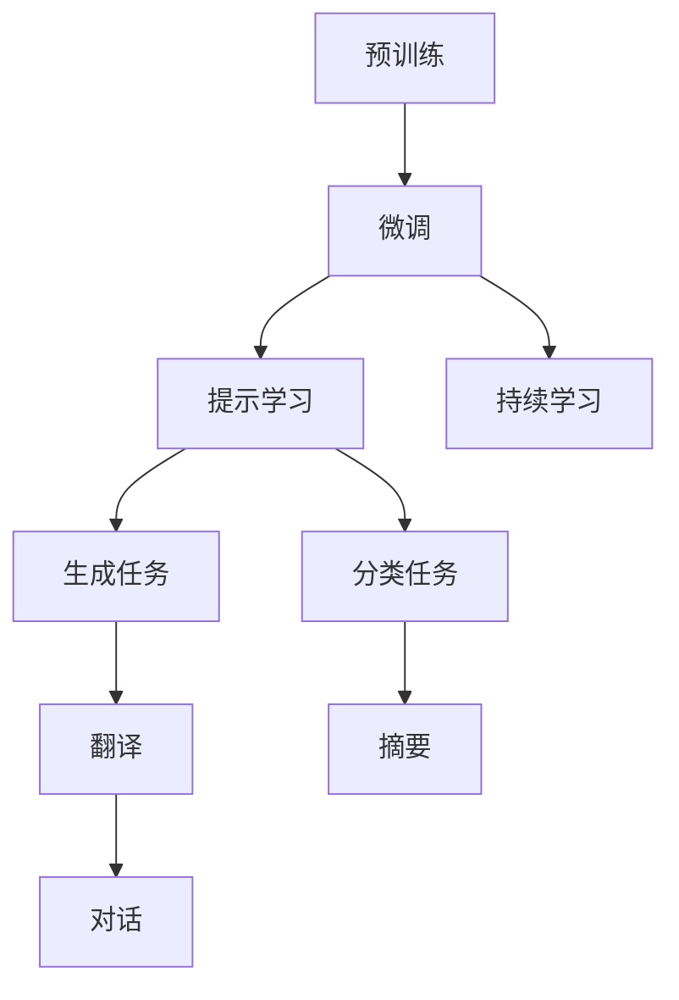

                 

# LLM生态：AI产业的新增长点

大语言模型(Large Language Model, LLM)正逐步成为人工智能领域的核心技术之一。LLM不仅可以自动生成高质量的文本，还能应用于问答、对话系统、翻译、摘要生成、情感分析等多个场景，展现出广阔的应用前景。本文将围绕LLM的核心概念、算法原理、实践应用及未来发展趋势进行详细探讨，期望为AI产业带来新的增长点。

## 1. 背景介绍

### 1.1 问题由来

随着深度学习技术的发展，LLM在自然语言处理(NLP)领域取得了显著进展。这些模型通过在海量文本数据上自监督预训练，学习到了丰富的语言知识和表达能力。以GPT-3和BERT为代表的大模型，展示了惊人的文本生成和理解能力，极大地推动了NLP技术的应用。然而，这些模型也面临着数据消耗量大、计算资源要求高、模型难以解释等挑战。

### 1.2 问题核心关键点

LLM的核心技术包括：
1. **预训练**：在无标签数据上进行自监督学习，学习语言表征。
2. **微调**：在特定任务上进行有监督学习，优化模型性能。
3. **提示学习**：通过精心设计的输入模板，引导模型产生期望的输出，减少微调参数。
4. **持续学习**：模型能不断从新数据中学习，保持知识和能力的时效性。

这些技术手段使LLM在各种NLP任务上取得了优异的表现，但也带来了数据隐私、伦理责任等新的问题。如何平衡这些利弊，充分发挥LLM的潜力，是当前研究的重点。

## 2. 核心概念与联系

### 2.1 核心概念概述

LLM的核心概念包括：
- **预训练**：在无标签文本数据上进行自监督学习，学习语言表征。
- **微调**：在预训练模型的基础上，利用少量标注数据进行有监督学习，优化特定任务性能。
- **提示学习**：通过设计输入模板，引导模型产生期望的输出，减少微调参数。
- **持续学习**：模型能不断从新数据中学习，保持知识和能力的时效性。

这些概念之间存在密切的联系。预训练模型提供了丰富的语言知识，微调和提示学习使其能适应特定任务，持续学习则保持了模型的长期效用。

### 2.2 核心概念原理和架构的 Mermaid 流程图



这个流程图展示了LLM的核心概念和其应用场景，包括生成、分类、翻译、摘要、对话等多个任务。预训练模型提供了基础语言知识，微调根据任务需求进行调整，提示学习在较少参数的情况下实现高效推理，持续学习保持模型时效性。

## 3. 核心算法原理 & 具体操作步骤

### 3.1 算法原理概述

LLM的核心算法主要包括预训练、微调和持续学习等技术手段。预训练模型通过自监督学习，学习语言表征，为特定任务提供了丰富的知识基础。微调在少量标注数据上进行有监督学习，优化模型在特定任务上的性能。持续学习则使模型能不断从新数据中学习，保持其长期效用。

### 3.2 算法步骤详解

#### 3.2.1 预训练模型构建

预训练模型通常采用自监督学习任务，如语言建模、掩码语言模型、文本分类等。以BERT为例，其构建过程如下：
1. 收集大规模无标签文本数据。
2. 设计自监督学习任务，如掩码语言模型，即随机遮盖部分单词，预测遮盖位置的单词。
3. 构建预训练模型，使用Transformer等架构，进行大规模训练。

#### 3.2.2 微调模型训练

微调模型通常采用有监督学习任务，如分类、生成等。以BERT为例，其微调过程如下：
1. 收集少量标注数据，设计合适的任务适配层。
2. 冻结预训练模型的部分层，只微调顶层。
3. 设置合适的学习率和优化器，如AdamW。
4. 在标注数据上进行小批量梯度下降训练，优化模型性能。

#### 3.2.3 持续学习机制

持续学习机制使模型能不断从新数据中学习，保持其长期效用。以BERT为例，其持续学习过程如下：
1. 定期收集新数据，进行微调。
2. 使用增量学习技术，只更新新数据相关的参数。
3. 保持旧数据相关的参数不变，避免灾难性遗忘。

### 3.3 算法优缺点

#### 3.3.1 优点

- **高效性**：预训练模型提供了丰富的知识基础，微调过程可快速适应特定任务。
- **通用性**：预训练模型适用于各种NLP任务，微调使其能适应特定任务。
- **可解释性**：微调模型可解释性强，有助于理解模型决策过程。
- **数据需求低**：微调模型对标注数据的需求较低，适合数据稀缺场景。

#### 3.3.2 缺点

- **计算成本高**：预训练和微调过程计算资源需求高。
- **过拟合风险**：微调过程容易过拟合，特别是在数据量较小的情况下。
- **模型复杂性**：预训练模型参数量巨大，难以解释。
- **隐私风险**：预训练模型可能学习到敏感信息，带来隐私风险。

### 3.4 算法应用领域

LLM在多个领域展现了广泛的应用前景，包括：
1. **自然语言理解**：如命名实体识别、情感分析、意图识别等。
2. **自然语言生成**：如机器翻译、文本摘要、对话生成等。
3. **信息检索**：如搜索引擎、问答系统等。
4. **知识图谱构建**：如实体关系抽取、知识融合等。
5. **辅助决策**：如法律咨询、医疗诊断等。

## 4. 数学模型和公式 & 详细讲解 & 举例说明

### 4.1 数学模型构建

以BERT为例，其预训练和微调过程的数学模型如下：
- 预训练模型：$L = \frac{1}{N}\sum_{i=1}^N \ell(M(x_i),y_i)$
- 微调模型：$\hat{L} = \frac{1}{N}\sum_{i=1}^N \ell(M_{\theta}(x_i),y_i)$

其中，$M$ 为预训练模型，$M_{\theta}$ 为微调模型，$\ell$ 为损失函数。

### 4.2 公式推导过程

以BERT为例，其微调过程的损失函数推导如下：
1. 设计任务适配层，如线性分类器，将模型输出映射到任务标签空间。
2. 设定损失函数，如交叉熵损失。
3. 使用梯度下降算法优化模型参数，最小化损失函数。

### 4.3 案例分析与讲解

以命名实体识别(NER)任务为例，其微调过程的详细实现如下：
1. 收集命名实体标注数据，设计数据集。
2. 使用BERT模型进行微调，设定适当的损失函数。
3. 在微调过程中，使用AdamW优化器，设置合适的学习率。
4. 在微调过程中，使用Dropout等正则化技术防止过拟合。

## 5. 项目实践：代码实例和详细解释说明

### 5.1 开发环境搭建

开发环境搭建如下：
1. 安装Anaconda：`conda install anaconda`
2. 创建虚拟环境：`conda create --name bert-env python=3.8`
3. 激活虚拟环境：`conda activate bert-env`
4. 安装必要的库：`pip install transformers torch sklearn pandas`

### 5.2 源代码详细实现

以BERT微调为例，其代码实现如下：
```python
from transformers import BertForTokenClassification, BertTokenizer, AdamW
from torch.utils.data import DataLoader
from sklearn.metrics import accuracy_score

# 构建模型
model = BertForTokenClassification.from_pretrained('bert-base-cased')
tokenizer = BertTokenizer.from_pretrained('bert-base-cased')

# 准备数据集
train_dataset = ...  # 训练集
dev_dataset = ...    # 验证集
test_dataset = ...   # 测试集

# 微调模型
device = 'cuda' if torch.cuda.is_available() else 'cpu'
model.to(device)
optimizer = AdamW(model.parameters(), lr=2e-5)
epochs = 5

for epoch in range(epochs):
    model.train()
    train_loss = 0.0
    for batch in DataLoader(train_dataset, batch_size=16):
        input_ids = batch['input_ids'].to(device)
        attention_mask = batch['attention_mask'].to(device)
        labels = batch['labels'].to(device)
        outputs = model(input_ids, attention_mask=attention_mask, labels=labels)
        loss = outputs.loss
        train_loss += loss.item()
        optimizer.zero_grad()
        loss.backward()
        optimizer.step()
    print(f'Epoch {epoch+1}, Train Loss: {train_loss/len(train_dataset)}')

    model.eval()
    dev_loss = 0.0
    for batch in DataLoader(dev_dataset, batch_size=16):
        input_ids = batch['input_ids'].to(device)
        attention_mask = batch['attention_mask'].to(device)
        labels = batch['labels'].to(device)
        with torch.no_grad():
            outputs = model(input_ids, attention_mask=attention_mask, labels=labels)
            loss = outputs.loss
            dev_loss += loss.item()
    print(f'Epoch {epoch+1}, Dev Loss: {dev_loss/len(dev_dataset)}')

    model.eval()
    test_loss = 0.0
    for batch in DataLoader(test_dataset, batch_size=16):
        input_ids = batch['input_ids'].to(device)
        attention_mask = batch['attention_mask'].to(device)
        labels = batch['labels'].to(device)
        with torch.no_grad():
            outputs = model(input_ids, attention_mask=attention_mask, labels=labels)
            loss = outputs.loss
            test_loss += loss.item()
    print(f'Epoch {epoch+1}, Test Loss: {test_loss/len(test_dataset)}')
```

### 5.3 代码解读与分析

代码主要分为模型构建、数据准备、微调训练、验证测试四个部分。
1. 构建模型：使用BERTForTokenClassification类加载预训练模型，并设置微调层。
2. 准备数据：将数据集划分为训练集、验证集和测试集，并进行数据预处理。
3. 训练模型：使用AdamW优化器进行微调训练，并在每个epoch输出训练和验证的损失。
4. 测试模型：在测试集上进行模型评估，输出测试损失。

## 6. 实际应用场景

### 6.1 智能客服系统

智能客服系统可基于预训练大模型，结合用户历史数据进行微调，构建对话模型。对话模型能够自动理解用户意图，匹配最合适的答案模板，提供自然流畅的回复。该系统可7x24小时不间断服务，快速响应客户咨询，提升客户满意度。

### 6.2 金融舆情监测

金融机构可以利用微调模型进行舆情监测。系统自动从新闻、报道、评论中提取信息，识别情感倾向和主题，评估市场情绪，预测潜在的金融风险。该系统可实时分析海量数据，为金融机构提供及时决策支持。

### 6.3 个性化推荐系统

个性化推荐系统可基于微调模型进行用户兴趣分析。系统自动从用户行为数据中提取信息，微调生成推荐算法，提供个性化推荐内容。该系统可根据用户历史行为和实时行为，不断调整推荐策略，提升推荐效果。

### 6.4 未来应用展望

未来，预训练大模型和微调技术将进一步拓展应用场景。其应用将涵盖智慧医疗、智能教育、智慧城市等多个领域，为各行各业带来变革性影响。

## 7. 工具和资源推荐

### 7.1 学习资源推荐

1. 《Natural Language Processing with Transformers》书籍
2. CS224N《深度学习自然语言处理》课程
3. HuggingFace官方文档
4. Weights & Biases
5. TensorBoard

### 7.2 开发工具推荐

1. PyTorch
2. TensorFlow
3. Transformers库
4. Weights & Biases
5. TensorBoard

### 7.3 相关论文推荐

1. Attention is All You Need
2. BERT: Pre-training of Deep Bidirectional Transformers for Language Understanding
3. Language Models are Unsupervised Multitask Learners
4. Parameter-Efficient Transfer Learning for NLP
5. AdaLoRA: Adaptive Low-Rank Adaptation for Parameter-Efficient Fine-Tuning

## 8. 总结：未来发展趋势与挑战

### 8.1 研究成果总结

预训练大模型和微调技术在NLP领域取得了显著进展，推动了NLP技术的应用。当前研究的重点是提升模型的可解释性、鲁棒性和跨领域迁移能力。

### 8.2 未来发展趋势

1. 预训练大模型的参数量将进一步增大，学习更多语言知识。
2. 微调技术将更加多样，参数高效微调等方法将广泛应用。
3. 持续学习将更加普及，保持模型时效性。
4. 提示学习将进一步发展，减少微调参数。
5. 多模态微调将兴起，融合视觉、语音等多模态信息。

### 8.3 面临的挑战

1. 计算资源需求高，硬件瓶颈待突破。
2. 过拟合风险大，需要改进优化技术。
3. 模型可解释性不足，需要加强研究。
4. 隐私风险高，需要数据保护技术。
5. 模型复杂度高，需要简化架构。

### 8.4 研究展望

1. 探索无监督和半监督微调方法，降低标注成本。
2. 开发参数高效和计算高效的微调范式，提升模型效率。
3. 融合因果和对比学习范式，增强模型鲁棒性。
4. 引入更多先验知识，提高模型通用性。
5. 结合因果分析和博弈论工具，增强模型可解释性。
6. 纳入伦理道德约束，确保模型安全性。

## 9. 附录：常见问题与解答

**Q1: 预训练大模型有哪些优点？**

A: 预训练大模型具有以下优点：
1. 学习丰富的语言知识，提高模型性能。
2. 适用于多种NLP任务，提升任务多样性。
3. 可解释性强，便于理解和调试。
4. 数据需求低，适合数据稀缺场景。

**Q2: 微调过程需要注意哪些问题？**

A: 微调过程中需要注意以下问题：
1. 选择合适的学习率，避免破坏预训练权重。
2. 使用正则化技术，防止过拟合。
3. 保留预训练模型部分层，减少微调参数。
4. 数据增强，丰富训练集多样性。
5. 对抗训练，提高模型鲁棒性。

**Q3: 如何提高微调模型的可解释性？**

A: 提高微调模型的可解释性，可以采用以下方法：
1. 使用注意力机制，分析模型注意力分布。
2. 使用可解释的微调方法，如Prompt-based Learning。
3. 使用可解释的模型架构，如LSTM、CNN等。

**Q4: 如何平衡模型性能和计算资源需求？**

A: 平衡模型性能和计算资源需求，可以采用以下方法：
1. 参数高效微调，减少计算资源消耗。
2. 使用模型压缩技术，减小模型尺寸。
3. 采用混合精度训练，提升计算效率。
4. 使用GPU/TPU等高性能设备，提升计算速度。

**Q5: 如何确保微调模型的鲁棒性？**

A: 确保微调模型的鲁棒性，可以采用以下方法：
1. 使用对抗训练，生成对抗样本进行训练。
2. 使用数据增强，丰富训练集多样性。
3. 使用正则化技术，防止过拟合。
4. 使用模型集成，提高模型鲁棒性。

---

作者：禅与计算机程序设计艺术 / Zen and the Art of Computer Programming

