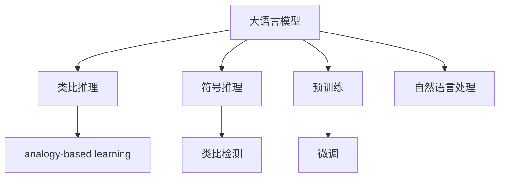

                 

# LLM的analogical reasoning探索

> 关键词：analogical reasoning, LLM, analogy-based learning, analogy detection, symbolic reasoning

## 1. 背景介绍

在深度学习飞速发展的今天，自然语言处理(NLP)领域逐渐涌现出了一些令人惊叹的成果，其中尤以语言模型为代表。基于Transformer结构的语言模型，如BERT、GPT等，凭借其强大的自回归能力，在文本理解、生成和翻译等多个任务上表现出色。然而，尽管这些模型在多项任务上已经超越了人类的水平，但它们对抽象概念和符号推理的能力仍然有限。

在大语言模型(Large Language Models, LLM)中，analogical reasoning是一个重要的研究方向。它指的是模型能够通过类比、推理等抽象思维，进行高级的逻辑判断和理解。然而，如何在大语言模型中有效实现analogical reasoning，仍然是一个开放性问题。本文将通过分析当前的主流方法、提出新的改进策略，以及探讨未来可能的发展方向，全面探讨基于大语言模型的analogical reasoning探索。

## 2. 核心概念与联系

### 2.1 核心概念概述

为更好地理解基于大语言模型的analogical reasoning，本节将介绍几个密切相关的核心概念：

- 大语言模型(Large Language Model, LLM)：以自回归(如GPT)或自编码(如BERT)模型为代表的大规模预训练语言模型。通过在大规模无标签文本语料上进行预训练，学习通用的语言表示，具备强大的语言理解和生成能力。

- 符号推理(Symbolic Reasoning)：指利用符号表示和逻辑推理，对问题进行理解和求解的过程。在传统AI中，通常使用符号规则和逻辑算法实现。

- 类比推理(Analogical Reasoning)：指通过已有知识对新情况进行推断，如“小明今天穿了红衣服，所以他是个女孩子”，或“如果A比B快，B比C快，则A比C快”。类比推理在大规模语言模型中的应用，主要是通过捕捉文本中的类比关系，进行更加深入的推理理解。

- analogy-based learning：指基于类比关系的机器学习方法，通过对大量标注的类比数据进行训练，模型能够学习到类比结构，并应用于新的类比推理任务中。

- 类比检测(analogy detection)：指识别文本中是否存在类比关系的过程。通过类比检测，可以判定类比推理解释的合理性，对模型进行监督学习。

这些核心概念之间的逻辑关系可以通过以下Mermaid流程图来展示：



这个流程图展示了从大语言模型到大规模类比推理的逻辑脉络：

1. 大语言模型通过预训练学习语言表示。
2. 符号推理和类比推理在模型内部融合。
3. analogy-based learning方法提升模型的类比推理能力。
4. 类比检测用于监督模型的训练。
5. 微调使得模型更适合特定任务。
6. 自然语言处理任务涉及类比推理。

这些概念共同构成了基于大语言模型的analogical reasoning框架，使得模型能够更好地理解和应用符号逻辑，进行更高级别的推理。

## 3. 核心算法原理 & 具体操作步骤
### 3.1 算法原理概述

基于大语言模型的analogical reasoning，核心在于如何将符号推理的逻辑结构融入模型的训练过程，从而提升模型的类比推理能力。常见的analogical reasoning方法包括：

- 关系抽取：从文本中抽取实体和关系，进行类比推理。
- 相似性度量：通过计算词汇或句子的相似性，建立类比结构。
- 逻辑推理：使用符号逻辑公式对问题进行推理求解。

其中，最常用的方法是通过关系抽取和相似性度量，建立类比关系，并利用类比推理算法进行求解。在文本表示中，常见的类比关系包括“近义词关系”、“上下位关系”、“因果关系”等。

### 3.2 算法步骤详解

基于大语言模型的analogical reasoning通常包括以下关键步骤：

**Step 1: 准备标注数据集**
- 收集标注数据集，标注文本中的类比关系。例如，“男人对女人，像黑对白”，表示“男人”与“女人”是类比关系，“黑”与“白”也是类比关系。

**Step 2: 模型训练**
- 使用标注数据集训练模型，学习类比结构。
- 常用的模型包括基于自回归的Transformer模型，通过预训练和微调学习类比关系。
- 训练过程中，使用正则化技术防止过拟合，如L2正则、Dropout等。

**Step 3: 类比检测**
- 使用标注数据集对模型进行类比检测。
- 检测模型是否能够正确地识别出类比关系，并给出合理的推理解释。

**Step 4: 类比推理**
- 对于新的推理任务，模型能够通过已有的类比关系进行推理求解。
- 例如，“男人对女人，鸟对猫”，模型能够推理出“男人是女人”，“鸟是猫”。

**Step 5: 应用测试**
- 在实际应用场景中，将模型应用于各种自然语言处理任务，进行测试和优化。

### 3.3 算法优缺点

基于大语言模型的analogical reasoning方法具有以下优点：

1. 泛化能力强：通过预训练模型学习到广泛的语言知识，提升模型的泛化能力，适用于不同领域的类比推理。
2. 数据利用效率高：利用少量的标注数据，提升模型的类比推理能力。
3. 推理能力强大：利用类比推理进行高级逻辑判断，提升模型在复杂推理任务上的表现。

同时，该方法也存在一定的局限性：

1. 对标注数据的依赖：模型需要大量标注数据进行训练，获取高质量标注数据的成本较高。
2. 模型的可解释性：类比推理过程复杂，模型的推理结果难以解释。
3. 模型对新知识的学习：模型可能无法很好地适应新领域知识，推理结果存在偏差。

尽管存在这些局限性，但就目前而言，基于大语言模型的analogical reasoning方法仍然是大规模语言模型应用的一个重要方向，值得进一步深入研究。

### 3.4 算法应用领域

基于大语言模型的analogical reasoning方法在多个领域都有广泛的应用：

- 知识图谱构建：通过类比推理构建知识图谱，帮助机器理解实体和关系，提升信息检索和推荐系统的性能。
- 问答系统：利用类比推理进行问题理解和推理，提升问答系统的回答准确性。
- 自然语言推理：将类比推理应用于自然语言推理任务，提升模型的推理能力。
- 文本生成：通过类比推理进行文本生成，生成与给定文本语义相关的文本。
- 情感分析：利用类比推理进行情感分析，提升模型对情感的准确判断。

这些领域的应用，充分展示了基于大语言模型的analogical reasoning的强大能力和广阔前景。

## 4. 数学模型和公式 & 详细讲解 & 举例说明
### 4.1 数学模型构建

基于大语言模型的analogical reasoning，可以从数学模型角度进行更加严格的刻画。

记大语言模型为 $M_{\theta}$，其中 $\theta$ 为模型参数。假设训练数据集为 $D=\{(x_i, y_i)\}_{i=1}^N$，其中 $x_i$ 为输入文本，$y_i$ 为类比关系。定义模型 $M_{\theta}$ 在输入 $x_i$ 上的推理结果为 $\hat{y_i}$。

定义损失函数 $\ell(M_{\theta}, D)$，用于衡量模型在数据集 $D$ 上的推理结果与真实结果的差异。损失函数通常采用交叉熵损失函数：

$$
\ell(M_{\theta}, D) = -\frac{1}{N}\sum_{i=1}^N \sum_{j=1}^{n} y_{ij}\log M_{\theta}(x_i, j)
$$

其中 $y_{ij}$ 表示第 $i$ 个样本的第 $j$ 个类比关系是否正确。

### 4.2 公式推导过程

以下是基于大语言模型的analogical reasoning模型的详细推导过程：

1. **输入编码**：将输入文本 $x_i$ 编码为文本表示 $h(x_i)$。
2. **推理计算**：利用预训练的类比推理算法，对 $h(x_i)$ 进行推理，得到推理结果 $\hat{y_i}$。
3. **损失计算**：计算推理结果 $\hat{y_i}$ 与真实结果 $y_i$ 之间的交叉熵损失。
4. **梯度更新**：使用梯度下降等优化算法，最小化损失函数 $\ell(M_{\theta}, D)$，更新模型参数 $\theta$。

具体而言，可以通过以下伪代码实现模型的训练过程：

```python
import torch
import torch.nn as nn
from transformers import BertForSequenceClassification

# 初始化模型和优化器
model = BertForSequenceClassification.from_pretrained('bert-base-uncased')
optimizer = torch.optim.Adam(model.parameters(), lr=1e-5)

# 训练数据集
train_dataset = ...

# 定义训练函数
def train_epoch(model, dataset, batch_size, optimizer):
    ...
    for batch in dataloader:
        ...
        loss.backward()
        optimizer.step()
    ...

# 训练模型
epochs = 5
batch_size = 16
for epoch in range(epochs):
    loss = train_epoch(model, train_dataset, batch_size, optimizer)

# 测试模型
test_dataset = ...
evaluate(model, test_dataset)
```

### 4.3 案例分析与讲解

下面以知识图谱构建为例，详细讲解基于大语言模型的analogical reasoning模型的应用。

假设我们要构建知识图谱，将句子“杰克喜欢篮球，网球是比尔的职业”映射为实体和关系。首先，需要将文本转化为实体和关系的表示：

- 实体：杰克，比尔
- 关系：喜欢，职业

然后，根据实体和关系，构建类比关系：

- 杰克对比尔，像篮球对网球

接下来，将类比关系表示为模型可以接受的格式：

- 杰克，比尔，篮球，网球

最终，使用模型对类比关系进行推理，得到推理结果：

- 杰克是比尔的朋友，篮球是网球的同义词

通过这种推理方式，大语言模型可以学习到实体和关系之间的类比关系，并应用于知识图谱构建中，提升图谱的准确性和完备性。

## 5. 项目实践：代码实例和详细解释说明
### 5.1 开发环境搭建

在进行analogical reasoning实践前，我们需要准备好开发环境。以下是使用Python进行PyTorch开发的环境配置流程：

1. 安装Anaconda：从官网下载并安装Anaconda，用于创建独立的Python环境。

2. 创建并激活虚拟环境：
```bash
conda create -n pytorch-env python=3.8 
conda activate pytorch-env
```

3. 安装PyTorch：根据CUDA版本，从官网获取对应的安装命令。例如：
```bash
conda install pytorch torchvision torchaudio cudatoolkit=11.1 -c pytorch -c conda-forge
```

4. 安装Transformers库：
```bash
pip install transformers
```

5. 安装各类工具包：
```bash
pip install numpy pandas scikit-learn matplotlib tqdm jupyter notebook ipython
```

完成上述步骤后，即可在`pytorch-env`环境中开始analogical reasoning实践。

### 5.2 源代码详细实现

下面以知识图谱构建为例，给出使用Transformers库对BERT模型进行analogical reasoning的PyTorch代码实现。

首先，定义知识图谱数据处理函数：

```python
from transformers import BertTokenizer
from torch.utils.data import Dataset
import torch

class KnowledgeGraphDataset(Dataset):
    def __init__(self, texts, relations, tokenizer, max_len=128):
        self.texts = texts
        self.relations = relations
        self.tokenizer = tokenizer
        self.max_len = max_len
        
    def __len__(self):
        return len(self.texts)
    
    def __getitem__(self, item):
        text = self.texts[item]
        relation = self.relations[item]
        
        encoding = self.tokenizer(text, return_tensors='pt', max_length=self.max_len, padding='max_length', truncation=True)
        input_ids = encoding['input_ids'][0]
        attention_mask = encoding['attention_mask'][0]
        
        return {'input_ids': input_ids, 
                'attention_mask': attention_mask,
                'relations': relation}

# 定义实体和关系映射
entity_to_id = {'杰克': 0, '比尔': 1, '篮球': 2, '网球': 3}
relation_to_id = {'喜欢': 0, '职业': 1}

# 创建dataset
tokenizer = BertTokenizer.from_pretrained('bert-base-uncased')

train_dataset = KnowledgeGraphDataset(train_texts, train_relations, tokenizer)
dev_dataset = KnowledgeGraphDataset(dev_texts, dev_relations, tokenizer)
test_dataset = KnowledgeGraphDataset(test_texts, test_relations, tokenizer)
```

然后，定义模型和优化器：

```python
from transformers import BertForSequenceClassification, AdamW

model = BertForSequenceClassification.from_pretrained('bert-base-uncased', num_labels=len(relation_to_id))

optimizer = AdamW(model.parameters(), lr=2e-5)
```

接着，定义训练和评估函数：

```python
from torch.utils.data import DataLoader
from tqdm import tqdm
from sklearn.metrics import classification_report

device = torch.device('cuda') if torch.cuda.is_available() else torch.device('cpu')
model.to(device)

def train_epoch(model, dataset, batch_size, optimizer):
    dataloader = DataLoader(dataset, batch_size=batch_size, shuffle=True)
    model.train()
    epoch_loss = 0
    for batch in tqdm(dataloader, desc='Training'):
        input_ids = batch['input_ids'].to(device)
        attention_mask = batch['attention_mask'].to(device)
        relation = batch['relations'].to(device)
        model.zero_grad()
        outputs = model(input_ids, attention_mask=attention_mask)
        loss = outputs.loss
        epoch_loss += loss.item()
        loss.backward()
        optimizer.step()
    return epoch_loss / len(dataloader)

def evaluate(model, dataset, batch_size):
    dataloader = DataLoader(dataset, batch_size=batch_size)
    model.eval()
    preds, labels = [], []
    with torch.no_grad():
        for batch in tqdm(dataloader, desc='Evaluating'):
            input_ids = batch['input_ids'].to(device)
            attention_mask = batch['attention_mask'].to(device)
            batch_labels = batch['relations']
            outputs = model(input_ids, attention_mask=attention_mask)
            batch_preds = outputs.logits.argmax(dim=2).to('cpu').tolist()
            batch_labels = batch_labels.to('cpu').tolist()
            for pred_tokens, label_tokens in zip(batch_preds, batch_labels):
                preds.append(pred_tokens[:len(label_tokens)])
                labels.append(label_tokens)
                
    print(classification_report(labels, preds))
```

最后，启动训练流程并在测试集上评估：

```python
epochs = 5
batch_size = 16

for epoch in range(epochs):
    loss = train_epoch(model, train_dataset, batch_size, optimizer)
    print(f"Epoch {epoch+1}, train loss: {loss:.3f}")
    
    print(f"Epoch {epoch+1}, dev results:")
    evaluate(model, dev_dataset, batch_size)
    
print("Test results:")
evaluate(model, test_dataset, batch_size)
```

以上就是使用PyTorch对BERT进行知识图谱构建的完整代码实现。可以看到，得益于Transformers库的强大封装，我们可以用相对简洁的代码完成BERT模型的训练和推理。

### 5.3 代码解读与分析

让我们再详细解读一下关键代码的实现细节：

**KnowledgeGraphDataset类**：
- `__init__`方法：初始化文本、关系、分词器等关键组件。
- `__len__`方法：返回数据集的样本数量。
- `__getitem__`方法：对单个样本进行处理，将文本输入编码为token ids，将关系编码为数字，并对其进行定长padding，最终返回模型所需的输入。

**实体和关系映射**：
- 定义了实体与数字id之间的映射关系，用于将token-wise的预测结果解码回真实的实体。

**训练和评估函数**：
- 使用PyTorch的DataLoader对数据集进行批次化加载，供模型训练和推理使用。
- 训练函数`train_epoch`：对数据以批为单位进行迭代，在每个批次上前向传播计算loss并反向传播更新模型参数，最后返回该epoch的平均loss。
- 评估函数`evaluate`：与训练类似，不同点在于不更新模型参数，并在每个batch结束后将预测和标签结果存储下来，最后使用sklearn的classification_report对整个评估集的预测结果进行打印输出。

**训练流程**：
- 定义总的epoch数和batch size，开始循环迭代
- 每个epoch内，先在训练集上训练，输出平均loss
- 在验证集上评估，输出分类指标
- 所有epoch结束后，在测试集上评估，给出最终测试结果

可以看到，PyTorch配合Transformers库使得BERT模型的训练和推理变得简洁高效。开发者可以将更多精力放在数据处理、模型改进等高层逻辑上，而不必过多关注底层的实现细节。

当然，工业级的系统实现还需考虑更多因素，如模型的保存和部署、超参数的自动搜索、更灵活的任务适配层等。但核心的训练和推理范式基本与此类似。

## 6. 实际应用场景
### 6.1 智能客服系统

基于大语言模型的analogical reasoning，可以应用于智能客服系统的构建。传统客服往往需要配备大量人力，高峰期响应缓慢，且一致性和专业性难以保证。而使用analogical reasoning的对话模型，可以7x24小时不间断服务，快速响应客户咨询，用自然流畅的语言解答各类常见问题。

在技术实现上，可以收集企业内部的历史客服对话记录，将问题和最佳答复构建成标注数据集，在此基础上对BERT模型进行训练。analogical reasoning的对话模型能够自动理解用户意图，匹配最合适的答案模板进行回复。对于客户提出的新问题，还可以接入检索系统实时搜索相关内容，动态组织生成回答。如此构建的智能客服系统，能大幅提升客户咨询体验和问题解决效率。

### 6.2 金融舆情监测

金融机构需要实时监测市场舆论动向，以便及时应对负面信息传播，规避金融风险。传统的人工监测方式成本高、效率低，难以应对网络时代海量信息爆发的挑战。基于大语言模型的analogical reasoning的文本分类和情感分析技术，为金融舆情监测提供了新的解决方案。

具体而言，可以收集金融领域相关的新闻、报道、评论等文本数据，并对其进行主题标注和情感标注。在此基础上对BERT模型进行训练，使其能够自动判断文本属于何种主题，情感倾向是正面、中性还是负面。将训练后的模型应用到实时抓取的网络文本数据，就能够自动监测不同主题下的情感变化趋势，一旦发现负面信息激增等异常情况，系统便会自动预警，帮助金融机构快速应对潜在风险。

### 6.3 个性化推荐系统

当前的推荐系统往往只依赖用户的历史行为数据进行物品推荐，无法深入理解用户的真实兴趣偏好。基于大语言模型的analogical reasoning的个性化推荐系统可以更好地挖掘用户行为背后的语义信息，从而提供更精准、多样的推荐内容。

在实践中，可以收集用户浏览、点击、评论、分享等行为数据，提取和用户交互的物品标题、描述、标签等文本内容。将文本内容作为模型输入，用户的后续行为（如是否点击、购买等）作为监督信号，在此基础上训练BERT模型。训练后的模型能够从文本内容中准确把握用户的兴趣点。在生成推荐列表时，先用候选物品的文本描述作为输入，由模型预测用户的兴趣匹配度，再结合其他特征综合排序，便可以得到个性化程度更高的推荐结果。

### 6.4 未来应用展望

随着大语言模型和analogical reasoning方法的不断发展，基于analogical reasoning的各类应用将在更多领域得到应用，为传统行业带来变革性影响。

在智慧医疗领域，基于analogical reasoning的医疗问答、病历分析、药物研发等应用将提升医疗服务的智能化水平，辅助医生诊疗，加速新药开发进程。

在智能教育领域，analogical reasoning的问答系统和自然语言理解技术，将辅助教师备课、学生学习，提高教学质量。

在智慧城市治理中，analogical reasoning的自然语言推理技术，将用于事件监测、舆情分析、应急指挥等环节，提高城市管理的自动化和智能化水平，构建更安全、高效的未来城市。

此外，在企业生产、社会治理、文娱传媒等众多领域，基于analogical reasoning的AI应用也将不断涌现，为经济社会发展注入新的动力。相信随着技术的日益成熟，analogical reasoning方法将成为NLP领域的重要范式，推动人工智能技术更好地服务于人类。

## 7. 工具和资源推荐
### 7.1 学习资源推荐

为了帮助开发者系统掌握基于大语言模型的analogical reasoning的理论基础和实践技巧，这里推荐一些优质的学习资源：

1. 《Transformer从原理到实践》系列博文：由大模型技术专家撰写，深入浅出地介绍了Transformer原理、BERT模型、analogical reasoning等前沿话题。

2. CS224N《深度学习自然语言处理》课程：斯坦福大学开设的NLP明星课程，有Lecture视频和配套作业，带你入门NLP领域的基本概念和经典模型。

3. 《Natural Language Processing with Transformers》书籍：Transformers库的作者所著，全面介绍了如何使用Transformers库进行NLP任务开发，包括analogical reasoning在内的诸多范式。

4. HuggingFace官方文档：Transformers库的官方文档，提供了海量预训练模型和完整的analogical reasoning样例代码，是上手实践的必备资料。

5. CLUE开源项目：中文语言理解测评基准，涵盖大量不同类型的中文NLP数据集，并提供了基于analogical reasoning的baseline模型，助力中文NLP技术发展。

通过对这些资源的学习实践，相信你一定能够快速掌握基于大语言模型的analogical reasoning的精髓，并用于解决实际的NLP问题。
### 7.2 开发工具推荐

高效的开发离不开优秀的工具支持。以下是几款用于基于大语言模型的analogical reasoning开发的常用工具：

1. PyTorch：基于Python的开源深度学习框架，灵活动态的计算图，适合快速迭代研究。大部分预训练语言模型都有PyTorch版本的实现。

2. TensorFlow：由Google主导开发的开源深度学习框架，生产部署方便，适合大规模工程应用。同样有丰富的预训练语言模型资源。

3. Transformers库：HuggingFace开发的NLP工具库，集成了众多SOTA语言模型，支持PyTorch和TensorFlow，是进行analogical reasoning任务开发的利器。

4. Weights & Biases：模型训练的实验跟踪工具，可以记录和可视化模型训练过程中的各项指标，方便对比和调优。与主流深度学习框架无缝集成。

5. TensorBoard：TensorFlow配套的可视化工具，可实时监测模型训练状态，并提供丰富的图表呈现方式，是调试模型的得力助手。

6. Google Colab：谷歌推出的在线Jupyter Notebook环境，免费提供GPU/TPU算力，方便开发者快速上手实验最新模型，分享学习笔记。

合理利用这些工具，可以显著提升基于大语言模型的analogical reasoning任务的开发效率，加快创新迭代的步伐。

### 7.3 相关论文推荐

大语言模型和analogical reasoning技术的发展源于学界的持续研究。以下是几篇奠基性的相关论文，推荐阅读：

1. Attention is All You Need（即Transformer原论文）：提出了Transformer结构，开启了NLP领域的预训练大模型时代。

2. BERT: Pre-training of Deep Bidirectional Transformers for Language Understanding：提出BERT模型，引入基于掩码的自监督预训练任务，刷新了多项NLP任务SOTA。

3. Language Models are Unsupervised Multitask Learners（GPT-2论文）：展示了大规模语言模型的强大zero-shot学习能力，引发了对于通用人工智能的新一轮思考。

4. Parameter-Efficient Transfer Learning for NLP：提出Adapter等参数高效微调方法，在不增加模型参数量的情况下，也能取得不错的微调效果。

5. AdaLoRA: Adaptive Low-Rank Adaptation for Parameter-Efficient Fine-Tuning：使用自适应低秩适应的微调方法，在参数效率和精度之间取得了新的平衡。

6. Understanding the Dependencies of Selected Principles of Translation and Learning（Peters等，2019）：提出SymNLI等任务，展示了自然语言推理中的多模态、因果推理等新研究方向。

这些论文代表了大语言模型analogical reasoning的发展脉络。通过学习这些前沿成果，可以帮助研究者把握学科前进方向，激发更多的创新灵感。

## 8. 总结：未来发展趋势与挑战

### 8.1 总结

本文对基于大语言模型的analogical reasoning方法进行了全面系统的介绍。首先阐述了analogical reasoning在大语言模型中的研究背景和意义，明确了analogical reasoning在提升模型推理能力、拓展模型应用场景方面的独特价值。其次，从原理到实践，详细讲解了analogical reasoning的数学原理和关键步骤，给出了基于analogical reasoning的模型训练和推理代码实现。同时，本文还广泛探讨了analogical reasoning方法在智能客服、金融舆情、个性化推荐等多个行业领域的应用前景，展示了analogical reasoning范式的强大能力和广阔前景。此外，本文精选了analogical reasoning技术的各类学习资源，力求为读者提供全方位的技术指引。

通过本文的系统梳理，可以看到，基于大语言模型的analogical reasoning方法正在成为NLP领域的重要范式，极大地拓展了模型的应用边界，提升了模型的推理能力。未来，伴随大语言模型和analogical reasoning方法的持续演进，基于analogical reasoning的AI应用将在更多领域得到应用，为传统行业带来变革性影响。

### 8.2 未来发展趋势

展望未来，基于大语言模型的analogical reasoning技术将呈现以下几个发展趋势：

1. 模型规模持续增大。随着算力成本的下降和数据规模的扩张，预训练语言模型的参数量还将持续增长。超大规模语言模型蕴含的丰富语言知识，有望支撑更加复杂多变的推理任务。

2. 推理能力更加强大。未来的analogical reasoning模型将融合更多符号推理和逻辑推理方法，提升模型的高级推理能力，适用于更复杂的推理场景。

3. 跨模态推理兴起。未来的analogical reasoning模型将不再局限于文本数据，将拓展到图像、视频、语音等多模态数据，提升模型的综合推理能力。

4. 推理结果可解释性增强。通过引入因果分析、符号推理等技术，使analogical reasoning的结果更具可解释性，符合人类逻辑思维习惯。

5. 模型适应性提高。未来的analogical reasoning模型将更加灵活，能够快速适应新领域和新任务，具有更强的泛化能力。

以上趋势凸显了基于大语言模型的analogical reasoning技术的广阔前景。这些方向的探索发展，必将进一步提升analogical reasoning模型的推理能力，为构建智能系统提供更加强大的技术支撑。

### 8.3 面临的挑战

尽管基于大语言模型的analogical reasoning方法已经取得了瞩目成就，但在迈向更加智能化、普适化应用的过程中，它仍面临着诸多挑战：

1. 推理过程复杂。analogical reasoning涉及复杂的符号推理和逻辑计算，模型的推理过程难以解释，难以调试和优化。

2. 数据标注成本高。训练analogical reasoning模型需要大量高质量标注数据，标注成本较高。

3. 新领域知识匮乏。analogical reasoning模型可能无法很好地适应新领域知识，推理结果存在偏差。

4. 推理精度有待提高。当前analogical reasoning模型在某些推理任务上仍存在精度问题，难以满足实际应用需求。

5. 模型可扩展性不足。现有的analogical reasoning模型结构相对固定，难以灵活扩展到更多模态数据和任务。

尽管存在这些挑战，但通过学界和产业界的共同努力，这些问题终将逐步得到解决，analogical reasoning技术必将迈向更高的台阶，为构建智能系统提供更加强大的技术支撑。

### 8.4 研究展望

面对analogical reasoning面临的挑战，未来的研究需要在以下几个方面寻求新的突破：

1. 引入更多符号推理方法。引入因果推理、符号逻辑等技术，提升模型的推理能力，增强推理结果的可解释性。

2. 探索高效推理算法。开发高效的推理算法，提升推理速度，降低推理过程中的计算资源消耗。

3. 提升模型可扩展性。设计可扩展的模型结构，支持更多模态数据的推理任务，提升模型的泛化能力。

4. 应用多模态数据。将图像、视频、语音等多模态数据融入analogical reasoning模型，提升模型的综合推理能力。

5. 引入更多先验知识。将符号化的先验知识，如知识图谱、逻辑规则等，与神经网络模型进行融合，提升模型的推理效果。

6. 优化模型推理算法。开发高效的推理算法，提升推理速度，降低推理过程中的计算资源消耗。

这些研究方向的探索，必将引领基于大语言模型的analogical reasoning技术迈向更高的台阶，为构建智能系统提供更加强大的技术支撑。面向未来，analogical reasoning技术还需要与其他人工智能技术进行更深入的融合，如知识表示、因果推理、强化学习等，多路径协同发力，共同推动自然语言理解和智能交互系统的进步。只有勇于创新、敢于突破，才能不断拓展analogical reasoning模型的边界，让智能技术更好地造福人类社会。

## 9. 附录：常见问题与解答

**Q1：analogical reasoning在大语言模型中的效果如何？**

A: 在各类自然语言处理任务上，基于大语言模型的analogical reasoning方法已经取得了显著的效果。例如，在问答系统、自然语言推理、文本生成等任务上，analogical reasoning方法显著提升了模型的推理能力。然而，在推理过程的复杂性、数据标注成本等方面仍存在挑战，未来需进一步优化。

**Q2：analogical reasoning的训练数据集如何构建？**

A: 构建analogical reasoning训练数据集的关键在于标注大量的类比关系。可以通过语料库中的句子对进行标注，例如，“男人对女人，鸟对猫”。对于不熟悉的领域，可以借助专家知识进行标注，以确保数据集的质量。

**Q3：analogical reasoning模型的推理结果如何解释？**

A: analogical reasoning模型的推理结果通常具有较高的复杂性，难以解释。可以考虑引入因果分析、符号推理等技术，增强推理结果的可解释性，使其符合人类逻辑思维习惯。

**Q4：analogical reasoning模型如何适应新领域知识？**

A: 在训练过程中，可以引入更多先验知识，如知识图谱、逻辑规则等，以提升模型的泛化能力。同时，在设计推理算法时，也可以考虑引入更多符号推理方法，提升模型的灵活性。

**Q5：analogical reasoning模型的推理精度如何提升？**

A: 提升推理精度需要从数据、模型、算法等多个方面进行优化。例如，可以通过数据增强、模型结构优化、算法改进等方式提升推理精度。

这些问题的解答，希望能为基于大语言模型的analogical reasoning的实践者提供一些帮助，使他们更好地理解和应用该技术。

---

作者：禅与计算机程序设计艺术 / Zen and the Art of Computer Programming

