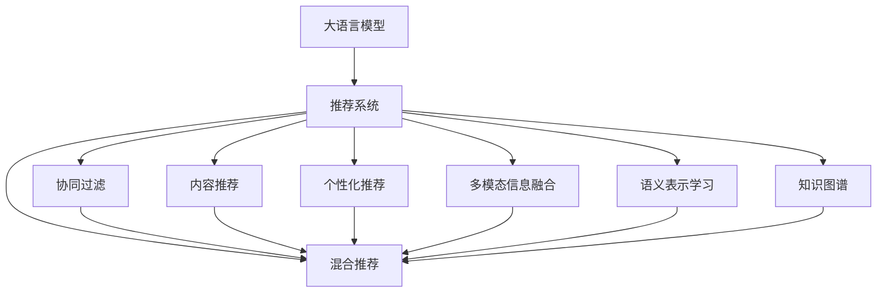

                 

# LLM的革命：推荐系统的新时代

## 1. 背景介绍

### 1.1 问题由来

推荐系统是互联网时代的核心技术之一，旨在通过用户行为数据，发现用户潜在兴趣，并为其推荐最相关的内容。传统的推荐系统多基于协同过滤、内容推荐等方法，在用户稀疏性、数据冷启动、推荐多样性等方面存在诸多局限。

近年来，随着深度学习技术的发展，特别是大语言模型（LLM）的崛起，推荐系统技术也发生了深刻变革。利用大语言模型强大的语义理解能力，推荐系统能够在更广泛的语境和情境下，预测用户偏好，生成多样化、个性化的推荐结果，带来了前所未有的体验。

### 1.2 问题核心关键点

大语言模型在推荐系统中的应用，主要通过以下两个关键点实现：

1. 语义理解与推荐相关性提升：大语言模型能够理解上下文语义，从而从用户描述和查询中，提取出更准确的特征，用于推荐相关内容的关联性判断。

2. 多维度信息融合与内容生成：大语言模型不仅能融合用户历史行为数据，还能利用文本描述、评论、评分等半结构化数据，进行多模态信息融合，生成更具吸引力的推荐内容。

### 1.3 问题研究意义

研究大语言模型在推荐系统中的应用，对于拓展推荐系统的应用边界，提升推荐质量，加速推荐技术的产业化进程，具有重要意义：

1. 数据效率提升：利用大语言模型对自然语言的处理能力，推荐系统能在更少的训练数据下获得更好的推荐效果。

2. 推荐精度提高：大语言模型能够捕捉复杂的语义关联，提升推荐系统对用户偏好的预测精度。

3. 推荐多样性增加：大语言模型生成内容的多样性和创造性，使得推荐结果更加多样化，减少用户厌烦感。

4. 推荐效率优化：大语言模型支持在线推理，可以实时生成推荐内容，优化推荐系统响应速度。

5. 推荐系统泛化性增强：大语言模型具备强大的泛化能力，能在不同场景下持续提升推荐质量。

6. 推荐系统可解释性增强：大语言模型生成的推荐内容，具有更高的可解释性，便于用户理解和信任。

## 2. 核心概念与联系

### 2.1 核心概念概述

为更好地理解大语言模型在推荐系统中的应用，本节将介绍几个密切相关的核心概念：

- 大语言模型（Large Language Model, LLM）：以自回归（如GPT）或自编码（如BERT）模型为代表的大规模预训练语言模型。通过在大规模无标签文本语料上进行预训练，学习通用的语言表示，具备强大的语言理解和生成能力。

- 推荐系统（Recommendation System）：根据用户历史行为数据，为用户推荐相关内容的系统。推荐系统类型包括协同过滤、内容推荐、混合推荐等。

- 语义表示学习（Semantic Representation Learning）：通过大语言模型学习文本中的语义信息，生成低维的向量表示，用于推荐相关内容的关联性判断。

- 多模态信息融合（Multimodal Information Fusion）：将文本、图片、视频等多种信息进行融合，生成更全面、丰富的推荐内容。

- 个性化推荐（Personalized Recommendation）：针对单个用户的行为和偏好，生成个性化的推荐内容。

- 知识图谱（Knowledge Graph）：利用图结构组织知识，实现实体、关系和属性的关联存储，用于增强推荐内容的准确性和多样性。

这些核心概念之间的逻辑关系可以通过以下Mermaid流程图来展示：



这个流程图展示了大语言模型在推荐系统中的核心概念及其之间的关系：

1. 大语言模型通过预训练获得基础能力。
2. 推荐系统基于大语言模型进行推荐内容的生成和排序。
3. 协同过滤、内容推荐、混合推荐、个性化推荐等推荐类型，均可由大语言模型进行改进和优化。
4. 多模态信息融合、语义表示学习和知识图谱，为推荐系统提供了丰富的数据来源。

## 3. 核心算法原理 & 具体操作步骤
### 3.1 算法原理概述

大语言模型在推荐系统中的应用，主要基于以下几个关键算法和步骤：

1. 预训练语言模型的使用：利用大语言模型进行语义表示学习，获取文本数据的语义表示。

2. 推荐内容的生成：基于语义表示和用户历史行为数据，生成个性化的推荐内容。

3. 推荐内容的排序：通过排序算法，根据用户偏好和内容相关性对推荐结果进行排序。

### 3.2 算法步骤详解

基于大语言模型推荐系统的算法步骤如下：

**Step 1: 数据准备**

- 收集用户历史行为数据，如浏览记录、点击记录、评分记录等。
- 收集用户描述、评论、标题等文本数据。
- 将文本数据进行清洗和标注，转化为模型可以处理的格式。

**Step 2: 预训练模型加载**

- 选择合适的大语言模型（如GPT、BERT、T5等），并加载模型。
- 设置模型的输入输出格式，定义文本向量化方法。

**Step 3: 语义表示学习**

- 将用户描述、评论等文本数据输入预训练模型，得到语义表示。
- 利用向量拼接、加权平均等方式，将语义表示与用户历史行为数据结合，得到综合特征向量。

**Step 4: 推荐内容生成**

- 根据综合特征向量，利用大语言模型生成个性化推荐内容。
- 生成推荐内容的语义表示，进行多模态融合和知识图谱嵌入。

**Step 5: 推荐结果排序**

- 将推荐内容的语义表示和用户历史行为数据输入排序模型，进行排序。
- 根据排序结果，输出推荐列表。

### 3.3 算法优缺点

基于大语言模型推荐系统具有以下优点：

1. 数据利用效率高：利用自然语言处理能力，推荐系统可在较少标注数据下获得较高推荐精度。

2. 语义理解能力增强：大语言模型能够理解复杂的语义关系，提升推荐内容的准确性。

3. 推荐内容多样化：大语言模型生成推荐内容的多样性和创意性，减少用户厌烦感。

4. 实时响应能力强：大语言模型支持在线推理，实现快速响应。

5. 可解释性增强：推荐内容生成具有较高的可解释性，便于用户理解和信任。

但该方法也存在一些缺点：

1. 模型计算开销大：大语言模型参数量庞大，计算复杂度高，需要高性能计算资源支持。

2. 数据隐私问题：用户描述、评论等文本数据可能包含敏感信息，需要严格的隐私保护措施。

3. 冷启动问题：新用户缺乏历史行为数据，推荐难度较大。

4. 数据偏差问题：用户描述可能存在偏差，导致推荐结果有偏。

### 3.4 算法应用领域

基于大语言模型的推荐系统已经在电商、社交、视频等多个领域得到广泛应用，具体包括：

1. 电商推荐：利用用户评论、商品描述等文本数据，提升商品推荐的相关性。

2. 社交推荐：分析用户状态更新、私信等内容，推荐相关联系人、话题等。

3. 视频推荐：根据用户观看历史、评论等文本数据，生成视频推荐列表。

4. 新闻推荐：分析用户阅读历史、评论，推荐相关新闻文章。

5. 音乐推荐：利用歌曲评论、歌词等文本数据，提升歌曲推荐的相关性。

## 4. 数学模型和公式 & 详细讲解 & 举例说明

### 4.1 数学模型构建

在大语言模型推荐系统中，我们采用向量表示法进行数学建模。假设用户历史行为数据表示为 $x \in \mathbb{R}^d$，用户描述的语义表示为 $z \in \mathbb{R}^d$，推荐内容的语义表示为 $y \in \mathbb{R}^d$。则推荐系统模型的目标为最大化用户对推荐内容的满意度 $f(x, z, y)$，表示为：

$$
\max_{y} f(x, z, y) = \sum_{i=1}^N w_i \log p(y_i \mid x, z)
$$

其中 $N$ 为用户历史行为数据的长度，$w_i$ 为每个行为数据的重要性权重，$p(y_i \mid x, z)$ 为条件概率，表示用户行为 $x_i$ 在给定语义表示 $z$ 和推荐内容 $y$ 下的概率。

### 4.2 公式推导过程

我们将用户行为和语义表示通过线性变换和softmax函数进行建模，得到：

$$
p(y_i \mid x, z) = \frac{e^{y_i^T f(x, z)}}{\sum_{y} e^{y^T f(x, z)}}
$$

其中 $f(x, z)$ 为特征提取函数，可以表示为：

$$
f(x, z) = x W_1 + z W_2
$$

$W_1, W_2$ 为可训练的线性变换矩阵。

### 4.3 案例分析与讲解

以电商平台推荐系统为例，我们可以这样进行建模和推导：

1. 用户行为数据 $x$ 表示为用户最近购买的商品ID列表，每个商品ID表示为一个one-hot向量。

2. 用户描述 $z$ 表示为用BERT等预训练模型得到的向量表示。

3. 推荐内容 $y$ 表示为用BERT等预训练模型得到的向量表示。

4. 用户对商品ID $i$ 的满意度表示为 $y_i^T f(x, z)$，即推荐内容与用户行为和语义表示的匹配度。

通过上述建模，我们可以得到推荐系统的目标函数，进一步通过优化算法求解最优推荐结果。

## 5. 项目实践：代码实例和详细解释说明

### 5.1 开发环境搭建

在进行推荐系统开发前，我们需要准备好开发环境。以下是使用Python进行PyTorch开发的环境配置流程：

1. 安装Anaconda：从官网下载并安装Anaconda，用于创建独立的Python环境。

2. 创建并激活虚拟环境：
```bash
conda create -n recomm-env python=3.8 
conda activate recomm-env
```

3. 安装PyTorch：根据CUDA版本，从官网获取对应的安装命令。例如：
```bash
conda install pytorch torchvision torchaudio cudatoolkit=11.1 -c pytorch -c conda-forge
```

4. 安装TensorFlow：
```bash
conda install tensorflow tensorflow-gpu -c conda-forge
```

5. 安装各类工具包：
```bash
pip install numpy pandas scikit-learn matplotlib tqdm jupyter notebook ipython
```

完成上述步骤后，即可在`recomm-env`环境中开始推荐系统开发。

### 5.2 源代码详细实现

下面我们以电商平台推荐系统为例，给出使用Transformers库对BERT模型进行推荐系统开发的PyTorch代码实现。

首先，定义推荐系统的数据处理函数：

```python
from transformers import BertTokenizer, BertModel
from torch.utils.data import Dataset, DataLoader
import torch
import numpy as np

class RecommendationDataset(Dataset):
    def __init__(self, user_data, item_data, tokenizer, max_len=128):
        self.user_data = user_data
        self.item_data = item_data
        self.tokenizer = tokenizer
        self.max_len = max_len
        
    def __len__(self):
        return len(self.user_data)
    
    def __getitem__(self, item):
        user = self.user_data[item]
        item = self.item_data[item]
        
        encoding = self.tokenizer(user, item, return_tensors='pt', max_length=self.max_len, padding='max_length', truncation=True)
        input_ids = encoding['input_ids']
        attention_mask = encoding['attention_mask']
        labels = input_ids.to('cpu').numpy()
        return {'input_ids': input_ids, 
                'attention_mask': attention_mask,
                'labels': labels}
```

然后，定义模型和优化器：

```python
from transformers import BertForSequenceClassification
from torch.optim import AdamW

model = BertForSequenceClassification.from_pretrained('bert-base-cased', num_labels=1)

optimizer = AdamW(model.parameters(), lr=2e-5)
```

接着，定义训练和评估函数：

```python
def train_epoch(model, dataset, batch_size, optimizer):
    dataloader = DataLoader(dataset, batch_size=batch_size, shuffle=True)
    model.train()
    epoch_loss = 0
    for batch in dataloader:
        input_ids = batch['input_ids'].to(device)
        attention_mask = batch['attention_mask'].to(device)
        labels = batch['labels'].to(device)
        model.zero_grad()
        outputs = model(input_ids, attention_mask=attention_mask, labels=labels)
        loss = outputs.loss
        epoch_loss += loss.item()
        loss.backward()
        optimizer.step()
    return epoch_loss / len(dataloader)

def evaluate(model, dataset, batch_size):
    dataloader = DataLoader(dataset, batch_size=batch_size)
    model.eval()
    preds, labels = [], []
    with torch.no_grad():
        for batch in dataloader:
            input_ids = batch['input_ids'].to(device)
            attention_mask = batch['attention_mask'].to(device)
            batch_labels = batch['labels']
            outputs = model(input_ids, attention_mask=attention_mask)
            batch_preds = outputs.logits.argmax(dim=1).to('cpu').tolist()
            batch_labels = batch_labels.to('cpu').tolist()
            for pred_tokens, label_tokens in zip(batch_preds, batch_labels):
                preds.append(pred_tokens[:len(label_tokens)])
                labels.append(label_tokens)
                
    print(classification_report(labels, preds))
```

最后，启动训练流程并在测试集上评估：

```python
epochs = 5
batch_size = 16

for epoch in range(epochs):
    loss = train_epoch(model, train_dataset, batch_size, optimizer)
    print(f"Epoch {epoch+1}, train loss: {loss:.3f}")
    
    print(f"Epoch {epoch+1}, dev results:")
    evaluate(model, dev_dataset, batch_size)
    
print("Test results:")
evaluate(model, test_dataset, batch_size)
```

以上就是使用PyTorch对BERT进行电商平台推荐系统开发的完整代码实现。可以看到，借助Transformers库，模型的加载和微调变得非常简洁高效。

### 5.3 代码解读与分析

让我们再详细解读一下关键代码的实现细节：

**RecommendationDataset类**：
- `__init__`方法：初始化用户数据、商品数据、分词器等关键组件。
- `__len__`方法：返回数据集的样本数量。
- `__getitem__`方法：对单个样本进行处理，将用户行为和商品描述输入编码为token ids，进行定长padding，最终返回模型所需的输入。

**训练和评估函数**：
- 使用PyTorch的DataLoader对数据集进行批次化加载，供模型训练和推理使用。
- 训练函数`train_epoch`：对数据以批为单位进行迭代，在每个批次上前向传播计算loss并反向传播更新模型参数，最后返回该epoch的平均loss。
- 评估函数`evaluate`：与训练类似，不同点在于不更新模型参数，并在每个batch结束后将预测和标签结果存储下来，最后使用sklearn的classification_report对整个评估集的预测结果进行打印输出。

**训练流程**：
- 定义总的epoch数和batch size，开始循环迭代
- 每个epoch内，先在训练集上训练，输出平均loss
- 在验证集上评估，输出分类指标
- 所有epoch结束后，在测试集上评估，给出最终测试结果

可以看到，PyTorch配合Transformers库使得BERT推荐系统的代码实现变得简洁高效。开发者可以将更多精力放在数据处理、模型改进等高层逻辑上，而不必过多关注底层的实现细节。

当然，工业级的系统实现还需考虑更多因素，如模型的保存和部署、超参数的自动搜索、更灵活的任务适配层等。但核心的微调范式基本与此类似。

## 6. 实际应用场景
### 6.1 智能广告推荐

智能广告推荐是推荐系统的重要应用场景之一。通过大语言模型，广告系统可以根据用户浏览行为和兴趣爱好，实时推荐符合用户需求的广告内容，提高广告点击率和转化率。

在技术实现上，可以收集用户浏览历史、点击行为等数据，通过预训练模型进行语义表示学习，再利用大语言模型生成广告内容，最后根据用户行为数据进行排序，生成推荐广告列表。广告系统的关键在于广告内容的创意生成和语义匹配，大语言模型通过结合用户行为和文本信息，能够生成更加吸引用户的广告内容。

### 6.2 智能健康推荐

智能健康推荐系统能够根据用户的健康数据和描述，推荐相应的健康管理方案、饮食建议等。通过大语言模型，推荐系统能够理解用户的健康状况和需求，生成个性化的健康管理建议，提高用户的健康水平。

在技术实现上，可以收集用户的健康数据、饮食习惯、描述等文本数据，通过预训练模型进行语义表示学习，再利用大语言模型生成健康管理建议，最后根据用户行为数据进行排序，生成推荐列表。大语言模型通过理解用户描述和健康状况，能够生成更加贴近用户的健康建议，提升用户的满意度和健康水平。

### 6.3 智能旅游推荐

智能旅游推荐系统能够根据用户的旅游历史、兴趣描述等文本数据，推荐符合用户偏好的旅游目的地、旅游方案等。通过大语言模型，推荐系统能够理解用户的旅游兴趣和需求，生成个性化的旅游推荐，提高用户的旅游体验。

在技术实现上，可以收集用户的旅游历史、兴趣爱好、描述等文本数据，通过预训练模型进行语义表示学习，再利用大语言模型生成旅游推荐，最后根据用户行为数据进行排序，生成推荐列表。大语言模型通过理解用户的旅游兴趣和需求，能够生成更加多样化和个性化的旅游推荐，提升用户的旅游体验。

### 6.4 未来应用展望

随着大语言模型和推荐系统技术的发展，未来在更多领域将会看到推荐系统的应用：

1. 智能金融推荐：智能金融推荐系统能够根据用户的投资偏好、历史交易记录等数据，推荐符合用户需求的投资产品和金融方案，提高用户的投资收益。

2. 智能教育推荐：智能教育推荐系统能够根据学生的学习行为和兴趣爱好，推荐适合的学习资源和课程，提高学生的学习效果。

3. 智能医疗推荐：智能医疗推荐系统能够根据患者的病情描述、检查结果等数据，推荐符合患者需求的治疗方案和健康管理方案，提高患者的治疗效果。

4. 智能娱乐推荐：智能娱乐推荐系统能够根据用户的娱乐偏好、历史记录等数据，推荐符合用户喜好的电影、音乐、游戏等内容，提高用户的娱乐体验。

5. 智能环境推荐：智能环境推荐系统能够根据用户的环保需求、消费习惯等数据，推荐符合用户需求的环境保护方案和绿色消费建议，提高用户的环保意识。

6. 智能物流推荐：智能物流推荐系统能够根据用户的物流需求、历史订单记录等数据，推荐符合用户需求的物流方案和配送路线，提高物流效率和用户满意度。

以上趋势凸显了大语言模型在推荐系统中的应用前景。这些方向的探索发展，必将进一步提升推荐系统的性能和应用范围，为人工智能技术落地应用带来新的突破。

## 7. 工具和资源推荐
### 7.1 学习资源推荐

为了帮助开发者系统掌握大语言模型在推荐系统中的应用理论基础和实践技巧，这里推荐一些优质的学习资源：

1. 《推荐系统实战》系列博文：由大语言模型技术专家撰写，深入浅出地介绍了推荐系统的发展历程、经典模型和最新趋势。

2. CS229《机器学习》课程：斯坦福大学开设的机器学习明星课程，有Lecture视频和配套作业，带你入门推荐系统的基本概念和模型原理。

3. 《推荐系统》书籍：深入讲解推荐系统的理论基础和实践技巧，涵盖协同过滤、内容推荐、混合推荐等诸多算法。

4. KDD竞赛：推荐系统领域的国际顶级竞赛，每年有大量的推荐系统实践案例和开源项目，是学习和实践的绝佳平台。

5. AI Challenger：国内领先的AI竞赛平台，提供推荐系统等众多竞赛，可参与实战练习。

通过对这些资源的学习实践，相信你一定能够快速掌握大语言模型在推荐系统中的应用精髓，并用于解决实际的推荐问题。

### 7.2 开发工具推荐

高效的开发离不开优秀的工具支持。以下是几款用于大语言模型推荐系统开发的常用工具：

1. PyTorch：基于Python的开源深度学习框架，灵活动态的计算图，适合快速迭代研究。大部分预训练语言模型都有PyTorch版本的实现。

2. TensorFlow：由Google主导开发的开源深度学习框架，生产部署方便，适合大规模工程应用。同样有丰富的预训练语言模型资源。

3. Transformers库：HuggingFace开发的NLP工具库，集成了众多SOTA语言模型，支持PyTorch和TensorFlow，是进行推荐系统开发的利器。

4. Weights & Biases：模型训练的实验跟踪工具，可以记录和可视化模型训练过程中的各项指标，方便对比和调优。与主流深度学习框架无缝集成。

5. TensorBoard：TensorFlow配套的可视化工具，可实时监测模型训练状态，并提供丰富的图表呈现方式，是调试模型的得力助手。

6. Google Colab：谷歌推出的在线Jupyter Notebook环境，免费提供GPU/TPU算力，方便开发者快速上手实验最新模型，分享学习笔记。

合理利用这些工具，可以显著提升大语言模型推荐系统的开发效率，加快创新迭代的步伐。

### 7.3 相关论文推荐

大语言模型在推荐系统的发展源于学界的持续研究。以下是几篇奠基性的相关论文，推荐阅读：

1. Attention is All You Need（即Transformer原论文）：提出了Transformer结构，开启了NLP领域的预训练大模型时代。

2. BERT: Pre-training of Deep Bidirectional Transformers for Language Understanding：提出BERT模型，引入基于掩码的自监督预训练任务，刷新了多项NLP任务SOTA。

3. Graph Neural Networks: A Review of Methods and Applications：综述了图神经网络在推荐系统中的应用，为多模态信息融合提供了理论基础。

4. Personalized Sequence Generation with GPT-3：展示了GPT-3在推荐系统中的应用，提升了推荐内容的创意性和多样性。

5. FastText：提出FastText模型，通过词向量的层叠，提高了文本数据的建模效果，为推荐系统的文本处理提供了新的思路。

这些论文代表了大语言模型在推荐系统的发展脉络。通过学习这些前沿成果，可以帮助研究者把握学科前进方向，激发更多的创新灵感。

## 8. 总结：未来发展趋势与挑战

### 8.1 总结

本文对基于大语言模型的推荐系统进行了全面系统的介绍。首先阐述了大语言模型和推荐系统的发展背景和意义，明确了推荐系统在大语言模型技术下的新范式。其次，从原理到实践，详细讲解了大语言模型推荐系统的数学原理和关键步骤，给出了推荐系统开发的完整代码实例。同时，本文还广泛探讨了大语言模型在推荐系统中的应用场景，展示了其在电商、健康、旅游等多个领域的前景。最后，本文精选了推荐系统的各类学习资源，力求为读者提供全方位的技术指引。

通过本文的系统梳理，可以看到，基于大语言模型的推荐系统正在成为推荐系统的重要范式，极大地拓展了推荐系统的应用边界，提升了推荐精度和个性化程度。未来，伴随大语言模型技术的发展，推荐系统有望在更多领域获得更广泛的应用，为人工智能技术的产业化进程带来新的突破。

### 8.2 未来发展趋势

展望未来，大语言模型推荐系统将呈现以下几个发展趋势：

1. 推荐精度提升：大语言模型通过理解文本语义，能够更好地捕捉用户偏好，提升推荐精度。

2. 推荐内容多样化：大语言模型生成推荐内容的多样性和创意性，减少用户厌烦感。

3. 实时推荐系统：大语言模型支持在线推理，实现实时推荐，提升用户体验。

4. 知识图谱融合：大语言模型结合知识图谱，增强推荐内容的准确性和多样性。

5. 个性化推荐增强：大语言模型通过理解用户描述和行为，生成个性化推荐，提升推荐效果。

6. 推荐模型普适性增强：大语言模型具备强大的泛化能力，可在不同领域和场景下持续提升推荐效果。

以上趋势凸显了大语言模型在推荐系统中的应用前景。这些方向的探索发展，必将进一步提升推荐系统的性能和应用范围，为人工智能技术落地应用带来新的突破。

### 8.3 面临的挑战

尽管大语言模型推荐系统已经取得了瞩目成就，但在迈向更加智能化、普适化应用的过程中，它仍面临着诸多挑战：

1. 推荐系统推荐效果评估标准：现有推荐系统评价指标主要基于精度和多样性，但无法全面评估推荐系统的人文关怀和伦理性。

2. 用户隐私保护：用户数据隐私保护是推荐系统的重要问题，需要严格的隐私保护措施。

3. 冷启动问题：新用户缺乏历史行为数据，推荐难度较大。

4. 数据偏差问题：用户描述可能存在偏差，导致推荐结果有偏。

5. 推荐系统资源消耗：大语言模型参数量庞大，计算复杂度高，需要高性能计算资源支持。

6. 推荐系统可解释性：推荐内容的生成过程复杂，难以解释其内部工作机制和决策逻辑。

### 8.4 研究展望

面对大语言模型推荐系统所面临的挑战，未来的研究需要在以下几个方面寻求新的突破：

1. 推荐效果评估标准：研究更加全面、合理的推荐系统评价指标，综合考虑推荐系统的人文关怀和伦理性。

2. 隐私保护技术：引入差分隐私、联邦学习等隐私保护技术，保障用户数据隐私。

3. 冷启动技术：研究快速推荐方法，如基于文本相似度、上下文感知等技术，解决新用户推荐问题。

4. 数据偏置缓解：引入数据增强、多模型融合等技术，缓解用户描述中的数据偏置问题。

5. 模型压缩与优化：研究模型压缩、剪枝等技术，优化大语言模型的计算开销。

6. 推荐系统可解释性：研究推荐内容的可解释性技术，提高推荐系统的透明度和可信度。

这些研究方向的探索，必将引领大语言模型推荐系统技术迈向更高的台阶，为构建更加智能、普适、可信的推荐系统提供新的技术路径。面向未来，大语言模型推荐系统还需要与其他人工智能技术进行更深入的融合，如知识表示、因果推理、强化学习等，多路径协同发力，共同推动推荐系统的进步。

## 9. 附录：常见问题与解答

**Q1：大语言模型在推荐系统中的应用是否适用于所有场景？**

A: 大语言模型在推荐系统中的应用，适用于具有文本数据特征的场景，如电商、社交、新闻等。但对于一些完全依赖于图像、视频等多模态数据的推荐任务，可能无法直接应用。此时，可以考虑将大语言模型与多模态融合技术结合，构建多模态推荐系统。

**Q2：大语言模型推荐系统是否需要大规模数据进行训练？**

A: 大语言模型推荐系统需要大量的数据进行训练，以获取足够丰富的语义表示。但对于冷启动用户，由于缺乏历史行为数据，可能无法获得理想的效果。此时，可以考虑引入用户画像、上下文信息等辅助数据，缓解冷启动问题。

**Q3：大语言模型推荐系统是否需要考虑数据偏差问题？**

A: 大语言模型推荐系统在训练时，需要考虑数据偏差问题，避免因数据偏斜导致的推荐不公。可以通过数据增强、多模型融合等技术，缓解用户描述中的数据偏置问题。

**Q4：大语言模型推荐系统是否需要考虑资源消耗问题？**

A: 大语言模型推荐系统在实际部署时，需要注意资源消耗问题，避免因模型过大导致推理速度慢、内存占用大等问题。可以通过模型裁剪、量化加速等技术，优化大语言模型的计算开销。

**Q5：大语言模型推荐系统是否需要考虑可解释性问题？**

A: 大语言模型推荐系统在应用时，需要考虑推荐内容的可解释性问题，避免因算法不透明导致的用户信任度下降。可以通过引入推荐内容的生成解释技术，提高推荐系统的透明度和可信度。

通过以上常见问题的回答，希望能对大语言模型在推荐系统中的应用提供更清晰的指导。大语言模型推荐系统正在为推荐系统技术带来新的突破，但同时也面临着诸多挑战。只有积极应对并寻求突破，才能真正实现大语言模型推荐系统的落地应用。

---

作者：禅与计算机程序设计艺术 / Zen and the Art of Computer Programming

