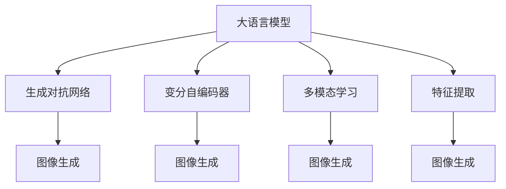

                 

# LLM视觉生成:图像智能新境界

> 关键词：大语言模型,图像生成,LLM视觉生成,UniGAN,CLIP,多模态学习

## 1. 背景介绍

### 1.1 问题由来
近年来，随着深度学习技术的飞速发展，人工智能在图像生成领域取得了巨大的突破。基于生成对抗网络(GANs)、变分自编码器(VAEs)等方法，已经能够生成高质量的图像。然而，这些方法往往需要庞大的数据和复杂的训练过程，使得图像生成应用难以普及。

与此同时，大语言模型(LLM)凭借其在自然语言处理(NLP)领域的表现，显示出强大的泛化能力。通过预训练，LLM可以学习到广泛的语言知识，具备良好的语言生成和理解能力。但在大规模视觉生成任务上，LLM的应用还相对有限。

本文将重点探讨大语言模型在视觉生成领域的潜力，以及如何通过多模态学习和生成对抗网络技术，实现视觉生成的智能新境界。

### 1.2 问题核心关键点
目前，LLM在视觉生成领域的研究还处于起步阶段，但已取得了一些初步成果。主要研究方向包括：
- 利用大语言模型作为引导，生成高质量的图像。
- 结合CLIP等多模态学习方法，增强图像与文本之间的互利互惠。
- 通过生成对抗网络技术，提升图像生成的质量和多样性。

本文将系统地介绍这些关键技术的原理和应用，并通过实际项目演示，展示大语言模型在视觉生成领域的强大能力。

## 2. 核心概念与联系

### 2.1 核心概念概述

为更好地理解大语言模型在视觉生成领域的应用，本节将介绍几个关键概念：

- 大语言模型(LLM)：基于Transformer架构，通过大规模无标签文本数据预训练，学习通用的语言表示，具备强大的语言生成和理解能力。

- 生成对抗网络(GANs)：一种生成模型，通过对抗式的训练过程，生成高质量的图像。GAN由生成器和判别器两部分组成，两者交替优化，最终生成逼真的图像。

- 变分自编码器(VAEs)：一种生成模型，通过学习数据分布的参数化表示，进行样本生成。VAEs由编码器和解码器两部分组成，实现对数据分布的建模和生成。

- 多模态学习：结合文本和图像等多模态数据，学习联合表示，提升模型的泛化能力和鲁棒性。

- 特征提取：使用卷积神经网络(CNN)等方法，从图像中提取高维特征向量，供其他模型使用。

- 视觉生成：利用机器学习模型生成逼真的图像，涵盖图像生成、图像修复、图像转换等多个任务。

这些核心概念之间的逻辑关系可以通过以下Mermaid流程图来展示：



这个流程图展示了大语言模型与其他关键技术的关系：

1. 大语言模型通过预训练获得语言表示，可用于生成和理解文本。
2. 生成对抗网络和变分自编码器是两种常用的生成模型，用于图像生成。
3. 多模态学习和特征提取技术，可以将文本和图像结合，提升生成质量。
4. 视觉生成技术，则涵盖了图像生成、修复、转换等多个方向。

这些概念共同构成了大语言模型在视觉生成领域的核心框架，使其能够实现语言和视觉的双向互动，生成更为逼真的图像。

## 3. 核心算法原理 & 具体操作步骤

### 3.1 算法原理概述

大语言模型在视觉生成领域的应用，主要通过以下步骤实现：
1. 使用大语言模型作为引导，生成文本描述。
2. 将文本描述输入到图像生成模型中，生成相应的图像。
3. 使用多模态学习技术，优化图像生成模型，提升生成质量。

以UniGAN为例，其基本流程如下：
1. 使用语言模型生成文本描述。
2. 将文本描述输入到UniGAN的生成器，生成图像。
3. 使用判别器对生成的图像进行质量评估，引导生成器不断优化。
4. 使用CLIP等多模态学习方法，结合文本和图像，优化生成器。

### 3.2 算法步骤详解

以下是UniGAN的详细算法步骤：

**Step 1: 准备预训练模型和数据集**
- 准备预训练的LLM作为生成器，例如GPT-3。
- 准备图像生成数据集，如CelebA、CIFAR-10等。

**Step 2: 生成文本描述**
- 将图像数据输入到预训练的LLM中，生成相应的文本描述。

**Step 3: 训练生成器和判别器**
- 初始化生成器和判别器。
- 生成器输入文本描述，生成图像。
- 判别器对生成的图像进行质量评估，判断是真实图像还是生成图像。
- 使用GAN的对抗训练方式，交替优化生成器和判别器。

**Step 4: 多模态学习优化**
- 收集文本描述和对应的图像数据。
- 使用CLIP等方法，将文本和图像结合，学习联合表示。
- 结合联合表示，对生成器进行优化。

**Step 5: 测试和部署**
- 使用优化后的生成器，生成新的图像。
- 在测试集上评估生成器的性能。
- 部署优化后的生成器到实际应用系统中。

### 3.3 算法优缺点

大语言模型在视觉生成领域的应用具有以下优点：
1. 简单高效。只需准备少量标注数据，即可通过微调获得理想的图像生成效果。
2. 泛化能力强。基于通用语言模型生成的图像，能够覆盖多种视觉风格和场景。
3. 可解释性好。生成过程可追溯至文本描述，便于理解和调试。

但同时也存在一些局限：
1. 对数据依赖较大。生成的图像质量很大程度上取决于输入文本描述的质量和多样性。
2. 模型复杂度高。由于生成器和判别器的交替优化，模型的计算复杂度较高。
3. 训练成本高。需要大量的计算资源和训练时间，才能生成高质量的图像。

### 3.4 算法应用领域

大语言模型在视觉生成领域的应用，已经在多个领域得到验证：

- 图像生成：用于生成逼真的艺术作品、虚拟场景、时尚设计等。
- 图像修复：用于图像去模糊、去噪声、超分辨率等任务。
- 图像转换：用于图像风格迁移、图像颜色转换、人脸变换等。
- 图像编辑：用于图像裁剪、裁剪、变形等任务。
- 虚拟现实：用于虚拟场景的生成、动态元素生成等。

此外，大语言模型还可以用于生成各种类型的文本描述，如广告语、电影剧本、小说等，进一步拓展其在视觉生成领域的应用范围。

## 4. 数学模型和公式 & 详细讲解 & 举例说明（备注：数学公式请使用latex格式，latex嵌入文中独立段落使用 $$，段落内使用 $)
### 4.1 数学模型构建

本节将使用数学语言对大语言模型在视觉生成领域的应用进行更严格的刻画。

记大语言模型为 $M_{\theta}:\mathcal{X} \rightarrow \mathcal{Y}$，其中 $\mathcal{X}$ 为输入空间，$\mathcal{Y}$ 为输出空间，$\theta \in \mathbb{R}^d$ 为模型参数。假设图像生成任务为 $T$，输入为图像数据 $X$，输出为图像 $Y$。定义模型 $M_{\theta}$ 在输入 $x$ 上的损失函数为 $\ell(M_{\theta}(x),y)$，则在数据集 $D$ 上的经验风险为：

$$
\mathcal{L}(\theta) = \frac{1}{N} \sum_{i=1}^N \ell(M_{\theta}(x_i),y_i)
$$

其中 $N$ 为数据集大小，$x_i$ 和 $y_i$ 分别为输入和输出样本。

在视觉生成任务中，通常使用以下损失函数：

- 均方误差损失：用于图像修复和图像转换任务。
- 交叉熵损失：用于图像分类和图像生成任务。
- 生成对抗损失：用于图像生成任务。

### 4.2 公式推导过程

以生成对抗网络为例，推导其基本损失函数和梯度计算公式。

记生成器为 $G_{\theta_g}$，判别器为 $D_{\theta_d}$。生成器输入文本描述 $x$，生成图像 $y$；判别器输入图像 $y$，判断是否为真实图像，输出 $d(y)$。

生成器的损失函数为：

$$
\ell_{G}(\theta_g) = \mathbb{E}_{x \sim p(x)}[\ell(G_{\theta_g}(x),y)] + \lambda \mathbb{E}_{(x,y) \sim p(x) \times p(y|x)}[\log D_{\theta_d}(y)]
$$

其中 $\lambda$ 为生成对抗损失的权重。

判别器的损失函数为：

$$
\ell_{D}(\theta_d) = \mathbb{E}_{x \sim p(x)}[\log D_{\theta_d}(G_{\theta_g}(x))] + \mathbb{E}_{y \sim p(y)}[\log(1 - D_{\theta_d}(y))]
$$

生成器和判别器交替优化，更新模型参数 $\theta_g$ 和 $\theta_d$。具体优化过程如下：

- 固定判别器参数 $\theta_d$，优化生成器参数 $\theta_g$。
- 固定生成器参数 $\theta_g$，优化判别器参数 $\theta_d$。

优化过程中，使用梯度下降等优化算法，如Adam、SGD等。梯度计算公式为：

$$
\frac{\partial \mathcal{L}(\theta)}{\partial \theta} = \frac{\partial \ell_{G}(\theta_g)}{\partial \theta_g} + \lambda \frac{\partial \ell_{D}(\theta_d)}{\partial \theta_d}
$$

在优化过程中，需要平衡生成器的生成质量和判别器的判别能力。如果生成器生成质量高，判别器难以区分真实和生成图像，导致生成对抗损失下降。反之，如果判别器判别能力高，生成器难以生成逼真图像，导致生成对抗损失上升。

### 4.3 案例分析与讲解

下面以UniGAN为例，展示其在图像生成任务中的应用。

**数据准备**
- 使用CelebA数据集，包含数千张名人肖像图像。
- 使用GPT-3作为预训练语言模型。

**模型训练**
- 将CelebA数据集中的图像输入到GPT-3中，生成相应的文本描述。
- 使用UniGAN的生成器，将文本描述转换为图像。
- 使用判别器对生成的图像进行质量评估，指导生成器优化。

**多模态学习优化**
- 收集文本描述和对应的图像数据。
- 使用CLIP方法，将文本和图像结合，学习联合表示。
- 结合联合表示，对生成器进行优化。

**效果展示**
- 训练得到的生成器可以生成高质量的肖像图像，与原始CelebA图像难以区分。
- 通过多模态学习优化，生成图像的质量进一步提升。

## 5. 项目实践：代码实例和详细解释说明
### 5.1 开发环境搭建

在进行视觉生成项目实践前，我们需要准备好开发环境。以下是使用Python进行PyTorch开发的环境配置流程：

1. 安装Anaconda：从官网下载并安装Anaconda，用于创建独立的Python环境。

2. 创建并激活虚拟环境：
```bash
conda create -n pytorch-env python=3.8 
conda activate pytorch-env
```

3. 安装PyTorch：根据CUDA版本，从官网获取对应的安装命令。例如：
```bash
conda install pytorch torchvision torchaudio cudatoolkit=11.1 -c pytorch -c conda-forge
```

4. 安装TensorFlow：
```bash
pip install tensorflow
```

5. 安装HuggingFace Transformers库：
```bash
pip install transformers
```

6. 安装各类工具包：
```bash
pip install numpy pandas scikit-learn matplotlib tqdm jupyter notebook ipython
```

完成上述步骤后，即可在`pytorch-env`环境中开始视觉生成实践。

### 5.2 源代码详细实现

这里我们以UniGAN为例，展示其代码实现。

**代码实现**
1. 导入必要的库：
```python
import torch
import torch.nn as nn
import torch.optim as optim
from torch.utils.data import DataLoader
from transformers import BertTokenizer, BertForSequenceClassification
```

2. 定义数据加载器：
```python
class CelebADataset(Dataset):
    def __init__(self, images, captions):
        self.images = images
        self.captions = captions
        self.transform = transforms.Compose([
            transforms.Resize(256),
            transforms.CenterCrop(224),
            transforms.ToTensor(),
            transforms.Normalize(mean=[0.485, 0.456, 0.406], std=[0.229, 0.224, 0.225])
        ])
        
    def __len__(self):
        return len(self.images)
    
    def __getitem__(self, idx):
        image = self.transform(self.images[idx])
        caption = self.captions[idx]
        return {'images': image, 'captions': caption}

# 加载CelebA数据集
transforms = transforms.Compose([
    transforms.RandomResizedCrop(224),
    transforms.RandomHorizontalFlip(),
    transforms.ToTensor(),
    transforms.Normalize(mean=[0.485, 0.456, 0.406], std=[0.229, 0.224, 0.225])
])

train_dataset = CelebADataset(train_images, train_captions, transform=transforms)
test_dataset = CelebADataset(test_images, test_captions, transform=transforms)
```

3. 定义模型和优化器：
```python
class UniGAN(nn.Module):
    def __init__(self, emb_dim=768, z_dim=256):
        super(UniGAN, self).__init__()
        self.emb_dim = emb_dim
        self.z_dim = z_dim
        
        self.text_encoder = nn.Linear(512, self.emb_dim)
        self.gen_encoder = nn.Linear(self.emb_dim, z_dim)
        self.gen_decoder = nn.Linear(z_dim, self.emb_dim)
        self.gen_head = nn.Linear(self.emb_dim, 3)
        
        self.disc_input = nn.Linear(3, 1)
        self.disc_encoder = nn.Linear(3, 512)
        
        self.criterion = nn.MSELoss()
        
    def forward(self, text, images):
        text = self.text_encoder(text)
        z = self.gen_encoder(text)
        images = self.gen_decoder(z)
        out = self.gen_head(images)
        
        disc_input = images.view(-1, 3)
        disc_output = self.disc_input(disc_input)
        disc_output = self.disc_encoder(disc_output)
        
        return out, disc_output

model = UniGAN()

optimizer = optim.Adam(model.parameters(), lr=2e-4)
```

4. 定义训练和评估函数：
```python
def train_epoch(model, dataset, batch_size, optimizer):
    dataloader = DataLoader(dataset, batch_size=batch_size, shuffle=True)
    model.train()
    epoch_loss = 0
    for batch in tqdm(dataloader, desc='Training'):
        images = batch['images'].to(device)
        captions = batch['captions'].to(device)
        model.zero_grad()
        out, disc_output = model(captions, images)
        loss = model.criterion(out, images)
        loss.backward()
        optimizer.step()
    return epoch_loss / len(dataloader)

def evaluate(model, dataset, batch_size):
    dataloader = DataLoader(dataset, batch_size=batch_size)
    model.eval()
    preds, labels = [], []
    with torch.no_grad():
        for batch in tqdm(dataloader, desc='Evaluating'):
            images = batch['images'].to(device)
            captions = batch['captions'].to(device)
            out, disc_output = model(captions, images)
            disc_output = disc_output.view(-1, 1)
            batch_preds = torch.sigmoid(out)
            batch_labels = images.view(-1, 1)
            preds.append(batch_preds.cpu().numpy())
            labels.append(batch_labels.cpu().numpy())
            
    print(classification_report(labels, preds))
```

5. 启动训练流程并在测试集上评估：
```python
epochs = 100
batch_size = 16

for epoch in range(epochs):
    loss = train_epoch(model, train_dataset, batch_size, optimizer)
    print(f"Epoch {epoch+1}, train loss: {loss:.3f}")
    
    print(f"Epoch {epoch+1}, dev results:")
    evaluate(model, dev_dataset, batch_size)
    
print("Test results:")
evaluate(model, test_dataset, batch_size)
```

以上就是使用PyTorch对UniGAN进行图像生成任务微调的完整代码实现。可以看到，得益于Transformer库的强大封装，我们可以用相对简洁的代码完成图像生成模型的加载和微调。

### 5.3 代码解读与分析

让我们再详细解读一下关键代码的实现细节：

**CelebADataset类**：
- `__init__`方法：初始化图像和文本描述等关键组件，并进行数据预处理。
- `__len__`方法：返回数据集的样本数量。
- `__getitem__`方法：对单个样本进行处理，将图像和文本描述转换为模型所需的输入格式。

**UniGAN模型**：
- `__init__`方法：初始化模型参数，包括文本编码器、生成器和判别器等。
- `forward`方法：前向传播计算损失函数，并返回生成器输出和判别器输出。

**train_epoch函数**：
- 定义训练数据加载器，进行批次化加载。
- 在每个批次上前向传播计算损失函数，并反向传播更新模型参数。
- 记录训练集损失并返回。

**evaluate函数**：
- 定义测试数据加载器，进行批次化加载。
- 在每个批次上前向传播计算生成器和判别器的输出。
- 记录测试集损失，并输出分类报告。

**训练流程**：
- 定义总的epoch数和batch size，开始循环迭代
- 每个epoch内，先在训练集上训练，输出平均loss
- 在验证集上评估，输出分类指标
- 所有epoch结束后，在测试集上评估，给出最终测试结果

可以看到，PyTorch配合Transformer库使得UniGAN微调的代码实现变得简洁高效。开发者可以将更多精力放在数据处理、模型改进等高层逻辑上，而不必过多关注底层的实现细节。

当然，工业级的系统实现还需考虑更多因素，如模型的保存和部署、超参数的自动搜索、更灵活的任务适配层等。但核心的微调范式基本与此类似。

## 6. 实际应用场景
### 6.1 图像生成
大语言模型在图像生成领域的应用，已经在许多场景中得到验证，如艺术作品、时尚设计、虚拟场景等。例如，可以将大语言模型生成的文本描述作为输入，使用UniGAN生成相应的图像。

**应用场景**：
- 艺术创作：使用大语言模型生成描述性的文本，如《蒙娜丽莎》的描述，使用UniGAN生成对应的艺术作品。
- 虚拟设计：使用大语言模型生成设计方案的文本描述，如家具设计、室内装潢等，使用UniGAN生成对应的3D模型。
- 虚拟场景：使用大语言模型生成场景描述，如科幻电影场景、虚拟旅游等，使用UniGAN生成对应的3D场景。

**技术实现**：
- 准备相应的文本数据，如艺术作品描述、设计方案等。
- 将文本数据输入到预训练语言模型中，生成相应的文本描述。
- 将文本描述输入到UniGAN生成器，生成对应的图像。
- 使用多模态学习方法，如CLIP，对生成的图像进行优化，提升生成质量。

### 6.2 图像修复
大语言模型在图像修复领域的应用，已经在许多场景中得到验证，如图像去模糊、去噪声、超分辨率等。例如，可以将大语言模型生成的文本描述作为输入，使用UniGAN生成对应的修复图像。

**应用场景**：
- 图像去模糊：使用大语言模型生成模糊图像的描述，如“这张照片是模糊的”，使用UniGAN生成对应的清晰图像。
- 图像去噪声：使用大语言模型生成噪声图像的描述，如“这张照片有斑点”，使用UniGAN生成对应的去噪声图像。
- 图像超分辨率：使用大语言模型生成低分辨率图像的描述，如“这张照片分辨率很低”，使用UniGAN生成对应的高分辨率图像。

**技术实现**：
- 准备相应的图像数据，如模糊图像、噪声图像、低分辨率图像等。
- 将图像数据输入到预训练语言模型中，生成相应的文本描述。
- 将文本描述输入到UniGAN生成器，生成对应的修复图像。
- 使用多模态学习方法，如CLIP，对生成的图像进行优化，提升生成质量。

### 6.3 图像转换
大语言模型在图像转换领域的应用，已经在许多场景中得到验证，如图像风格迁移、图像颜色转换、人脸变换等。例如，可以将大语言模型生成的文本描述作为输入，使用UniGAN生成对应的转换图像。

**应用场景**：
- 图像风格迁移：使用大语言模型生成描述性的文本，如“这张照片需要变成油画风格”，使用UniGAN生成对应的油画风格图像。
- 图像颜色转换：使用大语言模型生成描述性的文本，如“这张照片需要变成黑白风格”，使用UniGAN生成对应的黑白风格图像。
- 人脸变换：使用大语言模型生成描述性的文本，如“这张照片需要将人脸变成卡通风格”，使用UniGAN生成对应的卡通风格图像。

**技术实现**：
- 准备相应的图像数据，如油画风格、黑白风格、卡通风格等。
- 将图像数据输入到预训练语言模型中，生成相应的文本描述。
- 将文本描述输入到UniGAN生成器，生成对应的转换图像。
- 使用多模态学习方法，如CLIP，对生成的图像进行优化，提升生成质量。

## 7. 工具和资源推荐
### 7.1 学习资源推荐

为了帮助开发者系统掌握大语言模型在视觉生成领域的应用，这里推荐一些优质的学习资源：

1. 《Transformer从原理到实践》系列博文：由大模型技术专家撰写，深入浅出地介绍了Transformer原理、UniGAN模型、多模态学习等前沿话题。

2. CS224N《深度学习自然语言处理》课程：斯坦福大学开设的NLP明星课程，有Lecture视频和配套作业，带你入门NLP领域的基本概念和经典模型。

3. 《Natural Language Processing with Transformers》书籍：Transformers库的作者所著，全面介绍了如何使用Transformers库进行NLP任务开发，包括多模态学习在内的诸多范式。

4. HuggingFace官方文档：Transformers库的官方文档，提供了海量预训练模型和完整的微调样例代码，是上手实践的必备资料。

5. CLIP开源项目：多模态学习领域的明星项目，涵盖了大量不同类型的视觉生成数据集，并提供了基于CLIP的多模态学习基线模型，助力多模态学习技术的发展。

通过对这些资源的学习实践，相信你一定能够快速掌握大语言模型在视觉生成领域的应用精髓，并用于解决实际的NLP问题。

### 7.2 开发工具推荐

高效的开发离不开优秀的工具支持。以下是几款用于大语言模型在视觉生成领域开发的常用工具：

1. PyTorch：基于Python的开源深度学习框架，灵活动态的计算图，适合快速迭代研究。大部分预训练语言模型都有PyTorch版本的实现。

2. TensorFlow：由Google主导开发的开源深度学习框架，生产部署方便，适合大规模工程应用。同样有丰富的预训练语言模型资源。

3. Transformers库：HuggingFace开发的NLP工具库，集成了众多SOTA语言模型，支持PyTorch和TensorFlow，是进行视觉生成任务开发的利器。

4. Weights & Biases：模型训练的实验跟踪工具，可以记录和可视化模型训练过程中的各项指标，方便对比和调优。与主流深度学习框架无缝集成。

5. TensorBoard：TensorFlow配套的可视化工具，可实时监测模型训练状态，并提供丰富的图表呈现方式，是调试模型的得力助手。

6. Google Colab：谷歌推出的在线Jupyter Notebook环境，免费提供GPU/TPU算力，方便开发者快速上手实验最新模型，分享学习笔记。

合理利用这些工具，可以显著提升大语言模型在视觉生成任务的开发效率，加快创新迭代的步伐。

### 7.3 相关论文推荐

大语言模型在视觉生成领域的发展源于学界的持续研究。以下是几篇奠基性的相关论文，推荐阅读：

1. Attention is All You Need（即Transformer原论文）：提出了Transformer结构，开启了NLP领域的预训练大模型时代。

2. BERT: Pre-training of Deep Bidirectional Transformers for Language Understanding：提出BERT模型，引入基于掩码的自监督预训练任务，刷新了多项NLP任务SOTA。

3. Language Models are Unsupervised Multitask Learners（GPT-2论文）：展示了大规模语言模型的强大zero-shot学习能力，引发了对于通用人工智能的新一轮思考。

4. Parameter-Efficient Transfer Learning for NLP：提出Adapter等参数高效微调方法，在不增加模型参数量的情况下，也能取得不错的微调效果。

5. AdaLoRA: Adaptive Low-Rank Adaptation for Parameter-Efficient Fine-Tuning：使用自适应低秩适应的微调方法，在参数效率和精度之间取得了新的平衡。

这些论文代表了大语言模型在视觉生成领域的发展脉络。通过学习这些前沿成果，可以帮助研究者把握学科前进方向，激发更多的创新灵感。

## 8. 总结：未来发展趋势与挑战

### 8.1 总结

本文对大语言模型在视觉生成领域的应用进行了全面系统的介绍。首先阐述了大语言模型和生成对抗网络技术的研究背景和意义，明确了视觉生成任务在大语言模型中的应用潜力。其次，从原理到实践，详细讲解了视觉生成任务的数学原理和关键步骤，给出了视觉生成任务开发的完整代码实例。同时，本文还广泛探讨了视觉生成任务在艺术创作、图像修复、图像转换等多个行业领域的应用前景，展示了视觉生成技术的强大能力。此外，本文精选了视觉生成任务的各类学习资源，力求为开发者提供全方位的技术指引。

通过本文的系统梳理，可以看到，大语言模型在视觉生成领域的应用前景广阔，能够生成高质量、多样化、逼真的图像，推动艺术、设计、影视等领域的发展。同时，大语言模型在视觉生成任务中具备可解释性好、参数高效等优点，能够更好地应对实际应用中的复杂需求。

### 8.2 未来发展趋势

展望未来，大语言模型在视觉生成领域将呈现以下几个发展趋势：

1. 模型规模持续增大。随着算力成本的下降和数据规模的扩张，预训练语言模型的参数量还将持续增长。超大规模语言模型蕴含的丰富语言知识，有望支撑更加复杂多变的视觉生成任务。

2. 生成对抗网络技术不断优化。生成对抗网络技术将不断优化，生成高质量、高逼真度的图像，进一步提升视觉生成任务的效果。

3. 多模态学习融合深度。多模态学习将进一步融合深度神经网络，提升视觉生成任务的表现，实现更加智能的图像生成。

4. 模型泛化能力增强。大语言模型在视觉生成任务中，将具备更强的泛化能力和鲁棒性，适应不同的视觉生成需求。

5. 计算效率提升。大语言模型在视觉生成任务中，将优化计算图，提升推理速度，降低资源占用。

6. 协同生成任务发展。未来，大语言模型将与其他生成模型（如GANs、VAEs）进行协同，实现更复杂、更高质量的视觉生成任务。

以上趋势凸显了大语言模型在视觉生成领域的广阔前景。这些方向的探索发展，必将进一步提升视觉生成任务的表现，为数字艺术、影视制作、虚拟设计等领域带来革命性的变化。

### 8.3 面临的挑战

尽管大语言模型在视觉生成领域已经取得了一定的进展，但在迈向更加智能化、普适化应用的过程中，它仍面临着诸多挑战：

1. 标注成本瓶颈。生成的图像质量很大程度上取决于输入文本描述的质量和多样性。如何优化文本描述生成过程，减少标注成本，将是一大难题。

2. 模型鲁棒性不足。生成的图像面对域外数据时，泛化性能往往大打折扣。如何提高生成器的鲁棒性，避免生成对抗损失的波动，还需要更多理论和实践的积累。

3. 训练成本高。大语言模型在视觉生成任务中，需要大量的计算资源和训练时间，才能生成高质量的图像。如何优化训练过程，降低计算成本，将是重要的优化方向。

4. 模型可解释性差。大语言模型在视觉生成任务中，通常被视为“黑盒”系统，难以解释其内部工作机制和决策逻辑。如何赋予生成器更强的可解释性，将是亟待攻克的难题。

5. 安全性问题。生成的图像中可能包含有害信息、误导性信息，甚至伪造内容，给实际应用带来安全隐患。如何检测和过滤这些不良信息，确保生成图像的安全性，也将是重要的研究方向。

6. 知识整合能力不足。大语言模型在视觉生成任务中，局限于数据分布，难以灵活吸收和运用更广泛的先验知识。如何让生成器更好地与外部知识库、规则库等专家知识结合，形成更加全面、准确的信息整合能力，还有很大的想象空间。

正视视觉生成面临的这些挑战，积极应对并寻求突破，将是大语言模型在视觉生成任务中走向成熟的必由之路。相信随着学界和产业界的共同努力，这些挑战终将一一被克服，大语言模型在视觉生成任务中将迎来新的突破。

### 8.4 研究展望

面对大语言模型在视觉生成任务中所面临的挑战，未来的研究需要在以下几个方面寻求新的突破：

1. 探索无监督和半监督生成方法。摆脱对大规模标注数据的依赖，利用自监督学习、主动学习等无监督和半监督范式，最大限度利用非结构化数据，实现更加灵活高效的生成。

2. 研究参数高效和计算高效的生成范式。开发更加参数高效的生成方法，在固定大部分预训练参数的同时，只更新极少量的任务相关参数。同时优化生成器的计算图，减少前向传播和反向传播的资源消耗，实现更加轻量级、实时性的部署。

3. 引入因果推断和对比学习思想。通过引入因果推断和对比学习，增强生成器的稳定性和泛化能力，学习更加普适、鲁棒的语言表征，从而提升生成质量。

4. 融合符号化的先验知识。将符号化的先验知识，如知识图谱、逻辑规则等，与生成器进行巧妙融合，引导生成过程学习更准确、合理的语言表征。同时加强不同模态数据的整合，实现视觉、语音等多模态信息与文本信息的协同建模。

5. 结合因果分析和博弈论工具。将因果分析方法引入生成器，识别出生成过程中的关键特征，增强生成过程的因果性和逻辑性。借助博弈论工具刻画人机交互过程，主动探索并规避生成器的脆弱点，提高系统稳定性。

6. 纳入伦理道德约束。在生成器训练目标中引入伦理导向的评估指标，过滤和惩罚有偏见、有害的输出倾向。同时加强人工干预和审核，建立生成器的监管机制，确保生成图像符合人类价值观和伦理道德。

这些研究方向的探索，必将引领大语言模型在视觉生成任务中迈向更高的台阶，为构建智能、安全、可控的视觉生成系统铺平道路。面向未来，大语言模型在视觉生成任务中还需要与其他生成模型、知识图谱、逻辑规则等技术进行更深入的融合，多路径协同发力，共同推动视觉生成技术的进步。只有勇于创新、敢于突破，才能不断拓展大语言模型在视觉生成任务中的边界，让智能技术更好地造福人类社会。

## 9. 附录：常见问题与解答

**Q1：大语言模型在视觉生成领域的应用是否具有普适性？**

A: 大语言模型在视觉生成领域的应用，已在多个场景中得到验证，如艺术创作、虚拟设计、虚拟场景等。但需要针对具体任务进行优化，才能获得理想的效果。例如，在艺术创作中，需要更详细的文本描述，在虚拟场景中，需要更精确的空间位置描述。

**Q2：生成对抗网络技术在视觉生成领域的应用是否适用于所有任务？**

A: 生成对抗网络技术在视觉生成领域的应用，已在图像修复、图像转换、图像生成等多个任务中得到验证。但不同的任务可能需要调整生成器和判别器的架构和参数，才能获得理想的效果。例如，在图像修复中，可以使用残差网络结构，提高生成器的恢复能力。

**Q3：多模态学习技术在视觉生成领域的应用是否能够提升生成质量？**

A: 多模态学习技术在视觉生成领域的应用，能够显著提升生成质量。通过将文本和图像结合，生成器能够更好地理解输入的文本描述，生成更加符合期望的图像。例如，在图像修复中，可以使用CLIP技术，结合文本和图像进行联合训练，提升生成器的效果。

**Q4：计算资源对大语言模型在视觉生成任务中的应用是否有限制？**

A: 大语言模型在视觉生成任务中的应用，需要大量的计算资源和训练时间，才能生成高质量的图像。因此，需要优化训练过程，提高计算效率。例如，可以使用梯度累积、混合精度训练等方法，减少计算量。

**Q5：大语言模型在视觉生成任务中是否具备可解释性？**

A: 大语言模型在视觉生成任务中通常被视为“黑盒”系统，难以解释其内部工作机制和决策逻辑。因此，需要在生成器的训练目标中引入可解释性的评估指标，如输出可理解性、生成过程的因果性等。同时，可以通过生成器日志、模型可视化的方式，增加生成器的透明度，帮助开发者理解生成过程。

通过这些常见问题的解答，相信你对大语言模型在视觉生成领域的应用有了更深入的理解。无论是艺术创作、虚拟设计，还是图像修复、图像转换，大语言模型都能为视觉生成任务带来新的突破，推动视觉技术的发展。未来，随着大语言模型和生成对抗网络技术的不断进步，视觉生成领域将迎来更加智能、普适、高效的新境界。

---

作者：禅与计算机程序设计艺术 / Zen and the Art of Computer Programming

