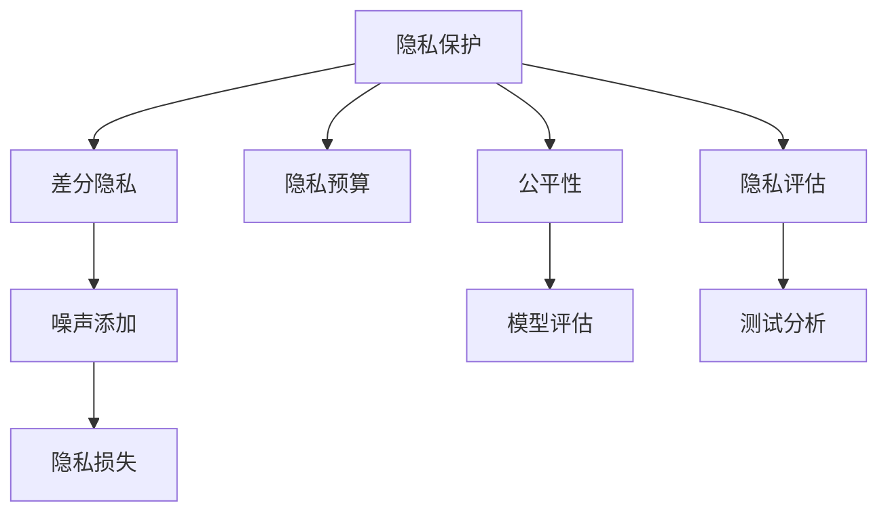

                 

# LLM隐私保护:现状、漏洞与对策

## 1. 背景介绍

### 1.1 问题由来
近年来，随着大规模预训练语言模型(Large Language Models, LLMs)如GPT、BERT、T5等在自然语言处理(NLP)领域取得了巨大成功，其在信息检索、文本生成、机器翻译等诸多任务上的性能已经接近甚至超越人类。然而，这些模型在提供强大功能的同时，也引发了一系列隐私保护问题。

1. **数据泄露风险**：预训练模型依赖大量的无标签文本数据进行训练，这些数据往往包含敏感信息，如个人隐私、商业机密等，极易在训练过程中被窃取或滥用。
2. **用户隐私侵犯**：基于这些模型构建的智能应用，如智能助手、推荐系统等，需要对用户行为和偏好进行深度分析和挖掘，这些信息可能在未经用户明确同意的情况下被泄露或滥用。
3. **模型偏见和歧视**：预训练模型的训练数据往往存在偏见，导致模型在推理过程中也存在偏见，可能对某些群体产生歧视性结果，损害群体权益。

### 1.2 问题核心关键点
大语言模型(LLM)的隐私保护问题主要集中在以下几个方面：

- **数据隐私**：预训练模型的训练数据需要严格保护，防止数据泄露和滥用。
- **用户隐私**：确保用户在使用基于LLM的应用时，其隐私信息得到有效保护。
- **模型隐私**：防止模型在推理过程中泄露用户输入相关的敏感信息。
- **隐私评估**：建立有效的隐私保护评估机制，确保隐私保护措施的有效性和合规性。

## 2. 核心概念与联系

### 2.1 核心概念概述

为更好地理解LLM隐私保护问题，本节将介绍几个关键概念：

- **隐私保护**：指在处理数据时，确保数据中敏感信息不被泄露或滥用，保护数据主体的隐私权益。
- **差分隐私**：一种隐私保护技术，通过添加噪声，使得单个样本的隐私信息难以被识别和恢复，同时保留整体数据的统计性质。
- **隐私预算**：差分隐私中用于控制隐私保护的度量，表示为隐私损失函数中引入的噪声水平。
- **公平性**：指模型在推理过程中，应避免对特定群体产生歧视性结果。
- **隐私评估**：通过一系列测试和分析，评估模型的隐私保护效果和合规性。

这些核心概念之间的逻辑关系可以通过以下Mermaid流程图来展示：



这个流程图展示了隐私保护的主要技术手段和评价指标：

1. 隐私保护作为目标，通过差分隐私、隐私预算等技术手段实现。
2. 隐私保护需要考虑模型的公平性，确保模型推理结果不产生歧视性。
3. 隐私保护效果的评估，包括隐私预算的设定、公平性测试等。

## 3. 核心算法原理 & 具体操作步骤
### 3.1 算法原理概述

大语言模型隐私保护的核心在于如何在利用其强大能力的同时，确保数据和用户隐私不受损害。常见的隐私保护算法包括差分隐私、同态加密、多方安全计算等。

**差分隐私**是当前应用最广泛的隐私保护技术。其基本思想是在查询结果中引入随机噪声，使得单个样本的隐私信息难以被识别和恢复，同时整体数据的统计性质得到保留。差分隐私的实现通常包括以下步骤：

1. **隐私预算设定**：确定隐私预算，表示隐私损失函数中引入的噪声水平。
2. **查询计算**：将查询操作封装为一个函数，该函数在计算结果的同时，引入噪声。
3. **噪声添加**：根据隐私预算，计算并添加噪声。
4. **结果返回**：将带有噪声的结果返回。

差分隐私的优势在于其适用于多种查询类型，且能够控制隐私保护的严格程度，适用于需要实时查询的应用场景。

### 3.2 算法步骤详解

以差分隐私为例，下面详细介绍差分隐私的具体实现步骤：

1. **隐私预算设定**：
   ```python
   epsilon = 1.0  # 隐私预算，表示隐私损失函数中的噪声水平
   delta = 0.1   # 差分隐私的目标
   ```

2. **查询计算**：
   ```python
   def query_function(input_data):
       # 计算查询结果
       result = query(input_data)
       return result
   ```

3. **噪声添加**：
   ```python
   def add_noise(result):
       # 根据隐私预算计算噪声
       noise = add_gaussian_noise(result, epsilon, delta)
       return noise
   ```

4. **结果返回**：
   ```python
   def return_result(result):
       # 返回带有噪声的查询结果
       return result
   ```

### 3.3 算法优缺点

差分隐私作为一种隐私保护技术，具有以下优点：

1. **广泛适用性**：适用于多种查询类型和数据分布，适用于需要实时查询的应用场景。
2. **可控性**：可以通过隐私预算控制隐私保护的严格程度。
3. **实用性**：能够有效保护数据隐私，同时保留数据的统计性质。

然而，差分隐私也存在一些局限性：

1. **噪声影响**：引入噪声可能导致查询结果的精度下降。
2. **计算复杂性**：计算噪声和处理带噪声结果的复杂度较高。
3. **隐私泄露风险**：如果噪声生成不充分，可能被攻击者利用。

### 3.4 算法应用领域

差分隐私已经在多个领域得到应用，例如：

- **数据挖掘**：在数据挖掘任务中，保护用户隐私信息。
- **医疗数据**：保护患者的医疗数据，防止数据泄露和滥用。
- **金融数据分析**：保护金融数据的隐私，防止金融风险分析中的数据泄露。
- **社交网络**：保护用户的社交网络数据，防止隐私信息被滥用。

## 4. 数学模型和公式 & 详细讲解 & 举例说明（备注：数学公式请使用latex格式，latex嵌入文中独立段落使用 $$，段落内使用 $)
### 4.1 数学模型构建

差分隐私的数学模型基于隐私损失函数，定义如下：

$$
\Delta L = \sup_{S \in \mathcal{S}} \left| \frac{\mathbb{P}[Y \in S]}{\mathbb{P}[Y' \in S']} - 1 \right|
$$

其中，$Y$ 表示未加入噪声的查询结果，$Y'$ 表示加入噪声后的查询结果，$S$ 表示查询结果所在的集合，$\mathbb{P}[\cdot]$ 表示概率。差分隐私的目标是使得$\Delta L$ 小于隐私预算$\epsilon$ 和目标$\delta$。

### 4.2 公式推导过程

假设查询结果$Y = f(X)$，其中$X$ 为输入数据，$f(\cdot)$ 为查询函数。在差分隐私中，查询函数将被修改为一个带有噪声的函数$f_{\epsilon,\delta}(X)$，其中$X$ 通过添加噪声$N$ 得到。

查询结果的隐私损失函数为：

$$
L(X, Y) = \log \left( \frac{1}{\epsilon} \left( \frac{1}{2} e^{-\epsilon \Delta L} + \frac{1}{2} \right) \right)
$$

其中$\epsilon$ 为隐私预算，$\Delta L$ 为隐私损失。差分隐私的目标是使得$L(X, Y)$ 小于等于$\log \left( \frac{2}{\delta} \right)$。

### 4.3 案例分析与讲解

考虑一个简单的二分类任务，查询结果$Y$ 为$X$ 属于某一类别的概率。差分隐私通过添加噪声$N$，使得单个样本的隐私信息难以被识别和恢复，同时整体数据的统计性质得到保留。

在实践中，通常使用高斯噪声或拉普拉斯噪声进行差分隐私保护。以高斯噪声为例，其分布为$N(0, \sigma^2)$，其中$\sigma^2$ 为噪声方差，与隐私预算$\epsilon$ 和目标$\delta$ 有关。

## 5. 项目实践：代码实例和详细解释说明
### 5.1 开发环境搭建

在进行差分隐私实践前，我们需要准备好开发环境。以下是使用Python进行PyTorch开发的环境配置流程：

1. 安装Anaconda：从官网下载并安装Anaconda，用于创建独立的Python环境。

2. 创建并激活虚拟环境：
```bash
conda create -n pytorch-env python=3.8 
conda activate pytorch-env
```

3. 安装PyTorch：根据CUDA版本，从官网获取对应的安装命令。例如：
```bash
conda install pytorch torchvision torchaudio cudatoolkit=11.1 -c pytorch -c conda-forge
```

4. 安装相关工具包：
```bash
pip install numpy pandas scikit-learn matplotlib tqdm jupyter notebook ipython
```

5. 安装差分隐私库：
```bash
pip install pydp
```

完成上述步骤后，即可在`pytorch-env`环境中开始差分隐私的实践。

### 5.2 源代码详细实现

下面以一个简单的二分类任务为例，给出使用PyTorch和PyDP库实现差分隐私的PyTorch代码实现。

```python
import torch
import pydp

class DifferentiallyPrivateModel(torch.nn.Module):
    def __init__(self):
        super(DifferentiallyPrivateModel, self).__init__()
        self.linear = torch.nn.Linear(10, 1)
        
    def forward(self, x):
        x = self.linear(x)
        return x
    
    def privacy_model(self, data):
        epsilon = 1.0
        delta = 0.1
        dp_model = pydp.differential_privacy.DifferentiallyPrivate(torch.nn.Linear(10, 1), epsilon=epsilon, delta=delta)
        return dp_model(data)

data = torch.randn(100, 10)
dp_result = privacy_model(data)
print(dp_result)
```

在代码中，我们定义了一个简单的线性模型，并使用PyDP库实现了差分隐私保护。`pydp.differentially_privacy.DifferentiallyPrivate` 函数用于指定模型的差分隐私参数，并返回差分隐私保护后的模型。

### 5.3 代码解读与分析

让我们再详细解读一下关键代码的实现细节：

**DifferentiallyPrivateModel类**：
- `__init__`方法：初始化模型参数，包括线性层的权重和偏置。
- `forward`方法：定义模型的前向传播过程，将输入数据输入线性层，返回结果。
- `privacy_model`方法：实现差分隐私保护，使用`pydp.differentially_privacy.DifferentiallyPrivate`函数，指定隐私预算和目标，返回差分隐私保护后的模型。

**隐私预算设定**：
- 在`privacy_model`方法中，通过指定隐私预算$\epsilon$ 和目标$\delta$，实现差分隐私保护。

**差分隐私保护**：
- 在`privacy_model`方法中，使用`pydp.differentially_privacy.DifferentiallyPrivate`函数，将线性模型封装为差分隐私保护模型。

**结果返回**：
- 在`privacy_model`方法中，返回差分隐私保护后的查询结果。

可以看到，通过简单的代码实现，我们已经能够在PyTorch中实现差分隐私保护。开发者可以在此基础上，进一步优化模型结构，实现更高效的差分隐私保护。

## 6. 实际应用场景
### 6.1 数据挖掘

在数据挖掘任务中，差分隐私可以保护用户隐私信息。例如，社交网络数据挖掘时，可以保护用户的社交关系数据，防止数据泄露和滥用。

在技术实现上，可以收集用户的历史社交网络数据，并对其进行匿名化处理，防止用户身份信息被识别。在此基础上，对匿名化后的数据进行差分隐私保护，确保用户隐私信息得到有效保护。

### 6.2 医疗数据

医疗数据包含大量的敏感信息，如患者的病历、检查结果等。差分隐私可以保护医疗数据的隐私，防止数据泄露和滥用。

在实践中，可以收集患者的医疗数据，并对其进行匿名化处理，防止患者身份信息被识别。在此基础上，对匿名化后的数据进行差分隐私保护，确保医疗数据的隐私。

### 6.3 金融数据分析

金融数据分析需要获取大量的交易数据，这些数据包含用户的消费习惯、收入水平等信息。差分隐私可以保护金融数据的隐私，防止数据泄露和滥用。

在实践中，可以收集用户的交易数据，并对其进行匿名化处理，防止用户身份信息被识别。在此基础上，对匿名化后的数据进行差分隐私保护，确保金融数据的隐私。

### 6.4 未来应用展望

随着差分隐私技术的不断发展，其在隐私保护中的应用将更加广泛。未来，差分隐私将在更多领域得到应用，为数据隐私保护带来新的解决方案。

在智慧城市治理中，差分隐私可以用于保护城市事件监测数据，防止敏感信息被泄露。在智能医疗中，差分隐私可以保护患者的医疗数据，防止数据泄露和滥用。在智能客服中，差分隐私可以保护用户的对话数据，防止数据泄露和滥用。

## 7. 工具和资源推荐
### 7.1 学习资源推荐

为了帮助开发者系统掌握差分隐私的理论基础和实践技巧，这里推荐一些优质的学习资源：

1. **《Differential Privacy》书籍**：由差分隐私领域的专家撰写，全面介绍了差分隐私的基本概念、原理和应用。
2. **《Data Privacy for Machine Learning》课程**：斯坦福大学开设的隐私保护课程，有Lecture视频和配套作业，带你入门隐私保护领域的基本概念和经典模型。
3. **PyDP官方文档**：PyDP库的官方文档，提供了完整的差分隐私实现样例和详细介绍，是上手实践的必备资料。

通过对这些资源的学习实践，相信你一定能够快速掌握差分隐私的理论基础和实践技巧，并用于解决实际的隐私保护问题。

### 7.2 开发工具推荐

高效的开发离不开优秀的工具支持。以下是几款用于差分隐私开发的常用工具：

1. PyTorch：基于Python的开源深度学习框架，灵活动态的计算图，适合快速迭代研究。
2. TensorFlow：由Google主导开发的开源深度学习框架，生产部署方便，适合大规模工程应用。
3. PyDP：差分隐私库，提供了丰富的差分隐私实现和工具支持，适用于多种应用场景。
4. Weights & Biases：模型训练的实验跟踪工具，可以记录和可视化模型训练过程中的各项指标，方便对比和调优。
5. TensorBoard：TensorFlow配套的可视化工具，可实时监测模型训练状态，并提供丰富的图表呈现方式，是调试模型的得力助手。

合理利用这些工具，可以显著提升差分隐私保护的开发效率，加快创新迭代的步伐。

### 7.3 相关论文推荐

差分隐私的发展源于学界的持续研究。以下是几篇奠基性的相关论文，推荐阅读：

1. **《Differential Privacy》（2006）**：差分隐私的提出者Dwork等人，定义了差分隐私的基本概念和形式化定义。
2. **《A Framework for Privacy-Aware Data Mining》（2006）**：差分隐私的先驱者Roth和Xiao，提出了基于差分隐私的数据挖掘框架。
3. **《The Secure Multiparty Computation Financial Database》（2002）**：多方安全计算的提出者，展示了多方安全计算在金融数据隐私保护中的应用。
4. **《Secure Multi-Party Computation》（2001）**：多方安全计算的先驱者，定义了多方安全计算的基本概念和实现方法。

这些论文代表了大语言模型隐私保护技术的发展脉络。通过学习这些前沿成果，可以帮助研究者把握学科前进方向，激发更多的创新灵感。

## 8. 总结：未来发展趋势与挑战

### 8.1 总结

本文对差分隐私保护大语言模型隐私问题进行了全面系统的介绍。首先阐述了隐私保护的重要性，明确了差分隐私作为隐私保护技术的核心地位。其次，从原理到实践，详细讲解了差分隐私的数学原理和具体步骤，给出了差分隐私任务开发的完整代码实现。同时，本文还探讨了差分隐私在多个领域的应用前景，展示了差分隐私范式的强大潜力。

通过本文的系统梳理，可以看到，差分隐私技术正在成为隐私保护的重要手段，极大地拓展了数据隐私保护的能力，为数据利用带来了新的解决方案。未来，伴随差分隐私技术的不断演进，隐私保护将迎来新的突破，数据利用也将更加安全、高效。

### 8.2 未来发展趋势

展望未来，差分隐私技术将呈现以下几个发展趋势：

1. **技术突破**：差分隐私技术将不断突破，实现更高效的隐私保护和更强的实用性。
2. **应用扩展**：差分隐私将在更多领域得到应用，如智慧城市、智能医疗、金融分析等。
3. **模型优化**：差分隐私算法将不断优化，实现更好的隐私保护效果。
4. **隐私预算优化**：差分隐私算法将进一步优化隐私预算的设定，实现更严格的隐私保护。
5. **多模态数据隐私保护**：差分隐私技术将拓展到更多模态数据，如文本、图像、语音等。

这些趋势展示了差分隐私技术的广阔前景，将进一步推动数据利用和隐私保护的平衡发展。

### 8.3 面临的挑战

尽管差分隐私技术已经取得了瞩目成就，但在迈向更加智能化、普适化应用的过程中，它仍面临诸多挑战：

1. **隐私预算设定**：隐私预算的设定需要考虑隐私保护和数据利用之间的平衡，需要在实际应用中进行调整和优化。
2. **计算复杂性**：差分隐私的计算复杂度较高，需要优化算法以提高效率。
3. **隐私泄露风险**：差分隐私的实现需要严格控制，防止攻击者利用噪声进行隐私泄露。
4. **模型公平性**：差分隐私的实现需要考虑模型的公平性，避免对特定群体的歧视。
5. **隐私保护效果**：差分隐私的实现需要评估隐私保护效果，确保隐私保护措施的有效性和合规性。

这些挑战需要研究者不断探索和解决，以推动差分隐私技术的进一步发展。

### 8.4 研究展望

面对差分隐私面临的种种挑战，未来的研究需要在以下几个方面寻求新的突破：

1. **隐私预算优化**：优化隐私预算的设定，实现更严格的隐私保护和更高效的数据利用。
2. **隐私预算动态调整**：根据数据分布和应用场景，动态调整隐私预算，确保隐私保护的适应性和实用性。
3. **多模态数据隐私保护**：拓展差分隐私技术到更多模态数据，如图像、语音等，实现全面隐私保护。
4. **隐私保护效果评估**：建立有效的隐私保护效果评估机制，确保隐私保护措施的有效性和合规性。
5. **隐私保护技术融合**：将差分隐私技术与多方安全计算、同态加密等技术融合，实现更强的隐私保护效果。

这些研究方向的探索，将推动差分隐私技术迈向更高的台阶，为构建安全、可靠、可解释、可控的智能系统铺平道路。

## 9. 附录：常见问题与解答

**Q1：差分隐私是否适用于所有数据类型？**

A: 差分隐私主要适用于数值型数据和离散型数据，对于连续型数据需要进行离散化处理。对于一些复杂的数据类型，如文本数据，需要进一步优化差分隐私算法。

**Q2：如何设定隐私预算？**

A: 隐私预算的设定需要根据数据分布和应用场景进行合理调整。一般建议从1e-3到1e-6之间选择一个合理的值，同时进行隐私保护效果评估。

**Q3：差分隐私是否会影响模型性能？**

A: 差分隐私的引入可能会对模型性能产生一定的影响，但通过优化算法和数据处理方式，可以尽量减少这种影响。在实际应用中，需要在隐私保护和模型性能之间进行权衡。

**Q4：差分隐私是否适用于在线查询？**

A: 差分隐私适用于在线查询，可以实现实时查询和保护隐私。在在线查询中，可以通过动态调整隐私预算和噪声生成方式，实现更高效的隐私保护。

**Q5：差分隐私是否适用于分布式系统？**

A: 差分隐私可以适用于分布式系统，通过多方安全计算等技术，实现分布式隐私保护。在分布式系统中，隐私预算的设定需要考虑各个节点的数据分布和通信开销。

通过回答这些常见问题，相信你对差分隐私保护技术有了更深入的理解。差分隐私保护技术是大语言模型隐私保护的重要手段，将在未来得到更广泛的应用。

---

作者：禅与计算机程序设计艺术 / Zen and the Art of Computer Programming

