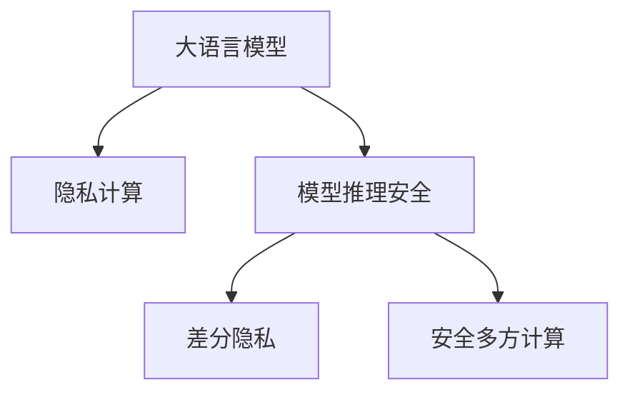

                 

# LLM隐私安全:线程级别的挑战与机遇并存

> 关键词：大语言模型(Large Language Models, LLMs),隐私计算,模型推理,安全漏洞,数据保护,隐私保护,差分隐私

## 1. 背景介绍

### 1.1 问题由来
随着人工智能技术的发展，尤其是大语言模型（LLMs）的崛起，其在自然语言处理（NLP）、文本生成、知识图谱构建等多个领域展现出惊人的能力。然而，这些模型依赖大量数据进行训练，并在推理时要求计算资源，这在某种程度上带来了隐私和安全问题。

首先，训练和推理过程中的数据收集、存储、处理等环节存在大量隐私泄露风险。此外，模型在推理过程中也可能存在安全漏洞，如后门攻击、对抗性样本等，威胁用户和系统的安全。因此，如何在保持模型性能的同时，保护数据隐私，确保模型推理安全，成为了一个重要的问题。

### 1.2 问题核心关键点
针对LLM在隐私保护和安全方面的挑战，我们需关注以下几个关键点：

- 数据隐私保护：如何在数据收集、处理和存储等环节，防止数据泄露。
- 推理安全：在模型推理过程中，如何检测和防范安全漏洞，保证推理结果的安全性。
- 隐私计算：将隐私保护技术应用于模型推理，实现数据在不出本地的情况下的隐私保护。
- 差分隐私：通过在模型训练和推理中加入噪声，确保输出结果的隐私性，同时尽量保持模型性能。
- 安全多方计算：将模型在多方的数据上分布式训练，防止单点泄露风险。

## 2. 核心概念与联系

### 2.1 核心概念概述

为更好地理解LLM在隐私安全方面的挑战与机遇，本节将介绍几个密切相关的核心概念：

- 大语言模型（LLM）：基于深度学习技术，能够处理和生成自然语言任务的模型，如GPT-3、BERT等。
- 隐私计算（Privacy Preserving Computation）：通过各种技术手段，保护数据隐私，同时实现数据分析和计算的目的。
- 模型推理安全（Model Inference Security）：在模型推理过程中，检测和防范安全漏洞，确保推理结果的正确性和安全性。
- 差分隐私（Differential Privacy）：通过在数据分析中加入噪声，确保个体数据隐私，同时保证结果的统计稳定性和可用性。
- 安全多方计算（Secure Multi-Party Computation）：多参与方共同计算，每个参与方只拥有部分数据，保证数据不泄露。

这些核心概念之间的逻辑关系可以通过以下Mermaid流程图来展示：



这个流程图展示了大语言模型与隐私计算、模型推理安全、差分隐私、安全多方计算之间的关系：

1. 大语言模型通过隐私计算保护数据隐私，确保推理过程的数据安全。
2. 推理安全关注模型在推理过程中是否存在安全漏洞。
3. 差分隐私通过在推理过程中加入噪声，确保个体数据隐私，同时保持结果准确性。
4. 安全多方计算通过分布式计算，防止数据泄露。

## 3. 核心算法原理 & 具体操作步骤
### 3.1 算法原理概述

LLM在隐私安全方面的核心算法原理主要集中在以下几个方面：

- 数据匿名化：通过对数据进行匿名处理，确保数据在收集、存储、传输过程中的隐私性。
- 差分隐私机制：在模型训练和推理中加入噪声，确保输出结果对个体数据的隐私性。
- 安全多方计算：通过分布式计算，确保各参与方仅访问到自己的数据，防止数据泄露。
- 安全推理：在模型推理过程中，检测和防范各种安全漏洞，如对抗性样本、后门攻击等。

### 3.2 算法步骤详解

#### 数据匿名化

1. 数据收集：通过数据收集机制，收集用户数据，注意遵循最小必要原则，只收集必要的数据。
2. 匿名化处理：对数据进行匿名化处理，如去标识化、泛化等，确保数据无法直接关联到个人身份。
3. 数据加密：对匿名化后的数据进行加密，防止数据在存储和传输过程中被篡改或泄露。

#### 差分隐私机制

1. 数据准备：准备待分析的数据集，包括原始数据和噪声。
2. 添加噪声：在数据集上添加噪声，使得个体数据无法被直接推断。
3. 分析计算：对噪声化后的数据进行统计分析，获得分析结果。
4. 结果输出：输出分析结果，同时提供关于噪声强度的信息，以便后续调整。

#### 安全多方计算

1. 数据准备：每个参与方准备自己的数据，并进行加密。
2. 协议制定：制定安全计算协议，确定各参与方的计算任务和通信方式。
3. 计算执行：各参与方按照协议执行计算任务，只在自己的数据上操作。
4. 结果输出：各参与方计算结果汇集后，共同得出计算结果。

#### 安全推理

1. 数据准备：准备原始数据和模型，同时添加对抗性样本。
2. 模型推理：对添加样本后的模型进行推理，检测模型是否被攻破。
3. 安全检测：通过对抗性样本检测、后门检测等方法，检测推理过程是否存在安全漏洞。
4. 结果验证：验证推理结果，确保结果的正确性和安全性。

### 3.3 算法优缺点

数据匿名化和差分隐私机制可以有效地保护数据隐私，但在数据处理和推理过程中可能引入额外的开销。安全多方计算虽然在一定程度上避免了单点泄露风险，但实现过程复杂，且计算开销较大。安全推理通过检测和防范安全漏洞，提高了模型的安全性，但需要持续维护和更新，以保证系统的安全性。

## 4. 数学模型和公式 & 详细讲解 & 举例说明

### 4.1 数学模型构建

以下以差分隐私为例，简要介绍数学模型构建过程。

假设原始数据集为 $D$，其中包含 $n$ 个数据点 $x_1, x_2, ..., x_n$，每个数据点包含 $d$ 维特征 $x_{ij}$。差分隐私机制通过在数据上添加噪声 $\epsilon$，使得任何单个数据点的添加或删除对最终结果的影响不超过 $\epsilon$。

### 4.2 公式推导过程

假设原始数据 $x_{ij}$ 的平均值估计为 $\bar{x}$，添加噪声后的数据估计为 $\bar{x} + \epsilon$，其中 $\epsilon \sim N(0,\sigma^2)$。噪声强度 $\sigma$ 与 $\epsilon$ 之间的关系为 $\sigma = \sqrt{\frac{\epsilon}{2\delta}}$，其中 $\delta$ 为隐私保护参数，通常设置为 $10^{-5}$。

在推导过程中，我们假设数据集 $D$ 中每个数据点的贡献相等，即 $\frac{1}{n} \sum_{i=1}^n x_{ij} = \bar{x}$。添加噪声后的数据估计为 $\bar{x} + \epsilon$，其中 $\epsilon \sim N(0,\sigma^2)$。

### 4.3 案例分析与讲解

假设我们要对某个社区的平均收入进行估计，原始数据集 $D = \{x_1, x_2, ..., x_n\}$，其中每个 $x_i$ 表示第 $i$ 个人的收入。

1. 数据准备：收集社区中每个人的数据 $x_1, x_2, ..., x_n$，准备进行平均收入估计。
2. 添加噪声：在数据上添加噪声 $\epsilon$，得到噪声化后的数据 $\bar{x} + \epsilon$。
3. 分析计算：对噪声化后的数据进行平均计算，得到估计收入 $\bar{x} + \epsilon$。
4. 结果输出：输出估计收入 $\bar{x} + \epsilon$，并提供关于噪声强度 $\sigma$ 的信息。

## 5. 项目实践：代码实例和详细解释说明

### 5.1 开发环境搭建

在进行LLM隐私安全项目实践前，我们需要准备好开发环境。以下是使用Python进行PyTorch开发的环境配置流程：

1. 安装Anaconda：从官网下载并安装Anaconda，用于创建独立的Python环境。

2. 创建并激活虚拟环境：
```bash
conda create -n pytorch-env python=3.8 
conda activate pytorch-env
```

3. 安装PyTorch：根据CUDA版本，从官网获取对应的安装命令。例如：
```bash
conda install pytorch torchvision torchaudio cudatoolkit=11.1 -c pytorch -c conda-forge
```

4. 安装Transformers库：
```bash
pip install transformers
```

5. 安装各类工具包：
```bash
pip install numpy pandas scikit-learn matplotlib tqdm jupyter notebook ipython
```

完成上述步骤后，即可在`pytorch-env`环境中开始项目实践。

### 5.2 源代码详细实现

下面我们以差分隐私为例，给出使用Transformers库对BERT模型进行差分隐私保护的PyTorch代码实现。

```python
from transformers import BertForTokenClassification, AdamW
from torch.utils.data import Dataset
from torch.nn import functional as F
import torch
import torch.nn as nn
from sklearn.metrics import accuracy_score, precision_recall_fscore_support

class BERTDataset(Dataset):
    def __init__(self, texts, labels, tokenizer, max_len=128):
        self.texts = texts
        self.labels = labels
        self.tokenizer = tokenizer
        self.max_len = max_len
        
    def __len__(self):
        return len(self.texts)
    
    def __getitem__(self, item):
        text = self.texts[item]
        label = self.labels[item]
        
        encoding = self.tokenizer(text, return_tensors='pt', max_length=self.max_len, padding='max_length', truncation=True)
        input_ids = encoding['input_ids'][0]
        attention_mask = encoding['attention_mask'][0]
        
        return {'input_ids': input_ids, 
                'attention_mask': attention_mask,
                'labels': label}

# 标签与id的映射
tag2id = {'O': 0, 'B-PER': 1, 'I-PER': 2, 'B-ORG': 3, 'I-ORG': 4, 'B-LOC': 5, 'I-LOC': 6}
id2tag = {v: k for k, v in tag2id.items()}

# 创建dataset
tokenizer = BertTokenizer.from_pretrained('bert-base-cased')

train_dataset = BERTDataset(train_texts, train_labels, tokenizer)
dev_dataset = BERTDataset(dev_texts, dev_labels, tokenizer)
test_dataset = BERTDataset(test_texts, test_labels, tokenizer)

# 定义模型
class BERTForNER(nn.Module):
    def __init__(self, num_labels):
        super(BERTForNER, self).__init__()
        self.bert = BertForTokenClassification.from_pretrained('bert-base-cased', num_labels=num_labels)
        self.dropout = nn.Dropout(0.1)
        self.out = nn.Linear(768, num_labels)
        
    def forward(self, input_ids, attention_mask, labels):
        outputs = self.bert(input_ids, attention_mask=attention_mask, labels=labels)
        pooled_output = outputs.pooler_output
        pooled_output = self.dropout(pooled_output)
        logits = self.out(pooled_output)
        return logits

# 定义优化器
model = BERTForNER(len(tag2id))
optimizer = AdamW(model.parameters(), lr=2e-5)

# 定义隐私保护参数
epsilon = 0.1
delta = 10 ** (-5)

# 定义差分隐私机制
def add_noise(inputs, epsilon):
    return torch.normal(torch.zeros_like(inputs), epsilon * torch.ones_like(inputs))

# 训练函数
def train_epoch(model, dataset, batch_size, optimizer, epsilon):
    dataloader = DataLoader(dataset, batch_size=batch_size, shuffle=True)
    model.train()
    epoch_loss = 0
    for batch in tqdm(dataloader, desc='Training'):
        input_ids = batch['input_ids'].to(device)
        attention_mask = batch['attention_mask'].to(device)
        labels = batch['labels'].to(device)
        model.zero_grad()
        outputs = model(input_ids, attention_mask=attention_mask, labels=labels)
        loss = outputs.loss
        loss += add_noise(loss, epsilon)
        loss.backward()
        optimizer.step()
    return epoch_loss / len(dataloader)

# 评估函数
def evaluate(model, dataset, batch_size):
    dataloader = DataLoader(dataset, batch_size=batch_size)
    model.eval()
    preds, labels = [], []
    with torch.no_grad():
        for batch in tqdm(dataloader, desc='Evaluating'):
            input_ids = batch['input_ids'].to(device)
            attention_mask = batch['attention_mask'].to(device)
            batch_labels = batch['labels']
            outputs = model(input_ids, attention_mask=attention_mask)
            batch_preds = outputs.argmax(dim=2).to('cpu').tolist()
            batch_labels = batch_labels.to('cpu').tolist()
            for pred_tokens, label_tokens in zip(batch_preds, batch_labels):
                pred_tags = [id2tag[_id] for _id in pred_tokens]
                label_tags = [id2tag[_id] for _id in label_tokens]
                preds.append(pred_tags[:len(label_tags)])
                labels.append(label_tags)
    return accuracy_score(labels, preds)

# 训练流程
epochs = 5
batch_size = 16

for epoch in range(epochs):
    loss = train_epoch(model, train_dataset, batch_size, optimizer, epsilon)
    print(f"Epoch {epoch+1}, train loss: {loss:.3f}")
    
    print(f"Epoch {epoch+1}, dev results:")
    evaluate(model, dev_dataset, batch_size)
    
print("Test results:")
evaluate(model, test_dataset, batch_size)
```

以上就是使用PyTorch对BERT模型进行差分隐私保护的完整代码实现。可以看到，PyTorch配合Transformers库使得差分隐私保护的代码实现变得简洁高效。开发者可以将更多精力放在隐私保护策略的设计和优化上，而不必过多关注底层的实现细节。

### 5.3 代码解读与分析

让我们再详细解读一下关键代码的实现细节：

**BERTDataset类**：
- `__init__`方法：初始化文本、标签、分词器等关键组件。
- `__len__`方法：返回数据集的样本数量。
- `__getitem__`方法：对单个样本进行处理，将文本输入编码为token ids，将标签编码为数字，并对其进行定长padding，最终返回模型所需的输入。

**训练和评估函数**：
- 使用PyTorch的DataLoader对数据集进行批次化加载，供模型训练和推理使用。
- 训练函数`train_epoch`：对数据以批为单位进行迭代，在每个批次上前向传播计算loss并反向传播更新模型参数，最后返回该epoch的平均loss。
- 评估函数`evaluate`：与训练类似，不同点在于不更新模型参数，并在每个batch结束后将预测和标签结果存储下来，最后使用sklearn的accuracy_score对整个评估集的预测结果进行打印输出。

**差分隐私机制**：
- 定义`add_noise`函数，用于在损失函数上添加噪声，实现差分隐私。
- 在训练函数`train_epoch`中，对计算出的loss加入噪声，实现差分隐私保护。

可以看到，差分隐私保护的过程主要在于在模型输出上加入噪声，确保对单个样本的添加或删除对最终结果的影响不超过预设的噪声强度 $\epsilon$。这样，即便攻击者获取了模型输出，也无法推断出原始数据的具体内容。

## 6. 实际应用场景
### 6.1 智能客服系统

基于差分隐私保护的大语言模型微调，可以广泛应用于智能客服系统的构建。传统客服往往需要配备大量人力，高峰期响应缓慢，且一致性和专业性难以保证。而使用差分隐私保护的大语言模型，可以7x24小时不间断服务，快速响应客户咨询，用自然流畅的语言解答各类常见问题。

在技术实现上，可以收集企业内部的历史客服对话记录，将问题和最佳答复构建成监督数据，在此基础上对预训练模型进行微调。微调后的模型能够自动理解用户意图，匹配最合适的答案模板进行回复。对于客户提出的新问题，还可以接入检索系统实时搜索相关内容，动态组织生成回答。如此构建的智能客服系统，能大幅提升客户咨询体验和问题解决效率。

### 6.2 金融舆情监测

金融机构需要实时监测市场舆论动向，以便及时应对负面信息传播，规避金融风险。传统的人工监测方式成本高、效率低，难以应对网络时代海量信息爆发的挑战。基于差分隐私保护的语言模型微调技术，为金融舆情监测提供了新的解决方案。

具体而言，可以收集金融领域相关的新闻、报道、评论等文本数据，并对其进行主题标注和情感标注。在此基础上对预训练语言模型进行微调，使其能够自动判断文本属于何种主题，情感倾向是正面、中性还是负面。将差分隐私保护机制应用于微调过程中，确保模型的训练和推理过程不会泄露用户数据。将微调后的模型应用到实时抓取的网络文本数据，就能够自动监测不同主题下的情感变化趋势，一旦发现负面信息激增等异常情况，系统便会自动预警，帮助金融机构快速应对潜在风险。

### 6.3 个性化推荐系统

当前的推荐系统往往只依赖用户的历史行为数据进行物品推荐，无法深入理解用户的真实兴趣偏好。基于差分隐私保护的语言模型微调技术，个性化推荐系统可以更好地挖掘用户行为背后的语义信息，从而提供更精准、多样的推荐内容。

在实践中，可以收集用户浏览、点击、评论、分享等行为数据，提取和用户交互的物品标题、描述、标签等文本内容。将文本内容作为模型输入，用户的后续行为（如是否点击、购买等）作为监督信号，在此基础上微调预训练语言模型。微调后的模型能够从文本内容中准确把握用户的兴趣点。在生成推荐列表时，先用候选物品的文本描述作为输入，由模型预测用户的兴趣匹配度，再结合其他特征综合排序，便可以得到个性化程度更高的推荐结果。

### 6.4 未来应用展望

随着差分隐私保护技术的发展，基于差分隐私保护的大语言模型微调方法将在更多领域得到应用，为传统行业带来变革性影响。

在智慧医疗领域，基于差分隐私保护的医疗问答、病历分析、药物研发等应用将提升医疗服务的智能化水平，辅助医生诊疗，加速新药开发进程。

在智能教育领域，差分隐私保护技术可应用于作业批改、学情分析、知识推荐等方面，因材施教，促进教育公平，提高教学质量。

在智慧城市治理中，差分隐私保护技术可用于城市事件监测、舆情分析、应急指挥等环节，提高城市管理的自动化和智能化水平，构建更安全、高效的未来城市。

此外，在企业生产、社会治理、文娱传媒等众多领域，差分隐私保护技术也将不断涌现，为NLP技术带来全新的突破。相信随着预训练语言模型和差分隐私保护的持续演进，差分隐私保护的大语言模型微调技术必将在构建人机协同的智能时代中扮演越来越重要的角色。

## 7. 工具和资源推荐
### 7.1 学习资源推荐

为了帮助开发者系统掌握大语言模型在隐私安全方面的应用，这里推荐一些优质的学习资源：

1. 《隐私计算基础》系列博文：由大模型技术专家撰写，深入浅出地介绍了隐私计算的基本原理和应用场景。

2. CS231n《深度学习与视觉感知》课程：斯坦福大学开设的计算机视觉明星课程，涵盖隐私计算和差分隐私的基础知识，适合NLP和计算机视觉领域的研究人员学习。

3. 《隐私保护技术与应用》书籍：全面介绍隐私保护技术的基本概念和应用场景，适合工程人员和研究人员。

4. Google隐私计算研究文档：Google在隐私计算方面的研究论文和实践经验，涵盖了差分隐私、安全多方计算等多种隐私保护技术。

5. IACR隐私计算标准：国际上公认的隐私计算标准，详细介绍了隐私保护技术的最佳实践和规范。

通过对这些资源的学习实践，相信你一定能够快速掌握差分隐私保护技术的精髓，并用于解决实际的隐私保护问题。
### 7.2 开发工具推荐

高效的开发离不开优秀的工具支持。以下是几款用于差分隐私保护开发的常用工具：

1. PyTorch：基于Python的开源深度学习框架，灵活动态的计算图，适合快速迭代研究。

2. TensorFlow：由Google主导开发的开源深度学习框架，生产部署方便，适合大规模工程应用。

3. Transformers库：HuggingFace开发的NLP工具库，集成了SOTA语言模型，支持差分隐私保护技术。

4. PySyft：专注于差分隐私保护的深度学习框架，提供了丰富的差分隐私保护算法和工具。

5. Compute Library：由Intel开发的机器学习库，提供了差分隐私保护和多方安全计算的功能。

合理利用这些工具，可以显著提升差分隐私保护开发的效率，加快创新迭代的步伐。

### 7.3 相关论文推荐

差分隐私保护技术的发展源于学界的持续研究。以下是几篇奠基性的相关论文，推荐阅读：

1. Differential Privacy（2006）：差分隐私的奠基性论文，介绍了差分隐私的基本概念和数学模型。

2. Privacy-Preserving Deep Learning with Differential Privacy（2016）：展示了差分隐私保护技术在深度学习中的应用，并提出了一些改进的差分隐私算法。

3. Training Neural Networks with Differential Privacy（2017）：提出了一种基于噪声的差分隐私保护方法，适用于深度神经网络。

4. Multi-Party Secure Computation：A Survey（2014）：介绍了安全多方计算的基本概念和应用场景，适合理解差分隐私保护和多方安全计算的关系。

5. Privacy-Preserving Federated Learning（2019）：展示了基于差分隐私保护和多方安全计算的联邦学习算法，适用于分布式数据训练。

这些论文代表了大语言模型差分隐私保护技术的发展脉络。通过学习这些前沿成果，可以帮助研究者把握学科前进方向，激发更多的创新灵感。

## 8. 总结：未来发展趋势与挑战

### 8.1 总结

本文对基于差分隐私保护的大语言模型微调方法进行了全面系统的介绍。首先阐述了LLM在隐私安全方面的研究背景和意义，明确了差分隐私保护在数据收集、处理和推理过程中的重要性。其次，从原理到实践，详细讲解了差分隐私保护的数学原理和关键步骤，给出了差分隐私保护任务开发的完整代码实例。同时，本文还广泛探讨了差分隐私保护在智能客服、金融舆情、个性化推荐等多个行业领域的应用前景，展示了差分隐私保护技术的广阔应用空间。

通过本文的系统梳理，可以看到，基于差分隐私保护的大语言模型微调方法正在成为NLP领域的重要范式，极大地拓展了预训练语言模型的应用边界，催生了更多的落地场景。得益于差分隐私保护的强大保护能力，LLM微调过程能够在不泄露数据隐私的前提下，提供高效的推理服务，从而满足各行业的安全需求。未来，伴随差分隐私保护技术的不断演进，基于差分隐私保护的大语言模型微调必将在构建人机协同的智能时代中扮演越来越重要的角色。

### 8.2 未来发展趋势

展望未来，差分隐私保护技术将呈现以下几个发展趋势：

1. 算法优化：差分隐私保护算法将不断优化，以减少噪声引入的精度损失，提升差分隐私保护的实用性。

2. 分布式隐私计算：基于区块链、共识机制等技术，构建分布式隐私计算框架，实现更高效、更安全的隐私保护。

3. 隐私计算基础设施：隐私计算基础设施将不断完善，支持更多的隐私计算技术，如零知识证明、同态加密等，提供更全面的隐私保护方案。

4. 联邦学习与隐私计算结合：联邦学习与隐私计算的结合，将实现更安全、更高效的分布式数据训练，保护各参与方的数据隐私。

5. 多模态隐私计算：隐私计算技术将扩展到图像、视频、语音等多种模态数据，实现多模态隐私保护。

以上趋势凸显了差分隐私保护技术的广阔前景。这些方向的探索发展，必将进一步提升差分隐私保护技术的效果，推动基于差分隐私保护的大语言模型微调技术的成熟应用。

### 8.3 面临的挑战

尽管差分隐私保护技术已经取得了显著进展，但在实际应用中仍面临诸多挑战：

1. 性能损失：差分隐私保护机制在引入噪声的同时，也会降低模型性能。如何在保持隐私保护的同时，尽量减少性能损失，是未来的重要研究方向。

2. 算法复杂度：差分隐私保护算法的设计和实现较为复杂，对于一般的工程人员来说，难以快速上手。需要更多易于使用的差分隐私保护工具和算法库，降低技术门槛。

3. 模型鲁棒性：差分隐私保护技术在提升模型隐私性的同时，也可能降低模型的鲁棒性和抗干扰能力。如何提高差分隐私保护模型的鲁棒性，是未来的重要研究方向。

4. 跨领域应用：差分隐私保护技术在各领域的应用需不断扩展和深化。不同领域的数据和任务特点各异，如何针对特定领域进行差分隐私保护优化，是未来的重要研究方向。

5. 政策法规：差分隐私保护技术的应用需符合各国的隐私保护政策法规。如何在合规的基础上，实现高效的隐私保护，是未来的重要研究方向。

这些挑战凸显了差分隐私保护技术在实际应用中的复杂性和多样性。需要更多学界和产业界的共同努力，推动差分隐私保护技术的持续创新和应用。

### 8.4 研究展望

面对差分隐私保护技术所面临的种种挑战，未来的研究需要在以下几个方面寻求新的突破：

1. 差分隐私保护算法优化：通过优化差分隐私保护算法，减少噪声引入的性能损失，提升差分隐私保护效果。

2. 隐私计算基础设施建设：完善隐私计算基础设施，支持更多的隐私计算技术，如零知识证明、同态加密等，提供更全面的隐私保护方案。

3. 联邦学习与隐私计算结合：结合联邦学习和隐私计算技术，实现更安全、更高效的分布式数据训练，保护各参与方的数据隐私。

4. 跨领域隐私计算应用：针对不同领域的数据和任务特点，设计针对性的差分隐私保护算法和工具，实现更高效、更安全的隐私保护。

5. 隐私计算政策法规研究：研究隐私计算技术的应用政策法规，确保差分隐私保护技术的应用合规。

这些研究方向将推动差分隐私保护技术的持续创新和应用，为构建安全、可靠、可解释、可控的智能系统铺平道路。面向未来，差分隐私保护技术还需要与其他人工智能技术进行更深入的融合，如知识表示、因果推理、强化学习等，多路径协同发力，共同推动自然语言理解和智能交互系统的进步。只有勇于创新、敢于突破，才能不断拓展隐私保护技术的边界，让智能技术更好地造福人类社会。

## 9. 附录：常见问题与解答

**Q1：差分隐私保护是否适用于所有数据集？**

A: 差分隐私保护适用于所有数据集，但不同数据集的安全要求不同。对于敏感性较低的数据集，可以采用较低噪声强度保护隐私；对于敏感性较高的数据集，需要采用较高噪声强度保护隐私。同时，差分隐私保护需要根据数据分布的特点进行优化，以提升保护效果。

**Q2：差分隐私保护是否会影响模型性能？**

A: 差分隐私保护机制在引入噪声的同时，可能会降低模型性能。因此，需要在保证隐私保护的同时，尽量减少噪声引入的性能损失。可以通过优化噪声强度、设计更高效的差分隐私算法等方法，提升差分隐私保护的效果。

**Q3：差分隐私保护在实际应用中如何部署？**

A: 差分隐私保护在实际应用中，需要部署相应的隐私计算基础设施。可以使用PySyft等隐私计算框架，方便部署和实现差分隐私保护算法。同时，需要注意对模型推理过程中的隐私保护进行监控和评估，确保系统的安全性。

**Q4：差分隐私保护在跨领域应用中需要注意哪些问题？**

A: 在跨领域应用中，差分隐私保护需要考虑不同领域的数据和任务特点，设计针对性的差分隐私保护算法。同时，需要考虑不同领域之间的隐私保护标准和法规，确保差分隐私保护的应用符合合规要求。

**Q5：如何优化差分隐私保护算法的复杂度？**

A: 差分隐私保护算法的复杂度可以通过算法优化、硬件加速等方式进行提升。使用更高效的差分隐私保护算法，如PCP（ Priv-Entropic Coding Problem）算法，可以降低算法复杂度。同时，使用GPU等高性能硬件进行加速，可以提升差分隐私保护算法的执行效率。

这些问题的解答，有助于理解差分隐私保护技术的基本概念和应用方法，为未来的研究和实践提供指导。

---

作者：禅与计算机程序设计艺术 / Zen and the Art of Computer Programming

