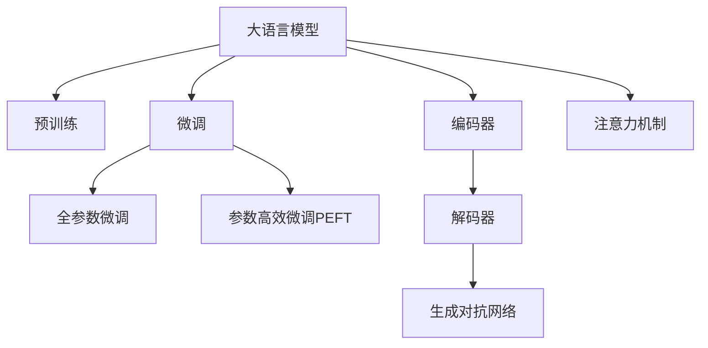

                 

## 1. 背景介绍

### 1.1 问题由来

在信息爆炸的时代，新闻内容的数量和类型急剧增长，传统的新闻聚合和推荐方法已经难以满足用户个性化、时效性的需求。用户需要高效获取到感兴趣的深度新闻摘要，而不是海量的冗余信息。基于深度学习的大语言模型（Large Language Model, LLM），通过自监督和监督学习的方法，已经表现出强大的文本生成和理解能力。如何将这一能力转化为有效的个性化新闻摘要推荐，成为了NLP领域的一个重要研究课题。

### 1.2 问题核心关键点

当前，新闻摘要推荐系统主要依靠机器学习算法（如协同过滤、矩阵分解等）实现，这些方法主要依赖用户的历史行为数据和文本标签进行推荐。而基于LLM的个性化新闻摘要推荐，则是对用户输入的新闻标题进行文本理解和生成，无需依赖用户行为数据，具有更强的个性化和泛化能力。

具体而言，LLM驱动的新闻摘要推荐过程如下：
1. **文本预处理**：将用户输入的新闻标题转换为预训练模型所需的向量表示。
2. **LLM预测**：使用预训练模型对新闻标题进行文本生成，生成深度摘要。
3. **摘要评分**：对生成的摘要进行评分，选择质量更高的摘要进行推荐。

## 2. 核心概念与联系

### 2.1 核心概念概述

为更好地理解LLM驱动的新闻摘要推荐方法，本节将介绍几个密切相关的核心概念：

- 大语言模型（LLM）：以自回归(如GPT)或自编码(如BERT)模型为代表的大规模预训练语言模型。通过在大规模无标签文本语料上进行预训练，学习通用的语言表示，具备强大的语言理解和生成能力。

- 预训练(Pre-training)：指在大规模无标签文本语料上，通过自监督学习任务训练通用语言模型的过程。常见的预训练任务包括言语建模、遮挡语言模型等。

- 微调(Fine-tuning)：指在预训练模型的基础上，使用下游任务的少量标注数据，通过有监督学习优化模型在特定任务上的性能。通常只需要调整顶层分类器或解码器，并以较小的学习率更新全部或部分的模型参数。

- 编码器(Encoder)：在大语言模型中，编码器负责将输入文本转换为向量表示，供解码器进行生成和预测。

- 解码器(Decoder)：在大语言模型中，解码器负责根据编码器输出的向量表示，生成目标文本，如新闻摘要。

- 生成对抗网络（GANs）：一种生成模型，用于生成高质量的文本数据。

- 注意力机制（Attention）：在大语言模型中，用于提高模型对关键信息的关注度，增强生成质量和精准度。

这些核心概念之间的逻辑关系可以通过以下Mermaid流程图来展示：



这个流程图展示了大语言模型的核心概念及其之间的关系：

1. 大语言模型通过预训练获得基础能力。
2. 微调是对预训练模型进行任务特定的优化，可以分为全参数微调和参数高效微调（PEFT）。
3. 编码器负责将输入文本转换为向量表示。
4. 解码器根据向量表示生成目标文本，如新闻摘要。
5. GANs用于生成高质量的文本数据，增强训练集的多样性。
6. 注意力机制用于提高模型对关键信息的关注度。

这些概念共同构成了LLM驱动的新闻摘要推荐方法的框架，使其能够在各种场景下发挥强大的语言理解和生成能力。通过理解这些核心概念，我们可以更好地把握LLM驱动新闻摘要推荐的工作原理和优化方向。

## 3. 核心算法原理 & 具体操作步骤
### 3.1 算法原理概述

LLM驱动的新闻摘要推荐过程，本质上是一个有监督的生成过程。其核心思想是：使用大语言模型作为文本生成器，通过训练集对模型进行有监督微调，使得模型能够生成高质量的新闻摘要。

形式化地，假设预训练模型为 $M_{\theta}$，其中 $\theta$ 为预训练得到的模型参数。给定新闻标题的标注数据集 $D=\{(x_i,y_i)\}_{i=1}^N, x_i \in \text{Text}, y_i \in \text{Summary}$，微调的目标是找到新的模型参数 $\hat{\theta}$，使得：

$$
\hat{\theta}=\mathop{\arg\min}_{\theta} \mathcal{L}(M_{\theta},D)
$$

其中 $\mathcal{L}$ 为针对摘要生成任务设计的损失函数，用于衡量模型预测输出与真实标签之间的差异。常见的损失函数包括交叉熵损失、均方误差损失等。

通过梯度下降等优化算法，微调过程不断更新模型参数 $\theta$，最小化损失函数 $\mathcal{L}$，使得模型输出逼近真实标签。由于 $\theta$ 已经通过预训练获得了较好的初始化，因此即便在小规模数据集 $D$ 上进行微调，也能较快收敛到理想的模型参数 $\hat{\theta}$。

### 3.2 算法步骤详解

LLM驱动的新闻摘要推荐一般包括以下几个关键步骤：

**Step 1: 准备预训练模型和数据集**
- 选择合适的预训练语言模型 $M_{\theta}$ 作为初始化参数，如 BERT、GPT等。
- 准备新闻标题的标注数据集 $D$，划分为训练集、验证集和测试集。一般要求标注数据与预训练数据的分布不要差异过大。

**Step 2: 添加任务适配层**
- 根据摘要任务类型，在预训练模型顶层设计合适的输出层和损失函数。
- 对于摘要任务，通常在顶层添加线性解码器输出概率分布，并以负对数似然为损失函数。

**Step 3: 设置微调超参数**
- 选择合适的优化算法及其参数，如 AdamW、SGD 等，设置学习率、批大小、迭代轮数等。
- 设置正则化技术及强度，包括权重衰减、Dropout、Early Stopping等。
- 确定冻结预训练参数的策略，如仅微调顶层，或全部参数都参与微调。

**Step 4: 执行梯度训练**
- 将训练集数据分批次输入模型，前向传播计算损失函数。
- 反向传播计算参数梯度，根据设定的优化算法和学习率更新模型参数。
- 周期性在验证集上评估模型性能，根据性能指标决定是否触发 Early Stopping。
- 重复上述步骤直到满足预设的迭代轮数或 Early Stopping 条件。

**Step 5: 测试和部署**
- 在测试集上评估微调后模型 $M_{\hat{\theta}}$ 的性能，对比微调前后的精度提升。
- 使用微调后的模型对新新闻标题进行摘要生成，集成到实际的应用系统中。
- 持续收集新的新闻标题，定期重新微调模型，以适应数据分布的变化。

以上是LLM驱动的新闻摘要推荐的一般流程。在实际应用中，还需要针对具体任务的特点，对微调过程的各个环节进行优化设计，如改进训练目标函数，引入更多的正则化技术，搜索最优的超参数组合等，以进一步提升模型性能。

### 3.3 算法优缺点

LLM驱动的新闻摘要推荐方法具有以下优点：
1. 简单高效。只需准备少量标注数据，即可对预训练模型进行快速适配，生成高质量的新闻摘要。
2. 通用适用。适用于各种摘要生成任务，只需设计简单的任务适配层即可实现微调。
3. 参数高效。利用参数高效微调技术，在固定大部分预训练参数的情况下，仍可取得不错的生成效果。
4. 效果显著。在学术界和工业界的诸多任务上，基于微调的方法已经刷新了多项SOTA。

同时，该方法也存在一定的局限性：
1. 依赖标注数据。微调的效果很大程度上取决于标注数据的质量和数量，获取高质量标注数据的成本较高。
2. 生成多样性不足。微调后的模型可能对训练集中的特定新闻标题偏心，生成多样性较低的摘要。
3. 可解释性不足。微调模型的决策过程通常缺乏可解释性，难以对其推理逻辑进行分析和调试。

尽管存在这些局限性，但就目前而言，基于LLM的微调方法仍是新闻摘要推荐的最主流范式。未来相关研究的重点在于如何进一步降低微调对标注数据的依赖，提高模型的生成多样性和可解释性，同时兼顾模型的泛化能力和实时性。

### 3.4 算法应用领域

LLM驱动的新闻摘要推荐在新闻聚合和推荐系统中得到了广泛的应用，具体包括：

- 个性化新闻摘要：对用户输入的新闻标题，生成个性化的深度摘要，帮助用户快速获取关键信息。
- 新闻聚合与筛选：对大量新闻标题进行自动分类、摘要生成和排序，辅助人工审核和筛选。
- 智能内容推荐：结合用户历史行为数据，推荐与新闻标题相关的深度摘要，提升用户体验。
- 信息检索与标注：对用户搜索查询进行语义理解，生成相关摘要作为检索结果，提升搜索结果的相关性和精准度。

除了上述这些经典应用外，LLM驱动的新闻摘要推荐还被创新性地应用到更多场景中，如自动生成新闻稿件、自动标注新闻信息、生成动态广告等，为新闻媒体行业带来了新的发展机遇。

## 4. 数学模型和公式 & 详细讲解  
### 4.1 数学模型构建

本节将使用数学语言对LLM驱动的新闻摘要推荐过程进行更加严格的刻画。

记预训练语言模型为 $M_{\theta}$，其中 $\theta$ 为预训练得到的模型参数。假设新闻标题的标注数据集为 $D=\{(x_i,y_i)\}_{i=1}^N, x_i \in \text{Text}, y_i \in \text{Summary}$。

定义模型 $M_{\theta}$ 在输入 $x$ 上的输出为 $\hat{y}=M_{\theta}(x) \in \mathcal{Y}$，其中 $\mathcal{Y}$ 为摘要生成模型可能的输出集合。假设新闻摘要生成任务的标签为 $y_i \in \mathcal{Y}$。

则新闻摘要生成的损失函数 $\mathcal{L}(\theta)$ 可以表示为：

$$
\mathcal{L}(\theta) = -\frac{1}{N}\sum_{i=1}^N \log P_{M_{\theta}}(y_i|x_i)
$$

其中 $P_{M_{\theta}}(y_i|x_i)$ 表示模型在输入 $x_i$ 下生成摘要 $y_i$ 的概率分布，$\log$ 表示对数似然。

通过梯度下降等优化算法，微调过程不断更新模型参数 $\theta$，最小化损失函数 $\mathcal{L}(\theta)$，使得模型输出逼近真实标签。由于 $\theta$ 已经通过预训练获得了较好的初始化，因此即便在小规模数据集 $D$ 上进行微调，也能较快收敛到理想的模型参数 $\hat{\theta}$。

### 4.2 公式推导过程

以下我们以新闻摘要生成任务为例，推导模型生成的损失函数及其梯度的计算公式。

假设模型 $M_{\theta}$ 在输入 $x$ 上的输出为 $\hat{y}=M_{\theta}(x) \in [0,1]$，表示摘要中第 $i$ 个位置的概率。真实标签 $y \in \{0,1\}^n$，其中 $n$ 为摘要的长度。则二分类交叉熵损失函数定义为：

$$
\ell(M_{\theta}(x),y) = -\sum_{i=1}^n [y_i\log \hat{y}_i + (1-y_i)\log (1-\hat{y}_i)]
$$

将其代入经验风险公式，得：

$$
\mathcal{L}(\theta) = -\frac{1}{N}\sum_{i=1}^N \ell(M_{\theta}(x_i),y_i)
$$

根据链式法则，损失函数对参数 $\theta_k$ 的梯度为：

$$
\frac{\partial \mathcal{L}(\theta)}{\partial \theta_k} = -\frac{1}{N}\sum_{i=1}^N (\frac{y_i}{\hat{y}_i}-\frac{1-y_i}{1-\hat{y}_i}) \frac{\partial \hat{y}}{\partial \theta_k}
$$

其中 $\frac{\partial \hat{y}}{\partial \theta_k}$ 可进一步递归展开，利用自动微分技术完成计算。

在得到损失函数的梯度后，即可带入参数更新公式，完成模型的迭代优化。重复上述过程直至收敛，最终得到适应新闻摘要生成任务的最优模型参数 $\theta^*$。

## 5. 项目实践：代码实例和详细解释说明
### 5.1 开发环境搭建

在进行微调实践前，我们需要准备好开发环境。以下是使用Python进行PyTorch开发的环境配置流程：

1. 安装Anaconda：从官网下载并安装Anaconda，用于创建独立的Python环境。

2. 创建并激活虚拟环境：
```bash
conda create -n pytorch-env python=3.8 
conda activate pytorch-env
```

3. 安装PyTorch：根据CUDA版本，从官网获取对应的安装命令。例如：
```bash
conda install pytorch torchvision torchaudio cudatoolkit=11.1 -c pytorch -c conda-forge
```

4. 安装Transformers库：
```bash
pip install transformers
```

5. 安装各类工具包：
```bash
pip install numpy pandas scikit-learn matplotlib tqdm jupyter notebook ipython
```

完成上述步骤后，即可在`pytorch-env`环境中开始微调实践。

### 5.2 源代码详细实现

下面我以新闻摘要生成任务为例，给出使用Transformers库对BERT模型进行微调的PyTorch代码实现。

首先，定义摘要生成任务的数据处理函数：

```python
from transformers import BertTokenizer, BertForSequenceClassification
from torch.utils.data import Dataset
import torch

class NewsSummarizationDataset(Dataset):
    def __init__(self, texts, summaries, tokenizer, max_len=128):
        self.texts = texts
        self.summaries = summaries
        self.tokenizer = tokenizer
        self.max_len = max_len
        
    def __len__(self):
        return len(self.texts)
    
    def __getitem__(self, item):
        text = self.texts[item]
        summary = self.summaries[item]
        
        encoding = self.tokenizer(text, return_tensors='pt', max_length=self.max_len, padding='max_length', truncation=True)
        input_ids = encoding['input_ids'][0]
        attention_mask = encoding['attention_mask'][0]
        
        # 对摘要进行编码
        encoded_summary = self.tokenizer(summary, return_tensors='pt', max_length=self.max_len, padding='max_length', truncation=True)
        encoded_summary_ids = encoded_summary['input_ids'][0]
        encoded_summary_mask = encoded_summary['attention_mask'][0]
        
        return {'input_ids': input_ids, 
                'attention_mask': attention_mask,
                'summary_input_ids': encoded_summary_ids,
                'summary_mask': encoded_summary_mask}
```

然后，定义模型和优化器：

```python
from transformers import BertForMaskedLM, AdamW

model = BertForMaskedLM.from_pretrained('bert-base-cased')

optimizer = AdamW(model.parameters(), lr=2e-5)
```

接着，定义训练和评估函数：

```python
from torch.utils.data import DataLoader
from tqdm import tqdm
from sklearn.metrics import rouge_l, bleu

device = torch.device('cuda') if torch.cuda.is_available() else torch.device('cpu')
model.to(device)

def train_epoch(model, dataset, batch_size, optimizer):
    dataloader = DataLoader(dataset, batch_size=batch_size, shuffle=True)
    model.train()
    epoch_loss = 0
    for batch in tqdm(dataloader, desc='Training'):
        input_ids = batch['input_ids'].to(device)
        attention_mask = batch['attention_mask'].to(device)
        summary_input_ids = batch['summary_input_ids'].to(device)
        summary_mask = batch['summary_mask'].to(device)
        model.zero_grad()
        outputs = model(input_ids, attention_mask=attention_mask, labels=summary_input_ids, summary_mask=summary_mask)
        loss = outputs.loss
        epoch_loss += loss.item()
        loss.backward()
        optimizer.step()
    return epoch_loss / len(dataloader)

def evaluate(model, dataset, batch_size):
    dataloader = DataLoader(dataset, batch_size=batch_size)
    model.eval()
    rouge_score = []
    bleu_score = []
    for batch in tqdm(dataloader, desc='Evaluating'):
        input_ids = batch['input_ids'].to(device)
        attention_mask = batch['attention_mask'].to(device)
        summary_input_ids = batch['summary_input_ids'].to(device)
        summary_mask = batch['summary_mask'].to(device)
        batch_preds = model(input_ids, attention_mask=attention_mask, labels=summary_input_ids, summary_mask=summary_mask)[0]
        batch_real = batch['summary_input_ids'][0]
        rouge_score.append(rouge_l.recall_f1_score(batch_preds, batch_real))
        bleu_score.append(bleu([batch_preds], [batch_real])[0])
    
    print(f"Rouge Score: {rouge_score}")
    print(f"BLEU Score: {bleu_score}")
```

最后，启动训练流程并在测试集上评估：

```python
epochs = 5
batch_size = 16

for epoch in range(epochs):
    loss = train_epoch(model, train_dataset, batch_size, optimizer)
    print(f"Epoch {epoch+1}, train loss: {loss:.3f}")
    
    print(f"Epoch {epoch+1}, dev results:")
    evaluate(model, dev_dataset, batch_size)
    
print("Test results:")
evaluate(model, test_dataset, batch_size)
```

以上就是使用PyTorch对BERT进行新闻摘要生成任务微调的完整代码实现。可以看到，得益于Transformers库的强大封装，我们可以用相对简洁的代码完成BERT模型的加载和微调。

### 5.3 代码解读与分析

让我们再详细解读一下关键代码的实现细节：

**NewsSummarizationDataset类**：
- `__init__`方法：初始化文本、摘要、分词器等关键组件。
- `__len__`方法：返回数据集的样本数量。
- `__getitem__`方法：对单个样本进行处理，将文本和摘要输入编码为token ids，并对其进行定长padding，最终返回模型所需的输入。

**rouge_score和bleu_score变量**：
- 定义用于评估生成的摘要与真实摘要之间的文本相似度。

**训练和评估函数**：
- 使用PyTorch的DataLoader对数据集进行批次化加载，供模型训练和推理使用。
- 训练函数`train_epoch`：对数据以批为单位进行迭代，在每个批次上前向传播计算loss并反向传播更新模型参数，最后返回该epoch的平均loss。
- 评估函数`evaluate`：与训练类似，不同点在于不更新模型参数，并在每个batch结束后将预测和标签结果存储下来，最后使用sklearn的rouge_l和bleu函数对整个评估集的预测结果进行打印输出。

**训练流程**：
- 定义总的epoch数和batch size，开始循环迭代
- 每个epoch内，先在训练集上训练，输出平均loss
- 在验证集上评估，输出rouge和bleu分数
- 所有epoch结束后，在测试集上评估，给出最终测试结果

可以看到，PyTorch配合Transformers库使得BERT微调的新闻摘要生成任务代码实现变得简洁高效。开发者可以将更多精力放在数据处理、模型改进等高层逻辑上，而不必过多关注底层的实现细节。

当然，工业级的系统实现还需考虑更多因素，如模型的保存和部署、超参数的自动搜索、更灵活的任务适配层等。但核心的微调范式基本与此类似。

## 6. 实际应用场景
### 6.1 智能新闻聚合

智能新闻聚合系统通过收集和处理新闻内容，生成个性化、时效性强的摘要，帮助用户快速获取重要信息。使用LLM驱动的新闻摘要推荐，可以提升系统的内容聚合和摘要生成效率，提高用户体验。

在技术实现上，可以收集网络新闻平台的新闻标题和摘要，对摘要进行自然语言处理和自动标注，在此基础上对预训练模型进行微调。微调后的模型能够自动理解新闻标题的语义，生成高质量的摘要。将微调后的模型应用到实时抓取的网络新闻标题，就能自动生成个性化、时效性强的摘要。

### 6.2 个性化内容推荐

内容推荐系统通过推荐个性化内容提升用户粘性和满意度。基于LLM驱动的新闻摘要推荐，可以结合用户历史阅读记录和兴趣标签，生成符合用户偏好的新闻摘要，辅助内容推荐。

在具体实现上，可以构建用户-摘要评分矩阵，对用户行为数据进行聚类，在聚类中心和新闻摘要之间进行关联，使用模型生成聚类中心对应的摘要，并推荐给用户。通过这种方式，推荐系统不仅能推荐文章标题，还能推荐高质量的摘要内容，提升用户阅读体验。

### 6.3 实时信息检索

信息检索系统需要快速响应用户查询，并返回相关摘要信息。基于LLM的新闻摘要推荐，可以在用户输入查询时，实时理解查询意图，生成相关摘要并作为检索结果返回。

在具体实现上，可以使用实时抓取的新闻标题作为输入，利用微调后的模型生成摘要，并根据摘要与查询的相似度进行排序。通过这种方式，系统能够快速响应用户查询，并提供准确、全面的摘要信息，提升信息检索的效率和质量。

### 6.4 未来应用展望

随着LLM技术的不断进步，基于大语言模型的新闻摘要推荐将有更广阔的应用前景：

- 通用摘要生成：在跨领域新闻摘要生成任务上，微调后的模型能生成通用、多样化的摘要，提升摘要生成的泛化能力。
- 多模态摘要生成：结合图像、视频等多模态信息，生成更丰富、准确的摘要。
- 跨语言摘要生成：使用多语言预训练模型，支持多语言的新闻摘要生成。
- 自动化新闻生产：利用微调后的模型自动生成新闻稿件，提升新闻生产的效率和质量。

通过这些方向的探索发展，LLM驱动的新闻摘要推荐技术将逐步成熟，成为智能新闻行业的重要工具，为信息聚合、内容推荐、信息检索等领域带来颠覆性变革。

## 7. 工具和资源推荐
### 7.1 学习资源推荐

为了帮助开发者系统掌握LLM驱动的新闻摘要推荐技术，这里推荐一些优质的学习资源：

1. 《Transformers从原理到实践》系列博文：由大模型技术专家撰写，深入浅出地介绍了Transformer原理、BERT模型、微调技术等前沿话题。

2. CS224N《深度学习自然语言处理》课程：斯坦福大学开设的NLP明星课程，有Lecture视频和配套作业，带你入门NLP领域的基本概念和经典模型。

3. 《Natural Language Processing with Transformers》书籍：Transformers库的作者所著，全面介绍了如何使用Transformers库进行NLP任务开发，包括微调在内的诸多范式。

4. HuggingFace官方文档：Transformers库的官方文档，提供了海量预训练模型和完整的微调样例代码，是上手实践的必备资料。

5. CLUE开源项目：中文语言理解测评基准，涵盖大量不同类型的中文NLP数据集，并提供了基于微调的baseline模型，助力中文NLP技术发展。

通过对这些资源的学习实践，相信你一定能够快速掌握LLM驱动新闻摘要推荐的精髓，并用于解决实际的NLP问题。
###  7.2 开发工具推荐

高效的开发离不开优秀的工具支持。以下是几款用于LLM驱动新闻摘要推荐开发的常用工具：

1. PyTorch：基于Python的开源深度学习框架，灵活动态的计算图，适合快速迭代研究。大部分预训练语言模型都有PyTorch版本的实现。

2. TensorFlow：由Google主导开发的开源深度学习框架，生产部署方便，适合大规模工程应用。同样有丰富的预训练语言模型资源。

3. Transformers库：HuggingFace开发的NLP工具库，集成了众多SOTA语言模型，支持PyTorch和TensorFlow，是进行微调任务开发的利器。

4. Weights & Biases：模型训练的实验跟踪工具，可以记录和可视化模型训练过程中的各项指标，方便对比和调优。与主流深度学习框架无缝集成。

5. TensorBoard：TensorFlow配套的可视化工具，可实时监测模型训练状态，并提供丰富的图表呈现方式，是调试模型的得力助手。

6. Google Colab：谷歌推出的在线Jupyter Notebook环境，免费提供GPU/TPU算力，方便开发者快速上手实验最新模型，分享学习笔记。

合理利用这些工具，可以显著提升LLM驱动新闻摘要推荐的开发效率，加快创新迭代的步伐。

### 7.3 相关论文推荐

LLM驱动的新闻摘要推荐在新闻推荐系统和自然语言处理领域已经得到了广泛的研究和应用。以下是几篇奠基性的相关论文，推荐阅读：

1. Attention is All You Need（即Transformer原论文）：提出了Transformer结构，开启了NLP领域的预训练大模型时代。

2. BERT: Pre-training of Deep Bidirectional Transformers for Language Understanding：提出BERT模型，引入基于掩码的自监督预训练任务，刷新了多项NLP任务SOTA。

3. Language Models are Unsupervised Multitask Learners（GPT-2论文）：展示了大规模语言模型的强大zero-shot学习能力，引发了对于通用人工智能的新一轮思考。

4. Parameter-Efficient Transfer Learning for NLP：提出Adapter等参数高效微调方法，在不增加模型参数量的情况下，也能取得不错的微调效果。

5. Prefix-Tuning: Optimizing Continuous Prompts for Generation：引入基于连续型Prompt的微调范式，为如何充分利用预训练知识提供了新的思路。

6. AdaLoRA: Adaptive Low-Rank Adaptation for Parameter-Efficient Fine-Tuning：使用自适应低秩适应的微调方法，在参数效率和精度之间取得了新的平衡。

这些论文代表了大语言模型微调技术的发展脉络。通过学习这些前沿成果，可以帮助研究者把握学科前进方向，激发更多的创新灵感。

## 8. 总结：未来发展趋势与挑战
### 8.1 总结

本文对LLM驱动的新闻摘要推荐方法进行了全面系统的介绍。首先阐述了LLM和大语言模型的研究背景和意义，明确了微调在拓展预训练模型应用、提升下游任务性能方面的独特价值。其次，从原理到实践，详细讲解了微调的数学原理和关键步骤，给出了微调任务开发的完整代码实例。同时，本文还广泛探讨了微调方法在智能新闻聚合、个性化内容推荐、实时信息检索等多个行业领域的应用前景，展示了微调范式的巨大潜力。此外，本文精选了微调技术的各类学习资源，力求为读者提供全方位的技术指引。

通过本文的系统梳理，可以看到，基于LLM的新闻摘要推荐方法正在成为NLP领域的重要范式，极大地拓展了预训练语言模型的应用边界，催生了更多的落地场景。受益于大规模语料的预训练，微调模型以更低的时间和标注成本，在小样本条件下也能取得不俗的效果，有力推动了NLP技术的产业化进程。未来，伴随预训练语言模型和微调方法的持续演进，相信NLP技术将在更广阔的应用领域大放异彩，深刻影响人类的生产生活方式。

### 8.2 未来发展趋势

展望未来，LLM驱动的新闻摘要推荐技术将呈现以下几个发展趋势：

1. 模型规模持续增大。随着算力成本的下降和数据规模的扩张，预训练语言模型的参数量还将持续增长。超大规模语言模型蕴含的丰富语言知识，有望支撑更加复杂多变的下游任务微调。

2. 微调方法日趋多样。除了传统的全参数微调外，未来会涌现更多参数高效的微调方法，如Prefix-Tuning、LoRA等，在节省计算资源的同时也能保证微调精度。

3. 持续学习成为常态。随着数据分布的不断变化，微调模型也需要持续学习新知识以保持性能。如何在不遗忘原有知识的同时，高效吸收新样本信息，将成为重要的研究课题。

4. 标注样本需求降低。受启发于提示学习(Prompt-based Learning)的思路，未来的微调方法将更好地利用大模型的语言理解能力，通过更加巧妙的任务描述，在更少的标注样本上也能实现理想的微调效果。

5. 模型通用性增强。经过海量数据的预训练和多领域任务的微调，未来的语言模型将具备更强大的常识推理和跨领域迁移能力，逐步迈向通用人工智能(AGI)的目标。

以上趋势凸显了LLM驱动新闻摘要推荐技术的广阔前景。这些方向的探索发展，必将进一步提升LLM驱动摘要推荐系统的性能和应用范围，为新闻媒体行业带来新的变革。

### 8.3 面临的挑战

尽管LLM驱动的新闻摘要推荐技术已经取得了瞩目成就，但在迈向更加智能化、普适化应用的过程中，它仍面临着诸多挑战：

1. 标注成本瓶颈。虽然微调的效果很大程度上取决于标注数据的质量和数量，获取高质量标注数据的成本较高。如何进一步降低微调对标注样本的依赖，将是一大难题。

2. 模型鲁棒性不足。当前微调模型面对域外数据时，泛化性能往往大打折扣。对于测试样本的微小扰动，微调模型的预测也容易发生波动。如何提高微调模型的鲁棒性，避免灾难性遗忘，还需要更多理论和实践的积累。

3. 推理效率有待提高。大规模语言模型虽然精度高，但在实际部署时往往面临推理速度慢、内存占用大等效率问题。如何在保证性能的同时，简化模型结构，提升推理速度，优化资源占用，将是重要的优化方向。

4. 可解释性亟需加强。当前微调模型的决策过程通常缺乏可解释性，难以对其推理逻辑进行分析和调试。对于医疗、金融等高风险应用，算法的可解释性和可审计性尤为重要。如何赋予微调模型更强的可解释性，将是亟待攻克的难题。

5. 安全性有待保障。预训练语言模型难免会学习到有偏见、有害的信息，通过微调传递到下游任务，产生误导性、歧视性的输出，给实际应用带来安全隐患。如何从数据和算法层面消除模型偏见，避免恶意用途，确保输出的安全性，也将是重要的研究课题。

6. 知识整合能力不足。现有的微调模型往往局限于任务内数据，难以灵活吸收和运用更广泛的先验知识。如何让微调过程更好地与外部知识库、规则库等专家知识结合，形成更加全面、准确的信息整合能力，还有很大的想象空间。

正视LLM驱动新闻摘要推荐面临的这些挑战，积极应对并寻求突破，将是大语言模型微调走向成熟的必由之路。相信随着学界和产业界的共同努力，这些挑战终将一一被克服，LLM驱动新闻摘要推荐必将在构建人机协同的智能时代中扮演越来越重要的角色。

### 8.4 未来突破

面对LLM驱动新闻摘要推荐所面临的种种挑战，未来的研究需要在以下几个方面寻求新的突破：

1. 探索无监督和半监督微调方法。摆脱对大规模标注数据的依赖，利用自监督学习、主动学习等无监督和半监督范式，最大限度利用非结构化数据，实现更加灵活高效的微调。

2. 研究参数高效和计算高效的微调范式。开发更加参数高效的微调方法，在固定大部分预训练参数的同时，只更新极少量的任务相关参数。同时优化微调模型的计算图，减少前向传播和反向传播的资源消耗，实现更加轻量级、实时性的部署。

3. 融合因果和对比学习范式。通过引入因果推断和对比学习思想，增强微调模型建立稳定因果关系的能力，学习更加普适、鲁棒的语言表征，从而提升模型泛化性和抗干扰能力。

4. 引入更多先验知识。将符号化的先验知识，如知识图谱、逻辑规则等，与神经网络模型进行巧妙融合，引导微调过程学习更准确、合理的语言模型。同时加强不同模态数据的整合，实现视觉、语音等多模态信息与文本信息的协同建模。

5. 结合因果分析和博弈论工具。将因果分析方法引入微调模型，识别出模型决策的关键特征，增强输出解释的因果性和逻辑性。借助博弈论工具刻画人机交互过程，主动探索并规避模型的脆弱点，提高系统稳定性。

6. 纳入伦理道德约束。在模型训练目标中引入伦理导向的评估指标，过滤和惩罚有偏见、有害的输出倾向。同时加强人工干预和审核，建立模型行为的监管机制，确保输出符合人类价值观和伦理道德。

这些研究方向的探索，必将引领LLM驱动新闻摘要推荐技术迈向更高的台阶，为构建安全、可靠、可解释、可控的智能系统铺平道路。面向未来，LLM驱动新闻摘要推荐技术还需要与其他人工智能技术进行更深入的融合，如知识表示、因果推理、强化学习等，多路径协同发力，共同推动自然语言理解和智能交互系统的进步。只有勇于创新、敢于突破，才能不断拓展语言模型的边界，让智能技术更好地造福人类社会。

## 9. 附录：常见问题与解答
**Q1：LLM驱动的新闻摘要推荐是否适用于所有NLP任务？**

A: LLM驱动的新闻摘要推荐在新闻摘要生成任务上表现优异，但对于一些特定领域的任务，如医学、法律等，需要进一步结合领域知识进行微调，才能获得理想效果。此外，对于一些需要时效性、个性化很强的任务，如对话、推荐等，微调方法也需要针对性的改进优化。

**Q2：微调过程中如何选择合适的学习率？**

A: LLM驱动的新闻摘要推荐通常使用较小的学习率，以避免破坏预训练权重。建议从1e-5开始调参，逐步减小学习率，直至收敛。也可以使用warmup策略，在开始阶段使用较小的学习率，再逐渐过渡到预设值。

**Q3：采用LLM微调时会面临哪些资源瓶颈？**

A: 当前主流的预训练大模型参数量巨大，对算力、内存、存储等资源提出了很高要求。GPU/TPU等高性能设备是必不可少的，但即使如此，超大批次的训练和推理也可能遇到显存不足的问题。因此需要采用一些资源优化技术，如梯度积累、混合精度训练、模型并行等，来突破硬件瓶颈。同时，模型的存储和读取也可能占用大量时间和空间，需要采用模型压缩、稀疏化存储等方法进行优化。

**Q4：如何缓解微调过程中的过拟合问题？**

A: 过拟合是微调面临的主要挑战，尤其是在标注数据不足的情况下。常见的缓解策略包括：
1. 数据增强：通过回译、近义替换等方式扩充训练集
2. 正则化：使用L2正则、Dropout、Early Stopping等避免过拟合
3. 对抗训练：引入对抗样本，提高模型鲁棒性
4. 参数高效微调：只调整少量参数(如Adapter、Prefix等)，减小过拟合风险
5. 多模型集成：训练多个微调模型，取平均输出，抑制过拟合

这些策略往往需要根据具体任务和数据特点进行灵活组合。只有在数据、模型、训练、推理等各环节进行全面优化，才能最大限度地发挥LLM微调的威力。

**Q5：微调模型在落地部署时需要注意哪些问题？**

A: 将微调模型转化为实际应用，还需要考虑以下因素：
1. 模型裁剪：去除不必要的层和参数，减小模型尺寸，加快推理速度
2. 量化加速：将浮点模型转为定点模型，压缩存储空间，提高计算效率
3. 服务化封装：将模型封装为标准化服务接口，便于集成调用
4. 弹性伸缩：根据请求流量动态调整资源配置，平衡服务质量和成本
5. 监控告警：实时采集系统指标，设置异常告警阈值，确保服务稳定性
6. 安全防护：采用访问鉴权、数据脱敏等措施，保障数据和模型安全

通过合理利用这些工具，可以显著提升LLM驱动新闻摘要推荐的开发效率，加快创新迭代的步伐。合理利用这些工具，可以显著提升LLM驱动新闻摘要推荐的开发效率，加快创新迭代的步伐。

---

作者：禅与计算机程序设计艺术 / Zen and the Art of Computer Programming

