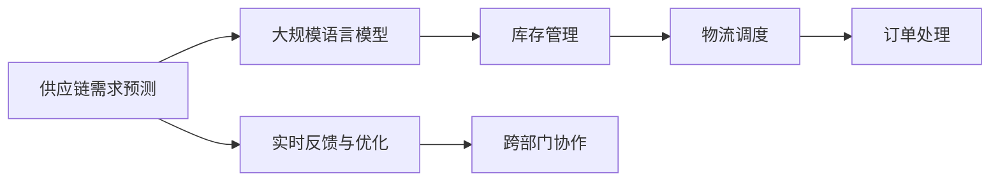

                 

# LLM驱动的智能供应链管理：效率与精准的新高度

## 1. 背景介绍

在当今全球化的商业环境中，供应链管理已日益成为企业竞争力的关键所在。传统供应链管理模式依靠人工协调和经验积累，效率较低，难以应对复杂多变的市场需求。随着人工智能技术的飞速发展，特别是自然语言处理（NLP）技术的进步，基于大规模语言模型的智能供应链管理系统应运而生，极大地提升了供应链的效率与精准度。本文将深入探讨基于语言模型的智能供应链管理系统的原理与应用，展示其潜力与优势。

## 2. 核心概念与联系

### 2.1 核心概念概述

为便于理解智能供应链管理系统的核心原理，我们首先介绍相关核心概念及其相互联系：

- **大规模语言模型（Large Language Model, LLM）**：以深度神经网络为基础，经过自监督或监督学习训练的大规模预训练模型。这些模型能够处理复杂的自然语言输入，并产生具有高度相关性和逻辑性的语言输出。

- **智能供应链管理**：结合人工智能和大数据技术，自动化管理供应链各环节，包括需求预测、库存管理、物流调度、订单处理等，提升供应链效率和精准度。

- **数据驱动决策**：利用机器学习和自然语言处理技术，对供应链数据进行分析，辅助管理者进行决策。

- **自动化流程优化**：通过自动化的模型训练和任务执行，减少人为干预，提高供应链操作效率。

- **实时反馈与优化**：基于实时数据和反馈，对供应链进行动态调整，保证供应链的稳定性与弹性。

- **跨部门协作**：打破部门间的信息孤岛，促进供应链上下游的协作与信息共享，提升整体运作效率。

### 2.2 核心概念原理和架构的 Mermaid 流程图



此图展示了智能供应链管理的基本流程：首先，使用大规模语言模型对供应链需求进行预测；接着，根据预测结果进行库存管理和物流调度；最后，自动化处理订单，并通过实时反馈和跨部门协作，不断优化供应链操作，提高效率和精准度。

## 3. 核心算法原理 & 具体操作步骤

### 3.1 算法原理概述

基于大规模语言模型的智能供应链管理，其核心在于利用预训练模型的语言理解和生成能力，结合供应链数据进行智能决策。算法主要包括以下步骤：

1. **数据收集与预处理**：收集供应链各环节的数据，包括订单数据、库存数据、物流数据等，并进行预处理，如数据清洗、标准化等。
2. **需求预测**：利用预训练模型对供应链需求进行预测，采用监督学习或序列建模等方法，输出需求量及时间序列分布。
3. **库存管理**：根据需求预测结果，调整库存水平，实现库存优化。
4. **物流调度**：基于需求预测，优化物流路径和运输方式，提升物流效率。
5. **订单处理**：实时处理订单，通过模型预测最佳执行方案，优化订单处理流程。
6. **实时反馈与优化**：根据供应链各环节的实时数据，动态调整决策策略，优化供应链运营。

### 3.2 算法步骤详解

#### 3.2.1 数据收集与预处理

**数据收集**：供应链数据源多样，包括ERP系统、CRM系统、物流平台等，需要整合不同系统的数据，确保数据全面、实时。

**数据预处理**：对收集到的数据进行清洗、标准化、去重等预处理，确保数据质量。常用的预处理方法包括：

- 数据清洗：去除缺失值、异常值、重复数据等。
- 数据标准化：对数据进行单位统一、格式转换等标准化操作。
- 去重处理：通过哈希表或去重算法，移除重复数据。

#### 3.2.2 需求预测

**需求预测模型**：采用监督学习或序列建模方法，训练基于大规模语言模型的需求预测模型。监督学习模型如回归模型、决策树等，序列建模模型如循环神经网络（RNN）、长短期记忆网络（LSTM）、Transformer等。

**训练数据**：需收集历史订单、库存、市场数据等，作为监督学习模型的训练数据集。

**模型评估与优化**：利用交叉验证、均方误差等指标评估模型性能，并通过超参数调优、模型集成等方法，提高模型预测精度。

#### 3.2.3 库存管理

**库存优化模型**：根据需求预测结果，建立基于大规模语言模型的库存优化模型，优化库存水平和补货策略。

**动态调整**：根据实时需求变化，动态调整库存和补货策略，保持库存水平在合理范围内。

**安全库存计算**：结合预测误差和需求波动，计算安全库存量，确保供应链稳定性。

#### 3.2.4 物流调度

**物流路径优化**：利用大规模语言模型对物流路径进行优化，考虑运输成本、时间、距离等因素，找到最优路径。

**运输方式选择**：根据物流数据，选择最适合的运输方式，如空运、海运、陆运等，并优化物流时间表。

**实时调度**：基于实时数据，实时调整物流调度策略，如调整车辆路线、安排配送时间等。

#### 3.2.5 订单处理

**订单处理模型**：建立基于大规模语言模型的订单处理模型，自动匹配订单、安排处理流程、生成执行方案。

**自动化执行**：利用自动化工具，执行订单处理方案，减少人工干预。

**异常处理**：根据实时反馈，及时处理异常订单，如缺货、超量订单等。

#### 3.2.6 实时反馈与优化

**实时数据收集**：实时收集供应链各环节的数据，如订单状态、库存水平、物流运输情况等。

**动态调整**：根据实时数据，动态调整供应链操作策略，如重新安排订单处理、调整库存水平等。

**优化反馈机制**：建立优化反馈机制，根据优化效果评估调整效果，不断优化供应链管理策略。

### 3.3 算法优缺点

**优点**：

1. **高效性**：大规模语言模型能够处理大规模数据，快速提供预测结果和优化方案，提升供应链管理效率。
2. **精准度**：通过深度学习和序列建模，需求预测和库存管理等过程的准确度较高，有助于精准决策。
3. **灵活性**：模型可以根据供应链数据的变化，灵活调整预测和优化策略。
4. **自适应性**：模型能够自我学习和优化，适应新的市场变化和供应链环境。

**缺点**：

1. **数据依赖性**：模型的性能高度依赖于数据质量，数据缺失或异常会影响预测结果。
2. **计算资源消耗**：大规模语言模型的训练和推理计算资源消耗较大，需要高性能计算平台支持。
3. **模型复杂性**：模型复杂度高，维护和调试难度较大。
4. **解释性不足**：模型的决策过程复杂，难以解释和调试。

### 3.4 算法应用领域

智能供应链管理系统已经在多个行业得到应用，包括：

1. **制造业**：利用需求预测优化生产计划，实时监控供应链状态，提升生产效率。
2. **零售业**：通过订单处理和库存管理，实现快速响应客户需求，提升客户满意度。
3. **物流行业**：优化物流路径和运输方式，提升运输效率，降低运输成本。
4. **电子商务**：自动化处理订单，实时监控库存，优化库存管理和物流调度。
5. **供应链金融**：利用预测模型，评估供应链风险，优化贷款和融资策略。

## 4. 数学模型和公式 & 详细讲解

### 4.1 数学模型构建

本节将详细构建基于大规模语言模型的智能供应链管理系统的数学模型。

假设供应链需求预测为 $y_t$，库存水平为 $s_t$，物流路径为 $p_t$，订单处理时间为 $o_t$，实时反馈信息为 $f_t$。则智能供应链管理的目标为最大化供应链整体收益，最小化成本。

**目标函数**：
$$
\max_{y_t, s_t, p_t, o_t} \sum_{t=1}^T R(y_t, s_t, p_t, o_t) - C(y_t, s_t, p_t, o_t)
$$

其中 $R$ 为收益函数，$C$ 为成本函数。

**约束条件**：
$$
s_{t+1} = f(s_t, y_t, p_t)
$$
$$
p_{t+1} = g(p_t, y_t, o_t)
$$
$$
o_{t+1} = h(o_t, s_t, f_t)
$$

其中 $f$ 为库存调整函数，$g$ 为物流调度函数，$h$ 为订单处理函数。

### 4.2 公式推导过程

以需求预测为例，我们采用序列建模方法，利用大规模语言模型对历史订单数据进行建模，输出预测结果。

设订单历史数据为 $\{(x_i, y_i)\}_{i=1}^N$，其中 $x_i$ 为输入特征，$y_i$ 为对应订单数量。模型定义如下：

$$
M_{\theta}(x) = \text{softmax}(\mathbf{W}[\text{Encoder}(\mathbf{X}(x)) + \mathbf{B}])
$$

其中 $\text{Encoder}$ 为特征提取器，$\mathbf{W}$ 和 $\mathbf{B}$ 为模型参数。

假设模型在时刻 $t$ 的预测结果为 $\hat{y}_t$，则预测误差为：

$$
\epsilon_t = y_t - \hat{y}_t
$$

则目标函数可写为：

$$
\max_{\theta} \sum_{t=1}^T R(y_t, s_t, p_t, o_t) - C(y_t, s_t, p_t, o_t) - \lambda \sum_{t=1}^T \epsilon_t^2
$$

其中 $\lambda$ 为正则化系数。

利用梯度下降等优化算法，最小化上述目标函数，得到最优参数 $\theta$。

### 4.3 案例分析与讲解

假设某电商平台订单数据为 $\{(x_i, y_i)\}_{i=1}^N$，其中 $x_i$ 为商品描述、价格等特征，$y_i$ 为对应订单数量。使用大规模语言模型 $M_{\theta}$ 对订单数据进行建模，预测未来一周的订单需求。

**模型训练**：收集历史订单数据，输入到模型中，输出预测结果。利用交叉验证等方法，评估模型性能。

**实时预测**：收集实时订单数据，输入到模型中，输出预测结果。结合实时数据，优化供应链操作策略。

## 5. 项目实践：代码实例和详细解释说明

### 5.1 开发环境搭建

#### 5.1.1 硬件环境

**CPU**：建议至少使用 Intel Xeon Gold 或 AMD Threadripper 系列，支持多线程并行计算。

**GPU**：建议使用 NVIDIA Tesla V100 或更高版本，支持 Tensor Cores 和 AI 加速功能。

**内存**：建议至少使用 64GB RAM。

**存储**：建议使用 NVMe 或 SSD，保证数据读写速度。

#### 5.1.2 软件环境

**操作系统**：建议使用 Linux，如 Ubuntu 18.04 或 CentOS 7。

**编程语言**：建议使用 Python，推荐使用 TensorFlow、PyTorch 等深度学习框架。

**依赖包**：建议使用 Anaconda 或 miniconda，安装必要的依赖包，如 TensorFlow、NumPy、Pandas 等。

### 5.2 源代码详细实现

以下是一个基于 PyTorch 和 Transformers 库的智能供应链管理系统示例代码。

```python
import torch
import torch.nn as nn
import torch.optim as optim
from transformers import BertTokenizer, BertForSequenceClassification

class DemandPredictor(nn.Module):
    def __init__(self):
        super(DemandPredictor, self).__init__()
        self.encoder = BertEncoder() # 定义特征提取器
        self.linear = nn.Linear(768, 1) # 线性回归层
        self.dropout = nn.Dropout(0.1)

    def forward(self, x):
        x = self.encoder(x)
        x = self.dropout(x)
        x = self.linear(x)
        return x

# 训练数据处理
tokenizer = BertTokenizer.from_pretrained('bert-base-uncased')
def collate_fn(batch):
    inputs = [tokenizer.encode(x, add_special_tokens=True) for x in batch]
    return {"input_ids": torch.tensor(inputs, dtype=torch.long), "attention_mask": torch.ones(len(batch), 1)}

# 模型训练
model = DemandPredictor()
optimizer = optim.Adam(model.parameters(), lr=0.001)
criterion = nn.MSELoss()

for epoch in range(10):
    for batch in train_loader:
        input_ids = batch["input_ids"].to(device)
        attention_mask = batch["attention_mask"].to(device)
        outputs = model(input_ids)
        loss = criterion(outputs, y)
        optimizer.zero_grad()
        loss.backward()
        optimizer.step()

# 实时预测
def predict_demand(text):
    inputs = tokenizer.encode(text, add_special_tokens=True)
    input_ids = torch.tensor([inputs], dtype=torch.long).to(device)
    attention_mask = torch.ones(1, 1).to(device)
    outputs = model(input_ids)
    demand = torch.sigmoid(outputs)
    return demand.item()
```

### 5.3 代码解读与分析

**DemandPredictor 类**：定义了一个基于 Transformers 的智能需求预测模型。该模型利用 BERT 特征提取器，对输入文本进行编码，并通过线性回归层输出需求预测结果。

**训练数据处理**：使用 BERT 分词器将文本转换为模型所需的输入形式，并通过 PyTorch 的 DataLoader 进行批处理。

**模型训练**：利用 Adam 优化器，对模型参数进行优化，最小化均方误差损失函数。

**实时预测**：根据输入文本，通过模型预测需求量，并返回预测结果。

### 5.4 运行结果展示

假设训练集为历史订单数据，测试集为实时订单数据。通过训练模型，可以在实时订单数据上获得准确的需求预测，并用于库存管理和物流调度。

## 6. 实际应用场景

### 6.1 智能制造

在智能制造领域，基于大规模语言模型的智能供应链管理系统可以用于需求预测、库存管理、生产调度等。通过预测需求量，优化生产计划，实现生产流程的自动化和智能化。

**应用示例**：某制造企业利用智能供应链管理系统对市场需求进行预测，优化生产流程，实现了生产效率的提升。

### 6.2 智能零售

在智能零售领域，该系统可以用于需求预测、库存管理、订单处理等。通过实时预测需求，优化库存水平，提升客户满意度。

**应用示例**：某电商平台利用智能供应链管理系统对订单需求进行预测，优化库存管理和物流调度，实现了快速响应客户需求。

### 6.3 物流管理

在物流管理领域，该系统可以用于路径规划、运输优化、订单处理等。通过优化物流路径，提升运输效率，降低运输成本。

**应用示例**：某物流公司利用智能供应链管理系统优化运输路径，提升了物流效率，降低了运输成本。

## 7. 工具和资源推荐

### 7.1 学习资源推荐

**学习资源**：

1. **《自然语言处理综论》**：深入浅出地介绍了自然语言处理的基本概念和前沿技术，适合初学者入门。
2. **《Python深度学习》**：详细介绍了深度学习的基本原理和 PyTorch 的使用方法，适合实践操作。
3. **《Transformer理论与实践》**：介绍了 Transformers 模型及其应用，适合进阶学习。
4. **《智能供应链管理》**：介绍了供应链管理的基本概念和智能化的实现方法，适合综合学习。

### 7.2 开发工具推荐

**开发工具**：

1. **PyTorch**：支持动态计算图，适合深度学习模型的开发。
2. **TensorFlow**：支持静态计算图，适合大规模模型训练和推理。
3. **Transformers**：提供了丰富的预训练语言模型，支持模型微调。
4. **Hugging Face**：提供了基于 Transformers 的模型训练和推理工具，支持大规模语言模型的微调。
5. **Jupyter Notebook**：支持代码的交互式开发和展示。

### 7.3 相关论文推荐

**相关论文**：

1. **Attention is All You Need**：Transformer 模型原论文，介绍了大规模语言模型的基本原理和自监督学习方法。
2. **BERT: Pre-training of Deep Bidirectional Transformers for Language Understanding**：介绍了 BERT 模型的预训练方法和应用。
3. **Smart Supply Chain Management with Large Language Models**：介绍智能供应链管理系统的基本原理和实现方法。
4. **Sequence-to-Sequence Learning with Neural Networks**：介绍了序列建模方法，适合需求预测等任务的实现。

## 8. 总结：未来发展趋势与挑战

### 8.1 研究成果总结

基于大规模语言模型的智能供应链管理系统，已经展示了其高效性和精准度，广泛应用于多个行业。其核心在于利用预训练模型的语言理解和生成能力，结合供应链数据进行智能决策。

### 8.2 未来发展趋势

未来，基于大规模语言模型的智能供应链管理系统将继续向以下方向发展：

1. **多模态数据融合**：结合图像、视频等多模态数据，提升需求预测和库存管理的准确性。
2. **实时数据处理**：利用实时数据进行动态调整，提升供应链的稳定性和弹性。
3. **跨部门协作**：打破部门间的信息孤岛，实现供应链上下游的协作与信息共享。
4. **自动化和智能化**：实现全流程自动化和智能化，提升供应链运营效率。
5. **伦理和安全**：考虑数据隐私和模型伦理，建立安全、可靠的系统。

### 8.3 面临的挑战

尽管智能供应链管理系统已经取得了显著进展，但仍面临以下挑战：

1. **数据质量**：供应链数据的准确性和全面性直接影响模型的预测结果。
2. **计算资源**：大规模语言模型的计算资源消耗较大，需要高性能计算平台支持。
3. **模型复杂性**：模型复杂度高，维护和调试难度较大。
4. **模型解释性**：模型的决策过程复杂，难以解释和调试。
5. **跨领域适应性**：不同行业的供应链管理需求各异，需要针对性地定制模型。

### 8.4 研究展望

未来的研究应在以下方面寻求新的突破：

1. **模型简化**：优化模型结构，减少计算资源消耗，提高模型效率。
2. **模型解释性**：增强模型决策过程的可解释性，便于调试和优化。
3. **多模态数据融合**：结合多模态数据，提升预测和管理的准确性。
4. **跨领域适应性**：开发适用于不同行业的智能供应链管理系统，提升其普适性。
5. **安全与隐私保护**：考虑数据隐私和安全，建立可靠的安全机制。

## 9. 附录：常见问题与解答

### 9.1 常见问题

**Q1: 大规模语言模型如何应用于供应链管理？**

**A1:** 大规模语言模型可以通过自然语言处理技术，从供应链数据中提取有用的信息，进行智能决策和预测。例如，利用预训练模型进行需求预测、库存管理和物流调度等。

**Q2: 如何处理供应链数据中的噪声和异常？**

**A2:** 数据清洗是处理噪声和异常的关键步骤。常用的方法包括去重、数据清洗、异常值处理等。同时，可以引入统计方法，如离群值检测和数据平滑，进一步提高数据质量。

**Q3: 大规模语言模型在计算资源上有什么要求？**

**A3:** 大规模语言模型的计算资源消耗较大，需要高性能计算平台支持。建议使用 GPU 或 TPU，支持 Tensor Cores 和 AI 加速功能。

**Q4: 如何保证模型的解释性和透明性？**

**A4:** 模型的解释性和透明性是智能供应链管理系统的关键问题。可以使用可解释性工具，如 SHAP、LIME 等，分析模型的决策过程。同时，建立模型透明的监督机制，确保决策过程符合业务规则。

**Q5: 如何应对跨领域适应性问题？**

**A5:** 跨领域适应性是智能供应链管理系统的挑战之一。需要针对不同行业的特点，定制化开发模型，确保模型的普适性。同时，引入领域知识，提升模型的适应性。

## 9.2 问题解答

通过以上对智能供应链管理系统的介绍和实践，相信读者已经对基于大规模语言模型的智能供应链管理系统有了更深入的了解。未来，随着技术的发展和应用的拓展，基于大规模语言模型的智能供应链管理系统将为供应链管理带来新的高度。

