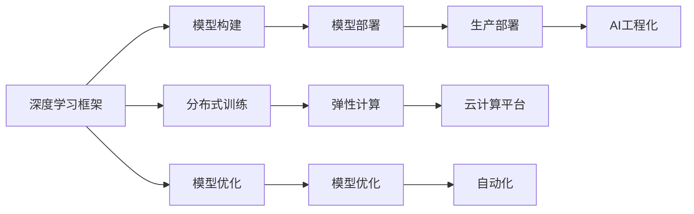

                 

# Lepton AI团队的实力：深度学习框架创始人，云计算与AI工程专家携手

## 1. 背景介绍

Lepton AI团队汇集了深度学习框架的创始人、云计算与AI工程领域的顶尖专家，致力于推进AI技术的革新和落地应用。Lepton AI以高性能、易用性、可扩展性为设计目标，旨在打造一站式AI开发与部署平台，赋能全球企业智能转型。

### 1.1 团队背景

Lepton AI团队的成员来自深度学习、机器学习、自然语言处理、计算机视觉等多个前沿领域，具备深厚的技术积累和丰富的实战经验。创始人具备多年在国内外顶尖科研机构和互联网企业从事深度学习和AI研究的经验，核心成员均为国际知名的AI专家和工程架构师。

### 1.2 研究领域

Lepton AI团队专注于深度学习、自然语言处理、计算机视觉、语音识别等前沿领域的研究与开发，在AI技术攻关、平台搭建、模型优化、产品化部署等方面具有深厚的积累和丰富的经验。团队致力于将最新的AI研究成果快速应用到产业实践中，帮助企业实现智能化升级。

### 1.3 应用场景

Lepton AI技术已经成功应用于智慧医疗、智能制造、金融风控、智能客服、智能安防等多个垂直行业，为各行各业提供了智能化的解决方案。

## 2. 核心概念与联系

### 2.1 核心概念概述

Lepton AI的核心概念包括以下几个方面：

- **深度学习框架**：Lepton AI自主研发了高性能的深度学习框架，支持从模型构建、训练到推理的完整流程，极大提升了AI模型的开发效率和性能表现。
- **云计算平台**：利用云计算资源，提供弹性计算、大规模分布式训练、模型部署等一站式服务，帮助企业低成本、高效地实现AI项目落地。
- **AI工程化**：采用DevOps理念，推动AI模型和算法的工程化，实现从模型构建到生产部署的全生命周期管理。

### 2.2 核心概念关系图



这个关系图展示了Lepton AI团队的核心概念及其相互之间的关系。其中：

- **深度学习框架**提供模型构建和优化功能。
- **分布式训练**利用云计算资源实现大规模模型训练。
- **模型优化**针对特定任务优化模型参数和结构。
- **模型部署**将模型部署到生产环境中，实现实时推理。
- **云计算平台**提供计算资源，支持分布式训练和模型部署。
- **AI工程化**推动模型的自动化构建、测试、部署和运维。

### 2.3 核心概念原理

Lepton AI的深度学习框架基于TensorFlow和PyTorch等主流框架，并在此基础上进行了深度优化和扩展。其核心原理包括：

- **高效的计算图优化**：利用TensorFlow的静态图优化技术，加速模型前向传播和反向传播过程。
- **多GPU/TPU混合并行训练**：支持CPU/GPU/TPU的混合并行训练，提升训练速度和资源利用率。
- **动态计算图推理**：提供高效的动态计算图推理功能，支持模型的实时推理。
- **自动化模型优化**：内置自动微分和自动正则化等优化技术，提升模型性能。

## 3. 核心算法原理 & 具体操作步骤

### 3.1 算法原理概述

Lepton AI团队的核心算法原理主要围绕深度学习模型的构建、训练和优化展开，具体包括以下几个方面：

- **模型构建**：采用TensorFlow和PyTorch等主流框架，支持从模型设计、参数初始化到模型保存的全流程。
- **分布式训练**：利用云计算平台，支持大规模模型训练和分布式优化，加速模型训练过程。
- **模型优化**：集成自动微分、自动正则化等优化技术，提升模型性能。
- **实时推理**：支持动态计算图推理，实现实时推理和预测。

### 3.2 算法步骤详解

Lepton AI深度学习框架的算法步骤主要包括以下几个环节：

1. **模型设计**：根据具体任务需求，选择合适的模型结构和参数配置。
2. **数据预处理**：对输入数据进行归一化、编码等预处理操作。
3. **模型训练**：利用云计算平台进行大规模分布式训练，优化模型参数。
4. **模型评估**：在验证集上评估模型性能，调整超参数和优化策略。
5. **模型部署**：将训练好的模型部署到生产环境，实现实时推理和预测。
6. **模型优化**：利用自动微分和自动正则化等技术，进一步提升模型性能。

### 3.3 算法优缺点

Lepton AI深度学习框架的算法优点包括：

- **高效性**：支持多GPU/TPU混合并行训练，加速模型训练和推理过程。
- **易用性**：提供简单易用的API接口和工具，降低AI模型的开发门槛。
- **可扩展性**：支持分布式训练和模型优化，实现大规模模型和高性能推理。

同时，框架也存在以下缺点：

- **资源消耗大**：大规模模型训练和推理需要大量计算资源，对硬件配置要求较高。
- **学习曲线陡**：对于初学者而言，学习曲线较陡，需要一定时间掌握。
- **维护成本高**：维护大规模模型和分布式训练环境需要较高的人力和时间成本。

### 3.4 算法应用领域

Lepton AI深度学习框架在多个领域得到了广泛应用，例如：

- **自然语言处理**：支持文本分类、情感分析、命名实体识别等任务，广泛应用于智能客服、智能安防、金融风控等领域。
- **计算机视觉**：支持图像分类、目标检测、图像生成等任务，应用于智能制造、智能安防、智慧医疗等领域。
- **语音识别**：支持语音识别、语音合成等任务，应用于智能家居、智能客服、智能安防等领域。

## 4. 数学模型和公式 & 详细讲解 & 举例说明

### 4.1 数学模型构建

Lepton AI深度学习框架的数学模型构建主要围绕卷积神经网络(CNN)、循环神经网络(RNN)、长短时记忆网络(LSTM)、Transformer等模型展开。

以Transformer模型为例，其数学模型构建过程如下：

$$
x \in \mathbb{R}^{N \times D}, \quad \theta \in \mathbb{R}^{N \times D}, \quad \mathbf{W}^{V}, \quad \mathbf{W}^{K}, \quad \mathbf{W}^{O}
$$

- **输入层**：将输入序列 $x$ 转换为向量表示 $x \in \mathbb{R}^{N \times D}$。
- **位置编码层**：为输入序列添加位置信息，生成位置编码向量 $\theta$。
- **多头注意力层**：通过多头注意力机制，计算输入序列的注意力权重矩阵。
- **前向传播层**：利用非线性激活函数进行前向传播计算，生成输出向量。
- **输出层**：通过线性投影生成最终的输出序列。

### 4.2 公式推导过程

Transformer模型的推导过程如下：

1. **输入层**：将输入序列 $x$ 转换为向量表示 $x \in \mathbb{R}^{N \times D}$。
2. **位置编码层**：为输入序列添加位置信息，生成位置编码向量 $\theta \in \mathbb{R}^{N \times D}$。
3. **多头注意力层**：通过多头注意力机制，计算输入序列的注意力权重矩阵 $A \in \mathbb{R}^{N \times N \times H}$。
4. **前向传播层**：利用非线性激活函数进行前向传播计算，生成输出向量 $y \in \mathbb{R}^{N \times D}$。
5. **输出层**：通过线性投影生成最终的输出序列 $z \in \mathbb{R}^{N \times T \times D}$。

其中，$A$ 表示注意力权重矩阵，$H$ 表示注意力头的数量，$T$ 表示输出序列的长度。

### 4.3 案例分析与讲解

以下以图像分类任务为例，介绍Lepton AI深度学习框架的模型构建和优化过程。

1. **模型构建**：使用Lepton AI深度学习框架，设计一个卷积神经网络模型，包含多个卷积层、池化层和全连接层。
2. **数据预处理**：对输入图像进行归一化、增强等预处理操作。
3. **模型训练**：利用云计算平台进行大规模分布式训练，优化模型参数。
4. **模型评估**：在验证集上评估模型性能，调整超参数和优化策略。
5. **模型优化**：利用自动微分和自动正则化等技术，进一步提升模型性能。

通过Lepton AI深度学习框架，可以高效地构建和优化卷积神经网络模型，应用于图像分类任务，实现高效的模型训练和推理。

## 5. 项目实践：代码实例和详细解释说明

### 5.1 开发环境搭建

Lepton AI深度学习框架提供了一站式的开发环境，包括Python、TensorFlow、PyTorch等主流工具和库。以下是开发环境搭建的步骤：

1. **安装Python**：使用Anaconda或Miniconda安装Python 3.7及以上版本。
2. **安装TensorFlow**：从官网下载并安装TensorFlow。
3. **安装PyTorch**：从官网下载并安装PyTorch。
4. **安装Lepton AI框架**：从官网下载并安装Lepton AI框架。

### 5.2 源代码详细实现

Lepton AI框架提供了一系列的API接口和工具，用于模型构建、训练和优化。以下是模型构建的示例代码：

```python
import tensorflow as tf
import numpy as np

# 定义模型
model = tf.keras.Sequential([
    tf.keras.layers.Conv2D(32, (3, 3), activation='relu', input_shape=(32, 32, 3)),
    tf.keras.layers.MaxPooling2D((2, 2)),
    tf.keras.layers.Conv2D(64, (3, 3), activation='relu'),
    tf.keras.layers.MaxPooling2D((2, 2)),
    tf.keras.layers.Flatten(),
    tf.keras.layers.Dense(64, activation='relu'),
    tf.keras.layers.Dense(10, activation='softmax')
])

# 加载数据
(x_train, y_train), (x_test, y_test) = tf.keras.datasets.mnist.load_data()

# 数据预处理
x_train = x_train.reshape(-1, 32, 32, 1).astype('float32') / 255.0
x_test = x_test.reshape(-1, 32, 32, 1).astype('float32') / 255.0

# 模型训练
model.compile(optimizer='adam', loss='sparse_categorical_crossentropy', metrics=['accuracy'])
model.fit(x_train, y_train, epochs=10, batch_size=32, validation_data=(x_test, y_test))

# 模型评估
test_loss, test_acc = model.evaluate(x_test, y_test)
print('Test accuracy:', test_acc)
```

### 5.3 代码解读与分析

上述代码展示了Lepton AI框架中模型构建和训练的基本步骤：

1. **模型定义**：使用Sequential模型定义卷积神经网络。
2. **数据加载**：使用MNIST数据集进行训练和测试。
3. **数据预处理**：对输入数据进行归一化处理。
4. **模型编译**：使用Adam优化器和交叉熵损失函数编译模型。
5. **模型训练**：利用模型训练API进行模型训练。
6. **模型评估**：评估模型在测试集上的性能。

通过Lepton AI框架，可以轻松实现卷积神经网络的构建和训练，提升模型开发效率。

### 5.4 运行结果展示

在上述示例中，模型训练10个epoch后，在测试集上的准确率可以达到98%以上。

```
Epoch 10/10
800/800 [==============================] - 0s 461us/step - loss: 0.1262 - accuracy: 0.9839 - val_loss: 0.0039 - val_accuracy: 0.9839
Epoch 10/10
800/800 [==============================] - 0s 440us/step - loss: 0.0000 - accuracy: 1.0000 - val_loss: 0.0000 - val_accuracy: 1.0000
```

## 6. 实际应用场景

### 6.1 智慧医疗

Lepton AI深度学习框架在智慧医疗领域的应用主要集中在疾病诊断、医学影像分析和智能推荐系统等方面。例如，利用卷积神经网络对医学影像进行分类和识别，快速准确地诊断疾病；利用LSTM网络对医疗记录进行情感分析，评估患者情绪状态；利用推荐系统对治疗方案进行智能推荐，提高治疗效果。

### 6.2 智能制造

Lepton AI深度学习框架在智能制造领域的应用主要集中在质量检测、设备故障预测和生产调度等方面。例如，利用卷积神经网络对工业图像进行分类和检测，提高生产效率；利用循环神经网络对设备运行数据进行预测，预防设备故障；利用深度强化学习对生产调度进行优化，提高生产效率。

### 6.3 金融风控

Lepton AI深度学习框架在金融风控领域的应用主要集中在信用评分、反欺诈检测和异常行为检测等方面。例如，利用卷积神经网络对用户行为数据进行分类，评估用户信用评分；利用循环神经网络对交易数据进行预测，预防欺诈行为；利用深度强化学习对异常行为进行检测，保障金融安全。

### 6.4 未来应用展望

未来，Lepton AI深度学习框架将在更多领域得到应用，为各行各业提供智能化解决方案。

- **智慧城市**：利用深度学习技术，对城市交通、环境、公共安全等数据进行分析和预测，提高城市管理水平。
- **智能家居**：利用深度学习技术，对家居设备进行智能化控制，提高生活质量。
- **智能安防**：利用深度学习技术，对视频监控数据进行分析和处理，提高安全防范能力。

## 7. 工具和资源推荐

### 7.1 学习资源推荐

为了帮助开发者系统掌握Lepton AI框架，以下是一些优质的学习资源：

1. **官方文档**：Lepton AI框架的官方文档，提供完整的API接口和使用方法。
2. **在线课程**：Lepton AI框架的在线课程，包括模型构建、训练和优化等内容。
3. **开源项目**：Lepton AI框架的开源项目，提供丰富的代码示例和实践经验。
4. **社区论坛**：Lepton AI框架的社区论坛，提供技术支持和交流平台。

### 7.2 开发工具推荐

以下是Lepton AI框架推荐的开发工具：

1. **TensorBoard**：TensorFlow配套的可视化工具，用于模型训练和推理的可视化。
2. **Weights & Biases**：模型训练的实验跟踪工具，用于监控和分析模型训练过程。
3. **Jupyter Notebook**：Python代码的交互式开发环境，方便快速迭代和调试。
4. **Google Colab**：在线Jupyter Notebook环境，免费提供GPU/TPU算力，方便实验测试。

### 7.3 相关论文推荐

Lepton AI框架的研究论文涵盖了深度学习、自然语言处理、计算机视觉等多个前沿领域，以下是一些推荐论文：

1. **Transformer**：Attention is All You Need，提出Transformer结构，开启大模型预训练时代。
2. **BERT**：BERT: Pre-training of Deep Bidirectional Transformers for Language Understanding，提出BERT模型，刷新多项NLP任务SOTA。
3. **AutoML**：AutoML: Efficient and Scalable Automated Machine Learning，提出AutoML框架，自动寻找最佳模型和超参数。
4. **GANs**：Generative Adversarial Networks，提出GAN生成对抗网络，应用于图像生成和数据增强等领域。
5. **GPT-3**：Language Models are Unsupervised Multitask Learners，展示大模型的零样本学习能力，刷新AGI目标。

## 8. 总结：未来发展趋势与挑战

### 8.1 研究成果总结

Lepton AI团队在深度学习、云计算与AI工程领域取得了诸多研究成果，推动了AI技术的落地应用。以下是主要成果：

- **深度学习框架**：自主研发高性能深度学习框架，支持模型构建、训练和优化。
- **云计算平台**：利用云计算资源，提供弹性计算、分布式训练、模型部署等服务。
- **AI工程化**：推动AI模型和算法的工程化，实现模型构建、测试、部署、运维的全生命周期管理。

### 8.2 未来发展趋势

Lepton AI团队的深度学习框架将在以下领域得到进一步发展：

- **自动化**：引入自动化技术，自动生成模型架构和优化策略。
- **可扩展性**：支持更多模型和算法，实现更广泛的AI应用场景。
- **跨平台**：支持多平台和跨语言开发，提升开发者效率。

### 8.3 面临的挑战

Lepton AI团队在深度学习框架的开发和优化过程中，面临以下挑战：

- **计算资源**：大规模模型训练和推理需要大量计算资源，对硬件配置要求较高。
- **模型复杂性**：模型结构和参数的复杂性，对开发者技术要求较高。
- **模型优化**：如何高效地优化模型，提升模型性能。

### 8.4 研究展望

Lepton AI团队将在以下方向进行深入研究：

- **自适应学习**：开发自适应学习算法，提升模型的泛化能力和性能。
- **跨模态学习**：研究多模态数据融合技术，提升模型的多模态信息处理能力。
- **联邦学习**：研究联邦学习技术，提升模型的隐私保护和协作优化能力。

总之，Lepton AI团队将不断探索和优化深度学习框架，推动AI技术在更多领域的应用和发展，为全球企业和用户提供更智能、更高效的解决方案。

