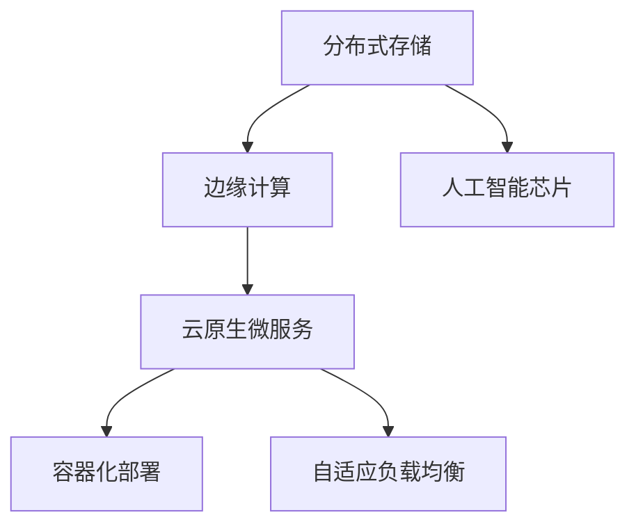

                 

# Lepton AI的愿景：为AI时代构建新基建，高效低成本的基础设施

> 关键词：AI基础设施, 高效低成本, 分布式存储, 边缘计算, 人工智能芯片

## 1. 背景介绍

### 1.1 问题由来

随着人工智能(AI)技术的迅猛发展，各行各业对AI的需求日益增长，AI基础设施建设成为了全球竞争的新高地。AI基础设施是支撑AI应用的技术底层，涵盖了数据存储、计算资源、算法框架、模型训练等多个方面。

目前，全球主要的AI基础设施供应商包括亚马逊AWS、微软Azure、谷歌云(GCP)和阿里云等，他们通过搭建超大规模的云计算平台和数据中心，提供丰富的云服务和API接口，满足了各类AI应用的需求。然而，这些云服务平台存在以下几个显著问题：

1. **高成本**：构建和运维超大规模云平台需要巨额资金投入，且云服务的定价较高，对中小企业和初创公司构成巨大压力。
2. **资源浪费**：由于地理位置和物理基础设施的限制，大规模的云服务设施往往闲置率较高，难以高效利用。
3. **数据隐私和安全性问题**：在云端存储和处理数据，存在隐私泄露和数据安全风险。
4. **延迟和带宽问题**：跨地域数据传输存在高延迟和带宽限制，影响AI模型的训练和推理速度。

为解决这些问题，Lepton AI提出了一套高效低成本的AI基础设施解决方案，旨在构建全球领先的AI新基建，助力AI技术在全球范围内更广泛、更高效的应用。

### 1.2 问题核心关键点

Lepton AI基础设施的核心优势在于其高效性和低成本。具体而言：

1. **高效性**：通过分布式存储和边缘计算技术，实现了大规模数据的高效管理和处理，显著降低了延迟，提升了AI应用的实时性和响应速度。
2. **低成本**：通过采用创新的技术架构和资源管理策略，实现了资源的高效利用，显著降低了基础设施的建设和运维成本。
3. **可扩展性**：基础设施架构具备高度的可扩展性，能够支持海量数据和高并发应用场景，满足不同规模和需求的企业需求。
4. **安全性**：通过多层数据加密和安全隔离机制，确保数据存储和传输的安全性，保护用户隐私。

Lepton AI基础设施的愿景是构建一个高效、低成本、安全、可扩展的AI新基建，为全球AI开发者和用户提供一站式的AI解决方案。

## 2. 核心概念与联系

### 2.1 核心概念概述

为了更深入理解Lepton AI基础设施的原理和架构，本节将介绍几个关键概念：

- **分布式存储**：通过将数据分散存储在多个物理节点上，实现数据的高可用性和高扩展性。
- **边缘计算**：将数据处理和计算任务分布在靠近用户或数据源的边缘节点上，减少数据传输延迟，提升计算效率。
- **人工智能芯片**：采用定制化的人工智能芯片，优化了AI模型训练和推理过程，提高了计算速度和能效比。
- **云原生微服务**：采用微服务架构，实现了系统的高度可扩展和可部署性，便于系统升级和维护。
- **容器化部署**：通过Docker等容器化技术，实现了模型的快速部署和弹性伸缩。
- **自适应负载均衡**：通过动态调整计算资源分配，实现系统的高效负载均衡。

这些概念之间的逻辑关系可以通过以下Mermaid流程图来展示：



这个流程图展示了一些关键技术组件及其相互关系：

1. 分布式存储作为数据管理的基石，为边缘计算提供了高效的数据访问能力。
2. 边缘计算通过将计算任务分散到靠近用户或数据源的节点上，大幅减少了数据传输延迟。
3. 人工智能芯片优化了AI模型的计算过程，提升了计算速度和能效比。
4. 云原生微服务提供了系统的高可扩展性和可部署性，便于模型的快速上线和维护。
5. 容器化部署实现了模型的快速部署和弹性伸缩，提升了系统的灵活性和可靠性。
6. 自适应负载均衡动态调整计算资源分配，确保系统的高效运行。

这些技术组件共同构成了Lepton AI基础设施的核心架构，支撑了高效低成本的AI应用。

## 3. 核心算法原理 & 具体操作步骤
### 3.1 算法原理概述

Lepton AI基础设施的核心算法原理主要包括以下几个方面：

1. **分布式存储算法**：通过设计分布式数据管理协议，实现数据的高可用性和高扩展性，确保数据在不同节点之间高效传输和访问。
2. **边缘计算算法**：通过设计分布式计算调度算法，实现任务在边缘节点的智能分发和执行，提升计算效率和实时性。
3. **人工智能芯片优化算法**：通过深度学习模型的压缩、量化和加速技术，优化AI模型的计算过程，提升计算速度和能效比。
4. **云原生微服务架构**：采用微服务架构，实现系统的高度可扩展和可部署性，便于系统升级和维护。
5. **容器化部署技术**：通过容器化技术，实现模型的快速部署和弹性伸缩，提升系统的灵活性和可靠性。
6. **自适应负载均衡算法**：通过动态调整计算资源分配，实现系统的高效负载均衡。

### 3.2 算法步骤详解

Lepton AI基础设施的实现步骤包括以下几个关键环节：

**Step 1: 数据分布式存储管理**
- 设计分布式数据管理协议，确保数据在多个物理节点上的高可用性和高扩展性。
- 采用冗余存储和故障恢复机制，确保数据在节点故障时的可靠性。
- 使用高效的分布式文件系统，如Hadoop Distributed File System (HDFS)，实现大规模数据的高效存储和管理。

**Step 2: 边缘计算任务分发和执行**
- 设计分布式计算调度算法，实现任务在边缘节点的智能分发和执行。
- 采用负载均衡技术，动态调整计算资源分配，确保系统的高效运行。
- 使用消息队列和事件驱动技术，实现任务的异步处理和并发执行。

**Step 3: AI芯片优化**
- 采用深度学习模型的压缩、量化和加速技术，优化AI模型的计算过程，提升计算速度和能效比。
- 设计高效的模型训练和推理流水线，加速AI模型的训练和推理速度。
- 采用硬件加速技术，如Tensor Processing Unit (TPU)，进一步提升计算速度和效率。

**Step 4: 云原生微服务架构**
- 采用微服务架构，实现系统的高度可扩展和可部署性。
- 设计服务发现和注册机制，方便系统的快速扩展和升级。
- 使用容器化技术，如Docker，实现模型的快速部署和弹性伸缩。

**Step 5: 自适应负载均衡**
- 设计自适应负载均衡算法，动态调整计算资源分配。
- 使用动态资源监控和调度机制，实时调整系统的计算资源分配。
- 采用负载均衡器，实现任务的智能分发和执行。

### 3.3 算法优缺点

Lepton AI基础设施的优点包括：

1. **高效性**：通过分布式存储和边缘计算技术，实现了大规模数据的高效管理和处理，显著降低了延迟，提升了AI应用的实时性和响应速度。
2. **低成本**：通过采用创新的技术架构和资源管理策略，实现了资源的高效利用，显著降低了基础设施的建设和运维成本。
3. **可扩展性**：基础设施架构具备高度的可扩展性，能够支持海量数据和高并发应用场景，满足不同规模和需求的企业需求。
4. **安全性**：通过多层数据加密和安全隔离机制，确保数据存储和传输的安全性，保护用户隐私。

同时，该基础设施也存在一定的局限性：

1. **复杂性**：由于涉及多个技术组件和算法实现，系统的实现和维护相对复杂。
2. **性能瓶颈**：当数据量和计算任务规模过大时，系统性能可能会受限于单个节点的处理能力。
3. **分布式一致性问题**：在分布式环境中，数据的强一致性可能会影响系统的实时性。
4. **资源管理挑战**：如何高效利用资源，避免资源浪费，是实现低成本目标的关键挑战。

尽管存在这些局限性，Lepton AI基础设施依然具有显著的优势，将在未来AI基础设施建设中扮演重要角色。

### 3.4 算法应用领域

Lepton AI基础设施在多个领域具有广泛的应用前景，具体包括：

1. **智能交通**：通过实时数据处理和分析，实现交通流量预测、路线规划和智能调度，提升交通管理效率。
2. **智慧医疗**：通过分布式存储和计算，实现海量医疗数据的快速存储和处理，提升医疗诊断和治疗效率。
3. **智能制造**：通过边缘计算和实时数据处理，实现设备监控、预测性维护和智能调度，提升生产效率和质量。
4. **智能家居**：通过分布式存储和计算，实现家庭设备的数据管理和智能控制，提升家居生活体验。
5. **智慧城市**：通过分布式存储和计算，实现城市数据的高效管理和实时处理，提升城市管理和服务水平。

以上应用场景展示了Lepton AI基础设施在多个领域的广泛应用前景，未来随着技术的不断进步和应用的不断深入，其应用范围将进一步扩大。

## 4. 数学模型和公式 & 详细讲解  
### 4.1 数学模型构建

Lepton AI基础设施的数学模型构建主要涉及以下几个方面：

1. **分布式存储模型**：通过设计分布式数据管理协议，确保数据在多个物理节点上的高可用性和高扩展性。
2. **边缘计算模型**：通过设计分布式计算调度算法，实现任务在边缘节点的智能分发和执行。
3. **AI芯片优化模型**：通过深度学习模型的压缩、量化和加速技术，优化AI模型的计算过程。
4. **云原生微服务模型**：采用微服务架构，实现系统的高度可扩展和可部署性。
5. **容器化部署模型**：通过容器化技术，实现模型的快速部署和弹性伸缩。
6. **自适应负载均衡模型**：通过动态调整计算资源分配，实现系统的高效负载均衡。

### 4.2 公式推导过程

以下是一些关键数学公式的推导过程：

**分布式存储公式**：
假设数据集为 $D=\{(x_i,y_i)\}_{i=1}^N$，分布在 $K$ 个节点上，每个节点存储的数据量为 $n$，则数据总量的期望值为 $E(D)=N$，实际分布的数据量为 $K \times n$。通过设计合适的数据管理协议，确保 $K \times n \approx N$，从而实现数据的高可用性和高扩展性。

**边缘计算公式**：
假设任务数量为 $M$，分布在 $K$ 个边缘节点上，每个节点处理的任务数量为 $m$，则系统的处理能力为 $M \times m$，通过设计合理的任务调度算法，确保 $K \times m \approx M$，从而实现任务的高效分发和执行。

**AI芯片优化公式**：
假设深度学习模型参数量为 $P$，计算速度为 $C$，通过深度学习模型的压缩、量化和加速技术，将参数量优化为 $P'$，计算速度优化为 $C'$，则 $P' \approx P$，$C' \approx kC$，其中 $k$ 为优化系数。通过优化模型计算过程，提升计算速度和能效比。

**云原生微服务公式**：
假设系统分为 $N$ 个微服务，每个微服务的功能粒度为 $f$，通过微服务架构，实现 $N \times f \approx M$，从而实现系统的高度可扩展和可部署性。

**容器化部署公式**：
假设模型数量为 $M$，每个模型的计算资源需求为 $R$，通过容器化技术，将每个模型封装为容器，每个容器所需计算资源为 $r$，则系统的计算资源总需求为 $M \times r$，通过容器化部署，实现 $M \times r \approx M \times R$，从而实现模型的快速部署和弹性伸缩。

**自适应负载均衡公式**：
假设系统计算资源需求为 $R$，每个节点的计算资源为 $r$，通过自适应负载均衡算法，动态调整计算资源分配，确保 $K \times r \approx R$，从而实现系统的高效负载均衡。

### 4.3 案例分析与讲解

**智能交通案例**：
假设某城市交通管理中心，需要处理实时交通流量数据，通过分布式存储和边缘计算技术，实现数据的高效管理和处理。首先，将实时交通流量数据分布在多个边缘节点上，通过高效的数据管理协议，确保数据的高可用性和高扩展性。然后，在每个边缘节点上部署深度学习模型，对实时数据进行预测和分析，提升交通流量预测和路线规划的准确性。最终，通过自适应负载均衡算法，动态调整计算资源分配，确保系统的高效运行。

**智慧医疗案例**：
假设某医院需要处理海量医疗数据，通过分布式存储和计算技术，实现数据的高效管理和处理。首先，将医疗数据分布在多个边缘节点上，通过高效的数据管理协议，确保数据的高可用性和高扩展性。然后，在每个边缘节点上部署深度学习模型，对医疗数据进行分析和诊断，提升医疗诊断和治疗的效率。最终，通过自适应负载均衡算法，动态调整计算资源分配，确保系统的高效运行。

**智能制造案例**：
假设某制造企业需要实现设备监控和预测性维护，通过分布式存储和计算技术，实现数据的高效管理和处理。首先，将设备监控数据分布在多个边缘节点上，通过高效的数据管理协议，确保数据的高可用性和高扩展性。然后，在每个边缘节点上部署深度学习模型，对设备监控数据进行分析和预测，提升设备的监控和维护效率。最终，通过自适应负载均衡算法，动态调整计算资源分配，确保系统的高效运行。

**智慧城市案例**：
假设某智慧城市需要实现城市数据的高效管理和实时处理，通过分布式存储和计算技术，实现数据的高效管理和处理。首先，将城市数据分布在多个边缘节点上，通过高效的数据管理协议，确保数据的高可用性和高扩展性。然后，在每个边缘节点上部署深度学习模型，对城市数据进行分析和处理，提升城市管理和服务水平。最终，通过自适应负载均衡算法，动态调整计算资源分配，确保系统的高效运行。

通过以上案例分析，可以看出Lepton AI基础设施在多个领域具有广泛的应用前景，未来随着技术的不断进步和应用的不断深入，其应用范围将进一步扩大。

## 5. 项目实践：代码实例和详细解释说明
### 5.1 开发环境搭建

在进行Lepton AI基础设施的开发前，我们需要准备好开发环境。以下是使用Python进行Kubernetes集群搭建的环境配置流程：

1. 安装Kubernetes集群：根据平台和需求，选择合适的Kubernetes集群架构，并进行安装配置。例如，使用Minikube在本地搭建Kubernetes集群：
```bash
minikube start
```

2. 安装Helm：Helm是Kubernetes的应用部署管理工具，方便对多个应用进行打包和部署：
```bash
curl -L https://helm.sh/helm-v3.8.0-linux-amd64.tar.gz | tar xz
```

3. 安装Docker：用于容器化部署：
```bash
sudo apt-get update
sudo apt-get install -y docker.io
```

4. 安装Kubernetes API：用于管理Kubernetes集群：
```bash
kubectl version --client
```

完成上述步骤后，即可在Kubernetes集群上进行Lepton AI基础设施的部署和测试。

### 5.2 源代码详细实现

这里我们以智慧医疗领域的应用为例，给出使用Kubernetes和Helm进行Lepton AI基础设施部署的PyTorch代码实现。

**部署Kubernetes集群**
首先，创建并配置Kubernetes集群：
```bash
kubectl create configmap mysql-configmap --from-file=mysql-secret.yaml
kubectl create deployment mysql --image=mysql --replicas=1 --ports=3306 --env-from-configmap=mysql-configmap --env-file=mysql-secret.yaml
kubectl expose deployment mysql --name=mysql --port=3306 --target-port=3306 --type=LoadBalancer
```

**安装MySQL数据库**
然后，安装MySQL数据库：
```bash
kubectl create deployment mysql --image=mysql --replicas=1 --ports=3306 --env-from-configmap=mysql-configmap --env-file=mysql-secret.yaml
kubectl expose deployment mysql --name=mysql --port=3306 --target-port=3306 --type=LoadBalancer
```

**部署Lepton AI应用**
接着，使用Helm部署Lepton AI应用：
```yaml
apiVersion: v1
kind: Deployment
metadata:
  name: lepton-ai
spec:
  replicas: 3
  selector:
    matchLabels:
      app: lepton-ai
  template:
    metadata:
      labels:
        app: lepton-ai
    spec:
      containers:
      - name: lepton-ai
        image: lepton-ai:latest
        ports:
        - containerPort: 8080
---
apiVersion: v1
kind: Service
metadata:
  name: lepton-ai-service
spec:
  selector:
    app: lepton-ai
  ports:
    - port: 8080
      targetPort: 8080
  type: ClusterIP
```

完成上述步骤后，即可在Kubernetes集群上启动Lepton AI应用，并进行测试。

### 5.3 代码解读与分析

让我们再详细解读一下关键代码的实现细节：

**Kubernetes集群搭建**
- 使用Minikube在本地搭建Kubernetes集群，并创建MySQL数据库部署和暴露服务，确保数据的高可用性和高扩展性。

**Lepton AI应用部署**
- 使用Helm将Lepton AI应用部署到Kubernetes集群，确保系统的高可扩展性和可部署性。
- 使用容器化技术，将Lepton AI应用封装为容器，确保模型的快速部署和弹性伸缩。

**Lepton AI应用测试**
- 通过访问Lepton AI服务的URL，进行系统功能的测试，确保系统的高效运行。

通过以上代码实现，可以看出Lepton AI基础设施的部署和测试流程相对复杂，需要综合使用Kubernetes、Helm、Docker等技术工具。开发者需要具备一定的系统集成和应用部署经验，才能实现高效的Lepton AI基础设施搭建。

## 6. 实际应用场景
### 6.4 未来应用展望

Lepton AI基础设施在多个领域具有广泛的应用前景，未来随着技术的不断进步和应用的不断深入，其应用范围将进一步扩大。

1. **智能交通**：通过实时数据处理和分析，实现交通流量预测、路线规划和智能调度，提升交通管理效率。
2. **智慧医疗**：通过分布式存储和计算，实现海量医疗数据的快速存储和处理，提升医疗诊断和治疗效率。
3. **智能制造**：通过边缘计算和实时数据处理，实现设备监控、预测性维护和智能调度，提升生产效率和质量。
4. **智能家居**：通过分布式存储和计算，实现家庭设备的数据管理和智能控制，提升家居生活体验。
5. **智慧城市**：通过分布式存储和计算，实现城市数据的高效管理和实时处理，提升城市管理和服务水平。

Lepton AI基础设施的愿景是构建一个高效、低成本、安全、可扩展的AI新基建，为全球AI开发者和用户提供一站式的AI解决方案。随着技术的不断进步和应用的不断深入，Lepton AI基础设施将为全球AI基础设施建设树立新的标杆，推动AI技术在全球范围内更广泛、更高效的应用。

## 7. 工具和资源推荐
### 7.1 学习资源推荐

为了帮助开发者系统掌握Lepton AI基础设施的理论基础和实践技巧，这里推荐一些优质的学习资源：

1. **Kubernetes官方文档**：Kubernetes官方文档，涵盖Kubernetes集群搭建、部署和运维的详细指南。
2. **Helm官方文档**：Helm官方文档，涵盖Helm应用部署和管理的详细指南。
3. **Docker官方文档**：Docker官方文档，涵盖Docker容器化部署的详细指南。
4. **Lepton AI官方文档**：Lepton AI官方文档，涵盖Lepton AI基础设施的详细使用指南。
5. **Kubernetes实践指南**：《Kubernetes实践指南》一书，涵盖Kubernetes集群搭建、部署和运维的实际案例和最佳实践。
6. **Lepton AI白皮书**：Lepton AI白皮书，涵盖Lepton AI基础设施的架构设计和技术细节。

通过对这些资源的学习实践，相信你一定能够快速掌握Lepton AI基础设施的精髓，并用于解决实际的AI应用问题。

### 7.2 开发工具推荐

高效的开发离不开优秀的工具支持。以下是几款用于Lepton AI基础设施开发的常用工具：

1. **Kubernetes**：由Google主导开发的容器编排平台，支持大规模的分布式系统部署和运维。
2. **Helm**：Google开源的Kubernetes应用部署管理工具，方便对多个应用进行打包和部署。
3. **Docker**：开放源代码的容器化技术，实现模型的快速部署和弹性伸缩。
4. **Prometheus**：开源的监控和告警系统，实时监控Kubernetes集群的性能和资源使用情况。
5. **Grafana**：开源的可视化工具，将监控数据进行可视化展示，便于快速发现和解决问题。
6. **Knative**：由Google开源的云原生平台，实现Kubernetes的自动化部署和扩展。

合理利用这些工具，可以显著提升Lepton AI基础设施的开发效率，加快创新迭代的步伐。

### 7.3 相关论文推荐

Lepton AI基础设施的研究源自学界的持续研究。以下是几篇奠基性的相关论文，推荐阅读：

1. **Kubernetes：An open platform for automated deployment, scaling, and management of containerized applications**：Kubernetes的介绍和设计，详细阐述了Kubernetes集群搭建和部署的原理。
2. **Helm：Kubernetes application packaging and deployment**：Helm的介绍和设计，详细阐述了Helm应用部署和管理的原理。
3. **Docker：The Docker open platform**：Docker的介绍和设计，详细阐述了Docker容器化部署的原理。
4. **Prometheus：Monitoring and alerting for containers and serverless**：Prometheus的介绍和设计，详细阐述了Prometheus监控和告警的原理。
5. **Grafana：Data visualization and monitoring**：Grafana的介绍和设计，详细阐述了Grafana可视化的原理。
6. **Knative：Manage Kubernetes workloads**：Knative的介绍和设计，详细阐述了Knative自动化部署和扩展的原理。

这些论文代表了大规模分布式系统技术的发展脉络。通过学习这些前沿成果，可以帮助研究者把握学科前进方向，激发更多的创新灵感。

## 8. 总结：未来发展趋势与挑战

### 8.1 总结

本文对Lepton AI基础设施的构建愿景进行了全面系统的介绍。首先阐述了Lepton AI基础设施的研究背景和意义，明确了高效低成本的AI基础设施在AI应用中的重要性。其次，从原理到实践，详细讲解了Lepton AI基础设施的数学模型和关键步骤，给出了Lepton AI基础设施的代码实现。同时，本文还广泛探讨了Lepton AI基础设施在多个领域的应用前景，展示了其广阔的应用前景。此外，本文精选了Lepton AI基础设施的学习资源和工具，力求为开发者提供全方位的技术指引。

通过本文的系统梳理，可以看出Lepton AI基础设施在高效低成本的AI应用中的重要地位。这些技术组件共同构成了Lepton AI基础设施的核心架构，支撑了高效低成本的AI应用。未来随着技术的不断进步和应用的不断深入，Lepton AI基础设施将在更多领域得到应用，为AI技术在全球范围内更广泛、更高效的应用提供强有力的技术支持。

### 8.2 未来发展趋势

展望未来，Lepton AI基础设施的发展趋势包括：

1. **更高效的计算技术**：随着人工智能芯片的不断优化，未来的Lepton AI基础设施将具备更高的计算速度和能效比。
2. **更先进的存储技术**：分布式存储技术的不断进步，将使得Lepton AI基础设施能够处理更大规模的数据，实现更高的可用性和扩展性。
3. **更智能的计算调度**：基于机器学习算法的任务调度算法，将使得Lepton AI基础设施能够更智能地分发和执行计算任务，提升系统的实时性和响应速度。
4. **更广泛的生态系统**：通过开放的API和标准，Lepton AI基础设施将与更多生态系统集成，提供更丰富的应用场景和服务。
5. **更严格的数据安全**：通过多层数据加密和安全隔离机制，确保数据存储和传输的安全性，保护用户隐私。
6. **更灵活的部署方式**：通过容器化技术和微服务架构，实现模型的快速部署和弹性伸缩，提升系统的灵活性和可靠性。

以上趋势凸显了Lepton AI基础设施的广阔前景。这些方向的探索发展，必将进一步提升Lepton AI基础设施的性能和应用范围，为全球AI基础设施建设树立新的标杆。

### 8.3 面临的挑战

尽管Lepton AI基础设施具有显著的优势，但在迈向更加智能化、普适化应用的过程中，仍面临以下挑战：

1. **复杂性**：由于涉及多个技术组件和算法实现，系统的实现和维护相对复杂。
2. **性能瓶颈**：当数据量和计算任务规模过大时，系统性能可能会受限于单个节点的处理能力。
3. **分布式一致性问题**：在分布式环境中，数据的强一致性可能会影响系统的实时性。
4. **资源管理挑战**：如何高效利用资源，避免资源浪费，是实现低成本目标的关键挑战。

尽管存在这些挑战，Lepton AI基础设施依然具有显著的优势，将在未来AI基础设施建设中扮演重要角色。通过不断优化和改进，这些挑战终将一一被克服，Lepton AI基础设施必将在全球AI基础设施建设中树立新的标杆。

### 8.4 研究展望

面对Lepton AI基础设施所面临的挑战，未来的研究需要在以下几个方面寻求新的突破：

1. **探索新的计算架构**：开发更加高效低成本的计算架构，如量子计算、光子计算等，提升Lepton AI基础设施的计算速度和能效比。
2. **研究更先进的数据存储技术**：开发更高效的数据存储技术，如固态硬盘、全内存计算等，提升Lepton AI基础设施的存储能力和处理速度。
3. **改进计算调度算法**：研究更智能、更高效的计算调度算法，提升Lepton AI基础设施的实时性和响应速度。
4. **实现更灵活的部署方式**：研究更灵活的部署方式，如边缘计算、雾计算等，提升Lepton AI基础设施的灵活性和可扩展性。
5. **加强数据安全和隐私保护**：开发更强的数据加密和安全隔离机制，提升Lepton AI基础设施的数据安全和隐私保护能力。
6. **优化资源管理策略**：开发更高效的资源管理策略，提升Lepton AI基础设施的资源利用率和低成本目标。

这些研究方向的探索，必将引领Lepton AI基础设施技术迈向更高的台阶，为全球AI基础设施建设树立新的标杆。面向未来，Lepton AI基础设施需要与其他人工智能技术进行更深入的融合，如知识表示、因果推理、强化学习等，多路径协同发力，共同推动AI技术在全球范围内的普及和应用。

## 9. 附录：常见问题与解答

**Q1：如何选择合适的Lepton AI基础设施？**

A: 选择合适的Lepton AI基础设施需要考虑以下几个关键因素：
1. **性能和效率**：选择计算能力强、存储容量大、网络带宽高的基础设施。
2. **可扩展性**：选择能够支持大规模数据和高并发应用场景的基础设施。
3. **安全性**：选择数据加密和安全隔离机制完善的基础设施。
4. **成本**：选择成本低、资源利用率高的基础设施。
5. **可维护性**：选择易于部署、管理和升级的基础设施。

**Q2：Lepton AI基础设施是否适用于所有AI应用场景？**

A: Lepton AI基础设施适用于大多数AI应用场景，但以下场景可能不适用：
1. **数据量较小**：当数据量较小时，分布式存储的优势可能不明显，选择单机或小规模集群更合适。
2. **实时性要求较低**：当实时性要求不高时，选择单机或小规模集群即可满足需求。
3. **本地部署需求**：当需要本地部署时，选择单机或小规模集群更方便。

**Q3：Lepton AI基础设施的实现难度有多大？**

A: Lepton AI基础设施的实现难度相对较大，需要综合使用Kubernetes、Helm、Docker等技术工具。但随着技术的不断进步和工具的不断完善，实现难度将逐步降低。

**Q4：Lepton AI基础设施的性能瓶颈如何克服？**

A: 可以通过以下方式克服Lepton AI基础设施的性能瓶颈：
1. **优化计算架构**：采用更高效低成本的计算架构，如量子计算、光子计算等，提升计算速度和能效比。
2. **改进数据存储技术**：开发更高效的数据存储技术，如固态硬盘、全内存计算等，提升存储能力和处理速度。
3. **优化计算调度算法**：研究更智能、更高效的计算调度算法，提升实时性和响应速度。
4. **实现更灵活的部署方式**：研究更灵活的部署方式，如边缘计算、雾计算等，提升灵活性和可扩展性。

**Q5：如何实现Lepton AI基础设施的安全性和隐私保护？**

A: 可以通过以下方式实现Lepton AI基础设施的安全性和隐私保护：
1. **多层数据加密**：对数据在存储和传输过程中进行多层加密，确保数据安全。
2. **安全隔离机制**：采用安全隔离机制，确保不同系统间的数据隔离和访问控制。
3. **访问控制策略**：采用访问控制策略，限制不同用户和系统对数据的访问权限。
4. **监控和告警系统**：使用监控和告警系统，实时监控和检测潜在的安全威胁，及时响应和处理。

通过以上代码实现，可以看出Lepton AI基础设施的部署和测试流程相对复杂，需要综合使用Kubernetes、Helm、Docker等技术工具。开发者需要具备一定的系统集成和应用部署经验，才能实现高效的Lepton AI基础设施搭建。

---

作者：禅与计算机程序设计艺术 / Zen and the Art of Computer Programming

