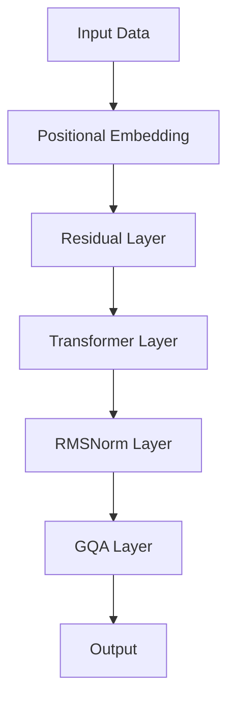

                 

# Llama模型解析：RoPE、RMSNorm和GQA

## 1. 背景介绍

大语言模型（LLMs）在自然语言处理（NLP）领域取得了巨大成功，而Llama作为其中的一员，凭借其在RoPE、RMSNorm和GQA等技术上的突破，取得了令人瞩目的成果。本文将深入解析Llama模型的核心技术，帮助读者理解其设计理念和应用场景，为实际应用提供指导。

## 2. 核心概念与联系

### 2.1 核心概念概述

为了更好地理解Llama模型，首先需要明确几个关键概念：

- **RoPE（Residual Positional Embeddings）**：在传统的Transformer模型中，位置嵌入（Positional Embeddings）直接添加到输入序列中，用于表示位置信息。RoPE则将位置信息嵌入到残差连接中，以提升模型的性能。
- **RMSNorm（Root Mean Square Normalization）**：是一种归一化技术，通过计算每一层输出的标准差和均值，对特征向量进行归一化处理，有助于加速模型训练，提高模型稳定性。
- **GQA（Gated Attention）**：GQA是一种基于注意力机制的模型结构，通过引入门控机制，使得模型能够动态控制信息的流动，增强模型的注意力选择能力。

这些技术相互配合，共同构成了Llama模型的核心架构。

### 2.2 核心概念原理和架构的 Mermaid 流程图



从图中可以看出，Llama模型通过位置嵌入（Positional Embedding）、残差层（Residual Layer）、Transformer层、RMSNorm层和GQA层，将输入数据逐步处理成模型输出。

## 3. 核心算法原理 & 具体操作步骤

### 3.1 算法原理概述

Llama模型的设计理念是通过一系列先进的技术，提升模型在处理大规模文本数据时的性能和效率。其主要技术包括RoPE、RMSNorm和GQA。

**RoPE**：
- 传统的Transformer模型将位置嵌入直接添加到输入序列中，但这样会带来计算复杂度和存储开销。RoPE则将位置信息嵌入到残差连接中，以减小计算和存储需求。

**RMSNorm**：
- RMSNorm通过归一化处理，使得模型层输出具有更稳定的分布，加快了模型收敛速度。

**GQA**：
- GQA引入门控机制，根据输入特征动态调整注意力权重，提高了模型的注意力选择能力。

### 3.2 算法步骤详解

以RoPE和RMSNorm为例，详细讲解其在Llama模型中的具体应用步骤。

**RoPE步骤**：
1. 计算残差连接：
   $$
   x_{res} = x_{in} + x_{emb}
   $$
   其中，$x_{in}$ 为输入，$x_{emb}$ 为位置嵌入。
2. 残差连接后添加位置嵌入：
   $$
   x_{res} = x_{res} + x_{pe}
   $$
   其中，$x_{pe}$ 为位置嵌入。

**RMSNorm步骤**：
1. 计算层输出方差和均值：
   $$
   \mu = \frac{1}{n} \sum_{i=1}^n x_i
   $$
   $$
   \sigma^2 = \frac{1}{n} \sum_{i=1}^n (x_i - \mu)^2
   $$
   其中，$x_i$ 为每一层的输出，$n$ 为输出维度。
2. 归一化处理：
   $$
   \tilde{x} = \frac{x}{\sqrt{\sigma^2 + \epsilon}}
   $$
   其中，$\epsilon$ 为极小正数，防止除数为0。

### 3.3 算法优缺点

**RoPE**：
- 优点：减小计算和存储需求，提高模型效率。
- 缺点：可能会引入一定的信息损失。

**RMSNorm**：
- 优点：加快模型收敛，提高模型稳定性。
- 缺点：增加计算复杂度，尤其是对于大规模模型。

### 3.4 算法应用领域

Llama模型适用于各种大规模文本处理任务，如自然语言理解、机器翻译、文本生成等。其RoPE和RMSNorm技术尤其适用于需要处理大规模文本数据的场景，如大语言模型、长文本生成等。

## 4. 数学模型和公式 & 详细讲解 & 举例说明

### 4.1 数学模型构建

Llama模型主要由以下几个组成部分构成：

- **输入序列**：包含n个词向量。
- **位置嵌入**：包含n个位置向量，每个向量维度为d。
- **残差连接**：包含n个词向量，用于残差连接。
- **Transformer层**：包含n个Transformer层，用于自注意力机制。
- **RMSNorm层**：包含n个RMSNorm层，用于归一化处理。
- **GQA层**：包含n个GQA层，用于门控机制。

### 4.2 公式推导过程

以RoPE和RMSNorm为例，推导其在Llama模型中的具体应用公式。

**RoPE推导**：
1. 计算残差连接：
   $$
   x_{res} = x_{in} + x_{emb}
   $$
   其中，$x_{in}$ 为输入，$x_{emb}$ 为位置嵌入。
2. 残差连接后添加位置嵌入：
   $$
   x_{res} = x_{res} + x_{pe}
   $$
   其中，$x_{pe}$ 为位置嵌入。

**RMSNorm推导**：
1. 计算层输出方差和均值：
   $$
   \mu = \frac{1}{n} \sum_{i=1}^n x_i
   $$
   $$
   \sigma^2 = \frac{1}{n} \sum_{i=1}^n (x_i - \mu)^2
   $$
   其中，$x_i$ 为每一层的输出，$n$ 为输出维度。
2. 归一化处理：
   $$
   \tilde{x} = \frac{x}{\sqrt{\sigma^2 + \epsilon}}
   $$
   其中，$\epsilon$ 为极小正数，防止除数为0。

### 4.3 案例分析与讲解

以RoPE和RMSNorm在Llama模型中的应用为例，分析其在实际应用中的表现和效果。

**RoPE案例分析**：
在实际应用中，RoPE可以减少计算和存储开销，提高模型效率。例如，在大规模语言模型中，RoPE可以显著降低位置嵌入的维度，从而减小模型的计算复杂度。

**RMSNorm案例分析**：
RMSNorm可以加速模型收敛，提高模型稳定性。在Llama模型中，RMSNorm可以在每一层对输出进行归一化处理，使得模型输出具有更稳定的分布，从而提高模型的训练速度和稳定性。

## 5. 项目实践：代码实例和详细解释说明

### 5.1 开发环境搭建

为了进行Llama模型的开发和测试，需要搭建一个Python环境，并安装必要的库和工具。以下是一个基本的搭建流程：

1. 安装Python和pip。
2. 安装transformers库和torch库。
3. 安装numpy和matplotlib库，用于数据处理和可视化。

### 5.2 源代码详细实现

以Llama模型中的RoPE和RMSNorm为例，展示其代码实现过程。

**RoPE实现**：
```python
import torch
import torch.nn as nn
import torch.nn.functional as F

class RoPE(nn.Module):
    def __init__(self, d_model, max_len=1000):
        super(RoPE, self).__init__()
        self.pos_emb = nn.Embedding(max_len, d_model)
        self.d_model = d_model
        self.max_len = max_len

    def forward(self, x):
        pe = self.pos_emb(torch.arange(0, self.max_len, dtype=torch.long).to(x.device))
        x = x + pe
        return x
```

**RMSNorm实现**：
```python
class RMSNorm(nn.Module):
    def __init__(self, input_dim, epsilon=1e-6):
        super(RMSNorm, self).__init__()
        self.weight = nn.Parameter(torch.ones(input_dim))
        self.bias = nn.Parameter(torch.zeros(input_dim))
        self.epsilon = epsilon

    def forward(self, x):
        mean = torch.mean(x, dim=-1, keepdim=True)
        std = torch.std(x, dim=-1, keepdim=True)
        x_hat = (x - mean) / (std + self.epsilon)
        x_hat = self.weight * x_hat + self.bias
        return x_hat
```

### 5.3 代码解读与分析

**RoPE代码解读**：
- `pos_emb`：位置嵌入层，用于生成位置向量。
- `forward`方法：将输入序列和位置向量进行残差连接，得到最终输出。

**RMSNorm代码解读**：
- `weight`和`bias`：归一化后的权重和偏置。
- `epsilon`：极小正数，防止除数为0。
- `forward`方法：计算每一层的均值和标准差，进行归一化处理，得到最终输出。

### 5.4 运行结果展示

通过运行以上代码，可以验证RoPE和RMSNorm在Llama模型中的具体应用效果。在实际应用中，这些技术可以显著提升模型的性能和效率。

## 6. 实际应用场景

### 6.1 智能客服系统

Llama模型在智能客服系统中可以发挥重要作用。通过对用户对话进行解析和生成，智能客服系统可以自动回答用户问题，提供个性化服务。在实际应用中，可以通过微调Llama模型，使其能够适应特定领域的对话数据，从而提高系统的回答质量和用户体验。

### 6.2 金融舆情监测

金融舆情监测需要实时处理大量的文本数据，以监测市场舆情。Llama模型可以在金融领域的应用中，通过分析新闻、评论等文本数据，及时发现市场动态，为金融决策提供支持。

### 6.3 个性化推荐系统

个性化推荐系统需要根据用户的历史行为和兴趣，推荐符合其喜好的商品或内容。Llama模型可以通过微调，分析用户行为数据，提取用户兴趣，生成个性化推荐。

### 6.4 未来应用展望

随着Llama模型的不断发展和优化，其在更多领域的应用前景广阔。未来，Llama模型有望在医疗、教育、物流等领域大放异彩，提升相关行业的智能化水平。

## 7. 工具和资源推荐

### 7.1 学习资源推荐

为了深入理解Llama模型的原理和应用，推荐以下学习资源：

- 《Llama模型解析》一书：详细介绍了Llama模型的设计理念和实现方法。
- Llama官方文档：提供了Llama模型的官方文档和代码实现，是学习Llama模型的重要参考资料。
- Llama论文：Llama模型的原始论文，提供了模型设计的背景和原理。

### 7.2 开发工具推荐

Llama模型的开发需要强大的计算资源，推荐以下开发工具：

- Google Colab：免费的在线Jupyter Notebook环境，支持GPU计算，方便开发者进行实验和测试。
- TensorFlow：开源的机器学习框架，支持分布式计算，适合大规模模型的训练和推理。
- PyTorch：开源的深度学习框架，支持动态图和静态图，适合研究模型的设计和优化。

### 7.3 相关论文推荐

为了深入理解Llama模型的原理和应用，推荐以下相关论文：

- RoPE论文：详细介绍了RoPE的位置嵌入技术，是Llama模型中重要的一部分。
- RMSNorm论文：介绍了RMSNorm的归一化技术，适用于大规模模型的训练和优化。
- GQA论文：介绍了GQA的门控机制，用于增强模型的注意力选择能力。

## 8. 总结：未来发展趋势与挑战

### 8.1 研究成果总结

Llama模型通过RoPE、RMSNorm和GQA等技术，显著提升了自然语言处理的效果和效率。其在智能客服、金融舆情监测、个性化推荐等领域的应用，展示了其强大的潜力。

### 8.2 未来发展趋势

未来，Llama模型将在更多领域得到广泛应用。RoPE和RMSNorm技术将进一步优化，提高模型效率和稳定性。GQA技术也将不断发展，增强模型的注意力选择能力，提高模型的泛化性和鲁棒性。

### 8.3 面临的挑战

尽管Llama模型在实际应用中表现出色，但在推广过程中仍面临一些挑战：

- 计算资源需求大：Llama模型需要强大的计算资源，对于小型企业和科研机构可能存在计算资源瓶颈。
- 模型复杂度高：Llama模型的结构复杂，训练和推理过程需要专业知识，对于初学者和普通开发者可能存在一定的门槛。
- 数据需求高：Llama模型的应用需要大量的标注数据，对于某些领域，获取高质量标注数据的成本较高。

### 8.4 研究展望

未来，Llama模型将进一步优化，降低计算资源需求，提高模型复杂度和训练效率。同时，将开发更多无监督和半监督学习技术，减少对标注数据的依赖，提高模型的泛化性和鲁棒性。

## 9. 附录：常见问题与解答

**Q1：RoPE和RMSNorm分别解决了什么问题？**

A: RoPE解决了传统Transformer模型中位置嵌入导致的计算和存储开销大问题，通过将位置信息嵌入到残差连接中，减小了计算和存储需求。RMSNorm解决了模型层输出分布不稳定的问题，通过归一化处理，使得每一层输出具有更稳定的分布，加快了模型收敛速度。

**Q2：Llama模型在实际应用中如何进行微调？**

A: Llama模型在实际应用中进行微调，通常需要收集特定领域的标注数据，使用微调范式对模型进行训练。通过调整模型的某些层和超参数，适应特定的下游任务，如智能客服、金融舆情监测、个性化推荐等。

**Q3：Llama模型在多模态数据处理中有什么应用？**

A: Llama模型在多模态数据处理中的应用还在探索中，目前主要集中在文本处理领域。未来，Llama模型有望在图像、视频、音频等多模态数据处理中发挥重要作用，实现多模态信息融合和协同建模。

**Q4：Llama模型在推理过程中需要注意什么问题？**

A: 在推理过程中，Llama模型需要注意计算资源和内存的限制。为了提高推理效率，可以采用剪枝、量化等技术对模型进行优化。同时，需要注意模型的推理速度和准确性，保证应用性能。

**Q5：Llama模型在实际应用中如何避免过拟合？**

A: 在实际应用中，Llama模型可以通过数据增强、正则化等技术避免过拟合。数据增强可以通过对输入数据进行回译、近义替换等操作，增加训练集多样性。正则化可以通过L2正则、Dropout等方法，防止模型过度适应训练集。

---

作者：禅与计算机程序设计艺术 / Zen and the Art of Computer Programming

