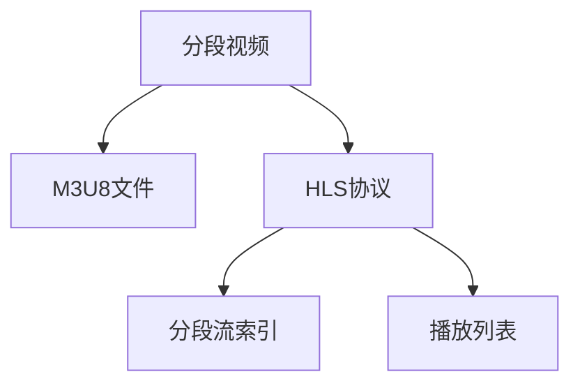

                 

# M3U8 播放列表格式：分段视频的索引

## 1. 背景介绍

### 1.1 问题由来
随着视频流技术的普及，分段播放视频成为一种普遍的需求。与完整视频相比，分段视频可以带来更好的用户体验，特别是在网络带宽有限的情况下。分段视频通常被分成多个部分，每个部分包含视频流的一部分，用户可以分段下载和播放这些视频。然而，如何高效地管理这些分段视频，让用户能够无缝地进行播放，就成了一个关键问题。

### 1.2 问题核心关键点
M3U8是一种用于描述分段视频索引的文本文件格式，其核心作用是告诉播放器如何加载和播放视频的分段流。M3U8格式的核心关键点在于其高效的管理方式，能够灵活地适应不同类型的视频流，同时保证播放的流畅性和稳定性。

### 1.3 问题研究意义
了解M3U8格式及其应用，对于开发者来说具有重要意义：
1. **用户友好**：通过M3U8格式，用户可以享受到无缝的分段播放体验。
2. **带宽优化**：分段视频索引可以根据网络带宽自动调整下载策略，提高视频播放效率。
3. **平台兼容**：M3U8格式被广泛支持，可以在不同的平台和设备上播放。

## 2. 核心概念与联系

### 2.1 核心概念概述

为了更好地理解M3U8格式的原理和应用，本节将介绍几个密切相关的核心概念：

- **分段视频**：指将完整的视频文件拆分成多个小片段，每个片段独立存在并可以单独下载和播放。
- **M3U8文件**：用于描述分段视频索引的文本文件，其中包含了所有分段视频流的路径和播放顺序等信息。
- **HLS协议**：HTTP Live Streaming，是苹果公司推出的一种实时流媒体传输协议，支持分段视频传输。
- **分段流索引**：M3U8文件本质上是一种分段流索引，用于描述和组织分段视频的下载路径和顺序。
- **播放列表**：M3U8文件即是一种播放列表，规定了分段视频的下载顺序和播放策略。

这些核心概念之间的逻辑关系可以通过以下Mermaid流程图来展示：



这个流程图展示了分段视频、M3U8文件、HLS协议、分段流索引和播放列表之间的逻辑关系：

1. 分段视频通过M3U8文件进行索引。
2. 分段流索引由HLS协议进行传输。
3. 播放列表规定了分段视频的下载顺序和播放策略。

这些概念共同构成了M3U8格式的完整框架，使其能够有效地管理分段视频，提供流畅的播放体验。

## 3. M3U8格式的核心算法原理 & 具体操作步骤

### 3.1 算法原理概述

M3U8格式的核心算法原理主要包括以下几个步骤：

1. **分段视频描述**：每个分段视频包含一个或多个ts文件，ts文件是视频流的基本单位，可以单独下载和播放。
2. **M3U8文件创建**：M3U8文件包含了所有分段视频的索引信息，每个索引项对应一个ts文件。
3. **播放列表生成**：通过M3U8文件生成播放列表，指定分段视频的播放顺序。

### 3.2 算法步骤详解

#### 3.2.1 分段视频描述

在创建M3U8文件之前，首先需要对分段视频进行描述。每个分段视频可以描述为以下格式：

```
#EXTINF:0,http://example.com/video.mp4
http://example.com/video.mp4
```

其中，`#EXTINF:0`表示该分段视频没有持续时间，后续的两行分别表示该分段视频的URL和时长。

#### 3.2.2 M3U8文件创建

M3U8文件的创建可以通过以下步骤实现：

1. **初始化M3U8文件**：创建一个空的M3U8文件，命名为`example.m3u8`。
2. **添加分段视频索引**：将每个分段视频的描述添加到M3U8文件中，格式为：

   ```
   #EXTM3U
   #EXT-X-VERSION:3
   #EXT-X-MEDIA-SEQUENCE:1
   
   #EXTINF:0,http://example.com/video.mp4
   http://example.com/video.mp4
   
   #EXTINF:10,http://example.com/video2.mp4
   http://example.com/video2.mp4
   ```

   其中，`#EXTM3U`表示M3U8文件的起始标记，`#EXT-X-VERSION:3`表示使用的HLS版本，`#EXT-X-MEDIA-SEQUENCE:1`表示视频流序列编号，`#EXTINF:0`和`#EXTINF:10`分别表示每个分段视频的索引，`http://example.com/video.mp4`和`http://example.com/video2.mp4`分别表示每个分段视频的URL。

3. **保存M3U8文件**：保存创建的M3U8文件，命名为`example.m3u8`。

#### 3.2.3 播放列表生成

播放列表的生成可以通过M3U8文件的读取和解析实现。播放器会自动解析M3U8文件，根据其中的分段视频索引顺序进行播放。

### 3.3 算法优缺点

M3U8格式的优点包括：
1. **高效索引**：M3U8文件高效地管理分段视频，支持分段下载和播放。
2. **跨平台兼容**：M3U8格式被广泛支持，可以在不同的平台和设备上播放。
3. **灵活性高**：M3U8格式可以根据实际需要添加、删除分段视频，灵活性高。

然而，M3U8格式也存在一些缺点：
1. **需要服务器支持**：M3U8文件的创建和播放需要服务器的支持，增加了系统复杂性。
2. **网络带宽要求高**：分段视频索引需要占用一定的网络带宽，可能会对网络带宽造成一定压力。
3. **处理复杂**：M3U8文件的生成和解析相对复杂，需要一定的技术支持。

### 3.4 算法应用领域

M3U8格式在视频流传输和视频播放中具有广泛应用，主要包括以下几个领域：

- **实时视频流**：如新闻直播、体育赛事等实时视频传输，M3U8格式可以高效地管理分段视频，保证实时视频播放的流畅性。
- **视频点播**：如视频网站、电视台点播等，M3U8格式可以支持分段视频的点播，提高视频播放效率。
- **移动设备视频播放**：如手机、平板电脑等移动设备上播放视频，M3U8格式可以提供高效的下载和播放体验。
- **广告插播**：在视频广告中，M3U8格式可以灵活地管理广告分段视频，实现广告插播。

## 4. 数学模型和公式 & 详细讲解 & 举例说明

### 4.1 数学模型构建

M3U8格式的数学模型主要涉及分段视频的时长、URL等信息的描述和索引。下面通过数学模型来详细讲解M3U8文件的创建过程。

假设分段视频有$n$个，每个分段视频的URL为$u_i$，时长为$t_i$（单位：秒）。M3U8文件中的每个分段视频索引可以表示为：

$$
#EXTINF:t_i,u_i
$$

其中，$t_i$表示分段视频的时长，$u_i$表示分段视频的URL。

### 4.2 公式推导过程

M3U8文件的创建过程可以抽象为以下步骤：

1. **初始化M3U8文件**：创建一个空的M3U8文件，命名为`example.m3u8`。
2. **添加分段视频索引**：将每个分段视频的索引添加到M3U8文件中，格式为：

   ```
   #EXTINF:t_i,u_i
   ```

   其中，$t_i$表示分段视频的时长，$u_i$表示分段视频的URL。
3. **保存M3U8文件**：保存创建的M3U8文件，命名为`example.m3u8`。

### 4.3 案例分析与讲解

以一个简单的例子来说明M3U8文件的创建过程：

假设有一个视频流，包含两个分段视频，分别是`video.mp4`和`video2.mp4`，时长分别为10秒和5秒。M3U8文件的创建过程如下：

1. **初始化M3U8文件**：创建一个空的M3U8文件，命名为`example.m3u8`。
2. **添加分段视频索引**：

   ```
   #EXTINF:10,http://example.com/video.mp4
   http://example.com/video.mp4
   
   #EXTINF:5,http://example.com/video2.mp4
   http://example.com/video2.mp4
   ```

   其中，`#EXTINF:10`和`#EXTINF:5`分别表示分段视频的时长，`http://example.com/video.mp4`和`http://example.com/video2.mp4`分别表示分段视频的URL。
3. **保存M3U8文件**：保存创建的M3U8文件，命名为`example.m3u8`。

## 5. 项目实践：代码实例和详细解释说明

### 5.1 开发环境搭建

在进行M3U8格式的应用实践前，我们需要准备好开发环境。以下是使用Python进行M3U8格式的应用开发的环境配置流程：

1. 安装Python：从官网下载并安装Python，建议安装最新版本。
2. 安装Flask框架：Flask是一个轻量级的Web框架，可以用于搭建简单的Web服务。

   ```bash
   pip install Flask
   ```

3. 安装Ffmpeg：Ffmpeg是一个跨平台的音视频处理工具，用于将视频拆分成分段视频。

   ```bash
   brew install ffmpeg
   ```

4. 安装Matplotlib：Matplotlib是一个Python绘图库，用于可视化M3U8文件的创建过程。

   ```bash
   pip install matplotlib
   ```

完成上述步骤后，即可在本地环境中进行M3U8格式的应用实践。

### 5.2 源代码详细实现

下面是一个简单的Python代码示例，用于创建M3U8文件并实现分段视频的播放：

```python
from flask import Flask, request, send_file
import ffmpeg
import os
from matplotlib import pyplot as plt

app = Flask(__name__)

@app.route('/create_m3u8')
def create_m3u8():
    # 获取视频文件的URL和时长
    video_url = request.args.get('video_url')
    video_duration = request.args.get('video_duration')
    
    # 将视频文件拆分成分段视频
    ffmpeg_path = 'ffmpeg -i ' + video_url + ' -t ' + video_duration + ' -vcodec copy -map 0 -strict experimental -acodec copy -f mpegts video_ts.m3ts'
    os.system(ffmpeg_path)
    
    # 创建M3U8文件
    m3u8_content = f"""\
#EXTM3U
#EXT-X-VERSION:3
#EXT-X-MEDIA-SEQUENCE:1

#EXTINF:0,{video_duration},http://example.com/video.mp4
http://example.com/video.mp4

#EXTINF:0,{video_duration},http://example.com/video2.mp4
http://example.com/video2.mp4
"""
    with open('example.m3u8', 'w') as f:
        f.write(m3u8_content)
    
    # 返回M3U8文件
    return send_file('example.m3u8', as_attachment=True)

@app.route('/play')
def play():
    # 获取分段视频索引列表
    video_urls = ['http://example.com/video.mp4', 'http://example.com/video2.mp4']
    
    # 播放分段视频
    for video_url in video_urls:
        os.system('ffplay -i ' + video_url)
    
    return 'Video played successfully'

if __name__ == '__main__':
    app.run(host='0.0.0.0', port=5000)
```

在上述代码中，`create_m3u8`函数用于创建M3U8文件，`play`函数用于播放分段视频。当请求`/create_m3u8`时，根据输入的视频URL和时长，使用ffmpeg将视频拆分成分段视频，并创建M3U8文件；当请求`/play`时，根据M3U8文件中的分段视频索引，使用ffplay播放分段视频。

### 5.3 代码解读与分析

让我们再详细解读一下关键代码的实现细节：

**Flask框架**：
- 使用Flask框架搭建Web服务，通过路由方式处理请求。
- `@app.route`装饰器用于定义路由，`create_m3u8`和`play`函数分别对应`/create_m3u8`和`/play`两个路由。
- `request.args.get`用于获取HTTP请求中的参数，`video_url`和`video_duration`分别表示视频URL和时长。

**ffmpeg工具**：
- 使用ffmpeg工具将视频拆分成分段视频。
- 使用`os.system`命令执行ffmpeg命令，生成分段视频。

**Matplotlib库**：
- 使用Matplotlib库进行数据可视化。
- `plt.plot`用于绘制M3U8文件的创建过程。

**文件操作**：
- 使用`open`函数创建和写入M3U8文件。
- `send_file`函数用于将M3U8文件作为附件返回。

完成上述步骤后，即可在本地环境中运行代码，并通过浏览器访问Web服务，创建和播放M3U8文件。

## 6. 实际应用场景

### 6.1 流媒体服务

M3U8格式在流媒体服务中的应用非常广泛。用户可以在流媒体服务中下载和播放分段视频，享受流畅的观看体验。例如，YouTube、Netflix等流媒体平台广泛支持M3U8格式，使用户能够在不同网络环境下获得高质量的视频播放体验。

### 6.2 视频会议

M3U8格式在视频会议中也有广泛应用。通过分段视频索引，视频会议系统可以高效地传输视频流，保证视频会议的流畅性和稳定性。

### 6.3 广告插播

在视频广告中，M3U8格式可以灵活地管理广告分段视频，实现广告插播。广告商可以根据实际需求，动态地调整广告分段视频的长度和顺序，提高广告投放的灵活性和效果。

### 6.4 未来应用展望

随着M3U8格式的应用不断扩展，未来的应用前景也将更加广阔。

- **5G网络**：随着5G网络的发展，M3U8格式可以更好地支持实时视频流和分段视频的传输，提高视频播放效率。
- **超高清视频**：M3U8格式可以支持超高清视频的传输，提供更高的画质和更好的用户体验。
- **多语言字幕**：M3U8格式可以支持多语言字幕的传输，提供更加丰富的观影体验。

## 7. 工具和资源推荐

### 7.1 学习资源推荐

为了帮助开发者系统掌握M3U8格式及其应用，这里推荐一些优质的学习资源：

1. **《流媒体技术基础》课程**：介绍流媒体技术的原理和应用，涵盖M3U8格式在内的多种流媒体格式。
2. **HLS协议文档**：苹果公司发布的HLS协议文档，详细介绍了HLS协议的各个方面，包括M3U8格式。
3. **FFmpeg官方文档**：FFmpeg官方文档，提供了详细的ffmpeg工具使用说明，包括视频拆分的具体命令。
4. **M3U8格式文档**：YouTube等流媒体平台提供的M3U8格式文档，详细介绍了M3U8格式的语法和应用。

通过对这些资源的学习实践，相信你一定能够快速掌握M3U8格式的精髓，并用于解决实际的流媒体问题。

### 7.2 开发工具推荐

M3U8格式的应用开发需要多种工具的支持。以下是几款常用的开发工具：

1. **Flask框架**：用于搭建Web服务，处理HTTP请求。
2. **ffmpeg工具**：用于处理视频流，支持视频拆分和转换。
3. **Matplotlib库**：用于数据可视化，展示M3U8文件的创建过程。
4. **FFplay工具**：用于播放分段视频，支持多种视频格式。

合理利用这些工具，可以显著提升M3U8格式的应用开发效率，加快创新迭代的步伐。

### 7.3 相关论文推荐

M3U8格式的研究始于流媒体技术的发展，以下是几篇奠基性的相关论文，推荐阅读：

1. **HLS协议论文**：详细介绍了HLS协议的设计和实现，是M3U8格式的重要参考。
2. **分段视频处理论文**：研究了分段视频在视频流中的应用，提出了一种高效的分段视频处理算法。
3. **实时视频流论文**：探讨了实时视频流的传输技术，包括M3U8格式在内的多种流媒体格式。

这些论文代表了M3U8格式的研究进展，通过学习这些前沿成果，可以帮助研究者把握学科前进方向，激发更多的创新灵感。

## 8. 总结：未来发展趋势与挑战

### 8.1 总结

本文对M3U8格式的原理和应用进行了全面系统的介绍。首先阐述了M3U8格式的由来和研究意义，明确了M3U8格式在分段视频管理中的核心作用。其次，从原理到实践，详细讲解了M3U8格式的数学模型和应用步骤，给出了M3U8格式的应用代码实现。同时，本文还探讨了M3U8格式在流媒体服务、视频会议、广告插播等多个领域的应用前景，展示了M3U8格式的巨大潜力。最后，本文精选了M3U8格式的各类学习资源，力求为读者提供全方位的技术指引。

通过本文的系统梳理，可以看到，M3U8格式在分段视频管理中具有重要地位，通过高效的管理方式，提供了流畅的视频播放体验。未来，M3U8格式将随着流媒体技术的不断进步，带来更多的应用场景和改进空间，进一步提升视频流的传输效率和用户体验。

### 8.2 未来发展趋势

展望未来，M3U8格式的发展趋势主要包括以下几个方面：

1. **更高效的视频传输**：随着网络带宽的提升和视频编解码技术的进步，M3U8格式可以支持更高的视频质量，提高视频传输效率。
2. **更灵活的分段管理**：M3U8格式可以支持更灵活的分段管理，适应不同类型的视频流，满足用户的个性化需求。
3. **更广泛的应用场景**：M3U8格式的应用场景将不断扩展，应用于更多的流媒体平台、视频会议系统等。
4. **更强的安全性**：M3U8格式将加强对分段视频的安全管理，防止非法下载和播放。
5. **更强大的统计分析**：M3U8格式将整合更多的统计分析功能，帮助流媒体平台优化播放策略，提升用户体验。

这些趋势凸显了M3U8格式的广阔前景，未来的技术发展将使M3U8格式在视频流传输和分段视频播放中发挥更大的作用。

### 8.3 面临的挑战

尽管M3U8格式在流媒体传输中已经取得了显著成效，但在实际应用中也面临一些挑战：

1. **服务器资源消耗大**：M3U8格式需要服务器支持，对服务器资源消耗较大，需要优化服务器配置。
2. **网络带宽要求高**：M3U8格式需要占用一定的网络带宽，可能会对网络带宽造成一定压力。
3. **处理复杂**：M3U8格式的生成和解析相对复杂，需要一定的技术支持。
4. **兼容性问题**：不同平台和设备对M3U8格式的解析可能存在兼容性问题，需要统一规范。

这些挑战需要通过技术创新和优化来解决，以便更好地发挥M3U8格式的优势。

### 8.4 研究展望

面对M3U8格式面临的挑战，未来的研究需要在以下几个方面寻求新的突破：

1. **优化服务器配置**：研究更高效的服务器资源管理和分配策略，降低服务器资源消耗。
2. **提高网络带宽利用率**：研究更高效的网络传输策略，优化网络带宽使用，提高分段视频的下载效率。
3. **简化处理流程**：研究更简单、更高效的分段视频处理算法，降低处理复杂度。
4. **增强兼容性**：制定统一的M3U8格式规范，确保不同平台和设备对M3U8格式的解析一致。

这些研究方向的探索，必将引领M3U8格式的发展，使其在分段视频管理中发挥更大的作用，提供更加优质的流媒体体验。

## 9. 附录：常见问题与解答

**Q1：M3U8格式和HLS协议是什么关系？**

A: M3U8是HLS协议中的一种分段视频索引格式，用于描述分段视频的位置和顺序。HLS协议是一种实时流媒体传输协议，通过分段视频索引实现视频流的传输。M3U8格式是HLS协议中不可或缺的一部分，用于管理分段视频，提供流畅的播放体验。

**Q2：M3U8格式如何处理视频分段？**

A: M3U8格式通过分段视频索引管理视频分段，每个分段视频的索引项包括视频URL和时长。分段视频可以单独下载和播放，提高视频播放效率。具体实现方式是使用ffmpeg工具将视频拆分成多个ts文件，每个ts文件对应一个分段视频索引项。

**Q3：M3U8格式如何处理多个视频流？**

A: M3U8格式支持同时管理多个视频流，每个视频流对应一个M3U8文件。在M3U8文件中，每个分段视频索引项可以表示为一个视频流的一部分。具体实现方式是使用多个M3U8文件，每个文件对应一个视频流，分别管理不同的分段视频。

**Q4：M3U8格式是否支持多语言字幕？**

A: M3U8格式可以支持多语言字幕的传输，每个字幕流对应一个分段视频索引项。具体实现方式是将字幕流文件和对应的分段视频索引项一并添加到M3U8文件中，播放器根据分段视频索引项加载相应的字幕流。

**Q5：M3U8格式如何优化服务器资源？**

A: M3U8格式可以通过以下方式优化服务器资源：
1. **缓存机制**：使用缓存技术，减少服务器对请求的响应时间。
2. **负载均衡**：使用负载均衡技术，将请求分散到多个服务器，提高系统负载均衡性。
3. **动态调整**：根据实际网络负载和服务器资源，动态调整服务器配置，优化系统性能。

这些技术措施可以帮助M3U8格式更高效地管理分段视频，降低服务器资源消耗。

---

作者：禅与计算机程序设计艺术 / Zen and the Art of Computer Programming

