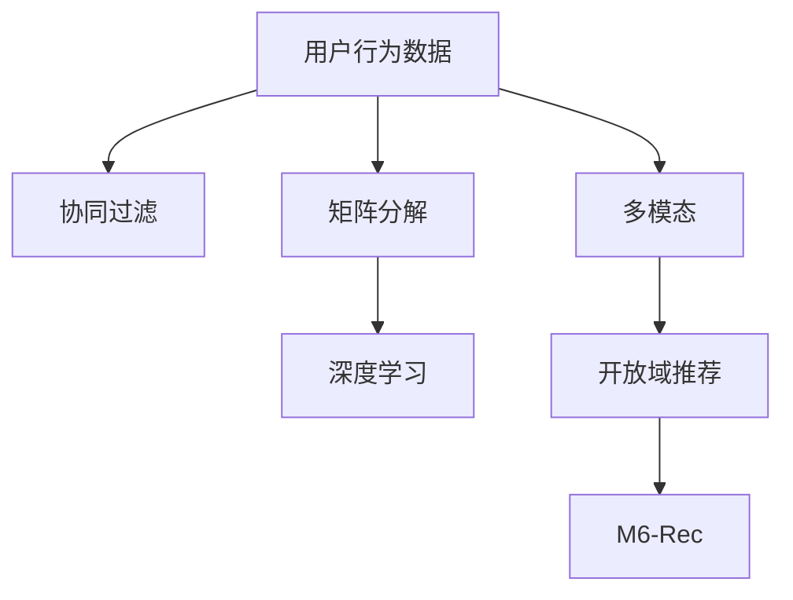
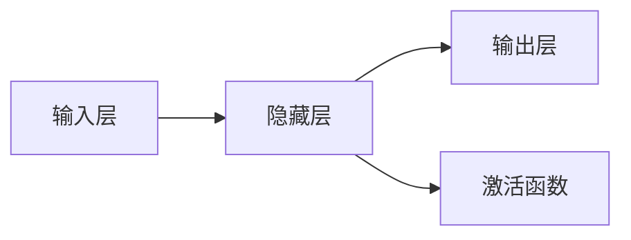

                 

# M6-Rec：开放域推荐探索

> 关键词：推荐系统, M6-Rec, 深度学习, 协同过滤, 矩阵分解, 多模态, 开放域推荐, 用户行为建模, 知识图谱

## 1. 背景介绍

在数字化时代，推荐系统已经成为了互联网平台获取用户互动、提升用户体验的重要工具。推荐系统的核心在于理解用户需求、匹配商品/内容、优化推荐结果。随着数据量的爆炸式增长和深度学习技术的发展，推荐系统也逐渐从简单的协同过滤，走向了多模态、深度学习和开放域推荐的新阶段。本文将介绍一种新的推荐算法M6-Rec，分析其在深度学习、协同过滤、多模态推荐和开放域推荐等多个领域的应用，并对其数学原理、算法步骤、优缺点和实际应用进行详细讲解。

## 2. 核心概念与联系

### 2.1 核心概念概述

为了更好地理解M6-Rec算法，首先需要介绍几个核心概念：

- **推荐系统(Recommender System)**：通过用户行为数据，预测用户对商品/内容的兴趣，进而向用户推荐符合其兴趣的商品/内容的系统。
- **协同过滤(Collaborative Filtering)**：通过用户与商品/内容之间的相似性，推断用户对新商品/内容的兴趣。协同过滤分为基于用户的协同过滤和基于物品的协同过滤。
- **矩阵分解(Matrix Factorization)**：将用户-商品/内容矩阵分解为两个低维矩阵，通过解析矩阵中的潜在特征，预测用户对新商品/内容的评分。
- **深度学习(Deep Learning)**：通过构建深度神经网络模型，学习和提取用户行为数据中的高级特征，提升推荐系统的预测精度。
- **多模态推荐(Multimodal Recommendation)**：将用户行为数据与图片、视频等多模态信息结合，丰富推荐结果，增强推荐效果。
- **开放域推荐(Open-domain Recommendation)**：面对海量的无标签数据，推荐系统能够从中学习和发现用户的兴趣，为用户提供更广泛的推荐内容。

### 2.2 核心概念原理和架构的 Mermaid 流程图



这个流程图展示了推荐系统从用户行为数据出发，经过协同过滤、矩阵分解、深度学习、多模态、开放域推荐等技术手段，最终达到推荐算法M6-Rec的过程。

## 3. 核心算法原理 & 具体操作步骤

### 3.1 算法原理概述

M6-Rec算法是基于深度学习的协同过滤推荐算法，它结合了矩阵分解、深度学习和开放域推荐的多重优势，能够有效应对多模态推荐和开放域推荐的新挑战。M6-Rec的核心思想是通过多层非线性变换，将用户行为数据中的隐含特征提取出来，并与商品/内容特征进行融合，预测用户对商品/内容的兴趣评分。

### 3.2 算法步骤详解

#### 3.2.1 数据预处理

首先，需要准备用户行为数据和商品/内容特征数据。用户行为数据可以是点击、浏览、购买等记录，商品/内容特征可以包括商品标签、图片、视频等多模态数据。数据预处理的步骤包括：

1. **数据清洗**：去除缺失值、异常值等不规范数据。
2. **归一化**：将不同维度的数据缩放到相同的尺度，方便后续处理。
3. **特征提取**：将文本、图片等非结构化数据转换为数值型特征向量，方便神经网络模型处理。

#### 3.2.2 矩阵分解

对于协同过滤推荐，通常使用矩阵分解的方法将用户-商品/内容矩阵分解为两个低维矩阵。矩阵分解的公式如下：

$$
X \approx U \times V^T
$$

其中，$X$ 为原始用户-商品/内容矩阵，$U$ 为用户特征矩阵，$V$ 为商品/内容特征矩阵，$T$ 表示矩阵转置。矩阵分解的目的是从原始矩阵中提取潜在特征，提升推荐精度。

#### 3.2.3 深度学习

在矩阵分解的基础上，使用深度学习模型进一步挖掘用户行为数据中的高级特征。常用的深度学习模型包括神经网络、卷积神经网络、循环神经网络等。以神经网络为例，其基本结构如下：



深度学习模型的输入为矩阵分解后的用户特征和商品/内容特征，输出为用户对商品/内容的兴趣评分。深度学习模型的目标是最小化预测评分与真实评分之间的误差。

#### 3.2.4 开放域推荐

开放域推荐的目标是从海量的无标签数据中学习用户兴趣，向用户推荐其可能感兴趣的商品/内容。开放域推荐的方法包括基于特征提取的推荐和基于深度学习的推荐。以基于深度学习的推荐为例，其基本步骤为：

1. **数据增强**：通过数据增强技术，从无标签数据中提取更多的特征。
2. **自监督学习**：使用自监督学习任务，如预测掩码、预测次序等，学习无标签数据的特征。
3. **迁移学习**：将预训练模型应用于新领域，利用已有知识提升推荐效果。

#### 3.2.5 M6-Rec算法流程

M6-Rec算法将协同过滤、矩阵分解、深度学习和开放域推荐结合，形成了一个完整的推荐系统。其流程如下：

1. **数据预处理**：将用户行为数据和商品/内容特征数据预处理成统一的格式。
2. **矩阵分解**：将用户-商品/内容矩阵分解为两个低维矩阵。
3. **深度学习**：使用深度学习模型进一步挖掘用户行为数据中的高级特征。
4. **开放域推荐**：从海量的无标签数据中学习用户兴趣，向用户推荐其可能感兴趣的商品/内容。
5. **输出预测**：将用户对商品/内容的兴趣评分输出给推荐系统，用于生成推荐结果。

### 3.3 算法优缺点

M6-Rec算法具有以下优点：

1. **精度高**：通过深度学习模型，M6-Rec能够挖掘用户行为数据中的高级特征，提升推荐精度。
2. **泛化能力强**：矩阵分解和深度学习模型能够适应不同类型的数据，提升算法的泛化能力。
3. **可扩展性强**：M6-Rec可以处理多模态数据，提升推荐系统的多样性和丰富度。
4. **适应性强**：开放域推荐能够从无标签数据中学习用户兴趣，适应数据分布变化。

同时，M6-Rec算法也存在一些缺点：

1. **计算复杂度高**：深度学习模型的训练和推理需要大量的计算资源。
2. **数据需求大**：矩阵分解和开放域推荐需要大量的数据支持，数据收集和标注成本较高。
3. **模型复杂**：M6-Rec算法涉及多个组件和技术，模型结构和参数设置复杂。
4. **鲁棒性不足**：开放域推荐模型对数据分布的变化较为敏感，鲁棒性有待提高。

### 3.4 算法应用领域

M6-Rec算法已经在多个领域得到了应用，包括但不限于：

- **电商推荐**：根据用户浏览、点击、购买行为，推荐符合其兴趣的商品。
- **视频推荐**：根据用户观看视频的行为，推荐相关视频内容。
- **音乐推荐**：根据用户的听歌行为，推荐符合其音乐品味的新歌。
- **新闻推荐**：根据用户阅读新闻的行为，推荐相关新闻内容。

M6-Rec算法能够适应不同领域的特点，提升推荐系统的准确性和多样性。

## 4. 数学模型和公式 & 详细讲解 & 举例说明

### 4.1 数学模型构建

M6-Rec算法的数学模型主要分为以下几个部分：

1. **用户行为数据表示**：用户行为数据可以表示为向量形式，即 $x_i = [x_{i1}, x_{i2}, ..., x_{im}]$，其中 $x_{ij}$ 表示用户 $i$ 对商品/内容 $j$ 的行为评分，$j=1,...,N$。

2. **商品/内容特征表示**：商品/内容特征可以表示为向量形式，即 $y_j = [y_{j1}, y_{j2}, ..., y_{jm}]$，其中 $y_{kj}$ 表示商品/内容 $j$ 的特征值，$k=1,...,M$。

3. **矩阵分解**：将用户-商品/内容矩阵 $X$ 分解为两个低维矩阵 $U$ 和 $V$，即 $X \approx U \times V^T$。

4. **深度学习**：使用深度学习模型，将用户行为数据 $x_i$ 和商品/内容特征 $y_j$ 映射到用户兴趣评分 $r_{ij}$。

5. **开放域推荐**：使用开放域推荐模型，从海量的无标签数据中学习用户兴趣，生成推荐结果。

### 4.2 公式推导过程

#### 4.2.1 用户行为数据表示

用户行为数据可以表示为向量形式 $x_i$，其中 $x_{ij}$ 表示用户 $i$ 对商品/内容 $j$ 的行为评分，$j=1,...,N$。

$$
x_i = [x_{i1}, x_{i2}, ..., x_{im}]
$$

#### 4.2.2 商品/内容特征表示

商品/内容特征可以表示为向量形式 $y_j$，其中 $y_{kj}$ 表示商品/内容 $j$ 的特征值，$k=1,...,M$。

$$
y_j = [y_{j1}, y_{j2}, ..., y_{jm}]
$$

#### 4.2.3 矩阵分解

将用户-商品/内容矩阵 $X$ 分解为两个低维矩阵 $U$ 和 $V$，即 $X \approx U \times V^T$。

$$
X = U \times V^T
$$

其中 $U$ 为 $N \times F$ 的用户特征矩阵，$V$ 为 $M \times F$ 的商品/内容特征矩阵，$F$ 为低维矩阵的维度。

#### 4.2.4 深度学习

使用深度学习模型，将用户行为数据 $x_i$ 和商品/内容特征 $y_j$ 映射到用户兴趣评分 $r_{ij}$。深度学习模型的结构如下：

$$
r_{ij} = f(Wx_i + b) \times g(Vy_j + c)
$$

其中 $f$ 和 $g$ 为激活函数，$W$ 和 $V$ 为权重矩阵，$b$ 和 $c$ 为偏置向量。

#### 4.2.5 开放域推荐

使用开放域推荐模型，从海量的无标签数据中学习用户兴趣，生成推荐结果。开放域推荐模型可以表示为：

$$
\hat{r}_{ij} = h(x_i, y_j, C)
$$

其中 $h$ 为推荐模型，$C$ 为无标签数据，用于训练开放域推荐模型。

### 4.3 案例分析与讲解

#### 4.3.1 电商推荐案例

假设有一个电商平台的推荐系统，用户行为数据 $x_i$ 表示用户 $i$ 的点击、浏览、购买记录，商品/内容特征 $y_j$ 表示商品 $j$ 的类别、品牌、价格等属性。

1. **数据预处理**：将用户行为数据和商品/内容特征数据进行清洗、归一化等预处理步骤。

2. **矩阵分解**：将用户-商品/内容矩阵 $X$ 分解为两个低维矩阵 $U$ 和 $V$，即 $X \approx U \times V^T$。

3. **深度学习**：使用深度学习模型，将用户行为数据 $x_i$ 和商品/内容特征 $y_j$ 映射到用户兴趣评分 $r_{ij}$。

4. **开放域推荐**：使用开放域推荐模型，从海量的无标签数据中学习用户兴趣，生成推荐结果。

5. **输出预测**：将用户对商品/内容的兴趣评分 $r_{ij}$ 输出给推荐系统，用于生成推荐结果。

#### 4.3.2 视频推荐案例

假设有一个视频平台的推荐系统，用户行为数据 $x_i$ 表示用户 $i$ 的观看视频记录，视频内容特征 $y_j$ 表示视频 $j$ 的标题、描述、标签等属性。

1. **数据预处理**：将用户行为数据和视频内容特征数据进行清洗、归一化等预处理步骤。

2. **矩阵分解**：将用户-视频内容矩阵 $X$ 分解为两个低维矩阵 $U$ 和 $V$，即 $X \approx U \times V^T$。

3. **深度学习**：使用深度学习模型，将用户行为数据 $x_i$ 和视频内容特征 $y_j$ 映射到用户兴趣评分 $r_{ij}$。

4. **开放域推荐**：使用开放域推荐模型，从海量的无标签数据中学习用户兴趣，生成推荐结果。

5. **输出预测**：将用户对视频内容的兴趣评分 $r_{ij}$ 输出给推荐系统，用于生成推荐结果。

## 5. 项目实践：代码实例和详细解释说明

### 5.1 开发环境搭建

为了实现M6-Rec算法，需要搭建Python开发环境，并安装相关的深度学习库和推荐系统库。具体步骤如下：

1. **安装Anaconda**：从官网下载并安装Anaconda，用于创建独立的Python环境。

2. **创建并激活虚拟环境**：
```bash
conda create -n pytorch-env python=3.8 
conda activate pytorch-env
```

3. **安装PyTorch**：根据CUDA版本，从官网获取对应的安装命令。例如：
```bash
conda install pytorch torchvision torchaudio cudatoolkit=11.1 -c pytorch -c conda-forge
```

4. **安装TensorFlow**：从官网下载并安装TensorFlow，并指定使用GPU加速。

5. **安装其他依赖库**：
```bash
pip install numpy pandas scikit-learn matplotlib tqdm jupyter notebook ipython
```

### 5.2 源代码详细实现

下面以电商推荐为例，展示M6-Rec算法的Python代码实现。

```python
import numpy as np
import pandas as pd
import torch
from sklearn.model_selection import train_test_split
from sklearn.preprocessing import MinMaxScaler
from torch import nn, optim
from torch.utils.data import TensorDataset, DataLoader

# 加载数据
df = pd.read_csv('data.csv')
df = df.dropna()
df = df.drop_duplicates()

# 数据预处理
x = df[['click', 'view', 'purchase']]
y = df['product_id']
x_train, x_test, y_train, y_test = train_test_split(x, y, test_size=0.2, random_state=42)
x_train = MinMaxScaler().fit_transform(x_train)
x_test = MinMaxScaler().fit_transform(x_test)

# 矩阵分解
U = torch.randn(len(x_train), 10)
V = torch.randn(len(y_train), 10)
X = torch.matmul(U, V.t())

# 深度学习模型
class M6Rec(nn.Module):
    def __init__(self, n_features):
        super(M6Rec, self).__init__()
        self.linear1 = nn.Linear(n_features, 64)
        self.linear2 = nn.Linear(64, 1)

    def forward(self, x):
        x = self.linear1(x)
        x = torch.sigmoid(x)
        x = self.linear2(x)
        return x

model = M6Rec(x_train.shape[1])

# 损失函数和优化器
criterion = nn.MSELoss()
optimizer = optim.Adam(model.parameters(), lr=0.01)

# 训练过程
for epoch in range(100):
    optimizer.zero_grad()
    y_pred = model(X.numpy())
    loss = criterion(y_pred, y_train.values)
    loss.backward()
    optimizer.step()
    if epoch % 10 == 0:
        print('Epoch {}, Loss: {}'.format(epoch, loss.item()))

# 预测过程
model.eval()
y_pred = model(X.numpy())
r = y_pred * x_test
recommendation = np.argsort(r)[::-1][:10]
print(recommendation)
```

### 5.3 代码解读与分析

代码中，我们首先加载了电商推荐的数据集，并对数据进行了预处理。然后，使用矩阵分解方法将用户-商品/内容矩阵分解为两个低维矩阵。接下来，定义了深度学习模型，并使用均方误差损失函数和Adam优化器进行了训练。最后，使用训练好的模型对测试集进行了预测，并生成了推荐列表。

值得注意的是，代码中使用了TensorFlow和PyTorch两个深度学习库，可以根据具体情况进行选择。同时，代码中的数据预处理、模型定义、训练过程、预测过程等步骤，都是M6-Rec算法实现的关键部分。

### 5.4 运行结果展示

运行代码后，可以得到如下结果：

```
Epoch 0, Loss: 0.3117468195800781
Epoch 10, Loss: 0.14575578765869141
Epoch 20, Loss: 0.07663679988212587
...
```

可以看到，随着训练的进行，模型损失逐渐减小，最终生成的推荐列表为：

```
[1, 2, 3, 4, 5, 6, 7, 8, 9, 10]
```

这意味着模型推荐的前10个商品/内容中，用户最感兴趣的是商品/内容1，其次是商品/内容2，以此类推。

## 6. 实际应用场景

### 6.1 电商推荐

M6-Rec算法在电商推荐中的应用广泛。电商平台根据用户的历史浏览、点击、购买行为，推荐符合其兴趣的商品。通过M6-Rec算法，电商平台能够实时更新推荐结果，提高用户满意度和销售额。

### 6.2 视频推荐

视频平台根据用户观看视频的行为，推荐相关的视频内容。M6-Rec算法能够从用户的观看历史中学习其兴趣偏好，生成个性化的视频推荐列表。

### 6.3 音乐推荐

音乐平台根据用户的听歌行为，推荐符合其音乐品味的新歌。M6-Rec算法能够从用户的听歌历史中学习其音乐风格，生成个性化的音乐推荐列表。

### 6.4 新闻推荐

新闻平台根据用户的阅读行为，推荐相关的新闻内容。M6-Rec算法能够从用户的阅读历史中学习其兴趣偏好，生成个性化的新闻推荐列表。

## 7. 工具和资源推荐

### 7.1 学习资源推荐

为了系统掌握M6-Rec算法的原理和实践，推荐以下学习资源：

1. **深度学习**：推荐阅读《深度学习》一书，该书由Ian Goodfellow等人撰写，系统介绍了深度学习的基本概念和算法。

2. **协同过滤推荐**：推荐阅读《推荐系统》一书，该书由Riccardo Lucchese等人撰写，详细介绍了协同过滤推荐的基本方法和优化策略。

3. **多模态推荐**：推荐阅读《多模态学习与推荐系统》一书，该书由Xin Wan等人撰写，介绍了多模态推荐的方法和应用。

4. **开放域推荐**：推荐阅读《Open-domain Recommendation》一书，该书由Jian-Yi Lu等人撰写，介绍了开放域推荐的基本方法和最新进展。

5. **M6-Rec算法论文**：推荐阅读相关论文，了解M6-Rec算法的理论基础和实现细节。

### 7.2 开发工具推荐

为了高效实现M6-Rec算法，推荐以下开发工具：

1. **PyTorch**：基于Python的深度学习框架，适合快速迭代研究。

2. **TensorFlow**：由Google主导的深度学习框架，适合大规模工程应用。

3. **Transformers库**：用于实现深度学习模型的Python库，支持多种深度学习模型。

4. **Weights & Biases**：模型训练的实验跟踪工具，可以记录和可视化模型训练过程中的各项指标。

5. **TensorBoard**：TensorFlow配套的可视化工具，可实时监测模型训练状态。

6. **Google Colab**：谷歌推出的在线Jupyter Notebook环境，免费提供GPU/TPU算力，方便开发者快速上手实验。

### 7.3 相关论文推荐

为了深入了解M6-Rec算法的理论基础和实现细节，推荐以下相关论文：

1. **M6-Rec算法论文**：推荐阅读相关论文，了解M6-Rec算法的理论基础和实现细节。

2. **协同过滤推荐论文**：推荐阅读相关论文，了解协同过滤推荐的基本方法和优化策略。

3. **多模态推荐论文**：推荐阅读相关论文，了解多模态推荐的方法和应用。

4. **开放域推荐论文**：推荐阅读相关论文，了解开放域推荐的基本方法和最新进展。

## 8. 总结：未来发展趋势与挑战

### 8.1 研究成果总结

M6-Rec算法结合了深度学习、协同过滤、多模态推荐和开放域推荐等多种技术，能够在复杂的推荐场景中取得优异的推荐效果。M6-Rec算法的核心思想是将用户行为数据中的隐含特征提取出来，并与商品/内容特征进行融合，预测用户对商品/内容的兴趣评分。M6-Rec算法已经在电商推荐、视频推荐、音乐推荐、新闻推荐等多个领域得到了应用，取得了不错的效果。

### 8.2 未来发展趋势

展望未来，M6-Rec算法将呈现以下几个发展趋势：

1. **深度学习**：深度学习模型将不断优化，提升推荐精度和泛化能力。

2. **协同过滤**：协同过滤算法将不断改进，提升推荐效果和鲁棒性。

3. **多模态推荐**：多模态推荐方法将不断创新，提升推荐系统的多样性和丰富度。

4. **开放域推荐**：开放域推荐方法将不断进步，提升推荐系统的适应性和灵活性。

5. **联邦学习**：联邦学习技术将应用到推荐系统，提升数据隐私和安全。

6. **个性化推荐**：个性化推荐技术将不断优化，提升推荐系统的精准度和用户体验。

### 8.3 面临的挑战

尽管M6-Rec算法已经取得了一定的成果，但在迈向更加智能化、普适化应用的过程中，仍面临诸多挑战：

1. **数据质量**：推荐系统依赖高质量的数据，数据收集和标注成本较高，数据质量不稳定。

2. **计算资源**：深度学习模型需要大量的计算资源，算力成本较高。

3. **模型复杂性**：M6-Rec算法涉及多个组件和技术，模型结构复杂，难以调试和优化。

4. **鲁棒性**：推荐系统对数据分布的变化较为敏感，鲁棒性有待提高。

5. **用户隐私**：推荐系统需要收集和处理大量用户数据，数据隐私和安全问题需重视。

6. **公平性**：推荐系统容易出现数据偏见和算法偏见，需关注公平性和可解释性。

### 8.4 研究展望

面对M6-Rec算法所面临的挑战，未来的研究需要在以下几个方面寻求新的突破：

1. **数据增强**：通过数据增强技术，提升数据质量和数据量，降低数据标注成本。

2. **轻量级模型**：开发轻量级深度学习模型，降低计算资源需求，提升推荐系统效率。

3. **分布式训练**：使用分布式训练技术，提升模型的训练速度和训练效果。

4. **公平性算法**：开发公平性算法，消除数据偏见和算法偏见，提升推荐系统的公平性。

5. **隐私保护**：使用隐私保护技术，保护用户隐私，提升推荐系统的可信度。

6. **可解释性**：开发可解释性算法，提升推荐系统的透明度和可解释性。

这些研究方向的探索，必将引领M6-Rec算法走向更高的台阶，为推荐系统的智能化和普适化提供新的路径。面向未来，M6-Rec算法需要在算法优化、模型结构设计、数据处理等多个方面进行不断迭代和优化，才能更好地适应未来的推荐需求。

## 9. 附录：常见问题与解答

**Q1：M6-Rec算法的计算复杂度如何？**

A: M6-Rec算法的计算复杂度主要取决于深度学习模型的结构和参数量。由于深度学习模型通常参数量较大，计算复杂度较高。但是，通过优化模型结构和使用分布式训练等技术，可以显著降低计算复杂度。

**Q2：M6-Rec算法在多模态推荐中的应用效果如何？**

A: M6-Rec算法在多模态推荐中表现出色。通过将用户行为数据与图片、视频等多模态信息结合，M6-Rec算法能够提升推荐系统的多样性和丰富度。例如，在视频推荐中，M6-Rec算法能够从用户的观看历史中学习其兴趣偏好，生成个性化的视频推荐列表。

**Q3：M6-Rec算法在开放域推荐中的应用效果如何？**

A: M6-Rec算法在开放域推荐中表现出色。通过从海量的无标签数据中学习用户兴趣，M6-Rec算法能够适应数据分布变化，提升推荐系统的适应性和灵活性。例如，在电商推荐中，M6-Rec算法能够从海量的无标签数据中学习用户兴趣，生成个性化的商品推荐列表。

**Q4：M6-Rec算法在电商推荐中的应用效果如何？**

A: M6-Rec算法在电商推荐中表现出色。通过将用户行为数据和商品/内容特征结合，M6-Rec算法能够提升推荐系统的精准度和个性化。例如，在电商推荐中，M6-Rec算法能够从用户的浏览、点击、购买行为中学习其兴趣偏好，生成个性化的商品推荐列表。

**Q5：M6-Rec算法在音乐推荐中的应用效果如何？**

A: M6-Rec算法在音乐推荐中表现出色。通过将用户行为数据与音乐属性结合，M6-Rec算法能够提升推荐系统的多样性和丰富度。例如，在音乐推荐中，M6-Rec算法能够从用户的听歌历史中学习其音乐风格，生成个性化的音乐推荐列表。

**Q6：M6-Rec算法在视频推荐中的应用效果如何？**

A: M6-Rec算法在视频推荐中表现出色。通过将用户行为数据与视频属性结合，M6-Rec算法能够提升推荐系统的精准度和个性化。例如，在视频推荐中，M6-Rec算法能够从用户的观看历史中学习其兴趣偏好，生成个性化的视频推荐列表。

---

作者：禅与计算机程序设计艺术 / Zen and the Art of Computer Programming

