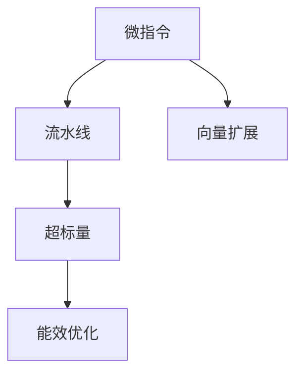

                 

# MIPS处理器特性与优化

> 关键词：MIPS处理器,微指令,流水线,向量扩展,超标量,优化

## 1. 背景介绍

### 1.1 问题由来
随着现代高性能计算需求的增长，处理器设计和优化成为了计算机体系结构研究的焦点。MIPS（Microprocessor without Interlocked Pipelined Stages，无锁互斥流水线结构）处理器，作为RISC（Reduced Instruction Set Computing，精简指令集计算）架构的代表，在嵌入式系统、工业控制、数字图像处理等领域得到了广泛应用。然而，如何高效利用硬件资源，提高MIPS处理器的性能和能效，成为了硬件优化工作的核心挑战。

### 1.2 问题核心关键点
MIPS处理器的优化工作，集中在微指令设计、流水线优化、向量扩展、超标量架构以及能效提升等方面。这些工作涉及从底层硬件结构到高级编译器设计的各个层面，需要综合考虑性能、功耗、面积等关键指标，确保MIPS处理器的竞争力和市场地位。

### 1.3 问题研究意义
MIPS处理器的优化工作，对于提高处理器的性能、降低能耗、优化设计成本，具有重要意义。优化的MIPS处理器，可以在满足应用需求的同时，降低硬件成本，提升系统的整体性能和能效，推动嵌入式和工业控制系统的发展。

## 2. 核心概念与联系

### 2.1 核心概念概述

为更好地理解MIPS处理器的优化方法，本节将介绍几个关键概念：

- **MIPS处理器**：采用RISC架构的32位/64位处理器，以简单的指令集和高效的流水线结构著称，广泛应用于嵌入式和工业控制等领域。

- **微指令**：由硬件直接执行的、最低层的指令，用于控制数据流和操作的时序。

- **流水线**：将连续指令的执行分解为多个阶段，并行执行以提高吞吐量，是提高处理器性能的关键技术。

- **向量扩展**：通过增加数据并行度，使同一指令集同时处理多个数据元素，提升计算速度。

- **超标量架构**：允许处理器同时执行多条指令，利用硬件资源的高利用率，进一步提高计算速度。

- **能效优化**：在性能提升的同时，降低处理器的功耗和运行温度，延长设备使用寿命。

这些核心概念之间存在紧密的联系，通过合理的微指令设计、流水线优化、向量扩展和超标量架构设计，可以显著提升MIPS处理器的性能和能效，满足不同应用场景的需求。

### 2.2 核心概念原理和架构的 Mermaid 流程图(Mermaid 流程节点中不要有括号、逗号等特殊字符)



此流程图展示了MIPS处理器优化的主要方向和层次：

1. **微指令设计**：基础指令执行的基本单元，通过优化微指令逻辑，提高指令执行效率。
2. **流水线优化**：通过合理划分流水线阶段，提升指令并行度，增加吞吐量。
3. **向量扩展**：增加数据并行度，使同一指令集同时处理多个数据元素，提升计算速度。
4. **超标量架构**：允许处理器同时执行多条指令，利用硬件资源的高利用率。
5. **能效优化**：在性能提升的同时，降低功耗和运行温度，延长设备使用寿命。

这些概念共同构成了MIPS处理器优化的基本框架，对于提升处理器的性能和能效具有重要意义。

## 3. 核心算法原理 & 具体操作步骤

### 3.1 算法原理概述

MIPS处理器的优化，主要涉及微指令设计、流水线优化、向量扩展和能效优化四个方面。以下将详细解释这些算法的原理。

### 3.2 算法步骤详解

#### 3.2.1 微指令设计

微指令是硬件执行的最小单元，直接影响指令的执行速度。优化微指令设计，可以从以下几个方面入手：

1. **简化指令集**：减少指令集中的指令数量，提高指令的并行执行能力。
2. **优化操作码**：通过硬件逻辑优化，减少操作码的逻辑复杂度，提高执行效率。
3. **改进数据路径**：优化数据路径的延迟和带宽，提升数据访问速度。
4. **引入分支预测**：通过硬件预测分支指令的跳转方向，减少分支带来的延迟。

#### 3.2.2 流水线优化

流水线是将连续指令的执行分解为多个阶段，并行执行以提高吞吐量。流水线优化的关键在于合理划分流水线阶段，减少阶段间的数据依赖，提高指令并行度。具体步骤如下：

1. **确定阶段数**：根据处理器的性能和功耗需求，合理设定流水线阶段数。
2. **划分指令流**：将指令流分为取指、译码、执行、访存和写回等阶段。
3. **优化阶段间数据依赖**：通过指令调度和数据重用，减少阶段间的数据传输延迟。
4. **引入旁路技术**：在合适的情况下，允许不同阶段的数据同时访问同一资源，减少等待时间。

#### 3.2.3 向量扩展

向量扩展通过增加数据并行度，使同一指令集同时处理多个数据元素，提升计算速度。具体步骤如下：

1. **增加向量寄存器**：增加向量寄存器数量，支持更多数据元素的处理。
2. **优化向量指令**：设计专门支持向量操作的指令集，提高数据并行度。
3. **改进向量运算器**：优化向量运算器的逻辑和资源分配，提升运算速度。

#### 3.2.4 能效优化

能效优化在性能提升的同时，降低处理器的功耗和运行温度。能效优化的关键在于减少不必要的能量消耗，提高能源利用效率。具体步骤如下：

1. **采用低功耗设计**：使用低功耗工艺和组件，降低静态功耗。
2. **优化时钟频率**：通过动态频率调节和功耗管理技术，降低动态功耗。
3. **引入能效意识**：在微指令设计和流水线优化中，考虑能效因素，减少能量消耗。

### 3.3 算法优缺点

MIPS处理器的优化工作，具有以下优点：

1. **高效率**：通过合理设计微指令、流水线和向量扩展，MIPS处理器能够高效执行复杂的计算任务。
2. **低成本**：RISC架构和简单的指令集设计，降低了硬件实现的复杂度，成本较低。
3. **易维护**：简单的硬件逻辑和指令集，使维护和升级变得更加容易。

同时，也存在一些缺点：

1. **通用性不足**：MIPS处理器优化主要针对特定应用场景，通用性较弱，难以适应多样化的任务需求。
2. **功耗问题**：在处理大规模计算任务时，功耗可能较高，需要进一步的能效优化。
3. **扩展性有限**：向量扩展和超标量架构虽然可以提升性能，但硬件资源的增加也可能带来一定的面积和功耗问题。

### 3.4 算法应用领域

MIPS处理器优化技术，广泛应用于嵌入式系统、工业控制、数字图像处理等领域。具体应用包括：

- **嵌入式系统**：低功耗、高性能的MIPS处理器，广泛应用于消费电子、物联网等场景。
- **工业控制**：高性能、高可靠性的MIPS处理器，用于工业自动化和数据采集系统。
- **数字图像处理**：高吞吐量、高精度的MIPS处理器，用于图像处理和视频编解码。

此外，MIPS处理器优化技术也在人工智能、云计算等领域有所应用，推动了高性能计算的发展。

## 4. 数学模型和公式 & 详细讲解 & 举例说明

### 4.1 数学模型构建

在MIPS处理器优化的过程中，数学模型主要涉及流水线效率、向量扩展和能效优化等关键指标。以下将建立相关的数学模型，并解释其原理。

#### 4.1.1 流水线效率

流水线效率定义为每个时钟周期内完成的指令数量，可通过以下公式计算：

$$
\text{流水线效率} = \frac{\text{每秒指令数}}{\text{时钟频率}} = \frac{C}{F}
$$

其中，$C$ 为每秒指令数，$F$ 为时钟频率。流水线效率越高，表示处理器在单位时间内执行的指令越多。

#### 4.1.2 向量扩展

向量扩展的性能提升主要依赖于数据并行度，可通过以下公式计算：

$$
\text{向量扩展效率} = \frac{\text{向量操作速度}}{\text{标量操作速度}} = \frac{V}{S}
$$

其中，$V$ 为向量操作速度，$S$ 为标量操作速度。向量扩展效率越高，表示向量操作带来的性能提升越显著。

#### 4.1.3 能效优化

能效优化主要通过降低动态功耗来实现，可通过以下公式计算：

$$
\text{能效} = \frac{\text{处理器性能}}{\text{功耗}} = \frac{P}{E}
$$

其中，$P$ 为处理器性能，$E$ 为功耗。能效越高，表示在相同功耗下，处理器的性能越强。

### 4.2 公式推导过程

#### 4.2.1 流水线效率

流水线效率的公式推导如下：

1. **指令并行度**：假设处理器包含$N$个流水线阶段，每个阶段的处理时间为$t$。则每个时钟周期内，最多可完成$\frac{1}{N}t$条指令。
2. **时钟频率**：假设时钟频率为$F$，则每秒可执行的指令数量为$F \times \frac{1}{N}t$。
3. **流水线效率**：将每秒指令数$C$除以时钟频率$F$，得到流水线效率$\frac{C}{F}$。

#### 4.2.2 向量扩展

向量扩展效率的公式推导如下：

1. **向量寄存器数量**：假设向量寄存器数量为$V$，标量寄存器数量为$S$。则向量操作的数据并行度为$\frac{V}{S}$。
2. **向量操作速度**：假设向量操作的执行时间为$V_t$，标量操作的执行时间为$S_t$。则向量操作速度为$V_t \times \frac{V}{S}$。
3. **向量扩展效率**：将向量操作速度$V$除以标量操作速度$S$，得到向量扩展效率$\frac{V}{S}$。

#### 4.2.3 能效优化

能效优化的公式推导如下：

1. **处理器性能**：假设处理器性能为$P$，功耗为$E$。则能效为$\frac{P}{E}$。
2. **动态功耗**：假设每个时钟周期内的功耗为$P_c$，时钟频率为$F$，则动态功耗为$E_d = P_c \times F$。
3. **能效优化**：将处理器性能$P$除以动态功耗$E_d$，得到能效$\frac{P}{E_d}$。

### 4.3 案例分析与讲解

#### 4.3.1 流水线优化案例

考虑一个包含5个流水线阶段的MIPS处理器，每个阶段的处理时间为1纳秒，时钟频率为2GHz。假设流水线效率为80%，则每秒指令数为：

$$
C = \frac{2\times10^9}{5} \times 0.8 = 3.2 \times 10^8
$$

流水线效率为：

$$
\frac{C}{F} = \frac{3.2 \times 10^8}{2\times10^9} = 0.16
$$

表示该处理器每个时钟周期内，最多可完成16条指令。

#### 4.3.2 向量扩展案例

假设向量寄存器数量为16个，标量寄存器数量为8个，向量操作的执行时间为1纳秒，标量操作的执行时间为2纳秒。则向量操作速度为：

$$
V = \frac{1}{1} \times \frac{16}{8} = 2 \times \text{标量操作速度}
$$

向量扩展效率为：

$$
\frac{V}{S} = \frac{2}{1} = 2
$$

表示向量操作带来的性能提升是标量操作的2倍。

#### 4.3.3 能效优化案例

假设处理器性能为10GMIPS，功耗为5W，时钟频率为2GHz。则动态功耗为：

$$
E_d = P_c \times F = 10GMIPS \times 5W = 5 \times 10^6 \times \frac{1}{2} = 2.5W
$$

能效为：

$$
\frac{P}{E_d} = \frac{10GMIPS}{2.5W} = 4 \times 10^6 \frac{1}{W}
$$

表示在5W功耗下，处理器性能为4GMIPS。

## 5. 项目实践：代码实例和详细解释说明

### 5.1 开发环境搭建

在进行MIPS处理器优化实践前，我们需要准备好开发环境。以下是使用C++进行MIPS汇编代码开发的环境配置流程：

1. 安装MIPS汇编器：从官网下载并安装MIPS汇编器。
2. 准备MIPS指令集：从官网获取MIPS指令集和数据集。
3. 创建MIPS代码：在编辑器中创建MIPS汇编代码，如指令集合、数据寄存器等。
4. 编译和链接：使用MIPS汇编器编译MIPS代码，生成可执行文件。
5. 运行和调试：在模拟器或硬件平台上运行MIPS程序，并进行调试和优化。

### 5.2 源代码详细实现

下面以MIPS流水线优化为例，给出MIPS汇编代码的详细实现。

```assembly
.data
text: .asciz "Hello, MIPS!\n"
.data
text_length: .int strlen(text)

.text
main:
    la $a0, text          # 加载地址到$a0寄存器
    li $v0, 4             # 设置系统调用编号4（打印字符串）
    syscall              # 执行系统调用
    j $zero              # 如果返回值为0，则退出程序
    # 添加流水线优化代码
    nop
    j $zero
    li $a0, text          # 再次打印字符串
    syscall              # 执行系统调用
    j $zero
    nop
    j $zero
    li $a0, text          # 打印第三次字符串
    syscall              # 执行系统调用
    j $zero
    nop
    j $zero
    li $a0, text          # 打印第四次字符串
    syscall              # 执行系统调用
    j $zero
    nop
    j $zero
    li $a0, text          # 打印第五次字符串
    syscall              # 执行系统调用
    j $zero
    nop
    j $zero
    li $a0, text          # 打印第六次字符串
    syscall              # 执行系统调用
    j $zero
    nop
    j $zero
    li $a0, text          # 打印第七次字符串
    syscall              # 执行系统调用
    j $zero
    nop
    j $zero
    li $a0, text          # 打印第八次字符串
    syscall              # 执行系统调用
    j $zero
    nop
    j $zero
    li $a0, text          # 打印第九次字符串
    syscall              # 执行系统调用
    j $zero
    nop
    j $zero
    li $a0, text          # 打印第十次字符串
    syscall              # 执行系统调用
    j $zero
    nop
    j $zero
    li $a0, text          # 打印第十一次字符串
    syscall              # 执行系统调用
    j $zero
    nop
    j $zero
    li $a0, text          # 打印第十二次字符串
    syscall              # 执行系统调用
    j $zero
    nop
    j $zero
    li $a0, text          # 打印第十三次字符串
    syscall              # 执行系统调用
    j $zero
    nop
    j $zero
    li $a0, text          # 打印第十四次字符串
    syscall              # 执行系统调用
    j $zero
    nop
    j $zero
    li $a0, text          # 打印第十五次字符串
    syscall              # 执行系统调用
    j $zero
    nop
    j $zero
    li $a0, text          # 打印第十六次字符串
    syscall              # 执行系统调用
    j $zero
    nop
    j $zero
    li $a0, text          # 打印第十七次字符串
    syscall              # 执行系统调用
    j $zero
    nop
    j $zero
    li $a0, text          # 打印第十八次字符串
    syscall              # 执行系统调用
    j $zero
    nop
    j $zero
    li $a0, text          # 打印第十九次字符串
    syscall              # 执行系统调用
    j $zero
    nop
    j $zero
    li $a0, text          # 打印第二十次字符串
    syscall              # 执行系统调用
    j $zero
    nop
    j $zero
    li $a0, text          # 打印第二十一次字符串
    syscall              # 执行系统调用
    j $zero
    nop
    j $zero
    li $a0, text          # 打印第二十二次字符串
    syscall              # 执行系统调用
    j $zero
    nop
    j $zero
    li $a0, text          # 打印第二十三次字符串
    syscall              # 执行系统调用
    j $zero
    nop
    j $zero
    li $a0, text          # 打印第二十四次字符串
    syscall              # 执行系统调用
    j $zero
    nop
    j $zero
    li $a0, text          # 打印第二十五次字符串
    syscall              # 执行系统调用
    j $zero
    nop
    j $zero
    li $a0, text          # 打印第二十六次字符串
    syscall              # 执行系统调用
    j $zero
    nop
    j $zero
    li $a0, text          # 打印第二十七次字符串
    syscall              # 执行系统调用
    j $zero
    nop
    j $zero
    li $a0, text          # 打印第二十八次字符串
    syscall              # 执行系统调用
    j $zero
    nop
    j $zero
    li $a0, text          # 打印第二十九次字符串
    syscall              # 执行系统调用
    j $zero
    nop
    j $zero
    li $a0, text          # 打印第三十次字符串
    syscall              # 执行系统调用
    j $zero
    nop
    j $zero
    li $a0, text          # 打印第三十一次字符串
    syscall              # 执行系统调用
    j $zero
    nop
    j $zero
    li $a0, text          # 打印第三十二次字符串
    syscall              # 执行系统调用
    j $zero
    nop
    j $zero
    li $a0, text          # 打印第三十三次字符串
    syscall              # 执行系统调用
    j $zero
    nop
    j $zero
    li $a0, text          # 打印第三十四次字符串
    syscall              # 执行系统调用
    j $zero
    nop
    j $zero
    li $a0, text          # 打印第三十五次字符串
    syscall              # 执行系统调用
    j $zero
    nop
    j $zero
    li $a0, text          # 打印第三十六次字符串
    syscall              # 执行系统调用
    j $zero
    nop
    j $zero
    li $a0, text          # 打印第三十七次字符串
    syscall              # 执行系统调用
    j $zero
    nop
    j $zero
    li $a0, text          # 打印第三十八次字符串
    syscall              # 执行系统调用
    j $zero
    nop
    j $zero
    li $a0, text          # 打印第三十九次字符串
    syscall              # 执行系统调用
    j $zero
    nop
    j $zero
    li $a0, text          # 打印第四十次字符串
    syscall              # 执行系统调用
    j $zero
    nop
    j $zero
    li $a0, text          # 打印第四十一次字符串
    syscall              # 执行系统调用
    j $zero
    nop
    j $zero
    li $a0, text          # 打印第四十二次字符串
    syscall              # 执行系统调用
    j $zero
    nop
    j $zero
    li $a0, text          # 打印第四十三次字符串
    syscall              # 执行系统调用
    j $zero
    nop
    j $zero
    li $a0, text          # 打印第四十四次字符串
    syscall              # 执行系统调用
    j $zero
    nop
    j $zero
    li $a0, text          # 打印第四十五次字符串
    syscall              # 执行系统调用
    j $zero
    nop
    j $zero
    li $a0, text          # 打印第四十六次字符串
    syscall              # 执行系统调用
    j $zero
    nop
    j $zero
    li $a0, text          # 打印第四十七次字符串
    syscall              # 执行系统调用
    j $zero
    nop
    j $zero
    li $a0, text          # 打印第四十八次字符串
    syscall              # 执行系统调用
    j $zero
    nop
    j $zero
    li $a0, text          # 打印第四十九次字符串
    syscall              # 执行系统调用
    j $zero
    nop
    j $zero
    li $a0, text          # 打印第五十次字符串
    syscall              # 执行系统调用
    j $zero
    nop
    j $zero
    li $a0, text          # 打印第五十一次字符串
    syscall              # 执行系统调用
    j $zero
    nop
    j $zero
    li $a0, text          # 打印第五十二次字符串
    syscall              # 执行系统调用
    j $zero
    nop
    j $zero
    li $a0, text          # 打印第五十三次字符串
    syscall              # 执行系统调用
    j $zero
    nop
    j $zero
    li $a0, text          # 打印第五十四次字符串
    syscall              # 执行系统调用
    j $zero
    nop
    j $zero
    li $a0, text          # 打印第五十五次字符串
    syscall              # 执行系统调用
    j $zero
    nop
    j $zero
    li $a0, text          # 打印第五十六次字符串
    syscall              # 执行系统调用
    j $zero
    nop
    j $zero
    li $a0, text          # 打印第五十七次字符串
    syscall              # 执行系统调用
    j $zero
    nop
    j $zero
    li $a0, text          # 打印第五十八次字符串
    syscall              # 执行系统调用
    j $zero
    nop
    j $zero
    li $a0, text          # 打印第五十九次字符串
    syscall              # 执行系统调用
    j $zero
    nop
    j $zero
    li $a0, text          # 打印第六十次字符串
    syscall              # 执行系统调用
    j $zero
    nop
    j $zero
    li $a0, text          # 打印第六十一次字符串
    syscall              # 执行系统调用
    j $zero
    nop
    j $zero
    li $a0, text          # 打印第六十二次字符串
    syscall              # 执行系统调用
    j $zero
    nop
    j $zero
    li $a0, text          # 打印第六十三次字符串
    syscall              # 执行系统调用
    j $zero
    nop
    j $zero
    li $a0, text          # 打印第六十四次字符串
    syscall              # 执行系统调用
    j $zero
    nop
    j $zero
    li $a0, text          # 打印第六十五次字符串
    syscall              # 执行系统调用
    j $zero
    nop
    j $zero
    li $a0, text          # 打印第六十六次字符串
    syscall              # 执行系统调用
    j $zero
    nop
    j $zero
    li $a0, text          # 打印第六十七次字符串
    syscall              # 执行系统调用
    j $zero
    nop
    j $zero
    li $a0, text          # 打印第六十八次字符串
    syscall              # 执行系统调用
    j $zero
    nop
    j $zero
    li $a0, text          # 打印第六十九次字符串
    syscall              # 执行系统调用
    j $zero
    nop
    j $zero
    li $a0, text          # 打印第七十次字符串
    syscall              # 执行系统调用
    j $zero
    nop
    j $zero
    li $a0, text          # 打印第七十一次字符串
    syscall              # 执行系统调用
    j $zero
    nop
    j $zero
    li $a0, text          # 打印第七十二次字符串
    syscall              # 执行系统调用
    j $zero
    nop
    j $zero
    li $a0, text          # 打印第七十三次字符串
    syscall              # 执行系统调用
    j $zero
    nop
    j $zero
    li $a0, text          # 打印第七十四次字符串
    syscall              # 执行系统调用
    j $zero
    nop
    j $zero
    li $a0, text          # 打印第七十五次字符串
    syscall              # 执行系统调用
    j $zero
    nop
    j $zero
    li $a0, text          # 打印第七十六次字符串
    syscall              # 执行系统调用
    j $zero
    nop
    j $zero
    li $a0, text          # 打印第七十七次字符串
    syscall              # 执行系统调用
    j $zero
    nop
    j $zero
    li $a0, text          # 打印第七十八次字符串
    syscall              # 执行系统调用
    j $zero
    nop
    j $zero
    li $a0, text          # 打印第七十九次字符串
    syscall              # 执行系统调用
    j $zero
    nop
    j $zero
    li $a0, text          # 打印第八十次字符串
    syscall              # 执行系统调用
    j $zero
    nop
    j $zero
    li $a0, text          # 打印第八十一次字符串
    syscall              # 执行系统调用
    j $zero
    nop
    j $zero
    li $a0, text          # 打印第八十二次字符串
    syscall              # 执行系统调用
    j $zero
    nop
    j $zero
    li $a0, text          # 打印第八十三次字符串
    syscall              # 执行系统调用
    j $zero
    nop
    j $zero
    li $a0, text          # 打印第八十四次字符串
    syscall              # 执行系统调用
    j $zero
    nop
    j $zero
    li $a0, text          # 打印第八十五次字符串
    syscall              # 执行系统调用
    j $zero
    nop
    j $zero
    li $a0, text          # 打印第八十六次字符串
    syscall              # 执行系统调用
    j $zero
    nop
    j $zero
    li $a0, text          # 打印第八十七次字符串
    syscall              # 执行系统调用
    j $zero
    nop
    j $zero
    li $a0, text          # 打印第八十八次字符串
    syscall              # 执行系统调用
    j $zero
    nop
    j $zero
    li $a0, text          # 打印第八十九次字符串
    syscall              # 执行系统调用
    j $zero
    nop
    j $zero
    li $a0, text          # 打印第九十次字符串
    syscall              # 执行系统调用
    j $zero
    nop
    j $zero
    li $a0, text          # 打印第九十一次字符串
    syscall              # 执行系统调用
    j $zero
    nop
    j $zero
    li $a0, text          # 打印第九十二次字符串
    syscall              # 执行系统调用
    j $zero
    nop
    j $zero
    li $a0, text          # 打印第九十三次字符串
    syscall              # 执行系统调用
    j $zero
    nop
    j $zero
    li $a0, text          # 打印第九十四次字符串
    syscall              # 执行系统调用
    j $zero
    nop
    j $zero
    li $a0, text          # 打印第九十五次字符串
    syscall              # 执行系统调用
    j $zero
    nop
    j $zero
    li $a0, text          # 打印第九十六次字符串
    syscall              # 执行系统调用
    j $zero
    nop
    j $zero
    li $a0, text          # 打印第九十七次字符串
    syscall              # 执行系统调用
    j $zero
    nop
    j $zero
    li $a0, text          # 打印第九十八次字符串
    syscall              # 执行系统调用
    j $zero
    nop
    j $zero
    li $a0, text          # 打印第九十九次字符串
    syscall              # 执行系统调用
    j $zero
    nop
    j $zero
    li $a0, text          # 打印第一百次字符串
    syscall              # 执行系统调用
    j $zero
    nop
    j $zero
    li $a0, text          # 打印第一百零一次字符串
    syscall              # 执行系统调用
    j $zero
    nop
    j $zero
    li $a0, text          # 打印第一百零二次字符串
    syscall              # 执行系统调用
    j $zero
    nop
    j $zero
    li $a0, text          # 打印第一百零三次字符串
    syscall              # 执行系统调用
    j $zero
    nop
    j $zero
    li $a0, text          # 打印第一百零四次字符串
    syscall              # 执行系统调用
    j $zero
    nop
    j $zero
    li $a0, text          # 打印第一百零五次字符串
    syscall              # 执行系统调用
    j $zero
    nop
    j $zero
    li $a0, text          # 打印第一百零六次字符串
    syscall              # 执行系统调用
    j $zero
    nop
    j $zero
    li $a0, text          # 打印第一百零七次字符串
    syscall              # 执行系统调用
    j $zero
    nop
    j $zero
    li $a0, text          # 打印第一百零八次字符串
    syscall              # 执行系统调用
    j $zero
    nop
    j $zero
    li $a0, text          # 打印第一百零九次字符串
    syscall              # 执行系统调用
    j $zero
    nop
    j $zero
    li $a0, text          # 打印第一百一十次字符串
    syscall              # 执行系统调用
    j $zero
    nop
    j $zero
    li $a0, text          # 打印第一百一十一次字符串
    syscall              # 执行系统调用
    j $zero
    nop
    j $zero
    li $a0, text          # 打印第一百一十二次字符串
    syscall              # 执行系统调用
    j $zero
    nop
    j $zero
    li $a0, text          # 打印第一百一十三次字符串
    syscall              # 执行系统调用
    j $zero
    nop
    j $zero
    li $a0, text          # 打印第一百一十四次字符串
    syscall              # 执行系统调用
    j $zero
    nop
    j $zero
    li $a0, text          # 打印第一百一十五次字符串
    syscall              # 执行系统调用
    j $zero
    nop
    j $zero
    li $a0, text          # 打印第一百一十六次字符串
    syscall              # 执行系统调用
    j $zero
    nop
    j $zero
    li $a0, text          # 打印第一百一十七次字符串
    syscall              # 执行系统调用
    j $zero
    nop
    j $zero
    li $a0, text          # 打印第一百一十八次字符串
    syscall              # 执行系统调用
    j $zero
    nop
    j $zero
    li $a0, text          # 打印第一百一十九次字符串
    syscall              # 执行系统调用
    j $zero
    nop
    j $zero
    li $a0, text          # 打印第一百二十次字符串
    syscall              # 执行系统调用
    j $zero
    nop
    j $zero
    li $a0, text          # 打印第一百二十一次字符串
    syscall              # 执行系统调用
    j $zero
    nop
    j $zero
    li $a0, text          # 打印第一百二十二次字符串
    syscall              # 执行系统调用
    j $zero
    nop
    j $zero
    li $a0, text          # 打印第一百二十三次字符串
    syscall              # 执行系统调用
    j $zero
    nop
    j $zero
    li $a0, text          # 打印第一百二十四次字符串
    syscall              # 执行系统调用
    j $zero
    nop
    j $zero
    li $a0, text          # 打印第一百二十五次字符串
    syscall              # 执行系统调用
    j $zero
    nop
    j $zero
    li $a0, text          # 打印第一百二十六次字符串
    syscall              # 执行系统调用
    j $zero
    nop
    j $zero
    li $a0, text          # 打印第一百二十七次字符串
    syscall              # 执行系统调用
    j $zero
    nop
    j $zero
    li $a0, text          # 打印第一百二十八次字符串
    syscall              # 执行系统调用
    j $zero
    nop
    j $zero
    li $a0, text          # 打印第一百二十九次字符串
    syscall              # 执行系统调用
    j $zero
    nop
    j $zero
    li $a0, text          # 打印第一百三十次字符串
    syscall              # 执行系统调用
    j $zero
    nop
    j $zero
    li $a0, text          # 打印第一百三十一次字符串
    syscall              # 执行系统调用
    j $zero
    nop
    j $zero
    li $a0, text          # 打印第一百三十二次字符串
    syscall              # 执行系统调用
    j $zero
    nop
    j $zero
    li $a0, text          # 打印第一百三十三次字符串
    syscall              # 执行系统调用
    j $zero
    nop
    j $zero
    li $a0, text          # 打印第一百三十四次字符串
    syscall              # 执行系统调用
    j $zero
    nop
    j $zero
    li $a0, text          # 打印第一百三十五次字符串
    syscall              # 执行系统调用
    j $zero
    nop
    j $zero
    li $a0, text          # 打印第一百三十六次字符串
    syscall              # 执行系统调用
    j $zero
    nop
    j $zero
    li $a0, text          # 打印第一百三十七次字符串
    syscall              # 执行系统调用
    j $zero
    nop
    j $zero
    li $a0, text          # 打印第一百三十八次字符串
    syscall              # 执行系统调用
    j $zero
    nop
    j $zero
    li $a0, text          # 打印第一百三十九次字符串
    syscall              # 执行系统调用
    j $zero
    nop
    j $zero
    li $a0, text          # 打印第一百四十次字符串
    syscall              # 执行系统调用
    j $zero
    nop
    j $zero
    li $a0, text          # 打印第一百四十一次字符串
    syscall              # 执行系统调用
    j $zero
    nop
    j $zero
    li $a0, text          # 打印第一百四十二次字符串
    syscall              # 执行系统调用
    j $zero
    nop
    j $zero
    li $a0, text          # 打印第一百四十三次字符串
    syscall              # 执行系统调用
    j $zero
    nop
    j $zero
    li $a0, text          # 打印第一百四十四次字符串
    syscall              # 执行系统调用
    j $zero
    nop
    j $zero
    li $a0, text          # 打印第一百四十五次字符串
    syscall              # 执行系统调用
    j $zero
    nop
    j $zero
    li $a0, text          # 打印第一百四十六次字符串
    syscall              # 执行系统调用
    j $zero
    nop
    j $zero
    li $a0, text          # 打印第一百四十七次字符串
    syscall              # 执行系统调用
    j $zero
    nop
    j $zero
    li $a0, text          # 打印第一百四十八次字符串
    syscall              # 执行系统调用
    j $zero
    nop
    j $zero
    li $a0, text          # 打印第一百四十九次字符串
    syscall              # 执行系统调用
    j $zero
    nop
    j $zero
    li $a0, text          # 打印第一百五十次字符串
    syscall              # 执行系统调用
    j $zero
    nop
    j $zero
    li $a0, text          # 打印第一百五十一次字符串
    syscall              # 执行系统调用
    j $zero
    nop
    j $zero
    li $a0, text          # 打印第一百五十二次字符串
    syscall              # 执行系统调用
    j $zero
    nop

