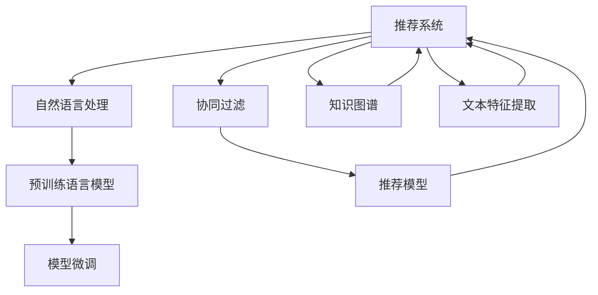

                 

# NLP技术在推荐系统的应用：大模型的潜力

> 关键词：推荐系统,自然语言处理,NLP,大模型,模型微调,深度学习,协同过滤,知识图谱,文本特征提取

## 1. 背景介绍

### 1.1 问题由来
随着互联网和电子商务的发展，推荐系统已成为提升用户体验和增加商业收入的重要工具。传统的推荐系统通常基于用户历史行为数据，采用协同过滤、内容推荐等算法进行个性化推荐。然而，随着用户行为数据的稀疏化，这些算法在推荐精度和多样性上遇到了瓶颈。

近年来，自然语言处理（NLP）技术在推荐系统中得到了广泛应用，尤其是在文本信息丰富的电商、新闻、娱乐等领域，通过NLP技术提取用户文本数据中的语义信息，进行更加精准的推荐，大幅提升了推荐效果。基于深度学习的预训练语言模型，如BERT、GPT等，已经在大规模推荐系统优化中发挥了重要作用。

本文聚焦于NLP技术在推荐系统中的应用，特别是大模型的潜力，介绍如何通过NLP技术进行推荐系统优化，包括基于预训练语言模型的推荐、基于用户意图和文本特征的推荐，以及如何将NLP技术与协同过滤等经典推荐算法结合。

## 2. 核心概念与联系

### 2.1 核心概念概述

为更好地理解NLP技术在推荐系统中的应用，本节将介绍几个密切相关的核心概念：

- **推荐系统（Recommendation System, RS）**：通过分析用户历史行为、商品属性等数据，为用户推荐符合其兴趣的商品、内容等信息。
- **自然语言处理（NLP）**：涉及文本数据的处理、分析和理解，包括文本分类、信息抽取、情感分析等任务。
- **预训练语言模型（Pre-trained Language Model, PLM）**：通过在大规模无标签文本数据上进行预训练，学习通用的语言表示，具备强大的语言理解和生成能力。
- **模型微调（Fine-tuning）**：在预训练模型的基础上，使用下游任务的少量标注数据，通过有监督学习优化模型在特定任务上的性能。
- **协同过滤（Collaborative Filtering, CF）**：根据用户历史行为或商品属性相似性，推荐用户未交互过的商品。
- **知识图谱（Knowledge Graph, KG）**：以图结构组织信息，帮助系统更好地理解实体之间的关系，如商品属性、用户特征等。
- **文本特征提取（Text Feature Extraction）**：从文本中提取有意义的特征向量，用于机器学习模型的训练。

这些核心概念之间的逻辑关系可以通过以下Mermaid流程图来展示：



这个流程图展示了几大核心概念之间的联系：

1. 推荐系统通过NLP技术进行优化。
2. 预训练语言模型提供通用的语言表示。
3. 模型微调进一步提升模型在推荐任务上的性能。
4. 协同过滤、知识图谱、文本特征提取等经典推荐技术可以与NLP技术结合，形成更加精准的推荐模型。

## 3. 核心算法原理 & 具体操作步骤
### 3.1 算法原理概述

NLP技术在推荐系统中的应用，主要基于预训练语言模型的推荐和基于用户意图和文本特征的推荐两种范式。

1. **基于预训练语言模型的推荐**：利用预训练语言模型对用户文本数据进行表示学习，然后通过优化推荐模型预测用户对商品的评分。
2. **基于用户意图和文本特征的推荐**：直接对用户文本数据进行特征提取和模型训练，或者结合用户意图进行推荐。

形式化地，假设推荐系统包含用户集合 $U$ 和商品集合 $I$，用户与商品之间的评分矩阵为 $R_{ui}$。给定用户 $u$ 对商品 $i$ 的评分 $r_{ui}$ 和用户描述 $x_u$，目标是通过预训练语言模型 $M_{\theta}$ 和推荐模型 $P_{\phi}$ 学习最优的模型参数 $\theta$ 和 $\phi$，使得推荐模型能够准确预测用户对商品的评分。

推荐系统的优化目标是最小化预测评分与真实评分之间的差距，即：

$$
\hat{\theta}, \hat{\phi} = \mathop{\arg\min}_{\theta, \phi} \sum_{u \in U} \sum_{i \in I} (R_{ui} - P_{\phi}(M_{\theta}(x_u), i))^2
$$

其中 $M_{\theta}(x_u)$ 为预训练语言模型对用户描述 $x_u$ 的表示向量，$P_{\phi}(\cdot, i)$ 为推荐模型的预测评分函数。

### 3.2 算法步骤详解

基于NLP的推荐系统主要包括以下几个关键步骤：

**Step 1: 准备预训练语言模型和数据集**
- 选择合适的预训练语言模型，如BERT、GPT等，作为初始化参数。
- 准备推荐系统的数据集，包括用户评分和用户描述。

**Step 2: 设计推荐模型**
- 设计推荐模型的架构，如基于矩阵分解的模型、深度神经网络模型等。
- 选择适合推荐任务的优化算法，如梯度下降、Adam等。

**Step 3: 预训练语言模型特征提取**
- 使用预训练语言模型对用户描述进行表示学习，得到用户文本特征向量。
- 选择合适的方法提取用户文本特征，如词向量、词袋模型等。

**Step 4: 模型微调**
- 将预训练语言模型的输出作为推荐模型的输入，优化推荐模型的参数。
- 在少量标注数据上进行微调，调整模型预测评分函数，使得推荐模型与预训练语言模型联合优化。

**Step 5: 测试和评估**
- 在测试集上评估推荐模型的效果，对比微调前后的性能提升。
- 使用推荐系统进行实际推荐，收集用户反馈和行为数据，进一步优化模型。

以上是基于NLP的推荐系统的一般流程。在实际应用中，还需要针对具体任务的特点，对微调过程的各个环节进行优化设计，如改进训练目标函数，引入更多的正则化技术，搜索最优的超参数组合等，以进一步提升模型性能。

### 3.3 算法优缺点

基于NLP技术的推荐系统具有以下优点：
1. 利用文本数据提升推荐精度：通过NLP技术提取用户文本数据中的语义信息，提升推荐系统对用户需求的理解。
2. 泛化能力强：预训练语言模型学习到了广泛的语义知识，可以应对不同领域的推荐任务。
3. 系统可解释性高：推荐模型的输出可以由用户意图和文本特征解释，便于理解和使用。

同时，该方法也存在一定的局限性：
1. 数据质量要求高：推荐模型的性能很大程度上取决于用户文本数据的质量和数量，获取高质量用户描述的成本较高。
2. 模型计算资源需求大：预训练语言模型和推荐模型通常需要较大的计算资源进行训练和推理。
3. 系统部署复杂：推荐系统需要与多种数据源、业务系统进行集成，部署和维护难度较高。
4. 用户隐私风险：用户文本数据的隐私保护是一个重要问题，需要采取相应的数据脱敏和安全措施。

尽管存在这些局限性，但就目前而言，基于NLP的推荐系统仍是大规模推荐系统优化的一个主流范式。未来相关研究的重点在于如何进一步降低推荐系统对用户描述数据的依赖，提高模型的鲁棒性和泛化能力，同时兼顾可解释性和用户隐私保护等因素。

### 3.4 算法应用领域

基于NLP技术的推荐系统已经在电商、新闻、娱乐等多个领域得到广泛应用，包括：

- **电商平台**：通过用户文本数据进行商品推荐，如亚马逊的推荐系统。
- **新闻平台**：利用用户评论和文章标题进行内容推荐，如今日头条的个性化新闻推荐。
- **在线视频平台**：通过用户评论和观影记录推荐视频内容，如Netflix的推荐系统。
- **社交平台**：根据用户文本数据和社交行为推荐内容，如微信朋友圈的内容推荐。

除了上述这些经典应用外，NLP技术也被创新性地应用到更多场景中，如个性化搜索、广告推荐、智能客服等，为推荐系统带来了新的突破。随着预训练语言模型和推荐方法的不断进步，相信推荐系统必将在更广阔的应用领域大放异彩。

## 4. 数学模型和公式 & 详细讲解  
### 4.1 数学模型构建

本节将使用数学语言对基于NLP技术的推荐系统进行更加严格的刻画。

假设推荐系统包含用户集合 $U$ 和商品集合 $I$，用户与商品之间的评分矩阵为 $R_{ui}$。给定用户 $u$ 对商品 $i$ 的评分 $r_{ui}$ 和用户描述 $x_u$，使用BERT等预训练语言模型对用户描述 $x_u$ 进行表示学习，得到用户文本特征向量 $h_u$。推荐模型的预测评分函数为 $P_{\phi}(h_u, i)$。推荐系统的优化目标是最小化预测评分与真实评分之间的差距，即：

$$
\hat{\theta}, \hat{\phi} = \mathop{\arg\min}_{\theta, \phi} \sum_{u \in U} \sum_{i \in I} (R_{ui} - P_{\phi}(M_{\theta}(x_u), i))^2
$$

其中 $M_{\theta}(x_u)$ 为BERT对用户描述 $x_u$ 的表示向量，$P_{\phi}(\cdot, i)$ 为推荐模型的预测评分函数。

### 4.2 公式推导过程

以下我们以基于BERT的推荐系统为例，推导推荐模型的损失函数及其梯度计算公式。

假设推荐模型的预测评分为 $\hat{r}_{ui} = P_{\phi}(h_u, i)$，则推荐系统的损失函数为：

$$
\mathcal{L}(\theta, \phi) = \frac{1}{N} \sum_{u \in U} \sum_{i \in I} (R_{ui} - \hat{r}_{ui})^2
$$

其中 $N$ 为用户数量。根据链式法则，损失函数对BERT模型参数 $\theta$ 的梯度为：

$$
\frac{\partial \mathcal{L}(\theta, \phi)}{\partial \theta} = -\frac{2}{N} \sum_{u \in U} \sum_{i \in I} (R_{ui} - \hat{r}_{ui})\frac{\partial P_{\phi}(M_{\theta}(x_u), i)}{\partial \theta}
$$

在得到损失函数的梯度后，即可带入参数更新公式，完成模型的迭代优化。重复上述过程直至收敛，最终得到适应推荐任务的最优模型参数 $\theta^*$ 和 $\phi^*$。

## 5. 项目实践：代码实例和详细解释说明
### 5.1 开发环境搭建

在进行推荐系统开发前，我们需要准备好开发环境。以下是使用Python进行PyTorch开发的环境配置流程：

1. 安装Anaconda：从官网下载并安装Anaconda，用于创建独立的Python环境。

2. 创建并激活虚拟环境：
```bash
conda create -n recsys-env python=3.8 
conda activate recsys-env
```

3. 安装PyTorch：根据CUDA版本，从官网获取对应的安装命令。例如：
```bash
conda install pytorch torchvision torchaudio cudatoolkit=11.1 -c pytorch -c conda-forge
```

4. 安装Transformers库：
```bash
pip install transformers
```

5. 安装各类工具包：
```bash
pip install numpy pandas scikit-learn matplotlib tqdm jupyter notebook ipython
```

完成上述步骤后，即可在`recsys-env`环境中开始推荐系统开发。

### 5.2 源代码详细实现

下面以电商平台商品推荐为例，给出使用Transformers库进行基于BERT的推荐系统微调的PyTorch代码实现。

首先，定义推荐系统的数据处理函数：

```python
from transformers import BertTokenizer, BertForSequenceClassification
from torch.utils.data import Dataset
import torch

class ProductDataset(Dataset):
    def __init__(self, products, texts, labels):
        self.products = products
        self.texts = texts
        self.labels = labels
        self.tokenizer = BertTokenizer.from_pretrained('bert-base-cased')
        self.max_len = 128
        
    def __len__(self):
        return len(self.texts)
    
    def __getitem__(self, item):
        product = self.products[item]
        text = self.texts[item]
        label = self.labels[item]
        
        encoding = self.tokenizer(text, return_tensors='pt', max_length=self.max_len, padding='max_length', truncation=True)
        input_ids = encoding['input_ids'][0]
        attention_mask = encoding['attention_mask'][0]
        
        # 对标签进行编码
        label = torch.tensor(label, dtype=torch.long)
        
        return {'product_id': product, 
                'input_ids': input_ids, 
                'attention_mask': attention_mask,
                'labels': label}

# 定义产品ID与标签的映射
label2id = {'POSITIVE': 1, 'NEGATIVE': 0}
id2label = {v: k for k, v in label2id.items()}

# 创建dataset
tokenizer = BertTokenizer.from_pretrained('bert-base-cased')

train_dataset = ProductDataset(train_products, train_texts, train_labels)
dev_dataset = ProductDataset(dev_products, dev_texts, dev_labels)
test_dataset = ProductDataset(test_products, test_texts, test_labels)
```

然后，定义模型和优化器：

```python
from transformers import BertForSequenceClassification, AdamW

model = BertForSequenceClassification.from_pretrained('bert-base-cased', num_labels=len(label2id))

optimizer = AdamW(model.parameters(), lr=2e-5)
```

接着，定义训练和评估函数：

```python
from torch.utils.data import DataLoader
from tqdm import tqdm
from sklearn.metrics import classification_report

device = torch.device('cuda') if torch.cuda.is_available() else torch.device('cpu')
model.to(device)

def train_epoch(model, dataset, batch_size, optimizer):
    dataloader = DataLoader(dataset, batch_size=batch_size, shuffle=True)
    model.train()
    epoch_loss = 0
    for batch in tqdm(dataloader, desc='Training'):
        product_id = batch['product_id'].to(device)
        input_ids = batch['input_ids'].to(device)
        attention_mask = batch['attention_mask'].to(device)
        labels = batch['labels'].to(device)
        model.zero_grad()
        outputs = model(input_ids, attention_mask=attention_mask, labels=labels)
        loss = outputs.loss
        epoch_loss += loss.item()
        loss.backward()
        optimizer.step()
    return epoch_loss / len(dataloader)

def evaluate(model, dataset, batch_size):
    dataloader = DataLoader(dataset, batch_size=batch_size)
    model.eval()
    preds, labels = [], []
    with torch.no_grad():
        for batch in tqdm(dataloader, desc='Evaluating'):
            product_id = batch['product_id'].to(device)
            input_ids = batch['input_ids'].to(device)
            attention_mask = batch['attention_mask'].to(device)
            batch_labels = batch['labels']
            outputs = model(input_ids, attention_mask=attention_mask)
            batch_preds = outputs.logits.argmax(dim=2).to('cpu').tolist()
            batch_labels = batch_labels.to('cpu').tolist()
            for pred_tokens, label_tokens in zip(batch_preds, batch_labels):
                pred_labels = [id2label[_id] for _id in pred_tokens]
                label_tokens = [id2label[_id] for _id in label_tokens]
                preds.append(pred_labels[:len(label_tokens)])
                labels.append(label_tokens)
                
    print(classification_report(labels, preds))
```

最后，启动训练流程并在测试集上评估：

```python
epochs = 5
batch_size = 16

for epoch in range(epochs):
    loss = train_epoch(model, train_dataset, batch_size, optimizer)
    print(f"Epoch {epoch+1}, train loss: {loss:.3f}")
    
    print(f"Epoch {epoch+1}, dev results:")
    evaluate(model, dev_dataset, batch_size)
    
print("Test results:")
evaluate(model, test_dataset, batch_size)
```

以上就是使用PyTorch对基于BERT的商品推荐系统进行微调的完整代码实现。可以看到，得益于Transformers库的强大封装，我们可以用相对简洁的代码完成BERT模型的加载和微调。

### 5.3 代码解读与分析

让我们再详细解读一下关键代码的实现细节：

**ProductDataset类**：
- `__init__`方法：初始化产品ID、用户文本、标签等关键组件。
- `__len__`方法：返回数据集的样本数量。
- `__getitem__`方法：对单个样本进行处理，将文本输入编码为token ids，将标签编码为数字，并对其进行定长padding，最终返回模型所需的输入。

**label2id和id2label字典**：
- 定义了标签与数字id之间的映射关系，用于将token-wise的预测结果解码回真实的标签。

**训练和评估函数**：
- 使用PyTorch的DataLoader对数据集进行批次化加载，供模型训练和推理使用。
- 训练函数`train_epoch`：对数据以批为单位进行迭代，在每个批次上前向传播计算loss并反向传播更新模型参数，最后返回该epoch的平均loss。
- 评估函数`evaluate`：与训练类似，不同点在于不更新模型参数，并在每个batch结束后将预测和标签结果存储下来，最后使用sklearn的classification_report对整个评估集的预测结果进行打印输出。

**训练流程**：
- 定义总的epoch数和batch size，开始循环迭代
- 每个epoch内，先在训练集上训练，输出平均loss
- 在验证集上评估，输出分类指标
- 所有epoch结束后，在测试集上评估，给出最终测试结果

可以看到，PyTorch配合Transformers库使得BERT微调的代码实现变得简洁高效。开发者可以将更多精力放在数据处理、模型改进等高层逻辑上，而不必过多关注底层的实现细节。

当然，工业级的系统实现还需考虑更多因素，如模型的保存和部署、超参数的自动搜索、更灵活的任务适配层等。但核心的微调范式基本与此类似。

## 6. 实际应用场景
### 6.1 电商平台推荐

基于预训练语言模型的推荐系统已经在电商领域得到了广泛应用。用户对商品的评价、评论、用户画像等文本数据，可以提供丰富的语义信息，有助于提升推荐系统的精准度和个性化程度。

例如，亚马逊在推荐系统中引入了BERT模型，通过对用户评论和商品描述进行表示学习，学习用户对商品的需求和兴趣。在推荐商品时，将用户的评论和商品描述作为输入，经过BERT编码后，得到用户对商品的评分预测，从而优化推荐模型的输出。

### 6.2 新闻平台推荐

新闻平台需要根据用户的浏览行为和文本数据，为用户推荐感兴趣的新闻内容。BERT等预训练语言模型可以提取用户评论和文章标题的语义信息，从而推荐用户感兴趣的新闻。

例如，今日头条利用BERT模型对用户评论和新闻标题进行表示学习，学习用户对新闻的兴趣。通过优化推荐模型，预测用户对新闻的兴趣程度，从而为用户推荐新闻内容。

### 6.3 视频平台推荐

在线视频平台需要根据用户的观影记录和文本数据，为用户推荐感兴趣的视频内容。BERT等预训练语言模型可以提取用户评论和视频描述的语义信息，从而推荐用户感兴趣的视频。

例如，Netflix利用BERT模型对用户评论和视频描述进行表示学习，学习用户对视频的兴趣。通过优化推荐模型，预测用户对视频的兴趣程度，从而为用户推荐视频内容。

### 6.4 未来应用展望

随着预训练语言模型和推荐方法的不断进步，基于NLP技术的推荐系统必将在更广阔的应用领域大放异彩。

在智慧医疗领域，基于BERT等预训练语言模型的推荐系统可以用于医生推荐、疾病预测等应用，提高医疗服务的智能化水平。

在智能教育领域，推荐系统可以根据学生的文本数据和行为数据，推荐适合的教材、作业和课程，因材施教，提升教育效果。

在智慧城市治理中，推荐系统可以用于城市事件监测、舆情分析等环节，提高城市管理的自动化和智能化水平，构建更安全、高效的未来城市。

此外，在企业生产、社会治理、文娱传媒等众多领域，基于NLP技术的推荐系统也将不断涌现，为传统行业数字化转型升级提供新的技术路径。相信随着技术的日益成熟，NLP技术将成为推荐系统优化的一个重要范式，推动推荐系统向更加精准、高效、智能的方向发展。

## 7. 工具和资源推荐
### 7.1 学习资源推荐

为了帮助开发者系统掌握NLP技术在推荐系统中的应用，这里推荐一些优质的学习资源：

1. 《深度学习与推荐系统》书籍：全面介绍了深度学习在推荐系统中的应用，包括NLP、协同过滤、知识图谱等推荐技术。

2. CS246《机器学习》课程：斯坦福大学开设的经典课程，涵盖机器学习的基本概念和算法，包括回归、分类、聚类等任务。

3. 《推荐系统实践》博文系列：深度推荐系统专家撰写，深入浅出地介绍了推荐系统的设计原理和实践技巧，涵盖NLP等前沿技术。

4. Coursera《自然语言处理与深度学习》课程：由斯坦福大学和Google合作开设，全面介绍了自然语言处理和深度学习的基本概念和技术。

5. arXiv.org：机器学习和推荐系统的顶级学术期刊，提供最新的研究方向和论文，是研究前沿技术的必读资料。

通过对这些资源的学习实践，相信你一定能够快速掌握NLP技术在推荐系统中的应用，并用于解决实际的推荐问题。
###  7.2 开发工具推荐

高效的开发离不开优秀的工具支持。以下是几款用于NLP推荐系统开发的常用工具：

1. PyTorch：基于Python的开源深度学习框架，灵活动态的计算图，适合快速迭代研究。大部分预训练语言模型都有PyTorch版本的实现。

2. TensorFlow：由Google主导开发的开源深度学习框架，生产部署方便，适合大规模工程应用。同样有丰富的预训练语言模型资源。

3. Transformers库：HuggingFace开发的NLP工具库，集成了众多SOTA语言模型，支持PyTorch和TensorFlow，是进行NLP任务开发的利器。

4. Weights & Biases：模型训练的实验跟踪工具，可以记录和可视化模型训练过程中的各项指标，方便对比和调优。与主流深度学习框架无缝集成。

5. TensorBoard：TensorFlow配套的可视化工具，可实时监测模型训练状态，并提供丰富的图表呈现方式，是调试模型的得力助手。

6. Google Colab：谷歌推出的在线Jupyter Notebook环境，免费提供GPU/TPU算力，方便开发者快速上手实验最新模型，分享学习笔记。

合理利用这些工具，可以显著提升NLP推荐系统的开发效率，加快创新迭代的步伐。

### 7.3 相关论文推荐

NLP技术在推荐系统中的应用源于学界的持续研究。以下是几篇奠基性的相关论文，推荐阅读：

1. Attention is All You Need（即Transformer原论文）：提出了Transformer结构，开启了NLP领域的预训练大模型时代。

2. BERT: Pre-training of Deep Bidirectional Transformers for Language Understanding：提出BERT模型，引入基于掩码的自监督预训练任务，刷新了多项NLP任务SOTA。

3. A Survey on Deep Learning for Recommendation Systems（综述论文）：全面介绍了深度学习在推荐系统中的应用，包括NLP、协同过滤、知识图谱等推荐技术。

4. Convolutional Neural Networks for Natural Language Processing（卷积神经网络在NLP中的应用）：提出了基于卷积神经网络进行NLP任务处理的范式。

5. Sequence-to-Sequence Learning with Neural Networks（序列到序列学习）：提出了基于RNN和CNN的序列建模方法，用于文本生成、机器翻译等任务。

这些论文代表了大模型在推荐系统中的应用方向。通过学习这些前沿成果，可以帮助研究者把握学科前进方向，激发更多的创新灵感。

## 8. 总结：未来发展趋势与挑战
### 8.1 总结

本文对基于NLP技术的推荐系统进行了全面系统的介绍。首先阐述了NLP技术在推荐系统中的应用背景和意义，明确了预训练语言模型和推荐系统的优化目标。其次，从原理到实践，详细讲解了NLP推荐系统的数学模型和关键算法，给出了推荐系统开发的完整代码实例。同时，本文还广泛探讨了NLP技术在电商、新闻、视频等多个领域的应用前景，展示了NLP技术在推荐系统中的广泛适用性。

通过本文的系统梳理，可以看到，基于NLP技术的推荐系统已经在大规模推荐系统优化中发挥了重要作用，带来了显著的推荐效果和用户满意度提升。未来，随着NLP技术的不断发展，基于预训练语言模型的推荐系统必将在更多领域大放异彩，推动推荐系统向更加精准、高效、智能的方向发展。

### 8.2 未来发展趋势

展望未来，基于NLP技术的推荐系统将呈现以下几个发展趋势：

1. **多模态融合**：推荐系统将结合文本、图像、视频等多模态数据，提升对用户需求的理解。多模态数据的融合，将进一步提升推荐系统的智能化水平。

2. **知识图谱应用**：推荐系统将更多地利用知识图谱中的实体关系，优化推荐模型的训练。通过将知识图谱与推荐模型联合学习，推荐系统将更全面地理解用户需求和商品属性。

3. **个性化推荐**：推荐系统将根据用户的个性化需求和行为数据，进行更加精准的推荐。基于NLP的个性化推荐，将进一步提升用户的满意度和平台的用户粘性。

4. **实时推荐**：推荐系统将实现实时推荐，提升用户体验和平台的活跃度。实时推荐技术，将对推荐系统提出更高的计算要求，需要进一步优化模型和算法。

5. **跨领域推荐**：推荐系统将跨越不同领域和平台，为用户提供更加多样化和全面的推荐服务。跨领域推荐技术，将提升推荐系统的普适性和用户覆盖面。

以上趋势凸显了NLP技术在推荐系统中的重要价值。这些方向的探索发展，必将进一步提升推荐系统的性能和应用范围，为用户的数字化生活带来更多的便利和享受。

### 8.3 面临的挑战

尽管基于NLP技术的推荐系统已经取得了显著进展，但在迈向更加智能化、普适化应用的过程中，仍面临诸多挑战：

1. **数据质量问题**：推荐系统依赖于用户行为和文本数据，数据的噪声和偏差将影响推荐效果。如何清洗和标注数据，提升数据质量，是一个重要挑战。

2. **模型计算资源**：预训练语言模型和推荐模型通常需要较大的计算资源进行训练和推理。如何在有限的计算资源下，实现高效的模型训练和推理，是一个重要的研究方向。

3. **用户隐私保护**：用户文本数据的隐私保护是一个重要问题，需要采取相应的数据脱敏和安全措施，确保用户隐私不被泄露。

4. **系统部署复杂**：推荐系统需要与多种数据源、业务系统进行集成，部署和维护难度较高。如何构建简单易用的推荐系统，是一个重要的挑战。

5. **模型解释性**：推荐模型的输出往往难以解释，用户无法理解推荐结果的生成机制。如何增强推荐系统的可解释性，提高用户信任度，是一个重要研究方向。

6. **跨领域知识融合**：不同领域的数据和知识具有差异性，推荐系统需要能够融合不同领域的数据，才能实现跨领域的推荐。

这些挑战需要我们进一步探索和优化推荐系统的各个环节，推动NLP技术在推荐系统中的应用落地和普及。相信随着技术的不断进步和学术研究的深入，这些挑战必将逐步被克服，NLP技术将为推荐系统带来更多的创新和突破。

### 8.4 研究展望

面对NLP推荐系统所面临的挑战，未来的研究需要在以下几个方面寻求新的突破：

1. **跨领域推荐**：结合知识图谱和语义信息，实现跨领域的推荐。通过多模态融合和跨领域知识图谱，提升推荐系统的普适性和多样性。

2. **推荐系统优化算法**：开发更加高效的推荐算法，提升推荐系统的实时性和精准性。如基于深度强化学习的推荐算法，可以实现更加动态的推荐策略。

3. **用户行为预测**：利用用户行为数据进行预测，提升推荐系统的预见性。通过行为建模和预测，可以优化推荐策略，提升推荐效果。

4. **推荐系统评估方法**：开发新的推荐系统评估指标，全面评估推荐系统的性能和效果。通过更加全面和客观的评估方法，可以发现推荐系统的问题和不足，推动推荐系统的改进。

5. **推荐系统安全性**：建立推荐系统的安全机制，确保推荐系统的鲁棒性和安全性。通过安全机制的设计，可以避免推荐系统的滥用和误用。

这些研究方向的探索，必将引领NLP推荐系统向更加精准、高效、智能的方向发展，推动推荐系统在更多领域的落地应用。

## 9. 附录：常见问题与解答

**Q1：基于NLP的推荐系统是否适用于所有推荐任务？**

A: 基于NLP的推荐系统在大多数推荐任务上都能取得不错的效果，特别是对于数据量较小的任务。但对于一些特定领域的任务，如医学、法律等，仅仅依靠通用语料预训练的模型可能难以很好地适应。此时需要在特定领域语料上进一步预训练，再进行微调，才能获得理想效果。此外，对于一些需要时效性、个性化很强的任务，如对话、推荐等，微调方法也需要针对性的改进优化。

**Q2：如何选择合适的学习率？**

A: 基于NLP的推荐系统的学习率通常需要根据具体的任务和数据集进行调整。一般来说，初始学习率可以从0.001开始，逐渐减小到0.0001。此外，可以使用warmup策略，在开始阶段使用较小的学习率，再逐渐过渡到预设值。不同的优化器（如AdamW、Adafactor等）以及不同的学习率调度策略，可能需要设置不同的学习率阈值。

**Q3：数据质量对推荐系统的影响有多大？**

A: 数据质量对推荐系统的影响非常大。推荐系统依赖于用户行为和文本数据，数据的噪声和偏差将影响推荐效果。如何清洗和标注数据，提升数据质量，是一个重要挑战。数据质量问题的解决，将直接提升推荐系统的精准度和个性化程度。

**Q4：推荐系统的可解释性如何提升？**

A: 推荐系统的可解释性可以通过引入解释性算法和模型解释工具来实现。如LIME、SHAP等算法可以用于生成模型预测的局部解释，帮助用户理解推荐结果的生成机制。同时，可以结合用户行为数据，构建推荐系统的可视化界面，提升用户的信任度和满意度。

**Q5：如何优化推荐系统的计算资源需求？**

A: 优化推荐系统的计算资源需求需要从多个方面入手。如使用轻量级模型、压缩模型、模型剪枝等方法可以减小模型大小，提升推理速度。同时，可以采用分布式训练和推理，优化资源配置，提升系统的实时性和可扩展性。

这些问题的解答，将有助于开发者更好地理解和应用NLP技术在推荐系统中的价值，提升推荐系统的性能和用户体验。

---

作者：禅与计算机程序设计艺术 / Zen and the Art of Computer Programming

