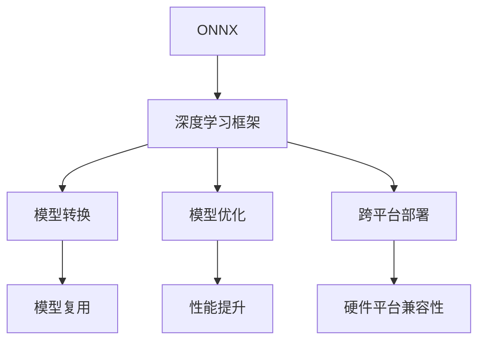

                 

# ONNX：开放式神经网络交换格式

> 关键词：ONNX, 神经网络, 模型转换, 模型优化, 跨平台部署, 深度学习, 计算机视觉, 自然语言处理, 边缘计算

## 1. 背景介绍

### 1.1 问题由来

在深度学习领域，模型训练和部署是两大核心环节。随着模型的不断扩展和应用场景的日益丰富，不同框架之间的模型转换和跨平台部署需求日益增长。然而，现有的深度学习框架大多采用框架特定的格式进行模型存储和推理，导致模型在迁移和复用时面临诸多障碍。

### 1.2 问题核心关键点

为了解决这一问题，ONNX（Open Neural Network eXchange Format）应运而生。ONNX是一种开放的标准化神经网络模型交换格式，旨在促进深度学习模型的跨框架、跨平台互操作性，降低模型迁移和部署成本。

### 1.3 问题研究意义

ONNX不仅推动了深度学习模型的标准化和互操作性，还为模型优化、部署效率提升、边缘计算等领域带来了深远影响。通过统一模型格式，ONNX实现了：
1. 模型可移植性：支持在多种深度学习框架之间迁移模型。
2. 模型兼容性和可扩展性：提供丰富的操作支持，便于模型扩展。
3. 模型优化：通过优化工具提高模型性能和推理速度。
4. 跨平台部署：支持CPU、GPU、FPGA等多种硬件平台。

## 2. 核心概念与联系

### 2.1 核心概念概述

为更好地理解ONNX，本节将介绍几个关键概念：

- **ONNX**：一种开放的标准化神经网络模型交换格式，支持跨框架、跨平台互操作性。
- **深度学习框架**：如TensorFlow、PyTorch、MXNet等，提供了丰富的操作支持，方便模型开发。
- **模型转换**：将一种框架下的模型转换为另一种框架下的模型，支持模型迁移和复用。
- **模型优化**：通过优化工具提高模型性能和推理速度。
- **跨平台部署**：支持CPU、GPU、FPGA等多种硬件平台。

这些概念之间的逻辑关系可以通过以下Mermaid流程图来展示：



这个流程图展示了ONNX与其他深度学习技术和应用场景的联系：

1. ONNX作为模型交换格式，支持多种深度学习框架之间的互操作。
2. 模型转换功能使得模型在框架之间迁移复用更加便捷。
3. 模型优化工具提高模型性能和推理速度，进一步提升应用效率。
4. 跨平台部署能力使模型能够运行在多种硬件平台，增强了应用的灵活性。

## 3. 核心算法原理 & 具体操作步骤
### 3.1 算法原理概述

ONNX的核心思想是提供一种通用的模型表示，使得不同框架下的模型能够无损转换，并通过优化工具和部署工具提升模型性能和部署灵活性。

### 3.2 算法步骤详解

**Step 1: 准备模型**

- 选择一个深度学习框架，使用该框架训练模型。
- 导出模型为ONNX格式，生成ONNX模型文件。

**Step 2: 模型转换**

- 使用ONNX模型转换工具（如ONNX Convertor）将模型文件转换为其他框架支持的格式。
- 根据目标框架的模型结构，手动调整模型结构，适配目标框架的操作。

**Step 3: 模型优化**

- 使用模型优化工具（如ONNX Runtime、ONNX-TensorFlow）进行模型优化。
- 优化目标包括模型大小、推理速度、内存占用等。

**Step 4: 跨平台部署**

- 选择目标硬件平台（如CPU、GPU、FPGA），适配相应的部署工具（如ONNX Runtime、ONNX-MXNet）。
- 在目标硬件上部署模型，进行推理测试。

### 3.3 算法优缺点

ONNX的优势在于：

1. **跨平台互操作性**：支持多种深度学习框架，便于模型迁移复用。
2. **标准化模型表示**：统一了模型格式，提升了模型互操作性。
3. **模型优化能力**：提供了优化工具，提高了模型性能和推理速度。
4. **跨平台部署**：支持多种硬件平台，增强了模型应用的灵活性。

然而，ONNX也存在一些局限：

1. **模型复杂度**：ONNX模型较大，增加了模型迁移和部署的复杂度。
2. **操作支持**：部分高级操作在ONNX中不支持，需要手动适配。
3. **工具依赖**：依赖ONNX工具链，增加了开发成本。
4. **性能损失**：转换和优化过程中可能引入性能损失。

### 3.4 算法应用领域

ONNX在深度学习模型开发和部署过程中，可以应用于以下几个主要领域：

- **跨框架模型迁移**：将一个框架下的模型迁移到另一个框架下，支持模型复用。
- **模型优化**：使用ONNX Runtime等工具，对模型进行量化、剪枝等优化，提高模型性能。
- **跨平台部署**：在CPU、GPU、FPGA等多种硬件平台上部署模型，提升应用灵活性。
- **模型可视化**：使用ONNX Model Zoo等工具，可视化模型结构和推理过程，便于调试和优化。

## 4. 数学模型和公式 & 详细讲解  
### 4.1 数学模型构建

ONNX模型由多个节点组成，每个节点表示一种深度学习操作。节点之间的连接表示数据流。ONNX模型可以使用以下数学公式表示：

$$
\text{Model} = \{\text{Node}_1, \text{Node}_2, ..., \text{Node}_n\}
$$

每个节点可以表示为：

$$
\text{Node}_i = (X_i, W_i, b_i, \text{Op}, \text{Attrs})
$$

其中，$X_i$ 为输入张量，$W_i$ 和 $b_i$ 为模型参数，$\text{Op}$ 为操作符，$\text{Attrs}$ 为操作参数。

### 4.2 公式推导过程

以卷积操作为例，ONNX卷积节点的参数包括输入张量、卷积核张量、偏置向量、输出张量、填充、步幅、组数等。卷积操作的数学公式如下：

$$
Y_{i,j,k} = \sum_{c=0}^{C} \sum_{p=-\frac{P}{2}}^{\frac{P}{2}} \sum_{q=-\frac{S}{2}}^{\frac{S}{2}} (X_{i+p,j+q,k_c} \cdot W_{c,i,j,k}) + b_{k}
$$

其中，$P$ 为填充大小，$S$ 为步幅，$C$ 为组数，$k_c$ 为卷积核通道。

### 4.3 案例分析与讲解

假设我们要将一个使用TensorFlow框架训练的模型转换为ONNX格式，并在GPU上部署。首先，使用TensorFlow的`tf.onnx.export`函数导出ONNX模型，生成模型文件。然后使用ONNX Convertor工具将模型文件转换为MXNet格式，适配MXNet的操作符。最后，使用MXNet的`mxnet.mod`文件在GPU上部署模型。

## 5. 项目实践：代码实例和详细解释说明
### 5.1 开发环境搭建

在进行ONNX实践前，我们需要准备好开发环境。以下是使用Python进行ONNX开发的环境配置流程：

1. 安装Anaconda：从官网下载并安装Anaconda，用于创建独立的Python环境。

2. 创建并激活虚拟环境：
```bash
conda create -n onnx-env python=3.8 
conda activate onnx-env
```

3. 安装ONNX、MXNet等库：
```bash
pip install onnx mxnet
```

4. 安装TensorFlow：
```bash
pip install tensorflow
```

完成上述步骤后，即可在`onnx-env`环境中开始ONNX实践。

### 5.2 源代码详细实现

下面我们以一个简单的卷积神经网络（CNN）为例，给出使用ONNX进行模型转换的PyTorch代码实现。

首先，定义卷积神经网络模型：

```python
import torch
import torch.nn as nn
import torch.onnx

class CNN(nn.Module):
    def __init__(self):
        super(CNN, self).__init__()
        self.conv1 = nn.Conv2d(3, 32, 3, 1, 1)
        self.conv2 = nn.Conv2d(32, 64, 3, 1, 1)
        self.fc1 = nn.Linear(9216, 128)
        self.fc2 = nn.Linear(128, 10)
    
    def forward(self, x):
        x = F.relu(self.conv1(x))
        x = F.max_pool2d(x, 2)
        x = F.relu(self.conv2(x))
        x = F.max_pool2d(x, 2)
        x = x.view(-1, 9216)
        x = F.relu(self.fc1(x))
        x = self.fc2(x)
        return x
```

然后，将模型转换为ONNX格式：

```python
model = CNN()
model.eval()
onnx = torch.onnx.export(model, input_tensor, "model.onnx")
```

最后，在MXNet上部署模型：

```python
import mxnet as mx

# 加载模型
model = mx.mod.Module(symbol=onnx, context=mx.gpu(0))

# 加载数据
data = mx.io.ImageRecordIter(path_imgrec='train.rec', preprocessing_names=['image'], label_names=['label'], batch_size=32)

# 推理测试
model.bind(data)
model.forward(data)
```

以上就是一个简单的卷积神经网络模型转换为ONNX并在MXNet上部署的完整代码实现。可以看到，ONNX提供的统一模型格式，使得模型在不同框架之间的迁移和复用变得简单高效。

### 5.3 代码解读与分析

让我们再详细解读一下关键代码的实现细节：

**定义CNN模型**：
- 继承`nn.Module`类，定义卷积、池化、全连接等操作。
- 使用`nn.Conv2d`定义卷积层，`nn.Linear`定义全连接层。

**模型转换为ONNX**：
- 使用`torch.onnx.export`函数，指定输入张量和输出文件名，生成ONNX模型文件。
- 通过`onnx`文件，可以使用MXNet等框架进行模型部署和推理。

**MXNet部署模型**：
- 使用`mx.mod.Module`加载MXNet的模型文件。
- 使用`mx.io.ImageRecordIter`加载数据集，并设置预处理步骤。
- 使用`model.bind`绑定数据集，`model.forward`进行推理测试。

可以看到，ONNX提供了完整的模型转换工具链，使得模型迁移和部署变得更加高效和便捷。开发者可以更加专注于模型设计本身，而不必过多关注转换细节。

当然，工业级的系统实现还需考虑更多因素，如模型的保存和部署、超参数的自动搜索、更灵活的操作适配等。但核心的模型转换范式基本与此类似。

## 6. 实际应用场景
### 6.1 工业制造

在工业制造领域，深度学习模型被广泛应用于质量检测、预测维护、工艺优化等环节。然而，不同厂商的深度学习框架和模型结构差异较大，使得模型在部署和迁移时面临诸多挑战。通过使用ONNX，工厂可以快速将现有模型部署到新的生产线，提升生产效率和产品质量。

具体而言，可以将质量检测模型转换为ONNX格式，并使用MXNet在边缘设备上部署，实现实时质量检测。通过ONNX模型的跨框架互操作性，不同厂商可以共享和复用质量检测模型，避免重复开发。

### 6.2 智能医疗

在智能医疗领域，深度学习模型被广泛应用于疾病诊断、影像分析、治疗方案推荐等环节。然而，不同医院和诊所的深度学习框架和模型结构差异较大，使得模型在部署和迁移时面临诸多挑战。通过使用ONNX，医院可以快速将现有模型部署到新的诊所，提升医疗服务效率。

具体而言，可以将影像分析模型转换为ONNX格式，并使用TensorFlow在本地服务器上部署，实现实时影像分析。通过ONNX模型的跨平台互操作性，不同诊所可以共享和复用影像分析模型，提升医疗诊断的准确性和一致性。

### 6.3 智慧城市

在智慧城市治理中，深度学习模型被广泛应用于城市事件监测、交通管理、安全防范等环节。然而，不同城市的深度学习框架和模型结构差异较大，使得模型在部署和迁移时面临诸多挑战。通过使用ONNX，城市可以快速将现有模型部署到新的区域，提升城市管理效率。

具体而言，可以将城市事件监测模型转换为ONNX格式，并使用ONNX Runtime在边缘设备上部署，实现实时事件监测。通过ONNX模型的跨平台互操作性，不同城市可以共享和复用事件监测模型，提升城市事件响应的及时性和准确性。

### 6.4 未来应用展望

随着深度学习模型的不断扩展和应用场景的日益丰富，ONNX在跨框架、跨平台互操作性方面将发挥越来越重要的作用。未来的发展方向可能包括：

1. **模型压缩和优化**：进一步提升ONNX模型的压缩率和推理速度，降低硬件资源消耗。
2. **模型可视化工具**：提供更强大的模型可视化工具，帮助开发者更好地理解和调试模型。
3. **跨框架互操作性提升**：支持更多深度学习框架，提升模型互操作性。
4. **自动化模型适配**：提供更灵活的模型适配工具，减少手工适配的工作量。
5. **边缘计算支持**：在边缘设备上支持更多的硬件平台，提升模型部署的灵活性。

这些方向将进一步推动深度学习模型的标准化和互操作性，使得模型在更多场景下得到应用，推动人工智能技术的产业化进程。

## 7. 工具和资源推荐
### 7.1 学习资源推荐

为了帮助开发者系统掌握ONNX的理论基础和实践技巧，这里推荐一些优质的学习资源：

1. **ONNX官方文档**：包含ONNX的详细介绍、操作符说明和示例代码，是学习ONNX的必备资料。
2. **MXNet官方文档**：MXNet是ONNX的重要支持框架之一，提供了丰富的模型转换和部署示例。
3. **TensorFlow官方文档**：TensorFlow是另一重要深度学习框架，提供了详细的模型转换和优化指南。
4. **ONNX-TensorFlow**：提供了从TensorFlow模型转换为ONNX的详细指南，适合TensorFlow用户使用。
5. **ONNX Runtime**：提供了模型优化和推理加速的工具，适合ONNX模型的部署和优化。

通过对这些资源的学习实践，相信你一定能够快速掌握ONNX的基本原理和应用技巧，并用于解决实际的模型迁移和部署问题。

### 7.2 开发工具推荐

高效的开发离不开优秀的工具支持。以下是几款用于ONNX开发的常用工具：

1. **ONNX Convertor**：提供了丰富的模型转换功能，支持多种深度学习框架之间的互操作。
2. **ONNX Runtime**：提供了模型优化和推理加速的功能，适合ONNX模型的部署和优化。
3. **ONNX Model Zoo**：提供了各种深度学习模型的ONNX转换和可视化功能，便于开发者调试和优化。
4. **MXNet**：提供了MXNet模型的ONNX转换和部署功能，支持多种硬件平台。
5. **TensorFlow**：提供了TensorFlow模型的ONNX转换和优化功能，支持多种硬件平台。

合理利用这些工具，可以显著提升深度学习模型在跨框架、跨平台互操作性方面的开发效率，加快模型部署和优化过程。

### 7.3 相关论文推荐

ONNX技术的发展源于学界的持续研究。以下是几篇奠基性的相关论文，推荐阅读：

1. **ONNX: Flexible Computation for Scalable Neural Network Models**：介绍了ONNX的灵活计算特性，支持多种硬件平台的模型部署。
2. **Optimizing ONNX Models with Multiple Factor-Based Strategies**：提供了多种优化策略，提升ONNX模型的推理速度和推理准确性。
3. **TensorFlow Serving with ONNX**：介绍了TensorFlow Serving与ONNX的结合使用，支持ONNX模型的推理服务。
4. **ONNX: A Large-Scale Framework for Deep Neural Networks**：介绍了ONNX的大规模模型部署和推理优化。
5. **ONNX: A Lightweight and Flexible Inference Library**：介绍了ONNX的轻量级设计，支持多硬件平台的模型部署和优化。

这些论文代表了大规模模型标准化和互操作性的发展脉络。通过学习这些前沿成果，可以帮助研究者把握学科前进方向，激发更多的创新灵感。

## 8. 总结：未来发展趋势与挑战

### 8.1 总结

本文对ONNX开放式神经网络交换格式进行了全面系统的介绍。首先阐述了ONNX的发展背景和研究意义，明确了ONNX在促进深度学习模型互操作性和标准化方面的独特价值。其次，从原理到实践，详细讲解了ONNX的数学模型和操作符，给出了模型转换和优化的完整代码实例。同时，本文还广泛探讨了ONNX在工业制造、智能医疗、智慧城市等众多行业领域的应用前景，展示了ONNX的广阔前景。此外，本文精选了ONNX的学习资源和工具链，力求为读者提供全方位的技术指引。

通过本文的系统梳理，可以看到，ONNX开放式神经网络交换格式在促进深度学习模型标准化和互操作性方面具有重要的地位，为模型迁移和复用提供了强有力的支持。未来，伴随深度学习模型的不断扩展和应用场景的日益丰富，ONNX将在更多领域发挥其重要作用，推动人工智能技术的产业化进程。

### 8.2 未来发展趋势

展望未来，ONNX的发展趋势可能包括：

1. **模型压缩和优化**：进一步提升ONNX模型的压缩率和推理速度，降低硬件资源消耗。
2. **模型可视化工具**：提供更强大的模型可视化工具，帮助开发者更好地理解和调试模型。
3. **跨框架互操作性提升**：支持更多深度学习框架，提升模型互操作性。
4. **自动化模型适配**：提供更灵活的模型适配工具，减少手工适配的工作量。
5. **边缘计算支持**：在边缘设备上支持更多的硬件平台，提升模型部署的灵活性。

这些方向将进一步推动深度学习模型的标准化和互操作性，使得模型在更多场景下得到应用，推动人工智能技术的产业化进程。

### 8.3 面临的挑战

尽管ONNX在促进深度学习模型标准化和互操作性方面取得了一定的进展，但在迈向更加智能化、普适化应用的过程中，它仍面临着诸多挑战：

1. **模型复杂度**：ONNX模型较大，增加了模型迁移和部署的复杂度。
2. **操作支持**：部分高级操作在ONNX中不支持，需要手动适配。
3. **工具依赖**：依赖ONNX工具链，增加了开发成本。
4. **性能损失**：转换和优化过程中可能引入性能损失。

### 8.4 研究展望

面对ONNX面临的这些挑战，未来的研究需要在以下几个方面寻求新的突破：

1. **优化模型压缩算法**：开发更高效的模型压缩算法，提升ONNX模型的压缩率和推理速度。
2. **增强操作支持**：在ONNX中添加更多的高级操作，提升操作支持能力。
3. **优化工具链**：提供更灵活的工具链，支持多种深度学习框架的模型转换和优化。
4. **提升模型可视化能力**：提供更强大的模型可视化工具，帮助开发者更好地理解和调试模型。
5. **增强跨平台互操作性**：支持更多硬件平台，提升模型互操作性。

这些研究方向的探索，将引领ONNX开放式神经网络交换格式进一步发展，为深度学习模型的标准化和互操作性提供强有力的支持。面向未来，ONNX技术将与更多人工智能技术进行更深入的融合，共同推动自然语言理解和智能交互系统的进步。

## 9. 附录：常见问题与解答

**Q1：ONNX是否支持所有深度学习框架？**

A: ONNX目前支持多种深度学习框架，如TensorFlow、PyTorch、MXNet等。但部分高级操作在ONNX中仍未完全支持，需要手动适配。

**Q2：ONNX模型的优化有哪些方式？**

A: ONNX模型的优化方式包括模型压缩、剪枝、量化等。可以使用ONNX Runtime、ONNX-TensorFlow等工具进行优化。

**Q3：ONNX模型在不同硬件平台上的部署有何差异？**

A: ONNX模型在不同硬件平台上的部署可能会有性能差异。需要在目标平台上进行优化，如使用ONNX Runtime进行推理加速，选择适合的硬件平台和优化策略。

**Q4：ONNX模型的推理速度如何？**

A: ONNX模型的推理速度取决于多种因素，如模型大小、硬件平台、优化程度等。通过模型压缩、剪枝等优化手段，可以提高模型的推理速度和推理准确性。

**Q5：ONNX模型如何从TensorFlow转换为MXNet？**

A: 可以使用ONNX Convertor工具进行模型转换。具体步骤如下：
1. 使用TensorFlow训练模型，保存为TensorFlow Serving格式。
2. 使用ONNX Convertor工具将TensorFlow Serving格式转换为ONNX格式。
3. 使用MXNet将ONNX模型部署到目标平台。

这些工具和资源推荐，将帮助开发者更好地掌握ONNX的基本原理和应用技巧，推动深度学习模型的标准化和互操作性。面向未来，ONNX将为深度学习模型的部署和优化提供强有力的支持，推动人工智能技术的产业化进程。

---

作者：禅与计算机程序设计艺术 / Zen and the Art of Computer Programming

