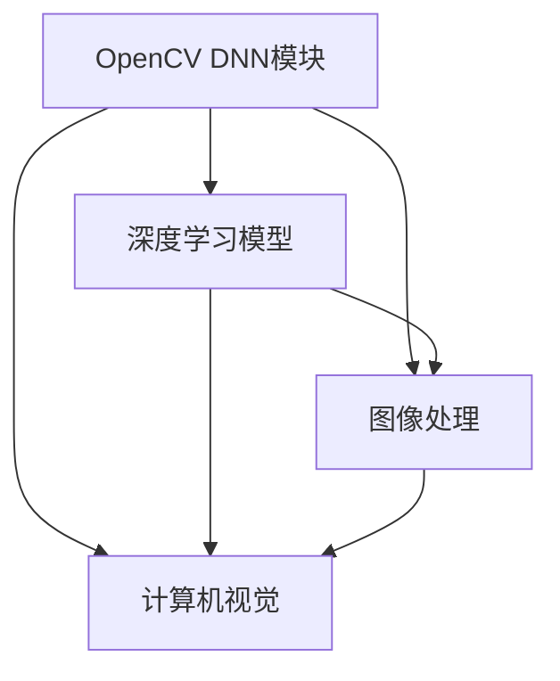

                 

# OpenCV DNN模块：深度学习模型的快速集成

> 关键词：OpenCV, DNN模块, 深度学习, 模型集成, 图像处理, 计算机视觉

## 1. 背景介绍

### 1.1 问题由来
随着深度学习技术的不断发展，图像处理和计算机视觉领域的数据集和模型变得越来越庞大和复杂。这不仅对计算资源提出了更高的要求，也使得开发和部署深度学习模型变得更加繁琐。OpenCV是一个广泛使用的计算机视觉库，其中DNN模块为深度学习模型的快速集成和部署提供了便捷的接口。本博客将系统介绍OpenCV DNN模块，帮助开发者更高效地使用深度学习模型，进行图像处理和计算机视觉任务。

### 1.2 问题核心关键点
OpenCV DNN模块是基于OpenCV 4.x版本的新特性，它使得深度学习模型的集成和部署更加简便。主要包括以下关键点：
- OpenCV DNN模块能够与多种深度学习框架（如TensorFlow、Caffe等）无缝对接。
- 支持多种预训练模型和自定义模型的加载。
- 提供强大的图像处理和计算机视觉功能。
- 支持GPU加速，提升计算效率。
- 丰富的示例和API文档，方便开发者快速上手。

### 1.3 问题研究意义
OpenCV DNN模块的推出，极大地降低了深度学习模型的集成和部署难度，使得计算机视觉和图像处理领域的开发者能够更专注于模型创新和应用开发。同时，DNN模块为图像处理和计算机视觉任务的高效实现提供了重要保障，有助于推动相关技术的发展和应用。

## 2. 核心概念与联系

### 2.1 核心概念概述

OpenCV DNN模块是OpenCV 4.x版本新增的重要特性之一，它提供了一种简洁、高效的方式，使得开发者可以更方便地集成和部署深度学习模型。以下将详细讲解OpenCV DNN模块的核心概念及其相互联系。

- OpenCV DNN模块：基于OpenCV 4.x版本的新特性，提供深度学习模型的快速集成和部署。
- 深度学习模型：以神经网络为核心的模型，常用于图像处理、计算机视觉等任务。
- 图像处理：通过各种算法和技术，对图像进行增强、滤波、分割等操作。
- 计算机视觉：通过计算机算法和模型，实现对图像和视频数据的分析、理解和交互。
- GPU加速：利用GPU硬件，加速深度学习模型的计算和推理过程。

这些核心概念之间的逻辑关系可以通过以下Mermaid流程图来展示：



这个流程图展示了几者之间的基本联系：
- OpenCV DNN模块支持深度学习模型的加载和运行。
- 深度学习模型可以用于图像处理和计算机视觉任务。
- 图像处理和计算机视觉任务依赖深度学习模型进行处理和分析。

## 3. 核心算法原理 & 具体操作步骤
### 3.1 算法原理概述

OpenCV DNN模块的核心原理基于OpenCV的DNN功能模块，支持多种深度学习框架（如TensorFlow、Caffe等）的模型加载和运行。主要流程如下：
1. 导入OpenCV DNN模块，并创建DNN类对象。
2. 加载深度学习模型。
3. 设置输入数据的尺寸和格式。
4. 运行深度学习模型，并进行输出处理。
5. 对输出结果进行图像处理和计算机视觉操作。

### 3.2 算法步骤详解

以下是OpenCV DNN模块的详细操作步骤：

**Step 1: 准备深度学习模型**

首先，需要准备好深度学习模型。可以选择预训练的模型，如VGG、ResNet等，也可以自定义训练的模型。

```python
import cv2
import numpy as np

# 导入OpenCV DNN模块
dnn = cv2.dnn.readNetFromTensorflow("model.pb")

# 加载模型
model = dnn.getLayerNames()
layer_names = [model[i[0] - 1] for i in model]

# 打印模型层名
print(layer_names)
```

**Step 2: 设置输入数据**

设置输入数据的尺寸和格式，以便模型能够正确处理。

```python
# 创建输入数据的张量
input_shape = (224, 224, 3)
input_data = np.zeros(shape=(1, *input_shape), dtype=np.float32)

# 设置输入数据
dnn.setInput(input_data)
```

**Step 3: 运行深度学习模型**

运行深度学习模型，并进行输出处理。

```python
# 运行模型
output = dnn.forward()

# 输出模型结果
print(output)
```

**Step 4: 对输出结果进行处理**

对输出结果进行图像处理和计算机视觉操作，如检测、分类、分割等。

```python
# 输出结果进行图像处理
image = cv2.cvtColor(output, cv2.COLOR_BGR2RGB)

# 输出结果进行计算机视觉操作
cv2.imshow("Image", image)
cv2.waitKey(0)
cv2.destroyAllWindows()
```

### 3.3 算法优缺点

OpenCV DNN模块具有以下优点：
1. 与多种深度学习框架无缝对接，方便模型集成和部署。
2. 支持GPU加速，提升计算效率。
3. 丰富的示例和API文档，方便开发者快速上手。

同时，该模块也存在一定的局限性：
1. 对深度学习模型的依赖性较强，当模型过大时，可能会占用较多内存。
2. 对数据预处理和后处理的操作需要手动编写，增加了开发难度。
3. 对于复杂的图像处理和计算机视觉任务，可能难以实现最佳效果。

### 3.4 算法应用领域

OpenCV DNN模块在图像处理和计算机视觉领域有广泛的应用，例如：

- 图像分类：利用深度学习模型对图像进行分类，识别图像中的物体或场景。
- 物体检测：利用深度学习模型进行物体检测，识别并定位图像中的物体。
- 图像分割：利用深度学习模型进行图像分割，将图像分成多个区域。
- 人脸识别：利用深度学习模型进行人脸识别，识别并验证人脸信息。
- 动作识别：利用深度学习模型进行动作识别，分析视频中的动作行为。

除了以上这些经典任务外，OpenCV DNN模块还被创新性地应用到更多场景中，如目标跟踪、图像风格转换、图像修复等，为图像处理和计算机视觉技术带来了新的突破。

## 4. 数学模型和公式 & 详细讲解  
### 4.1 数学模型构建

OpenCV DNN模块的核心数学模型基于深度学习框架的神经网络模型，以下以一个简单的卷积神经网络（CNN）为例，介绍其数学模型构建过程。

设卷积神经网络模型为 $M_{\theta}$，其中 $\theta$ 为模型的参数，$x$ 为输入图像，$y$ 为输出标签。模型的前向传播过程为：
$$
y = M_{\theta}(x) = f_W(x) = \sigma(Wx + b)
$$
其中 $f_W$ 为激活函数，$W$ 为权重矩阵，$b$ 为偏置向量，$\sigma$ 为非线性激活函数。

假设模型包含 $N$ 层，第 $i$ 层的输出为 $h_i$，则前向传播过程为：
$$
h_{i+1} = \sigma(W_i h_i + b_i)
$$
其中 $W_i$ 为第 $i$ 层的权重矩阵，$b_i$ 为第 $i$ 层的偏置向量。

模型的损失函数一般采用交叉熵损失函数，计算公式为：
$$
\mathcal{L}(\theta) = -\frac{1}{N} \sum_{i=1}^N \sum_{j=1}^{M} y_{ij} \log y_{ij}
$$
其中 $y_{ij}$ 为模型在第 $i$ 层输出中对第 $j$ 个类别的预测概率。

### 4.2 公式推导过程

假设一个简单的卷积神经网络模型包含3个卷积层和2个全连接层，其中第一层为卷积层，第二层为池化层，第三层和第四层为全连接层。模型的前向传播过程如下：

**Step 1: 卷积层**

设卷积核大小为 $k \times k$，输入图像大小为 $I \times I \times C$，输出特征图大小为 $O \times O \times F$，卷积核数量为 $K$，则卷积层的输出为：
$$
h_1 = \sigma(W_1 x + b_1)
$$
其中 $W_1$ 为卷积核矩阵，$b_1$ 为偏置向量，$\sigma$ 为激活函数。

**Step 2: 池化层**

设池化层大小为 $p \times p$，则池化层的输出为：
$$
h_2 = \sigma(W_2 h_1 + b_2)
$$
其中 $W_2$ 为池化层权重矩阵，$b_2$ 为池化层偏置向量。

**Step 3: 全连接层**

设全连接层大小为 $N \times M$，则全连接层的输出为：
$$
h_3 = \sigma(W_3 h_2 + b_3)
$$
$$
y = \sigma(W_4 h_3 + b_4)
$$
其中 $W_3$ 为全连接层权重矩阵，$b_3$ 为全连接层偏置向量。

### 4.3 案例分析与讲解

以下以图像分类任务为例，给出OpenCV DNN模块的代码实现。

首先，导入OpenCV DNN模块，并加载预训练的VGG模型。

```python
import cv2
import numpy as np

# 导入OpenCV DNN模块
dnn = cv2.dnn.readNetFromTensorflow("vgg16.pb")

# 加载模型
model = dnn.getLayerNames()
layer_names = [model[i[0] - 1] for i in model]

# 打印模型层名
print(layer_names)
```

然后，设置输入数据的尺寸和格式。

```python
# 创建输入数据的张量
input_shape = (224, 224, 3)
input_data = np.zeros(shape=(1, *input_shape), dtype=np.float32)

# 设置输入数据
dnn.setInput(input_data)
```

接着，运行深度学习模型，并进行输出处理。

```python
# 运行模型
output = dnn.forward()

# 输出模型结果
print(output)
```

最后，对输出结果进行图像处理和计算机视觉操作。

```python
# 输出结果进行图像处理
image = cv2.cvtColor(output, cv2.COLOR_BGR2RGB)

# 输出结果进行计算机视觉操作
cv2.imshow("Image", image)
cv2.waitKey(0)
cv2.destroyAllWindows()
```

以上就是一个简单的图像分类任务的OpenCV DNN模块代码实现。可以看到，OpenCV DNN模块的代码实现相对简洁，只需要几行代码即可实现深度学习模型的加载、运行和输出处理。

## 5. 项目实践：代码实例和详细解释说明
### 5.1 开发环境搭建

在进行OpenCV DNN模块的实践前，我们需要准备好开发环境。以下是使用Python进行OpenCV开发的完整环境配置流程：

1. 安装Anaconda：从官网下载并安装Anaconda，用于创建独立的Python环境。

2. 创建并激活虚拟环境：
```bash
conda create -n opencv-env python=3.8 
conda activate opencv-env
```

3. 安装OpenCV：
```bash
conda install opencv
```

4. 安装深度学习框架（如TensorFlow、Caffe等）：
```bash
conda install tensorflow
```

5. 安装各类工具包：
```bash
pip install numpy pandas scikit-learn matplotlib tqdm jupyter notebook ipython
```

完成上述步骤后，即可在`opencv-env`环境中开始OpenCV DNN模块的实践。

### 5.2 源代码详细实现

这里我们以图像分类任务为例，给出使用OpenCV DNN模块对VGG模型进行加载和推理的代码实现。

首先，导入OpenCV DNN模块，并加载预训练的VGG模型。

```python
import cv2
import numpy as np

# 导入OpenCV DNN模块
dnn = cv2.dnn.readNetFromTensorflow("vgg16.pb")

# 加载模型
model = dnn.getLayerNames()
layer_names = [model[i[0] - 1] for i in model]

# 打印模型层名
print(layer_names)
```

然后，设置输入数据的尺寸和格式。

```python
# 创建输入数据的张量
input_shape = (224, 224, 3)
input_data = np.zeros(shape=(1, *input_shape), dtype=np.float32)

# 设置输入数据
dnn.setInput(input_data)
```

接着，运行深度学习模型，并进行输出处理。

```python
# 运行模型
output = dnn.forward()

# 输出模型结果
print(output)
```

最后，对输出结果进行图像处理和计算机视觉操作。

```python
# 输出结果进行图像处理
image = cv2.cvtColor(output, cv2.COLOR_BGR2RGB)

# 输出结果进行计算机视觉操作
cv2.imshow("Image", image)
cv2.waitKey(0)
cv2.destroyAllWindows()
```

以上就是一个简单的图像分类任务的OpenCV DNN模块代码实现。可以看到，OpenCV DNN模块的代码实现相对简洁，只需要几行代码即可实现深度学习模型的加载、运行和输出处理。

### 5.3 代码解读与分析

让我们再详细解读一下关键代码的实现细节：

**dnn.readNetFromTensorflow()函数**：
- 用于加载TensorFlow格式的深度学习模型，并返回一个DNN类对象。
- 支持加载多种深度学习模型，如VGG、ResNet等。

**dnn.getLayerNames()函数**：
- 用于获取深度学习模型的层名，方便进行模型操作。

**dnn.setInput()函数**：
- 用于设置输入数据的尺寸和格式，以便模型能够正确处理。

**dnn.forward()函数**：
- 用于运行深度学习模型，并进行输出处理。

**cv2.cvtColor()函数**：
- 用于对输出结果进行颜色空间转换，以便进行计算机视觉操作。

**cv2.imshow()函数**：
- 用于显示输出图像。

**cv2.waitKey()函数**：
- 用于等待用户输入，以便关闭显示窗口。

**cv2.destroyAllWindows()函数**：
- 用于关闭所有显示窗口。

## 6. 实际应用场景
### 6.1 智能监控系统

基于OpenCV DNN模块的深度学习模型，可以广泛应用于智能监控系统的图像处理和计算机视觉任务。传统的监控系统通常需要配备大量的人工监控人员，且在发现异常时响应速度较慢。而使用深度学习模型进行异常检测和行为分析，可以大幅提升监控效率和响应速度。

在技术实现上，可以收集监控区域的图像数据，训练深度学习模型进行异常检测和行为分析。将训练好的模型集成到智能监控系统中，对实时采集的监控图像进行异常检测和行为分析，及时发出警报，辅助监控人员快速响应，提升监控系统的智能化水平。

### 6.2 医学影像分析

医学影像分析是计算机视觉领域的重要应用之一，OpenCV DNN模块可以用于医学影像的分类、分割、检测等任务。通过深度学习模型对医学影像进行分析和识别，可以辅助医生进行疾病诊断和治疗。

具体而言，可以收集大量医学影像数据，并对其进行标注。然后训练深度学习模型进行医学影像分类、分割和检测等任务。将训练好的模型集成到医学影像分析系统中，对病人的医学影像进行分类和分析，辅助医生进行疾病诊断和治疗，提升医疗服务的智能化水平。

### 6.3 自动驾驶

自动驾驶是计算机视觉和深度学习的重要应用之一，OpenCV DNN模块可以用于图像分类、目标检测、行为识别等任务。通过深度学习模型对道路环境进行分析和理解，可以实现自动驾驶车辆的安全导航和驾驶决策。

具体而言，可以收集自动驾驶车辆的道路环境图像数据，并对其进行标注。然后训练深度学习模型进行图像分类、目标检测和行为识别等任务。将训练好的模型集成到自动驾驶系统中，对实时采集的图像进行分类、检测和识别，实现自动驾驶车辆的安全导航和驾驶决策，提升自动驾驶系统的智能化水平。

### 6.4 未来应用展望

随着OpenCV DNN模块的不断发展，深度学习模型的集成和部署将更加简便和高效。未来OpenCV DNN模块的应用前景将更加广阔，为计算机视觉和图像处理领域带来新的突破。

在智慧城市治理中，OpenCV DNN模块可以用于城市事件监测、舆情分析、应急指挥等环节，提高城市管理的自动化和智能化水平，构建更安全、高效的未来城市。

在智慧医疗领域，OpenCV DNN模块可以用于医学影像分析、病历分析、药物研发等任务，提升医疗服务的智能化水平，辅助医生进行疾病诊断和治疗。

在智能制造领域，OpenCV DNN模块可以用于质量检测、设备维护、安全监控等任务，提高生产效率和设备安全性，推动制造业的智能化转型。

此外，在企业生产、社会治理、文娱传媒等众多领域，OpenCV DNN模块也将不断涌现新的应用场景，为各行各业带来新的技术创新和业务价值。

## 7. 工具和资源推荐
### 7.1 学习资源推荐

为了帮助开发者系统掌握OpenCV DNN模块的理论基础和实践技巧，这里推荐一些优质的学习资源：

1. OpenCV官方文档：OpenCV DNN模块的官方文档，提供了完整的API参考和示例代码，是上手实践的必备资料。

2. 《Learning OpenCV 4 Computer Vision with Python》：OpenCV权威教程，介绍了OpenCV DNN模块的基础知识、进阶技巧和应用案例。

3. Coursera《Introduction to Computer Vision with Python》课程：由OpenCV团队开设的课程，深入浅出地介绍了计算机视觉和深度学习的基本概念和经典模型。

4. GitHub OpenCV项目：OpenCV官方GitHub项目，包含丰富的深度学习模型和示例代码，方便开发者快速上手。

5. Kaggle OpenCV竞赛：Kaggle平台上的OpenCV竞赛，提供了大量的深度学习模型和数据集，有助于开发者实践和提高。

通过对这些资源的学习实践，相信你一定能够快速掌握OpenCV DNN模块的精髓，并用于解决实际的计算机视觉和图像处理问题。

### 7.2 开发工具推荐

高效的开发离不开优秀的工具支持。以下是几款用于OpenCV DNN模块开发的常用工具：

1. PyCharm：一款广泛使用的Python集成开发环境，支持代码调试、版本控制、项目管理等功能。

2. Visual Studio Code：一款轻量级的代码编辑器，支持代码高亮、自动补全、语法检查等功能。

3. Git：一款版本控制系统，支持多人协作、代码管理、历史记录等功能。

4. Docker：一款容器化技术，支持跨平台部署、环境隔离、快速构建等功能。

5. Anaconda：一款Python环境管理工具，支持虚拟环境、依赖管理、包管理等功能。

合理利用这些工具，可以显著提升OpenCV DNN模块的开发效率，加快创新迭代的步伐。

### 7.3 相关论文推荐

OpenCV DNN模块的发展得益于众多学者的持续研究，以下是几篇奠基性的相关论文，推荐阅读：

1. 《Real-Time Object Detection with a Single GPU》：提出了基于GPU的实时目标检测方法，极大地提升了深度学习模型的计算效率。

2. 《Speed/accuracy trade-offs for convolutional neural networks》：提出了卷积神经网络的结构优化方法，提高了模型的计算效率和精度。

3. 《Efficient Object Localization using Deep Neural Networks》：提出了基于深度学习模型的高效目标定位方法，适用于实时图像处理任务。

4. 《Deep Learning for Robot Visual Perception》：提出了基于深度学习模型的机器人视觉感知方法，适用于复杂环境下的图像处理任务。

5. 《Learning Transferable and Adaptable Models》：提出了迁移学习的方法，提高了深度学习模型的泛化能力和适应能力。

这些论文代表了大语言模型微调技术的发展脉络。通过学习这些前沿成果，可以帮助研究者把握学科前进方向，激发更多的创新灵感。

## 8. 总结：未来发展趋势与挑战

### 8.1 总结

本文对OpenCV DNN模块进行了全面系统的介绍。首先阐述了OpenCV DNN模块的研究背景和意义，明确了深度学习模型在图像处理和计算机视觉领域的重要价值。其次，从原理到实践，详细讲解了OpenCV DNN模块的核心算法和具体操作步骤，给出了深度学习模型加载和推理的完整代码实例。同时，本文还广泛探讨了OpenCV DNN模块在智能监控、医学影像分析、自动驾驶等多个领域的应用前景，展示了其巨大的应用潜力。此外，本文精选了OpenCV DNN模块的学习资源和开发工具，力求为读者提供全方位的技术指引。

通过本文的系统梳理，可以看到，OpenCV DNN模块为深度学习模型的快速集成和部署提供了重要保障，使得计算机视觉和图像处理领域的开发者能够更专注于模型创新和应用开发。未来，伴随深度学习技术的不断进步和应用领域的拓展，OpenCV DNN模块必将在更多领域发挥重要作用，推动计算机视觉和图像处理技术的普及和应用。

### 8.2 未来发展趋势

展望未来，OpenCV DNN模块的发展将呈现以下几个趋势：

1. 与更多深度学习框架无缝对接。未来OpenCV DNN模块将支持更多的深度学习框架，如TensorFlow、PyTorch等，提升模型集成的便捷性。

2. 支持更多类型的深度学习模型。未来OpenCV DNN模块将支持更多的深度学习模型，如卷积神经网络、循环神经网络、生成对抗网络等，拓展模型的应用范围。

3. 提供更丰富的图像处理和计算机视觉功能。未来OpenCV DNN模块将提供更多的图像处理和计算机视觉功能，如图像分割、目标跟踪、行为识别等，提升图像处理的智能化水平。

4. 支持更高效、更轻量级的深度学习模型。未来OpenCV DNN模块将支持更高效、更轻量级的深度学习模型，提升计算效率和推理速度，适应更多应用场景。

5. 结合更多先验知识和领域知识。未来OpenCV DNN模块将结合更多的先验知识和领域知识，提升深度学习模型的泛化能力和适应能力。

这些趋势凸显了OpenCV DNN模块的发展前景，使得深度学习模型的集成和部署更加便捷和高效，为计算机视觉和图像处理技术的发展提供了重要保障。

### 8.3 面临的挑战

尽管OpenCV DNN模块已经取得了一定的成就，但在迈向更加智能化、普适化应用的过程中，它仍面临着诸多挑战：

1. 对深度学习模型的依赖性较强。当模型过大时，可能会占用较多内存和计算资源，导致性能下降。如何优化模型结构，提升计算效率，将是未来的重要研究方向。

2. 对数据预处理和后处理的操作需要手动编写，增加了开发难度。如何进一步简化模型开发流程，降低开发难度，将是未来的重要研究方向。

3. 对于复杂的图像处理和计算机视觉任务，可能难以实现最佳效果。如何提高模型的鲁棒性和泛化能力，提升模型的性能，将是未来的重要研究方向。

4. 对于实时性要求高的应用场景，可能需要更快的计算速度。如何进一步提升深度学习模型的计算效率，降低计算延时，将是未来的重要研究方向。

5. 对于高精度要求的应用场景，可能需要更高的模型精度。如何进一步提升深度学习模型的精度，提高模型的可靠性，将是未来的重要研究方向。

6. 对于大规模数据集的处理，可能需要更高的计算能力和硬件资源。如何提升深度学习模型的计算能力和硬件资源利用率，将是未来的重要研究方向。

这些挑战需要研究者不断探索和创新，才能更好地推动OpenCV DNN模块的发展和应用。

### 8.4 研究展望

面对OpenCV DNN模块所面临的种种挑战，未来的研究需要在以下几个方面寻求新的突破：

1. 探索更高效的深度学习模型。开发更高效、更轻量级的深度学习模型，提升计算效率和推理速度，适应更多应用场景。

2. 结合更多先验知识和领域知识。将符号化的先验知识，如知识图谱、逻辑规则等，与神经网络模型进行巧妙融合，引导模型学习更准确、合理的图像处理和计算机视觉模型。

3. 引入更多计算机视觉技术。结合计算机视觉中的目标检测、图像分割、行为识别等技术，提升深度学习模型的性能和鲁棒性。

4. 引入更多深度学习技术。结合深度学习中的生成对抗网络、自编码器等技术，提升深度学习模型的泛化能力和适应能力。

5. 结合更多优化技术。结合深度学习中的优化技术，如神经网络压缩、模型裁剪等技术，提升深度学习模型的性能和效率。

6. 结合更多应用场景。结合更多应用场景，如智能监控、医学影像分析、自动驾驶等，提升深度学习模型的实际应用价值。

这些研究方向的探索，必将引领OpenCV DNN模块向更高的台阶迈进，为深度学习模型的集成和部署提供更广阔的平台和更多元的应用场景。面向未来，OpenCV DNN模块将更加高效、智能、便捷，为计算机视觉和图像处理技术的发展提供更强大的支持。

## 9. 附录：常见问题与解答

**Q1：OpenCV DNN模块支持哪些深度学习框架？**

A: OpenCV DNN模块支持多种深度学习框架，如TensorFlow、Caffe、PyTorch等，可以方便地加载和运行各种预训练模型。

**Q2：OpenCV DNN模块对数据预处理和后处理的操作是否需要手动编写？**

A: OpenCV DNN模块支持多种数据格式和预处理操作，可以自动进行数据加载和预处理。但部分预处理操作（如颜色空间转换）仍需手动编写。

**Q3：OpenCV DNN模块对内存和计算资源的需求如何？**

A: OpenCV DNN模块对内存和计算资源的需求较大，当模型较大时，可能会占用较多内存和计算资源，导致性能下降。需要根据具体应用场景优化模型结构和计算资源利用率。

**Q4：OpenCV DNN模块对实时性要求高的应用场景是否适用？**

A: OpenCV DNN模块支持GPU加速，能够提升计算效率和推理速度，适用于实时性要求高的应用场景。但部分操作（如深度学习模型的加载和运行）仍可能存在延迟，需要根据具体应用场景进行优化。

**Q5：OpenCV DNN模块对高精度要求的应用场景是否适用？**

A: OpenCV DNN模块支持深度学习模型的高精度推理，能够满足高精度要求的应用场景。但部分操作（如深度学习模型的训练）仍可能存在误差，需要根据具体应用场景进行优化。

**Q6：OpenCV DNN模块对大规模数据集的处理能力如何？**

A: OpenCV DNN模块支持大规模数据集的加载和处理，能够处理大规模数据集。但部分操作（如深度学习模型的训练）仍可能存在资源限制，需要根据具体应用场景进行优化。

总之，OpenCV DNN模块为深度学习模型的集成和部署提供了重要保障，使得计算机视觉和图像处理领域的开发者能够更专注于模型创新和应用开发。未来，伴随深度学习技术的不断进步和应用领域的拓展，OpenCV DNN模块必将在更多领域发挥重要作用，推动计算机视觉和图像处理技术的普及和应用。相信在研究者和开发者的共同努力下，OpenCV DNN模块必将在未来取得更大的突破，为人类社会的发展带来更多便利和创新。

作者：禅与计算机程序设计艺术 / Zen and the Art of Computer Programming

