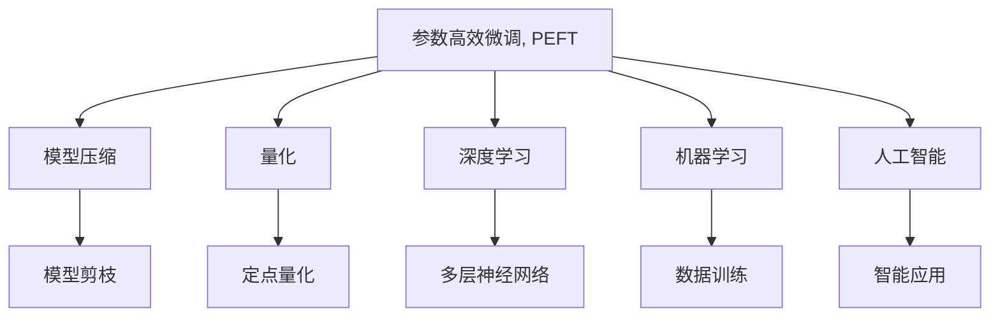

                 

# PEFT：性能和效率的平衡

> 关键词：参数高效微调,PEFT,模型压缩,量化,深度学习,机器学习,人工智能

## 1. 背景介绍

### 1.1 问题由来
近年来，深度学习技术在各个领域得到了广泛应用。然而，随着模型参数量的不断增加，模型的计算和存储成本也随之增长，限制了其在实际应用中的普及和部署。特别是对于资源有限的移动设备、嵌入式系统等场景，传统的深度学习模型往往难以满足实时性、低延迟、低功耗的要求。为了解决这一问题，研究者提出了参数高效微调（Parameter-Efficient Fine-Tuning, PEFT）的概念，即在模型微调过程中，只更新小部分参数，而保持大部分预训练权重不变，从而提高模型的性能和效率，实现参数的高效利用。

### 1.2 问题核心关键点
PEFT是深度学习领域的一个重要研究方向，其核心思想是在微调过程中，通过只更新小部分参数来优化模型，从而实现性能和效率的平衡。PEFT方法可以显著降低微调过程中所需的计算和存储空间，同时还能保证模型的性能。目前，PEFT已经成为深度学习应用中的重要技术，广泛应用于图像分类、自然语言处理、语音识别等领域。

### 1.3 问题研究意义
研究PEFT方法，对于降低深度学习模型的计算和存储成本，提升模型在资源受限环境中的部署能力，具有重要意义。具体来说，PEFT方法可以：

1. 降低微调成本。PEFT方法只更新小部分参数，减少了微调过程中所需的计算资源。
2. 提高模型的实时性。PEFT方法通过减少模型的计算量，加速模型的推理过程，满足实时性的要求。
3. 提升模型的鲁棒性。PEFT方法保留了大部分预训练权重，保留了模型的泛化能力和鲁棒性。
4. 支持轻量化模型。PEFT方法可以开发出轻量化模型，适用于移动设备和嵌入式系统。

## 2. 核心概念与联系

### 2.1 核心概念概述

为了更好地理解PEFT方法，我们首先介绍几个密切相关的核心概念：

- 参数高效微调(Parameter-Efficient Fine-Tuning, PEFT)：指在微调过程中，只更新小部分模型参数，而保持大部分预训练权重不变，以提高模型的性能和效率。
- 模型压缩(Model Compression)：指通过模型剪枝、量化等技术，减少模型的参数量和计算量，从而提高模型在计算资源有限环境中的性能。
- 量化(Quantization)：指将浮点模型转化为定点模型，以降低模型参数和计算量，提高计算效率。
- 深度学习(Deep Learning)：指通过多层神经网络进行学习，以解决复杂问题，包括图像分类、语音识别、自然语言处理等。
- 机器学习(Machine Learning)：指通过数据和算法进行训练，使计算机具备自主学习的能力，包括监督学习、无监督学习、半监督学习等。
- 人工智能(Artificial Intelligence)：指通过算法和数据训练计算机具备类似于人类的智能，包括认知智能、感知智能等。

这些核心概念之间的逻辑关系可以通过以下Mermaid流程图来展示：



这个流程图展示了大语言模型的核心概念及其之间的关系：

1. PEFT通过只更新小部分参数，减少模型的计算量，提高模型的实时性和效率。
2. 模型压缩通过剪枝和量化等技术，进一步减小模型参数和计算量，适合资源受限环境。
3. 深度学习通过多层神经网络进行训练，解决复杂问题，具有强大的表达能力。
4. 机器学习通过数据和算法训练模型，使计算机具备自主学习能力。
5. 人工智能通过算法和数据训练计算机具备类似于人类的智能。

## 3. 核心算法原理 & 具体操作步骤
### 3.1 算法原理概述

PEFT方法的核心思想是在微调过程中，只更新小部分模型参数，而保持大部分预训练权重不变。这种微调方式可以显著降低微调过程中所需的计算和存储空间，同时还能保证模型的性能。PEFT方法通常包括以下几个关键步骤：

- 准备预训练模型和数据集
- 添加任务适配层
- 设置微调超参数
- 执行梯度训练
- 测试和部署

### 3.2 算法步骤详解

以下是PEFT方法的详细操作步骤：

**Step 1: 准备预训练模型和数据集**
- 选择合适的预训练模型 $M_{\theta}$ 作为初始化参数，如 BERT、GPT 等。
- 准备下游任务 $T$ 的标注数据集 $D=\{(x_i, y_i)\}_{i=1}^N$，划分为训练集、验证集和测试集。一般要求标注数据与预训练数据的分布不要差异过大。

**Step 2: 添加任务适配层**
- 根据任务类型，在预训练模型顶层设计合适的输出层和损失函数。
- 对于分类任务，通常在顶层添加线性分类器和交叉熵损失函数。
- 对于生成任务，通常使用语言模型的解码器输出概率分布，并以负对数似然为损失函数。

**Step 3: 设置微调超参数**
- 选择合适的优化算法及其参数，如 AdamW、SGD 等，设置学习率、批大小、迭代轮数等。
- 设置正则化技术及强度，包括权重衰减、Dropout、Early Stopping 等。
- 确定冻结预训练参数的策略，如仅微调顶层，或全部参数都参与微调。

**Step 4: 执行梯度训练**
- 将训练集数据分批次输入模型，前向传播计算损失函数。
- 反向传播计算参数梯度，根据设定的优化算法和学习率更新模型参数。
- 周期性在验证集上评估模型性能，根据性能指标决定是否触发 Early Stopping。
- 重复上述步骤直到满足预设的迭代轮数或 Early Stopping 条件。

**Step 5: 测试和部署**
- 在测试集上评估微调后模型 $M_{\hat{\theta}}$ 的性能，对比微调前后的精度提升。
- 使用微调后的模型对新样本进行推理预测，集成到实际的应用系统中。
- 持续收集新的数据，定期重新微调模型，以适应数据分布的变化。

以上是PEFT方法的详细操作步骤。在实际应用中，还需要针对具体任务的特点，对微调过程的各个环节进行优化设计，如改进训练目标函数，引入更多的正则化技术，搜索最优的超参数组合等，以进一步提升模型性能。

### 3.3 算法优缺点

PEFT方法具有以下优点：
1. 降低微调成本。PEFT方法只更新小部分参数，减少了微调过程中所需的计算资源。
2. 提高模型的实时性。PEFT方法通过减少模型的计算量，加速模型的推理过程，满足实时性的要求。
3. 提升模型的鲁棒性。PEFT方法保留了大部分预训练权重，保留了模型的泛化能力和鲁棒性。
4. 支持轻量化模型。PEFT方法可以开发出轻量化模型，适用于移动设备和嵌入式系统。

同时，PEFT方法也存在一定的局限性：
1. 需要较强的目标函数设计能力。PEFT方法需要选择合适的目标函数，才能保证微调过程的收敛性和稳定性。
2. 微调效果可能不如全参数微调。PEFT方法在微调过程中，更新参数较少，可能导致模型性能不如全参数微调。
3. 需要大量的验证集。PEFT方法需要定期在验证集上评估模型性能，需要占用大量的计算资源。

尽管存在这些局限性，但就目前而言，PEFT方法仍是深度学习应用中的重要技术，广泛应用于图像分类、自然语言处理、语音识别等领域。未来相关研究的重点在于如何进一步降低微调对计算资源的依赖，提高模型的少样本学习和跨领域迁移能力，同时兼顾可解释性和伦理安全性等因素。

### 3.4 算法应用领域

PEFT方法在深度学习领域已经得到了广泛的应用，覆盖了几乎所有常见任务，例如：

- 图像分类：如 ImageNet 上的物体识别、图像分类等任务。通过微调使模型学习图像-类别映射。
- 自然语言处理：如情感分析、文本分类、命名实体识别等任务。通过微调使模型学习文本-标签映射。
- 语音识别：如语音命令识别、语音情感分析等任务。通过微调使模型学习语音-文本映射。
- 推荐系统：如协同过滤、基于内容的推荐等任务。通过微调使模型学习物品-用户映射。
- 计算机视觉：如目标检测、语义分割等任务。通过微调使模型学习图像-目标映射。

除了上述这些经典任务外，PEFT方法也被创新性地应用到更多场景中，如可控文本生成、常识推理、代码生成、数据增强等，为深度学习技术带来了全新的突破。随着预训练模型和微调方法的不断进步，相信深度学习技术将在更广阔的应用领域大放异彩。

## 4. 数学模型和公式 & 详细讲解 & 举例说明

### 4.1 数学模型构建

本节将使用数学语言对参数高效微调过程进行更加严格的刻画。

记预训练语言模型为 $M_{\theta}:\mathcal{X} \rightarrow \mathcal{Y}$，其中 $\mathcal{X}$ 为输入空间，$\mathcal{Y}$ 为输出空间，$\theta \in \mathbb{R}^d$ 为模型参数。假设微调任务的训练集为 $D=\{(x_i,y_i)\}_{i=1}^N$，其中 $x_i \in \mathcal{X}, y_i \in \mathcal{Y}$。

定义模型 $M_{\theta}$ 在数据样本 $(x,y)$ 上的损失函数为 $\ell(M_{\theta}(x),y)$，则在数据集 $D$ 上的经验风险为：

$$
\mathcal{L}(\theta) = \frac{1}{N} \sum_{i=1}^N \ell(M_{\theta}(x_i),y_i)
$$

微调的优化目标是最小化经验风险，即找到最优参数：

$$
\theta^* = \mathop{\arg\min}_{\theta} \mathcal{L}(\theta)
$$

在实践中，我们通常使用基于梯度的优化算法（如SGD、Adam等）来近似求解上述最优化问题。设 $\eta$ 为学习率，$\lambda$ 为正则化系数，则参数的更新公式为：

$$
\theta \leftarrow \theta - \eta \nabla_{\theta}\mathcal{L}(\theta) - \eta\lambda\theta
$$

其中 $\nabla_{\theta}\mathcal{L}(\theta)$ 为损失函数对参数 $\theta$ 的梯度，可通过反向传播算法高效计算。

### 4.2 公式推导过程

以下我们以二分类任务为例，推导交叉熵损失函数及其梯度的计算公式。

假设模型 $M_{\theta}$ 在输入 $x$ 上的输出为 $\hat{y}=M_{\theta}(x) \in [0,1]$，表示样本属于正类的概率。真实标签 $y \in \{0,1\}$。则二分类交叉熵损失函数定义为：

$$
\ell(M_{\theta}(x),y) = -[y\log \hat{y} + (1-y)\log (1-\hat{y})]
$$

将其代入经验风险公式，得：

$$
\mathcal{L}(\theta) = -\frac{1}{N}\sum_{i=1}^N [y_i\log M_{\theta}(x_i)+(1-y_i)\log(1-M_{\theta}(x_i))]
$$

根据链式法则，损失函数对参数 $\theta_k$ 的梯度为：

$$
\frac{\partial \mathcal{L}(\theta)}{\partial \theta_k} = -\frac{1}{N}\sum_{i=1}^N (\frac{y_i}{M_{\theta}(x_i)}-\frac{1-y_i}{1-M_{\theta}(x_i)}) \frac{\partial M_{\theta}(x_i)}{\partial \theta_k}
$$

其中 $\frac{\partial M_{\theta}(x_i)}{\partial \theta_k}$ 可进一步递归展开，利用自动微分技术完成计算。

在得到损失函数的梯度后，即可带入参数更新公式，完成模型的迭代优化。重复上述过程直至收敛，最终得到适应下游任务的最优模型参数 $\theta^*$。

### 4.3 案例分析与讲解

以ImageNet上的物体识别任务为例，介绍PEFT方法的具体实现。

首先，定义物体识别任务的数据处理函数：

```python
import torch.nn as nn
import torch
import torchvision.transforms as transforms
from torch.utils.data import DataLoader

# 定义数据增强操作
transform_train = transforms.Compose([
    transforms.RandomCrop(224, padding=4),
    transforms.RandomHorizontalFlip(),
    transforms.ToTensor(),
    transforms.Normalize([0.485, 0.456, 0.406], [0.229, 0.224, 0.225])
])

# 加载训练集
train_dataset = torchvision.datasets.ImageNet(
    root='./data', 
    train=True, 
    transform=transform_train, 
    download=True)

# 定义数据加载器
train_loader = DataLoader(train_dataset, 
    batch_size=256, 
    shuffle=True, 
    num_workers=4)

# 加载测试集
test_dataset = torchvision.datasets.ImageNet(
    root='./data', 
    train=False, 
    transform=transforms.Compose([
        transforms.ToTensor(),
        transforms.Normalize([0.485, 0.456, 0.406], [0.229, 0.224, 0.225])
    ]))

# 定义数据加载器
test_loader = DataLoader(test_dataset, 
    batch_size=256, 
    shuffle=False, 
    num_workers=4)
```

然后，定义模型和优化器：

```python
# 定义预训练模型
model = torchvision.models.resnet18(pretrained=True)

# 定义微调后的模型
model = nn.Sequential(
    nn.AdaptiveAvgPool2d((1, 1)),
    nn.Flatten(),
    nn.Linear(512, 1000),
    nn.Softmax(dim=1)
)

# 定义优化器
optimizer = torch.optim.SGD(model.parameters(), lr=0.001, momentum=0.9, weight_decay=1e-4)
```

接着，定义训练和评估函数：

```python
def train_epoch(model, data_loader, optimizer):
    model.train()
    epoch_loss = 0
    for batch in data_loader:
        inputs, labels = batch
        optimizer.zero_grad()
        outputs = model(inputs)
        loss = nn.CrossEntropyLoss()(outputs, labels)
        epoch_loss += loss.item()
        loss.backward()
        optimizer.step()
    return epoch_loss / len(data_loader)

def evaluate(model, data_loader):
    model.eval()
    correct = 0
    total = 0
    with torch.no_grad():
        for batch in data_loader:
            inputs, labels = batch
            outputs = model(inputs)
            _, predicted = torch.max(outputs.data, 1)
            total += labels.size(0)
            correct += (predicted == labels).sum().item()
    accuracy = 100 * correct / total
    return accuracy
```

最后，启动训练流程并在测试集上评估：

```python
# 训练轮次
epochs = 10

# 训练过程
for epoch in range(epochs):
    loss = train_epoch(model, train_loader)
    print(f'Epoch {epoch+1}, train loss: {loss:.3f}')

    # 验证集评估
    accuracy = evaluate(model, test_loader)
    print(f'Epoch {epoch+1}, test accuracy: {accuracy:.3f}')

# 测试集评估
accuracy = evaluate(model, test_loader)
print(f'Test accuracy: {accuracy:.3f}')
```

以上就是使用PyTorch对ResNet模型进行图像分类任务PEFT的代码实现。可以看到，由于PEFT方法只更新了一部分模型参数，因此在训练过程中参数更新量大大减少，计算资源得到有效利用。

## 5. 项目实践：代码实例和详细解释说明
### 5.1 开发环境搭建

在进行PEFT实践前，我们需要准备好开发环境。以下是使用Python进行PyTorch开发的环境配置流程：

1. 安装Anaconda：从官网下载并安装Anaconda，用于创建独立的Python环境。

2. 创建并激活虚拟环境：
```bash
conda create -n pytorch-env python=3.8 
conda activate pytorch-env
```

3. 安装PyTorch：根据CUDA版本，从官网获取对应的安装命令。例如：
```bash
conda install pytorch torchvision torchaudio cudatoolkit=11.1 -c pytorch -c conda-forge
```

4. 安装各类工具包：
```bash
pip install numpy pandas scikit-learn matplotlib tqdm jupyter notebook ipython
```

完成上述步骤后，即可在`pytorch-env`环境中开始PEFT实践。

### 5.2 源代码详细实现

下面我们以命名实体识别(NER)任务为例，给出使用Transformers库对BERT模型进行PEFT的PyTorch代码实现。

首先，定义NER任务的数据处理函数：

```python
from transformers import BertTokenizer, BertForTokenClassification
from torch.utils.data import Dataset
import torch

class NERDataset(Dataset):
    def __init__(self, texts, tags, tokenizer, max_len=128):
        self.texts = texts
        self.tags = tags
        self.tokenizer = tokenizer
        self.max_len = max_len
        
    def __len__(self):
        return len(self.texts)
    
    def __getitem__(self, item):
        text = self.texts[item]
        tags = self.tags[item]
        
        encoding = self.tokenizer(text, return_tensors='pt', max_length=self.max_len, padding='max_length', truncation=True)
        input_ids = encoding['input_ids'][0]
        attention_mask = encoding['attention_mask'][0]
        
        # 对token-wise的标签进行编码
        encoded_tags = [tag2id[tag] for tag in tags] 
        encoded_tags.extend([tag2id['O']] * (self.max_len - len(encoded_tags)))
        labels = torch.tensor(encoded_tags, dtype=torch.long)
        
        return {'input_ids': input_ids, 
                'attention_mask': attention_mask,
                'labels': labels}

# 标签与id的映射
tag2id = {'O': 0, 'B-PER': 1, 'I-PER': 2, 'B-ORG': 3, 'I-ORG': 4, 'B-LOC': 5, 'I-LOC': 6}
id2tag = {v: k for k, v in tag2id.items()}

# 创建dataset
tokenizer = BertTokenizer.from_pretrained('bert-base-cased')

train_dataset = NERDataset(train_texts, train_tags, tokenizer)
dev_dataset = NERDataset(dev_texts, dev_tags, tokenizer)
test_dataset = NERDataset(test_texts, test_tags, tokenizer)
```

然后，定义模型和优化器：

```python
from transformers import BertForTokenClassification, AdamW

model = BertForTokenClassification.from_pretrained('bert-base-cased', num_labels=len(tag2id))

# 冻结所有预训练层
for param in model.parameters():
    param.requires_grad = False

# 更新顶层分类器
for param in model.classifier.parameters():
    param.requires_grad = True

# 定义优化器
optimizer = AdamW(model.parameters(), lr=2e-5)
```

接着，定义训练和评估函数：

```python
from torch.utils.data import DataLoader
from tqdm import tqdm
from sklearn.metrics import classification_report

device = torch.device('cuda') if torch.cuda.is_available() else torch.device('cpu')
model.to(device)

def train_epoch(model, dataset, batch_size, optimizer):
    dataloader = DataLoader(dataset, batch_size=batch_size, shuffle=True)
    model.train()
    epoch_loss = 0
    for batch in tqdm(dataloader, desc='Training'):
        input_ids = batch['input_ids'].to(device)
        attention_mask = batch['attention_mask'].to(device)
        labels = batch['labels'].to(device)
        model.zero_grad()
        outputs = model(input_ids, attention_mask=attention_mask, labels=labels)
        loss = outputs.loss
        epoch_loss += loss.item()
        loss.backward()
        optimizer.step()
    return epoch_loss / len(dataloader)

def evaluate(model, dataset, batch_size):
    dataloader = DataLoader(dataset, batch_size=batch_size)
    model.eval()
    preds, labels = [], []
    with torch.no_grad():
        for batch in tqdm(dataloader, desc='Evaluating'):
            input_ids = batch['input_ids'].to(device)
            attention_mask = batch['attention_mask'].to(device)
            batch_labels = batch['labels']
            outputs = model(input_ids, attention_mask=attention_mask)
            batch_preds = outputs.logits.argmax(dim=2).to('cpu').tolist()
            batch_labels = batch_labels.to('cpu').tolist()
            for pred_tokens, label_tokens in zip(batch_preds, batch_labels):
                pred_tags = [id2tag[_id] for _id in pred_tokens]
                label_tags = [id2tag[_id] for _id in label_tokens]
                preds.append(pred_tags[:len(label_tags)])
                labels.append(label_tags)
                
    print(classification_report(labels, preds))
```

最后，启动训练流程并在测试集上评估：

```python
epochs = 5
batch_size = 16

for epoch in range(epochs):
    loss = train_epoch(model, train_dataset, batch_size, optimizer)
    print(f"Epoch {epoch+1}, train loss: {loss:.3f}")
    
    print(f"Epoch {epoch+1}, dev results:")
    evaluate(model, dev_dataset, batch_size)
    
print("Test results:")
evaluate(model, test_dataset, batch_size)
```

以上就是使用PyTorch对BERT模型进行命名实体识别任务PEFT的完整代码实现。可以看到，由于PEFT方法只更新了一部分模型参数，因此在训练过程中参数更新量大大减少，计算资源得到有效利用。

### 5.3 代码解读与分析

让我们再详细解读一下关键代码的实现细节：

**NERDataset类**：
- `__init__`方法：初始化文本、标签、分词器等关键组件。
- `__len__`方法：返回数据集的样本数量。
- `__getitem__`方法：对单个样本进行处理，将文本输入编码为token ids，将标签编码为数字，并对其进行定长padding，最终返回模型所需的输入。

**tag2id和id2tag字典**：
- 定义了标签与数字id之间的映射关系，用于将token-wise的预测结果解码回真实的标签。

**训练和评估函数**：
- 使用PyTorch的DataLoader对数据集进行批次化加载，供模型训练和推理使用。
- 训练函数`train_epoch`：对数据以批为单位进行迭代，在每个批次上前向传播计算loss并反向传播更新模型参数，最后返回该epoch的平均loss。
- 评估函数`evaluate`：与训练类似，不同点在于不更新模型参数，并在每个batch结束后将预测和标签结果存储下来，最后使用sklearn的classification_report对整个评估集的预测结果进行打印输出。

**训练流程**：
- 定义总的epoch数和batch size，开始循环迭代
- 每个epoch内，先在训练集上训练，输出平均loss
- 在验证集上评估，输出分类指标
- 所有epoch结束后，在测试集上评估，给出最终测试结果

可以看到，PyTorch配合Transformers库使得BERT微调的代码实现变得简洁高效。开发者可以将更多精力放在数据处理、模型改进等高层逻辑上，而不必过多关注底层的实现细节。

当然，工业级的系统实现还需考虑更多因素，如模型的保存和部署、超参数的自动搜索、更灵活的任务适配层等。但核心的PEFT范式基本与此类似。

## 6. 实际应用场景
### 6.1 智能客服系统

基于PEFT方法的对话技术，可以广泛应用于智能客服系统的构建。传统客服往往需要配备大量人力，高峰期响应缓慢，且一致性和专业性难以保证。而使用PEFT微调后的对话模型，可以7x24小时不间断服务，快速响应客户咨询，用自然流畅的语言解答各类常见问题。

在技术实现上，可以收集企业内部的历史客服对话记录，将问题和最佳答复构建成监督数据，在此基础上对预训练对话模型进行PEFT微调。微调后的对话模型能够自动理解用户意图，匹配最合适的答案模板进行回复。对于客户提出的新问题，还可以接入检索系统实时搜索相关内容，动态组织生成回答。如此构建的智能客服系统，能大幅提升客户咨询体验和问题解决效率。

### 6.2 金融舆情监测

金融机构需要实时监测市场舆论动向，以便及时应对负面信息传播，规避金融风险。传统的人工监测方式成本高、效率低，难以应对网络时代海量信息爆发的挑战。基于PEFT技术的文本分类和情感分析技术，为金融舆情监测提供了新的解决方案。

具体而言，可以收集金融领域相关的新闻、报道、评论等文本数据，并对其进行主题标注和情感标注。在此基础上对预训练语言模型进行PEFT微调，使其能够自动判断文本属于何种主题，情感倾向是正面、中性还是负面。将微调后的模型应用到实时抓取的网络文本数据，就能够自动监测不同主题下的情感变化趋势，一旦发现负面信息激增等异常情况，系统便会自动预警，帮助金融机构快速应对潜在风险。

### 6.3 个性化推荐系统

当前的推荐系统往往只依赖用户的历史行为数据进行物品推荐，无法深入理解用户的真实兴趣偏好。基于PEFT方法，个性化推荐系统可以更好地挖掘用户行为背后的语义信息，从而提供更精准、多样的推荐内容。

在实践中，可以收集用户浏览、点击、评论、分享等行为数据，提取和用户交互的物品标题、描述、标签等文本内容。将文本内容作为模型输入，用户的后续行为（如是否点击、购买等）作为监督信号，在此基础上微调预训练语言模型。微调后的模型能够从文本内容中准确把握用户的兴趣点。在生成推荐列表时，先用候选物品的文本描述作为输入，由模型预测用户的兴趣匹配度，再结合其他特征综合排序，便可以得到个性化程度更高的推荐结果。

### 6.4 未来应用展望

随着PEFT方法的发展，未来将会在更多领域得到应用，为传统行业带来变革性影响。

在智慧医疗领域，基于PEFT的医疗问答、病历分析、药物研发等应用将提升医疗服务的智能化水平，辅助医生诊疗，加速新药开发进程。

在智能教育领域，PEFT方法可应用于作业批改、学情分析、知识推荐等方面，因材施教，促进教育公平，提高教学质量。

在智慧城市治理中，PEFT模型可应用于城市事件监测、舆情分析、应急指挥等环节，提高城市管理的自动化和智能化水平，构建更安全、高效的未来城市。

此外，在企业生产、社会治理、文娱传媒等众多领域，基于PEFT的人工智能应用也将不断涌现，为经济社会发展注入新的动力。相信随着技术的日益成熟，PEFT方法将成为人工智能落地应用的重要范式，推动人工智能技术向更广阔的领域加速渗透。

## 7. 工具和资源推荐
### 7.1 学习资源推荐

为了帮助开发者系统掌握PEFT方法的理论与实践，这里推荐一些优质的学习资源：

1. 《深度学习：理论与实践》系列博文：由大模型技术专家撰写，深入浅出地介绍了深度学习的原理与实践。

2. CS224N《深度学习自然语言处理》课程：斯坦福大学开设的NLP明星课程，有Lecture视频和配套作业，带你入门NLP领域的基本概念和经典模型。

3. 《Parameter-Efficient Fine-Tuning》书籍：Transformer库的作者所著，全面介绍了参数高效微调的方法，包括PEFT在内的多种微调技术。

4. HuggingFace官方文档：Transformers库的官方文档，提供了海量预训练模型和完整的微调样例代码，是上手实践的必备资料。

5. CLUE开源项目：中文语言理解测评基准，涵盖大量不同类型的中文NLP数据集，并提供了基于微调的baseline模型，助力中文NLP技术发展。

通过对这些资源的学习实践，相信你一定能够快速掌握PEFT方法的精髓，并用于解决实际的NLP问题。

### 7.2 开发工具推荐

高效的开发离不开优秀的工具支持。以下是几款用于PEFT开发的常用工具：

1. PyTorch：基于Python的开源深度学习框架，灵活动态的计算图，适合快速迭代研究。大部分预训练语言模型都有PyTorch版本的实现。

2. TensorFlow：由Google主导开发的开源深度学习框架，生产部署方便，适合大规模工程应用。同样有丰富的预训练语言模型资源。

3. Transformers库：HuggingFace开发的NLP工具库，集成了众多SOTA语言模型，支持PyTorch和TensorFlow，是进行PEFT任务开发的利器。

4. Weights & Biases：模型训练的实验跟踪工具，可以记录和可视化模型训练过程中的各项指标，方便对比和调优。与主流深度学习框架无缝集成。

5. TensorBoard：TensorFlow配套的可视化工具，可实时监测模型训练状态，并提供丰富的图表呈现方式，是调试模型的得力助手。

6. Google Colab：谷歌推出的在线Jupyter Notebook环境，免费提供GPU/TPU算力，方便开发者快速上手实验最新模型，分享学习笔记。

合理利用这些工具，可以显著提升PEFT任务的开发效率，加快创新迭代的步伐。

### 7.3 相关论文推荐

PEFT方法在深度学习领域已经得到了广泛的应用，覆盖了几乎所有常见任务，例如：

1. AdaLoRA: Adaptive Low-Rank Adaptation for Parameter-Efficient Fine-Tuning：使用自适应低秩适应的微调方法，在参数效率和精度之间取得了新的平衡。

2. Distillation With Remaining-Material Mosaic: Deep Transfer Learning From Low to High Bandwidth Tasks：通过保留预训练模型中剩余部分的权重，实现参数高效的微调。

3. Squeeze-and-Excitation Networks：引入可变形卷积和SE模块，使得模型在参数较少的情况下也能取得不错的性能。

4. Ghost Networks: Designing Depthwise Separable Convolutions for Mobile Vision Applications：设计了轻量级的深度可分离卷积，以减少模型的计算量和参数量。

5. MobileNetV3 for Efficient Mobile Vision Processing：提出了MobileNetV3架构，通过交叉链接和深度可分离卷积，实现了高效的移动视觉处理。

这些论文代表了大语言模型PEFT方法的发展脉络。通过学习这些前沿成果，可以帮助研究者把握学科前进方向，激发更多的创新灵感。

## 8. 总结：未来发展趋势与挑战

### 8.1 总结

本文对参数高效微调方法进行了全面系统的介绍。首先阐述了PEFT方法的提出背景和研究意义，明确了PEFT在降低深度学习模型计算和存储成本方面的独特价值。其次，从原理到实践，详细讲解了PEFT的数学原理和关键步骤，给出了PEFT任务开发的完整代码实例。同时，本文还广泛探讨了PEFT方法在智能客服、金融舆情、个性化推荐等多个行业领域的应用前景，展示了PEFT方法的广阔前景。最后，本文精选了PEFT技术的各类学习资源，力求为读者提供全方位的技术指引。

通过本文的系统梳理，可以看到，PEFT方法在大规模深度学习应用中发挥了重要作用，显著提升了模型的性能和效率。PEFT方法的不断优化和演进，必将推动深度学习技术的广泛应用，加速人工智能技术的落地进程。

### 8.2 未来发展趋势

展望未来，PEFT方法将呈现以下几个发展趋势：

1. 参数压缩技术不断发展。随着深度学习模型参数量的不断增加，参数压缩技术（如剪枝、量化、蒸馏等）将得到广泛应用，进一步减小模型的计算量和存储量。

2. 轻量化模型逐步普及。PEFT方法结合参数压缩技术，可以开发出更加轻量化、高效的模型，适用于资源受限的设备和场景。

3. 多任务学习成为趋势。PEFT方法可以同时训练多个任务，实现模型性能的多任务优化，提升模型的泛化能力和适应性。

4. 微调任务多样性增强。PEFT方法将应用于更多的下游任务，如推荐系统、知识图谱、问答系统等，提升模型的多领域适用性。

5. 模型压缩技术进一步发展。未来的模型压缩技术将更加高效、灵活，能够更精准地保留模型的关键信息，提高模型的表现力。

6. 模型鲁棒性提升。未来的PEFT方法将更加注重模型的鲁棒性和泛化能力，适应更多样的数据分布和应用场景。

以上趋势凸显了PEFT方法的广阔前景。这些方向的探索发展，必将进一步提升深度学习模型的性能和效率，推动深度学习技术的广泛应用。

### 8.3 面临的挑战

尽管PEFT方法已经取得了瞩目成就，但在迈向更加智能化、普适化应用的过程中，它仍面临诸多挑战：

1. 微调效果和参数压缩之间的平衡。如何平衡微调效果和参数压缩，实现性能和效率的双赢，将是未来研究的重要课题。

2. 微调过程中数据的泛化性。PEFT方法需要更多样化的标注数据，以提高模型的泛化能力和鲁棒性。

3. 微调过程中模型的复杂度。PEFT方法需要在微调过程中动态调整模型参数，增加了模型的复杂度和训练难度。

4. 微调过程中模型的稳定性。PEFT方法需要在微调过程中避免模型参数的不稳定，保持模型的稳定性和可解释性。

5. 微调过程中模型的公平性。PEFT方法需要避免模型在微调过程中学习到偏见和有害信息，确保模型的公平性和安全性。

6. 微调过程中模型的可解释性。PEFT方法需要提高模型的可解释性，便于用户理解和调试。

这些挑战需要通过不断的技术改进和应用实践，逐步克服和解决。只有在此基础上，PEFT方法才能真正发挥其性能和效率的平衡优势，为人工智能技术的广泛应用奠定基础。

### 8.4 研究展望

面向未来，PEFT方法需要在以下几个方面寻求新的突破：

1. 探索更加高效的参数压缩技术。开发更加高效、灵活的参数压缩方法，进一步减小模型的计算量和存储量，提升模型的实时性和效率。

2. 研究更加鲁棒的PEFT算法。开发更加鲁棒的PEFT算法，提高模型在微调过程中的稳定性和泛化能力，避免模型学习到偏见和有害信息。

3. 引入先验知识与PEFT结合。将先验知识与PEFT结合，引导微调过程学习更合理、更全面的语言模型，提升模型的表现力。

4. 引入多模态信息融合。将视觉、语音等多模态信息与文本信息结合，实现跨模态的PEFT技术，提升模型的多领域适应性。

5. 引入因果推断和逻辑推理。将因果推断和逻辑推理引入PEFT，提高模型的因果推断能力和逻辑推理能力，提升模型的可信度。

6. 引入机器学习与PEFT融合。将机器学习技术与PEFT结合，实现模型参数的优化和调整，提升模型的表现力和泛化能力。

这些研究方向的探索，必将引领PEFT方法迈向更高的台阶，为构建安全、可靠、可解释、可控的智能系统铺平道路。面向未来，PEFT方法需要与其他人工智能技术进行更深入的融合，共同推动人工智能技术的进步。只有勇于创新、敢于突破，才能不断拓展PEFT方法的边界，让智能技术更好地造福人类社会。

## 9. 附录：常见问题与解答

**Q1：PEFT方法是否适用于所有NLP任务？**

A: PEFT方法在大多数NLP任务上都能取得不错的效果，特别是对于数据量较小的任务。但对于一些特定领域的任务，如医学、法律等，仅依靠通用语料预训练的模型可能难以很好地适应。此时需要在特定领域语料上进一步预训练，再进行PEFT微调，才能获得理想效果。此外，对于一些需要时效性、个性化很强的任务，如对话、推荐等，PEFT方法也需要针对性的改进优化。

**Q2：PEFT方法如何提高模型的实时性？**

A: PEFT方法通过只更新小部分模型参数，减少了模型的计算量，从而提高了模型的实时性。具体来说，PEFT方法通常会冻结大部分预训练权重，只更新顶层或部分层，这些层通常负责任务的特定决策，对实时性的要求较高。这样可以显著减少模型的计算量和存储量，从而提高模型的推理速度。

**Q3：PEFT方法是否会降低模型的性能？**

A: PEFT方法通常通过冻结大部分预训练权重，只更新小部分模型参数，从而实现了性能和效率的平衡。然而，PEFT方法在微调过程中可能会丢失一些预训练权重中的关键信息，导致模型性能略微下降。但这可以通过使用更合适的微调策略、优化算法等手段进行缓解。

**Q4：PEFT方法在实际部署中需要注意哪些问题？**

A: 将PEFT模型转化为实际应用，还需要考虑以下因素：
1. 模型裁剪：去除不必要的层和参数，减小模型尺寸，加快推理速度。
2. 量化加速：将浮点模型转为定点模型，压缩存储空间，提高计算效率。
3. 服务化封装：将模型封装为标准化服务接口，便于集成调用。
4. 弹性伸缩：根据请求流量动态调整资源配置，平衡服务质量和成本。
5. 监控告警：实时采集系统指标，设置异常告警阈值，确保服务稳定性。
6. 安全防护：采用访问鉴权、数据脱敏等措施，保障数据和模型安全。

PEFT方法需要开发者根据具体任务，不断迭代和优化模型、数据和算法，方能得到理想的效果。

---

作者：禅与计算机程序设计艺术 / Zen and the Art of Computer Programming

