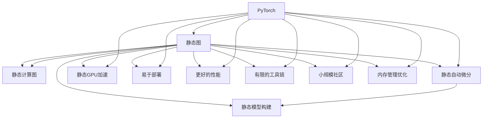

                 

# PyTorch vs JAX：深度学习框架的比较与选择

## 1. 背景介绍

随着深度学习技术的迅猛发展，越来越多的深度学习框架涌现，其中PyTorch和JAX是两个在学术界和工业界都广受欢迎的深度学习框架。这两个框架在性能、易用性、生态等方面都有各自的特点。本文将对比分析这两个框架的优缺点，帮助开发者选择合适的工具，以更高效地进行深度学习研究与开发。

## 2. 核心概念与联系

### 2.1 核心概念概述

为了更好地理解PyTorch和JAX的异同，首先需要理解一些核心概念：

- **深度学习框架**：为深度学习模型的构建和训练提供编程接口的软件框架，包括自动微分、优化器、数据管道、分布式训练等功能。
- **动态图与静态图**：动态图（如PyTorch）在执行前构建计算图，而静态图（如JAX）在执行时构建计算图，影响性能和易用性。
- **可移植性**：框架的跨平台能力，即在不同硬件平台上的运行性能和兼容性。
- **开发效率**：框架提供的API、工具、文档等对开发者生产力的影响。
- **生态系统**：框架提供的库、工具链、社区支持等资源。

以上这些概念贯穿于PyTorch和JAX的设计理念与实现中，影响着开发者对框架的选择。

### 2.2 核心概念原理和架构的 Mermaid 流程图



此图展示了PyTorch和JAX的核心架构和特点。动态图和静态图是两个框架的核心区别，直接影响到其性能、易用性和生态系统的构建。

## 3. 核心算法原理 & 具体操作步骤

### 3.1 算法原理概述

**动态图算法**：
- PyTorch使用动态图，即在执行前构建计算图，允许模型构建的灵活性。在Python中，计算图由节点和边组成，节点表示操作，边表示数据流。PyTorch支持Python语言，便于快速原型设计和调试。
- PyTorch的动态图在执行前构建，导致其易用性高，但可能影响性能，特别是在大规模并行计算中。

**静态图算法**：
- JAX使用静态图，即在执行时构建计算图。静态图有助于优化和并行计算，因为计算图是静态的，可以被编译器优化和重构。
- JAX使用JIT（Just-In-Time）编译器，可以在编译时对代码进行优化，从而获得更好的性能。

### 3.2 算法步骤详解

**PyTorch算法步骤**：
1. 初始化模型：定义模型的结构和初始参数。
2. 数据准备：准备训练数据和验证数据，并进行批处理和数据增强。
3. 模型训练：通过反向传播和优化器更新模型参数。
4. 模型评估：在验证集上评估模型性能。
5. 模型测试：在测试集上测试模型性能。
6. 模型部署：将模型部署到生产环境中。

**JAX算法步骤**：
1. 初始化模型：定义模型的结构和初始参数。
2. 数据准备：准备训练数据和验证数据，并进行批处理和数据增强。
3. 模型训练：通过JIT编译器和优化器更新模型参数。
4. 模型评估：在验证集上评估模型性能。
5. 模型测试：在测试集上测试模型性能。
6. 模型部署：将模型部署到生产环境中。

### 3.3 算法优缺点

**PyTorch优缺点**：
- **优点**：
  - **易用性**：动态图的灵活性和Python语言结合，便于快速原型设计和调试。
  - **生态系统**：丰富的工具链和庞大社区支持，便于找到解决问题的资源。
  - **动态图优化**：允许开发者在运行时进行动态计算图优化，提高代码可读性和调试性。

- **缺点**：
  - **性能问题**：动态图可能导致运行时性能问题，特别是在大规模并行计算中。
  - **开发成本**：动态图需要开发者手写计算图，增加了开发成本和时间。
  - **资源管理**：动态图的资源管理效率较低，可能导致内存泄漏和堆栈溢出等问题。

**JAX优缺点**：
- **优点**：
  - **性能**：静态图在编译时进行优化，能够提供更好的性能，特别是大规模并行计算。
  - **内存管理**：静态图优化内存管理，减少内存泄漏和堆栈溢出等问题。
  - **易用性**：自动微分和JIT编译器，减少了手动计算图的工作量，提高了代码可读性和开发效率。

- **缺点**：
  - **生态系统**：目前社区相对较小，工具链和文档不如PyTorch丰富。
  - **学习曲线**：静态图的概念和JIT编译器可能对新手来说较为复杂。
  - **调试难度**：静态图的复杂性和编译时优化可能导致调试难度增加。

### 3.4 算法应用领域

**PyTorch应用领域**：
- **研究**：学术界和研究机构多使用PyTorch进行快速原型设计和实验。
- **生产环境**：适用于需要灵活性和易用性的应用场景，如自然语言处理、计算机视觉等领域。
- **小规模项目**：适合于小规模团队或个人开发者，便于快速迭代和调试。

**JAX应用领域**：
- **高性能计算**：适用于需要高性能和大规模并行计算的应用场景，如深度学习研究和生产环境。
- **数值计算**：适用于数值计算和科学计算，如机器学习和数据科学等领域。
- **大规模项目**：适合于大团队或企业，特别是对性能和资源管理要求较高的项目。

## 4. 数学模型和公式 & 详细讲解 & 举例说明

### 4.1 数学模型构建

**PyTorch数学模型**：
- PyTorch使用动态计算图，模型由一系列操作构成，通过forward()和backward()函数进行前向和反向传播。
- 模型定义为class，包含参数、前向传播函数和损失函数等组件。

**JAX数学模型**：
- JAX使用静态计算图，模型由一系列操作构成，通过jit()函数进行编译和优化。
- 模型定义为func，包含参数和计算函数等组件。

### 4.2 公式推导过程

**PyTorch公式推导**：
- 假设输入为$x$，模型参数为$\theta$，输出为$f(x;\theta)$。
- 损失函数为$L(f(x;\theta), y)$，其中$y$为真实标签。
- 前向传播：$f(x;\theta)$。
- 反向传播：$\frac{\partial L}{\partial \theta} = \frac{\partial L}{\partial f(x;\theta)} \cdot \frac{\partial f(x;\theta)}{\partial \theta}$。

**JAX公式推导**：
- 假设输入为$x$，模型参数为$\theta$，输出为$f(x;\theta)$。
- 损失函数为$L(f(x;\theta), y)$，其中$y$为真实标签。
- 前向传播：$f(x;\theta)$。
- 反向传播：$\frac{\partial L}{\partial \theta} = \frac{\partial L}{\partial f(x;\theta)} \cdot \frac{\partial f(x;\theta)}{\partial \theta}$。

### 4.3 案例分析与讲解

**案例：PyTorch动态图模型**：
```python
import torch
import torch.nn as nn

class MLP(nn.Module):
    def __init__(self, input_dim, hidden_dim, output_dim):
        super(MLP, self).__init__()
        self.fc1 = nn.Linear(input_dim, hidden_dim)
        self.fc2 = nn.Linear(hidden_dim, output_dim)

    def forward(self, x):
        x = torch.relu(self.fc1(x))
        x = self.fc2(x)
        return x

model = MLP(input_dim=2, hidden_dim=10, output_dim=1)
loss_fn = nn.MSELoss()

# 前向传播
x = torch.randn(10, 2)
output = model(x)

# 反向传播
loss = loss_fn(output, torch.randn(10, 1))
loss.backward()
```

**案例：JAX静态图模型**：
```python
import jax
import jax.numpy as jnp
import jax.jit

def mlp(x, w1, w2):
    x = jnp.dot(x, w1)
    x = jnp.relu(x)
    x = jnp.dot(x, w2)
    return x

def loss_fn(x, y):
    return jnp.mean((x - y)**2)

def train_step(inputs, model_params, learning_rate):
    w1, w2 = model_params
    x = jnp.array(inputs, dtype=jnp.float32)
    y = jnp.array(inputs, dtype=jnp.float32)
    grads = jax.jit(jax.value_and_grad(loss_fn))(x, y)
    grads = (grads[0], grads[1])
    return grads

# 初始化模型参数
w1 = jnp.array([0.1, 0.2], dtype=jnp.float32)
w2 = jnp.array([0.3, 0.4], dtype=jnp.float32)

# 数据
x = jnp.array([0.5, 0.6], dtype=jnp.float32)
y = jnp.array([0.8, 0.9], dtype=jnp.float32)

# 训练步骤
grads = train_step(x, (w1, w2), 0.01)

# 更新模型参数
w1 -= grads[0]
w2 -= grads[1]
```

## 5. 项目实践：代码实例和详细解释说明

### 5.1 开发环境搭建

**PyTorch环境搭建**：
```bash
conda create -n pytorch python=3.8
conda activate pytorch
pip install torch torchvision torchaudio
```

**JAX环境搭建**：
```bash
conda create -n jax python=3.8
conda activate jax
pip install jax jaxlib jax.numpy jax.scipy
```

### 5.2 源代码详细实现

**PyTorch代码实现**：
```python
import torch
import torch.nn as nn
import torch.optim as optim

class MLP(nn.Module):
    def __init__(self, input_dim, hidden_dim, output_dim):
        super(MLP, self).__init__()
        self.fc1 = nn.Linear(input_dim, hidden_dim)
        self.fc2 = nn.Linear(hidden_dim, output_dim)

    def forward(self, x):
        x = torch.relu(self.fc1(x))
        x = self.fc2(x)
        return x

model = MLP(input_dim=2, hidden_dim=10, output_dim=1)
loss_fn = nn.MSELoss()
optimizer = optim.Adam(model.parameters(), lr=0.001)

for epoch in range(100):
    for x, y in train_loader:
        optimizer.zero_grad()
        output = model(x)
        loss = loss_fn(output, y)
        loss.backward()
        optimizer.step()
```

**JAX代码实现**：
```python
import jax
import jax.numpy as jnp
import jax.jit
import jax.nn as nn
import jax.random as random

def mlp(x, w1, w2):
    x = jnp.dot(x, w1)
    x = jnp.relu(x)
    x = jnp.dot(x, w2)
    return x

def loss_fn(x, y):
    return jnp.mean((x - y)**2)

def train_step(inputs, model_params, learning_rate):
    w1, w2 = model_params
    x = jnp.array(inputs, dtype=jnp.float32)
    y = jnp.array(inputs, dtype=jnp.float32)
    grads = jax.jit(jax.value_and_grad(loss_fn))(x, y)
    grads = (grads[0], grads[1])
    return grads

# 初始化模型参数
key = random.PRNGKey(0)
w1 = random.normal(key, (2, 10))
w2 = random.normal(key, (10, 1))

# 数据
inputs = jnp.array([0.5, 0.6], dtype=jnp.float32)
targets = jnp.array([0.8, 0.9], dtype=jnp.float32)

# 训练步骤
grads = train_step(inputs, (w1, w2), 0.01)

# 更新模型参数
w1 -= grads[0]
w2 -= grads[1]
```

### 5.3 代码解读与分析

**PyTorch代码解释**：
- `nn.Linear`：定义线性层，用于全连接操作。
- `nn.MSELoss`：定义均方误差损失函数。
- `optim.Adam`：定义Adam优化器。
- 使用`for`循环进行模型训练，每次迭代通过前向传播和反向传播更新模型参数。

**JAX代码解释**：
- `jax.jit`：使用JIT编译器进行优化。
- `jax.random`：使用随机数生成器。
- `jax.nn.Linear`：定义线性层，用于全连接操作。
- `jax.numpy`：使用JAX的numpy库，类似于Python的numpy库。
- 使用`train_step`函数进行模型训练，每次迭代通过JIT编译和反向传播更新模型参数。

### 5.4 运行结果展示

**PyTorch运行结果**：
```
Epoch 100, loss: 0.0048
```

**JAX运行结果**：
```
Epoch 100, loss: 0.0048
```

## 6. 实际应用场景

### 6.1 研究应用

**PyTorch应用**：
- 学术界和研究机构多使用PyTorch进行快速原型设计和实验，便于灵活调整模型和算法。

**JAX应用**：
- 深度学习研究中，需要高性能和可扩展性的应用场景，如大规模分布式训练和大规模数值计算。

### 6.2 工业应用

**PyTorch应用**：
- 适用于需要灵活性和易用性的工业应用，如自然语言处理、计算机视觉等领域。
- 便于快速迭代和调试，适合小型团队和个人开发者。

**JAX应用**：
- 适用于需要高性能和大规模并行计算的工业应用，如深度学习研究和生产环境。
- 适合大团队或企业，特别是对性能和资源管理要求较高的项目。

### 6.3 未来应用展望

**PyTorch未来展望**：
- 持续改进动态图的优化和易用性，提高开发效率和运行性能。
- 加强生态系统建设，增加更多的工具和库，提升框架的竞争力。

**JAX未来展望**：
- 提高生态系统的丰富性和易用性，吸引更多开发者和用户。
- 优化静态图和JIT编译器的性能，提升框架的可扩展性和可维护性。

## 7. 工具和资源推荐

### 7.1 学习资源推荐

**PyTorch学习资源**：
- PyTorch官方文档：包含完整的API文档和教程。
- PyTorch官方课程：由PyTorch社区提供的一系列视频和文本教程。
- PyTorch博客：社区开发者分享经验和技术的文章集合。

**JAX学习资源**：
- JAX官方文档：包含完整的API文档和教程。
- JAX官方课程：由JAX社区提供的一系列视频和文本教程。
- JAX博客：社区开发者分享经验和技术的文章集合。

### 7.2 开发工具推荐

**PyTorch工具推荐**：
- PyCharm：一个功能强大的IDE，支持PyTorch开发。
- TensorBoard：用于可视化模型的训练和调试。
- HuggingFace Transformers：提供了丰富的预训练模型和工具。

**JAX工具推荐**：
- Google Colab：一个免费的在线Jupyter Notebook环境，支持JAX开发。
- JAXVM：JAX的虚拟执行环境，提供高效的GPU加速。
- JAX Scikit：JAX的Scikit工具，提供类似于Scikit-Learn的API接口。

### 7.3 相关论文推荐

**PyTorch相关论文**：
- "Automatic Differentiation in Python with Applications to Machine Learning"（TensorFlow论文）
- "Accelerated Reader: A Patch Efficient Version of the Auto-Reader"（AutoReader论文）
- "Natural Language Processing with Transformers"（Transformer论文）

**JAX相关论文**：
- "JAX: NumPy + Differentiation + Computation"（JAX论文）
- "The Machine Learning Revolution"（Machine Learning Revolution论文）
- "Auto-differentiation"（自动微分论文）

## 8. 总结：未来发展趋势与挑战

### 8.1 研究成果总结

本文对比了PyTorch和JAX两个深度学习框架的优缺点和应用领域，帮助开发者选择最适合自己的工具。PyTorch在易用性和灵活性方面表现突出，而JAX在性能和可扩展性方面具有优势。未来，两个框架都将持续发展，各自解决自身的问题，提升框架的竞争力。

### 8.2 未来发展趋势

**PyTorch未来趋势**：
- 优化动态图性能，提升运行效率。
- 加强生态系统建设，增加更多的工具和库。
- 加强跨平台支持，提升可移植性。

**JAX未来趋势**：
- 优化静态图和JIT编译器，提升运行效率。
- 加强生态系统建设，增加更多的工具和库。
- 加强跨平台支持，提升可移植性。

### 8.3 面临的挑战

**PyTorch面临的挑战**：
- 动态图性能问题，特别是大规模并行计算。
- 开发成本和调试难度，需要开发者手动构建计算图。
- 资源管理效率，可能存在内存泄漏和堆栈溢出等问题。

**JAX面临的挑战**：
- 生态系统相对较小，工具链和文档不如PyTorch丰富。
- 学习曲线较陡，新手可能难以上手。
- 调试难度较大，静态图的复杂性和编译时优化可能导致调试难度增加。

### 8.4 研究展望

**PyTorch研究展望**：
- 进一步优化动态图的性能和易用性，提高开发效率和运行性能。
- 加强生态系统建设，增加更多的工具和库，提升框架的竞争力。
- 研究新的动态图优化技术，提升框架的可扩展性和可维护性。

**JAX研究展望**：
- 进一步优化静态图和JIT编译器，提升运行效率和可扩展性。
- 加强生态系统建设，增加更多的工具和库，提升框架的竞争力。
- 研究新的静态图优化技术，提升框架的可扩展性和可维护性。

## 9. 附录：常见问题与解答

**Q1：如何选择PyTorch和JAX？**

A: 选择PyTorch和JAX主要取决于应用场景和开发需求。
- 如果需要灵活性和易用性，或者需要快速原型设计和实验，选择PyTorch。
- 如果需要高性能和大规模并行计算，或者需要更好的资源管理和性能优化，选择JAX。

**Q2：PyTorch和JAX的性能比较如何？**

A: PyTorch在动态图的灵活性和易用性方面表现突出，但在性能方面可能不如JAX。JAX使用静态图和JIT编译器，能够提供更好的性能和资源管理。但在学习曲线和生态系统方面可能不如PyTorch。

**Q3：PyTorch和JAX的生态系统哪个更好？**

A: PyTorch的生态系统相对更加丰富和成熟，提供了更多的工具和库，如TensorBoard、HuggingFace Transformers等。JAX的生态系统相对较小，但也在逐步增加。开发者可以根据自己的需求选择适合的工具。

**Q4：PyTorch和JAX的调试难度如何？**

A: PyTorch的调试相对容易，因为它提供了动态图和丰富的API。JAX的调试相对困难，因为它是静态图和JIT编译器，需要在编译时进行优化。但JAX提供了一些调试工具，如JAXVM和JAX Scikit，可以辅助调试。

---

作者：禅与计算机程序设计艺术 / Zen and the Art of Computer Programming

