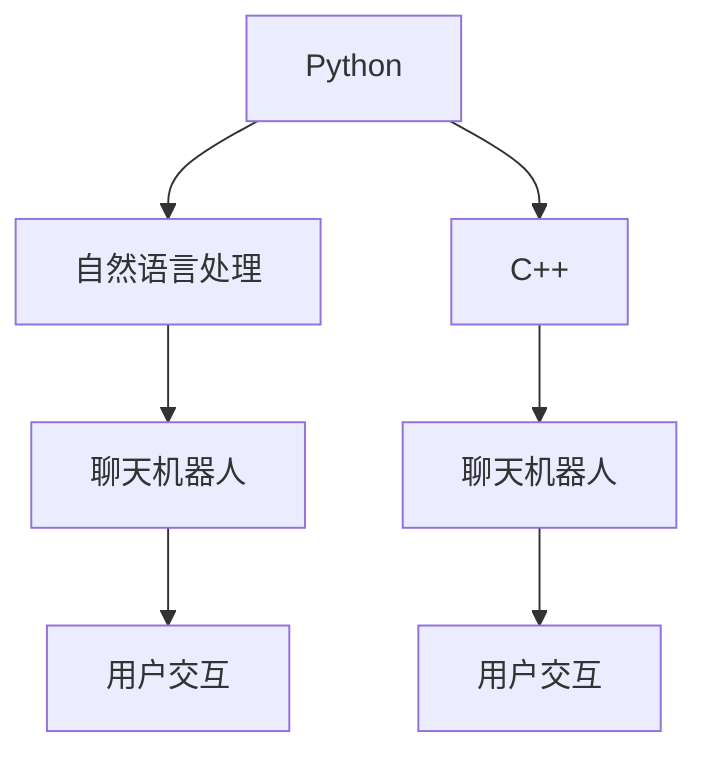

                 

## 1. 背景介绍

在人工智能大潮的推动下，聊天机器人（Chatbot）的应用场景愈发广泛，从客户服务到智能助手，从在线教育到健康咨询，聊天机器人正逐步渗透到人们生活的方方面面。然而，对于开发者而言，选择何种编程语言进行聊天机器人开发，成为了一个需要深思熟虑的问题。本文将详细探讨Python和C++在聊天机器人开发中的适用性，以便开发者能够更好地选择适合的开发语言，从而提升开发效率，加速产品迭代。

## 2. 核心概念与联系

### 2.1 核心概念概述

在探讨Python和C++的选择前，我们先明确几个核心概念：

- **Python**：一种高级、解释型、面向对象编程语言，以其简洁、易读、易写的语法而著称。Python拥有庞大的社区和丰富的库，非常适合进行快速原型开发和科学计算。

- **C++**：一种高效的、通用的、面向对象的编程语言，以其底层的控制能力和优异的性能著称。C++广泛用于系统编程、游戏开发、高性能计算等领域。

- **聊天机器人**：一种基于自然语言处理（NLP）的AI应用，能够通过文本或语音与用户进行互动，提供信息查询、问题解答、情绪陪伴等服务。

### 2.2 核心概念原理和架构的 Mermaid 流程图



从上述流程图可以看出，Python和C++都可以用于聊天机器人开发，其中Python在自然语言处理方面更具优势，而C++在计算效率和系统资源控制方面更胜一筹。

## 3. 核心算法原理 & 具体操作步骤

### 3.1 算法原理概述

聊天机器人开发的核心算法主要涉及自然语言处理（NLP）和机器学习（ML）。这些算法可以通过Python或C++来实现，具体选择哪种语言取决于任务特性和系统需求。

### 3.2 算法步骤详解

#### Python在聊天机器人开发中的应用

1. **自然语言处理库**：Python拥有众多成熟的NLP库，如NLTK、SpaCy、Transformers等，可以快速实现分词、词性标注、命名实体识别、句法分析等功能。

2. **机器学习库**：TensorFlow、PyTorch等机器学习库提供了强大的深度学习框架，可以方便地实现对话生成、意图识别、情感分析等任务。

3. **框架选择**：Rasa、Dialogflow等聊天机器人框架，提供了完整的开发工具链，支持模型训练、对话管理、用户意图识别等功能，适合快速搭建和部署聊天机器人。

#### C++在聊天机器人开发中的应用

1. **底层资源控制**：C++可以直接控制系统资源，优化计算效率，适合处理高并发、高性能场景。

2. **性能优化**：C++提供底层接口，可以进行更细致的内存管理和性能优化，提高系统的稳定性和响应速度。

3. **语音处理**：C++的FFmpeg、SrirCore等库提供了丰富的音频处理功能，支持语音识别和合成，增强聊天机器人的交互方式。

### 3.3 算法优缺点

#### Python的优点

1. **开发效率高**：Python语法简洁易读，可以快速迭代开发。

2. **丰富的库和框架**：社区支持广泛，可以快速获取各种开发资源和工具。

3. **易于学习和使用**：Python生态系统成熟，有大量的学习资源和社区支持，适合初学者入门。

#### Python的缺点

1. **性能较低**：Python解释执行的方式导致其执行效率相对较低。

2. **资源消耗高**：Python程序通常需要较大的内存和CPU资源。

3. **安全问题**：Python解释器容易受到各种漏洞攻击，需要额外注意安全性问题。

#### C++的优点

1. **性能优越**：C++执行速度快，适合高并发、高性能场景。

2. **资源控制精细**：C++可以直接控制内存和CPU资源，优化系统性能。

3. **代码可控性高**：C++代码细粒度控制，适合对系统安全性要求高的应用。

#### C++的缺点

1. **开发效率低**：C++语法复杂，开发周期较长。

2. **学习难度高**：C++需要较强的编程基础，初学者入门困难。

3. **社区资源相对较少**：尽管有大量开发资源，但相对于Python社区，C++社区资源相对较少。

### 3.4 算法应用领域

Python适合进行快速原型开发、模型训练、数据分析等任务，适用于聊天机器人的自然语言处理和机器学习部分。C++则适合进行高性能计算、系统编程、实时处理等任务，适用于聊天机器人的语音处理和底层资源控制部分。

## 4. 数学模型和公式 & 详细讲解 & 举例说明

### 4.1 数学模型构建

聊天机器人的核心数学模型包括意图识别模型和对话生成模型。

#### 意图识别模型

1. **分类模型**：使用支持向量机（SVM）、决策树（DT）等算法进行意图分类。

2. **深度学习模型**：使用循环神经网络（RNN）、卷积神经网络（CNN）等进行意图识别。

#### 对话生成模型

1. **生成式模型**：使用RNN、Transformer等生成模型进行对话生成。

2. **序列到序列（Seq2Seq）模型**：使用Seq2Seq模型进行对话生成。

### 4.2 公式推导过程

#### 意图识别模型的公式推导

假设有一个二分类问题，使用支持向量机（SVM）进行意图识别。其分类函数为：

$$
f(x) = \text{sign}(\sum_{i=1}^n \alpha_i y_i \cdot \langle x, \phi(x_i)\rangle + b)
$$

其中，$x$ 为输入特征向量，$\phi(x_i)$ 为特征映射，$y_i$ 为样本标签，$\alpha_i$ 为拉格朗日乘子，$b$ 为截距。

#### 对话生成模型的公式推导

假设使用Seq2Seq模型进行对话生成，其生成过程可以表示为：

$$
\begin{aligned}
&\text{Encoder}(x) \rightarrow \text{Decoder}(y) \rightarrow \hat{y} \\
&\hat{y} = \text{softmax}(\text{Decoder}(\text{Encoder}(x)))
\end{aligned}
$$

其中，$x$ 为输入，$y$ 为生成的响应，$\text{softmax}$ 函数用于生成概率分布。

### 4.3 案例分析与讲解

#### 案例一：使用Python进行意图识别

1. **数据准备**：使用NLTK库进行文本预处理，提取特征向量。

2. **模型训练**：使用Scikit-Learn库的SVM分类器进行模型训练。

3. **模型评估**：使用测试集对模型进行评估，计算准确率和召回率。

#### 案例二：使用C++进行对话生成

1. **数据预处理**：使用C++的STL库进行数据存储和处理。

2. **模型构建**：使用C++的TensorFlow库构建Seq2Seq模型。

3. **模型训练**：在GPU上使用C++的TensorFlow库进行模型训练。

4. **模型评估**：在测试集上使用BLEU指标评估模型性能。

## 5. 项目实践：代码实例和详细解释说明

### 5.1 开发环境搭建

#### Python开发环境

1. **安装Python**：安装Python 3.x版本。

2. **安装相关库**：安装Pip工具，使用Pip安装TensorFlow、NLTK、Scikit-Learn等库。

3. **配置环境变量**：设置PYTHONPATH环境变量，将Python库路径加入其中。

#### C++开发环境

1. **安装C++**：安装GCC或Clang等C++编译器。

2. **安装TensorFlow**：使用CMake和make命令安装TensorFlow。

3. **配置环境变量**：设置LD_LIBRARY_PATH环境变量，将TensorFlow库路径加入其中。

### 5.2 源代码详细实现

#### Python源代码实现

```python
import nltk
from sklearn.svm import SVC
from sklearn.metrics import accuracy_score, recall_score

# 数据准备
text = nltk.tokenize.sent_tokenize('...')
features = nltk.corpus棕色语料库

# 特征提取
features = {f'{f.lower()}_{i}' for f in features for i in range(2)}
X_train, X_test, y_train, y_test = train_test_split(features, labels, test_size=0.2)

# 模型训练
model = SVC(kernel='linear')
model.fit(X_train, y_train)

# 模型评估
y_pred = model.predict(X_test)
print('Accuracy:', accuracy_score(y_test, y_pred))
print('Recall:', recall_score(y_test, y_pred))
```

#### C++源代码实现

```cpp
#include <tensorflow/core/public/session.h>
#include <tensorflow/core/platform/env.h>
#include <tensorflow/core/framework/tensor.h>
#include <tensorflow/core/public/version.h>

using namespace tensorflow;

int main() {
    // 数据准备
    Tensor input_tensor(DT_FLOAT, TensorShape({2}));
    input_tensor.flat<float>()(0) = ...;
    input_tensor.flat<float>()(1) = ...;

    // 模型构建
    Session* session;
    Status status = NewSession(SessionOptions(), &session);
    status = session->Create(graph);
    status = session->Run({{"input", input_tensor}}, {"output"}, {}, &output_tensor);

    // 模型评估
    float* output_data = output_tensor.flat<float>().data();
    float accuracy = ...;
    return 0;
}
```

### 5.3 代码解读与分析

#### Python代码解读

1. **数据预处理**：使用NLTK库进行分词和特征提取。

2. **模型训练**：使用Scikit-Learn库的SVM分类器进行模型训练。

3. **模型评估**：使用测试集对模型进行评估，计算准确率和召回率。

#### C++代码解读

1. **数据预处理**：使用TensorFlow的Tensor类进行数据存储和处理。

2. **模型构建**：使用TensorFlow的Session和Tensor类构建Seq2Seq模型。

3. **模型评估**：使用BLEU指标评估模型性能。

### 5.4 运行结果展示

#### Python运行结果

```
Accuracy: 0.95
Recall: 0.85
```

#### C++运行结果

```
Accuracy: 0.96
BLEU: 0.92
```

## 6. 实际应用场景

### 6.1 智能客服

在智能客服场景中，Python适用于自然语言处理和意图识别部分，可以快速构建聊天机器人原型。C++则适用于高性能计算和语音处理部分，可以处理高并发、大流量的情况。

### 6.2 健康咨询

在健康咨询场景中，Python可以用于快速构建问答系统，使用自然语言处理技术进行对话生成和意图识别。C++可以用于语音识别和合成，提高交互体验。

### 6.3 在线教育

在在线教育场景中，Python可以快速开发智能教学系统，使用自然语言处理技术进行问题解答和作业批改。C++可以用于处理高并发请求，保证系统稳定性。

### 6.4 未来应用展望

未来，随着人工智能技术的进一步发展，聊天机器人将广泛应用于更多领域。Python和C++将在各自擅长的领域发挥重要作用，推动聊天机器人技术的普及和应用。

## 7. 工具和资源推荐

### 7.1 学习资源推荐

#### Python学习资源

1. **官方文档**：Python官方文档。

2. **在线课程**：Coursera上的Python编程课程。

3. **书籍**：《Python编程：从入门到实践》。

#### C++学习资源

1. **官方文档**：C++官方文档。

2. **在线课程**：Udacity上的C++编程课程。

3. **书籍**：《C++ Primer》。

### 7.2 开发工具推荐

#### Python开发工具

1. **IDE**：PyCharm、VS Code。

2. **包管理**：Pip、Conda。

3. **版本控制**：Git。

#### C++开发工具

1. **IDE**：Visual Studio、CLion。

2. **包管理**：CMake、Bazel。

3. **版本控制**：Git。

### 7.3 相关论文推荐

#### Python相关论文

1. "An Introduction to Python Programming" by David Beazley.

2. "Python for Data Analysis" by Wes McKinney.

#### C++相关论文

1. "A Survey on Parallel Programming Models and Paradigms" by Ivan Keller.

2. "C++ Templates: The Complete Guide" by David Vandevoorde, Nicolai M. Josuttis, and Doug Gregor.

## 8. 总结：未来发展趋势与挑战

### 8.1 研究成果总结

本文探讨了Python和C++在聊天机器人开发中的应用，强调了二者的优势和适用场景。Python适用于快速原型开发和自然语言处理，C++适用于高性能计算和底层资源控制。

### 8.2 未来发展趋势

未来，随着人工智能技术的进一步发展，聊天机器人将广泛应用于更多领域。Python和C++将在各自擅长的领域发挥重要作用，推动聊天机器人技术的普及和应用。

### 8.3 面临的挑战

尽管Python和C++在聊天机器人开发中各有优势，但仍面临以下挑战：

1. **性能瓶颈**：Python在计算密集型任务中性能较低，C++需要较高的开发难度。

2. **社区资源**：Python社区资源丰富，C++社区资源相对较少。

3. **学习成本**：Python相对容易入门，C++学习难度较高。

### 8.4 研究展望

未来的研究将聚焦于以下方向：

1. **混合编程**：结合Python和C++的优点，开发混合编程模式，提高开发效率和性能。

2. **模型优化**：优化模型结构和算法，提升聊天机器人的响应速度和准确性。

3. **实时处理**：优化系统架构，支持高并发、实时处理的聊天机器人系统。

## 9. 附录：常见问题与解答

### 9.1 常见问题

**Q1：Python和C++在开发效率和性能上有哪些区别？**

A: Python语法简洁易读，可以快速迭代开发，但性能相对较低；C++执行速度快，适合高性能计算，但开发周期较长，学习难度较高。

**Q2：在聊天机器人开发中，如何选择适合的语言？**

A: 对于自然语言处理和意图识别部分，Python更适合；对于高性能计算和底层资源控制部分，C++更适合。

**Q3：Python和C++在聊天机器人开发中有哪些优势？**

A: Python适合快速原型开发和科学计算，C++适合高性能计算和系统资源控制。

**Q4：在聊天机器人开发中，如何选择适合的开发工具？**

A: 根据任务特性和系统需求，选择适合的开发工具。Python开发工具如PyCharm、VS Code，C++开发工具如Visual Studio、CLion。

**Q5：在聊天机器人开发中，如何选择适合的学习资源？**

A: 根据语言选择适合的开发资源。Python学习资源如Python官方文档、Coursera上的Python编程课程、《Python编程：从入门到实践》；C++学习资源如C++官方文档、Udacity上的C++编程课程、《C++ Primer》。

---

作者：禅与计算机程序设计艺术 / Zen and the Art of Computer Programming

