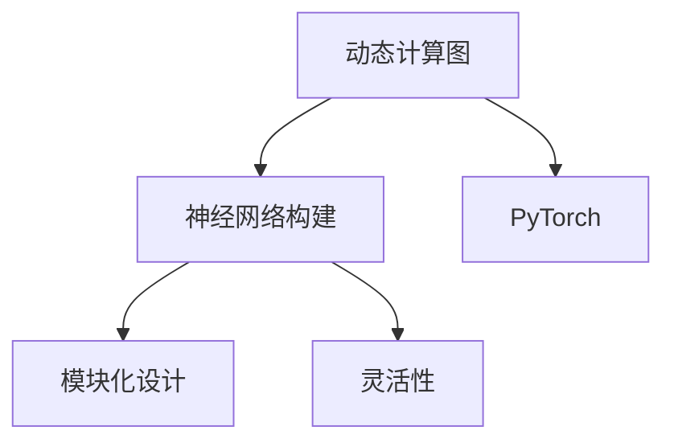

                 

# Pytorch 动态计算图优势：灵活且模块化的神经网络构建

> 关键词：动态计算图, 神经网络构建, PyTorch, 灵活性, 模块化

## 1. 背景介绍

### 1.1 问题由来
在过去几年中，深度学习已经深刻改变了人工智能的现状。它不仅让机器能够在许多复杂的视觉和语言任务中超越人类，而且还提供了构建智能系统的新方法。其中，神经网络是深度学习的重要组成部分，而构建高效、可扩展的神经网络架构则是至关重要的。

然而，传统的神经网络架构往往需要大量的手动编码和调试工作，这不仅耗时耗力，而且容易出错。为了解决这个问题，动态计算图（Dynamic Computation Graph）成为了深度学习领域的一个重要研究方向。PyTorch作为动态计算图的代表，以其灵活性和模块化设计著称，极大地简化了神经网络的构建和训练过程，成为深度学习领域的主流框架之一。

### 1.2 问题核心关键点
本文将探讨PyTorch的动态计算图优势，包括其灵活性和模块化设计，以及如何在实际应用中有效使用这些特性来构建高效、可扩展的神经网络。通过深入理解这些概念，开发者可以更轻松地构建复杂的神经网络，并快速迭代模型，实现更好的性能。

## 2. 核心概念与联系

### 2.1 核心概念概述

为了更好地理解PyTorch的动态计算图及其优势，本节将介绍几个关键概念：

- 动态计算图（Dynamic Computation Graph）：一种在运行时构建和执行计算图的方法，与静态计算图（如TensorFlow的静态图）不同，动态图允许在运行时动态地调整计算图结构，提供了更大的灵活性。

- 神经网络构建：通过编程语言（如Python）和计算框架（如PyTorch），设计并实现神经网络的过程。

- PyTorch：一种基于Python的深度学习框架，采用动态计算图，支持高效的模型构建、训练和推理。

- 模块化设计：将复杂的系统分解为更小的、可重用的组件，提高系统的灵活性和可扩展性。

- 灵活性：在设计和实现神经网络时，能够快速适应不同的数据和任务需求，无需修改底层代码。

这些概念之间的逻辑关系可以通过以下Mermaid流程图来展示：



这个流程图展示了大语言模型的核心概念及其之间的关系：

1. 动态计算图提供了灵活构建神经网络的能力。
2. PyTorch作为动态计算图的代表，支持模块化的神经网络构建。
3. 模块化设计提高了系统的灵活性和可扩展性。
4. 灵活性使得神经网络能够适应不同的数据和任务需求。

## 3. 核心算法原理 & 具体操作步骤

### 3.1 算法原理概述

PyTorch的动态计算图允许在运行时构建和执行计算图，这使得构建和训练神经网络变得更加灵活和模块化。这种设计理念使得开发者能够更轻松地设计和实现复杂的神经网络架构，并且快速适应不同的数据和任务需求。

具体来说，PyTorch的动态计算图通过定义符号变量（Symbolic Variables）和计算图（Computation Graph）来实现。开发者可以使用符号变量来表示神经网络中的各种操作，如加、乘、卷积、池化等，这些操作会自动构建计算图，并在运行时被执行。由于计算图是动态构建的，因此可以在运行时调整计算图结构，适应不同的数据和任务需求。

### 3.2 算法步骤详解

使用PyTorch构建神经网络的步骤可以分为以下几个关键步骤：

**Step 1: 准备数据集**
- 使用PyTorch的Dataset类和DataLoader类准备训练集和测试集。
- 将数据集划分为训练集、验证集和测试集，并将每个样本转换为PyTorch张量（Tensor）格式。

**Step 2: 定义神经网络模型**
- 继承torch.nn.Module类，定义神经网络的各个层，如卷积层、池化层、全连接层等。
- 在模型类中定义前向传播函数forward()，用于计算神经网络的输出。

**Step 3: 选择优化器和损失函数**
- 选择合适的优化器（如AdamW、SGD等）和损失函数（如交叉熵损失、均方误差损失等）。
- 使用PyTorch的optim和loss模块导入相应的优化器和损失函数。

**Step 4: 训练模型**
- 在训练集上使用DataLoader迭代训练模型。
- 在每个epoch上计算模型的损失和梯度，使用优化器更新模型参数。
- 在验证集上评估模型性能，根据性能决定是否继续训练。

**Step 5: 测试模型**
- 在测试集上评估模型的性能。
- 使用预测结果和真实标签计算模型的准确率、召回率等指标。

### 3.3 算法优缺点

使用PyTorch的动态计算图构建神经网络具有以下优点：

1. 灵活性：动态计算图允许在运行时动态调整计算图结构，适应不同的数据和任务需求。

2. 模块化设计：通过定义符号变量和计算图，可以将复杂的神经网络分解为更小的、可重用的组件，提高系统的可扩展性。

3. 易用性：使用Python和PyTorch，可以更轻松地构建和调试神经网络，减少手动编码和调试工作。

4. 高效性：动态计算图允许使用GPU加速计算，提高神经网络的训练和推理效率。

同时，动态计算图也存在一些局限性：

1. 性能开销：动态计算图需要在运行时构建和执行计算图，这可能导致一定的性能开销，尤其是在大规模神经网络训练时。

2. 学习曲线：对于初学者而言，理解和使用动态计算图可能需要一定的时间和学习成本。

3. 调试困难：动态计算图允许在运行时动态调整计算图结构，但这也可能导致调试困难，尤其是在出现错误时。

### 3.4 算法应用领域

动态计算图在构建神经网络方面的灵活性和模块化设计，使其广泛应用于各种深度学习任务。以下是几个典型的应用领域：

1. 计算机视觉：使用卷积神经网络（CNN）对图像进行分类、检测和分割等任务。

2. 自然语言处理（NLP）：使用循环神经网络（RNN）和Transformer模型对文本进行分类、情感分析和机器翻译等任务。

3. 语音识别：使用卷积神经网络和循环神经网络对语音进行识别和处理。

4. 推荐系统：使用深度神经网络对用户和物品进行推荐，提高推荐系统的准确性和个性化程度。

5. 游戏AI：使用强化学习对游戏进行策略训练和决策制定。

6. 医疗诊断：使用深度神经网络对医疗图像进行诊断和治疗。

## 4. 数学模型和公式 & 详细讲解 & 举例说明

### 4.1 数学模型构建

PyTorch的动态计算图允许使用符号变量和计算图来表示神经网络模型。以下是使用符号变量构建简单神经网络模型的步骤：

1. 定义符号变量：使用torch.symbols()函数定义符号变量，表示输入、权重和偏置。

2. 定义计算图：使用符号变量构建计算图，表示神经网络的操作。

3. 前向传播：使用计算图进行前向传播，计算神经网络的输出。

### 4.2 公式推导过程

以下是一个简单的神经网络的前向传播过程，用于计算输出。

假设输入为 $x$，权重为 $w$，偏置为 $b$，激活函数为 $f$，计算输出 $y$ 的过程如下：

$$
y = f(x \cdot w + b)
$$

其中 $f$ 为激活函数，如ReLU、Sigmoid等。

在PyTorch中，可以使用符号变量和计算图来实现上述过程：

```python
import torch

# 定义符号变量
x = torch.symbols('x')
w = torch.symbols('w')
b = torch.symbols('b')

# 定义计算图
y = x @ w + b

# 前向传播
y = torch.sigmoid(y)
```

### 4.3 案例分析与讲解

以下是使用PyTorch构建一个简单的多层感知器（MLP）神经网络的代码实现：

```python
import torch
import torch.nn as nn

# 定义神经网络模型
class MLP(nn.Module):
    def __init__(self, input_size, hidden_size, output_size):
        super(MLP, self).__init__()
        self.fc1 = nn.Linear(input_size, hidden_size)
        self.fc2 = nn.Linear(hidden_size, output_size)
        
    def forward(self, x):
        x = self.fc1(x)
        x = torch.sigmoid(x)
        x = self.fc2(x)
        return x

# 准备数据集
x_train = torch.randn(100, 10)
y_train = torch.randn(100, 1)

# 定义模型和优化器
model = MLP(10, 5, 1)
optimizer = torch.optim.Adam(model.parameters())

# 训练模型
for epoch in range(100):
    optimizer.zero_grad()
    y_pred = model(x_train)
    loss = torch.mean((y_pred - y_train)**2)
    loss.backward()
    optimizer.step()

# 测试模型
y_test = torch.randn(10, 10)
y_pred = model(y_test)
print(y_pred)
```

这个例子展示了如何使用PyTorch构建一个简单的多层感知器，并使用Adam优化器进行训练。通过使用符号变量和计算图，可以轻松地构建和调试神经网络。

## 5. 项目实践：代码实例和详细解释说明

### 5.1 开发环境搭建

在进行项目实践前，我们需要准备好开发环境。以下是使用Python进行PyTorch开发的环境配置流程：

1. 安装Anaconda：从官网下载并安装Anaconda，用于创建独立的Python环境。

2. 创建并激活虚拟环境：
```bash
conda create -n pytorch-env python=3.8 
conda activate pytorch-env
```

3. 安装PyTorch：根据CUDA版本，从官网获取对应的安装命令。例如：
```bash
conda install pytorch torchvision torchaudio cudatoolkit=11.1 -c pytorch -c conda-forge
```

4. 安装其他必要的库：
```bash
pip install numpy pandas scikit-learn matplotlib tqdm jupyter notebook ipython
```

完成上述步骤后，即可在`pytorch-env`环境中开始项目实践。

### 5.2 源代码详细实现

这里我们以一个简单的图像分类任务为例，使用PyTorch构建一个卷积神经网络（CNN）。

首先，定义数据处理函数：

```python
import torch
import torchvision
import torchvision.transforms as transforms

# 数据加载器
train_loader = torchvision.datasets.CIFAR10(root='./data', train=True, transform=transforms.ToTensor(), download=True)
test_loader = torchvision.datasets.CIFAR10(root='./data', train=False, transform=transforms.ToTensor(), download=True)

# 数据增广
train_transform = transforms.Compose([
    transforms.RandomCrop(32, padding=4),
    transforms.RandomHorizontalFlip(),
    transforms.ToTensor(),
])

test_transform = transforms.Compose([
    transforms.Resize(32),
    transforms.ToTensor(),
])
```

然后，定义神经网络模型：

```python
import torch.nn as nn
import torch.nn.functional as F

# 定义卷积神经网络
class CNN(nn.Module):
    def __init__(self):
        super(CNN, self).__init__()
        self.conv1 = nn.Conv2d(3, 32, kernel_size=3, stride=1, padding=1)
        self.conv2 = nn.Conv2d(32, 64, kernel_size=3, stride=1, padding=1)
        self.pool = nn.MaxPool2d(kernel_size=2, stride=2)
        self.fc1 = nn.Linear(64 * 8 * 8, 512)
        self.fc2 = nn.Linear(512, 10)
        
    def forward(self, x):
        x = self.conv1(x)
        x = F.relu(x)
        x = self.pool(x)
        x = self.conv2(x)
        x = F.relu(x)
        x = self.pool(x)
        x = x.view(-1, 64 * 8 * 8)
        x = self.fc1(x)
        x = F.relu(x)
        x = self.fc2(x)
        x = F.log_softmax(x, dim=1)
        return x
```

接着，定义模型和优化器：

```python
# 定义模型
model = CNN()

# 定义优化器
optimizer = torch.optim.Adam(model.parameters())

# 训练模型
for epoch in range(10):
    running_loss = 0.0
    for i, (inputs, labels) in enumerate(train_loader):
        inputs, labels = inputs.to(device), labels.to(device)
        optimizer.zero_grad()
        outputs = model(inputs)
        loss = F.nll_loss(outputs, labels)
        loss.backward()
        optimizer.step()
        running_loss += loss.item()
        if (i+1) % 100 == 0:
            print('[%d, %5d] loss: %.3f' % (epoch+1, i+1, running_loss/100))
            running_loss = 0.0
```

最后，评估模型：

```python
# 评估模型
correct = 0
total = 0
with torch.no_grad():
    for images, labels in test_loader:
        images, labels = images.to(device), labels.to(device)
        outputs = model(images)
        _, predicted = torch.max(outputs.data, 1)
        total += labels.size(0)
        correct += (predicted == labels).sum().item()

print('Accuracy of the network on the 10000 test images: %d %%' % (100 * correct / total))
```

以上就是使用PyTorch构建卷积神经网络并进行图像分类任务实践的完整代码实现。可以看到，使用符号变量和计算图，可以轻松地构建和调试神经网络。

### 5.3 代码解读与分析

让我们再详细解读一下关键代码的实现细节：

**数据处理函数**：
- 使用PyTorch的`torchvision`模块加载CIFAR-10数据集，并对其进行数据增广。
- 使用`transforms`模块定义数据增广策略，如随机裁剪、水平翻转、归一化等。

**神经网络模型**：
- 继承`torch.nn.Module`类，定义神经网络的各个层，如卷积层、池化层、全连接层等。
- 在前向传播函数中，使用符号变量和计算图构建神经网络，计算输出。

**模型和优化器**：
- 使用`torch.nn`模块定义神经网络模型。
- 使用`torch.optim`模块定义优化器，如AdamW、SGD等。
- 在每个epoch上，迭代训练模型，计算损失和梯度，更新模型参数。

**评估模型**：
- 使用`torch.no_grad`上下文管理器，禁用梯度计算，加速模型推理。
- 使用预测结果和真实标签计算准确率等指标，评估模型性能。

## 6. 实际应用场景

### 6.1 智能推荐系统

智能推荐系统是PyTorch动态计算图的典型应用之一。通过构建复杂的深度神经网络，推荐系统可以分析用户行为数据，推荐用户感兴趣的商品或内容。使用PyTorch的动态计算图，可以轻松地构建和调试神经网络，快速迭代推荐模型。

### 6.2 图像识别

图像识别是另一个广泛应用PyTorch动态计算图的领域。通过构建卷积神经网络（CNN），图像识别系统可以从图像中提取特征，识别物体和场景。使用PyTorch的动态计算图，可以轻松地构建和调试神经网络，加速模型训练和推理。

### 6.3 自然语言处理

自然语言处理（NLP）是另一个广泛应用PyTorch动态计算图的领域。通过构建循环神经网络（RNN）和Transformer模型，NLP系统可以进行文本分类、情感分析和机器翻译等任务。使用PyTorch的动态计算图，可以轻松地构建和调试神经网络，提高模型性能。

## 7. 工具和资源推荐

### 7.1 学习资源推荐

为了帮助开发者系统掌握PyTorch的动态计算图及其优势，这里推荐一些优质的学习资源：

1. 《PyTorch官方文档》：PyTorch的官方文档，提供了完整的API参考和示例代码，是学习PyTorch的最佳资源。

2. 《深度学习入门：基于Python的理论与实现》：一本由李沐等人所著的深度学习入门书籍，介绍了深度学习的基本概念和PyTorch的使用方法。

3. 《动手学深度学习》：一本由李沐等人所著的深度学习教材，提供了大量实践案例和代码实现。

4. Coursera《深度学习专项课程》：由吴恩达等人授课的深度学习专项课程，涵盖深度学习的基本概念和PyTorch的使用方法。

5. PyTorch官方教程：PyTorch的官方教程，提供了丰富的实践案例和代码实现。

通过对这些资源的学习实践，相信你一定能够快速掌握PyTorch的动态计算图及其优势，并用于解决实际的深度学习问题。

### 7.2 开发工具推荐

高效的开发离不开优秀的工具支持。以下是几款用于PyTorch动态计算图开发的常用工具：

1. PyTorch：基于Python的深度学习框架，采用动态计算图，支持高效的模型构建、训练和推理。

2. Jupyter Notebook：一种交互式笔记本，支持在网页上进行Python代码的编写和运行。

3. Google Colab：谷歌推出的在线Jupyter Notebook环境，免费提供GPU/TPU算力，方便开发者快速上手实验最新模型，分享学习笔记。

4. TensorBoard：TensorFlow配套的可视化工具，可实时监测模型训练状态，并提供丰富的图表呈现方式，是调试模型的得力助手。

5. Weights & Biases：模型训练的实验跟踪工具，可以记录和可视化模型训练过程中的各项指标，方便对比和调优。

合理利用这些工具，可以显著提升PyTorch动态计算图任务的开发效率，加快创新迭代的步伐。

### 7.3 相关论文推荐

PyTorch的动态计算图在深度学习领域得到了广泛的应用和研究。以下是几篇奠基性的相关论文，推荐阅读：

1. "Automatic Differentiation in Deep Learning: a Survey"：详细介绍了自动微分技术在深度学习中的应用，包括PyTorch等框架。

2. "PyTorch: Tensors and Dynamic neural networks in Python with strong GPU acceleration"：PyTorch的官方论文，介绍了PyTorch的设计理念和实现方法。

3. "Dynamic Computation Graphs: A New Framework for Machine Learning"：介绍了动态计算图的设计理念和应用方法，包括PyTorch等框架。

4. "Accelerating Deep Neural Network Research: Analysis of a Multi-GPU Server"：介绍了PyTorch等深度学习框架在GPU加速训练中的应用。

这些论文代表了大语言模型微调技术的发展脉络。通过学习这些前沿成果，可以帮助研究者把握学科前进方向，激发更多的创新灵感。

## 8. 总结：未来发展趋势与挑战

### 8.1 总结

本文对PyTorch的动态计算图及其优势进行了全面系统的介绍。首先阐述了动态计算图和神经网络构建的相关概念，并深入讲解了PyTorch的动态计算图设计理念及其优势。其次，从原理到实践，详细讲解了使用PyTorch构建神经网络的步骤和方法，并通过实例展示了如何使用动态计算图进行神经网络构建和训练。同时，本文还广泛探讨了PyTorch动态计算图在实际应用中的多种场景，展示了其广泛的适用性和强大的应用潜力。

通过本文的系统梳理，可以看到，PyTorch的动态计算图已经深刻改变了深度学习的现状，使得构建和训练神经网络变得更加灵活、模块化。未来，随着深度学习的不断发展，动态计算图将在更多领域得到应用，为AI技术的落地和应用提供新的可能性。

### 8.2 未来发展趋势

展望未来，PyTorch的动态计算图将呈现以下几个发展趋势：

1. 模型规模持续增大。随着算力成本的下降和数据规模的扩张，深度神经网络模型将持续增长，动态计算图将更好地支持大规模模型训练。

2. 模型结构更加复杂。未来，深度学习模型将变得更加复杂，动态计算图的设计将需要更多的优化和调整，以支持更加灵活、可扩展的模型结构。

3. 模型训练更加高效。随着算力资源和训练硬件的发展，动态计算图将更加高效地支持大规模模型训练，提高模型的训练速度和收敛性能。

4. 模型推理更加智能。未来，深度学习模型将更加智能，动态计算图将支持更加灵活、可扩展的推理过程，提高模型的推理性能和应用范围。

5. 模型部署更加便捷。未来，深度学习模型将更加便于部署，动态计算图将支持更加灵活、可扩展的模型部署方式，提高模型的应用效率和用户使用体验。

这些趋势凸显了PyTorch动态计算图技术的广阔前景，这些方向的探索发展，必将进一步提升深度学习模型的性能和应用范围，为AI技术的落地和应用提供新的可能性。

### 8.3 面临的挑战

尽管PyTorch的动态计算图在深度学习领域取得了显著成就，但在迈向更加智能化、普适化应用的过程中，它仍面临着诸多挑战：

1. 性能开销：动态计算图需要在运行时构建和执行计算图，这可能导致一定的性能开销，尤其是在大规模模型训练时。

2. 学习曲线：动态计算图的学习曲线较为陡峭，对于初学者而言，理解和使用动态计算图可能需要一定的时间和学习成本。

3. 调试困难：动态计算图允许在运行时动态调整计算图结构，但这也可能导致调试困难，尤其是在出现错误时。

4. 资源需求高：动态计算图需要大量的计算资源和存储空间，这对于资源受限的环境可能是一个挑战。

5. 安全性问题：深度学习模型可能存在漏洞和攻击，动态计算图需要在安全性和鲁棒性方面进行更多的优化和调整。

这些挑战需要更多的研究和优化，才能进一步提升PyTorch动态计算图技术的性能和应用范围。

### 8.4 研究展望

为了克服这些挑战，未来的研究需要在以下几个方面寻求新的突破：

1. 优化动态计算图的设计。需要更多的优化和调整，以支持更加灵活、可扩展的模型结构。

2. 改进动态计算图的实现。需要更多的优化和调整，以支持更加高效、便捷的模型训练和推理。

3. 提高动态计算图的可扩展性。需要更多的优化和调整，以支持更加灵活、可扩展的模型部署。

4. 增强动态计算图的安全性和鲁棒性。需要更多的优化和调整，以确保模型在安全性和鲁棒性方面的表现。

这些研究方向将为PyTorch动态计算图技术的发展提供新的可能性，使得深度学习模型在更多领域得到应用，为AI技术的落地和应用提供新的可能性。

