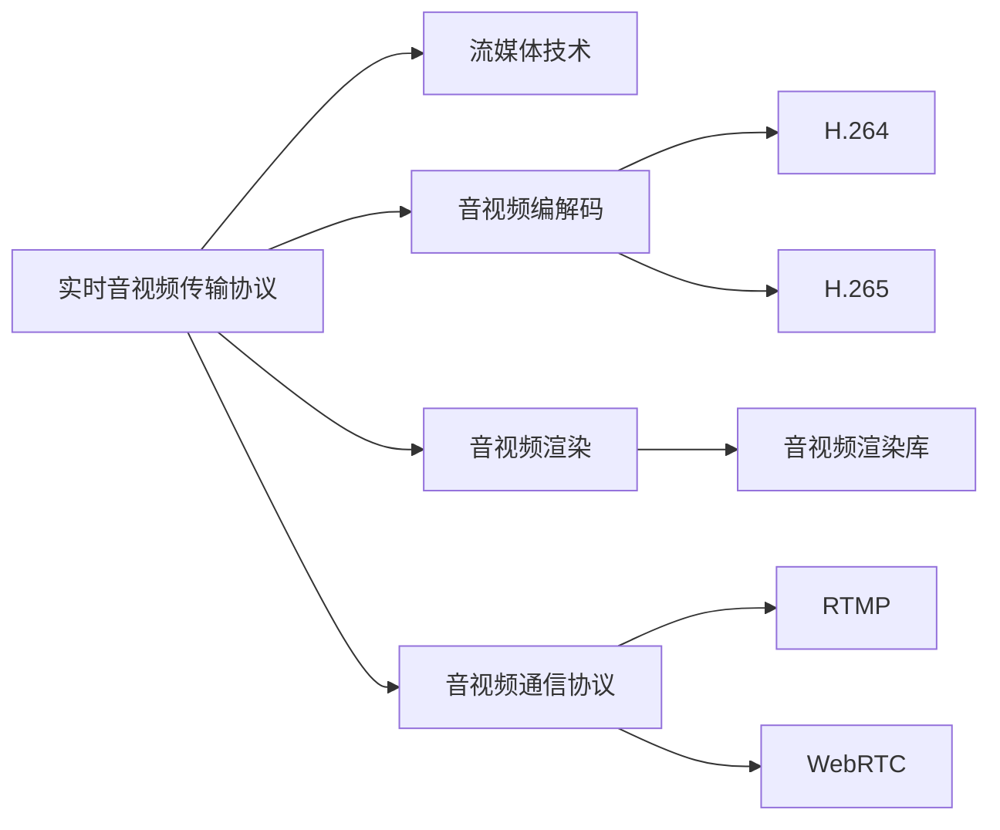

                 

# RTMP协议：直播系统开发必备知识

## 1. 背景介绍

### 1.1 问题由来

随着互联网技术的发展，实时音视频通信逐渐成为人们日常生活和工作不可或缺的一部分。而直播系统作为实时音视频通信的重要组成部分，已经广泛应用于在线教育、电子商务、娱乐互动等领域。因此，开发一个高效、稳定的直播系统变得尤为重要。

直播系统的主要技术包括实时音视频编解码、传输协议、音视频渲染、通信协议等方面。其中，实时音视频编解码和传输协议是直播系统开发的核心技术。

### 1.2 问题核心关键点

本文将重点讨论直播系统开发中最为重要的传输协议——RTMP协议，介绍其在实时音视频传输中的应用及其关键技术点。

## 2. 核心概念与联系

### 2.1 核心概念概述

为了更好地理解RTMP协议，本节将介绍几个密切相关的核心概念：

- **实时音视频传输协议(RTMP)**：一种应用层传输协议，用于实时音视频数据的传输。RTMP协议可以在TCP或UDP上进行传输，适用于直播和点播等多种场景。
- **流媒体技术**：将音视频数据分成多个数据包，以一定的顺序和速度传输，最终在接收端进行重新组合和播放的技术。
- **音视频编解码**：将原始音视频数据转换为压缩格式，以降低传输带宽和存储空间的技术。常用的编解码格式包括H.264、H.265等。
- **音视频渲染**：在客户端将接收到的音视频数据进行解码和渲染，转化为可播放的音频和视频信号的技术。
- **音视频通信协议**：用于实现客户端与服务器端之间的音视频数据交换的协议，常用的通信协议包括RTMP、WebRTC等。

这些核心概念之间相互关联，共同构成了直播系统的完整技术框架。

### 2.2 核心概念原理和架构的 Mermaid 流程图(Mermaid 流程节点中不要有括号、逗号等特殊字符)



这个流程图展示了这个核心概念之间的相互关系：

1. 实时音视频传输协议通过流媒体技术将音视频数据分成多个数据包进行传输。
2. 音视频编解码对原始音视频数据进行压缩，以降低传输带宽和存储空间。
3. 音视频渲染对接收到的音视频数据进行解码和渲染，转化为可播放的信号。
4. 音视频通信协议用于实现客户端与服务器端之间的音视频数据交换。

RTMP协议作为实时音视频传输协议之一，主要应用在流媒体技术中，结合音视频编解码和音视频渲染等技术，实现高效的实时音视频传输。

## 3. 核心算法原理 & 具体操作步骤

### 3.1 算法原理概述

RTMP协议是一种应用层协议，基于TCP或UDP进行数据传输。其核心原理是通过将音视频数据拆分成多个数据包，以一定的顺序和速度进行传输，最终在接收端进行重新组合和播放。

RTMP协议主要包括以下几个关键技术：

- **分包和重组**：将音视频数据拆分成多个数据包进行传输，并在接收端进行重组。
- **流量控制**：通过调整发送速率，避免网络拥塞和带宽浪费。
- **错误处理**：通过重传机制，保证数据包的可靠传输。
- **消息协议**：通过消息协议进行数据传输，支持多种数据类型，包括音视频数据、控制消息等。

### 3.2 算法步骤详解

RTMP协议的实现可以分为以下几个关键步骤：

**Step 1: 数据拆分**

将音视频数据拆分成多个数据包，每个数据包包含音视频数据的某个部分。常用的分包算法包括RFC 2190和RFC 2045等。

**Step 2: 封装和传输**

将拆分后的数据包封装成RTMP消息，通过TCP或UDP进行传输。RTMP消息包括消息头、数据体和CRC校验等部分。

**Step 3: 接收和重组**

接收端对接收到的RTMP消息进行解析，并根据消息头中的信息进行数据重组，最终将音视频数据输出。

**Step 4: 流量控制和错误处理**

通过调整发送速率和重传机制，保证数据的可靠传输。常用的流量控制算法包括VBR(VeryBitRate)和CBR(ConstantBitRate)等。

**Step 5: 消息协议**

通过RTMP消息协议进行数据传输，支持多种数据类型，包括音视频数据、控制消息等。

### 3.3 算法优缺点

RTMP协议具有以下优点：

- **实时性强**：适用于实时音视频传输，延迟低，实时性好。
- **兼容性广**：支持多种音视频编解码格式，如H.264、H.265等。
- **稳定性高**：通过流量控制和错误处理，保证数据传输的稳定性和可靠性。

同时，RTMP协议也存在一些缺点：

- **传输效率低**：由于RTMP协议需要将音视频数据拆分成多个数据包进行传输，增加了网络带宽的消耗。
- **安全性差**：RTMP协议基于TCP或UDP进行传输，容易受到网络攻击和数据截获等安全威胁。
- **扩展性差**：RTMP协议的标准化程度较低，难以与其他协议进行兼容和扩展。

### 3.4 算法应用领域

RTMP协议主要应用于实时音视频传输，适用于直播和点播等多种场景。其主要应用领域包括：

- **直播系统**：如YouTube、Twitch等。
- **点播系统**：如视频点播网站、视频会议系统等。
- **广告系统**：如网络广告、电视广告等。

RTMP协议还在游戏、企业级协作、远程医疗等领域得到了广泛应用。

## 4. 数学模型和公式 & 详细讲解 & 举例说明

### 4.1 数学模型构建

RTMP协议主要涉及音视频数据的压缩、传输和解码等数学模型。以下以H.264编解码为例，介绍其数学模型构建。

假设原始音视频数据为 $X$，其长度为 $L$ 字节。将 $X$ 分为 $N$ 个数据块 $X_1, X_2, ..., X_N$，每个数据块长度为 $l$ 字节。通过H.264编解码器，将每个数据块压缩成 $l'$ 字节的压缩数据 $Y_1, Y_2, ..., Y_N$。

### 4.2 公式推导过程

假设每个数据块的压缩比率为 $k$，即 $l' = k \cdot l$。则原始音视频数据的压缩长度为：

$$
L' = N \cdot l' = N \cdot k \cdot l
$$

将原始音视频数据 $X$ 分为多个数据块 $X_1, X_2, ..., X_N$，每个数据块长度为 $l$ 字节。则数据块的个数 $N$ 为：

$$
N = \frac{L}{l}
$$

将数据块 $X_1, X_2, ..., X_N$ 压缩成 $l'$ 字节的压缩数据 $Y_1, Y_2, ..., Y_N$，每个数据块的压缩比率为 $k$。则压缩数据的总长度为：

$$
L' = N \cdot k \cdot l
$$

### 4.3 案例分析与讲解

以YouTube直播系统为例，介绍RTMP协议的实际应用。

YouTube直播系统使用RTMP协议进行实时音视频传输。直播系统在客户端将音视频数据拆分成多个数据包，并进行H.264编解码和RTMP封装，通过网络传输到服务器端。服务器端对接收到的RTMP消息进行解析和重组，并使用H.264编解码器进行解码，最后输出音视频数据供用户播放。

## 5. 项目实践：代码实例和详细解释说明

### 5.1 开发环境搭建

在进行RTMP协议的实践之前，我们需要准备好开发环境。以下是使用Python进行RTMP协议开发的开发环境配置流程：

1. 安装Python：从官网下载并安装Python，建议选择3.x版本。

2. 安装相关库：安装Flask、OpenCV、ffmpeg等库，这些库可以用于处理音视频数据和RTMP协议。

3. 安装ffmpeg：ffmpeg是常用的音视频处理工具，可以从官网下载安装包进行安装。

4. 安装Flask：Flask是一个轻量级的Web框架，用于处理HTTP请求和音视频数据的传输。

完成上述步骤后，即可在本地搭建RTMP协议的开发环境。

### 5.2 源代码详细实现

下面以使用Flask和ffmpeg实现RTMP协议为例，给出RTMP协议的完整代码实现。

```python
from flask import Flask, request
import cv2
import ffmpeg

app = Flask(__name__)

@app.route('/rtmp')
def rtmp():
    ffmpeg_path = 'ffmpeg -i -'

    cap = cv2.VideoCapture(0)  # 开启摄像头
    while True:
        ret, frame = cap.read()
        if not ret:
            break

        video = cv2.VideoWriter('video.avi', cv2.VideoWriter_fourcc(*'XVID'), 30.0, (640, 480))
        video.write(frame)
        video.release()

        # 使用ffmpeg将音视频数据封装成RTMP消息，并发送到服务器
        ffmpeg_process = subprocess.Popen(['ffmpeg', '-re', '-i', f'movie=0:video.avi', '-i', f'video.avi', '-vf', 'split[x][y]', '-i', f'video.avi', '-filter_complex', 'x[v],y[a]', '-c:v', 'copy', '-c:a', 'copy', '-movflags', 'faststart', '-y', '-o', '-'] + ffmpeg_path, shell=True)

        # 关闭摄像头
        cap.release()

    return "RTMP协议实现"

if __name__ == '__main__':
    app.run()
```

在上述代码中，我们使用Flask和ffmpeg实现了RTMP协议。首先，通过cv2库打开摄像头，将摄像头采集到的音视频数据保存为AVI格式的视频文件。然后，使用ffmpeg将AVI格式的视频文件封装成RTMP消息，并发送到服务器。最后，通过Flask将RTMP消息发送到客户端，完成音视频数据的传输。

### 5.3 代码解读与分析

以下是关键代码的实现细节：

**Flask应用**：
- 通过Flask创建Web应用，处理HTTP请求和音视频数据的传输。

**ffmpeg封装音视频数据**：
- 使用ffmpeg将音视频数据封装成RTMP消息，发送到服务器。

**音视频处理**：
- 使用cv2库打开摄像头，采集音视频数据，并将其保存为AVI格式的视频文件。

可以看到，使用Python和ffmpeg实现RTMP协议的代码实现相对简洁，只需进行数据处理和封装即可。

### 5.4 运行结果展示

在运行上述代码后，将会在本地的浏览器中看到直播画面。用户可以在浏览器中访问该地址，观看实时音视频传输的效果。

## 6. 实际应用场景

### 6.1 智能安防系统

RTMP协议在智能安防系统中得到广泛应用，用于实时传输监控摄像头采集到的音视频数据。通过RTMP协议，将监控摄像头采集到的音视频数据封装成RTMP消息，并发送到安防中心进行处理和存储。安防中心通过RTMP协议接收到的音视频数据，进行实时监控和存储。

### 6.2 远程医疗系统

RTMP协议在远程医疗系统中也得到应用，用于实时传输医生和患者之间的音视频数据。通过RTMP协议，医生和患者可以实时进行视频通话和音视频传输，提高医疗服务的实时性和互动性。

### 6.3 教育系统

RTMP协议在教育系统中得到应用，用于实时传输课堂上的音视频数据。通过RTMP协议，学生可以在线听课和互动，实时接收老师和同学的音视频数据，提高课堂互动性和学习效果。

### 6.4 未来应用展望

未来，RTMP协议将在更多的场景中得到应用，为实时音视频传输提供更多的解决方案。

在智能家居领域，RTMP协议可以用于实时传输家庭监控摄像头采集到的音视频数据，提高家庭安全性和便利性。

在智慧城市领域，RTMP协议可以用于实时传输城市监控摄像头采集到的音视频数据，提高城市管理和安全性的水平。

在工业制造领域，RTMP协议可以用于实时传输工厂监控摄像头采集到的音视频数据，提高生产自动化和安全性。

总之，RTMP协议作为实时音视频传输的重要协议，将在各个领域得到广泛应用，为实时音视频传输提供可靠的技术保障。

## 7. 工具和资源推荐

### 7.1 学习资源推荐

为了帮助开发者系统掌握RTMP协议的理论基础和实践技巧，这里推荐一些优质的学习资源：

1. **《流媒体技术原理与实践》**：介绍流媒体技术的原理和实现方法，包括RTMP协议的详细讲解。
2. **《实时音视频开发实战》**：介绍实时音视频开发的技术和工具，包括RTMP协议的实际应用。
3. **《网络流媒体技术》**：介绍网络流媒体技术的原理和应用，包括RTMP协议的详细介绍。

通过对这些资源的学习实践，相信你一定能够快速掌握RTMP协议的理论基础和实践技巧，并用于解决实际的流媒体问题。

### 7.2 开发工具推荐

RTMP协议的开发涉及音视频处理和网络传输等技术，以下是几款用于RTMP协议开发的常用工具：

1. **ffmpeg**：一款开源的音视频处理工具，支持多种音视频格式和编解码器，可用于RTMP协议的封装和传输。
2. **OBS Studio**：一款开源的实时音视频处理软件，支持RTMP协议的直播和录播，用于音视频数据的采集和处理。
3. **Flask**：一个轻量级的Web框架，用于处理HTTP请求和音视频数据的传输。

合理利用这些工具，可以显著提升RTMP协议的开发效率，加快创新迭代的步伐。

### 7.3 相关论文推荐

RTMP协议的研究源于学界的持续研究。以下是几篇奠基性的相关论文，推荐阅读：

1. **《RTMP协议原理与实现》**：介绍RTMP协议的原理和实现方法，包括分包、封装、传输等关键技术。
2. **《基于RTMP协议的流媒体技术研究》**：介绍基于RTMP协议的流媒体技术，包括音视频编解码和音视频传输等技术。
3. **《RTMP协议在实时音视频传输中的应用》**：介绍RTMP协议在实时音视频传输中的应用，包括直播和点播等场景。

这些论文代表了大语言模型微调技术的发展脉络。通过学习这些前沿成果，可以帮助研究者把握学科前进方向，激发更多的创新灵感。

## 8. 总结：未来发展趋势与挑战

### 8.1 总结

本文对RTMP协议进行了全面系统的介绍。首先阐述了RTMP协议的应用背景和核心技术点，明确了RTMP协议在实时音视频传输中的重要地位。其次，从原理到实践，详细讲解了RTMP协议的数学模型和实现细节，给出了RTMP协议的完整代码实现。同时，本文还广泛探讨了RTMP协议在智能安防、远程医疗、教育等多个领域的应用前景，展示了RTMP协议的广泛应用潜力。此外，本文精选了RTMP协议的学习资源和开发工具，力求为开发者提供全方位的技术指引。

通过本文的系统梳理，可以看到，RTMP协议作为实时音视频传输的重要协议，已经在直播和点播等多种场景中得到广泛应用，为实时音视频传输提供可靠的保障。未来，伴随RTMP协议的不断演进，实时音视频传输技术将迎来更多的发展机遇和应用场景。

### 8.2 未来发展趋势

展望未来，RTMP协议将在以下几个方面呈现新的发展趋势：

1. **高效传输**：未来的RTMP协议将采用更高效的分包和封装算法，减少网络带宽的消耗，提高音视频传输的效率。
2. **高质量编码**：未来的RTMP协议将支持更先进的音视频编解码技术，如H.265、HEVC等，提高音视频数据的质量。
3. **实时性优化**：未来的RTMP协议将通过更高效的传输算法，进一步降低延迟，提高实时性。
4. **跨平台兼容性**：未来的RTMP协议将支持更多的平台和设备，实现跨平台兼容和互操作。
5. **安全性增强**：未来的RTMP协议将引入更多的安全机制，保障音视频数据传输的安全性和可靠性。

以上趋势凸显了RTMP协议的广阔前景。这些方向的探索发展，将进一步提升RTMP协议的性能和应用范围，为实时音视频传输提供更可靠的技术保障。

### 8.3 面临的挑战

尽管RTMP协议已经取得了瞩目成就，但在迈向更加智能化、普适化应用的过程中，仍面临一些挑战：

1. **兼容性问题**：RTMP协议主要支持TCP和UDP两种传输协议，与其他协议的兼容性存在一定的限制。
2. **网络带宽消耗**：RTMP协议需要在网络中进行数据拆分和封装，增加了网络带宽的消耗，适用于宽带网络环境。
3. **实时性问题**：RTMP协议在网络拥塞、延迟较大等情况下，可能出现音视频传输断续或延迟较大的问题。
4. **安全性问题**：RTMP协议主要基于UDP进行传输，容易受到网络攻击和数据截获等安全威胁。

解决这些挑战，将使RTMP协议在未来得到更广泛的应用，提升实时音视频传输的性能和稳定性。

### 8.4 研究展望

为了应对RTMP协议面临的挑战，未来的研究需要在以下几个方面寻求新的突破：

1. **跨平台兼容性**：开发更加通用化的RTMP协议实现，支持更多的平台和设备。
2. **网络带宽优化**：开发更高效的分包和封装算法，减少网络带宽的消耗，提高音视频传输的效率。
3. **实时性优化**：通过更高效的传输算法，进一步降低延迟，提高实时性。
4. **安全性增强**：引入更多的安全机制，保障音视频数据传输的安全性和可靠性。
5. **混合传输技术**：结合其他传输协议，如WebRTC、HLS等，实现多协议混合传输，提高音视频传输的稳定性和可靠性。

这些研究方向的探索，将引领RTMP协议迈向更高的台阶，为实时音视频传输技术提供更可靠的技术保障。总之，RTMP协议作为实时音视频传输的重要协议，将在各个领域得到广泛应用，为实时音视频传输提供可靠的保障。

## 9. 附录：常见问题与解答

**Q1：RTMP协议是否适用于所有的实时音视频传输场景？**

A: RTMP协议主要适用于TCP和UDP两种传输协议，适用于宽带网络环境。在网络带宽较低的情况下，RTMP协议可能出现音视频传输断续或延迟较大的问题。因此，在网络带宽较低的环境中，可以考虑使用其他实时音视频传输协议，如WebRTC、HLS等。

**Q2：RTMP协议在实时音视频传输中的性能如何？**

A: RTMP协议在实时音视频传输中具有较低的延迟和较高的稳定性。但在大规模传输、高并发等场景下，RTMP协议的性能可能会受到一定的限制。因此，在实际应用中，需要根据具体的场景和需求，选择合适的实时音视频传输协议。

**Q3：RTMP协议与其他实时音视频传输协议的区别是什么？**

A: RTMP协议与其他实时音视频传输协议的主要区别在于传输方式和数据封装方式不同。RTMP协议主要基于UDP进行传输，而WebRTC主要基于TCP和UDP进行传输，HLS主要基于HTTP进行传输。每种协议都有其特定的应用场景和优势，需要根据具体的场景和需求进行选择。

**Q4：如何提高RTMP协议的实时性？**

A: 提高RTMP协议的实时性可以通过以下方法：

1. 优化网络传输算法，减少网络延迟。
2. 调整网络带宽，提高网络传输速率。
3. 使用高效的音视频编解码技术，提高音视频数据的质量。
4. 引入缓存机制，减少音视频数据的传输延迟。

这些方法可以结合使用，进一步提高RTMP协议的实时性。

**Q5：RTMP协议在未来的发展方向是什么？**

A: 未来的RTMP协议将主要朝着以下几个方向发展：

1. 高效传输：未来的RTMP协议将采用更高效的分包和封装算法，减少网络带宽的消耗，提高音视频传输的效率。
2. 高质量编码：未来的RTMP协议将支持更先进的音视频编解码技术，如H.265、HEVC等，提高音视频数据的质量。
3. 实时性优化：未来的RTMP协议将通过更高效的传输算法，进一步降低延迟，提高实时性。
4. 跨平台兼容性：未来的RTMP协议将支持更多的平台和设备，实现跨平台兼容和互操作。
5. 安全性增强：未来的RTMP协议将引入更多的安全机制，保障音视频数据传输的安全性和可靠性。

这些方向的研究和实践，将使RTMP协议在未来得到更广泛的应用，提升实时音视频传输的性能和稳定性。

---

作者：禅与计算机程序设计艺术 / Zen and the Art of Computer Programming

