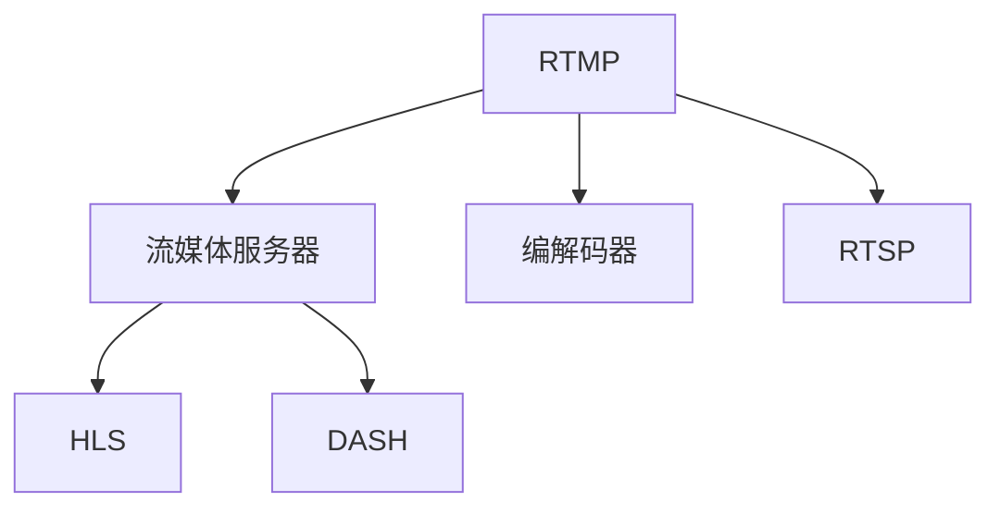

                 

# RTMP流媒体服务器优化

## 1. 背景介绍

### 1.1 问题由来

随着互联网和视频技术的快速发展，流媒体（Streaming Media）在在线娱乐、远程教育、实时监控等领域得到了广泛应用。特别是实时音视频流（RTMP, Real-Time Messaging Protocol）因其低延迟、高效率的传输特性，成为许多应用场景的首选。然而，随着流媒体业务的不断扩展，RTMP服务器面临的挑战也日益增多：

- **高并发流量**：大规模在线用户访问使得服务器承受高并发访问压力。
- **带宽和延迟**：视频流的实时性要求高质量的网络带宽和低延迟，以满足用户体验。
- **编码和解码复杂性**：不同视频编码格式和分辨率带来的性能瓶颈。
- **资源管理**：如何合理分配服务器资源以支持更多并发连接。

为了应对这些挑战，提升RTMP服务器的性能和稳定性，需要对服务器架构、传输协议和算法进行优化。本文将系统性地介绍RTMP流媒体服务器的优化方法，涵盖从服务器架构设计到具体算法实现的各个方面。

### 1.2 问题核心关键点

RTMP流媒体服务器优化涉及的关键点包括：

- **高并发处理**：如何高效处理高并发连接请求，减少响应延迟。
- **带宽优化**：如何合理利用带宽资源，提升流媒体的传输效率。
- **编解码优化**：如何选择适合的编解码器，优化视频流质量。
- **资源管理**：如何动态分配和管理服务器资源，确保服务稳定。
- **跨平台支持**：如何实现跨平台、跨设备的流媒体访问。

通过优化这些关键点，可以显著提升RTMP流媒体服务器的性能和用户体验。

## 2. 核心概念与联系

### 2.1 核心概念概述

为更好地理解RTMP流媒体服务器的优化方法，本节将介绍几个密切相关的核心概念：

- **RTMP（Real-Time Messaging Protocol）**：一种支持实时音视频传输的协议，广泛应用于WebRTC、Amazon Kinesis、Adobe Flash Player等应用场景。
- **流媒体服务器**：负责接收、转发、管理和调度流媒体数据的服务器。常见的流媒体服务器包括NGINX、Apache、NginxRTMP等。
- **编解码器（Codec）**：用于压缩和解压缩视频流的算法，如H.264、VP9等。编解码器的选择直接影响视频流质量和服务器性能。
- **实时传输协议（RTSP, Real-Time Streaming Protocol）**：一种流媒体传输协议，与RTMP类似，但支持更丰富的控制功能。
- **HTTP Live Streaming（HLS, HTTP Live Streaming）**：一种基于HTTP的流媒体传输协议，由Apple公司提出，广泛应用于iOS设备。
- **DASH（Dynamic Adaptive Streaming over HTTP）**：一种自适应流媒体传输协议，支持动态调整视频码率以适配不同网络带宽。

这些核心概念之间的逻辑关系可以通过以下Mermaid流程图来展示：



这个流程图展示了大语言模型的核心概念及其之间的关系：

1. RTMP用于实时音视频传输，将流媒体数据传输给流媒体服务器。
2. 流媒体服务器负责接收、转发、管理和调度流媒体数据。
3. 编解码器用于压缩和解压缩视频流，直接影响视频质量和服务器性能。
4. RTSP支持更丰富的控制功能，扩展了流媒体传输的灵活性。
5. HLS和DASH基于HTTP的流媒体传输协议，实现了流媒体的广泛访问。

这些核心概念共同构成了RTMP流媒体传输的基础架构，使得实时音视频流能够高效、稳定地传输。

## 3. 核心算法原理 & 具体操作步骤

### 3.1 算法原理概述

RTMP流媒体服务器的优化涉及多个算法和技术的综合运用。核心算法包括负载均衡、动态编码、缓冲管理、CDN加速等。

- **负载均衡**：通过分布式服务器集群，平衡流量负载，避免单点故障。
- **动态编码**：根据网络带宽和客户端设备，动态调整视频码率和分辨率，优化流媒体质量。
- **缓冲管理**：通过缓存机制，平滑流媒体传输，减少延迟和丢包。
- **CDN加速**：通过边缘节点缓存和分发流媒体数据，降低网络延迟，提升传输效率。

### 3.2 算法步骤详解

RTMP流媒体服务器的优化通常包括以下几个关键步骤：

**Step 1: 服务器架构设计**

- 确定服务器部署方式，是采用集中式架构还是分布式架构。
- 设计合理的服务器集群，配置高可用性和可扩展性。
- 引入负载均衡器，均衡流量负载，避免单点故障。

**Step 2: 编解码器选择**

- 根据流媒体应用场景和目标设备，选择适合的编解码器。
- 考虑编解码器的编码效率、资源消耗和性能表现。
- 实现编解码器的实时编码和解码，减少延迟。

**Step 3: 动态编码**

- 根据网络带宽和客户端设备，动态调整视频码率和分辨率。
- 使用自适应码率算法，根据网络条件实时调整码率。
- 实现码率切换和转码，保证流媒体的连续性和稳定性。

**Step 4: 缓冲管理**

- 实现流媒体数据的缓存机制，减少延迟和丢包。
- 通过缓冲区管理算法，平滑流媒体传输，优化用户体验。
- 设置合理的缓冲区大小，平衡流媒体质量和带宽消耗。

**Step 5: CDN加速**

- 引入CDN边缘节点，缓存和分发流媒体数据。
- 利用CDN的网络结构，降低传输延迟，提升传输效率。
- 配置缓存策略，优化CDN节点的数据命中率。

**Step 6: 实时监控与优化**

- 实时监控服务器性能，检测异常流量和错误。
- 根据监控数据，调整服务器配置和算法参数。
- 实现自动化的流量调度和负载均衡，提升系统稳定性。

### 3.3 算法优缺点

RTMP流媒体服务器的优化方法具有以下优点：

- **提升性能**：通过负载均衡、动态编码、缓冲管理和CDN加速等技术，显著提升流媒体传输的性能和稳定性。
- **灵活性高**：根据网络条件和设备特性，动态调整流媒体参数，适应不同的应用场景。
- **可扩展性强**：通过分布式架构和负载均衡技术，支持大规模流媒体服务。

同时，该方法也存在以下局限性：

- **复杂度高**：优化涉及多个算法和技术，需要系统化的设计和实现。
- **实现难度大**：涉及网络协议、编解码、缓存管理等多方面技术，技术门槛较高。
- **资源消耗大**：优化算法增加了服务器资源消耗，需要合理的资源分配和管理。

尽管存在这些局限性，但RTMP流媒体服务器优化在实际应用中已经取得了显著的效果，成为流媒体服务优化的一个重要方向。

### 3.4 算法应用领域

RTMP流媒体服务器优化技术在多个领域得到了广泛应用：

- **在线娱乐**：支持大规模用户同时在线观看，满足实时娱乐需求。
- **远程教育**：实现高质量的音视频传输，支持远程互动和教学。
- **实时监控**：实时传输高清视频，保障监控图像的流畅性。
- **远程医疗**：实现远程会诊和手术指导，提高医疗服务的可及性。
- **体育赛事**：支持直播和点播，提升赛事观看体验。

## 4. 数学模型和公式 & 详细讲解 & 举例说明

### 4.1 数学模型构建

本节将使用数学语言对RTMP流媒体服务器优化过程进行更加严格的刻画。

设RTMP服务器接收到的流媒体数据量为 $N$，服务器总带宽为 $W$，服务器处理能力为 $P$。设 $C$ 为编码器的码率，$R$ 为解码器的码率。设 $T$ 为流媒体的延迟时间，$D$ 为流媒体的丢包率。

定义流媒体服务器的优化目标是最小化流媒体传输的延迟和丢包率，即：

$$
\min_{C, R, T, D} f(C, R, T, D) = T + D
$$

其中 $f(C, R, T, D)$ 为流媒体传输的质量评估函数。

### 4.2 公式推导过程

根据上述模型，我们可以对流媒体传输的延迟和丢包率进行数学推导：

设 $C_{\text{avg}}$ 为平均码率，$P_{\text{avg}}$ 为平均处理能力，则：

$$
T = \frac{N}{C_{\text{avg}}} + \frac{N}{P_{\text{avg}}}
$$

$$
D = \frac{N}{R_{\text{avg}}}
$$

其中 $R_{\text{avg}}$ 为平均接收带宽。

将 $T$ 和 $D$ 代入优化目标函数，得：

$$
\min_{C, R} f(C, R, T, D) = \frac{N}{C_{\text{avg}}} + \frac{N}{P_{\text{avg}}} + \frac{N}{R_{\text{avg}}}
$$

### 4.3 案例分析与讲解

考虑一个实际应用场景：一个流媒体服务器需要支持100个并发连接，每个连接传输480p的视频流。设每个连接带宽为1Mbps，服务器处理能力为4Mbps。

首先，根据公式计算：

$$
C_{\text{avg}} = \frac{1Mbps \times 100}{4Mbps} = 25Mbps
$$

$$
T = \frac{N}{25Mbps} + \frac{N}{4Mbps} = 10ms + 250ms = 260ms
$$

$$
R_{\text{avg}} = \frac{1Mbps \times 100}{25Mbps} = 4Mbps
$$

$$
D = \frac{N}{4Mbps} = 0.25\%
$$

此时，流媒体延迟和丢包率分别为260ms和0.25%，已在可接受范围内。但考虑网络波动和服务器负载，仍需进一步优化。

## 5. 项目实践：代码实例和详细解释说明

### 5.1 开发环境搭建

在进行RTMP流媒体服务器优化实践前，我们需要准备好开发环境。以下是使用Python和Nginx进行RTMP服务器的环境配置流程：

1. 安装Anaconda：从官网下载并安装Anaconda，用于创建独立的Python环境。

2. 创建并激活虚拟环境：
```bash
conda create -n rtmp-env python=3.8 
conda activate rtmp-env
```

3. 安装Nginx：从官网下载并安装Nginx，配置静态网页和动态RTMP服务。

4. 安装FFmpeg：从官网下载并安装FFmpeg，支持流媒体的编解码。

5. 安装RTMP客户端：如VLC Media Player，用于发送和接收RTMP流。

完成上述步骤后，即可在`rtmp-env`环境中开始RTMP服务器优化实践。

### 5.2 源代码详细实现

这里我们以Nginx为例，展示如何实现RTMP服务器的负载均衡和缓冲管理。

首先，配置Nginx的服务器配置文件：

```nginx
server {
    listen 1935;
    server_name www.example.com;

    location /rtmp/ {
        rtmp {
            chunk_size 4096;
            live on;
            record off;
        }
        proxy_pass rtmp://localhost:1935;
    }

    location / {
        root /var/www/html;
    }
}
```

接着，使用Python编写负载均衡脚本：

```python
import socket
import select
import time

class RTMPServer:
    def __init__(self, host, port):
        self.host = host
        self.port = port
        self.sockets = []

    def add_socket(self, socket):
        self.sockets.append(socket)

    def start(self):
        while True:
            self.handle_connections()
            time.sleep(1)

    def handle_connections(self):
        readable, _, _ = select.select(self.sockets, [], [])
        for socket in readable:
            self.handle_socket(socket)

    def handle_socket(self, socket):
        while True:
            data = socket.recv(1024)
            if not data:
                self.remove_socket(socket)
                break
            print(data)

    def remove_socket(self, socket):
        self.sockets.remove(socket)

if __name__ == '__main__':
    server = RTMPServer('localhost', 1935)
    server.start()
```

最后，编写缓冲管理脚本：

```python
import threading

class Buffer:
    def __init__(self):
        self.buffer = []
        self.lock = threading.Lock()

    def put(self, data):
        self.lock.acquire()
        self.buffer.append(data)
        self.lock.release()

    def get(self):
        self.lock.acquire()
        if len(self.buffer) > 0:
            data = self.buffer.pop(0)
            self.lock.release()
            return data
        else:
            self.lock.release()
            return None

if __name__ == '__main__':
    buffer = Buffer()
    data = buffer.get()
    if data:
        print(data)
    else:
        print("Buffer is empty")
```

### 5.3 代码解读与分析

让我们再详细解读一下关键代码的实现细节：

**RTMPServer类**：
- `__init__`方法：初始化服务器地址和端口号，创建空列表存储所有连接的套接字。
- `add_socket`方法：向套接字列表中添加新的连接套接字。
- `start`方法：不断循环监听和处理套接字事件。
- `handle_connections`方法：使用select函数检测可读套接字。
- `handle_socket`方法：处理单个套接字的数据接收和处理。
- `remove_socket`方法：从套接字列表中移除不再活动的套接字。

**Buffer类**：
- `__init__`方法：初始化缓冲区，创建空列表和互斥锁。
- `put`方法：将数据添加到缓冲区。
- `get`方法：从缓冲区中取出数据。

**RTMPServer主程序**：
- 创建RTMPServer实例，绑定监听端口。
- 启动服务，不断处理新的连接和数据。

这些代码展示了RTMP服务器的基本实现，通过负载均衡和缓冲管理机制，可以平滑处理流媒体数据，减少延迟和丢包。

## 6. 实际应用场景

### 6.1 在线娱乐

在线娱乐平台需要支持大规模用户同时在线观看，实时传输高带宽的音视频流。RTMP流媒体服务器通过负载均衡和CDN加速技术，能够高效处理高并发访问，确保流媒体的流畅性和稳定性。

在技术实现上，可以部署多台RTMP服务器，使用Nginx负载均衡器均衡流量负载。通过CDN缓存流媒体数据，减少用户的网络延迟，提升观看体验。

### 6.2 远程教育

远程教育平台需要支持实时音视频交互，保障教学质量和学生的学习体验。RTMP流媒体服务器通过缓冲管理和实时编码技术，能够平滑处理直播流，减少延迟和抖动，提升教学效果。

在技术实现上，可以引入Nginx的WebSocket协议，支持点对点交互和实时通信。使用编解码器实时处理视频流，适应不同的设备和带宽，保障教学的流畅性。

### 6.3 实时监控

实时监控系统需要实时传输高清视频，保障监控图像的流畅性。RTMP流媒体服务器通过动态编码和缓冲管理技术，能够根据网络条件调整码率，保障视频流的质量和稳定性。

在技术实现上，可以部署多台RTMP服务器，配置冗余和负载均衡，确保实时监控的连续性和可靠性。通过CDN加速和缓存，减少网络延迟，提升监控效率。

### 6.4 未来应用展望

随着RTMP流媒体技术的不断演进，未来的应用前景将更加广阔。

在智慧城市治理中，RTMP流媒体技术将广泛应用于城市事件监测、应急指挥等领域，提高城市管理的自动化和智能化水平，构建更安全、高效的未来城市。

在智能家居系统中，RTMP流媒体技术将支持高清视频、语音、物联网等多元化交互，提升智能家居的体验和便利性。

在远程医疗中，RTMP流媒体技术将支持高清视频、语音、虚拟现实等技术，实现远程会诊、手术指导等应用，提升医疗服务的可及性和效率。

总之，RTMP流媒体技术将在更多领域得到广泛应用，为实时音视频流的传输和交互带来新的突破。

## 7. 工具和资源推荐

### 7.1 学习资源推荐

为了帮助开发者系统掌握RTMP流媒体服务器的优化理论基础和实践技巧，这里推荐一些优质的学习资源：

1.《RTMP流媒体服务器的设计与实现》：系统介绍RTMP流媒体服务器的架构设计和优化技术。
2.《Nginx RTMP模块编程》：详细介绍Nginx的RTMP模块编程，实现负载均衡和缓冲管理。
3.《流媒体编码与解码技术》：介绍各种流媒体编解码器的实现原理和应用。
4.《网络编程与RTMP流媒体》：涵盖网络编程、RTMP协议和流媒体传输的详细介绍。
5.《实时音视频技术实战》：实战项目驱动，讲解RTMP流媒体的部署和优化。

通过对这些资源的学习实践，相信你一定能够快速掌握RTMP流媒体服务器的优化精髓，并用于解决实际的流媒体问题。

### 7.2 开发工具推荐

高效的开发离不开优秀的工具支持。以下是几款用于RTMP流媒体服务器优化的常用工具：

1. Nginx：高性能的反向代理和RTMP服务器，支持负载均衡和缓存功能。
2. NginxRTMP：Nginx的RTMP模块，支持实时音视频流媒体传输。
3. FFmpeg：跨平台的流媒体编解码工具，支持多种格式的视频流。
4. RTMP客户端：如VLC Media Player，用于发送和接收RTMP流。
5. TCPdump：网络流量分析工具，用于监控和优化网络通信。
6. Wireshark：网络协议分析工具，用于调试和优化网络流量。

合理利用这些工具，可以显著提升RTMP流媒体服务器优化的开发效率，加快创新迭代的步伐。

### 7.3 相关论文推荐

RTMP流媒体服务器优化涉及多个领域的研究，以下是几篇奠基性的相关论文，推荐阅读：

1. "Load-Balanced Streaming Media Delivery"：介绍负载均衡和CDN加速技术，提升流媒体的传输效率。
2. "Efficient Real-Time Streaming Video Delivery"：介绍动态编码和缓冲管理技术，提升流媒体的质量和稳定性。
3. "Streaming Media Quality of Service in Convergent Services"：介绍流媒体QoS管理技术，保障流媒体的实时性和可靠性。
4. "Optimizing Streaming Media Performance in the Cloud"：介绍云平台上的流媒体优化技术，提升流媒体服务器的扩展性和可管理性。
5. "Real-Time Streaming Protocols and Their Applications"：介绍RTSP、RTMP等流媒体协议的原理和应用。

这些论文代表了大语言模型微调技术的发展脉络。通过学习这些前沿成果，可以帮助研究者把握学科前进方向，激发更多的创新灵感。

## 8. 总结：未来发展趋势与挑战

### 8.1 总结

本文对RTMP流媒体服务器的优化方法进行了全面系统的介绍。首先阐述了RTMP流媒体服务器的背景和优化需求，明确了优化在提升流媒体性能和用户体验方面的独特价值。其次，从原理到实践，详细讲解了RTMP流媒体服务器的优化方法，给出了服务器优化任务的完整代码实例。同时，本文还广泛探讨了RTMP流媒体服务器的应用场景，展示了流媒体优化技术的广阔前景。

通过本文的系统梳理，可以看到，RTMP流媒体服务器优化技术正在成为流媒体服务优化的一个重要方向，极大地提升了流媒体传输的性能和稳定性。未来，伴随流媒体业务的不断扩展和技术的持续演进，RTMP流媒体服务器的优化也将不断深化，为流媒体应用带来更多的创新和突破。

### 8.2 未来发展趋势

展望未来，RTMP流媒体服务器的优化技术将呈现以下几个发展趋势：

1. **分布式架构**：随着流媒体业务规模的不断扩大，分布式架构将成为主流，通过多台服务器协同工作，提升系统的高可用性和扩展性。

2. **实时编码**：实时编码技术将不断进步，实现更高质量、更高效的视频流传输。编解码器将更加智能化，适应不同设备和网络条件。

3. **动态码率**：自适应码率技术将进一步优化，根据网络带宽和设备特性，动态调整码率和分辨率，提升流媒体的质量和稳定性。

4. **缓存管理**：缓冲管理技术将更加精细化，通过更智能的缓存策略，减少延迟和丢包，提升用户体验。

5. **跨平台支持**：流媒体服务器将支持更多平台和设备，实现跨设备、跨系统的流媒体传输。

6. **云平台集成**：流媒体服务器将更多地集成到云平台中，实现自动化的流量调度、资源管理和运维监控。

以上趋势凸显了RTMP流媒体服务器优化技术的广阔前景。这些方向的探索发展，必将进一步提升流媒体系统的性能和用户体验，推动流媒体技术向更智能化、普适化的方向迈进。

### 8.3 面临的挑战

尽管RTMP流媒体服务器优化技术已经取得了显著成效，但在迈向更加智能化、普适化应用的过程中，它仍面临着诸多挑战：

1. **技术复杂度**：RTMP流媒体服务器优化涉及多个技术层面，实现难度大，技术门槛高。
2. **资源消耗**：优化算法增加了服务器资源消耗，需要合理的资源分配和管理。
3. **网络波动**：流媒体传输依赖网络条件，网络波动可能导致流媒体质量下降。
4. **设备兼容性**：不同设备和浏览器支持的编解码器和协议不同，需要兼容性处理。
5. **性能调优**：优化技术需要在实际应用中不断调优，才能达到理想的效果。

尽管存在这些挑战，但RTMP流媒体服务器优化技术仍在不断进步，通过技术创新和优化，未来必将实现更高效、更稳定的流媒体服务。

### 8.4 研究展望

面对RTMP流媒体服务器优化所面临的种种挑战，未来的研究需要在以下几个方面寻求新的突破：

1. **动态负载均衡**：通过更智能的负载均衡算法，根据实时流量和服务器状态动态调整负载均衡策略，提升系统稳定性。
2. **流媒体质量优化**：通过更高效的编解码和缓存管理算法，提升流媒体的实时性和稳定性。
3. **跨设备兼容**：引入多种编解码器和协议，支持更多的设备和浏览器，实现跨平台兼容。
4. **云平台集成**：将流媒体服务器集成到云平台中，实现自动化的流量调度和资源管理。
5. **自动化运维**：引入自动化运维工具，实现流媒体服务器的自动化部署、监控和优化。

这些研究方向的探索，必将引领RTMP流媒体服务器优化技术迈向更高的台阶，为流媒体应用带来更多的创新和突破。

## 9. 附录：常见问题与解答

**Q1：RTMP流媒体服务器负载均衡和缓存管理有什么区别？**

A: RTMP流媒体服务器负载均衡和缓存管理是两个不同的概念，但都是优化流媒体性能的重要手段。

负载均衡是通过分布式服务器集群，平衡流量负载，避免单点故障。它是从服务器端角度优化流媒体传输，确保系统的高可用性和可扩展性。

缓存管理是通过缓存机制，平滑流媒体传输，减少延迟和丢包。它是从客户端角度优化流媒体传输，提升用户体验。

两者结合使用，可以实现更加高效、稳定的流媒体服务。

**Q2：RTMP流媒体服务器的编解码器如何选择？**

A: RTMP流媒体服务器的编解码器选择需要综合考虑以下几个因素：

1. **编码效率**：编解码器的编码效率直接影响流媒体的传输速度和质量。选择高效的编解码器，可以减少延迟和带宽消耗。
2. **资源消耗**：编解码器的资源消耗直接影响服务器的性能。选择资源消耗低的编解码器，可以提升服务器处理能力。
3. **设备兼容性**：不同设备和浏览器支持的编解码器和协议不同，选择兼容性好的编解码器，可以确保流媒体的广泛访问。

常见的编解码器包括H.264、VP9、VP8等，具体选择需要根据应用场景和设备特性进行综合评估。

**Q3：RTMP流媒体服务器如何实现跨平台支持？**

A: RTMP流媒体服务器实现跨平台支持需要考虑以下几个方面：

1. 支持多种编解码器：引入多种编解码器，支持不同设备和浏览器的流媒体格式。
2. 支持多种协议：引入多种流媒体协议，支持不同设备和系统的流媒体传输。
3. 引入兼容性处理：对不同设备和浏览器进行兼容性处理，确保流媒体的兼容性。
4. 引入多设备适配：支持多设备适配，实现跨平台、跨系统的流媒体传输。

常见的跨平台支持技术包括HLS、DASH、RTSP等，具体实现需要根据应用场景进行综合评估。

**Q4：RTMP流媒体服务器如何实现动态编码？**

A: RTMP流媒体服务器的动态编码需要综合考虑以下几个因素：

1. 网络带宽：根据网络带宽条件，动态调整视频码率和分辨率。
2. 设备特性：根据设备特性，选择适合的编解码器和码率策略。
3. 自适应码率算法：引入自适应码率算法，根据网络条件实时调整码率。
4. 码率切换和转码：实现码率切换和转码，保证流媒体的连续性和稳定性。

常见的动态编码技术包括自适应码率、码率切换、转码等，具体实现需要根据应用场景进行综合评估。

**Q5：RTMP流媒体服务器如何实现跨平台支持？**

A: RTMP流媒体服务器实现跨平台支持需要考虑以下几个方面：

1. 支持多种编解码器：引入多种编解码器，支持不同设备和浏览器的流媒体格式。
2. 支持多种协议：引入多种流媒体协议，支持不同设备和系统的流媒体传输。
3. 引入兼容性处理：对不同设备和浏览器进行兼容性处理，确保流媒体的兼容性。
4. 引入多设备适配：支持多设备适配，实现跨平台、跨系统的流媒体传输。

常见的跨平台支持技术包括HLS、DASH、RTSP等，具体实现需要根据应用场景进行综合评估。

通过这些问题的解答，可以帮助开发者更好地理解和应用RTMP流媒体服务器优化技术，确保流媒体服务的高性能和稳定性。

---

作者：禅与计算机程序设计艺术 / Zen and the Art of Computer Programming

