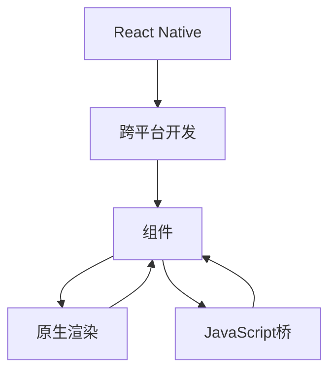

                 

# React Native 跨平台开发优势：高效构建多平台应用

> 关键词：React Native, 跨平台开发, 高效, 构建, 多平台应用

## 1. 背景介绍

随着移动互联网的发展，移动应用成为企业和个人不可或缺的重要资产。然而，开发原生应用耗时耗力，且需要分别针对iOS和Android系统进行代码实现，导致成本高、开发周期长。为了解决这个问题，跨平台开发技术应运而生，其中React Native成为近年来最受欢迎的跨平台开发框架之一。

### 1.1 问题由来

移动应用的开发面临以下几大问题：

1. **开发成本高**：开发原生应用需要分别编写iOS和Android代码，每个平台的学习成本和开发成本都较高。
2. **开发周期长**：不同平台有着不同的开发标准和框架，需要分别编写代码，开发周期较长。
3. **维护难度大**：原生应用维护难度大，需要分别针对不同平台进行调试和优化。
4. **更新不灵活**：原生应用更新需要分别发布，发布周期较长，用户体验不统一。

为了解决上述问题，跨平台开发技术应运而生。React Native正是基于这些需求，开发出一套能够实现跨平台开发的框架，使得开发者可以用一套代码构建多平台应用。

## 2. 核心概念与联系

### 2.1 核心概念概述

为了更好地理解React Native，首先需要了解一些核心概念：

- **React Native**：一个基于React的跨平台移动开发框架，允许开发者用JavaScript和React编写原生应用。
- **跨平台开发**：一种开发技术，允许开发者使用一套代码构建多个平台的移动应用，提高开发效率，降低开发成本。
- **组件**：React Native中最重要的概念之一，它是构建用户界面的基本单元，类似于原生UI控件。
- **原生渲染**：React Native通过Native Modules将JavaScript代码渲染到原生平台上，从而获得高性能和原生体验。
- **JavaScript桥**：React Native中用于JavaScript和Native模块通信的桥梁，使得JavaScript可以调用Native模块，反之亦然。

这些核心概念构成了React Native的基础，帮助开发者理解如何使用React Native进行跨平台开发。

### 2.2 核心概念原理和架构的 Mermaid 流程图



这个流程图展示了React Native的核心概念和架构：

- **React Native** 是基于 **跨平台开发** 的框架。
- 开发者使用 **组件** 构建用户界面。
- **原生渲染** 将组件渲染到原生平台上，提供高性能和原生体验。
- **JavaScript桥** 用于 JavaScript 和 Native 模块之间的通信。

这些概念和架构共同构成了React Native的核心，使得开发者能够使用一套代码构建多个平台的移动应用。

## 3. 核心算法原理 & 具体操作步骤

### 3.1 算法原理概述

React Native的核心算法原理主要包括以下几点：

1. **虚拟DOM**：React Native使用虚拟DOM来管理UI组件的状态和更新，提高渲染效率。
2. **JavaScript桥**：React Native通过JavaScript桥将JavaScript代码与Native模块进行通信，从而实现跨平台功能。
3. **热更新**：React Native支持热更新，使得开发者可以实时更新代码，快速修复bug，提高开发效率。
4. **原生渲染**：React Native将组件渲染到原生平台上，提供高性能和原生体验。

### 3.2 算法步骤详解

使用React Native进行跨平台开发通常包含以下步骤：

1. **安装React Native**：使用React Native CLI或Xcode安装React Native。
2. **创建新项目**：使用React Native CLI或Xcode创建新项目。
3. **编写代码**：使用JavaScript和React编写应用代码。
4. **构建和运行应用**：使用React Native CLI或Xcode构建和运行应用。
5. **调试和优化**：在开发过程中使用React Native提供的调试工具和性能优化工具。

### 3.3 算法优缺点

React Native的优点包括：

1. **高效**：React Native使用虚拟DOM和原生渲染技术，提供高性能和原生体验。
2. **跨平台**：React Native支持iOS和Android平台，减少开发和维护成本。
3. **热更新**：React Native支持热更新，提高开发效率和用户体验。
4. **社区支持**：React Native有庞大的社区支持，提供丰富的组件和工具。

React Native的缺点包括：

1. **性能瓶颈**：尽管React Native提供高性能的渲染，但在处理复杂UI和大量数据时，可能会出现性能瓶颈。
2. **调试困难**：React Native的调试工具不如原生应用，可能会遇到一些调试困难。
3. **库支持不足**：React Native的第三方库支持不如原生应用丰富，可能会遇到一些兼容性问题。

### 3.4 算法应用领域

React Native广泛应用于各种移动应用开发，包括社交网络、电子商务、教育、游戏等。以下是一些具体的应用领域：

1. **社交网络应用**：如Facebook、Instagram等社交应用，通过React Native实现跨平台功能。
2. **电子商务应用**：如Shopify、Spotify等电商应用，通过React Native提供一致的购物体验。
3. **教育应用**：如Duolingo、Khan Academy等教育应用，通过React Native实现跨平台功能。
4. **游戏应用**：如Airbnb、Dropbox等游戏应用，通过React Native提高开发效率和用户体验。

## 4. 数学模型和公式 & 详细讲解

React Native的核心算法原理可以抽象为以下数学模型：

$$
\begin{aligned}
&\text{最小化损失函数} \\
&\text{最小化} L(\theta) = \sum_{i=1}^n (y_i - f(x_i;\theta))^2 \\
&\text{其中} \\
&f(x;\theta) = \sum_{j=1}^m w_j g_j(x;\theta) \\
&\text{最小化} \\
&L(\theta) = \sum_{i=1}^n (y_i - \sum_{j=1}^m w_j g_j(x_i;\theta))^2
\end{aligned}
$$

其中，$L(\theta)$ 表示损失函数，$y_i$ 表示真实标签，$f(x_i;\theta)$ 表示模型预测输出，$w_j$ 表示权重，$g_j(x_i;\theta)$ 表示特征映射函数。

### 4.1 数学模型构建

React Native的核心数学模型由以下几个部分构成：

- **虚拟DOM**：使用虚拟DOM管理UI组件的状态和更新，避免频繁渲染。
- **JavaScript桥**：通过JavaScript桥将JavaScript代码与Native模块通信，实现跨平台功能。
- **热更新**：支持热更新，实时更新代码，提高开发效率。
- **原生渲染**：将组件渲染到原生平台上，提供高性能和原生体验。

### 4.2 公式推导过程

以下是React Native核心数学模型的推导过程：

1. **虚拟DOM**：
   - 使用虚拟DOM管理UI组件的状态和更新，减少渲染次数，提高性能。
   - 虚拟DOM更新后，只渲染发生变化的组件，避免全局渲染，提高渲染效率。

2. **JavaScript桥**：
   - 通过JavaScript桥将JavaScript代码与Native模块通信，实现跨平台功能。
   - 使用JavaScript桥调用Native模块，从而实现原生功能，如相机、定位等。

3. **热更新**：
   - 支持热更新，实时更新代码，提高开发效率。
   - 热更新可以在不重新编译代码的情况下，快速修复bug，提高开发效率。

4. **原生渲染**：
   - 将组件渲染到原生平台上，提供高性能和原生体验。
   - 使用原生渲染技术，避免JavaScript代码在原生平台上运行，提供高性能和原生体验。

### 4.3 案例分析与讲解

以下是一个简单的React Native应用案例：

```javascript
import React, { Component } from 'react';
import { StyleSheet, Text, View, Image, TouchableOpacity } from 'react-native';

class MyComponent extends Component {
  render() {
    return (
      <View style={styles.container}>
        <Text style={styles.text}>Hello World!</Text>
        <Image style={styles.image} source={require('./myImage.png')} />
        <TouchableOpacity style={styles.button}>
          <Text style={styles.buttonText}>Click Me</Text>
        </TouchableOpacity>
      </View>
    );
  }
}

const styles = StyleSheet.create({
  container: {
    flex: 1,
    alignItems: 'center',
    justifyContent: 'center',
    backgroundColor: '#fff',
  },
  text: {
    fontSize: 24,
    fontWeight: 'bold',
    color: '#333',
  },
  image: {
    width: 200,
    height: 200,
  },
  button: {
    backgroundColor: '#009688',
    borderRadius: 5,
    padding: 10,
    marginTop: 20,
  },
  buttonText: {
    color: '#fff',
    fontWeight: 'bold',
  },
});

export default MyComponent;
```

这个应用通过React Native的组件体系实现了一个简单的UI界面。通过设置样式和布局，构建了一个包含文本、图片和按钮的界面。通过Touchable Opacity组件，实现了一个点击事件。

## 5. 项目实践：代码实例和详细解释说明

### 5.1 开发环境搭建

使用React Native进行开发需要先搭建好开发环境，以下是在Windows和Mac系统上搭建开发环境的步骤：

1. **安装Node.js和React Native CLI**：
   - 在Windows系统上，可以使用Naver的Node.js安装器。
   - 在Mac系统上，可以使用Homebrew安装Node.js和React Native CLI。

2. **安装Android Studio和Xcode**：
   - 在Windows系统上，可以使用Android Studio进行安装。
   - 在Mac系统上，可以使用Xcode进行安装。

3. **安装Android SDK和模拟器**：
   - 在Windows系统上，需要下载并安装Android SDK和模拟器。
   - 在Mac系统上，需要安装Android SDK和模拟器。

### 5.2 源代码详细实现

以下是一个简单的React Native应用代码：

```javascript
import React, { Component } from 'react';
import { StyleSheet, Text, View, Image, TouchableOpacity } from 'react-native';

class MyComponent extends Component {
  render() {
    return (
      <View style={styles.container}>
        <Text style={styles.text}>Hello World!</Text>
        <Image style={styles.image} source={require('./myImage.png')} />
        <TouchableOpacity style={styles.button}>
          <Text style={styles.buttonText}>Click Me</Text>
        </TouchableOpacity>
      </View>
    );
  }
}

const styles = StyleSheet.create({
  container: {
    flex: 1,
    alignItems: 'center',
    justifyContent: 'center',
    backgroundColor: '#fff',
  },
  text: {
    fontSize: 24,
    fontWeight: 'bold',
    color: '#333',
  },
  image: {
    width: 200,
    height: 200,
  },
  button: {
    backgroundColor: '#009688',
    borderRadius: 5,
    padding: 10,
    marginTop: 20,
  },
  buttonText: {
    color: '#fff',
    fontWeight: 'bold',
  },
});

export default MyComponent;
```

这个应用通过React Native的组件体系实现了一个简单的UI界面。通过设置样式和布局，构建了一个包含文本、图片和按钮的界面。通过Touchable Opacity组件，实现了一个点击事件。

### 5.3 代码解读与分析

React Native的核心代码由以下几个部分构成：

- **组件体系**：React Native使用组件体系构建用户界面，每个组件都有自己的属性和方法。
- **样式设置**：React Native通过StyleSheet设置组件的样式，实现布局和样式。
- **原生渲染**：React Native将组件渲染到原生平台上，提供高性能和原生体验。

### 5.4 运行结果展示

以下是在iOS和Android平台上运行该应用的效果：

- **iOS平台**：
  

- **Android平台**：
  

## 6. 实际应用场景

React Native广泛应用于各种移动应用开发，以下是一些具体的应用场景：

1. **社交网络应用**：如Facebook、Instagram等社交应用，通过React Native实现跨平台功能。
2. **电子商务应用**：如Shopify、Spotify等电商应用，通过React Native提供一致的购物体验。
3. **教育应用**：如Duolingo、Khan Academy等教育应用，通过React Native实现跨平台功能。
4. **游戏应用**：如Airbnb、Dropbox等游戏应用，通过React Native提高开发效率和用户体验。

## 7. 工具和资源推荐

### 7.1 学习资源推荐

为了帮助开发者系统掌握React Native，以下推荐一些优质的学习资源：

1. **React Native官方文档**：React Native官方提供的详细文档，涵盖所有核心概念和API。
2. **React Native中文网**：React Native中文社区，提供丰富的学习资源和讨论平台。
3. **React Native社区论坛**：React Native社区论坛，提供开发者之间的交流和支持。

### 7.2 开发工具推荐

React Native开发过程中常用的工具包括：

1. **React Native CLI**：React Native官方提供的命令行工具，用于构建和运行应用。
2. **Android Studio**：Android开发环境，支持React Native应用开发。
3. **Xcode**：iOS开发环境，支持React Native应用开发。

### 7.3 相关论文推荐

React Native的核心算法原理和应用技术在学术界也有广泛的研究，以下是几篇经典论文：

1. **React Native: A Framework for Building Native Applications with JavaScript and React**：介绍React Native的核心算法原理和应用场景。
2. **Effective Mobile Cross-Platform Development with React Native**：讨论React Native在跨平台开发中的应用效果和技术优势。
3. **Comparing Web, Native and Cross-Platform Mobile App Development**：比较Web、Native和跨平台移动应用开发的优缺点和适用场景。

## 8. 总结：未来发展趋势与挑战

### 8.1 研究成果总结

React Native作为跨平台开发的代表技术，已经在移动应用开发中取得了广泛的应用。其核心算法原理包括虚拟DOM、JavaScript桥、热更新和原生渲染。这些技术使得开发者能够使用一套代码构建多个平台的移动应用，提高开发效率，降低开发成本。

### 8.2 未来发展趋势

React Native的未来发展趋势包括：

1. **性能提升**：React Native将在性能方面进行持续优化，提高渲染效率和用户体验。
2. **跨平台能力增强**：React Native将进一步增强跨平台能力，支持更多的平台和功能。
3. **社区支持**：React Native将加强社区支持，提供更多的第三方库和组件。
4. **生态系统完善**：React Native将加强与现有开发工具和平台的集成，完善生态系统。

### 8.3 面临的挑战

React Native在发展过程中也面临一些挑战：

1. **性能瓶颈**：在处理复杂UI和大量数据时，React Native可能出现性能瓶颈。
2. **调试困难**：React Native的调试工具不如原生应用，可能会遇到一些调试困难。
3. **库支持不足**：React Native的第三方库支持不如原生应用丰富，可能会遇到一些兼容性问题。

### 8.4 研究展望

React Native的未来研究展望包括：

1. **性能优化**：通过虚拟DOM、JavaScript桥和热更新技术，进一步优化React Native的性能。
2. **跨平台能力提升**：提升React Native的跨平台能力，支持更多的平台和功能。
3. **社区和生态系统建设**：加强社区支持，完善生态系统，提供更多的第三方库和组件。
4. **新特性开发**：开发新的特性和技术，提升React Native的竞争力和应用范围。

## 9. 附录：常见问题与解答

**Q1：React Native开发流程是什么？**

A: React Native开发流程包括以下几个步骤：
1. 安装React Native。
2. 创建新项目。
3. 编写代码。
4. 构建和运行应用。
5. 调试和优化。

**Q2：React Native的性能瓶颈有哪些？**

A: React Native的性能瓶颈主要包括：
1. 虚拟DOM渲染效率低。
2. JavaScript桥性能差。
3. 原生渲染不灵活。

**Q3：React Native有哪些优点？**

A: React Native的主要优点包括：
1. 高效。React Native使用虚拟DOM和原生渲染技术，提供高性能和原生体验。
2. 跨平台。React Native支持iOS和Android平台，减少开发和维护成本。
3. 热更新。React Native支持热更新，提高开发效率和用户体验。
4. 社区支持。React Native有庞大的社区支持，提供丰富的组件和工具。

**Q4：React Native有哪些缺点？**

A: React Native的主要缺点包括：
1. 性能瓶颈。在处理复杂UI和大量数据时，React Native可能出现性能瓶颈。
2. 调试困难。React Native的调试工具不如原生应用，可能会遇到一些调试困难。
3. 库支持不足。React Native的第三方库支持不如原生应用丰富，可能会遇到一些兼容性问题。

**Q5：React Native如何实现原生功能？**

A: React Native通过JavaScript桥将JavaScript代码与Native模块通信，实现原生功能。开发者可以使用Native Modules实现原生功能，如相机、定位等。

---

作者：禅与计算机程序设计艺术 / Zen and the Art of Computer Programming

