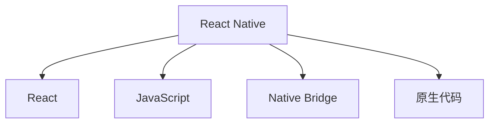

                 

# React Native：跨平台移动应用开发

> 关键词：React Native, 跨平台开发, 移动应用, 前端技术, 组件库, 性能优化, Web和Native桥接

## 1. 背景介绍

随着智能手机的普及和移动互联网的迅猛发展，手机端的应用开发需求日益增长。然而，开发一款应用需要大量的时间和资源，特别是需要为不同的平台（如iOS和Android）分别开发和维护，这一过程不仅耗时耗力，还可能导致资源浪费。为了解决这一问题，跨平台移动应用开发技术应运而生。

React Native（简称RN）是一种由Facebook开发的跨平台移动应用开发框架，它使用JavaScript和React来构建原生移动应用。React Native不仅能够大大降低开发成本，还能提升开发效率，使得开发者能够在不需要额外知识的情况下，快速构建出高质量的原生应用。本文将对React Native的核心概念、原理、具体操作步骤及应用进行详细介绍。

## 2. 核心概念与联系

### 2.1 核心概念概述

在深入探讨React Native之前，我们需要了解几个核心概念：

- **React**：一个用于构建用户界面的JavaScript库。它通过组件化的方式，将复杂的UI界面拆解为多个可重用的组件，使得开发者可以更加专注于功能的实现，而无需过多关注UI的布局和样式。
- **Native**：指与操作系统平台（如iOS和Android）的原生代码。React Native通过桥接机制，使得JavaScript代码能够直接操作原生组件，从而实现原生应用的性能和用户体验。
- **跨平台**：指能够在不同的操作系统平台上运行的应用程序，比如Android、iOS、Windows等。
- **桥接**：一种技术，使得JavaScript代码能够直接操作原生代码，从而实现跨平台的代码共享和复用。

通过这些概念，我们可以理解React Native是如何通过桥接技术，实现跨平台移动应用开发的。

### 2.2 核心概念原理和架构的 Mermaid 流程图



在这个流程图中，React Native通过React构建UI界面，并使用JavaScript作为编程语言。它通过Native Bridge将JavaScript代码桥接到原生代码中，从而实现跨平台的代码复用。开发者只需编写一次代码，即可在多个平台上运行。

## 3. 核心算法原理 & 具体操作步骤

### 3.1 算法原理概述

React Native的核心算法原理可以概括为以下几点：

- **组件化**：通过组件化的方式，将UI界面拆解为多个可重用的组件。开发者只需关注组件的实现，而无需关心UI的布局和样式。
- **桥接**：通过Native Bridge将JavaScript代码桥接到原生代码中，从而实现跨平台的代码复用。
- **虚拟DOM**：React Native使用虚拟DOM来管理UI界面的更新，通过对比前后两次DOM的差异，优化UI的渲染过程，提升性能。

### 3.2 算法步骤详解

#### 3.2.1 搭建开发环境

React Native的开发环境包括Node.js、Android Studio或Xcode、React Native CLI等。搭建开发环境的步骤如下：

1. 安装Node.js和React Native CLI。
2. 配置Android Studio或Xcode。
3. 创建新的React Native项目。

#### 3.2.2 创建组件

React Native通过组件化的方式构建UI界面。创建组件的步骤如下：

1. 导入所需的组件库，如React Native的官方组件库。
2. 定义组件的样式和逻辑。
3. 渲染组件。

#### 3.2.3 桥接实现

React Native通过Native Bridge实现JavaScript代码和原生代码的桥接。桥接实现的步骤如下：

1. 在JavaScript代码中，通过Native Modules API调用原生代码。
2. 在原生代码中，通过Java/Kotlin代码实现桥接逻辑。
3. 在JavaScript代码中，通过Bridge API获取原生组件的状态和属性。

#### 3.2.4 性能优化

React Native通过虚拟DOM优化UI的渲染过程，提升性能。性能优化的步骤如下：

1. 使用setState函数来更新UI状态。
2. 使用shouldComponentUpdate函数来控制组件的更新。
3. 使用PureComponent和React.memo函数来减少不必要的渲染。

### 3.3 算法优缺点

#### 3.3.1 优点

- **开发效率高**：React Native通过桥接机制，使得JavaScript代码能够直接操作原生组件，无需额外学习原生的开发知识。
- **性能好**：React Native使用虚拟DOM优化UI的渲染过程，提升性能。
- **跨平台**：React Native可以在多个平台上运行，包括iOS和Android。

#### 3.3.2 缺点

- **桥接开销大**：桥接机制会带来一定的性能开销，影响应用的响应速度。
- **兼容性问题**：不同平台的原生组件和API存在差异，可能会导致兼容性问题。
- **复杂性高**：React Native的学习曲线较陡峭，需要开发者具备一定的前端开发经验。

### 3.4 算法应用领域

React Native适用于各种类型的跨平台移动应用开发，包括但不限于以下领域：

- **社交应用**：如微信、微博等，通过React Native可以快速构建复杂的社交功能。
- **电商应用**：如淘宝、京东等，通过React Native可以构建高性能的商品展示和交易界面。
- **金融应用**：如支付宝、微信支付等，通过React Native可以提升应用的性能和用户体验。
- **教育应用**：如Khan Academy、Duolingo等，通过React Native可以构建丰富的教学内容和互动体验。
- **娱乐应用**：如抖音、快手等，通过React Native可以构建流畅的短视频和直播体验。

## 4. 数学模型和公式 & 详细讲解 & 举例说明

### 4.1 数学模型构建

在React Native中，UI界面的渲染过程可以通过数学模型来描述。假设UI界面由$n$个组件构成，每个组件的样式和逻辑可以表示为一个向量$x_i=(x_{i1},x_{i2},...,x_{in})$，其中$x_{ij}$表示第$i$个组件的第$j$个属性。整个UI界面的样式和逻辑可以表示为一个向量$x=(x_1,x_2,...,x_n)$。

### 4.2 公式推导过程

React Native的渲染过程可以通过以下公式来推导：

$$
y = f(x)
$$

其中，$y$表示UI界面的渲染结果，$f$表示渲染函数。渲染函数$f$将输入的向量$x$转换为输出$y$。在渲染过程中，React Native会根据虚拟DOM的差异，逐步更新UI界面的渲染结果，最终得到最终的渲染结果$y$。

### 4.3 案例分析与讲解

假设有一个简单的UI界面，包含一个文本组件和一个按钮组件。文本组件的样式和逻辑可以表示为$x_1=(x_{11},x_{12},x_{13})$，按钮组件的样式和逻辑可以表示为$x_2=(x_{21},x_{22},x_{23})$。整个UI界面的样式和逻辑可以表示为$x=(x_1,x_2)$。通过React Native的桥接机制，JavaScript代码可以直接操作原生组件的状态和属性，从而实现跨平台的代码复用。

## 5. 项目实践：代码实例和详细解释说明

### 5.1 开发环境搭建

搭建React Native开发环境的步骤如下：

1. 安装Node.js和React Native CLI。
2. 配置Android Studio或Xcode。
3. 创建新的React Native项目。

### 5.2 源代码详细实现

以下是一个简单的React Native项目示例，包含一个文本组件和一个按钮组件：

```javascript
import React from 'react';
import { Text, View, Button } from 'react-native';

const App = () => {
  const [count, setCount] = React.useState(0);

  const increment = () => {
    setCount(count + 1);
  };

  return (
    <View>
      <Text>Count: {count}</Text>
      <Button title="Increment" onPress={increment} />
    </View>
  );
};

export default App;
```

在这个项目中，React useState钩子用于管理组件的状态。通过setCount函数更新count状态，通过increment函数来增加count值。通过Button组件来渲染增加按钮，通过Text组件来渲染计数器。

### 5.3 代码解读与分析

在这个项目中，React Native通过桥接机制，使得JavaScript代码能够直接操作原生组件。通过useState钩子来管理组件的状态，通过setCount函数来更新状态，从而实现计数器的功能。

### 5.4 运行结果展示

运行这个项目，可以得到一个简单的UI界面，包含一个计数器和增加按钮。每次点击增加按钮，计数器会自增1。

## 6. 实际应用场景

React Native适用于各种类型的跨平台移动应用开发，包括但不限于以下领域：

- **社交应用**：如微信、微博等，通过React Native可以快速构建复杂的社交功能。
- **电商应用**：如淘宝、京东等，通过React Native可以构建高性能的商品展示和交易界面。
- **金融应用**：如支付宝、微信支付等，通过React Native可以提升应用的性能和用户体验。
- **教育应用**：如Khan Academy、Duolingo等，通过React Native可以构建丰富的教学内容和互动体验。
- **娱乐应用**：如抖音、快手等，通过React Native可以构建流畅的短视频和直播体验。

## 7. 工具和资源推荐

### 7.1 学习资源推荐

为了帮助开发者系统掌握React Native的核心概念和开发技巧，这里推荐一些优质的学习资源：

1. React Native官方文档：React Native的官方文档提供了完整的API参考和开发指南。
2. React Native在中国：React Native在中国的中文社区，提供丰富的中文资源和技术支持。
3. React Native应用开发实战教程：通过实际案例讲解React Native的开发流程和技巧。
4. React Native源码解析：解析React Native的源码，深入理解其核心算法原理。

### 7.2 开发工具推荐

React Native提供了丰富的开发工具，以下是几款常用的开发工具：

1. React Native CLI：React Native的命令行界面，用于创建和管理项目。
2. Android Studio或Xcode：Android和iOS平台的开发工具，用于构建和调试原生应用。
3. Expo：React Native的开发平台，提供一站式开发和管理服务。
4. React Native Debugger：React Native的调试工具，用于调试原生代码和JavaScript代码。
5. React Native Elements：React Native的UI组件库，提供丰富的UI组件和样式。

### 7.3 相关论文推荐

React Native的开发和优化一直是研究的热点，以下是几篇具有代表性的论文：

1. "React Native: A Versatile JavaScript Framework for Mobile Apps"：介绍React Native的开发和应用场景。
2. "Native Code Access in React Native: A Survey"：综述React Native的桥接机制和原生代码的访问。
3. "Optimization Techniques for React Native Applications"：介绍React Native的性能优化技巧。
4. "Component-Based UI Development in React Native"：介绍React Native的组件化开发方式。

## 8. 总结：未来发展趋势与挑战

### 8.1 研究成果总结

React Native作为一种跨平台移动应用开发框架，已经广泛应用于各种类型的应用开发中。通过桥接机制，React Native实现了JavaScript代码和原生代码的桥接，提升了开发效率和代码复用性。通过组件化开发方式，React Native简化了UI界面的构建过程。通过虚拟DOM优化UI的渲染过程，React Native提升了应用的性能和用户体验。

### 8.2 未来发展趋势

React Native的未来发展趋势包括：

- **持续优化性能**：React Native将继续优化UI渲染和桥接机制，提升应用的性能和响应速度。
- **引入更多原生组件**：React Native将引入更多原生组件和API，提升应用的开发体验和用户体验。
- **支持更多平台**：React Native将支持更多的平台和设备，拓展应用的市场范围。
- **增强开发工具**：React Native将增强开发工具和调试工具，提升开发效率和用户体验。

### 8.3 面临的挑战

React Native在发展过程中也面临一些挑战：

- **性能开销**：桥接机制会带来一定的性能开销，影响应用的响应速度。
- **兼容性问题**：不同平台的原生组件和API存在差异，可能会导致兼容性问题。
- **学习曲线**：React Native的学习曲线较陡峭，需要开发者具备一定的前端开发经验。

### 8.4 研究展望

未来的研究方向包括：

- **改进桥接机制**：通过改进桥接机制，减少桥接开销，提升应用的性能和响应速度。
- **引入更多原生组件**：引入更多原生组件和API，提升应用的开发体验和用户体验。
- **增强开发工具**：增强开发工具和调试工具，提升开发效率和用户体验。

总之，React Native作为一种跨平台移动应用开发框架，已经广泛应用于各种类型的应用开发中。通过桥接机制，React Native实现了JavaScript代码和原生代码的桥接，提升了开发效率和代码复用性。通过组件化开发方式，React Native简化了UI界面的构建过程。通过虚拟DOM优化UI的渲染过程，React Native提升了应用的性能和用户体验。未来，React Native将继续优化性能和开发体验，支持更多的平台和设备，成为跨平台移动应用开发的重要工具。

---

作者：禅与计算机程序设计艺术 / Zen and the Art of Computer Programming

