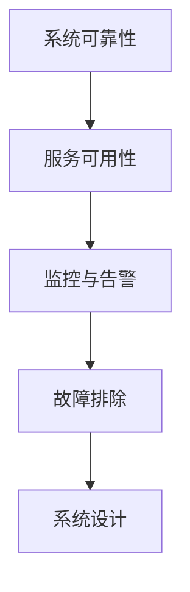

                 

# SRE实践：确保系统可靠性的方法论

> 关键词：系统可靠性,服务可用性,监控告警,故障排除,系统设计

## 1. 背景介绍

### 1.1 问题由来

在当今数字化时代，企业的信息系统已经成为业务运营的核心。从金融交易、电商购物，到教育医疗、交通出行，各种业务场景都高度依赖于稳定运行的软件系统。然而，系统的复杂性和业务需求的不断变化，不可避免地带来了诸多挑战，如何保障系统的高可用性、高稳定性，成为了每一个SRE（Site Reliability Engineer）必须面对的课题。

随着DevOps和DevSecOps理念的推广，SRE不再仅仅关注运维响应速度，而是更注重系统的整体可靠性和用户体验。通过系统化、流程化的SRE实践，企业可以有效地提升运维效率，降低故障率，最终实现系统的高可用和高稳定性。

### 1.2 问题核心关键点

本文聚焦于SRE在确保系统可靠性方面的方法论。我们围绕以下几个核心问题展开：

- **系统可靠性与可用性**：什么是系统可靠性？如何量化可用性指标？
- **监控与告警**：如何通过有效的监控手段保障系统稳定运行？
- **故障排除**：在系统出现故障时，如何快速定位和解决？
- **系统设计**：如何通过系统架构设计提升可靠性？

## 2. 核心概念与联系

### 2.1 核心概念概述

为了更好地理解SRE实践，本节将介绍几个密切相关的核心概念：

- **系统可靠性（System Reliability）**：系统可靠性指在给定时间内，系统按预期方式运行的概率。可靠性是系统设计、运维和监控的核心目标。
- **服务可用性（Service Availability）**：服务可用性指在给定时间内，系统服务能正常响应的比例。可用性是可靠性的一个关键指标。
- **监控与告警（Monitoring and Alerting）**：通过持续监控系统的运行状态，及时发现异常情况并发出告警，以保障系统稳定运行。
- **故障排除（Troubleshooting）**：在系统出现故障时，通过诊断和修复手段，快速恢复系统正常运行。
- **系统设计（System Design）**：通过合理的系统架构设计和最佳实践，提升系统可靠性。

这些概念之间的逻辑关系可以通过以下Mermaid流程图来展示：



这个流程图展示了一系列保障系统可靠性的关键步骤：首先设计高可靠性的系统，通过持续监控和告警保障系统稳定运行，在出现故障时迅速定位并修复，最终实现系统的可靠性目标。

## 3. 核心算法原理 & 具体操作步骤
### 3.1 算法原理概述

SRE实践中的核心算法原理主要包括系统设计、监控与告警、故障排除等方面的方法和工具。这些原理构成了SRE确保系统可靠性的基础框架。

- **系统设计**：通过合理的系统架构设计，确保系统能够稳定运行，并具备良好的容错性和扩展性。
- **监控与告警**：通过持续监控系统性能指标，及时发现异常情况，并通过告警机制通知相关人员，快速采取应对措施。
- **故障排除**：在系统出现故障时，通过日志分析、性能诊断等手段，快速定位问题，并采取修复措施。

### 3.2 算法步骤详解

以下是对SRE实践中核心算法的详细步骤详解：

**Step 1: 系统设计**

1. **确定业务需求**：明确业务场景和用户需求，确保系统设计符合业务目标。
2. **选择技术栈**：根据业务需求和性能要求，选择合适的技术栈和架构设计方案。
3. **设计冗余机制**：通过负载均衡、备份机制等设计冗余，确保系统的高可用性。
4. **实现自动扩缩容**：设计自动化的扩缩容策略，根据负载动态调整系统资源。
5. **优化代码和性能**：进行代码审计和性能优化，提升系统的响应速度和稳定性。

**Step 2: 监控与告警**

1. **配置监控指标**：根据系统特性和业务需求，配置关键的性能监控指标，如CPU使用率、内存占用、网络流量等。
2. **部署监控工具**：选择合适的监控工具，如Prometheus、Grafana等，实现对系统状态的持续监控。
3. **设置告警阈值**：根据监控指标的历史数据和业务需求，设置告警阈值，及时发现异常情况。
4. **通知机制**：通过邮件、短信、告警系统等方式，确保相关人员能够及时收到告警信息。
5. **告警过滤和分类**：对告警信息进行分类和过滤，避免误告警干扰运维团队。

**Step 3: 故障排除**

1. **日志分析**：通过系统日志和应用日志，定位故障点。
2. **性能诊断**：使用性能分析工具，如Kibana、New Relic等，分析系统性能瓶颈。
3. **问题复现**：通过重现故障条件，进一步确认故障原因。
4. **修复方案**：制定修复方案，并进行回滚测试。
5. **故障复盘**：记录故障原因和修复过程，建立故障数据库，供后续参考。

**Step 4: 系统优化**

1. **性能调优**：根据监控和故障排除的结果，进行性能调优。
2. **代码优化**：进行代码审计和重构，提升代码质量和运行效率。
3. **自动化测试**：建立自动化测试流程，确保系统稳定性。
4. **灾备演练**：定期进行灾备演练，确保灾备方案的有效性。

### 3.3 算法优缺点

SRE实践中的核心算法具有以下优点：

- **系统可靠性强**：通过系统设计和冗余机制，确保系统的高可用性和容错性。
- **响应速度快**：通过监控和告警，及时发现和响应系统异常。
- **故障排除效率高**：通过日志分析和性能诊断，快速定位和修复问题。
- **运维成本低**：通过自动化工具和流程化管理，降低人工干预和运维成本。

然而，这些算法也存在一些局限性：

- **初始投资高**：系统设计和监控需要较高的初始投入，短期内可能对企业资源构成压力。
- **复杂度增加**：系统设计和运维的复杂度增加，对运维团队的要求更高。
- **误告警风险**：告警机制可能产生误告警，干扰运维团队的工作。
- **故障排除难度大**：对于复杂的系统故障，定位和修复难度较大。

### 3.4 算法应用领域

SRE实践中的核心算法广泛应用于各种场景，如金融交易、电商购物、教育医疗、智能制造等。以下是几个典型的应用领域：

- **金融交易系统**：金融交易系统的可靠性直接影响到企业利润和用户信任。通过SRE实践，确保系统的稳定运行和高效响应，保障金融交易的安全和高效。
- **电商购物平台**：电商平台的可靠性和用户满意度直接关系到企业的市场竞争力。通过SRE实践，确保购物系统的高可用性和高性能，提升用户体验。
- **教育医疗系统**：教育医疗系统的可靠性和用户体验直接关系到公共服务的质量。通过SRE实践，确保系统的稳定运行和高效响应，提升公共服务水平。
- **智能制造系统**：智能制造系统的高可靠性是保障企业生产效率和质量的关键。通过SRE实践，确保系统的高可靠性和高效运行，提升生产效率和质量。

## 4. 数学模型和公式 & 详细讲解  
### 4.1 数学模型构建

本节将使用数学语言对SRE实践中的核心算法进行更加严格的刻画。

假设系统可靠性的概率为 $R$，服务可用性为 $A$。根据系统设计和运维的不同策略，系统可靠性可以通过以下公式进行计算：

$$
R = A \times u
$$

其中 $u$ 为系统故障时间占总时间的比例，即故障率。

### 4.2 公式推导过程

以下是系统可靠性的推导过程：

设系统总时间为 $T$，故障时间为 $D$，可用时间为 $A$。根据定义，有：

$$
T = A + D
$$

由可用性的定义，得：

$$
A = \frac{T - D}{T}
$$

代入 $R = A \times u$，得：

$$
R = \frac{T - D}{T} \times u = \frac{A}{T} \times (1 - A)
$$

进一步简化得：

$$
R = \frac{1}{1 + \frac{D}{A}}
$$

即系统可靠性与故障率和可用性成反比关系。因此，通过优化故障率 $u$ 和提升可用性 $A$，可以有效提升系统的可靠性。

### 4.3 案例分析与讲解

以金融交易系统为例，分析如何通过SRE实践提升系统可靠性。

**系统设计**：
- **冗余机制**：采用多台服务器进行负载均衡，并通过数据库复制和数据分片，提升系统的容错性和扩展性。
- **自动扩缩容**：根据实时负载动态调整服务器数量，确保系统资源最优配置。

**监控与告警**：
- **性能指标**：监控CPU使用率、内存占用、网络流量等关键指标。
- **告警阈值**：设置CPU使用率阈值为90%，内存占用阈值为80%，网络流量阈值为1Gbps。

**故障排除**：
- **日志分析**：使用ElasticSearch存储系统日志，并通过Kibana进行数据分析。
- **性能诊断**：使用New Relic进行系统性能监控，识别性能瓶颈。

**系统优化**：
- **性能调优**：根据监控结果，调整数据库查询优化和应用性能优化。
- **代码审计**：进行代码审计和重构，提升代码质量和运行效率。

## 5. 项目实践：代码实例和详细解释说明
### 5.1 开发环境搭建

在进行SRE实践前，我们需要准备好开发环境。以下是使用Python进行系统监控和告警配置的环境配置流程：

1. 安装Anaconda：从官网下载并安装Anaconda，用于创建独立的Python环境。

2. 创建并激活虚拟环境：
```bash
conda create -n sre-env python=3.8 
conda activate sre-env
```

3. 安装系统监控和告警工具：
```bash
conda install prometheus grafana
```

4. 安装日志分析工具：
```bash
conda install elasticsearch kibana
```

5. 安装性能分析工具：
```bash
conda install newrelic
```

完成上述步骤后，即可在`sre-env`环境中开始SRE实践。

### 5.2 源代码详细实现

这里我们以监控与告警实践为例，给出使用Prometheus和Grafana进行系统监控和告警配置的Python代码实现。

首先，配置Prometheus：

```python
from prometheus_client import Collector, CoreCollector, GaugeMetricFamily

class CustomCollector(Collector):
    def collect(self):
        # 获取系统指标
        system_info = psutil.virtual_memory()
        cpu_info = psutil.cpu_percent(interval=1)
        disk_info = psutil.disk_usage('/')
        
        # 添加指标
        self.add_metric(GaugeMetricFamily('memory_usage', 'Memory usage', ['instance'], value=[system_info.total, system_info.used]))
        self.add_metric(GaugeMetricFamily('cpu_load', 'CPU load', ['instance'], value=[cpu_info]))
        self.add_metric(GaugeMetricFamily('disk_usage', 'Disk usage', ['instance'], value=[disk_info.free]))
        
# 注册收集器
Collector.register(CustomCollector())
```

然后，启动Prometheus服务：

```bash
prometheus --config-file=./prometheus.yml
```

接着，配置Grafana：

```python
from grafana import GrafanaClient

# 创建Grafana客户端
client = GrafanaClient('http://localhost:3000', username='admin', password='admin', api_key='api_key')

# 创建数据源
data_source = client.create_data_source('Prometheus')
data_source.update({'access': {'url': 'http://localhost:9090', 'basic_auth': {'username': 'admin', 'password': 'admin'}})

# 创建告警配置
alert_name = 'CPU负载告警'
alert_type = 'thresholds'
description = 'CPU负载超过80%'
thresholds = {'threshold': 80, 'evaluation_interval': '5m', 'no_data_over_time': '5m', 'for': '5m', 'unit': 'percent'}
alerting_setting = client.create_alerting_setting(alert_name, alert_type, description, thresholds)

# 创建面板
panel_name = '系统监控面板'
query = 'memory_usage:instance:total{instance="sre"}'
chart_type = 'graph'
target = 'memory_usage:instance:used{instance="sre"}'
legend_format = '{target} ({type})'
# 创建面板对象
panel = client.create_panel(panel_name, query, query, chart_type, legend_format, target)

# 创建仪表盘
board_name = '系统监控仪表盘'
board = client.create_board(board_name)
board.add_panel(panel)

# 添加告警配置到仪表盘
board.add_alerting_setting(alerting_setting)
```

最后，启动Grafana服务：

```bash
grafana-server --config file:./grafana.ini
```

这样，一个简单的系统监控和告警配置就实现了。

### 5.3 代码解读与分析

让我们再详细解读一下关键代码的实现细节：

**CustomCollector类**：
- 继承自Prometheus的Collector类，定义了一个自定义的收集器，用于收集系统指标。
- 实现了collect方法，用于获取系统信息，并将指标添加到Prometheus的收集器中。

**Grafana配置**：
- 使用Grafana的Python客户端库，实现了对数据源、告警配置、面板和仪表盘的创建和管理。
- 通过配置告警阈值和面板查询，实现了对系统指标的监控和告警。

通过这个示例，可以看到，SRE实践中的核心算法通过系统监控和告警工具，可以很好地实现系统可靠性的保障。

## 6. 实际应用场景
### 6.1 智能制造系统

在智能制造系统中，SRE实践可以显著提升系统的可靠性和稳定性。智能制造系统涉及大量的设备、传感器和控制系统，通过SRE实践，可以确保系统的各个组件能够稳定运行，高效协同工作。

具体而言，可以通过以下几个步骤实现SRE实践：

- **系统设计**：采用模块化设计，确保每个组件的高可靠性。通过冗余机制、负载均衡等设计，提升系统的容错性和扩展性。
- **监控与告警**：使用系统监控工具，实时监控系统的运行状态。通过告警机制，及时发现并处理异常情况。
- **故障排除**：在设备出现故障时，通过日志分析和性能诊断，快速定位问题并修复。
- **系统优化**：定期进行性能调优和代码审计，提升系统的运行效率和稳定性。

### 6.2 智慧医疗系统

智慧医疗系统的可靠性直接关系到患者的生命安全和医疗质量。通过SRE实践，可以确保系统的稳定运行和高效响应，提升医疗服务的质量和效率。

具体而言，可以通过以下几个步骤实现SRE实践：

- **系统设计**：采用高可用性和高可靠性的架构设计，确保系统的稳定运行。通过数据库复制、数据分片等技术，提升系统的容错性和扩展性。
- **监控与告警**：实时监控系统的运行状态，及时发现并处理异常情况。通过告警机制，确保相关人员能够及时响应。
- **故障排除**：在医疗设备出现故障时，通过日志分析和性能诊断，快速定位问题并修复。
- **系统优化**：定期进行性能调优和代码审计，提升系统的运行效率和稳定性。

### 6.3 智能交通系统

智能交通系统的可靠性和用户体验直接影响到城市的交通管理和市民的出行体验。通过SRE实践，可以确保系统的稳定运行和高效响应，提升交通管理水平。

具体而言，可以通过以下几个步骤实现SRE实践：

- **系统设计**：采用模块化设计，确保每个组件的高可靠性。通过冗余机制、负载均衡等设计，提升系统的容错性和扩展性。
- **监控与告警**：实时监控系统的运行状态，及时发现并处理异常情况。通过告警机制，确保相关人员能够及时响应。
- **故障排除**：在交通信号灯、摄像头等设备出现故障时，通过日志分析和性能诊断，快速定位问题并修复。
- **系统优化**：定期进行性能调优和代码审计，提升系统的运行效率和稳定性。

### 6.4 未来应用展望

随着SRE实践的不断深入，未来将在更多领域得到应用，为各行各业带来变革性影响：

- **智慧城市治理**：SRE实践可以应用于智慧城市治理中的各个环节，如交通管理、公共安全、应急响应等，提升城市管理的智能化水平。
- **智能制造升级**：SRE实践可以应用于智能制造系统的各个环节，如设备监控、生产调度、质量控制等，提升生产效率和质量。
- **智慧医疗深化**：SRE实践可以应用于智慧医疗系统的各个环节，如患者管理、医疗设备、数据存储等，提升医疗服务的质量和效率。
- **智能客服优化**：SRE实践可以应用于智能客服系统的各个环节，如对话生成、问题解答、用户反馈等，提升客服系统的智能化水平。

## 7. 工具和资源推荐
### 7.1 学习资源推荐

为了帮助开发者系统掌握SRE实践的理论基础和实践技巧，这里推荐一些优质的学习资源：

1. **《Site Reliability Engineering: How Google Runs Production Systems》**：Google官方出版的经典书籍，详细介绍了SRE的实践经验和方法论。
2. **《DevOps实践指南》**：介绍DevOps和SRE的实践指南，涵盖系统设计、监控告警、故障排除等方面的内容。
3. **《SRE：服务可靠性的思考和实践》**：深入探讨SRE的理论和实践，帮助理解SRE的精髓。
4. **Grafana官方文档**：Grafana的官方文档，提供了丰富的监控工具和实践指南。
5. **Prometheus官方文档**：Prometheus的官方文档，提供了系统的配置和监控方法。

通过对这些资源的学习实践，相信你一定能够快速掌握SRE实践的核心要义，并将其应用于实际的项目中。

### 7.2 开发工具推荐

高效的开发离不开优秀的工具支持。以下是几款用于SRE实践开发的常用工具：

1. **Prometheus**：开源的监控系统，提供了丰富的监控工具和告警机制，支持多种数据源。
2. **Grafana**：开源的仪表盘工具，支持丰富的图表和告警配置，易于上手。
3. **ElasticSearch**：开源的搜索引擎，提供了强大的日志存储和查询功能。
4. **Kibana**：基于ElasticSearch的可视化工具，提供了丰富的图表和分析功能。
5. **New Relic**：商业化的性能监控工具，提供了全面的性能分析和告警功能。
6. **Pingdom**：商业化的监控工具，提供了实时监控和告警功能。

合理利用这些工具，可以显著提升SRE实践的开发效率，加快创新迭代的步伐。

### 7.3 相关论文推荐

SRE实践中的核心算法源于学界的持续研究。以下是几篇奠基性的相关论文，推荐阅读：

1. **《The Reliability Engineering Process: A Probabilistic Approach》**：探讨了系统可靠性和可用性的数学模型和分析方法。
2. **《Monitoring and Alerting System for Cloud Environment》**：介绍了云环境下监控和告警系统的设计实现。
3. **《Fault Diagnosis and Recovery of Distributed Systems》**：研究了分布式系统的故障诊断和恢复方法。
4. **《Practical Solutions for Large-Scale Service-Oriented Architectures》**：介绍了大规模服务架构的可靠性保障措施。

这些论文代表了大规模系统可靠性研究的发展脉络。通过学习这些前沿成果，可以帮助研究者把握学科前进方向，激发更多的创新灵感。

## 8. 总结：未来发展趋势与挑战

### 8.1 总结

本文对SRE在确保系统可靠性方面的方法论进行了全面系统的介绍。首先阐述了系统可靠性与可用性的概念，明确了SRE实践的目标。其次，从系统设计、监控与告警、故障排除等方面，详细讲解了SRE实践的核心算法和操作步骤。最后，通过实际应用场景和未来展望，展示了SRE实践的广阔前景。

通过本文的系统梳理，可以看到，SRE实践中的核心算法通过系统监控和告警工具，可以很好地实现系统可靠性的保障。这些算法在实际应用中，还需要根据具体任务，不断迭代和优化模型、数据和算法，方能得到理想的效果。

### 8.2 未来发展趋势

展望未来，SRE实践将呈现以下几个发展趋势：

1. **自动化和智能化**：随着AI和大数据技术的发展，SRE实践将越来越多地引入自动化和智能化手段，提升运维效率和故障排除能力。
2. **多维度监控**：SRE实践将从传统的性能监控，扩展到包括网络、应用、业务等在内的多维度监控，实现更全面、更深入的监控覆盖。
3. **云原生架构**：在云原生架构下，SRE实践将更好地支持微服务、容器化、DevOps等现代开发和运维模式。
4. **持续交付和持续集成**：通过DevOps实践，实现持续交付和持续集成，提升系统的稳定性和可靠性。
5. **数据驱动的决策**：SRE实践将更多地依赖数据驱动的决策，通过数据分析和可视化，提升运维决策的准确性和效率。

### 8.3 面临的挑战

尽管SRE实践已经取得了瞩目成就，但在迈向更加智能化、普适化应用的过程中，它仍面临诸多挑战：

1. **复杂度增加**：随着系统的复杂度增加，SRE实践的复杂度也随之增加，对运维团队的要求更高。
2. **成本投入高**：系统设计和监控需要较高的初始投入，短期内可能对企业资源构成压力。
3. **数据质量和告警误报**：告警机制可能产生误报，影响运维团队的决策。
4. **故障排除难度大**：对于复杂的系统故障，定位和修复难度较大。

### 8.4 研究展望

面对SRE实践面临的挑战，未来的研究需要在以下几个方面寻求新的突破：

1. **引入人工智能技术**：通过AI和大数据技术，提升故障排除和运维效率。
2. **优化告警系统**：改进告警机制，减少误报和漏报，提升告警的有效性。
3. **优化系统设计**：通过更好的系统架构设计，提升系统的稳定性和容错性。
4. **引入自动化测试**：通过自动化测试，提升系统的可靠性和稳定性。
5. **数据驱动的决策**：通过数据分析和可视化，提升运维决策的准确性和效率。

这些研究方向的探索，必将引领SRE实践迈向更高的台阶，为构建安全、可靠、可解释、可控的智能系统铺平道路。面向未来，SRE实践还需要与其他人工智能技术进行更深入的融合，如知识表示、因果推理、强化学习等，多路径协同发力，共同推动智能系统的进步。

## 9. 附录：常见问题与解答

**Q1：SRE的职责有哪些？**

A: SRE的职责包括系统设计、运维响应、故障排除、监控告警等多个方面。具体职责如下：
- 设计高可靠性的系统架构。
- 进行系统性能监控和告警配置。
- 快速定位和解决系统故障。
- 编写和维护系统监控和告警工具。
- 优化系统性能和代码质量。

**Q2：如何判断系统的可用性？**

A: 系统的可用性可以通过以下几个指标来衡量：
- 服务可用时间比例。
- 单次故障处理时间。
- 故障恢复时间。
- 系统整体稳定性。

通过这些指标的监控和分析，可以全面评估系统的可用性，及时发现和处理问题。

**Q3：监控与告警工具的选择有哪些？**

A: 常用的监控与告警工具包括Prometheus、Grafana、ElasticSearch、Kibana、New Relic等。这些工具各有特点，可以根据具体需求选择合适的工具进行部署。

**Q4：如何减少告警误报？**

A: 减少告警误报的方法包括：
- 配置合理的告警阈值。
- 使用告警分类和过滤机制。
- 定期检查和优化告警规则。
- 增加告警前后的上下文信息。
- 引入机器学习算法进行告警优化。

通过以上措施，可以有效地减少告警误报，提高告警的有效性。

**Q5：如何进行系统故障排除？**

A: 系统故障排除的步骤包括：
- 日志分析：通过系统日志和应用日志，定位故障点。
- 性能诊断：使用性能分析工具，识别系统性能瓶颈。
- 问题复现：通过重现故障条件，进一步确认故障原因。
- 修复方案：制定修复方案，并进行回滚测试。
- 故障复盘：记录故障原因和修复过程，建立故障数据库，供后续参考。

通过以上步骤，可以快速定位和解决系统故障，确保系统的稳定运行。

---

作者：禅与计算机程序设计艺术 / Zen and the Art of Computer Programming

