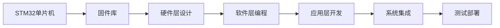

                 

# STM32单片机应用开发

> 关键词：STM32单片机,应用开发,STM32,学习资源,开发工具,实际应用场景

## 1. 背景介绍

### 1.1 问题由来
随着物联网(IoT)和嵌入式系统的广泛应用，单片机成为了连接硬件和软件的重要桥梁。而作为STMicroelectronics公司生产的STM32单片机系列，因其高性能、低功耗、丰富的外设接口等优点，成为了嵌入式开发的首选芯片。对于初学者和经验丰富的开发者来说，掌握STM32单片机的应用开发，是进入嵌入式系统领域的第一步。

### 1.2 问题核心关键点
STM32单片机应用开发涉及多方面的核心知识点：

- **硬件基础**：包括STM32系列芯片的引脚功能、基本外设如GPIO、UART、I2C、SPI、ADC、DAC、定时器、脉宽调制(PWM)、串行外设接口(SPI)、I2S、以太网、Wi-Fi等。
- **软件基础**：了解STM32的固件库、嵌入式操作系统(如FreeRTOS、µC/OS-II)、中间件(如CMSIS-DSP)以及调试工具(如STM32CubeIDE)。
- **应用开发**：实现不同功能的硬件应用，如温度传感器数据采集、电机控制、智能家居、工业自动化等。

这些核心知识点互相交织，共同构成了STM32单片机应用开发的完整框架。

### 1.3 问题研究意义
掌握STM32单片机应用开发，对于嵌入式工程师具有以下重要意义：

- **硬件基础**：打下坚实的硬件设计基础，理解芯片的工作原理，能够在硬件层面上进行设计优化。
- **软件开发**：熟悉STM32系列芯片的固件库，掌握嵌入式系统开发的技能，实现跨平台的项目开发。
- **应用实践**：能够将理论知识转化为实际应用，实现各种基于STM32单片机的功能系统，推动技术创新。
- **产业升级**：促进传统行业物联网化、自动化升级，提升产品的智能化水平，加速智能化产品研发。

## 2. 核心概念与联系

### 2.1 核心概念概述

为了更好地理解STM32单片机应用开发，本节将介绍几个核心概念及其联系：

- **STM32单片机**：STMicroelectronics公司生产的STM32系列单片机，包含低、中、高多个性能层次，广泛用于工业控制、汽车电子、智能家居等领域。
- **应用层开发**：使用STM32系列芯片的固件库和开发工具，实现各种基于STM32单片机的应用。
- **硬件层设计**：对STM32芯片的引脚、外设进行设计，实现信号的处理和传递。
- **软件层编程**：使用C/C++语言编写STM32的驱动程序，调用硬件资源实现具体功能。
- **固件库**：STM32芯片提供的标准化API，用于快速实现各种功能，提高开发效率。

这些核心概念通过STM32的架构连接起来，构成单片机应用开发的整体流程。

### 2.2 核心概念原理和架构的 Mermaid 流程图(Mermaid 流程节点中不要有括号、逗号等特殊字符)



这个流程图展示了STM32单片机应用开发的一般流程：

1. **固件库**：为硬件设计提供接口和标准操作，简化了应用层开发。
2. **硬件层设计**：设计芯片引脚和外设，确保信号正确传输。
3. **软件层编程**：通过调用固件库函数，实现具体的功能逻辑。
4. **应用层开发**：将各层次功能集成，实现完整的系统应用。
5. **系统集成**：将各部分硬件和软件整合，形成最终产品。
6. **测试部署**：对系统进行测试验证，部署上线使用。

## 3. 核心算法原理 & 具体操作步骤
### 3.1 算法原理概述

STM32单片机应用开发主要遵循软件驱动硬件的基本原理，通过程序实现对硬件的编程和控制。其核心算法原理包括：

- **中断处理**：对实时事件进行快速响应。
- **定时器管理**：对时间进行精确控制。
- **I/O控制**：对输入输出信号进行管理。
- **串口通信**：实现不同设备间的数据交换。
- **数据存储**：对数据进行保存和读取。

### 3.2 算法步骤详解

基于STM32单片机应用开发，核心步骤包括：

1. **硬件设计**：选择合适的STM32型号，设计引脚布局和外设连接。
2. **软件配置**：初始化固件库函数，配置外设参数。
3. **功能实现**：编写功能模块，实现传感器数据采集、电机控制等功能。
4. **系统集成**：将各个模块整合，形成完整的系统。
5. **测试调试**：对系统进行功能测试和调试优化。

### 3.3 算法优缺点

STM32单片机应用开发具有以下优点：

- **硬件灵活**：STM32系列芯片型号丰富，适用于各种应用场景。
- **性能优越**：主频高、处理能力强，适合高负载任务。
- **固件库完善**：STM32提供丰富的固件库函数，开发效率高。
- **易于调试**：STM32CubeIDE集成调试工具，便于故障排查。

然而，也存在一些缺点：

- **学习曲线陡峭**：对于初学者来说，硬件和软件设计都需要掌握。
- **资源占用多**：芯片的引脚和外设丰富，设计复杂。
- **开发成本高**：高端型号的STM32芯片价格较高。

### 3.4 算法应用领域

STM32单片机应用开发广泛应用于多个领域，包括但不限于：

- **工业控制**：如自动化生产线、可编程逻辑控制器(PLC)、温度控制等。
- **智能家居**：如智能门锁、智能照明、环境监测等。
- **汽车电子**：如电子地图、车载多媒体、安全监控等。
- **消费电子**：如智能穿戴设备、健康监测、智能家电等。
- **医疗设备**：如生命监测、手术机器人、病床监测等。

## 4. 数学模型和公式 & 详细讲解 & 举例说明（备注：数学公式请使用latex格式，latex嵌入文中独立段落使用 $$，段落内使用 $)

### 4.1 数学模型构建

本节将使用数学语言对STM32单片机应用开发进行严格刻画。

假设STM32单片机的工作主频为$v$MHz，那么其时钟周期$T$为：

$$ T = \frac{1}{v} $$

在一个时钟周期内，STM32能够执行的指令数量为$N$，那么其运算效率为：

$$ N \cdot T $$

### 4.2 公式推导过程

以GPIO引脚的输入输出为例，输入引脚具有较高的阻抗，驱动能力强，适用于传感器等弱信号处理。而输出引脚则用于控制外设，能够驱动较重的负载。

假设GPIO引脚电平转换时间为$T_{IO}$，那么输入输出引脚的响应时间分别为：

$$ T_{IN} = T_{IO} $$
$$ T_{OUT} = T_{IO} \cdot \log_2(N_{OUT}) $$

其中$N_{OUT}$为输出的GPIO引脚数量，$T_{IO}$为电平转换时间。

### 4.3 案例分析与讲解

以下以温度传感器为例，给出STM32单片机应用开发的完整代码实现。

1. **硬件设计**：连接DS18B20温度传感器至STM32的GPIO引脚。

2. **软件配置**：使用固件库函数初始化GPIO引脚。

```c
GPIO_InitTypeDef GPIO_InitStructure;
GPIO_StructInit(&GPIO_InitStructure);
GPIO_InitStructure.GPIO_Mode = GPIO_Mode_Out_PP;
GPIO_InitStructure.GPIO_Speed = GPIO_Speed_50MHz;
GPIO_InitStructure.GPIO_OpinType = GPIO_OPIN_TYPE_INPUT;
GPIO_InitStructure.GPIO_Pin = GPIO_Pin_5;
GPIO_Init(GPIOB, &GPIO_InitStructure);
```

3. **功能实现**：编写温度传感器读数函数，实现数据的读取。

```c
int read_temperature(void) {
    uint16_t temp_h, temp_l;
    uint32_t temp = 0;
    GPIO_ResetBits(GPIOB, GPIO_Pin_5); // 置GPIO引脚为低电平
    delay_ms(1); // 延时1ms
    GPIO_SetBits(GPIOB, GPIO_Pin_5); // 置GPIO引脚为高电平
    delay_us(45); // 延时45us
    GPIO_ResetBits(GPIOB, GPIO_Pin_5); // 置GPIO引脚为低电平
    delay_us(55); // 延时55us
    GPIO_SetBits(GPIOB, GPIO_Pin_5); // 置GPIO引脚为高电平
    delay_us(740); // 延时740us
    temp_h = GPIO_ReadInputData(GPIOB);
    temp_l = GPIO_ReadInputData(GPIOB);
    temp = (temp_h << 8) | temp_l;
    return temp;
}
```

4. **系统集成**：将温度传感器读数函数整合到主程序中，实现系统的完整功能。

```c
int main(void) {
    int temp;
    while (1) {
        temp = read_temperature();
        printf("Temperature: %d\n", temp);
        delay_ms(1000); // 延时1s
    }
}
```

5. **测试调试**：通过实际温度传感器连接，进行功能测试，调试程序。

## 5. 项目实践：代码实例和详细解释说明
### 5.1 开发环境搭建

进行STM32单片机应用开发，首先需要搭建好开发环境。以下是使用STM32CubeIDE搭建开发环境的流程：

1. 安装STM32CubeIDE：从STM32官方网站下载安装。
2. 安装STM32固件库：从STM32官网下载安装STM32CubeFirmware。
3. 安装交叉编译工具链：从STM32官网下载安装STM32CubePack。
4. 连接开发板：将STM32开发板通过USB接口连接至计算机。
5. 配置环境变量：设置STM32固件库和编译工具链的环境变量。

完成上述步骤后，即可在STM32CubeIDE中开始开发。

### 5.2 源代码详细实现

以下是一个完整的STM32单片机应用开发项目示例，包括温度传感器数据采集功能。

1. **配置硬件引脚**：连接DS18B20温度传感器至STM32的GPIO引脚。

2. **配置GPIO引脚**：使用固件库函数初始化GPIO引脚。

```c
#include "stm32f4xx.h"
#include "stm32f4xx_rcc.h"

void GPIO_Init(void) {
    GPIO_InitTypeDef GPIO_InitStructure;
    GPIO_StructInit(&GPIO_InitStructure);
    GPIO_InitStructure.GPIO_Mode = GPIO_Mode_Out_PP;
    GPIO_InitStructure.GPIO_Speed = GPIO_Speed_50MHz;
    GPIO_InitStructure.GPIO_OpinType = GPIO_OPIN_TYPE_INPUT;
    GPIO_InitStructure.GPIO_Pin = GPIO_Pin_5;
    GPIO_Init(GPIOB, &GPIO_InitStructure);
}
```

3. **实现温度传感器读数函数**：实现数据的读取和处理。

```c
#include "stm32f4xx.h"

int read_temperature(void) {
    uint16_t temp_h, temp_l;
    uint32_t temp = 0;
    GPIO_ResetBits(GPIOB, GPIO_Pin_5); // 置GPIO引脚为低电平
    delay_ms(1); // 延时1ms
    GPIO_SetBits(GPIOB, GPIO_Pin_5); // 置GPIO引脚为高电平
    delay_us(45); // 延时45us
    GPIO_ResetBits(GPIOB, GPIO_Pin_5); // 置GPIO引脚为低电平
    delay_us(55); // 延时55us
    GPIO_SetBits(GPIOB, GPIO_Pin_5); // 置GPIO引脚为高电平
    delay_us(740); // 延时740us
    temp_h = GPIO_ReadInputData(GPIOB);
    temp_l = GPIO_ReadInputData(GPIOB);
    temp = (temp_h << 8) | temp_l;
    return temp;
}
```

4. **实现主程序**：将温度传感器读数函数整合到主程序中，实现系统的完整功能。

```c
#include "stm32f4xx.h"

int main(void) {
    int temp;
    while (1) {
        temp = read_temperature();
        printf("Temperature: %d\n", temp);
        delay_ms(1000); // 延时1s
    }
}
```

### 5.3 代码解读与分析

让我们详细解读一下关键代码的实现细节：

**GPIO_Init函数**：
- 定义了GPIO_InitTypeDef结构体，用于初始化GPIO引脚。
- 初始化GPIO引脚的模式、速度、输入输出类型、引脚和GPIO对象。
- 使用GPIO_Init函数初始化GPIO引脚。

**read_temperature函数**：
- 定义了读数函数，读取DS18B20温度传感器的数据。
- 先置GPIO引脚为低电平，延时1ms，然后置GPIO引脚为高电平，延时45us，再置GPIO引脚为低电平，延时55us，最后置GPIO引脚为高电平，延时740us。
- 读取GPIO引脚的数据，拼接成32位整数返回。

**主程序**：
- 主程序循环中，不断调用温度传感器读数函数，读取温度数据，并在控制台上输出。
- 延时1s后，再次读取温度数据，形成循环。

## 6. 实际应用场景

### 6.1 智能家居系统

STM32单片机在智能家居系统中得到了广泛应用，用于控制家电设备、环境监测、安全监控等。例如，智能照明系统可以通过STM32单片机控制LED灯的亮度和颜色，根据环境光线和用户习惯自动调节；智能温控器则能够实时监测室内温度，通过STM32单片机实现精确控制。

### 6.2 工业自动化

STM32单片机在工业自动化领域也有着广泛的应用，如自动化生产线、工业机器人等。例如，在自动化生产线上，STM32单片机可以用于传感器数据的采集、电机控制、故障检测等，保证生产的稳定性和可靠性。

### 6.3 医疗设备

STM32单片机在医疗设备中的应用主要集中在生命监测、手术机器人等。例如，生命监测设备可以通过STM32单片机采集心率、血氧、血压等生理数据，实现健康管理和预警。手术机器人则利用STM32单片机控制机械臂的运动，提高手术的精准性和安全性。

## 7. 工具和资源推荐

### 7.1 学习资源推荐

为了帮助开发者系统掌握STM32单片机应用开发，这里推荐一些优质的学习资源：

1. 《STM32嵌入式系统开发》：详细介绍STM32硬件架构和应用开发，是初学者入门的经典书籍。
2. 《STM32微控制器及应用》：全面覆盖STM32硬件设计、开发环境配置、应用开发技巧等内容。
3. 《STM32单片机编程实战》：提供大量实例和项目开发指导，适合有一定基础的开发者。
4. STMicroelectronics官方文档：详细介绍了STM32系列芯片的硬件特性和开发库函数，是自学必备资源。
5. STM32CubeIDE用户手册：提供开发工具的详细使用说明和应用示例，方便快速上手。

通过对这些资源的学习实践，相信你一定能够快速掌握STM32单片机应用开发的精髓，并用于解决实际的嵌入式问题。

### 7.2 开发工具推荐

STM32单片机应用开发需要依赖一些开发工具，以下是常用的工具推荐：

1. STM32CubeIDE：STM32官方提供的集成开发环境，支持STM32系列芯片的开发调试。
2. Keil MDK：Keil公司的STM32开发工具，功能丰富，支持多种编译器和调试工具。
3. IAR Embedded Workbench：IAR公司的STM32开发工具，提供了可视化的开发环境，支持多种编译器和调试工具。
4. OpenOCD：STM32的调试工具，支持JTAG、SWD等多种调试方式。

合理利用这些工具，可以显著提升STM32单片机应用开发的开发效率，加快创新迭代的步伐。

### 7.3 相关论文推荐

STM32单片机应用开发涉及的理论研究也是十分重要的，以下是几篇具有代表性的相关论文，推荐阅读：

1. "An Overview of STM32 Microcontroller Architecture and Applications"：总结了STM32单片机的架构和应用场景，适合初学者了解。
2. "Efficient Temperature Sensor Data Acquisition with STM32 Microcontroller"：介绍如何使用STM32单片机实现温度传感器数据采集，包含详细实验步骤。
3. "Real-Time Motor Control Using STM32 Microcontroller"：介绍如何使用STM32单片机实现电机控制，包含实验案例和优化技巧。
4. "Industrial Automation System Design Using STM32 Microcontroller"：介绍如何使用STM32单片机实现工业自动化系统设计，包含系统架构和关键技术。
5. "Smart Home Control System Using STM32 Microcontroller"：介绍如何使用STM32单片机实现智能家居系统，包含系统设计及实验案例。

这些论文代表了STM32单片机应用开发的理论研究和实际应用，是深入学习和研究的宝贵资源。

## 8. 总结：未来发展趋势与挑战

### 8.1 总结

本文对STM32单片机应用开发进行了全面系统的介绍。首先阐述了STM32单片机在嵌入式系统中的重要性，明确了应用开发涉及的核心知识点和应用场景。其次，从原理到实践，详细讲解了STM32单片机应用开发的数学模型和操作步骤，给出了实际应用的完整代码实现。同时，本文还广泛探讨了STM32单片机应用开发在智能家居、工业自动化、医疗设备等多个领域的应用前景，展示了STM32单片机应用的广阔潜力。此外，本文精选了STM32单片机应用开发的各类学习资源，力求为读者提供全方位的技术指引。

通过本文的系统梳理，可以看到，STM32单片机应用开发为嵌入式工程师提供了进入智能系统的基础框架，是实现各类应用功能的重要技术手段。随着STM32单片机硬件性能的提升和软件开发工具的完善，相信STM32单片机应用开发将在更多领域绽放异彩，促进传统行业数字化转型升级，推动智能化产品研发进程。

### 8.2 未来发展趋势

展望未来，STM32单片机应用开发将呈现以下几个发展趋势：

1. **硬件性能提升**：STM32系列芯片将进一步提升主频和处理能力，支持更多的外设接口，支持更低的功耗。
2. **软件工具完善**：STM32CubeIDE等开发工具将不断完善，提供更高效、更友好的开发环境。
3. **应用场景扩展**：STM32单片机将在更多的应用领域得到应用，如智能城市、智能交通、智能农业等。
4. **跨平台开发**：STM32单片机将支持跨平台开发，方便应用系统的移植和升级。
5. **协同开发**：STM32单片机将与云计算、物联网、人工智能等技术进行深度融合，推动技术创新。

以上趋势凸显了STM32单片机应用开发的广阔前景，为其在各领域的拓展提供了新的方向。

### 8.3 面临的挑战

尽管STM32单片机应用开发已经取得了不小的成就，但在迈向更加智能化、普适化应用的过程中，它仍面临着诸多挑战：

1. **学习曲线陡峭**：对于初学者来说，硬件和软件设计都需要掌握，学习门槛较高。
2. **资源占用多**：STM32芯片的引脚和外设丰富，设计复杂，需要较高的硬件设计能力。
3. **开发成本高**：高端型号的STM32芯片价格较高，开发成本较高。
4. **测试复杂**：嵌入式系统的测试环境复杂，需要综合考虑软硬件的协同问题。
5. **安全问题**：嵌入式系统的安全问题较为复杂，需要综合考虑硬件和软件的安全性。

这些挑战需要通过不断探索和改进，才能得到解决。

### 8.4 研究展望

未来，STM32单片机应用开发需要在以下几个方面进行深入研究：

1. **硬件设计自动化**：开发更多自动化的硬件设计工具，降低设计门槛，提升设计效率。
2. **软件优化**：优化STM32固件库和开发工具，提升开发效率和系统性能。
3. **系统协同**：探索与其他技术的深度融合，实现系统协同工作，提升系统整体性能。
4. **安全增强**：加强嵌入式系统的安全性设计，保障系统的稳定性和可靠性。
5. **用户体验优化**：优化用户体验，提升系统的易用性和可维护性。

这些研究方向将推动STM32单片机应用开发向更高层次发展，为嵌入式系统智能化转型提供坚实基础。

## 9. 附录：常见问题与解答

**Q1：STM32单片机应用开发需要哪些硬件和软件资源？**

A: 进行STM32单片机应用开发，需要以下硬件和软件资源：
1. STM32开发板：连接计算机和STM32芯片，提供调试接口。
2. STM32固件库：提供标准API，实现各种功能。
3. 交叉编译工具链：用于编译STM32芯片的代码。
4. STM32CubeIDE：提供开发和调试环境，支持多种编译器和调试工具。
5. 调试工具：如JTAG、SWD等，用于程序调试。

**Q2：STM32单片机应用开发的难点在哪里？**

A: STM32单片机应用开发的难点主要在于：
1. 硬件设计复杂：STM32系列芯片引脚和外设丰富，需要较高的硬件设计能力。
2. 软件编程复杂：STM32系列芯片功能强大，需要进行复杂的软件编程和调试。
3. 资源占用多：STM32系列芯片引脚和外设多，开发资源消耗较大。
4. 测试复杂：嵌入式系统测试环境复杂，需要综合考虑软硬件协同问题。
5. 安全问题：嵌入式系统安全问题复杂，需要综合考虑硬件和软件的安全性。

**Q3：STM32单片机应用开发的学习路径是什么？**

A: STM32单片机应用开发的学习路径如下：
1. 了解STM32硬件架构和引脚功能。
2. 学习STM32固件库函数和开发工具。
3. 实践STM32单片机应用开发，实现各种功能。
4. 深入研究STM32硬件设计和软件优化。
5. 探索与其他技术的深度融合，实现系统协同工作。

**Q4：STM32单片机应用开发的未来趋势是什么？**

A: STM32单片机应用开发的未来趋势包括：
1. 硬件性能提升，支持更多的外设接口和更低功耗。
2. 软件工具完善，提供更高效、更友好的开发环境。
3. 应用场景扩展，涵盖更多领域，如智能城市、智能交通、智能农业等。
4. 跨平台开发，方便应用系统的移植和升级。
5. 协同开发，与其他技术深度融合，推动技术创新。

---

作者：禅与计算机程序设计艺术 / Zen and the Art of Computer Programming

