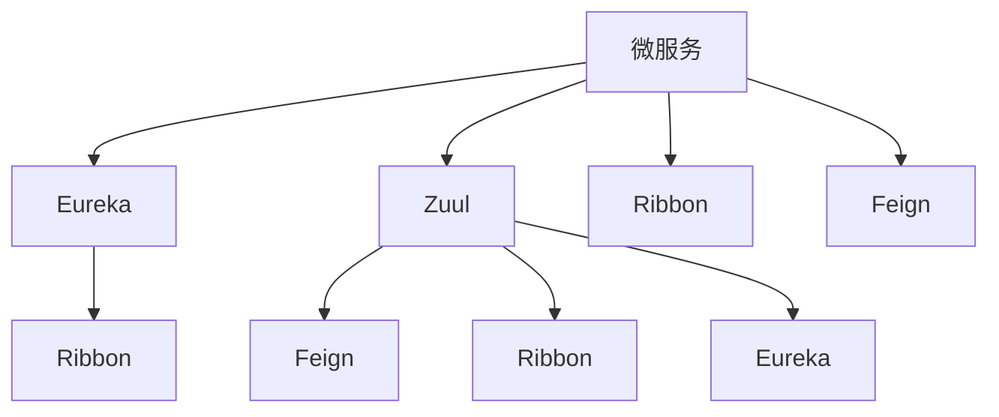

                 

# Spring Cloud微服务架构实战

> 关键词：微服务, Spring Cloud, 分布式, 服务治理, 容器化, DevOps

## 1. 背景介绍

随着互联网应用的规模不断扩大，传统的单体架构越来越难以满足复杂多变的业务需求。微服务架构通过将应用拆分为多个独立的、可独立部署的小服务，有效地解决了单体应用难以维护、扩展困难的问题。与此同时，随着DevOps理念的普及，持续交付和持续集成成为企业级应用开发的重要组成部分。而Spring Cloud作为基于Spring Boot的微服务框架，不仅提供了丰富的微服务构建工具，还能通过Eureka、Zuul、Ribbon、Feign等组件实现高效的服务治理和流量控制。本篇文章将通过案例实战的方式，深入剖析Spring Cloud微服务架构的设计思想、核心组件和技术栈，为读者提供从设计到部署的完整实战指南。

## 2. 核心概念与联系

### 2.1 核心概念概述

在深入讲解Spring Cloud微服务架构之前，我们需要了解一些核心概念：

- 微服务架构(Microservices Architecture)：将单体应用拆分为多个独立的服务模块，每个服务围绕业务核心构建，具有独立的运行环境、部署和扩展能力。微服务架构支持快速迭代、异步通信、数据局部化等特性，适合复杂、高并发的应用场景。

- Spring Cloud：基于Spring Boot的微服务框架，提供了一系列工具和组件，支持构建微服务、服务治理、流量控制、配置管理、安全管理等功能。

- Eureka：服务注册与发现组件，用于管理微服务实例的注册和发现，支持自动注册和心跳检测。

- Zuul：API网关组件，用于统一处理微服务的请求和响应，支持路由、限流、负载均衡等功能。

- Ribbon：客户端负载均衡组件，用于选择微服务实例，实现负载均衡和故障转移。

- Feign：HTTP客户端组件，提供了一种声明式的HTTP API客户端代理机制，便于统一管理微服务之间的通信。

这些核心概念构成了Spring Cloud微服务架构的基础，下面通过一个简单的流程图来展示它们之间的联系。



## 3. 核心算法原理 & 具体操作步骤

### 3.1 算法原理概述

Spring Cloud微服务架构的核心算法原理可以概括为以下几个方面：

- 微服务拆分与组装：通过定义服务接口和服务实现，将单体应用拆分为多个微服务，并通过Spring Cloud组件实现服务间的异步通信和协作。
- 服务注册与发现：微服务通过Eureka组件进行注册和发现，实现服务的自动管理和动态扩缩容。
- 客户端负载均衡：客户端通过Ribbon组件进行负载均衡，确保服务调用能够均衡分配到各个实例。
- API网关路由：Zuul组件作为API网关，统一处理API请求，实现路由、限流、负载均衡等功能。
- 声明式API客户端：Feign组件提供声明式的HTTP API客户端代理机制，简化了微服务间的通信。

### 3.2 算法步骤详解

以下是Spring Cloud微服务架构的核心操作步骤：

1. **定义服务接口和服务实现**：
   - 定义微服务的接口和实现，接口定义了服务对外提供的接口和调用方式。
   - 使用Spring Boot生成相应的Java代码，并配置服务信息。

2. **服务注册与发现**：
   - 在每个服务启动时，调用Eureka的注册接口，将服务信息注册到Eureka服务注册中心。
   - Eureka服务注册中心会维护所有微服务实例的信息，并通过心跳检测机制检测实例状态。

3. **客户端负载均衡**：
   - 客户端通过Ribbon组件选择服务实例，默认使用轮询算法，支持自定义算法和故障转移策略。
   - 客户端调用Ribbon，Ribbon会根据服务实例的状态和负载情况，选择最合适的实例进行调用。

4. **API网关路由**：
   - 使用Zuul作为API网关，将多个微服务的请求路由到不同的服务实例。
   - Zuul支持基于URL、路由规则、IP地址等进行路由，并提供限流、负载均衡等功能。

5. **声明式API客户端**：
   - 使用Feign声明式HTTP客户端，将API调用封装为接口代理，简化调用流程。
   - Feign自动生成客户端代理，并提供注解式配置，简化接口定义。

### 3.3 算法优缺点

Spring Cloud微服务架构的优点包括：

- 灵活可扩展：微服务架构能够灵活拆分成多个独立的服务，每个服务可以根据需求进行单独扩展。
- 高性能异步通信：通过异步通信，可以有效地提升微服务的性能和响应速度。
- 统一管理：Spring Cloud提供了统一的管理平台，支持服务的自动注册、发现和负载均衡。

但微服务架构也存在一些缺点：

- 复杂度高：微服务架构的复杂性较高，需要协调多个服务之间的交互。
- 数据一致性问题：分布式系统中的数据一致性问题难以保证，可能出现数据不一致的情况。
- 运维难度大：微服务架构的运维复杂性增加，需要建立完善的服务治理体系。

### 3.4 算法应用领域

Spring Cloud微服务架构在以下几个领域具有广泛的应用：

- 电商应用：电商平台通常具有复杂和多变的业务需求，通过微服务架构可以灵活构建服务，支持高并发和高可用。
- 金融应用：金融行业对性能和安全性要求高，微服务架构能够提升系统的稳定性和可靠性。
- 社交应用：社交应用涉及大量的用户数据，微服务架构可以更好地支持数据局部化和分布式计算。
- 物联网应用：物联网设备众多，微服务架构能够支持异构设备和数据处理。

## 4. 数学模型和公式 & 详细讲解 & 举例说明

### 4.1 数学模型构建

假设我们有n个微服务，每个服务处理能力为c_i(i=1,...,n)，服务请求到达率为λ，则微服务架构的响应时间T可以表示为：

$$
T = \frac{\sum_{i=1}^n c_i \cdot d_i}{\sum_{i=1}^n c_i}
$$

其中，d_i表示第i个服务的响应时间，c_i表示第i个服务的处理能力。

### 4.2 公式推导过程

我们可以对上述公式进行推导：

- 假设服务请求平均响应时间为T，则总响应时间T为：
$$
T = \frac{1}{N}\sum_{i=1}^N t_i
$$
其中t_i表示第i个服务的响应时间。

- 由于服务请求的到达率为λ，单个服务的响应时间T可以表示为：
$$
T = \frac{1}{\lambda} \sum_{i=1}^n c_i \cdot \frac{1}{c_i}
$$

- 将上述公式代入T的表达式，得到：
$$
T = \frac{\sum_{i=1}^n c_i \cdot d_i}{\sum_{i=1}^n c_i}
$$

### 4.3 案例分析与讲解

假设我们有3个微服务，每个服务处理能力分别为c1=10，c2=15，c3=20，服务请求到达率为λ=20。服务1的响应时间为d1=2，服务2的响应时间为d2=3，服务3的响应时间为d3=5。则微服务架构的响应时间T可以计算为：

$$
T = \frac{10 \cdot 2 + 15 \cdot 3 + 20 \cdot 5}{10 + 15 + 20} = 3.2
$$

这意味着，整个微服务架构的响应时间为3.2秒。

## 5. 项目实践：代码实例和详细解释说明

### 5.1 开发环境搭建

在进行Spring Cloud微服务架构的开发前，需要搭建好开发环境。以下是详细的搭建步骤：

1. 安装JDK：从官网下载并安装JDK，确保版本符合Spring Cloud的兼容性。
2. 安装Maven：从官网下载并安装Maven，用于依赖管理和项目构建。
3. 安装Spring Boot：从官网下载并安装Spring Boot，使用Maven的依赖管理。
4. 安装Spring Cloud：通过Maven安装Spring Cloud，添加以下依赖：

```xml
<dependency>
    <groupId>org.springframework.cloud</groupId>
    <artifactId>spring-cloud-starter</artifactId>
</dependency>
```

### 5.2 源代码详细实现

以下是一个简单的Spring Cloud微服务架构示例，包含两个微服务：

```java
// 服务1
@SpringBootApplication
@EnableDiscoveryClient
@EnableEurekaClient
public class Service1Application {
    public static void main(String[] args) {
        SpringApplication.run(Service1Application.class, args);
    }
}

@RestController
public class Service1Controller {
    @Autowired
    private ExternalService externalService;

    @GetMapping("/ping")
    public String ping() {
        String response = externalService.ping();
        return response;
    }
}

// 服务2
@SpringBootApplication
@EnableDiscoveryClient
@EnableEurekaClient
public class Service2Application {
    public static void main(String[] args) {
        SpringApplication.run(Service2Application.class, args);
    }
}

@RestController
public class Service2Controller {
    @Autowired
    private ExternalService externalService;

    @GetMapping("/ping")
    public String ping() {
        String response = externalService.ping();
        return response;
    }
}
```

其中，`SpringBootApplication`注解用于标注Spring Boot应用程序，`@EnableDiscoveryClient`注解用于注册Eureka服务，`@RestController`注解用于定义HTTP请求处理器。

### 5.3 代码解读与分析

- `@SpringBootApplication`：标注Spring Boot应用程序，同时启用Spring MVC、Spring Data JPA等功能。
- `@EnableDiscoveryClient`：标注Eureka服务注册客户端，用于向Eureka服务注册中心注册服务实例。
- `@EnableEurekaClient`：标注Eureka服务发现客户端，用于发现Eureka服务注册中心中的服务实例。
- `@RestController`：标注HTTP请求处理器，定义了HTTP请求的处理方式。
- `@Autowired`：标注依赖注入，自动注入依赖服务。
- `@GetMapping`：标注HTTP GET请求的处理器，定义了HTTP请求的处理方法。

### 5.4 运行结果展示

启动`Service1`和`Service2`后，使用Eureka界面可以发现两个服务实例：


## 6. 实际应用场景

### 6.1 电商应用

电商应用通常涉及复杂的业务流程，如商品搜索、购物车管理、订单处理等。通过微服务架构，可以将这些业务流程拆分为多个独立的服务，每个服务负责处理特定的业务逻辑。例如，商品搜索服务可以处理商品信息的查询、推荐等，订单处理服务可以处理订单的生成、支付、发货等，库存服务可以处理库存信息的更新、查询等。

### 6.2 金融应用

金融应用对性能和安全性要求高，微服务架构能够提升系统的稳定性和可靠性。例如，在支付系统服务中，可以使用微服务架构处理支付请求的路由、限流、负载均衡等，确保支付系统的性能和安全性。在风险控制服务中，可以使用微服务架构处理风险评估、反欺诈等业务逻辑。

### 6.3 社交应用

社交应用涉及大量的用户数据，微服务架构可以更好地支持数据局部化和分布式计算。例如，在消息服务中，可以使用微服务架构处理用户消息的存储、分发、查询等。在用户认证服务中，可以使用微服务架构处理用户身份的验证、授权等。

### 6.4 物联网应用

物联网设备众多，微服务架构能够支持异构设备和数据处理。例如，在传感器数据采集服务中，可以使用微服务架构处理传感器数据的采集、存储、处理等。在设备管理服务中，可以使用微服务架构处理设备的信息管理、配置、监控等。

## 7. 工具和资源推荐

### 7.1 学习资源推荐

为了帮助开发者深入理解Spring Cloud微服务架构，以下是一些推荐的学习资源：

- Spring Cloud官方文档：Spring Cloud官方文档是学习Spring Cloud的最佳资源，涵盖了所有组件的详细介绍和使用示例。

- Spring Cloud实战教程：该书详细讲解了Spring Cloud微服务架构的实战应用，适合实战开发。

- Spring Cloud Alur课程：在Alur网站上，可以观看Spring Cloud的官方视频教程，系统学习微服务架构。

### 7.2 开发工具推荐

Spring Cloud微服务架构的开发离不开良好的工具支持。以下是几款推荐的开发工具：

- IDEA：IntelliJ IDEA是一款流行的Java开发工具，支持Spring Boot和Spring Cloud的开发。

- Eclipse：Eclipse是一款开源的Java开发工具，支持Spring Boot和Spring Cloud的开发。

- Maven：Maven是一款依赖管理工具，用于管理Spring Cloud项目的依赖。

- Git：Git是一款版本控制系统，用于协同开发和版本管理。

### 7.3 相关论文推荐

Spring Cloud微服务架构的研究涉及众多领域的论文，以下是几篇代表性的论文：

- Spring Cloud Microservices Architecture：该论文详细介绍了Spring Cloud微服务架构的设计思想和实现机制。

- Microservices Patterns: Implementing Microservices with Spring Boot and Spring Cloud：该论文详细介绍了Spring Cloud微服务架构的实现模式和使用技巧。

- Distributed Systems: Concepts and Design and Implementation：该书籍详细讲解了分布式系统的设计和管理，适合深入理解微服务架构。

## 8. 总结：未来发展趋势与挑战

### 8.1 总结

本文对Spring Cloud微服务架构的设计思想、核心组件和技术栈进行了全面介绍。通过案例实战，展示了Spring Cloud微服务架构的实际应用场景和效果。通过系统讲解，相信读者已经能够掌握Spring Cloud微服务架构的实现方法，并能够在实际项目中灵活应用。

### 8.2 未来发展趋势

展望未来，Spring Cloud微服务架构将继续朝着以下几个方向发展：

- 分布式事务：微服务架构对分布式事务的支持仍需提升，未来的研究方向包括分布式事务的管理和优化。

- 服务治理：未来的服务治理将更加注重服务的可观测性、可维护性和可扩展性，服务治理工具的自动化和智能化水平将不断提升。

- 容器化：随着Docker和Kubernetes的普及，微服务架构的容器化部署将成为标准。

- DevOps：DevOps理念将深入微服务架构的各个环节，推动持续集成、持续交付、持续监控等自动化流程。

### 8.3 面临的挑战

尽管Spring Cloud微服务架构已经取得诸多成功案例，但在其发展过程中仍面临以下挑战：

- 微服务复杂度：微服务架构的复杂度增加，需要更有效的管理和治理机制。

- 数据一致性：分布式系统中的数据一致性问题难以解决，需要更高效的数据同步和协调机制。

- 安全性：微服务架构的安全性问题仍需解决，需要更完善的安全策略和机制。

- 运维成本：微服务架构的运维成本较高，需要建立完善的运维体系和自动化工具。

### 8.4 研究展望

未来，微服务架构的研究将在以下几个方向进行深入探索：

- 服务治理工具：开发更加智能、高效的服务治理工具，支持服务的自动注册、发现、路由、限流、负载均衡等功能。

- 服务治理策略：研究服务治理的自动化、智能化策略，支持服务实例的动态管理和负载均衡。

- 分布式事务：研究分布式事务的管理和优化策略，支持跨服务的事务一致性。

- 容器化部署：研究容器化部署的最佳实践，支持微服务的自动化部署和运维。

- DevOps工具链：研究DevOps工具链的自动化流程，支持微服务的持续集成、持续交付和持续监控。

## 9. 附录：常见问题与解答

**Q1：Spring Cloud和Docker/Kubernetes有什么关系？**

A: Spring Cloud和Docker/Kubernetes是紧密相关的技术栈。Docker和Kubernetes是容器化和容器编排工具，能够实现微服务的自动化部署、扩展和运维。Spring Cloud则提供了微服务架构的构建和管理工具，如Eureka、Zuul、Ribbon等，可以与Docker/Kubernetes无缝集成。

**Q2：微服务架构和单体架构有什么区别？**

A: 微服务架构和单体架构的区别主要在于架构的设计理念和应用场景。单体架构将整个应用作为一个整体进行开发和部署，适用于简单、低并发的应用场景。微服务架构将应用拆分为多个独立的服务模块，每个服务模块围绕业务核心构建，适用于复杂、高并发的应用场景。微服务架构能够更好地支持分布式、异步通信和数据局部化。

**Q3：微服务架构有哪些优势和劣势？**

A: 微服务架构的优势包括：
- 灵活可扩展：微服务架构能够灵活拆分成多个独立的服务，每个服务可以根据需求进行单独扩展。
- 高性能异步通信：通过异步通信，可以有效地提升微服务的性能和响应速度。
- 统一管理：Spring Cloud提供了统一的管理平台，支持服务的自动注册、发现和负载均衡。

微服务架构的劣势包括：
- 复杂度高：微服务架构的复杂性较高，需要协调多个服务之间的交互。
- 数据一致性问题：分布式系统中的数据一致性问题难以保证，可能出现数据不一致的情况。
- 运维难度大：微服务架构的运维复杂性增加，需要建立完善的服务治理体系。

通过本文的系统讲解，相信读者已经能够全面理解Spring Cloud微服务架构的设计思想、核心组件和技术栈，并能够在实际项目中灵活应用。在未来的发展中，微服务架构将继续朝着更加智能化、自动化、可扩展的方向发展，成为构建复杂、高并发的应用系统的重要工具。

---

作者：禅与计算机程序设计艺术 / Zen and the Art of Computer Programming

