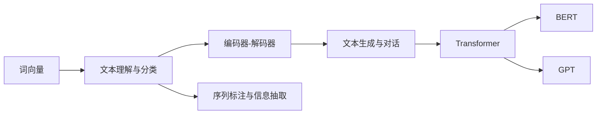

                 

# TensorFlow 自然语言处理技术：理解和生成文本

> 关键词：自然语言处理, TensorFlow, 文本理解, 文本生成, 语言模型, 编码器-解码器模型, 注意力机制, 词向量, 预训练模型

## 1. 背景介绍

### 1.1 问题由来

随着人工智能技术的迅猛发展，自然语言处理(Natural Language Processing, NLP)在语言识别、机器翻译、文本生成等方面取得了巨大突破。TensorFlow作为领先的人工智能深度学习框架，在NLP技术的应用中发挥了至关重要的作用。理解和使用TensorFlow的NLP技术，是当代AI工程师和研究者的重要技能。

### 1.2 问题核心关键点

TensorFlow在NLP中的应用，主要集中在以下几个方面：

- **文本理解与分类**：通过编码器-解码器模型、卷积神经网络(CNN)等架构，将文本转化为向量表示，用于文本分类、情感分析等任务。
- **文本生成与对话**：使用循环神经网络(RNN)、长短时记忆网络(LSTM)、Transformer等模型，进行文本生成、对话生成等任务。
- **序列标注与信息抽取**：通过双向LSTM、CRF等模型，实现词性标注、命名实体识别、关系抽取等序列标注任务。
- **机器翻译与语音识别**：利用Transformer、CTC(连接时序分类)等架构，实现高效的机器翻译和语音识别功能。

这些技术构成了TensorFlow在NLP领域的主要应用框架，通过学习和实践，可以大幅提升NLP技术的开发和应用能力。

### 1.3 问题研究意义

掌握TensorFlow的NLP技术，对于推动NLP技术在各行各业的应用，提升人工智能系统的智能化水平，具有重要意义：

1. **降低开发难度**：TensorFlow的高级API和组件，大大简化了NLP模型的构建和训练过程。
2. **提升模型效果**：利用TensorFlow强大的计算能力，可以实现更高效的NLP算法和模型。
3. **加速应用落地**：TensorFlow在硬件加速、分布式训练等方面的优势，加速了NLP技术在各行业的应用进程。
4. **拓展应用场景**：NLP技术的广泛应用，为医疗、金融、教育等行业带来了全新的可能性。
5. **推动技术创新**：TensorFlow提供的灵活性和扩展性，促进了NLP领域的持续创新。

本文将详细阐述TensorFlow在NLP领域的关键技术，包括文本理解与分类、文本生成与对话、序列标注与信息抽取等，并给出实践中的代码示例和详细解释，为读者提供全面的学习资源和工具推荐，助力NLP技术的应用和创新。

## 2. 核心概念与联系

### 2.1 核心概念概述

理解TensorFlow的NLP技术，需要掌握以下几个核心概念：

- **词向量(Word Embedding)**：将单词映射为向量表示，捕捉单词之间的语义关系。如Word2Vec、GloVe等。
- **编码器-解码器(Encoder-Decoder)**：用于序列到序列的任务，如机器翻译、文本生成等。
- **注意力机制(Attention Mechanism)**：帮助模型关注重要信息，提高模型对序列的关注度。
- **Transformer**：一种基于自注意力机制的深度学习模型，在机器翻译、文本生成等任务上表现出色。
- **BERT**：Google提出的双向Transformer模型，在文本分类、命名实体识别等任务上取得了SOTA性能。
- **GPT**：OpenAI提出的生成性Transformer模型，在文本生成、对话生成等任务上表现优异。

这些概念通过TensorFlow的NLP工具库（如TensorFlow Text）得以实现，构成了TensorFlow在NLP领域的核心框架。

### 2.2 核心概念原理和架构的 Mermaid 流程图

以下是TensorFlow在NLP领域核心概念的原理和架构流程图：



这个流程图展示了TensorFlow NLP技术的核心架构，从词向量到文本理解与分类，再到文本生成与对话，最后到Transformer、BERT、GPT等高级模型的应用。这些概念和技术通过TensorFlow的API和组件，有机结合，形成了强大的NLP处理能力。

## 3. 核心算法原理 & 具体操作步骤

### 3.1 算法原理概述

TensorFlow的NLP技术主要基于以下几类模型和算法：

- **词向量模型**：如Word2Vec、GloVe等，将单词转换为向量表示，捕捉单词之间的语义关系。
- **编码器-解码器模型**：如LSTM、GRU等，用于序列到序列的任务，如机器翻译、文本生成等。
- **Transformer模型**：基于自注意力机制，用于高效的序列处理，尤其在机器翻译、文本生成等任务上表现优异。
- **BERT模型**：双向Transformer模型，通过大规模预训练，具备强大的语言理解能力。
- **GPT模型**：生成性Transformer模型，在文本生成、对话生成等任务上效果显著。

### 3.2 算法步骤详解

TensorFlow的NLP技术应用主要涉及以下几个步骤：

1. **数据准备**：收集和预处理文本数据，如分词、标记、编码等。
2. **模型选择**：根据任务需求选择合适的模型，如编码器-解码器、Transformer、BERT、GPT等。
3. **模型构建**：使用TensorFlow构建模型，定义输入、输出、损失函数等。
4. **训练与优化**：使用GPU或TPU进行模型训练，优化超参数，提高模型效果。
5. **模型评估与部署**：在测试集上评估模型性能，部署模型到生产环境中。

### 3.3 算法优缺点

TensorFlow的NLP技术具有以下优点：

- **强大的计算能力**：TensorFlow支持GPU/TPU等硬件加速，加速模型训练和推理。
- **丰富的工具和组件**：TensorFlow提供了丰富的工具和组件，简化NLP模型的开发过程。
- **灵活的模型架构**：TensorFlow支持多种模型架构，适应不同任务需求。
- **强大的社区支持**：TensorFlow拥有庞大的社区支持，提供丰富的教程和代码资源。

同时，TensorFlow在NLP应用中也存在一些缺点：

- **资源消耗大**：大型NLP模型对硬件资源要求较高，训练和推理成本较高。
- **模型复杂度高**：复杂模型结构对算法理解和调参能力要求较高。
- **学习曲线陡峭**：初学者可能需要花费更多时间掌握TensorFlow的基础知识和应用技巧。

### 3.4 算法应用领域

TensorFlow的NLP技术在多个领域得到了广泛应用，包括但不限于：

- **文本分类与情感分析**：通过编码器-解码器模型和Transformer，实现文本分类和情感分析任务。
- **机器翻译**：利用Transformer模型，实现高效的机器翻译功能。
- **文本生成**：使用GPT等生成性模型，生成高质量的文本内容。
- **对话系统**：通过RNN、Transformer等模型，构建智能对话系统。
- **命名实体识别**：通过双向LSTM、CRF等模型，实现命名实体识别任务。
- **情感识别与舆情分析**：通过情感分析模型，实现舆情监测和情感识别功能。

这些应用展示了TensorFlow在NLP领域的强大能力，推动了NLP技术在各行各业的应用和创新。

## 4. 数学模型和公式 & 详细讲解 & 举例说明

### 4.1 数学模型构建

在TensorFlow中，NLP模型的构建通常涉及以下几个步骤：

1. **数据准备**：将文本数据转换为TensorFlow可处理的形式，如Tensor、SparseTensor等。
2. **模型定义**：使用TensorFlow的API定义模型的输入、输出、损失函数等。
3. **模型训练**：使用GPU或TPU进行模型训练，优化超参数。
4. **模型评估**：在测试集上评估模型性能，调整模型参数。

### 4.2 公式推导过程

以机器翻译为例，使用Transformer模型进行推导：

设输入序列为 $\text{Input}$，输出序列为 $\text{Output}$，目标为将 $\text{Input}$ 翻译成 $\text{Output}$。

Transformer模型由编码器和解码器组成，具体结构如下：


其中，Encoder由多个层组成，包括自注意力层、前馈神经网络层等。Decoder同样由多个层组成，包括自注意力层、多头注意力层、前馈神经网络层等。

编码器的自注意力层公式为：

$$
\text{Attention(Q, K, V)} = \text{softmax}(\frac{\text{Q} \cdot \text{K}^T}{\sqrt{d_k}}) \cdot \text{V}
$$

其中，$Q$、$K$、$V$分别为查询向量、键向量和值向量，$d_k$为向量的维度。

解码器的多头注意力层公式为：

$$
\text{Multi-Head Attention(Q, K, V)} = \text{Concat}(\text{Attention}(Q_1, K_1, V_1), \text{Attention}(Q_2, K_2, V_2), ..., \text{Attention}(Q_h, K_h, V_h)) \cdot \text{Multi-Head}\text{Projection}
$$

其中，$Q$、$K$、$V$为不同头的查询向量、键向量和值向量，$h$为头的数量。

### 4.3 案例分析与讲解

以文本生成为例，使用GPT模型进行推导：

GPT模型基于自回归模型，其公式为：

$$
\text{GPT}_{t+1} = \text{Softmax}(\text{Attention}(\text{GPT}_t, \text{GPT}_{t-1}, ..., \text{GPT}_0) \cdot \text{W})
$$

其中，$\text{GPT}_t$ 表示当前时刻的文本生成结果，$\text{W}$ 为权重矩阵，$\text{Softmax}$ 为归一化函数。

具体实现时，使用TensorFlow的API定义模型结构，如下所示：

```python
import tensorflow as tf
from tensorflow.keras.layers import Input, Dense, LSTM
from tensorflow.keras import Model

# 定义输入层
inputs = Input(shape=(None, input_dim))

# 定义LSTM层
lstm_layer = LSTM(units=hidden_units, return_sequences=True, return_state=True)

# 定义输出层
outputs = Dense(output_dim, activation='softmax')

# 构建模型
model = Model(inputs, outputs)

# 编译模型
model.compile(loss='categorical_crossentropy', optimizer='adam', metrics=['accuracy'])
```

以上代码展示了使用TensorFlow构建文本生成模型的过程，包括输入层、LSTM层和输出层的定义，模型的编译和训练等步骤。

## 5. 项目实践：代码实例和详细解释说明

### 5.1 开发环境搭建

进行TensorFlow的NLP项目开发，需要准备好以下开发环境：

1. **安装TensorFlow**：从TensorFlow官网下载最新版本的安装程序，按照安装向导完成安装。
2. **安装TensorFlow Text**：使用pip安装TensorFlow Text，以便于处理文本数据和构建NLP模型。
3. **安装相关依赖**：根据项目需求，安装必要的依赖库，如numpy、scikit-learn等。

### 5.2 源代码详细实现

以文本分类为例，使用BERT模型进行推导：

首先，准备文本数据集，定义BERT模型和相关超参数：

```python
import tensorflow as tf
from tensorflow.keras.layers import Input, Dense, Dropout
from tensorflow.keras.models import Model
from tensorflow.keras.optimizers import Adam

# 定义输入层
inputs = Input(shape=(None, input_dim))

# 定义BERT层
bert_layer = bert_layer(inputs, hidden_units=hidden_units, trainable=False)

# 定义输出层
outputs = Dense(num_classes, activation='softmax')

# 构建模型
model = Model(inputs, outputs)

# 编译模型
model.compile(loss='categorical_crossentropy', optimizer=Adam(learning_rate=learning_rate), metrics=['accuracy'])
```

在训练模型时，使用TensorFlow的API进行模型训练和优化：

```python
# 定义训练过程
train_generator = tf.data.Dataset.from_tensor_slices((train_input, train_labels))
train_generator = train_generator.shuffle(buffer_size=buffer_size).batch(batch_size)

# 训练模型
model.fit(train_generator, epochs=num_epochs, validation_data=(val_input, val_labels))
```

### 5.3 代码解读与分析

以上代码展示了使用TensorFlow进行BERT文本分类的过程，包括输入层、BERT层和输出层的定义，模型的编译和训练等步骤。

在模型训练过程中，使用TensorFlow的Data API构建数据生成器，将数据进行分批处理和预处理，从而提高训练效率和效果。同时，使用Adam优化器进行模型优化，并设置合适的超参数。

### 5.4 运行结果展示

在训练完成后，使用测试集评估模型性能，如下所示：

```python
# 定义测试过程
test_generator = tf.data.Dataset.from_tensor_slices((test_input, test_labels))
test_generator = test_generator.batch(batch_size)

# 评估模型
model.evaluate(test_generator)
```

以上代码展示了使用TensorFlow进行模型评估的过程，包括测试集数据生成器构建和模型评估等步骤。

## 6. 实际应用场景

### 6.1 智能客服系统

TensorFlow的NLP技术可以应用于智能客服系统的构建。传统客服系统需要大量人工，高峰期响应缓慢，且客户满意度难以保证。通过TensorFlow构建的智能客服系统，可以7x24小时不间断服务，快速响应客户咨询，用自然流畅的语言解答各类常见问题。

在实际应用中，可以使用TensorFlow Text处理客户咨询信息，使用BERT模型进行意图识别和问答生成，构建智能客服聊天机器人。通过不断学习和优化，可以提升客服系统的智能化水平，提高客户满意度和问题解决效率。

### 6.2 金融舆情监测

TensorFlow的NLP技术可以用于金融舆情监测。金融机构需要实时监测市场舆论动向，以便及时应对负面信息传播，规避金融风险。通过TensorFlow构建的情感分析模型，可以自动识别和分析金融新闻、评论等文本数据，评估市场情绪，及时预警潜在风险。

具体而言，可以使用TensorFlow构建情感分析模型，识别金融新闻和评论的情感倾向，判断市场的乐观或悲观情绪。同时，结合金融数据和市场信息，预测金融市场的波动和趋势，为投资者提供决策支持。

### 6.3 个性化推荐系统

TensorFlow的NLP技术可以应用于个性化推荐系统。当前的推荐系统往往只依赖用户的历史行为数据进行物品推荐，无法深入理解用户的真实兴趣偏好。通过TensorFlow构建的文本分类模型，可以挖掘用户浏览、评论等行为数据中的语义信息，实现更加精准、多样的推荐内容。

具体而言，可以使用TensorFlow构建文本分类模型，对用户行为数据进行情感分析，判断用户的兴趣偏好。同时，结合物品描述和标签信息，构建物品的向量表示，计算用户和物品的相似度，推荐符合用户偏好的物品。

### 6.4 未来应用展望

随着TensorFlow和NLP技术的不断发展，未来TensorFlow在NLP领域的应用将更加广泛和深入。以下是一些未来展望：

1. **多模态融合**：结合视觉、语音、文本等多模态数据，构建更加全面和精准的NLP模型。
2. **知识图谱**：结合知识图谱和NLP技术，实现更加全面的信息抽取和推理。
3. **预训练模型**：利用预训练模型，提升模型在特定领域的性能，降低标注数据的依赖。
4. **联邦学习**：结合联邦学习技术，保护用户隐私，实现分布式训练和推理。
5. **生成式模型**：利用生成式模型，提升文本生成、对话生成等任务的效果。

这些技术将进一步拓展TensorFlow在NLP领域的应用范围，推动NLP技术的不断创新和进步。

## 7. 工具和资源推荐

### 7.1 学习资源推荐

为了帮助开发者系统掌握TensorFlow的NLP技术，以下是一些优质的学习资源：

1. **《TensorFlow实战自然语言处理》书籍**：详细介绍了TensorFlow在NLP领域的经典算法和模型，包括文本理解与分类、文本生成与对话、序列标注与信息抽取等。
2. **TensorFlow官方文档**：提供了丰富的NLP教程和代码示例，是学习TensorFlow的最佳资源。
3. **Stanford CS224N课程**：斯坦福大学开设的NLP明星课程，涵盖NLP的基本概念和前沿技术。
4. **Kaggle竞赛**：参加Kaggle的NLP竞赛，可以实战练兵，提升TensorFlow的NLP开发能力。

### 7.2 开发工具推荐

TensorFlow提供了丰富的工具和组件，用于NLP模型的开发和部署。以下是一些推荐的工具：

1. **TensorFlow Text**：提供了NLP处理的基本组件，如分词、编码、解码等。
2. **TensorBoard**：用于可视化模型训练过程，实时监控模型性能。
3. **TensorFlow Hub**：提供了预训练模型和组件，方便快速构建NLP模型。
4. **TensorFlow Lite**：将模型转化为移动端可执行文件，实现轻量级部署。

### 7.3 相关论文推荐

TensorFlow在NLP领域的应用得益于众多学者的贡献。以下是一些关键论文，推荐阅读：

1. **Attention is All You Need**：提出Transformer模型，开启了NLP领域的预训练大模型时代。
2. **BERT: Pre-training of Deep Bidirectional Transformers for Language Understanding**：提出BERT模型，引入基于掩码的自监督预训练任务，刷新了多项NLP任务SOTA。
3. **Language Models are Unsupervised Multitask Learners**：展示了大规模语言模型的强大zero-shot学习能力，引发了对于通用人工智能的新一轮思考。

这些论文代表了大模型和微调技术的发展脉络，帮助研究者把握学科前进方向，激发更多的创新灵感。

## 8. 总结：未来发展趋势与挑战

### 8.1 总结

本文详细阐述了TensorFlow在NLP领域的关键技术，包括文本理解与分类、文本生成与对话、序列标注与信息抽取等，并给出了实践中的代码示例和详细解释。通过本文的系统梳理，可以看到TensorFlow在NLP领域的强大能力和广泛应用，对于推动NLP技术在各行各业的应用，提升人工智能系统的智能化水平，具有重要意义。

### 8.2 未来发展趋势

展望未来，TensorFlow在NLP领域的发展将呈现以下几个趋势：

1. **多模态融合**：结合视觉、语音、文本等多模态数据，构建更加全面和精准的NLP模型。
2. **知识图谱**：结合知识图谱和NLP技术，实现更加全面的信息抽取和推理。
3. **预训练模型**：利用预训练模型，提升模型在特定领域的性能，降低标注数据的依赖。
4. **联邦学习**：结合联邦学习技术，保护用户隐私，实现分布式训练和推理。
5. **生成式模型**：利用生成式模型，提升文本生成、对话生成等任务的效果。

这些技术将进一步拓展TensorFlow在NLP领域的应用范围，推动NLP技术的不断创新和进步。

### 8.3 面临的挑战

尽管TensorFlow在NLP领域取得了显著进展，但在迈向更加智能化、普适化应用的过程中，仍面临一些挑战：

1. **资源消耗大**：大型NLP模型对硬件资源要求较高，训练和推理成本较高。
2. **模型复杂度高**：复杂模型结构对算法理解和调参能力要求较高。
3. **学习曲线陡峭**：初学者可能需要花费更多时间掌握TensorFlow的基础知识和应用技巧。
4. **可解释性不足**：深度学习模型的"黑盒"特性，导致模型难以解释和调试。

### 8.4 研究展望

面对TensorFlow在NLP应用中面临的挑战，未来的研究需要在以下几个方面寻求新的突破：

1. **模型压缩与优化**：开发轻量级模型和压缩算法，降低资源消耗。
2. **可解释性增强**：引入可解释性技术，增强模型的透明度和可信度。
3. **跨领域迁移学习**：研究跨领域迁移学习技术，提升模型的通用性和泛化能力。
4. **多模态融合**：探索多模态融合技术，实现更加全面的信息处理和推理。
5. **自监督学习**：研究自监督学习技术，降低标注数据的依赖，提升模型的自主学习能力。

这些研究方向的探索，必将引领TensorFlow在NLP领域的技术进步，为构建安全、可靠、可解释、可控的智能系统铺平道路。

## 9. 附录：常见问题与解答

**Q1: TensorFlow在NLP中的应用前景如何？**

A: TensorFlow在NLP领域的应用前景非常广阔。通过TensorFlow，可以实现文本理解与分类、文本生成与对话、序列标注与信息抽取等任务，推动NLP技术在各行各业的应用和创新。TensorFlow提供了丰富的工具和组件，简化了NLP模型的开发和部署过程。

**Q2: TensorFlow在NLP应用中存在哪些挑战？**

A: TensorFlow在NLP应用中也面临一些挑战，主要包括：
1. 资源消耗大：大型NLP模型对硬件资源要求较高，训练和推理成本较高。
2. 模型复杂度高：复杂模型结构对算法理解和调参能力要求较高。
3. 学习曲线陡峭：初学者可能需要花费更多时间掌握TensorFlow的基础知识和应用技巧。
4. 可解释性不足：深度学习模型的"黑盒"特性，导致模型难以解释和调试。

**Q3: 如何优化TensorFlow的NLP模型？**

A: 优化TensorFlow的NLP模型可以从以下几个方面入手：
1. 使用轻量级模型：开发轻量级模型和压缩算法，降低资源消耗。
2. 引入可解释性技术：增强模型的透明度和可信度。
3. 探索多模态融合：结合视觉、语音、文本等多模态数据，构建更加全面和精准的NLP模型。
4. 研究跨领域迁移学习：提升模型的通用性和泛化能力。
5. 使用自监督学习：降低标注数据的依赖，提升模型的自主学习能力。

**Q4: TensorFlow的NLP技术在实际应用中如何部署？**

A: TensorFlow的NLP技术在实际应用中的部署，需要考虑以下几个方面：
1. 模型压缩与优化：开发轻量级模型和压缩算法，降低资源消耗。
2. 使用TensorFlow Lite：将模型转化为移动端可执行文件，实现轻量级部署。
3. 使用TensorBoard：实时监控模型训练过程，优化超参数。
4. 使用TensorFlow Serving：将模型封装为标准化服务接口，方便集成调用。

通过合理优化和部署TensorFlow的NLP技术，可以提升模型的性能和效率，实现更加灵活和高效的应用。

---

作者：禅与计算机程序设计艺术 / Zen and the Art of Computer Programming

