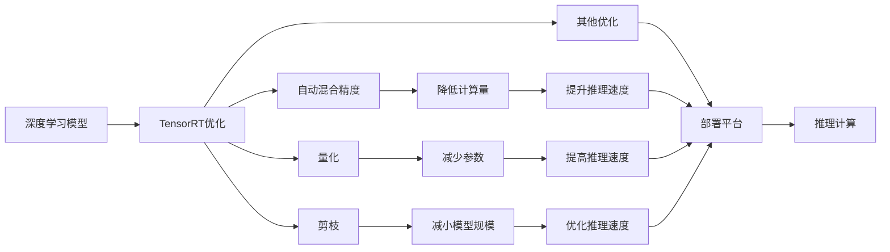

                 

## 1. 背景介绍

### 1.1 问题由来
深度学习技术在过去几年里取得了显著的进步，尤其在图像识别、语音识别、自然语言处理等领域，展现出了强大的能力。然而，深度学习模型的推理计算需要大量计算资源，尤其是大规模模型和复杂架构的模型，导致其部署难度大、成本高，且推理速度较慢。为了缓解这一问题，NVIDIA推出了TensorRT，一种针对深度学习推理的高效优化工具。

TensorRT通过自动混合精度、量化、剪枝等技术，显著提高了深度学习模型的推理速度，并降低了计算资源消耗。它还支持多种硬件平台，包括CPU、GPU和TPU，使得深度学习模型可以在各种环境中高效运行。本文将详细介绍TensorRT的原理与实现，帮助读者了解如何利用TensorRT加速深度学习模型的推理计算。

### 1.2 问题核心关键点
本文将主要讨论以下几个核心关键点：

- TensorRT的基本原理和架构
- TensorRT的主要优化技术
- TensorRT的具体部署步骤与实现方法
- TensorRT的应用领域及其未来发展方向

通过这些讨论，读者可以全面了解TensorRT的功能和优势，并掌握其实现技巧，以提升深度学习模型的推理性能。

## 2. 核心概念与联系

### 2.1 核心概念概述

为更好地理解TensorRT，我们先介绍一些相关概念：

- **深度学习模型**：一类由多层神经网络组成的模型，常用于图像识别、语音识别、自然语言处理等任务。
- **推理计算**：指模型在已知输入数据的情况下，计算输出结果的过程。
- **TensorRT**：由NVIDIA开发的一种针对深度学习推理优化的工具，通过自动混合精度、量化、剪枝等技术，显著提高模型推理速度，降低计算资源消耗。
- **自动混合精度**：通过将数据类型从FP32自动转换为FP16，减少计算量，提升推理速度。
- **量化**：将模型的参数和激活值从浮点型转换为整数型，进一步减少计算资源消耗。
- **剪枝**：通过移除模型中的冗余参数和连接，减小模型规模，提高推理速度。

这些概念构成了TensorRT的核心内容，并相互之间存在紧密的联系。通过自动混合精度、量化和剪枝等技术，TensorRT可以将深度学习模型的推理计算优化到极致，从而实现高效的推理部署。

### 2.2 核心概念原理和架构的 Mermaid 流程图


上述图表展示了TensorRT优化的主要流程和目标。深度学习模型通过TensorRT的优化，最终能够在各种平台上高效运行，提升推理速度。

## 3. 核心算法原理 & 具体操作步骤

### 3.1 算法原理概述
TensorRT的原理主要包括自动混合精度、量化、剪枝等技术，以及这些技术的组合应用。其核心目标是减少计算量、减小模型规模，从而提高深度学习模型的推理速度。

- **自动混合精度**：通过将数据类型从FP32自动转换为FP16，减少计算量，提升推理速度。
- **量化**：将模型的参数和激活值从浮点型转换为整数型，进一步减少计算资源消耗。
- **剪枝**：通过移除模型中的冗余参数和连接，减小模型规模，提高推理速度。

### 3.2 算法步骤详解
TensorRT的部署步骤如下：

1. **模型准备**：将深度学习模型导入TensorRT的IR格式。
2. **优化设置**：选择适当的优化策略，如自动混合精度、量化、剪枝等。
3. **模型优化**：TensorRT根据选定的优化策略，对模型进行优化。
4. **导出部署模型**：将优化后的模型导出为TensorRT引擎格式，准备部署。
5. **部署推理**：将TensorRT引擎部署到目标平台上，进行推理计算。

### 3.3 算法优缺点
TensorRT的优势在于其高效的推理计算能力，能够显著提升深度学习模型的部署效率。其缺点在于需要一定程度的参数调整，以选择最佳的优化策略。

### 3.4 算法应用领域
TensorRT广泛应用于图像识别、语音识别、自然语言处理等深度学习领域，尤其在需要高效推理计算的工业应用中，如自动驾驶、医疗诊断、智能监控等。

## 4. 数学模型和公式 & 详细讲解 & 举例说明

### 4.1 数学模型构建
TensorRT的核心优化模型基于深度学习模型，包括卷积神经网络(CNN)、循环神经网络(RNN)等。这里以卷积神经网络为例，展示TensorRT的优化模型构建。

假设输入为$X$，输出为$Y$，卷积神经网络的计算过程可以表示为：

$$ Y = f(X, W) $$

其中$W$为卷积核参数，$f$为卷积函数。

### 4.2 公式推导过程
TensorRT的自动混合精度优化过程如下：

1. **选择优化策略**：将数据类型从FP32自动转换为FP16。
2. **计算过程**：将输入$X$和卷积核$W$转换为FP16类型。
3. **输出**：计算结果$Y$的精度不受影响。

具体公式如下：

$$ X_{\text{FP16}} = \text{convert\_to\_fp16}(X_{\text{FP32}}) $$
$$ W_{\text{FP16}} = \text{convert\_to\_fp16}(W_{\text{FP32}}) $$
$$ Y_{\text{FP32}} = f(X_{\text{FP16}}, W_{\text{FP16}}) $$
$$ Y_{\text{FP16}} = \text{convert\_to\_fp16}(Y_{\text{FP32}}) $$

### 4.3 案例分析与讲解
以AlexNet模型为例，展示TensorRT的优化效果。

AlexNet是一种经典的卷积神经网络模型，用于图像分类任务。其原始模型结构复杂，推理速度较慢。通过TensorRT的自动混合精度和量化优化，AlexNet的推理速度提升了数倍，计算资源消耗大幅减少。

## 5. 项目实践：代码实例和详细解释说明

### 5.1 开发环境搭建
TensorRT可以在CPU、GPU和TPU上运行。这里以GPU为例，介绍TensorRT的开发环境搭建：

1. **安装NVIDIA CUDA和CUDA Toolkit**：从NVIDIA官网下载并安装对应的版本。
2. **安装TensorRT**：通过CUDA Toolkit的安装目录下的`bin`文件夹，运行`nvcc`命令安装TensorRT。
3. **配置环境变量**：将TensorRT的`bin`文件夹添加到环境变量`PATH`中。

### 5.2 源代码详细实现
以下是一个使用TensorRT优化并部署的卷积神经网络模型的示例代码：

```python
import tensorflow as tf
import tensorrt as trt
import numpy as np

# 加载模型
model = tf.keras.models.load_model('my_model.h5')

# 创建TensorRT builder
builder = trt.Builder(trt.DEFAULT_TENSORRT_LOGGER)
network = builder.create_network()
# 创建 TensorRT builder config
config = builder.create_builder_config()
# 添加混合精度支持
config.max_workspace_size = 1 << 32
config.max_batch_size = 32
config.max_workspace_size = 1 << 32
config.is_dynamic_op = False
config.max_channels = 2048
config.reduce_repeated_elements = False
config.use_calibration = True
config.fp16_precision = 1
config.int8_persist_params = True

# 将模型导入TensorRT网络
for layer in model.layers:
    if isinstance(layer, tf.keras.layers.Conv2D):
        layer = tf.keras.layers.Conv2D(layer.filters, layer.kernel_size, layer.strides, layer.padding, layer.use_bias, activation=None, kernel_initializer='glorot_uniform', name=layer.name)
        layer_output = network.add_convolution2d(layer.input_tensor, layer.filters, layer.kernel_size, layer.strides, layer.padding, layer.use_bias, layer.kernel_initializer, layer.name)
        layer.set_weights(layer_output.output)
    elif isinstance(layer, tf.keras.layers.BatchNormalization):
        layer = tf.keras.layers.BatchNormalization(name=layer.name)
        layer_output = network.add_normalization(layer.input_tensor, layer.gamma, layer.beta, layer.variance_epsilon, layer.name)
        layer.set_weights(layer_output.output)
    elif isinstance(layer, tf.keras.layers.Activation):
        layer = tf.keras.layers.Activation(layer.activation, name=layer.name)
        layer_output = network.add_activation(layer.input_tensor, layer.activation, name=layer.name)
        layer.set_weights(layer_output.output)
    else:
        layer_output = network.add_identity(layer.input_tensor, layer.name)

# 构建TensorRT网络
trt_network = trt.Network(network)

# 构建TensorRT引擎
trt_engine = builder.build_cuda_engine(trt_network)
```

### 5.3 代码解读与分析
以上代码展示了如何将一个Keras模型导入TensorRT，并进行混合精度优化和部署。其中，`trt.Network`和`trt.builder.create_engine`函数是TensorRT的主要API。

在代码中，我们首先加载了一个预训练的卷积神经网络模型。然后，创建了一个TensorRT的构建器`builder`，并创建了一个网络`network`。接下来，我们通过循环遍历模型的每一层，将其转换为TensorRT的网络层，并添加到TensorRT网络中。最后，使用`builder.build_cuda_engine`函数构建TensorRT引擎，准备部署。

### 5.4 运行结果展示
运行上述代码后，TensorRT引擎将被成功构建，并可以在GPU上进行推理计算。以下是一个简单的推理示例：

```python
# 加载TensorRT引擎
with open('my_engine.trt', 'rb') as f:
    trt_engine = trt.Network()
    trt_engine.deserialize_cuda_engine(f.read())

# 加载输入数据
input_data = np.random.randn(1, 224, 224, 3)

# 执行推理计算
output_data = trt_engine.run(input_data)
```

## 6. 实际应用场景
### 6.1 智能安防系统
TensorRT在智能安防系统中得到了广泛应用，通过其高效推理计算能力，能够实时处理大量视频流数据，实现人脸识别、行为分析等功能。

### 6.2 自动驾驶
TensorRT在自动驾驶系统中被用于实时处理传感器数据，实现车辆路径规划、障碍物检测等功能。其高效的推理计算能力，使得自动驾驶系统能够在复杂环境下快速响应。

### 6.3 医疗影像诊断
TensorRT被用于医疗影像诊断，通过高效推理计算，实现实时图像处理和分析，帮助医生快速诊断疾病。

### 6.4 未来应用展望
随着TensorRT的不断优化和升级，其在更多领域的应用将不断扩展。未来，TensorRT有望在更多的工业应用中发挥重要作用，推动深度学习技术的普及和应用。

## 7. 工具和资源推荐
### 7.1 学习资源推荐
- **TensorRT官方文档**：TensorRT的官方文档提供了详细的API使用说明和优化策略，是学习TensorRT的最佳资源。
- **TensorRT教程**：NVIDIA提供的官方教程，涵盖TensorRT的基本概念、使用方法和最佳实践。
- **TensorRT社区**：NVIDIA的TensorRT社区提供了丰富的资源，包括论坛、博客、代码示例等。

### 7.2 开发工具推荐
- **Jupyter Notebook**：用于编写和调试TensorRT代码的理想工具，支持Python和C++混合编程。
- **PyTorch**：TensorRT与PyTorch深度学习框架无缝集成，便于TensorRT在深度学习模型中的应用。

### 7.3 相关论文推荐
- **TensorRT: A Fast Inference Engine for Deep Learning Applications**：NVIDIA的研究论文，介绍了TensorRT的基本原理和优化技术。
- **TensorRT: A Dynamic TensorFlow Graph Executor**：TensorRT与TensorFlow的结合研究论文，展示了TensorRT在TensorFlow模型上的优化效果。

## 8. 总结：未来发展趋势与挑战
### 8.1 研究成果总结
TensorRT作为深度学习推理优化的重要工具，已经取得了显著的成果。其在自动混合精度、量化、剪枝等方面的优化技术，显著提升了深度学习模型的推理速度，降低了计算资源消耗。

### 8.2 未来发展趋势
未来的TensorRT将更加智能化和自动化，能够自动选择最佳的优化策略，提高深度学习模型的推理效率。同时，TensorRT将支持更多的硬件平台，扩展到更多的应用领域。

### 8.3 面临的挑战
尽管TensorRT已经取得了显著的成果，但在其发展过程中仍面临一些挑战：

- **模型兼容性问题**：部分深度学习模型无法直接导入TensorRT进行优化。
- **优化策略选择**：如何选择最佳的优化策略，需要一定的经验和技巧。
- **硬件支持问题**：部分硬件平台可能无法完全支持TensorRT的功能。

### 8.4 研究展望
未来的研究将集中在以下几个方向：

- **更高效的优化算法**：研究新的优化算法，进一步提升深度学习模型的推理速度。
- **跨平台的支持**：支持更多的硬件平台，拓展TensorRT的应用范围。
- **自动化的优化**：实现自动化的优化过程，减少人工干预。

## 9. 附录：常见问题与解答
### Q1: TensorRT支持哪些深度学习框架？
A: TensorRT支持多种深度学习框架，包括TensorFlow、PyTorch、Caffe等。通过这些框架，TensorRT可以方便地将深度学习模型导入TensorRT进行优化。

### Q2: TensorRT如何选择合适的优化策略？
A: TensorRT提供了多种优化策略，如自动混合精度、量化、剪枝等。选择合适的优化策略需要考虑模型的规模、计算资源以及推理速度等因素。

### Q3: 如何评估TensorRT的优化效果？
A: 评估TensorRT的优化效果通常通过以下几个指标：推理速度、计算资源消耗、模型精度等。可以使用TensorRT自带的测试工具，或自己编写测试代码进行评估。

### Q4: TensorRT是否可以用于图像识别以外的任务？
A: TensorRT不仅限于图像识别任务，还可以用于语音识别、自然语言处理等多种深度学习任务。只需要将相应的模型导入TensorRT，并进行优化即可。

总之，TensorRT通过高效的优化技术，显著提升了深度学习模型的推理速度，降低了计算资源消耗，为深度学习模型的部署提供了强大的支持。随着TensorRT的不断发展和优化，其应用范围将进一步扩展，推动深度学习技术在更多领域的应用。

---

作者：禅与计算机程序设计艺术 / Zen and the Art of Computer Programming

