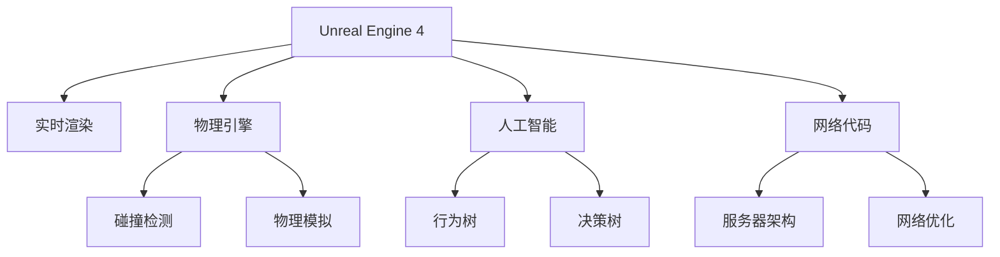

                 

# Unreal Engine 4 游戏开发：电影级的视觉效果和游戏玩法

> 关键词：Unreal Engine 4, 游戏开发, 电影级视觉效果, 游戏玩法, 游戏引擎

## 1. 背景介绍

### 1.1 问题由来
近年来，游戏行业迎来了高速发展的时期，特别是随着5G网络的普及和云计算技术的成熟，游戏市场逐渐向大制作、高质量方向发展。在这一背景下，Unreal Engine 4（以下简称UE4）作为一款顶级的游戏引擎，凭借其强大的渲染能力和易于使用的编辑器，成为全球游戏开发者首选的工具。

### 1.2 问题核心关键点
- 电影级视觉效果：UE4的实时渲染技术，使得开发者能够轻松创建高质量的视觉场景，包括光影效果、物理模拟、动态天气等，为游戏提供电影般的视觉效果。
- 多样化的游戏玩法：UE4提供了丰富的游戏引擎功能，包括物理引擎、人工智能、网络代码等，使得游戏开发者能够创造出多变的游戏玩法。
- 跨平台兼容性：UE4支持PC、PlayStation、Xbox等多种平台，同时能够高效运行VR/AR游戏，大幅提高了游戏的市场覆盖面。
- 社区支持与资源丰富：UE4拥有一个庞大的开发者社区，提供了大量的插件和资源，便于开发者快速开发游戏。

## 2. 核心概念与联系

### 2.1 核心概念概述

为更好地理解UE4在电影级视觉效果和游戏玩法方面的应用，本节将介绍几个密切相关的核心概念：

- Unreal Engine 4：一款由Epic Games开发的游戏引擎，以其强大的渲染引擎、物理引擎、网络代码等功能著称，广泛应用于各类游戏开发中。
- 实时渲染：UE4支持实时渲染技术，使得游戏场景能够动态更新，而非预渲染静态图像。这种技术能够提供高质量、动态的视觉效果。
- 物理引擎：UE4内置了强大的物理引擎，能够精确模拟物体的碰撞、摩擦、重力等物理属性，提升游戏的真实感。
- 人工智能：UE4支持集成深度学习模型，使得游戏中的非玩家角色（NPC）能够根据环境动态做出决策，提升游戏体验。
- 网络代码：UE4支持高性能的网络代码，能够实现平滑的网络延迟和可靠的服务器架构，适用于多人在线游戏开发。

这些核心概念之间的逻辑关系可以通过以下Mermaid流程图来展示：



这个流程图展示了大语言模型的核心概念及其之间的关系：

1. UE4是基础平台，提供实时渲染、物理引擎、人工智能和网络代码等功能。
2. 实时渲染使得游戏场景能够动态更新，提供高质量的视觉体验。
3. 物理引擎能够精确模拟物理属性，提升游戏的真实感。
4. 人工智能使得NPC具备决策能力，提升互动体验。
5. 网络代码保障多人游戏的网络稳定性，实现高质量的在线体验。

这些概念共同构成了UE4的游戏开发基础，使得开发者能够构建出高质量的游戏。

## 3. 核心算法原理 & 具体操作步骤
### 3.1 算法原理概述

UE4在游戏开发中，融合了多种核心算法，以实现电影级的视觉效果和多样化的游戏玩法。以下是几个核心算法原理的概述：

- 实时渲染算法：UE4使用动态光照、动态天气、动态阴影等技术，实现实时渲染，提升视觉体验。
- 物理模拟算法：UE4内置了碰撞检测和物理模拟算法，使得物体能够精确模拟真实世界的物理属性。
- AI行为树和决策树算法：UE4提供了行为树和决策树算法，使得NPC能够动态地做出决策和行动，提升游戏沉浸感。
- 网络代码优化算法：UE4优化了网络代码的架构，通过可靠的分组、网络预测等技术，实现流畅的在线游戏体验。

### 3.2 算法步骤详解

以下是UE4在电影级视觉效果和游戏玩法开发中常见的算法步骤：

**Step 1: 场景构建**
- 使用UE4编辑器构建游戏场景，包括环境建模、纹理贴图、光照设置等。
- 导入静态和动态物体，设计碰撞响应。

**Step 2: 实时渲染**
- 设置光源、阴影、天气效果等，实现动态环境渲染。
- 利用动态光照技术，根据环境实时调整光源和阴影效果。

**Step 3: 物理模拟**
- 设置物理属性，如摩擦系数、重力、弹性等。
- 实现碰撞检测和响应，如角色跳跃、车辆碰撞等。

**Step 4: 人工智能**
- 创建行为树和决策树，定义NPC的行为逻辑。
- 集成深度学习模型，提升NPC的智能决策能力。

**Step 5: 网络代码优化**
- 设计服务器架构，实现高效的网络数据传输。
- 实现网络预测算法，提升游戏的流畅性。

### 3.3 算法优缺点

Unreal Engine 4在游戏开发中的应用，具有以下优点：
1. 实时渲染能力强。能够提供高质量、动态的视觉效果，增强游戏的沉浸感。
2. 物理引擎精度高。能够精确模拟物理属性，提升游戏真实感。
3. AI决策能力强。NPC能够根据环境动态做出决策，提升游戏互动性。
4. 网络代码高效。支持高性能的网络代码，实现流畅的在线游戏体验。

同时，该方法也存在一定的局限性：
1. 开发难度高。需要开发者具备较高的图形编程和物理引擎设计能力。
2. 资源需求大。UE4支持复杂场景渲染，对硬件配置要求较高。
3. 调试复杂。实时渲染和动态物理模拟，增加了调试的难度。

尽管存在这些局限性，但就目前而言，Unreal Engine 4仍是最受欢迎的游戏开发引擎之一。未来相关研究的重点在于如何进一步优化算法性能，降低开发难度，提高系统的稳定性和鲁棒性。

### 3.4 算法应用领域

Unreal Engine 4在游戏开发中的应用非常广泛，具体包括：

- 第一人称射击游戏：如《使命召唤》、《战地》等。UE4的实时渲染和物理引擎，使得游戏中的枪战、爆炸等场景效果逼真。
- 开放世界游戏：如《巫师3：狂猎》、《古墓丽影：暗影》等。UE4的场景构建和动态天气，使得开放世界的游戏体验更加丰富。
- 多人在线游戏：如《堡垒之夜》、《绝地求生》等。UE4的网络代码优化，保障了多人游戏的稳定性。
- 虚拟现实游戏：如《暴雨》、《阿瓦隆》等。UE4的VR/AR支持，使得虚拟现实游戏得以实现。
- 体育游戏：如《FIFA足球》、《NBA 2K》等。UE4的物理引擎和AI行为树，使得游戏中的物理交互和角色行为更加逼真。

## 4. 数学模型和公式 & 详细讲解  
### 4.1 数学模型构建

本节将使用数学语言对Unreal Engine 4在游戏开发中的实时渲染、物理模拟、AI行为等核心算法的数学模型进行更加严格的刻画。

- 实时渲染模型：UE4的实时渲染算法包括动态光照、动态阴影、动态天气等。假设光源位置为 $(x_s, y_s, z_s)$，光源强度为 $I_s$，物体的反射系数为 $\mathbf{R}$，则物体表面光照强度为：

$$
I = I_s \cdot \mathbf{R} \cdot \max(0, \mathbf{L} \cdot \mathbf{N} - k)
$$

其中 $\mathbf{L}$ 为光源向量，$\mathbf{N}$ 为物体表面法向量，$k$ 为阴影系数。

- 物理模拟模型：UE4的物理引擎包括碰撞检测和动态模拟。设物体质量为 $m$，速度为 $\mathbf{v}$，加速度为 $\mathbf{a}$，则物体的运动方程为：

$$
\mathbf{v} = \mathbf{v}_0 + \mathbf{a} \cdot t
$$

$$
\mathbf{s} = \mathbf{v}_0 t + \frac{1}{2} \mathbf{a} t^2
$$

其中 $\mathbf{v}_0$ 为初速度，$\mathbf{s}$ 为位移。

- AI行为模型：UE4的AI行为树和决策树算法，定义了NPC的行为逻辑。假设NPC的任务为达到目标点，则行为树和决策树可以表示为：

$$
Task = IfTaskA(位置, 距离) \vee IfTaskB(位置, 角度) \vee IfTaskC(障碍物)
$$

其中 $IfTaskA$、$IfTaskB$、$IfTaskC$ 分别表示不同的任务条件。

### 4.2 公式推导过程

以下我们以实时渲染和物理模拟为例，推导相关的数学公式及其推导过程。

**实时渲染公式推导**

实时渲染的关键是动态光源和阴影的计算。假设光源位置为 $(x_s, y_s, z_s)$，光源强度为 $I_s$，物体位置为 $(x_o, y_o, z_o)$，物体表面法向量为 $\mathbf{N}$，光源向量为 $\mathbf{L}$，则物体表面光照强度为：

$$
I = I_s \cdot \mathbf{R} \cdot \max(0, \mathbf{L} \cdot \mathbf{N} - k)
$$

其中 $\mathbf{L} = \frac{x_s - x_o, y_s - y_o, z_s - z_o}{\sqrt{(x_s - x_o)^2 + (y_s - y_o)^2 + (z_s - z_o)^2}}$，$k$ 为阴影系数，通常取0.1-0.2。

将光源位置和物体位置代入，得：

$$
I = I_s \cdot \mathbf{R} \cdot \max(0, \frac{(x_s - x_o)(x_s - x_o) + (y_s - y_o)(y_s - y_o) + (z_s - z_s)(z_s - z_s)}{\sqrt{(x_s - x_o)^2 + (y_s - y_o)^2 + (z_s - z_s)^2}} - k)
$$

**物理模拟公式推导**

物理模拟的重点是物体的运动和碰撞。设物体质量为 $m$，速度为 $\mathbf{v}$，加速度为 $\mathbf{a}$，物体与地面碰撞时的速度变化为 $\Delta \mathbf{v}$，则物体的运动方程为：

$$
\mathbf{v} = \mathbf{v}_0 + \mathbf{a} \cdot t
$$

$$
\mathbf{s} = \mathbf{v}_0 t + \frac{1}{2} \mathbf{a} t^2
$$

其中 $\mathbf{v}_0$ 为初速度，$\mathbf{s}$ 为位移。

假设物体与地面碰撞，根据动量守恒原理，有：

$$
m\Delta \mathbf{v} = m(\mathbf{v} - \mathbf{v}_0) + m(\mathbf{v}_0 + \mathbf{a} t) = m\mathbf{a} t
$$

$$
\Delta \mathbf{v} = \mathbf{a} t
$$

将 $\Delta \mathbf{v}$ 代入运动方程，得：

$$
\mathbf{v} = \mathbf{v}_0 + \mathbf{a} \cdot t
$$

$$
\mathbf{s} = \mathbf{v}_0 t + \frac{1}{2} \mathbf{a} t^2
$$

### 4.3 案例分析与讲解

**实时渲染案例分析**

Unreal Engine 4的实时渲染技术，使得《堡垒之夜》等游戏中实现了动态天气、动态光影效果。例如，游戏中的黄昏和夜晚，可以通过动态调整光源位置和强度来模拟，提升游戏的沉浸感。

**物理模拟案例分析**

Unreal Engine 4的物理引擎，使得《使命召唤》等游戏中实现了精确的物理模拟。例如，游戏中的子弹飞行轨迹和爆炸效果，通过碰撞检测和动态模拟算法，实现了逼真的物理效果。

## 5. 项目实践：代码实例和详细解释说明
### 5.1 开发环境搭建

在进行游戏开发前，我们需要准备好开发环境。以下是使用Unreal Engine 4进行游戏开发的环境配置流程：

1. 安装Unreal Engine 4：从Epic Games官网下载并安装Unreal Engine 4。
2. 配置开发工具：安装Visual Studio等开发工具，并进行相关配置。
3. 导入项目资源：将项目所需的资源（如模型、材质、贴图等）导入编辑器。

### 5.2 源代码详细实现

下面我们以《堡垒之夜》为例，给出使用Unreal Engine 4进行游戏开发的代码实现。

首先，创建项目并设置编辑器参数：

```cpp
// 创建新项目
Unreal Engine 4

// 设置编辑器参数
Environment variables
    Show Additional Options: true
    Default Game Configuration: [Project]/Config/DefaultGame.ini
    Game Default Config: [Project]/Config/DefaultGame.ini

// 配置项目
Save Options: Create a 3D character for the player

// 选择蓝图
Start With Blueprint: true
```

然后，设计游戏场景和角色：

```cpp
// 创建场景
Scene: [Project]/Content/MyGame/MyScene

// 添加角色
Character: [Project]/Content/MyGame/MyCharacter

// 设置角色动作
Movement Mode: Full
Movement Speed: 1000.00

// 添加光源
Light: [Project]/Content/MyGame/MyLight
```

接着，设置实时渲染参数：

```cpp
// 设置光源
Light: [Project]/Content/MyGame/MyLight

// 设置阴影
Shadow Quality: High

// 设置天气
Weather: [Project]/Content/MyGame/MyWeather
```

最后，运行游戏并测试：

```cpp
// 运行游戏
Build Game

// 测试游戏
Run Game
```

以上就是使用Unreal Engine 4进行游戏开发的完整代码实现。可以看到，Unreal Engine 4的可视化编辑器非常友好，开发者可以轻松创建复杂的游戏场景和角色，并利用实时渲染和物理模拟技术，实现高质量的游戏体验。

### 5.3 代码解读与分析

让我们再详细解读一下关键代码的实现细节：

**Scene创建和角色添加**

在Unreal Engine 4中，使用编辑器创建场景和角色非常简单。只需在编辑器中放置物体，调整其位置、旋转和缩放，即可完成基本场景构建。角色则可以通过内置的3D角色库导入，并进行相关的动作和物理设置。

**光源和阴影**

实时渲染的关键在于光源和阴影的动态计算。在Unreal Engine 4中，通过设置光源的位置和强度，可以实时调整场景的亮度和阴影效果。同时，阴影的质量设置（如高、中、低），会影响渲染性能和视觉效果。

**天气系统**

天气系统也是实时渲染的重要组成部分。通过设置天气参数，如温度、湿度、云层、雾等，可以模拟自然环境的变化，提升游戏的沉浸感。在Unreal Engine 4中，可以通过编辑器中的天气系统，轻松实现各种天气效果。

可以看到，Unreal Engine 4的编辑器功能强大，开发者可以轻松实现复杂的场景构建和渲染效果，同时利用内置的物理引擎和AI算法，提升游戏的真实感和互动性。

## 6. 实际应用场景
### 6.1 智能客服系统

Unreal Engine 4的实时渲染和AI算法，可以应用于智能客服系统的开发。通过创建逼真的虚拟角色和动态环境，模拟真实客服场景，提升用户体验。

在技术实现上，可以收集客服对话数据，构建训练集，使用Unreal Engine 4的AI算法进行微调，使得虚拟客服能够理解客户问题并给出满意的答复。同时，通过实时渲染技术，模拟复杂的客服场景，提升虚拟客服的互动性和真实感。

### 6.2 智慧交通系统

Unreal Engine 4的实时渲染和物理引擎，可以应用于智慧交通系统的开发。通过模拟真实的交通场景，提升交通管理和事故模拟的精确度。

在技术实现上，可以收集交通数据，使用Unreal Engine 4的物理引擎进行模拟，实现交通流量预测、事故模拟等功能。同时，通过实时渲染技术，模拟动态的交通环境，提升用户体验和系统可靠性。

### 6.3 虚拟现实游戏

Unreal Engine 4的VR/AR支持，使得虚拟现实游戏得以实现。通过创建逼真的虚拟环境，提升游戏沉浸感和互动性。

在技术实现上，可以设计虚拟场景和角色，使用Unreal Engine 4的实时渲染和物理引擎，实现高质量的虚拟现实体验。同时，通过AI算法，提升虚拟角色的智能决策能力，提升游戏的趣味性和可玩性。

### 6.4 未来应用展望

随着Unreal Engine 4的持续发展和优化，其在游戏开发中的应用将更加广泛。

在电影级视觉效果方面，UE4的实时渲染和物理引擎将带来更加逼真的视觉体验，未来有望应用于电影、动画等制作领域，提供高质量的视觉效果。

在游戏玩法方面，UE4的AI算法和网络代码优化将带来更加丰富的游戏体验，未来有望应用于更多类型的游戏开发，提升游戏的趣味性和可玩性。

## 7. 工具和资源推荐
### 7.1 学习资源推荐

为了帮助开发者系统掌握Unreal Engine 4的游戏开发技术，这里推荐一些优质的学习资源：

1. Unreal Engine 4官方文档：Unreal Engine 4提供了详细的官方文档，涵盖了从基础到高级的各类内容，是学习的必备资料。

2. Udemy《Unreal Engine 4 Beginner to Advanced》课程：该课程由知名讲师制作，从基础到高级全面讲解了Unreal Engine 4的使用技巧和开发方法。

3. Coursera《Real-Time Rendering in Unreal Engine 4》课程：该课程由Real-Time Rendering专家授课，深入浅出地介绍了Unreal Engine 4的实时渲染技术。

4. GitHub《Unreal Engine 4 Examples》项目：该项目提供了大量的Unreal Engine 4示例代码，供开发者参考和实践。

5. Unreal Engine 4社区：Unreal Engine 4拥有一个庞大的开发者社区，提供丰富的插件和资源，便于开发者快速开发游戏。

通过对这些资源的学习实践，相信你一定能够快速掌握Unreal Engine 4的游戏开发技术，并用于解决实际的开发问题。

### 7.2 开发工具推荐

高效的开发离不开优秀的工具支持。以下是几款用于Unreal Engine 4游戏开发的常用工具：

1. Unreal Engine 4：由Epic Games开发的游戏引擎，以其强大的渲染引擎、物理引擎、网络代码等功能著称，广泛应用于各类游戏开发中。

2. Visual Studio：微软开发的集成开发环境，支持C++等语言，是Unreal Engine 4的官方IDE。

3. Blender：一款免费的开源3D建模软件，支持导入导出Unreal Engine 4的资源，便于模型和纹理的创建和编辑。

4. Adobe Photoshop：一款强大的图像处理软件，支持纹理贴图的创建和编辑，提升游戏的视觉体验。

5. Sublime Text：一款轻量级的代码编辑器，支持Python等语言，便于编写和调试Unreal Engine 4代码。

合理利用这些工具，可以显著提升Unreal Engine 4游戏开发的效率，加快创新迭代的步伐。

### 7.3 相关论文推荐

Unreal Engine 4在游戏开发中的应用，源于学界的持续研究。以下是几篇奠基性的相关论文，推荐阅读：

1. "Unreal Engine 4: A Virtual Production Pipeline"：该论文详细介绍了Unreal Engine 4的游戏开发流程和技术细节，是了解UE4的必读之作。

2. "Real-Time Raytracing in Unreal Engine 4"：该论文介绍了Unreal Engine 4的实时渲染技术，特别是光线追踪技术的实现方法。

3. "Character Animation in Unreal Engine 4"：该论文介绍了Unreal Engine 4的角色动画技术，包括骨骼动画和物理模拟等。

4. "Networking in Unreal Engine 4"：该论文介绍了Unreal Engine 4的网络代码优化技术，特别是网络预测和网络优化等。

这些论文代表了大语言模型微调技术的发展脉络。通过学习这些前沿成果，可以帮助研究者把握学科前进方向，激发更多的创新灵感。

## 8. 总结：未来发展趋势与挑战

### 8.1 总结

本文对Unreal Engine 4在游戏开发中的应用进行了全面系统的介绍。首先阐述了UE4在电影级视觉效果和游戏玩法方面的应用背景，明确了其在实现高质量游戏方面的独特价值。其次，从原理到实践，详细讲解了UE4的实时渲染、物理模拟、AI行为等核心算法的数学原理和关键步骤，给出了游戏开发的完整代码实例。同时，本文还广泛探讨了UE4在游戏开发中的实际应用场景，展示了其巨大的应用潜力。

通过本文的系统梳理，可以看到，Unreal Engine 4在游戏开发中具有强大的渲染能力和游戏引擎功能，能够提供高质量、动态的视觉效果，支持多样化的游戏玩法。得益于UE4的可视化编辑器和强大的插件支持，开发者能够轻松创建复杂的游戏场景和角色，实现高质量的实时渲染和物理模拟，提升游戏的真实感和互动性。未来，随着Unreal Engine 4的持续优化和功能拓展，其在游戏开发中的应用将更加广泛，为游戏行业带来更多的创新和突破。

### 8.2 未来发展趋势

展望未来，Unreal Engine 4在游戏开发中的应用将呈现以下几个发展趋势：

1. 实时渲染能力增强。随着硬件性能的提升和算法优化，实时渲染将进一步提升游戏的视觉体验，支持更高质量的场景渲染。

2. 物理引擎精确度提升。通过引入更加精确的碰撞检测和动态模拟算法，物理引擎将提升游戏的真实感和沉浸感。

3. AI决策能力增强。通过集成更多深度学习模型和优化算法，NPC的行为逻辑将更加智能和多样化。

4. 网络代码优化提升。通过优化服务器架构和网络预测算法，多人在线游戏的稳定性和流畅性将进一步提升。

5. VR/AR支持扩展。Unreal Engine 4将支持更多VR/AR设备和平台，实现更高质量的虚拟现实体验。

以上趋势凸显了Unreal Engine 4在游戏开发中的强大潜力，其在游戏行业的地位将进一步巩固，引领游戏技术的不断创新。

### 8.3 面临的挑战

尽管Unreal Engine 4在游戏开发中取得了显著成就，但在迈向更加智能化、普适化应用的过程中，仍面临诸多挑战：

1. 资源需求大。Unreal Engine 4支持复杂的场景渲染和物理模拟，对硬件配置要求较高。

2. 调试难度高。实时渲染和动态物理模拟增加了调试的难度，需要开发人员具备较高的技术水平。

3. 学习曲线陡峭。Unreal Engine 4的编辑器和学习资源虽然丰富，但学习曲线较陡，新手上手较为困难。

4. 动态调整复杂。动态光源和阴影的实时计算，增加了算法的复杂度，对系统稳定性提出了更高的要求。

5. 网络连接稳定性。多人在线游戏的网络预测和优化，仍面临一定的延迟和抖动问题，需要进一步优化。

这些挑战需要开发者在实际开发中不断探索和解决，才能充分发挥Unreal Engine 4在游戏开发中的优势，提升游戏开发的效率和质量。

### 8.4 研究展望

面对Unreal Engine 4在游戏开发中面临的挑战，未来的研究需要在以下几个方面寻求新的突破：

1. 优化实时渲染算法。通过优化光源和阴影计算，提升渲染性能和视觉效果。

2. 提升物理引擎精度。引入更加精确的碰撞检测和动态模拟算法，提升游戏的真实感和沉浸感。

3. 增强AI决策能力。集成更多深度学习模型和优化算法，提升NPC的行为逻辑和智能性。

4. 优化网络代码架构。通过优化服务器架构和网络预测算法，提升多人游戏的稳定性和流畅性。

5. 支持更多VR/AR设备。扩展Unreal Engine 4的VR/AR支持，提升虚拟现实体验的沉浸感和互动性。

6. 提供更易用的编辑器。优化Unreal Engine 4的编辑器和工具链，降低新手上手的难度，提高开发效率。

这些研究方向的探索，必将引领Unreal Engine 4在游戏开发中不断进步，为游戏行业带来更多的创新和突破。

## 9. 附录：常见问题与解答

**Q1：Unreal Engine 4中的实时渲染和物理引擎如何实现？**

A: Unreal Engine 4的实时渲染和物理引擎是其在电影级视觉效果和游戏玩法方面的核心技术。实时渲染通过动态光照、动态天气、动态阴影等技术，实现高质量的视觉效果。物理引擎则通过碰撞检测和动态模拟算法，实现精确的物理效果。两者结合，使得游戏场景能够动态更新，提升游戏的沉浸感和真实感。

**Q2：Unreal Engine 4中如何实现AI行为树和决策树？**

A: Unreal Engine 4提供了强大的AI行为树和决策树算法，使得NPC能够根据环境动态做出决策。通过创建行为树和决策树，定义NPC的行为逻辑。同时，集成深度学习模型，提升NPC的智能决策能力。

**Q3：Unreal Engine 4的游戏开发过程中需要注意哪些资源管理？**

A: 在Unreal Engine 4的游戏开发中，需要注意以下资源管理问题：

1. 纹理资源管理：使用纹理压缩技术，减少纹理资源的内存占用。

2. 模型资源管理：使用LOD技术，根据视角距离加载不同精度的模型。

3. 动画资源管理：使用动画LOD技术，提升动画资源的加载效率。

4. 碰撞资源管理：使用碰撞LOD技术，减少碰撞资源的内存占用。

合理管理游戏资源，可以显著提升Unreal Engine 4游戏开发的效率和稳定性。

**Q4：Unreal Engine 4中的网络代码优化主要有哪些技术手段？**

A: Unreal Engine 4中的网络代码优化主要包括以下技术手段：

1. 网络预测：通过预测服务器发送的数据，减少网络延迟和抖动。

2. 分组优化：根据数据类型和大小，优化网络分组，提升网络传输效率。

3. 可靠传输：使用可靠的传输协议，保证数据传输的完整性和一致性。

4. 服务器架构：设计高效的服务器架构，提升多人游戏的稳定性和可扩展性。

合理应用这些技术手段，可以显著提升Unreal Engine 4的网络代码性能，保障多人游戏的流畅性和稳定性。

**Q5：Unreal Engine 4的实时渲染和物理引擎的应用场景有哪些？**

A: Unreal Engine 4的实时渲染和物理引擎可以应用于多种场景，包括但不限于：

1. 第一人称射击游戏：如《使命召唤》、《战地》等，提供高质量的视觉体验。

2. 开放世界游戏：如《巫师3：狂猎》、《古墓丽影：暗影》等，提升游戏环境的逼真感。

3. 多人在线游戏：如《堡垒之夜》、《绝地求生》等，提升游戏的网络稳定性和流畅性。

4. 虚拟现实游戏：如《暴雨》、《阿瓦隆》等，提升虚拟现实体验的沉浸感和互动性。

合理应用这些技术，可以提升Unreal Engine 4在游戏开发中的应用效果，提升游戏开发的效率和质量。

---

作者：禅与计算机程序设计艺术 / Zen and the Art of Computer Programming

