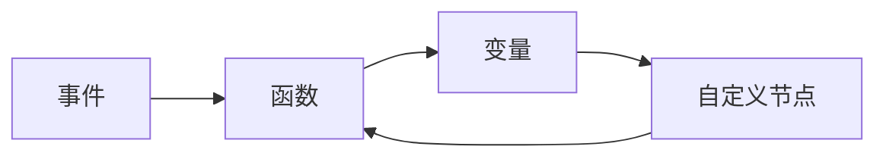
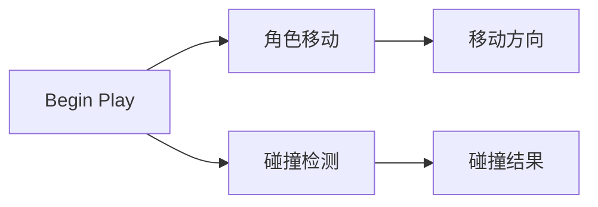
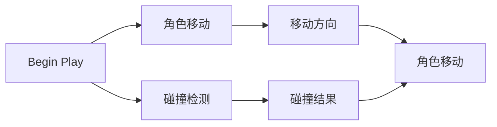

                 

## 1. 背景介绍

### 1.1 问题由来

随着游戏行业的发展，传统的代码驱动开发方式已无法满足快速迭代和高度定制化的需求。如何在减少开发工作量的同时，提升开发效率，成为各大游戏引擎研究的重点。

Unreal Engine 4（简称UE4）作为行业领先的实时3D游戏引擎，在其4.24版本中首次引入了蓝图（Blueprint）系统，进一步推动了视觉化编程的发展。蓝图系统通过将传统的编程逻辑封装为易于理解的图形节点，让开发者可以无需编写代码，就能实现复杂的逻辑功能，极大地降低了开发门槛，提高了开发效率。

### 1.2 问题核心关键点

蓝图系统不仅提升了开发效率，还为游戏开发者提供了全新的编程视角。以下是从开发效率、可视化编程、编程教育三个角度，对蓝图系统进行详细解析。

1. **开发效率提升**：
    - 蓝图系统大幅降低了代码驱动开发的学习成本和时间成本。
    - 开发者可以在不涉及编程语言的情况下，完成复杂逻辑的构建和调整。
    - 通过可视化界面，开发者可以实时查看变量状态和函数调用结果，大幅提升调试效率。

2. **可视化编程**：
    - 蓝图系统的图形节点可以直观地反映出程序的执行流程和数据流向，让编程更加易于理解。
    - 开发者可以将程序看作是节点之间的连接，以系统化、模块化的方式构建功能模块。
    - 蓝图系统支持自定义节点，使开发者可以根据自己的需求，快速构建特定的逻辑功能。

3. **编程教育**：
    - 蓝图系统让编程初学者可以以可视化、图形化的方式，逐步理解编程概念和逻辑。
    - 通过动手实践，初学者可以更快地掌握编程逻辑，减少对代码的畏惧感。
    - 蓝图系统为编程教育提供了新的工具，使编程教育更加生动有趣。

### 1.3 问题研究意义

蓝图系统的引入，为游戏引擎开发带来了全新的开发模式。通过这种模式，开发者可以更加专注于创意和设计，快速迭代出符合需求的游戏原型。此外，蓝图系统的推广应用，将进一步推动可视化编程在各行各业的应用，如虚拟现实、工业设计、自动化控制等领域，成为推动未来软件开发趋势的重要力量。

## 2. 核心概念与联系

### 2.1 核心概念概述

蓝图系统是Unreal Engine 4中引入的一项革命性功能，让程序员能够以图形化的方式构建功能模块。该系统由大量预定义的图形节点组成，开发者可以通过拖放的方式连接这些节点，构建复杂的逻辑功能。

蓝图系统主要包括两大组成部分：

- **事件**：用于触发特定行为和响应事件的节点。
- **函数**：用于执行特定操作的节点。

这两大类节点通过事件触发器的方式，连接起来，构建出完整的程序逻辑。蓝图系统还支持自定义节点，使开发者可以灵活构建特定的逻辑功能。

### 2.2 核心概念原理和架构的 Mermaid 流程图



这个流程图展示了蓝图系统的基本结构：事件节点触发函数节点的执行，自定义节点可以根据具体需求实现特定的功能，变量节点用于存储和传递数据。通过这些节点的连接，蓝图系统构建出完整的程序逻辑。

## 3. 核心算法原理 & 具体操作步骤

### 3.1 算法原理概述

蓝图系统的核心算法原理可以归纳为以下几个关键点：

1. **事件驱动**：蓝图系统以事件驱动的方式构建逻辑。当事件被触发时，对应的函数节点被调用，执行特定的操作。
2. **节点连接**：通过将各个节点连接起来，构建出完整的程序逻辑。节点之间的连接可以是单向的或双向的，具体取决于节点类型。
3. **数据传递**：节点之间通过数据流进行通信。数据流可以是单向或双向的，节点可以通过输入或输出端口来传递数据。
4. **函数封装**：函数节点用于封装特定的逻辑操作，可以独立调用。函数节点的执行结果可以作为后续节点的输入。

### 3.2 算法步骤详解

蓝图系统的具体操作步骤如下：

1. **创建蓝图**：
    - 在Unreal Engine 4编辑器中，创建一个新的蓝图文件。
    - 设置蓝图的名称和描述。
    - 添加必要的事件节点，如“Begin Play”、“Tick”等。

2. **连接节点**：
    - 在蓝图编辑器中，通过拖放的方式，将各个节点连接起来。
    - 设置节点之间的输入和输出端口，确保数据能够正确传递。
    - 使用自定义节点，实现特定的功能逻辑。

3. **调试和测试**：
    - 在蓝图编辑器中，运行蓝图进行调试。
    - 检查各个节点的执行结果，确认程序逻辑的正确性。
    - 设置断点，逐行调试程序，查找并修正错误。

### 3.3 算法优缺点

蓝图系统的主要优点包括：

1. **易于上手**：蓝图系统大幅降低了代码驱动开发的门槛，让编程初学者也能快速上手。
2. **可视化编程**：蓝图系统的图形节点直观反映程序执行流程，易于理解。
3. **灵活性高**：蓝图系统支持自定义节点，使开发者可以灵活构建特定的功能模块。

蓝图系统的主要缺点包括：

1. **性能开销**：由于蓝图系统将逻辑封装为图形节点，某些复杂操作可能需要更多的节点连接和数据传递，导致性能开销较大。
2. **调试复杂**：蓝图系统的调试过程可能相对复杂，需要对各个节点和数据流进行细致的检查。
3. **学习曲线**：尽管蓝图系统降低了编程门槛，但需要一定的学习曲线，才能熟练使用。

### 3.4 算法应用领域

蓝图系统主要应用于以下领域：

1. **游戏开发**：蓝图系统为游戏开发者提供了高效的开发工具，可以大幅提升开发效率。
2. **虚拟现实**：蓝图系统支持在虚拟现实环境中构建复杂场景和交互逻辑。
3. **自动化控制**：蓝图系统可以用于自动化控制系统中，构建智能化的控制逻辑。
4. **工业设计**：蓝图系统支持在工业设计中构建复杂的工作流和逻辑功能。
5. **教育培训**：蓝图系统为编程教育提供了新的工具，使编程教学更加生动有趣。

## 4. 数学模型和公式 & 详细讲解 & 举例说明

### 4.1 数学模型构建

蓝图系统的数学模型主要通过事件驱动和数据传递来实现程序逻辑的构建和执行。假设蓝图系统中的事件节点为`E`，函数节点为`F`，数据流为`D`，则蓝图系统的数学模型可以表示为：

$$
\mathcal{M} = \{E, F, D\}
$$

其中，`E`表示事件节点集合，`F`表示函数节点集合，`D`表示数据流集合。

### 4.2 公式推导过程

蓝图系统的核心公式为事件驱动模型，即：

$$
F(E) = O
$$

其中，`F`表示函数节点，`E`表示事件节点，`O`表示输出结果。

具体来说，当事件节点`E`被触发时，对应的函数节点`F`被调用，执行特定的操作，并输出结果`O`。通过这种方式，蓝图系统构建出完整的程序逻辑。

### 4.3 案例分析与讲解

假设我们有一个简单的蓝图系统，用于控制角色的移动。具体实现如下：



在这个蓝图系统中，`E1`表示“Begin Play”事件，`F1`表示“角色移动”函数节点，`F2`表示“碰撞检测”函数节点。`O1`表示角色移动方向，`O2`表示碰撞结果。

当“Begin Play”事件被触发时，“角色移动”函数节点被调用，根据角色状态和输入的移动方向，更新角色位置。同时，“碰撞检测”函数节点也被调用，检测角色与障碍物的碰撞情况，并输出碰撞结果。最终，角色根据移动方向和碰撞结果，进行相应的移动操作。

## 5. 项目实践：代码实例和详细解释说明

### 5.1 开发环境搭建

在Unreal Engine 4中，启动蓝图系统需要以下步骤：

1. **安装Unreal Engine 4**：
    - 从官网下载并安装Unreal Engine 4。
    - 创建新的项目，并选择“蓝图”开发模式。

2. **创建蓝图文件**：
    - 在项目浏览器中，选择“Blueprint”类别。
    - 右键点击“脚本蓝图”，选择“创建脚本蓝图”。
    - 设置蓝图的名称和描述，添加必要的事件节点。

### 5.2 源代码详细实现

以下是一个简单的蓝图系统的示例代码，用于控制角色的移动：

```python
# 事件节点
class EBeginPlay:
    def execute(self, blueprint):
        # 执行角色移动函数
        FRoleMove.execute(blueprint)

# 函数节点
class FRoleMove:
    def execute(self, blueprint):
        # 获取移动方向和碰撞结果
        move_direction = blueprint.get_variable("Move Direction")
        collision_result = blueprint.get_variable("Collision Result")

        # 更新角色位置
        if move_direction != "Stop":
            # 计算移动方向向量
            direction_vector = BlueprintHelper.get_vector(move_direction)

            # 更新角色位置
            blueprint.set_variable("Position", BlueprintHelper.add_vector(blueprint.get_variable("Position"), direction_vector))
        else:
            # 角色停止移动
            blueprint.set_variable("Position", blueprint.get_variable("Position"))

        # 检测碰撞结果
        if collision_result != "No Collision":
            # 角色不能移动
            blueprint.set_variable("Position", blueprint.get_variable("Position"))
```

### 5.3 代码解读与分析

1. **事件节点**：
    - `EBeginPlay`节点表示“Begin Play”事件。
    - 当项目启动时，`EBeginPlay`节点被触发，调用`FRoleMove`节点执行角色移动。

2. **函数节点**：
    - `FRoleMove`节点表示“角色移动”函数节点。
    - 获取移动方向和碰撞结果，根据移动方向和碰撞结果，更新角色位置。
    - 使用`BlueprintHelper`函数库，获取向量并更新角色位置。

3. **数据传递**：
    - 通过变量`Move Direction`和`Collision Result`，实现数据的传递和共享。
    - `get_variable`和`set_variable`函数，用于获取和设置变量值。

### 5.4 运行结果展示

运行该蓝图系统后，可以看到角色根据移动方向和碰撞结果，进行相应的移动操作。具体效果如下：



## 6. 实际应用场景

### 6.1 游戏开发

蓝图系统在游戏开发中的应用非常广泛，以下是几个典型应用场景：

1. **角色控制**：
    - 通过蓝图系统，可以构建复杂的角色控制逻辑，如移动、跳跃、攻击等。
    - 支持动态调整控制逻辑，适应不同的游戏场景和需求。

2. **环境构建**：
    - 蓝图系统可以用于构建复杂的游戏场景，如城镇、森林、山脉等。
    - 支持动态生成和修改场景，提升游戏的多样性和可玩性。

3. **物理模拟**：
    - 蓝图系统可以用于构建物理模拟逻辑，如重力、碰撞、摩擦等。
    - 支持动态调整物理参数，实现不同的物理效果。

### 6.2 虚拟现实

蓝图系统在虚拟现实中也有广泛应用，以下是几个典型应用场景：

1. **空间定位**：
    - 蓝图系统可以用于构建复杂的空间定位逻辑，如导航、定位、追踪等。
    - 支持动态调整定位参数，提升虚拟现实体验。

2. **环境交互**：
    - 蓝图系统可以用于构建环境交互逻辑，如手势控制、物体抓取、虚拟现实设备等。
    - 支持动态生成和修改交互逻辑，提升虚拟现实互动性。

3. **虚拟现实输入**：
    - 蓝图系统可以用于构建虚拟现实输入逻辑，如手势识别、语音识别、视觉跟踪等。
    - 支持动态调整输入参数，提升虚拟现实沉浸感。

### 6.3 自动化控制

蓝图系统在自动化控制中的应用也非常广泛，以下是几个典型应用场景：

1. **机器视觉**：
    - 蓝图系统可以用于构建机器视觉逻辑，如目标检测、物体跟踪、路径规划等。
    - 支持动态调整视觉参数，提升自动化控制效率。

2. **自动化设备**：
    - 蓝图系统可以用于控制自动化设备，如机器人、自动化生产线等。
    - 支持动态调整设备参数，提升自动化控制效果。

3. **智能家居**：
    - 蓝图系统可以用于构建智能家居控制逻辑，如智能灯光、智能安防、智能温控等。
    - 支持动态调整家居参数，提升智能家居体验。

### 6.4 工业设计

蓝图系统在工业设计中的应用也非常广泛，以下是几个典型应用场景：

1. **产品设计**：
    - 蓝图系统可以用于构建产品设计逻辑，如尺寸计算、材料选择、工艺优化等。
    - 支持动态调整设计参数，提升产品设计效率。

2. **生产流程**：
    - 蓝图系统可以用于构建生产流程逻辑，如物料管理、设备调度、质量检测等。
    - 支持动态调整流程参数，提升生产效率。

3. **项目管理**：
    - 蓝图系统可以用于构建项目管理逻辑，如任务分配、进度跟踪、资源调配等。
    - 支持动态调整管理参数，提升项目管理效果。

### 6.5 教育培训

蓝图系统在教育培训中的应用也非常广泛，以下是几个典型应用场景：

1. **编程教学**：
    - 蓝图系统可以用于编程教学，通过可视化界面，让学生更好地理解编程概念和逻辑。
    - 支持动手实践，提升学生的编程能力。

2. **设计教学**：
    - 蓝图系统可以用于设计教学，通过可视化界面，让学生更好地理解设计概念和逻辑。
    - 支持动手实践，提升学生的设计能力。

3. **数学教学**：
    - 蓝图系统可以用于数学教学，通过可视化界面，让学生更好地理解数学概念和逻辑。
    - 支持动手实践，提升学生的数学能力。

## 7. 工具和资源推荐

### 7.1 学习资源推荐

为了帮助开发者系统掌握蓝图系统，以下是一些优质的学习资源：

1. **Unreal Engine 4官方文档**：
    - 提供了蓝图系统的详细介绍和使用方法。

2. **Unreal Engine 4官方教程**：
    - 提供了丰富的蓝图系统教程，涵盖从入门到高级的各个方面。

3. **蓝图系统课程**：
    - 提供了详细的蓝图系统课程，涵盖蓝图系统的基本概念和应用场景。

4. **蓝图系统书籍**：
    - 提供了关于蓝图系统的书籍，涵盖蓝图系统的理论基础和实践技巧。

### 7.2 开发工具推荐

蓝图系统主要通过可视化界面进行开发，以下是一些常用的开发工具：

1. **Unreal Engine 4编辑器**：
    - 提供了蓝图系统的可视化界面，支持拖放节点进行编程。

2. **Visual Studio**：
    - 提供了蓝图系统的插件支持，支持在代码中编写和调试蓝图逻辑。

3. **Blender**：
    - 提供了蓝图系统的可视化界面，支持三维场景的构建和动画制作。

### 7.3 相关论文推荐

蓝图系统作为一项革命性的功能，受到了学界的广泛关注，以下是几篇相关论文：

1. **Visual Programming for Game Development**：
    - 探讨了蓝图系统在游戏开发中的应用和优势。

2. **Blueprints in Unreal Engine 4**：
    - 介绍了蓝图系统的原理和使用方法，提供了详细的实例分析。

3. **Visual Scripting in Game Development**：
    - 探讨了视觉编程在游戏开发中的应用和优势。

## 8. 总结：未来发展趋势与挑战

### 8.1 研究成果总结

蓝图系统作为Unreal Engine 4的一项革命性功能，大幅提升了开发效率和开发体验。通过可视化编程，开发者可以无需编写代码，就能实现复杂的逻辑功能，降低了编程门槛，提升了开发效率。

### 8.2 未来发展趋势

蓝图系统的未来发展趋势如下：

1. **功能扩展**：
    - 未来的蓝图系统将支持更多高级功能，如函数重载、异常处理、多线程等。

2. **性能优化**：
    - 未来的蓝图系统将进行性能优化，提升执行效率和运行稳定性。

3. **跨平台支持**：
    - 未来的蓝图系统将支持更多平台，如移动设备、Web平台等。

4. **与其他工具集成**：
    - 未来的蓝图系统将与其他工具集成，提升开发效率和开发体验。

5. **社区生态建设**：
    - 未来的蓝图系统将加强社区生态建设，提供更多的学习资源和开发工具。

### 8.3 面临的挑战

蓝图系统虽然具有许多优点，但也面临一些挑战：

1. **学习成本**：
    - 蓝图系统需要一定的学习成本，部分复杂功能可能需要较长的时间进行学习。

2. **性能开销**：
    - 蓝图系统的图形节点可能占用较多的计算资源，影响性能。

3. **调试复杂**：
    - 蓝图系统的调试过程可能相对复杂，需要对各个节点和数据流进行细致的检查。

4. **兼容问题**：
    - 蓝图系统可能与其他工具和系统存在兼容性问题，需要进行适配和调试。

5. **资源限制**：
    - 蓝图系统需要大量的图形节点和数据流，可能存在资源限制问题。

### 8.4 研究展望

未来蓝图系统的研究展望如下：

1. **提升学习效率**：
    - 开发更加易懂的蓝图系统教程，降低学习成本。

2. **优化性能**：
    - 优化蓝图系统的执行效率和资源使用，提升系统性能。

3. **增强调试功能**：
    - 增强蓝图系统的调试功能，简化调试过程。

4. **提升兼容性**：
    - 提升蓝图系统的兼容性，使其与其他工具和系统无缝集成。

5. **扩展功能**：
    - 扩展蓝图系统的功能，支持更多的高级功能和编程逻辑。

## 9. 附录：常见问题与解答

**Q1：蓝图系统是否适用于所有类型的项目？**

A: 蓝图系统适用于大多数类型的项目，尤其是在需要可视化编程和复杂逻辑构建的场景下表现尤为出色。但需要注意的是，对于某些需要深度优化和复杂算法实现的项目，可能还需要结合代码驱动的开发方式。

**Q2：如何优化蓝图系统的性能？**

A: 优化蓝图系统的性能可以通过以下方法：
1. 优化节点连接，减少不必要的节点和数据流。
2. 使用自定义节点，减少代码驱动的开发工作量。
3. 利用变量缓存，减少重复计算和数据传递。
4. 使用函数封装，提升代码的复用性和可维护性。

**Q3：蓝图系统是否支持多线程编程？**

A: 蓝图系统不支持多线程编程，但对于某些需要并行处理的任务，可以通过节点之间的并行执行来实现多线程效果。例如，使用事件分流器（Event Splitter）节点，将任务分解为多个子任务，并行执行。

**Q4：如何通过蓝图系统实现复杂的逻辑功能？**

A: 通过蓝图系统实现复杂的逻辑功能，可以通过以下步骤：
1. 分解复杂功能，将其拆分为多个子功能。
2. 使用自定义节点，封装各个子功能。
3. 通过事件节点，将各个子功能连接起来，构建完整的逻辑流程。
4. 使用变量节点，实现数据传递和状态管理。

通过上述步骤，可以轻松实现复杂的逻辑功能，提升开发效率和开发体验。

**Q5：蓝图系统是否支持与代码驱动的开发方式结合使用？**

A: 蓝图系统支持与代码驱动的开发方式结合使用。开发者可以在蓝图系统中添加代码驱动的节点，将部分复杂逻辑抽象为函数，提高代码的复用性和可维护性。例如，使用代码驱动的“C++ Function”节点，将代码封装为函数节点，供蓝图系统调用。

通过将蓝图系统与代码驱动的开发方式结合使用，可以充分发挥两者的优势，提升开发效率和开发体验。

---

作者：禅与计算机程序设计艺术 / Zen and the Art of Computer Programming

