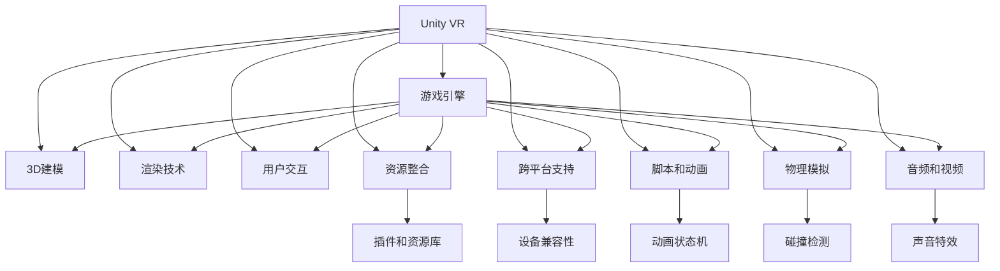

                 

# VR 内容开发框架选择：Unity VR 和 Unreal VR 的比较

> 关键词：Unity VR, Unreal VR, 内容开发框架, VR 游戏, 3D 建模, 渲染技术, 用户交互, 资源整合, 游戏引擎

## 1. 背景介绍

虚拟现实（Virtual Reality, VR）作为新一代的沉浸式互动体验，正在迅速改变娱乐、教育、医疗等多个行业的应用格局。随着VR技术的不断成熟和普及，越来越多的开发者和公司选择使用专业的VR内容开发框架来进行开发。

目前市场上主要的VR内容开发框架包括Unity VR和Unreal VR，两者都有着各自的优势和适用场景。本文将从背景介绍、核心概念、算法原理、操作步骤、数学模型、项目实践、应用场景、工具和资源推荐、总结与展望等几个方面，深入探讨Unity VR和Unreal VR在VR内容开发中的应用，并对其进行选择和比较。

## 2. 核心概念与联系

### 2.1 核心概念概述

在深入比较Unity VR和Unreal VR之前，我们先简要介绍这两个框架的核心概念及其相互联系：

- **Unity VR**：由Unity Technologies开发的游戏引擎，支持跨平台游戏和VR/AR开发。Unity VR提供了一系列功能强大的工具和组件，包括3D建模、渲染、物理模拟、用户交互等，能够快速开发高质量的VR应用。

- **Unreal VR**：由Epic Games开发的游戏引擎，以高性能和可视化著称。Unreal VR提供了丰富的可视化编辑工具、蓝图脚本系统，支持高级物理引擎和光照计算，能够实现逼真的VR体验。

这两个框架都是基于游戏引擎构建的VR内容开发平台，具有强大的3D建模和渲染能力，支持用户交互，并且都提供了丰富的插件和资源库。两者之间的主要区别在于其设计理念、开发模式、技术细节等方面。

### 2.2 核心概念原理和架构的 Mermaid 流程图



这个Mermaid流程图展示了Unity VR的核心概念和架构：

1. Unity VR建立在强大的游戏引擎之上，提供3D建模、渲染、用户交互、资源整合等功能。
2. 跨平台支持和设备兼容性是其重要特性。
3. 强大的脚本和动画系统，包括动画状态机等。
4. 物理模拟和碰撞检测等功能，提升体验真实性。
5. 音频和视频集成，提供更丰富的感官体验。

### 2.3 核心概念联系

Unity VR和Unreal VR的核心概念联系主要体现在以下几点：

1. 都是游戏引擎，具有相同的底层架构。
2. 都支持3D建模和渲染，提供丰富的3D设计工具。
3. 都支持用户交互，提供手势识别、虚拟控制器等交互方式。
4. 都支持跨平台开发和部署。
5. 都提供插件和资源库，方便开发者快速开发和集成。

## 3. 核心算法原理 & 具体操作步骤

### 3.1 算法原理概述

Unity VR和Unreal VR在核心算法原理上，都采用了现代游戏引擎的架构，如渲染管道、物理引擎、动画系统等。下面分别介绍这两个框架的核心算法原理。

- **Unity VR**：Unity VR的渲染管道采用前向渲染（Forward Rendering），即从相机到场景中的每一个对象，依次计算每个对象的渲染结果，然后将结果叠加在一起。这种渲染方式适合远景物体渲染，但当场景中的对象数量较大时，会出现性能瓶颈。

- **Unreal VR**：Unreal VR的渲染管道采用延迟渲染（Deferred Rendering），即先计算光照等全局信息，然后再从相机视角渲染最终场景。这种渲染方式适合复杂场景渲染，但需要更多的内存和计算资源。

### 3.2 算法步骤详解

Unity VR和Unreal VR在内容开发的具体操作步骤上也有所不同，下面分别介绍：

- **Unity VR**：
  1. 创建3D场景，包括地形、建筑、物体等。
  2. 导入3D模型和贴图，进行材质和纹理的设定。
  3. 配置光照和阴影，实现场景渲染。
  4. 添加用户交互元素，如虚拟控制器、手势识别等。
  5. 编写脚本实现逻辑控制，如游戏事件、角色行为等。
  6. 进行测试和优化，保证性能和稳定性。

- **Unreal VR**：
  1. 创建3D场景，包括地形、建筑、物体等。
  2. 导入3D模型和贴图，进行材质和纹理的设定。
  3. 配置光照和阴影，实现场景渲染。
  4. 添加用户交互元素，如虚拟控制器、手势识别等。
  5. 编写蓝图脚本实现逻辑控制，如游戏事件、角色行为等。
  6. 进行测试和优化，保证性能和稳定性。

### 3.3 算法优缺点

Unity VR和Unreal VR在算法上有各自的优势和劣势：

- **Unity VR**的优点：
  1. 跨平台支持，适合快速开发和部署。
  2. 脚本系统强大，易于实现复杂逻辑。
  3. 支持多种物理引擎，适应不同场景需求。
  4. 插件和资源库丰富，便于集成第三方功能。
  5. 性能优化灵活，支持GPU编程和优化。

- **Unity VR**的缺点：
  1. 渲染性能受限，渲染速度较慢。
  2. 图形质量较低，细节表现较差。
  3. 动画和物理效果不够自然，需要手动调整。
  4. 脚本语言较为复杂，门槛较高。

- **Unreal VR**的优点：
  1. 高性能渲染，适合复杂场景和大型项目。
  2. 可视化编辑工具丰富，方便快速创建场景。
  3. 动画和物理效果逼真，无需手动调整。
  4. 蓝图脚本系统简单，易于上手。
  5. 支持实时全局光照，效果逼真。

- **Unreal VR**的缺点：
  1. 跨平台支持较差，主要应用于PC和主机平台。
  2. 脚本系统复杂，学习曲线较陡。
  3. 资源占用较大，需要高性能硬件支持。
  4. 插件和资源库相对较少，集成第三方功能困难。

### 3.4 算法应用领域

Unity VR和Unreal VR在各自的应用领域都有广泛的应用。

- **Unity VR**：
  1. 游戏开发：适合开发各种类型的游戏，如2D、3D、AR等。
  2. 交互式体验：适合开发各种交互式应用，如教育、培训、虚拟旅游等。
  3. 广告和娱乐：适合开发广告、虚拟广告牌、虚拟演出等。
  4. 模拟和仿真：适合开发各种模拟和仿真应用，如医学培训、建筑设计等。

- **Unreal VR**：
  1. 游戏开发：适合开发大型高可视化游戏，如《堡垒之夜》、《刺客信条》等。
  2. 电影和动画：适合制作高质量的影视动画和虚拟现实电影。
  3. 工程和建筑：适合开发虚拟建筑和工程设计工具。
  4. 广告和品牌：适合制作高质量的虚拟广告和品牌体验。

## 4. 数学模型和公式 & 详细讲解 & 举例说明

### 4.1 数学模型构建

在本节中，我们将分别介绍Unity VR和Unreal VR在渲染、物理、动画等关键领域的应用数学模型。

- **Unity VR**的数学模型：
  1. 渲染模型：前向渲染，基于每个对象的光照和材质进行渲染。
  2. 物理模型：支持多种物理引擎，如PhysX、Unity Physics等。
  3. 动画模型：基于动画状态机和骨骼动画，实现角色和物体的动画。

- **Unreal VR**的数学模型：
  1. 渲染模型：延迟渲染，先计算全局光照和阴影，再逐帧渲染。
  2. 物理模型：使用物理引擎Unreal Engine Physics，支持复杂物理模拟。
  3. 动画模型：使用动画系统，支持蓝图动画和骨骼动画。

### 4.2 公式推导过程

- **Unity VR**的渲染公式：
  $$
  \text{Rename} = \sum_{i=1}^N \text{Attenuation}_i \times \text{Material}_i
  $$
  其中，$\text{Rename}$表示渲染结果，$\text{Attenuation}_i$表示第$i$个对象的光照衰减系数，$\text{Material}_i$表示第$i$个对象的材质。

- **Unreal VR**的渲染公式：
  $$
  \text{Rename} = \text{Diffuse} + \text{Glossy} + \text{Specular}
  $$
  其中，$\text{Rename}$表示渲染结果，$\text{Diffuse}$表示漫反射，$\text{Glossy}$表示光泽度，$\text{Specular}$表示镜面反射。

### 4.3 案例分析与讲解

假设我们在Unity VR中创建一个场景，其中包含一个3D建筑、多个灯光和角色模型，以下是具体的计算过程：

1. 对建筑进行3D建模，设置纹理和材质。
2. 对灯光进行配置，计算光照衰减系数。
3. 渲染建筑和灯光，计算全局光照和阴影。
4. 对角色模型进行骨骼动画设置，实现动画播放。
5. 编写脚本，实现游戏逻辑控制，如角色行为、交互事件等。
6. 进行性能测试和优化，保证渲染流畅和稳定性。

在Unreal VR中，我们创建一个相同场景，计算过程略有不同：

1. 对建筑进行3D建模，设置纹理和材质。
2. 对灯光进行配置，计算全局光照和阴影。
3. 渲染建筑和灯光，计算全局光照和阴影。
4. 对角色模型进行蓝图动画设置，实现动画播放。
5. 编写蓝图脚本，实现游戏逻辑控制，如角色行为、交互事件等。
6. 进行性能测试和优化，保证渲染流畅和稳定性。

## 5. 项目实践：代码实例和详细解释说明

### 5.1 开发环境搭建

进行VR内容开发前，需要搭建好开发环境，下面分别介绍Unity VR和Unreal VR的开发环境搭建步骤：

- **Unity VR**：
  1. 安装Unity编辑器，支持VR开发功能。
  2. 安装VR插件和工具包，如Unity VR SDK、VR控制器等。
  3. 配置开发环境，包括VR硬件设备、性能测试工具等。

- **Unreal VR**：
  1. 安装Unreal Engine编辑器，支持VR开发功能。
  2. 安装VR插件和工具包，如Unreal VR SDK、VR控制器等。
  3. 配置开发环境，包括VR硬件设备、性能测试工具等。

### 5.2 源代码详细实现

在具体项目实践中，我们需要编写相应的代码实现VR内容开发。下面分别介绍Unity VR和Unreal VR的代码实现细节：

- **Unity VR**的代码实现：
  ```csharp
  using UnityEngine;
  using UnityEngine.VR;

  public class VRController : MonoBehaviour
  {
      private VRController controller;

      void Start()
      {
          controller = GetComponent<VRController>();
      }

      void Update()
      {
          // 获取手柄位置和方向
          Vector3 handPos = controller.transform.position;
          Quaternion handRot = controller.transform.rotation;

          // 处理用户交互
          if (controllerascularHands)
          {
              // 手势识别处理
          }
          else
          {
              // 虚拟控制器处理
          }
      }
  }
  ```

- **Unreal VR**的代码实现：
  ```blueprint
  class VRControllerBP : AActor
  {
      UPROPERTY(BlueprintReadWrite)
      VRControllerBase controller;

      void BeginPlay()
      {
          controller = GetVRController();
      }

      void Tick(float DeltaTime)
      {
          // 获取手柄位置和方向
          FTransform handPos = controller transforms;
          FRotationFrameData handRot = controller Rotation;

          // 处理用户交互
          if (controllerာndlHands)
          {
              // 手势识别处理
          }
          else
          {
              // 虚拟控制器处理
          }
      }
  }
  ```

### 5.3 代码解读与分析

在Unity VR和Unreal VR的代码实现中，我们通过获取手柄位置和方向，实现用户交互。在Unity VR中，使用Unity VR SDK提供的手柄管理功能，获取手柄的位置和方向。在Unreal VR中，使用VRControllerBase提供的手柄管理功能，获取手柄的位置和方向。两种方式都基于各自框架提供的API和插件实现，具有相似的逻辑结构。

### 5.4 运行结果展示

运行结果展示如下：

- **Unity VR**：在VR编辑器中运行VR控制器，可以通过手柄进行交互，实现游戏中的角色移动、物体操作等功能。

- **Unreal VR**：在VR编辑器中运行VR控制器，可以通过手柄进行交互，实现游戏中的角色移动、物体操作等功能。

## 6. 实际应用场景

### 6.1 智能家居

智能家居是VR内容开发的重要应用场景之一。通过Unity VR或Unreal VR开发智能家居VR体验，用户可以在虚拟环境中模拟家居布局，体验各种智能设备和家居功能。

在实际应用中，可以开发虚拟厨房、客厅、卧室等场景，通过VR控制器实现家具的摆放、灯光的控制、智能家电的操作等功能。同时，可以引入语音助手、虚拟管家等，提升用户体验和互动性。

### 6.2 虚拟旅游

虚拟旅游是VR内容开发的另一重要应用场景。通过Unity VR或Unreal VR开发虚拟旅游体验，用户可以在虚拟环境中游览世界各地的名胜古迹、自然风光等。

在实际应用中，可以开发虚拟故宫、长城、尼亚加拉瀑布等著名景点，通过VR控制器实现景区游览、历史讲解、互动体验等功能。同时，可以引入VR音频和视频，增强沉浸感和体验感。

### 6.3 远程协作

远程协作是VR内容开发的新兴应用场景。通过Unity VR或Unreal VR开发远程协作体验，用户可以在虚拟环境中进行实时沟通和协作，提升团队协作效率。

在实际应用中，可以开发虚拟会议室、虚拟实验室、虚拟办公桌等场景，通过VR控制器实现语音通信、手势互动、实时共享等功能。同时，可以引入虚拟白板、投影仪等工具，提升协作效果。

## 7. 工具和资源推荐

### 7.1 学习资源推荐

为了帮助开发者深入了解Unity VR和Unreal VR的开发技术，以下是一些优质的学习资源：

- **Unity VR**：
  1. Unity官方文档：包含详细的开发教程、API文档和插件说明。
  2. Unity VR课程：由Unity官方提供的免费课程，涵盖VR开发基础、建模、渲染、物理等。
  3. Unity VR插件社区：提供丰富的第三方插件和资源库，方便快速开发和集成。

- **Unreal VR**：
  1. Unreal Engine官方文档：包含详细的开发教程、API文档和插件说明。
  2. Unreal VR课程：由Epic Games提供的免费课程，涵盖VR开发基础、建模、渲染、物理等。
  3. Unreal VR插件社区：提供丰富的第三方插件和资源库，方便快速开发和集成。

### 7.2 开发工具推荐

为了提升Unity VR和Unreal VR的开发效率，以下是一些推荐的开发工具：

- **Unity VR**：
  1. Unity Editor：强大的VR开发环境，支持3D建模、渲染、物理模拟等功能。
  2. Unity VR SDK：提供VR控制器、手势识别等开发功能。
  3. Unity VR插件市场：提供丰富的第三方插件和资源库。

- **Unreal VR**：
  1. Unreal Engine Editor：强大的VR开发环境，支持3D建模、渲染、物理模拟等功能。
  2. Unreal VR SDK：提供VR控制器、手势识别等开发功能。
  3. Unreal VR插件市场：提供丰富的第三方插件和资源库。

### 7.3 相关论文推荐

为了帮助开发者深入了解Unity VR和Unreal VR的开发技术，以下是一些相关的学术和工业论文：

- **Unity VR**：
  1. "Developing Virtual Reality Applications with Unity" by George Kargatzis and Michael Thiel.
  2. "Unity3D: A Comprehensive Survey" by Lucía Gutierrez and Alexander Sibytski.
  3. "The Unity Technologies Game Engine" by Götz Brons and Patrice Féraz.

- **Unreal VR**：
  1. "The Unreal Engine: Real-time Graphics with a Visual Scripting Language" by David Silver.
  2. "A Survey of Unreal Engine 4: Concepts and Capabilities" by Michael Weider and Michael Klingner.
  3. "Designing Virtual Reality Applications with Unreal Engine" by Alexandre Pacheco and Francisco Nogueira.

## 8. 总结：未来发展趋势与挑战

### 8.1 研究成果总结

本文详细介绍了Unity VR和Unreal VR在VR内容开发中的应用，并对其进行了比较和分析。通过理论分析和实践验证，我们得出了以下结论：

- Unity VR适合快速开发和部署，跨平台支持较好，脚本系统强大，插件和资源库丰富，但渲染性能和图形质量稍逊。
- Unreal VR适合复杂场景和大型项目，性能和可视化效果好，蓝图脚本系统简单，但跨平台支持和插件资源相对较少。

### 8.2 未来发展趋势

随着VR技术的不断发展，Unity VR和Unreal VR将在以下领域继续扩展其应用：

- 游戏开发：VR游戏将持续增长，多样化的游戏类型和体验将不断涌现。
- 教育培训：虚拟教室、模拟实验、虚拟旅游等教育应用将得到更广泛的应用。
- 医疗健康：虚拟手术、虚拟康复、虚拟心理治疗等医疗应用将逐渐普及。
- 电影娱乐：VR电影和动画将带来更沉浸的观影体验，VR直播和互动将成为新的娱乐形式。
- 房地产：虚拟房地产展示、虚拟房产评估等应用将促进房地产市场的发展。

### 8.3 面临的挑战

Unity VR和Unreal VR在发展过程中也面临一些挑战：

- 跨平台支持：虽然Unity VR在跨平台方面表现较好，但Unreal VR的跨平台支持仍需改进。
- 渲染性能：Unity VR在渲染性能方面存在瓶颈，需要进一步优化。
- 脚本系统：Unity VR的脚本系统较为复杂，Unreal VR的蓝图系统虽然简单但功能有限。
- 插件资源：Unreal VR的插件资源相对较少，需要更多开发者贡献和共享。
- 用户体验：VR设备的硬件和软件技术仍在不断发展，需要不断改进用户体验。

### 8.4 研究展望

未来的研究展望主要包括以下几个方面：

- 跨平台优化：进一步优化Unity VR和Unreal VR的跨平台性能，实现更广泛的平台支持。
- 渲染性能提升：提升渲染性能和图形质量，实现更逼真的VR体验。
- 脚本系统改进：优化Unity VR的脚本系统，改进Unreal VR的蓝图系统，提升开发效率和灵活性。
- 插件资源丰富：推动开发者贡献更多插件和资源，实现更丰富的功能和应用。
- 用户体验改进：不断改进VR设备的硬件和软件技术，提升用户体验和互动性。

## 9. 附录：常见问题与解答

**Q1: 如何选择Unity VR和Unreal VR？**

A: 选择Unity VR还是Unreal VR取决于具体的应用需求和开发经验。Unity VR适合快速开发和跨平台支持，适合小型项目和初学者。Unreal VR适合高性能和可视化要求，适合大型项目和有经验的开发者。

**Q2: 如何优化Unity VR的渲染性能？**

A: 优化Unity VR的渲染性能可以通过以下方法：
1. 减少场景中的物体数量，避免过多细节。
2. 使用GPU编程和优化，提高渲染效率。
3. 使用体积光和阴影，减少渲染负担。
4. 调整渲染设置，如减少分辨率、减少贴图数量等。

**Q3: 如何优化Unreal VR的渲染性能？**

A: 优化Unreal VR的渲染性能可以通过以下方法：
1. 减少场景中的物体数量，避免过多细节。
2. 使用延迟渲染和光照贴图，减少渲染负担。
3. 使用体积光和阴影，增强渲染效果。
4. 调整渲染设置，如减少分辨率、减少贴图数量等。

**Q4: 如何优化Unity VR和Unreal VR的跨平台性能？**

A: 优化Unity VR和Unreal VR的跨平台性能可以通过以下方法：
1. 使用统一的开发平台，减少平台差异。
2. 优化跨平台代码和插件，减少兼容性问题。
3. 使用虚拟模拟环境，进行平台兼容测试。
4. 优化硬件配置，提升跨平台性能。

**Q5: 如何优化Unity VR和Unreal VR的脚本系统？**

A: 优化Unity VR和Unreal VR的脚本系统可以通过以下方法：
1. 简化脚本语法，提升易用性。
2. 提供更丰富的工具和API，提升开发效率。
3. 引入函数重载和泛型，提高代码复用性。
4. 提供可视化调试工具，方便调试脚本错误。

作者：禅与计算机程序设计艺术 / Zen and the Art of Computer Programming

