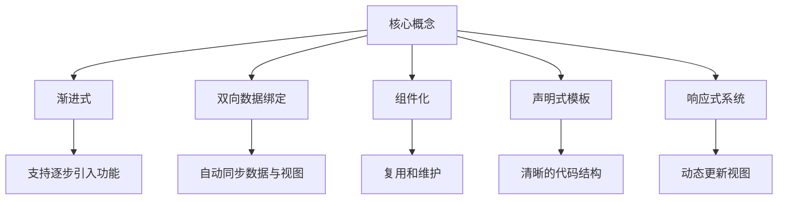

                 

# Vue.js 优势：渐进式 JavaScript 框架

## 1. 背景介绍

### 1.1 问题由来
JavaScript 框架是前端开发中不可或缺的工具，它们提供了各种功能，如状态管理、组件复用、路由管理等，使开发更加高效。传统的 JavaScript 框架（如 Angular 和 React）虽然功能强大，但体积庞大，学习曲线陡峭，难以满足中小项目的需求。

### 1.2 问题核心关键点
Vue.js 的出现，满足了这一需求，它是一款轻量级的渐进式 JavaScript 框架，提供了高效易用的组件开发工具，适用于中小型项目和大型项目。本文将全面介绍 Vue.js 的优势，涵盖其核心概念、算法原理、开发实践、应用场景、资源推荐等方面。

## 2. 核心概念与联系

### 2.1 核心概念概述

Vue.js 是一款渐进式 JavaScript 框架，具有以下核心概念：

- **渐进式**：支持逐步引入和使用 Vue.js 的组件和功能，不需要一次性集成所有模块，减轻了前端开发者的负担。
- **双向数据绑定**：通过 `v-model` 指令实现数据与视图的实时同步，简化了数据更新和渲染的逻辑。
- **组件化**：将页面拆分成多个独立的组件，便于复用和维护。
- **声明式模板**：使用 `template` 语法，以声明式的方式描述 UI 结构，使得代码更加清晰易懂。
- **响应式系统**：通过观察者模式，动态更新数据时自动更新视图，提升开发效率。

这些核心概念构成了 Vue.js 的核心优势，使得它成为目前最受欢迎的 JavaScript 框架之一。

### 2.2 核心概念原理和架构的 Mermaid 流程图



## 3. 核心算法原理 & 具体操作步骤

### 3.1 算法原理概述

Vue.js 的核心算法原理主要围绕着组件的生命周期和事件处理机制展开，以下是其基本原理：

1. **组件生命周期**：Vue.js 组件分为三个阶段：创建阶段、挂载阶段和更新阶段，每个阶段有对应的钩子函数。
2. **响应式系统**：Vue.js 通过响应式系统，在数据变化时自动更新视图，简化了数据绑定和更新的逻辑。
3. **事件处理机制**：Vue.js 的事件处理机制基于观察者模式，事件触发时调用对应的监听器。

### 3.2 算法步骤详解

Vue.js 的核心算法步骤主要包括：

1. **组件创建和挂载**：通过 `new Vue()` 创建 Vue 实例，并通过 `mount()` 方法挂载到 DOM 中。
2. **数据绑定和更新**：使用 `v-model` 指令实现双向数据绑定，通过观察者模式监听数据变化，更新视图。
3. **组件生命周期钩子**：定义 `created()`、`mounted()`、`updated()` 等钩子函数，在组件生命周期的不同阶段执行特定的逻辑。
4. **事件处理**：通过 `v-on` 指令监听事件，定义事件处理函数，处理用户交互。
5. **组件复用**：将相同的功能封装为独立的组件，通过 `render()` 方法生成 DOM 结构。

### 3.3 算法优缺点

**优点**：

- **渐进式引入**：开发者可以根据需要逐步引入 Vue.js 的功能，避免不必要的负担。
- **双向数据绑定**：简化数据绑定和更新的逻辑，提升开发效率。
- **组件化开发**：便于复用和维护，提高开发效率。
- **响应式系统**：自动更新视图，减少手动更新代码的繁琐工作。
- **轻量级**：体积小，性能高，适用于各种规模的项目。

**缺点**：

- **学习曲线陡峭**：尽管 Vue.js 设计了渐进式引入的功能，但开发者仍需要掌握一定的 Vue.js 知识。
- **缺少生态**：相比于 React 和 Angular，Vue.js 的生态系统相对较弱，第三方库和插件较少。

### 3.4 算法应用领域

Vue.js 主要应用于 Web 开发领域，适用于中小型项目和大型项目。具体应用领域包括：

- **单页应用（SPA）**：通过 Vue Router 实现路由管理，构建高效的页面导航系统。
- **前端构建工具**：如 Vue CLI，简化项目搭建和组件复用的流程。
- **状态管理**：通过 Vuex，实现全局状态管理，统一管理组件间的共享状态。
- **响应式表单**：通过表单组件和验证规则，简化表单开发和数据校验的逻辑。
- **组件库**：如 Vue Material，提供丰富的 UI 组件，加速开发进度。

## 4. 数学模型和公式 & 详细讲解 & 举例说明

### 4.1 数学模型构建

Vue.js 的数学模型主要围绕着组件的数据模型展开，包括组件的状态和属性。组件的数据模型可以使用以下代码表示：

```javascript
const vm = new Vue({
  data: {
    name: 'John',
    age: 30
  },
  methods: {
    sayHello() {
      console.log('Hello, ' + this.name + '!');
    }
  }
});
```

在上述代码中，`vm` 是一个 Vue 实例，`data` 属性定义了组件的状态，`sayHello()` 方法定义了组件的逻辑行为。

### 4.2 公式推导过程

Vue.js 的双向数据绑定和响应式系统基于以下推导过程：

1. **观察者模式**：Vue.js 的响应式系统使用观察者模式，将数据对象和视图对象绑定起来。当数据对象发生变化时，自动更新视图对象。

2. **响应式对象**：Vue.js 定义了 `Watcher` 类，用于监控数据对象的修改。当数据对象发生变化时，触发 `Watcher` 对象的回调函数，更新视图。

3. **计算属性**：Vue.js 支持计算属性，通过计算属性表达式动态生成数据。计算属性可以简化复杂的数据逻辑，提高代码的可读性和可维护性。

### 4.3 案例分析与讲解

以下是一个简单的 Vue.js 组件示例：

```html
<template>
  <div>
    <h1>{{ message }}</h1>
    <p>{{ counter }}</p>
    <button @click="increment">+1</button>
  </div>
</template>

<script>
export default {
  data() {
    return {
      message: 'Hello Vue.js!',
      counter: 0
    };
  },
  methods: {
    increment() {
      this.counter++;
    }
  }
};
</script>
```

在上述代码中，`template` 部分定义了组件的 HTML 结构，`script` 部分定义了组件的状态和逻辑行为。通过 `v-model` 指令实现数据与视图的绑定，通过 `@click` 指令监听按钮的点击事件，触发 `increment()` 方法更新计数器的值。

## 5. 项目实践：代码实例和详细解释说明

### 5.1 开发环境搭建

1. 安装 Node.js 和 npm：从官网下载并安装 Node.js，并配置环境变量。
2. 安装 Vue CLI：通过 npm 安装 Vue CLI，执行以下命令：

   ```bash
   npm install -g @vue/cli
   ```

3. 创建 Vue 项目：执行以下命令创建 Vue 项目：

   ```bash
   vue create my-project
   ```

   创建完成后，进入项目目录，执行以下命令启动项目：

   ```bash
   cd my-project
   npm run serve
   ```

4. 运行项目：在浏览器中访问 `http://localhost:8080`，查看项目运行结果。

### 5.2 源代码详细实现

以下是一个简单的 Vue.js 组件示例：

```html
<template>
  <div>
    <h1>{{ message }}</h1>
    <p>{{ counter }}</p>
    <button @click="increment">+1</button>
  </div>
</template>

<script>
export default {
  data() {
    return {
      message: 'Hello Vue.js!',
      counter: 0
    };
  },
  methods: {
    increment() {
      this.counter++;
    }
  }
};
</script>
```

在上述代码中，`template` 部分定义了组件的 HTML 结构，`script` 部分定义了组件的状态和逻辑行为。通过 `v-model` 指令实现数据与视图的绑定，通过 `@click` 指令监听按钮的点击事件，触发 `increment()` 方法更新计数器的值。

### 5.3 代码解读与分析

以下是对上述代码的详细解读：

1. `template` 部分：使用 Vue.js 的模板语法定义组件的 HTML 结构，其中 `{{ message }}` 和 `{{ counter }}` 分别表示数据对象的 `message` 和 `counter` 属性。
2. `script` 部分：定义 Vue.js 组件的状态和逻辑行为，使用 `data` 函数定义组件的数据对象，使用 `methods` 函数定义组件的方法。
3. `v-model` 指令：用于实现数据与视图的绑定，当数据对象的 `message` 属性发生变化时，自动更新视图对象的 `{{ message }}`。
4. `@click` 指令：用于监听按钮的点击事件，当按钮被点击时，调用 `increment()` 方法更新计数器的值。

### 5.4 运行结果展示

在运行上述代码后，浏览器中将显示以下内容：

```
Hello Vue.js!
0
+1
```

## 6. 实际应用场景

### 6.1 单页应用（SPA）

Vue.js 通过 Vue Router 提供了强大的路由管理功能，适用于构建单页应用（SPA）。以下是 Vue Router 的基本用法：

```javascript
import Vue from 'vue';
import VueRouter from 'vue-router';

Vue.use(VueRouter);

const routes = [
  {
    path: '/',
    component: Home,
  },
  {
    path: '/about',
    component: About,
  },
  {
    path: '/contact',
    component: Contact,
  },
];

const router = new VueRouter({
  routes,
});

new Vue({
  router,
}).$mount('#app');
```

在上述代码中，`Vue Router` 定义了路由规则，通过 `new VueRouter()` 创建路由实例，并将路由实例传递给 Vue 实例。

### 6.2 前端构建工具

Vue.js 提供了 Vue CLI 工具，可以简化项目的搭建和组件复用流程。以下是 Vue CLI 的基本用法：

```bash
vue create my-project
```

执行上述命令后，Vue CLI 会自动创建项目并配置好常用的插件，开发者只需在项目中添加代码即可快速开发。

### 6.3 状态管理

Vue.js 提供了 Vuex 状态管理库，用于统一管理组件间的共享状态。以下是 Vuex 的基本用法：

```javascript
import Vue from 'vue';
import Vuex from 'vuex';

Vue.use(Vuex);

const store = new Vuex.Store({
  state: {
    count: 0,
  },
  mutations: {
    increment(state) {
      state.count++;
    },
  },
  actions: {
    increment({ commit }) {
      commit('increment');
    },
  },
});

new Vue({
  store,
}).$mount('#app');
```

在上述代码中，`Vuex` 定义了状态管理库，通过 `new Vuex.Store()` 创建状态管理实例，并定义状态、突变和操作函数。

### 6.4 未来应用展望

未来，Vue.js 将继续保持其渐进式、易用性、高性能等优势，广泛应用于各种 Web 开发场景中。以下是一些未来展望：

- **渐进式增强**：Vue.js 将不断引入新的功能，提升开发效率和用户体验。
- **跨端支持**：Vue.js 将拓展到更多平台，如 Web、移动端、桌面端等。
- **生态系统完善**：更多的第三方库和插件将丰富 Vue.js 的生态系统，提升开发效率。

## 7. 工具和资源推荐

### 7.1 学习资源推荐

1. Vue.js 官方文档：Vue.js 提供了详细的官方文档，包括核心概念、API 接口、最佳实践等。
2. Vue.js 教程：通过 Vue.js 官方和第三方平台提供的教程，可以系统学习 Vue.js 的开发技巧。
3. Vue.js 社区：加入 Vue.js 社区，获取最新的技术动态和开发经验。

### 7.2 开发工具推荐

1. VSCode：一个轻量级且功能丰富的代码编辑器，支持 Vue.js 开发。
2. WebStorm：一个强大的 Web 开发工具，支持 Vue.js 开发和调试。
3. Vue CLI：一个快速搭建 Vue.js 项目的工具，支持组件复用和代码生成。

### 7.3 相关论文推荐

1. Vue.js 的设计理念：介绍 Vue.js 的设计思想和核心技术。
2. Vue.js 的应用场景：分析 Vue.js 在实际开发中的应用场景和优势。
3. Vue.js 的性能优化：探讨 Vue.js 的性能优化技巧和最佳实践。

## 8. 总结：未来发展趋势与挑战

### 8.1 总结

本文全面介绍了 Vue.js 的优势和应用，涵盖了其核心概念、算法原理、开发实践、应用场景、资源推荐等方面。通过学习 Vue.js，开发者可以掌握渐进式 JavaScript 框架的核心技术，提升开发效率和用户体验。

### 8.2 未来发展趋势

未来，Vue.js 将继续保持其渐进式、易用性、高性能等优势，广泛应用于各种 Web 开发场景中。以下是一些未来展望：

- **渐进式增强**：Vue.js 将不断引入新的功能，提升开发效率和用户体验。
- **跨端支持**：Vue.js 将拓展到更多平台，如 Web、移动端、桌面端等。
- **生态系统完善**：更多的第三方库和插件将丰富 Vue.js 的生态系统，提升开发效率。

### 8.3 面临的挑战

尽管 Vue.js 有许多优点，但也面临着一些挑战：

1. **学习曲线陡峭**：尽管 Vue.js 设计了渐进式引入的功能，但开发者仍需要掌握一定的 Vue.js 知识。
2. **缺少生态**：相比于 React 和 Angular，Vue.js 的生态系统相对较弱，第三方库和插件较少。
3. **性能问题**：在一些复杂的场景下，Vue.js 的性能可能会受到影响。

### 8.4 研究展望

未来，Vue.js 的研究方向将围绕以下方面展开：

- **性能优化**：提升 Vue.js 的性能，减少内存占用和渲染时间。
- **跨端支持**：拓展 Vue.js 的跨端应用，提升用户体验。
- **生态系统完善**：丰富 Vue.js 的生态系统，提升开发效率和代码复用性。

## 9. 附录：常见问题与解答

**Q1：Vue.js 的学习曲线陡峭吗？**

A: Vue.js 的学习曲线相对较陡峭，尤其是对于初学者。但 Vue.js 的渐进式引入功能可以逐步学习其核心技术，并快速上手。

**Q2：Vue.js 的生态系统如何？**

A: Vue.js 的生态系统相对较弱，但随着社区的壮大，越来越多的第三方库和插件将涌现，提升开发效率。

**Q3：Vue.js 的性能如何？**

A: Vue.js 的性能表现优异，但在一些复杂的场景下，可能会受到影响。开发者可以通过性能优化技巧，提升 Vue.js 的性能。

**Q4：Vue.js 与其他 JavaScript 框架相比有何优势？**

A: Vue.js 具有渐进式、易用性、高性能等优势，适用于中小型项目和大型项目。

总之，Vue.js 作为一款渐进式 JavaScript 框架，具有独特的优势和广泛的应用场景，适用于各种 Web 开发项目。开发者可以系统学习 Vue.js 的核心技术，提升开发效率和用户体验。未来，Vue.js 将继续保持其优势，拓展到更多平台和应用场景中，为 Web 开发带来更多可能。

