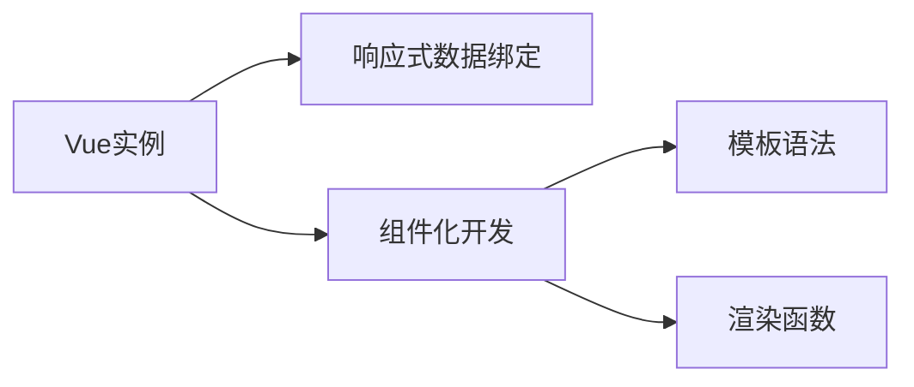

                 

# Vue.js 入门：渐进式 JavaScript 框架

## 1. 背景介绍

### 1.1 问题由来
随着Web应用的复杂性日益增长，传统的MVC模式（Model-View-Controller）已经难以满足前端开发的需求。许多前端开发者开始寻找新的框架，以提高开发效率和用户体验。

Vue.js应运而生，它是由尤雨溪（Evan You）开发的一个轻量级、渐进式的前端JavaScript框架。Vue.js通过引入响应式数据绑定、组件化开发和模板渲染等机制，简化了前端开发的复杂性，使得开发人员能够更加专注于业务逻辑的实现，而不是在UI和DOM操作上花费过多精力。

Vue.js的核心思想是渐进式Web开发，这意味着框架可以根据项目的需求，选择性地引入特性和组件，而非一次性加载全部功能，从而提高了开发效率和性能。

### 1.2 问题核心关键点
Vue.js的核心优势在于它的渐进式开发和组件化设计，这种设计理念使得开发者可以灵活地构建大型Web应用。

渐进式Web开发的核心在于组件化，开发者可以根据项目需求，选择性地引入需要的组件，而不是一次性加载全部功能。这种灵活的设计方法不仅可以提高开发效率，还可以改善应用的性能。

组件化设计是Vue.js最重要的特点之一。通过将应用拆分为独立的组件，开发者可以重复使用代码，提高开发效率和代码质量。组件之间可以通过props、events等机制进行通信，从而构建出复杂的页面结构。

## 2. 核心概念与联系

### 2.1 核心概念概述

为更好地理解Vue.js，本节将介绍几个关键概念：

- Vue实例（Vue Instance）：表示一个Vue应用的核心，包括数据、组件、指令等。
- 响应式数据绑定（Reactive Data Binding）：通过观察数据变化，自动更新UI，实现无状态的视图层。
- 组件化开发（Component-Based Development）：将应用拆分为独立的组件，通过props和events机制进行通信，提高代码复用性。
- 模板语法（Template Syntax）：使用HTML语法嵌入JavaScript表达式和指令，简化页面开发。
- 渲染函数（Rendering Function）：通过将模板编译为渲染函数，可以在不同平台上复用渲染逻辑。

这些核心概念之间的逻辑关系可以通过以下Mermaid流程图来展示：



这个流程图展示了大语言模型的核心概念及其之间的关系：

1. Vue实例作为应用的核心，通过响应式数据绑定和组件化开发，使得开发者可以灵活地构建复杂的Web应用。
2. 响应式数据绑定使得UI可以自动更新，实现无状态的视图层，简化开发和维护。
3. 组件化开发通过props和events机制，使得不同组件可以灵活地进行通信，提高代码复用性。
4. 模板语法和渲染函数使得开发者可以使用HTML语法，简化页面开发，并可以在不同平台上复用渲染逻辑。

这些核心概念共同构成了Vue.js的核心设计理念，使得开发者可以更加灵活、高效地构建Web应用。

## 3. 核心算法原理 & 具体操作步骤
### 3.1 算法原理概述

Vue.js的核心算法原理主要包括以下几个方面：

- 响应式数据绑定（Reactive Data Binding）：通过响应式系统（Observer System），实现数据和视图之间的自动同步。
- 组件化开发（Component-Based Development）：将应用拆分为独立的组件，通过props和events机制进行通信，提高代码复用性。
- 模板语法（Template Syntax）：使用HTML语法嵌入JavaScript表达式和指令，简化页面开发。
- 渲染函数（Rendering Function）：通过将模板编译为渲染函数，可以在不同平台上复用渲染逻辑。

### 3.2 算法步骤详解

Vue.js的核心算法原理和操作步骤主要包括以下几个方面：

**Step 1: 创建Vue实例**
- 使用Vue函数或Vue类创建一个Vue实例。
- 定义数据模型、组件、指令等，并配置配置项。

**Step 2: 响应式数据绑定**
- 使用Vue的响应式系统，将数据模型转换为响应式对象。
- 在数据模型中定义响应式属性，使用getters和setters方法实现数据绑定。

**Step 3: 组件化开发**
- 定义组件，包括模板、脚本、样式等。
- 通过props和events机制，使得组件可以灵活地进行通信和数据交互。

**Step 4: 模板语法**
- 使用HTML语法嵌入JavaScript表达式和指令，简化页面开发。
- 使用v-if、v-for、v-model等指令，实现动态渲染和数据绑定。

**Step 5: 渲染函数**
- 将模板编译为渲染函数，将数据渲染到视图层。
- 使用Vue.compile函数将模板编译为渲染函数，通过渲染函数复用渲染逻辑。

### 3.3 算法优缺点

Vue.js的核心算法原理和操作步骤具有以下优点：
1. 灵活高效。通过组件化开发和响应式数据绑定，可以灵活构建复杂的Web应用，并提高开发效率。
2. 可维护性高。组件化设计和响应式系统使得代码复用性和可维护性大大提高。
3. 跨平台性。渲染函数可以在不同平台上复用渲染逻辑，提升跨平台开发效率。
4. 易学易用。使用HTML语法和JavaScript指令，使得前端开发人员可以快速上手。

同时，该算法也存在一些局限性：
1. 学习曲线较陡。需要掌握响应式系统、组件化开发、渲染函数等技术。
2. 性能瓶颈。响应式系统和模板渲染函数可能会导致性能瓶颈，需要优化和改进。
3. 大型应用复杂性。组件过多时，管理复杂，需要完善的组织架构和开发规范。

尽管存在这些局限性，但就目前而言，Vue.js仍然是前端开发中最流行的框架之一。未来相关研究的重点在于如何进一步优化响应式系统、提升渲染效率，以及完善组件化开发框架，以便更好地支持大型应用的构建。

### 3.4 算法应用领域

Vue.js的渐进式Web开发范式，适用于各种类型的Web应用开发。以下是几个典型的应用领域：

- 企业级Web应用：通过组件化开发和响应式数据绑定，构建可维护、易扩展的企业级Web应用。
- 移动端应用：使用Vue.js和Weex框架，可以构建跨平台的移动端应用。
- 单页面应用（SPA）：通过Vue Router实现路由管理，简化页面之间的跳转和数据交换。
- 渐进式Web应用（PWA）：使用Web API和Service Worker，提升Web应用的离线能力和性能。
- 服务端渲染（SSR）：使用Vue Server Renderer，将Web应用的部分页面渲染为静态HTML，提升性能和SEO效果。

除了上述这些应用领域，Vue.js还可以应用于各种类型的Web应用开发，包括物联网应用、社交应用、电子商务应用等。随着Vue.js的不断发展和完善，相信它将在更广泛的领域得到应用，为前端开发带来新的突破。

## 4. 数学模型和公式 & 详细讲解 & 举例说明

### 4.1 数学模型构建

Vue.js的核心算法原理主要涉及响应式数据绑定和组件化开发两个方面。以下是响应式数据绑定和组件化开发的数学模型：

**响应式数据绑定数学模型**

假设有一个响应式数据模型data，包含属性x。使用Vue的响应式系统，将data转换为响应式对象observable，其中包含data的值和订阅者列表。当data的值发生变化时，通知所有订阅者更新UI。

```javascript
class ReactiveDataModel {
  constructor(data) {
    this.data = data;
    this.subscribers = [];
  }
  
  subscribe(callback) {
    this.subscribers.push(callback);
  }
  
  notify() {
    this.subscribers.forEach(callback => callback(this.data));
  }
}

let data = new ReactiveDataModel({x: 0});

let x = new Observer(data);
x.subscribe(value => console.log(`x = ${value}`));

data.data.x = 1;
```

**组件化开发数学模型**

假设有一个组件Component，包含模板template、脚本script和样式style。使用Vue.compile函数将模板编译为渲染函数，将数据模型data传递给组件，并通过props和events机制进行数据绑定和通信。

```javascript
let Component = Vue.component('my-component', {
  template: `
    <div>
      <h1>{{ data.message }}</h1>
      <button @click="data.message = 'Hello, World!'"></button>
    </div>
  `,
  script: {
    data() {
      return {
        message: 'Hello, Vue!'
      };
    },
    methods: {
      updateMessage() {
        this.$emit('update-message', 'Hello, Vue!');
      }
    }
  },
  style: 'font-size: 16px;'
});

let app = new Vue({
  el: '#app',
  data: {
    message: 'Hello, Vue!'
  }
});
```

### 4.2 公式推导过程

以下是对响应式数据绑定和组件化开发的公式推导过程：

**响应式数据绑定公式推导**

响应式数据绑定通过观察数据变化，自动更新UI。假设数据模型data包含属性x，定义Observer类观察数据模型data，并订阅x的变化。

```javascript
class Observer {
  constructor(data) {
    this.data = data;
    this.subscribers = [];
    this.dataWatch(data, function() {
      this.notify();
    });
  }
  
  subscribe(callback) {
    this.subscribers.push(callback);
  }
  
  notify() {
    this.subscribers.forEach(callback => callback(this.data));
  }
}

let data = new Observer({x: 0});
let x = data;

x.subscribe(value => console.log(`x = ${value}`));

data.data.x = 1;
```

**组件化开发公式推导**

组件化开发通过props和events机制进行通信。假设有一个组件Component，包含模板template、脚本script和样式style。使用Vue.compile函数将模板编译为渲染函数，将数据模型data传递给组件，并通过props和events机制进行数据绑定和通信。

```javascript
let Component = Vue.component('my-component', {
  template: `
    <div>
      <h1>{{ data.message }}</h1>
      <button @click="data.message = 'Hello, World!'"></button>
    </div>
  `,
  script: {
    data() {
      return {
        message: 'Hello, Vue!'
      };
    },
    methods: {
      updateMessage() {
        this.$emit('update-message', 'Hello, Vue!');
      }
    }
  },
  style: 'font-size: 16px;'
});

let app = new Vue({
  el: '#app',
  data: {
    message: 'Hello, Vue!'
  }
});
```

### 4.3 案例分析与讲解

假设有一个包含两个计数器的应用，分别显示当前计数器的值。使用Vue.js实现响应式数据绑定和组件化开发，展示如何使用props和events机制进行数据绑定和通信。

```javascript
// Vue实例
let app = new Vue({
  el: '#app',
  data: {
    counter1: 0,
    counter2: 0
  }
});

// 响应式数据绑定
let counter1 = new Observer(app);
counter1.subscribe(value => console.log(`counter1 = ${value}`));

// 组件化开发
let Component = Vue.component('counter-component', {
  props: {
    counter: {
      type: Number,
      default: 0
    }
  },
  template: `
    <div>
      <p>Counter: {{ counter }}</p>
      <button @click="updateCounter">
        Increment
      </button>
    </div>
  `,
  script: {
    data() {
      return {
        counter: this.$props.counter
      };
    },
    methods: {
      updateCounter() {
        this.$emit('update-counter', this.$props.counter + 1);
      }
    }
  }
});

// 在应用中渲染组件
app.$mount();

// 动态添加组件
let component1 = document.createElement('div');
component1.setAttribute('counter', 0);
app.$mount(component1);
```

## 5. 项目实践：代码实例和详细解释说明
### 5.1 开发环境搭建

在进行Vue.js项目实践前，我们需要准备好开发环境。以下是使用npm和Vue CLI快速搭建Vue项目的步骤：

1. 安装Node.js和npm，从官网下载安装即可。
2. 使用npm全局安装Vue CLI：`npm install -g @vue/cli`。
3. 创建新项目：`vue create my-project`。
4. 进入项目目录，并安装依赖：`npm install`。

完成上述步骤后，即可在项目中开始Vue.js的开发实践。

### 5.2 源代码详细实现

下面以一个简单的电商应用为例，展示如何使用Vue.js实现响应式数据绑定和组件化开发。

**电商应用需求**

- 显示商品列表，每项商品包含名称、价格、图片和购买按钮。
- 用户可以对商品进行点赞、收藏和评论。

**源代码实现**

1. 创建Vue实例，定义数据模型和渲染函数：

```javascript
let app = new Vue({
  el: '#app',
  data: {
    products: [
      { name: 'Product 1', price: 100, image: 'product1.jpg', likes: 0, comments: [] },
      { name: 'Product 2', price: 200, image: 'product2.jpg', likes: 0, comments: [] }
    ]
  },
  methods: {
    addComment(productId, comment) {
      let product = this.products[productId];
      product.comments.push(comment);
      product.$emit('update-product', product);
    }
  }
});
```

2. 创建商品组件，实现商品详情页：

```javascript
let Product = Vue.component('product', {
  props: {
    product: {
      type: Object,
      required: true
    }
  },
  template: `
    <div>
      <h2>{{ product.name }}</h2>
      
      <p>Price: {{ product.price }} CNY</p>
      <button @click="handleLike">Like</button>
      <button @click="handleComment">Comment</button>
    </div>
  `,
  script: {
    data() {
      return {
        likes: 0
      };
    },
    methods: {
      handleLike() {
        this.$emit('update-like', this.likes + 1);
      },
      handleComment(comment) {
        this.$emit('add-comment', { productId: this.product.id, comment });
      }
    }
  }
});
```

3. 在应用中渲染商品组件，展示商品列表和详情页：

```html
<div id="app">
  <ul>
    <li v-for="(product, index) in products" :key="index">
      <Product :product="product" />
    </li>
  </ul>
</div>
```

4. 在商品组件中，监听点赞和评论事件，更新数据模型：

```javascript
let Product = Vue.component('product', {
  props: {
    product: {
      type: Object,
      required: true
    }
  },
  template: `
    <div>
      <h2>{{ product.name }}</h2>
      
      <p>Price: {{ product.price }} CNY</p>
      <button @click="handleLike">Like</button>
      <button @click="handleComment">Comment</button>
    </div>
  `,
  script: {
    data() {
      return {
        likes: 0
      };
    },
    methods: {
      handleLike() {
        this.$emit('update-like', this.likes + 1);
      },
      handleComment(comment) {
        this.$emit('add-comment', { productId: this.product.id, comment });
      }
    },
    created() {
      let product = this.$props.product;
      this.likes = product.likes;
      this.$on('update-like', like => {
        product.likes = like;
      });
      this.$on('update-product', product => {
        this.$set(product, 'likes', product.likes);
      });
    }
  }
});
```

**代码解读与分析**

1. 创建Vue实例，定义数据模型和渲染函数：
   - 定义一个包含商品列表的数据模型，用于存储所有商品信息。
   - 定义一个addComment方法，用于添加商品评论，并更新商品数据模型。

2. 创建商品组件，实现商品详情页：
   - 定义一个包含商品信息的props属性，用于从父组件传递商品数据。
   - 使用模板语法，展示商品图片、名称、价格、点赞和评论按钮。
   - 定义handleLike和handleComment方法，用于监听点赞和评论事件，并更新商品数据模型。

3. 在应用中渲染商品组件，展示商品列表和详情页：
   - 使用v-for指令，遍历商品列表，渲染商品组件。
   - 将商品组件传递给商品详情页，展示商品详情信息。

4. 在商品组件中，监听点赞和评论事件，更新数据模型：
   - 定义created方法，在组件创建后监听点赞和评论事件，更新商品数据模型。

## 6. 实际应用场景
### 6.1 智能客服系统

智能客服系统是Vue.js的一个典型应用场景。通过Vue.js和WebSocket技术，可以实现实时聊天功能，提升客户咨询体验和问题解决效率。

**实现思路**

- 使用Vue.js开发智能客服页面，包含聊天窗口、输入区域、聊天记录等组件。
- 使用WebSocket技术实现与服务器的实时通信，接收和发送消息。
- 在服务器端，使用Node.js和Socket.io库实现WebSocket服务器，处理客户端发送的消息，并返回响应。

**技术栈**

- Vue.js：前端框架，实现智能客服页面和聊天功能。
- WebSocket：实时通信协议，实现与服务器的实时通信。
- Node.js和Socket.io：服务器端技术栈，实现WebSocket服务器和消息处理。

**优势**

- 实时响应：通过WebSocket技术，实现与服务器的实时通信，提升客户咨询体验。
- 跨平台支持：Vue.js和Node.js都支持跨平台开发，使得智能客服系统可以在不同设备和浏览器上运行。
- 灵活扩展：通过组件化开发和响应式数据绑定，可以灵活地添加和扩展智能客服功能。

### 6.2 电商应用

电商应用是Vue.js的另一个典型应用场景。通过Vue.js和Nginx服务器，可以实现高性能、高可扩展的电商系统。

**实现思路**

- 使用Vue.js开发电商页面，包含商品列表、商品详情、购物车等组件。
- 使用Nginx服务器，实现静态资源分发和动态页面渲染。
- 在服务器端，使用Node.js和Express框架实现API接口，处理用户请求和数据交互。

**技术栈**

- Vue.js：前端框架，实现电商页面和用户交互。
- Nginx：反向代理服务器，实现静态资源分发和动态页面渲染。
- Node.js和Express：服务器端技术栈，实现API接口和数据处理。

**优势**

- 高性能：通过Nginx服务器和Vue.js渲染函数，可以实现高性能的电商应用。
- 可扩展性：通过Vue.js组件化开发，可以灵活地扩展电商功能，如商品搜索、推荐系统等。
- 跨平台支持：Vue.js和Node.js都支持跨平台开发，使得电商应用可以在不同设备和浏览器上运行。

### 6.3 在线教育平台

在线教育平台是Vue.js的另一个重要应用场景。通过Vue.js和Vuetify框架，可以实现美观、易用的在线教育页面，提升用户学习体验。

**实现思路**

- 使用Vue.js和Vuetify框架，开发在线教育页面，包含课程列表、课程详情、在线测试等组件。
- 在服务器端，使用Node.js和Express框架实现API接口，处理用户请求和数据交互。
- 使用WebSocket技术，实现实时通信和互动，提升用户学习体验。

**技术栈**

- Vue.js：前端框架，实现在线教育页面和用户交互。
- Vuetify：UI组件库，提供美观、易用的UI组件，提升用户体验。
- Node.js和Express：服务器端技术栈，实现API接口和数据处理。
- WebSocket：实时通信协议，实现与服务器的实时通信。

**优势**

- 美观易用：通过Vue.js和Vuetify框架，可以实现美观、易用的在线教育页面。
- 实时互动：通过WebSocket技术，实现与服务器的实时通信，提升用户学习体验。
- 跨平台支持：Vue.js和Node.js都支持跨平台开发，使得在线教育平台可以在不同设备和浏览器上运行。

## 7. 工具和资源推荐
### 7.1 学习资源推荐

为了帮助开发者系统掌握Vue.js的理论基础和实践技巧，这里推荐一些优质的学习资源：

1. Vue.js官方文档：Vue.js官方文档是学习Vue.js的最佳资源，包含了从基础到高级的各种内容。
2. Vue.js教程：《Vue.js官方教程》是一个完整的Vue.js入门教程，涵盖了Vue.js的基本概念、API和最佳实践。
3. Vue.js源码：Vue.js官方提供了源码示例，可以帮助开发者更好地理解Vue.js的内部实现。
4. Vue.js插件：Vue.js拥有丰富的插件生态系统，可以扩展Vue.js的功能和特性，如Vuetify、Element UI等。
5. Vue.js开发者社区：Vue.js开发者社区是一个活跃的技术交流平台，汇聚了全球的Vue.js开发者和爱好者，提供了丰富的学习资源和技术支持。

通过对这些资源的学习实践，相信你一定能够快速掌握Vue.js的核心技术，并用于解决实际的Web开发问题。

### 7.2 开发工具推荐

Vue.js是一个非常灵活的前端框架，可以选择多种工具进行开发。以下是几款常用的开发工具：

1. Visual Studio Code：一款轻量级、功能强大的代码编辑器，支持Vue.js开发，提供了丰富的插件和扩展。
2. Webpack：一款流行的前端打包工具，可以将Vue.js代码打包为优化后的生产代码。
3. Vuex：一款基于Vue.js的状态管理库，用于管理应用的状态和数据流。
4. Vue Router：一款基于Vue.js的路由管理器，用于管理应用的页面路由和导航。
5. Vue CLI：一款快速搭建Vue.js项目的命令行工具，可以生成默认的Vue.js项目结构和配置。

合理利用这些工具，可以显著提升Vue.js的开发效率，加速开发进程。

### 7.3 相关论文推荐

Vue.js的发展离不开学界的持续研究。以下是几篇奠基性的相关论文，推荐阅读：

1. Vue.js: Progressive JavaScript Frameworks for Web Applications：介绍Vue.js的基本概念和开发方法。
2. Vue.js 2.0 官方文档：Vue.js 2.0的官方文档，涵盖了从基础到高级的各种内容。
3. Vue.js源码解析：对Vue.js源码进行详细解析，帮助开发者理解Vue.js的内部实现。
4. Vue.js插件和组件开发：介绍如何开发Vue.js插件和组件，扩展Vue.js的功能和特性。
5. Vue.js开发者社区文章：Vue.js开发者社区的文章，汇聚了全球的Vue.js开发者和爱好者，提供了丰富的学习资源和技术支持。

这些论文代表了大语言模型微调技术的发展脉络。通过学习这些前沿成果，可以帮助研究者把握学科前进方向，激发更多的创新灵感。

## 8. 总结：未来发展趋势与挑战

### 8.1 总结

本文对Vue.js的渐进式Web开发进行了全面系统的介绍。首先阐述了Vue.js的发展背景和核心优势，明确了渐进式Web开发在构建复杂Web应用中的重要意义。其次，从原理到实践，详细讲解了Vue.js的核心算法原理和操作步骤，给出了 Vue.js 项目实践的完整代码实例。同时，本文还广泛探讨了 Vue.js 在智能客服系统、电商应用、在线教育平台等诸多行业领域的应用前景，展示了 Vue.js 的广泛应用潜力。此外，本文精选了 Vue.js 的学习资源、开发工具和相关论文，力求为读者提供全方位的技术指引。

通过本文的系统梳理，可以看到，Vue.js的渐进式Web开发方法在构建复杂Web应用中具有独特优势，不仅提高了开发效率，还提升了应用的性能和可维护性。未来，随着Vue.js的不断发展和完善，相信它将在更广泛的领域得到应用，为Web开发带来新的突破。

### 8.2 未来发展趋势

展望未来，Vue.js将呈现以下几个发展趋势：

1. 组件化开发更加深入：随着组件化开发的应用场景不断拓展，组件库和工具库的开发也将更加深入，使得组件化开发更加灵活、高效。
2. 响应式系统更加完善：响应式系统将得到更深入的研究和优化，使得数据绑定和视图更新更加高效、可靠。
3. 动态模板技术更加丰富：动态模板技术将得到更广泛的应用，使得开发者可以更加灵活地实现动态渲染和页面构建。
4. 工具和框架更加丰富：Vue.js生态系统将更加完善，工具和框架将更加丰富，使得开发者可以更加便捷地开发和部署Vue.js应用。
5. 跨平台支持更加全面：Vue.js将支持更多的平台和设备，使得开发者可以更加便捷地开发跨平台应用。

这些趋势将使得Vue.js更加灵活、高效、便捷，为Web开发带来新的突破。

### 8.3 面临的挑战

尽管Vue.js已经取得了巨大的成功，但在迈向更加智能化、普适化应用的过程中，它仍面临着诸多挑战：

1. 学习曲线较陡：Vue.js的学习曲线较陡，需要开发者掌握响应式系统、组件化开发、渲染函数等技术，对开发人员的要求较高。
2. 性能瓶颈：响应式系统和动态模板技术可能会导致性能瓶颈，需要优化和改进。
3. 大型应用复杂性：组件过多时，管理复杂，需要完善的组织架构和开发规范。
4. 跨平台支持：Vue.js需要支持更多的平台和设备，以便在更多设备上运行。

尽管存在这些挑战，但相信随着学界和产业界的共同努力，这些挑战终将一一被克服，Vue.js必将在构建Web应用中扮演越来越重要的角色。

### 8.4 研究展望

未来，Vue.js的研究需要在以下几个方面寻求新的突破：

1. 优化响应式系统：进一步优化响应式系统，提升数据绑定和视图更新的效率。
2. 改进动态模板技术：改进动态模板技术，提升动态渲染和页面构建的性能和灵活性。
3. 完善组件化开发：完善组件化开发工具和框架，提升组件库和工具库的开发水平。
4. 引入新特性：引入新特性，如路由导航、状态管理等，提升应用的功能和性能。
5. 支持跨平台开发：支持更多的平台和设备，提升跨平台开发的灵活性和便捷性。

这些研究方向的探索，将使得Vue.js在构建Web应用中更加灵活、高效、便捷，为Web开发带来新的突破。

## 9. 附录：常见问题与解答

**Q1：Vue.js是否支持大型的Web应用？**

A: Vue.js可以支持大型的Web应用，但需要合理的组织架构和开发规范。通过组件化开发和响应式系统，可以灵活地构建复杂的应用，并提高代码复用性和可维护性。但随着组件数量的增加，需要考虑模块化和微服务架构，以避免应用过于臃肿。

**Q2：Vue.js是否支持实时通信？**

A: Vue.js可以通过WebSocket技术实现与服务器的实时通信，提升应用的响应速度和用户体验。但需要开发者自己实现WebSocket服务器和消息处理逻辑。

**Q3：Vue.js是否支持跨平台开发？**

A: Vue.js支持跨平台开发，可以使用不同的技术栈实现不同的应用场景。但需要开发者注意跨平台开发的细节，如设备兼容性、性能优化等。

**Q4：Vue.js是否支持状态管理？**

A: Vue.js本身并不支持状态管理，但可以通过第三方状态管理库如Vuex来实现状态管理。Vuex提供了全局的state、mutations和actions等机制，可以方便地管理应用的状态和数据流。

**Q5：Vue.js是否支持热重载？**

A: Vue.js可以通过Vue CLI工具实现热重载，可以实时更新页面内容，提高开发效率。但需要开发者注意配置和使用热重载功能，避免出现性能问题。

作者：禅与计算机程序设计艺术 / Zen and the Art of Computer Programming

