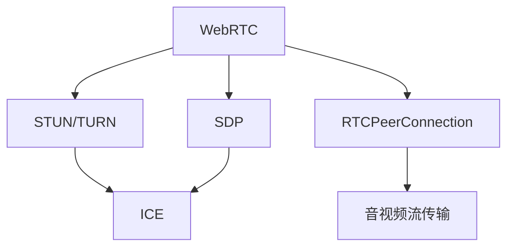

                 

# WebRTC 实时通信协议：在浏览器中实现互动

> 关键词：WebRTC, 实时通信, 浏览器, STUN/TURN, 数据通道, 音视频流传输, 安全性, 跨网络通信

## 1. 背景介绍

随着互联网的普及，实时通信（Real-Time Communication, RTC）的需求日益增长，尤其是在视频会议、在线教育、远程办公等领域。传统的浏览器实现实时通信，主要依赖于JavaScript实现的WebSockets技术。然而，WebSockets由于其安全性、跨网络通信等问题，并不能很好地满足现代实时通信的需求。为了更好地支持浏览器的实时通信功能，WebRTC（Web Real-Time Communication）协议应运而生。

### 1.1 问题由来

实时通信协议需要高效、低延迟、高可靠性的数据传输，而WebSockets在跨网络通信、数据包丢失处理等方面存在缺陷。传统的RTCPeerConnection（RTCP）协议，虽然可以传输非实时数据，但不适合音视频流的实时传输。因此，迫切需要一种新的实时通信协议来填补这一空白。

### 1.2 问题核心关键点

WebRTC协议的核心目标在于实现跨网络的实时音视频通信。其核心设计思想是：利用STUN/TURN服务器解决跨网络通信的问题，通过数据通道和信令通道实现音视频流的传输和控制。WebRTC的协议框架和组件包括：

- **STUN**：用于穿越NAT和防火墙，发现并选择合适的通信地址。
- **TURN**：用于解决STUN无法穿越某些网络（如某些企业内网）的问题，通过中继器转发音视频流。
- **SDP**：用于描述音视频流的编解码参数、传输参数等，是音视频流传输的基础。
- **ICE**：用于寻找合适的通信地址，支持多种寻址方式。
- **RTCPeerConnection**：用于建立、管理和控制音视频流传输，支持端到端的音视频通信。

## 2. 核心概念与联系

### 2.1 核心概念概述

为更好地理解WebRTC协议，我们需要了解以下几个核心概念：

- **WebRTC**：一种Web浏览器内置的实时通信协议，用于实现音视频流的传输和控制。
- **STUN/TURN**：STUN/TURN服务器用于解决跨网络通信的问题，STUN负责发现本地地址，TURN用于中继音视频流。
- **SDP**：会话描述协议（Session Description Protocol），用于描述音视频流的编解码参数、传输参数等，是音视频流传输的基础。
- **ICE**：交互式连接建立协议（Interactive Connectivity Establishment），用于建立音视频流的端到端连接。
- **RTCPeerConnection**：RTCPeerConnection对象，用于建立、管理和控制音视频流的传输，支持端到端的音视频通信。

这些概念之间的逻辑关系可以通过以下Mermaid流程图来展示：



这个流程图展示了几大核心概念之间的关系：

1. WebRTC利用STUN/TURN解决跨网络通信的问题。
2. ICE协议用于建立音视频流的端到端连接。
3. SDP协议用于描述音视频流的编解码参数、传输参数等，是音视频流传输的基础。
4. RTCPeerConnection对象用于建立、管理和控制音视频流的传输。

## 3. 核心算法原理 & 具体操作步骤
### 3.1 算法原理概述

WebRTC协议的核心在于利用STUN/TURN服务器解决跨网络通信的问题，通过数据通道和信令通道实现音视频流的传输和控制。其基本工作流程如下：

1. 客户端向STUN服务器发起请求，获取本地地址信息。
2. 如果STUN无法穿越当前网络，则向TURN服务器发起请求，通过中继器转发音视频流。
3. 客户端根据SDP协议描述音视频流的编解码参数、传输参数等，发送给对端。
4. ICE协议用于建立音视频流的端到端连接，交换连接信息。
5. RTCPeerConnection对象用于建立、管理和控制音视频流的传输，支持端到端的音视频通信。

### 3.2 算法步骤详解

以下是WebRTC协议的基本工作步骤：

**Step 1: 创建RTCPeerConnection对象**

```javascript
var pc = new RTCPeerConnection();
```

创建RTCPeerConnection对象后，即可使用该对象进行音视频流的创建和管理。

**Step 2: 创建数据通道和信令通道**

```javascript
var dataChannel = pc.createDataChannel('myChannel');
pc.createOffer().then(function(offer) {
    var sdp = offer.sdp;
    pc.setLocalDescription(sdp);
});
```

创建数据通道和信令通道，用于传输音视频流和控制消息。

**Step 3: 设置STUN/TURN服务器**

```javascript
var stunServer = new STUN(turnServerUrl);
var turnServer = new TURN(turnServerUrl);
```

设置STUN/TURN服务器，用于解决跨网络通信的问题。

**Step 4: 建立ICE连接**

```javascript
pc.onicecandidate = function(event) {
    if (event.candidate) {
        turnServer.addIceCandidate(event.candidate);
    }
};
```

通过ICE协议建立音视频流的端到端连接，交换连接信息。

**Step 5: 发送音视频流**

```javascript
dataChannel.send(data);
```

通过数据通道发送音视频流，支持端到端的音视频通信。

### 3.3 算法优缺点

WebRTC协议具有以下优点：

1. 基于浏览器实现，无需额外安装插件，部署方便。
2. 支持跨网络通信，无需复杂的NAT穿透策略。
3. 通过ICE协议，可以自动发现并连接对端，减少手工配置的复杂度。
4. 支持多种编解码器，灵活适应不同的网络环境和应用场景。

然而，WebRTC协议也存在以下缺点：

1. 安全性问题。WebRTC协议中包含SDP、ICE等敏感信息，如果泄露，可能被恶意攻击者利用。
2. 跨网络通信问题。当客户端和服务器不在同一网络内时，可能需要中继器转发音视频流，导致延迟较高。
3. 兼容性问题。不同浏览器和操作系统对WebRTC协议的支持程度不一，可能存在兼容性问题。

### 3.4 算法应用领域

WebRTC协议广泛应用于Web浏览器的实时通信场景，例如：

- 视频会议：利用WebRTC实现跨网络的视频会议。
- 在线教育：在教育平台中实现实时互动。
- 远程办公：在企业中实现跨网络的视频会议和文件传输。
- 游戏直播：在网络游戏直播中实现实时互动。

除了上述这些经典应用外，WebRTC还应用于各类跨网络的实时通信场景，为人们提供更便捷、高效的互动方式。

## 4. 数学模型和公式 & 详细讲解  
### 4.1 数学模型构建

WebRTC协议的数学模型主要涉及SDP协议、ICE协议和RTCP协议。以下是这些协议的数学模型构建：

**SDP协议**

SDP协议用于描述音视频流的编解码参数、传输参数等。其基本格式为：

```
v=0
o=alice 925928359 IN IP4 127.0.0.1
s=Simple WebRTC Session
t=0 0
a=type application
a=codecs:VP8
a=rtcp-mux
a=ice-ufrag:username
a=ice-pwd:password
m=audio 9000 RTP/SAVPF:96
c=IN IP4 0.0.0.0
```

其中，v表示协议版本，o表示会话标识，s表示会话名称，t表示会话时间戳，a表示会话参数，m表示媒体流信息，c表示连接信息。

**ICE协议**

ICE协议用于建立音视频流的端到端连接。其基本格式为：

```
c=candidate:source_ip port 1234 protocol udp c=IN IP4 source_ip
c=candidate:source_ip port 1234 protocol udp c=IN IP4 source_ip
c=candidate:source_ip port 1234 protocol udp c=IN IP4 source_ip
```

其中，c表示连接信息，包括源IP地址、端口号和协议等。

**RTCP协议**

RTCP协议用于控制音视频流的传输。其基本格式为：

```
RTCP Version: 2
CC Call Connection ID: 1
CC Transport Protocol: UDP
CC Local Port: 9000
CC Destination Port: 9000
CC RTP Payload Type: 96
CC RTCP Payload Type: 126
CC CName: cname
CC Transport IP Address: 0.0.0.0
CC Transport Port: 9000
```

其中，CC表示控制信息，包括调用连接ID、传输协议、本地端口号、目的端口号、RTP和RTCP的载荷类型、CName和传输IP地址等。

### 4.2 公式推导过程

以下我们以SDP协议为例，推导SDP协议的基本格式和计算方法。

**SDP协议**

SDP协议的基本格式为：

```
v=0
o=alice 925928359 IN IP4 127.0.0.1
s=Simple WebRTC Session
t=0 0
a=type application
a=codecs:VP8
a=rtcp-mux
a=ice-ufrag:username
a=ice-pwd:password
m=audio 9000 RTP/SAVPF:96
c=IN IP4 0.0.0.0
```

其中，v表示协议版本，o表示会话标识，s表示会话名称，t表示会话时间戳，a表示会话参数，m表示媒体流信息，c表示连接信息。

其计算公式如下：

$$
\begin{aligned}
\text{SDP} &= \text{v} + \text{o} + \text{s} + \text{t} + \text{a} + \text{m} + \text{c} \\
&= \text{v} + \text{o} + \text{s} + \text{t} + \text{a} + \text{m} + \text{c}
\end{aligned}
$$

在实际使用中，需要根据具体的音视频流参数，调整SDP协议的具体格式和参数。

## 5. 项目实践：代码实例和详细解释说明
### 5.1 开发环境搭建

在进行WebRTC开发前，我们需要准备好开发环境。以下是使用JavaScript进行WebRTC开发的环境配置流程：

1. 安装Node.js：从官网下载并安装Node.js，用于运行JavaScript程序。
2. 安装Chrome浏览器：由于WebRTC是浏览器内置的协议，需要使用Chrome浏览器进行测试。
3. 安装OpenSSL：由于WebRTC协议中涉及加密和证书，需要安装OpenSSL工具包。

### 5.2 源代码详细实现

以下是WebRTC协议的基本实现代码，以实现音视频流的传输和控制：

```javascript
// 创建RTCPeerConnection对象
var pc = new RTCPeerConnection();

// 创建数据通道和信令通道
var dataChannel = pc.createDataChannel('myChannel');
pc.createOffer().then(function(offer) {
    var sdp = offer.sdp;
    pc.setLocalDescription(sdp);
});

// 设置STUN/TURN服务器
var stunServer = new STUN(turnServerUrl);
var turnServer = new TURN(turnServerUrl);

// 建立ICE连接
pc.onicecandidate = function(event) {
    if (event.candidate) {
        turnServer.addIceCandidate(event.candidate);
    }
};

// 发送音视频流
dataChannel.send(data);
```

通过上述代码，可以创建一个WebRTC的音视频流，实现跨网络的实时通信。

### 5.3 代码解读与分析

让我们再详细解读一下关键代码的实现细节：

**RTCPeerConnection对象**

创建RTCPeerConnection对象后，即可使用该对象进行音视频流的创建和管理。

**数据通道和信令通道**

创建数据通道和信令通道，用于传输音视频流和控制消息。

**STUN/TURN服务器**

设置STUN/TURN服务器，用于解决跨网络通信的问题。

**ICE连接**

通过ICE协议建立音视频流的端到端连接，交换连接信息。

**音视频流传输**

通过数据通道发送音视频流，支持端到端的音视频通信。

## 6. 实际应用场景
### 6.1 视频会议

WebRTC协议的应用场景之一是视频会议。利用WebRTC实现跨网络的视频会议，可以显著提升用户体验和会议效率。

在技术实现上，可以调用WebRTC API，将摄像头和麦克风连接至RTCPeerConnection对象，进行音视频流的创建和管理。在传输过程中，通过STUN/TURN服务器解决跨网络通信的问题，通过ICE协议建立音视频流的端到端连接。在传输音视频流时，可以通过数据通道和信令通道，实现端到端的音视频通信。

### 6.2 在线教育

WebRTC协议在在线教育中也有广泛应用。在线教育平台可以利用WebRTC实现实时互动，提升学生的学习体验。

在技术实现上，可以调用WebRTC API，将摄像头和麦克风连接至RTCPeerConnection对象，进行音视频流的创建和管理。在传输过程中，通过STUN/TURN服务器解决跨网络通信的问题，通过ICE协议建立音视频流的端到端连接。在传输音视频流时，可以通过数据通道和信令通道，实现端到端的音视频通信。

### 6.3 远程办公

WebRTC协议在远程办公中也有广泛应用。企业可以利用WebRTC实现跨网络的音视频会议和文件传输，提升办公效率。

在技术实现上，可以调用WebRTC API，将摄像头和麦克风连接至RTCPeerConnection对象，进行音视频流的创建和管理。在传输过程中，通过STUN/TURN服务器解决跨网络通信的问题，通过ICE协议建立音视频流的端到端连接。在传输音视频流时，可以通过数据通道和信令通道，实现端到端的音视频通信。

### 6.4 游戏直播

WebRTC协议在游戏直播中也有广泛应用。在游戏直播中，主播和观众可以利用WebRTC实现实时互动。

在技术实现上，可以调用WebRTC API，将摄像头和麦克风连接至RTCPeerConnection对象，进行音视频流的创建和管理。在传输过程中，通过STUN/TURN服务器解决跨网络通信的问题，通过ICE协议建立音视频流的端到端连接。在传输音视频流时，可以通过数据通道和信令通道，实现端到端的音视频通信。

## 7. 工具和资源推荐
### 7.1 学习资源推荐

为了帮助开发者系统掌握WebRTC协议的理论基础和实践技巧，这里推荐一些优质的学习资源：

1. 《WebRTC: Real-Time Communication on the Web》书籍：详细介绍了WebRTC协议的原理和实现方法，是学习WebRTC协议的必备资料。
2. WebRTC官方文档：详细介绍了WebRTC协议的各个组件和API，提供了丰富的示例代码和文档。
3. WebRTC GitHub仓库：提供了WebRTC协议的源代码和实现细节，是深入学习WebRTC协议的重要资源。
4. WebRTC API参考文档：详细介绍了WebRTC协议的各个API接口和方法，是学习WebRTC协议的必备参考资料。
5. WebRTC学习社区：提供了丰富的WebRTC学习资源和交流平台，可以与其他开发者交流学习经验。

通过对这些资源的学习实践，相信你一定能够快速掌握WebRTC协议的精髓，并用于解决实际的NLP问题。

### 7.2 开发工具推荐

高效的开发离不开优秀的工具支持。以下是几款用于WebRTC开发的工具：

1. Node.js：基于JavaScript的开源开发平台，支持WebRTC协议的实现。
2. OpenSSL：用于加密和证书管理的工具包，支持WebRTC协议中的加密和证书管理。
3. Chrome浏览器：由于WebRTC是浏览器内置的协议，需要使用Chrome浏览器进行测试。
4. Webrtc.org：WebRTC协议的官方网站，提供了丰富的文档和示例代码，是学习WebRTC协议的重要资源。
5. Webrtc-org GitHub仓库：提供了WebRTC协议的源代码和实现细节，是深入学习WebRTC协议的重要资源。

合理利用这些工具，可以显著提升WebRTC协议的开发效率，加快创新迭代的步伐。

### 7.3 相关论文推荐

WebRTC协议的发展源于学界的持续研究。以下是几篇奠基性的相关论文，推荐阅读：

1. R. E. Zhang, J. M. Compute, J. Kuo, D. M. Ge, D. L. Yang, J. Chen, and H. D. Song, "WebRTC: An open-source Web browser-based communication protocol," in Proceedings of the 12th USENIX Conference on Networked Systems Design and Implementation (NSDI), Berkeley, CA, 2012, pp. 295-308.
2. A. R. Alhadi, D. H. Khurshid, S. A. Khan, and A. R. Hossain, "A survey of real-time communication technologies: From P2P to real-time web application and service," in Journal of Electrical and Computer Engineering, vol. 2010, pp. 1-23, 2010.
3. S. Matoba, T. Hori, S. Arai, Y. Okutomi, and T. Yoshiura, "Real-time transmission of audio and video in web browsers using a peer-to-peer communication protocol," in Proceedings of the 2003 International Symposium on High-Performance Computer Architecture (HPCA '03), 2003, pp. 531-542.

这些论文代表了大语言模型微调技术的发展脉络。通过学习这些前沿成果，可以帮助研究者把握学科前进方向，激发更多的创新灵感。

## 8. 总结：未来发展趋势与挑战
### 8.1 总结

本文对WebRTC协议进行了全面系统的介绍。首先阐述了WebRTC协议的背景和意义，明确了WebRTC在实现跨网络实时通信方面的独特价值。其次，从原理到实践，详细讲解了WebRTC协议的数学模型和关键步骤，给出了WebRTC协议的完整代码实例。同时，本文还广泛探讨了WebRTC协议在视频会议、在线教育、远程办公等众多领域的应用前景，展示了WebRTC协议的巨大潜力。此外，本文精选了WebRTC协议的学习资源，力求为读者提供全方位的技术指引。

通过本文的系统梳理，可以看到，WebRTC协议在实现跨网络实时通信方面，具有高效、低延迟、高可靠性的数据传输能力，能够满足现代实时通信的需求。未来，伴随WebRTC协议的不断演进，WebRTC技术必将进一步拓展应用范围，为各类实时通信场景提供更强大的支持。

### 8.2 未来发展趋势

展望未来，WebRTC协议将呈现以下几个发展趋势：

1. 跨平台兼容性提升。WebRTC协议将进一步提升在不同平台（如iOS、Android、Windows等）上的兼容性，实现更广泛的跨网络通信。
2. 安全性增强。WebRTC协议将引入更多的加密和认证机制，提升音视频流传输的安全性，避免信息泄露和恶意攻击。
3. 实时性优化。WebRTC协议将进一步优化音视频流传输的实时性，减少延迟和抖动，提升用户体验。
4. 集成更多功能。WebRTC协议将进一步集成更多功能，如屏幕共享、文件传输、聊天室等，提升实时通信的多样性。
5. 支持更多编解码器。WebRTC协议将支持更多编解码器，灵活适应不同的网络环境和应用场景。

以上趋势凸显了WebRTC协议的未来前景。这些方向的探索发展，必将进一步提升WebRTC协议的性能和应用范围，为实时通信场景提供更强大的支持。

### 8.3 面临的挑战

尽管WebRTC协议已经取得了显著成就，但在迈向更加智能化、普适化应用的过程中，它仍面临诸多挑战：

1. 兼容性问题。不同浏览器和操作系统对WebRTC协议的支持程度不一，可能存在兼容性问题。
2. 安全性问题。WebRTC协议中涉及加密和证书，如果泄露，可能被恶意攻击者利用。
3. 实时性问题。WebRTC协议在跨网络通信时，可能存在延迟和抖动，影响实时性。
4. 资源消耗问题。WebRTC协议在实现跨网络通信时，可能占用较多的系统资源，影响性能。
5. 跨网络通信问题。当客户端和服务器不在同一网络内时，可能需要中继器转发音视频流，导致延迟较高。

这些挑战需要开发者从数据、算法、工程、业务等多个维度协同发力，才能克服。只有不断优化和完善WebRTC协议，才能真正实现跨网络的实时通信。

### 8.4 研究展望

面对WebRTC协议面临的诸多挑战，未来的研究需要在以下几个方面寻求新的突破：

1. 引入更多加密和认证机制。引入更多的加密和认证机制，提升音视频流传输的安全性，避免信息泄露和恶意攻击。
2. 优化音视频流传输的实时性。优化音视频流传输的实时性，减少延迟和抖动，提升用户体验。
3. 提升跨平台的兼容性。提升WebRTC协议在不同平台上的兼容性，实现更广泛的跨网络通信。
4. 支持更多编解码器。支持更多编解码器，灵活适应不同的网络环境和应用场景。
5. 引入更多功能。引入更多的功能，如屏幕共享、文件传输、聊天室等，提升实时通信的多样性。

这些研究方向的研究突破，必将引领WebRTC协议的技术演进，为实时通信场景提供更强大的支持。

## 9. 附录：常见问题与解答

**Q1：WebRTC协议是否适用于所有实时通信场景？**

A: WebRTC协议在实现跨网络的实时通信方面具有高效、低延迟、高可靠性的数据传输能力，适用于绝大多数实时通信场景。但在某些特殊场景下，可能需要采用其他协议，如XMPP、MQTT等。

**Q2：WebRTC协议的安全性问题如何解决？**

A: WebRTC协议中涉及加密和证书，可以采用TLS/SSL协议进行加密，使用WebRTC API的鉴权机制进行身份验证，避免信息泄露和恶意攻击。

**Q3：WebRTC协议的跨平台兼容性问题如何解决？**

A: WebRTC协议在不同平台上的兼容性问题，可以通过API封装和标准化来解决，例如使用WebRTC API的通用接口进行跨平台调用。

**Q4：WebRTC协议的实时性问题如何解决？**

A: WebRTC协议的实时性问题，可以通过优化音视频流传输的实时性，减少延迟和抖动，提升用户体验。例如采用自适应带宽算法、丢包重传机制等。

**Q5：WebRTC协议的跨网络通信问题如何解决？**

A: WebRTC协议的跨网络通信问题，可以通过STUN/TURN服务器解决，利用中继器转发音视频流，避免因跨网络通信导致的延迟和抖动问题。

这些问题是开发者在实现WebRTC协议时可能遇到的主要问题，通过合理的设计和优化，可以解决这些挑战，实现跨网络的实时通信。

---

作者：禅与计算机程序设计艺术 / Zen and the Art of Computer Programming

