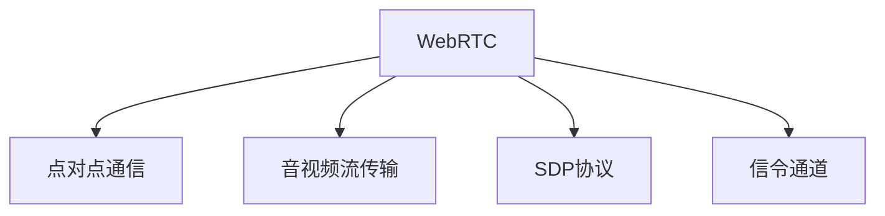

                 

# WebRTC 技术：浏览器中的实时通信

> 关键词：WebRTC, 浏览器实时通信, 音视频流, 点对点通信, 网络质量, 信令通道, SDP, 安全

## 1. 背景介绍

随着互联网的快速发展，实时通信需求日益增多。无论是企业视频会议，还是个人实时聊天，亦或是物联网设备的远程监控，实时通信在现代通信中扮演着越来越重要的角色。然而，传统基于服务器中转的通信方式，面临着高延迟、高带宽消耗等缺点。为解决这些问题，WebRTC应运而生，以其点对点通信和音视频流传输等特性，成为现代实时通信的基石。

### 1.1 WebRTC的诞生背景

WebRTC是IETF（Internet Engineering Task Force）于2011年推出的一项基于HTML5的新型通信技术，旨在实现浏览器间的点对点音视频通信。WebRTC的诞生背景主要源于以下几个方面：

1. **音视频通信需求增长**：随着互联网的普及，音视频通信需求快速增长。传统基于服务器的通信方式在实时性、扩展性等方面难以满足大规模应用的需求。

2. **浏览器的标准化**：HTML5的普及使得WebRTC能够在各种浏览器上运行，无需安装额外插件，提升了用户的使用体验。

3. **音视频流传输技术的进步**：随着音视频编码技术的发展，WebRTC能够高效地实现音视频流的点对点传输，降低了延迟和带宽消耗。

4. **网络技术的成熟**：WebRTC的开发和应用得益于互联网技术的进步，如SDN（软件定义网络）、Wi-Fi、移动网络等。

### 1.2 WebRTC的应用场景

WebRTC的应用场景非常广泛，几乎覆盖了所有需要实时通信的领域：

- **企业视频会议**：提供高效、安全的音视频通信，支持多人同时参与。
- **远程医疗**：实现医生与患者的实时语音视频交流，提升医疗服务的便捷性。
- **在线教育**：提供实时课堂互动，促进教师与学生的沟通。
- **实时聊天**：支持文本、语音、视频的即时通信，增强用户体验。
- **物联网远程监控**：通过音视频流传输，实现对设备的实时监控和管理。

## 2. 核心概念与联系

### 2.1 核心概念概述

WebRTC的核心概念主要包括点对点通信、音视频流传输、SDP协议、信令通道等。

- **点对点通信**：WebRTC通过P2P（Peer-to-Peer）技术，实现浏览器之间的直接通信，无需中间服务器的介入，降低了延迟和带宽消耗。

- **音视频流传输**：WebRTC利用WebRTC编码器，将音视频流进行高效编码和传输，支持多种格式的音视频数据。

- **SDP协议**：Session Description Protocol（会话描述协议）是WebRTC中用于描述音视频流传输的协议，用于交换通信参数。

- **信令通道**：WebRTC通过建立信令通道，实现双方信令的交换，包括视频分辨率、音频编解码器、ICE候选等，确保通信的成功建立。

这些核心概念之间的逻辑关系可以通过以下Mermaid流程图来展示：



这个流程图展示了大语言模型的核心概念及其之间的关系：

1. WebRTC通过点对点通信实现直接通信，降低延迟和带宽消耗。
2. 利用音视频流传输技术，高效传输音视频数据。
3. 使用SDP协议描述音视频流传输参数，确保通信成功建立。
4. 通过信令通道进行双方信令交换，保证通信流畅进行。

## 3. 核心算法原理 & 具体操作步骤

### 3.1 算法原理概述

WebRTC的音视频通信基于点对点通信技术，其核心算法包括：

- **音视频编码**：利用WebRTC编码器，将音视频数据进行高效编码。
- **音视频传输**：通过P2P网络，实现音视频数据的直接传输。
- **网络质量自适应**：通过实时监测网络质量，动态调整音视频参数，确保通信质量。
- **信令处理**：通过SDP协议和ICE协议，建立和维护信令通道，进行通信参数的交换。

### 3.2 算法步骤详解

WebRTC的音视频通信主要包括以下几个关键步骤：

1. **建立WebRTC连接**：
   - 使用JavaScript代码创建RTCPeerConnection对象，初始化通信参数。
   - 调用`setLocalDescription()`方法生成本地SDP描述。
   - 通过`setRemoteDescription()`方法设置远程SDP描述。

2. **交换信令**：
   - 通过`answer()`方法生成远程回答。
   - 使用STUN/TURN服务器进行冰候选（ICE Candidate）交换。

3. **传输音视频流**：
   - 使用`addStream()`方法将音视频流添加到传输通道。
   - 调用`getSender()`方法获取音视频发送器。
   - 调用`setParameters()`方法设置音视频参数。

4. **实时监测网络质量**：
   - 利用`getStats()`方法获取传输统计信息。
   - 通过`onicecandidate`事件获取ICE候选。
   - 通过`onicegatheringstatechange`事件监测ICE候选状态。

5. **关闭WebRTC连接**：
   - 调用`close()`方法关闭传输通道。
   - 调用`oniceconnectionstatechange`事件监测连接状态。

### 3.3 算法优缺点

WebRTC的音视频通信具有以下优点：

- **低延迟**：通过点对点通信，减少了中间服务器的介入，降低了延迟。
- **低带宽消耗**：通过动态调整音视频参数，减少了带宽消耗。
- **灵活性高**：支持多种音视频格式和编解码器，适应不同应用场景。

同时，WebRTC也存在一些局限性：

- **复杂度高**：需要处理大量的信令和网络质量监测，增加了开发难度。
- **安全性差**：WebRTC通信默认使用无加密连接，存在安全风险。
- **兼容性问题**：不同浏览器的WebRTC实现可能存在差异，增加了兼容性问题。

### 3.4 算法应用领域

WebRTC在以下领域得到了广泛应用：

- **企业视频会议**：提供高效、安全的音视频通信，支持多人同时参与。
- **远程医疗**：实现医生与患者的实时语音视频交流，提升医疗服务的便捷性。
- **在线教育**：提供实时课堂互动，促进教师与学生的沟通。
- **实时聊天**：支持文本、语音、视频的即时通信，增强用户体验。
- **物联网远程监控**：通过音视频流传输，实现对设备的实时监控和管理。

## 4. 数学模型和公式 & 详细讲解

### 4.1 数学模型构建

WebRTC的音视频通信主要涉及到以下几个数学模型：

- **音视频编码**：WebRTC使用VP8、VP9等视频编码器和Opus、AAC等音频编码器进行音视频数据的编码。编码模型通常采用压缩比、码率等参数进行描述。
- **音视频传输**：WebRTC使用TCP、UDP等传输协议进行音视频数据的传输。传输模型通常考虑丢包率、延迟等参数。
- **网络质量自适应**：WebRTC使用NACK（Negative Acknowledgment）等机制进行网络质量监测，动态调整音视频参数。

### 4.2 公式推导过程

以下是对WebRTC音视频通信中一些关键公式的推导：

1. **音视频编码率**：设视频数据率为$R_v$，音频数据率为$R_a$，总数据率为$R$，则有：

$$
R = R_v + R_a
$$

2. **音视频丢包率**：设视频丢包率为$P_v$，音频丢包率为$P_a$，则有：

$$
P = P_v + P_a
$$

3. **音视频延迟**：设视频延迟为$D_v$，音频延迟为$D_a$，则有：

$$
D = D_v + D_a
$$

4. **音视频带宽分配**：设总带宽为$B$，则视频带宽分配比例为：

$$
\frac{R_v}{R} = \alpha \cdot (1 - \beta)
$$

5. **网络质量自适应**：设网络质量监测结果为$Q$，音视频参数为$\{R, P, D\}$，则有：

$$
\frac{dR}{dt} = -k_1 \cdot (R - R_{target})
$$

$$
\frac{dP}{dt} = -k_2 \cdot (P - P_{target})
$$

$$
\frac{dD}{dt} = -k_3 \cdot (D - D_{target})
$$

其中，$k_1, k_2, k_3$为自适应参数，$R_{target}, P_{target}, D_{target}$为目标参数值。

### 4.3 案例分析与讲解

以下是一个WebRTC音视频通信的案例分析：

假设某视频会议系统使用WebRTC进行通信，采用VP8视频编码器和Opus音频编码器，总带宽为$B=1Mbps$。设视频和音频的默认带宽分配比例为$\alpha = 0.7$，默认丢包率$P = 0.1$。在某个时刻，系统监测到网络质量变差，音视频丢包率分别变为$P_v = 0.2$和$P_a = 0.1$，音视频延迟分别变为$D_v = 500ms$和$D_a = 100ms$。根据上述公式，计算网络质量自适应后的音视频参数，如下：

1. **音视频编码率**：

$$
R_v = \alpha \cdot B = 0.7 \cdot 1Mbps = 0.7Mbps
$$

$$
R_a = (1 - \alpha) \cdot B = 0.3Mbps
$$

2. **音视频丢包率**：

$$
P = P_v + P_a = 0.2 + 0.1 = 0.3
$$

3. **音视频延迟**：

$$
D = D_v + D_a = 500ms + 100ms = 600ms
$$

4. **音视频带宽分配**：

$$
\frac{R_v}{R} = \alpha = 0.7
$$

5. **网络质量自适应**：

设自适应参数$k_1 = 0.1$，目标参数$R_{target} = 0.7Mbps$，$P_{target} = 0.1$，$D_{target} = 100ms$。

$$
\frac{dR}{dt} = -k_1 \cdot (R - R_{target}) = -0.1 \cdot (R - 0.7)
$$

$$
\frac{dP}{dt} = -k_2 \cdot (P - P_{target}) = -0.1 \cdot (P - 0.1)
$$

$$
\frac{dD}{dt} = -k_3 \cdot (D - D_{target}) = -0.1 \cdot (D - 100)
$$

通过求解微分方程，可以得到自适应后的音视频参数。

## 5. 项目实践：代码实例和详细解释说明

### 5.1 开发环境搭建

在进行WebRTC开发前，需要先搭建开发环境。以下是使用JavaScript进行WebRTC开发的开发环境配置流程：

1. 安装Node.js：从官网下载并安装Node.js，作为开发环境的基础。
2. 安装npm：从官网下载并安装npm，用于管理项目依赖。
3. 安装WebRTC库：使用npm安装WebRTC库，如`simple-peer`、`webrtc-peer`等。
4. 安装WebRTC依赖库：使用npm安装WebRTC依赖库，如`stun`、`stun-js`等。
5. 配置WebSocket服务器：使用WebSocket服务器库，如`socket.io`、`ws`等，用于处理信令和音视频数据。

完成上述步骤后，即可在本地搭建WebRTC开发环境。

### 5.2 源代码详细实现

下面以WebRTC点对点音视频通信为例，给出JavaScript代码实现。

首先，创建RTCPeerConnection对象，生成本地SDP描述：

```javascript
const pc = new RTCPeerConnection();
const localDescription = pc.createOffer();
pc.setLocalDescription(localDescription);
```

然后，设置远程SDP描述，进行信令交换：

```javascript
const remoteDescription = new RTCSessionDescription({ type: 'offer' });
pc.setRemoteDescription(remoteDescription);
pc.answer();
```

接着，处理信令和音视频数据：

```javascript
pc.onicecandidate = function(event) {
  if (event.candidate) {
    peerConnection.setIceCandidate(event.candidate);
  }
};

pc.onicegatheringstatechange = function(event) {
  if (event.iceGatheringState === 'completed') {
    peerConnection.getStats(function(stats) {
      console.log('ICE candidate statistics:', stats);
    });
  }
};
```

最后，传输音视频流：

```javascript
const videoElement = document.getElementById('localVideo');
const stream = await navigator.mediaDevices.getUserMedia({ video: true });
const videoSource = new MediaStreamTrack(stream.getVideoTracks()[0]);
videoElement.srcObject = videoSource;

const audioElement = document.getElementById('localAudio');
const audioSource = new MediaStreamTrack(stream.getAudioTracks()[0]);
audioElement.srcObject = audioSource;

const sender = pc.addTrack(videoSource);
const receiver = pc.addReceiver(new RTCRtpReceiver(videoSource));

const localTrack = videoSource;
const localTrack = audioSource;

const sender = pc.addTrack(localTrack);
const receiver = pc.addReceiver(new RTCRtpReceiver(localTrack));
```

以上代码实现了WebRTC点对点音视频通信的基本功能，包括创建RTCPeerConnection对象、生成本地SDP描述、设置远程SDP描述、处理信令和音视频数据等。

### 5.3 代码解读与分析

让我们再详细解读一下关键代码的实现细节：

**RTCPeerConnection对象**：
- `RTCPeerConnection`对象是WebRTC中用于创建点对点通信连接的核心对象。
- 使用`new RTCPeerConnection()`创建连接对象。
- 调用`createOffer()`方法生成本地SDP描述。

**信令交换**：
- `setLocalDescription()`方法生成本地SDP描述。
- `setRemoteDescription()`方法设置远程SDP描述。
- `answer()`方法生成远程回答。
- `setIceCandidate()`方法设置ICE候选。

**音视频流传输**：
- `addTrack()`方法将音视频流添加到传输通道。
- `getSender()`方法获取音视频发送器。
- `setParameters()`方法设置音视频参数。

**网络质量自适应**：
- `getStats()`方法获取传输统计信息。
- `onicecandidate`事件获取ICE候选。
- `onicegatheringstatechange`事件监测ICE候选状态。

**关闭WebRTC连接**：
- `close()`方法关闭传输通道。
- `oniceconnectionstatechange`事件监测连接状态。

## 6. 实际应用场景

### 6.1 企业视频会议

WebRTC在企业视频会议中的应用非常广泛，通过点对点通信和音视频流传输，可以提供高效、安全的音视频通信，支持多人同时参与。

在技术实现上，可以采用以下步骤：

1. 使用WebRTC库创建RTCPeerConnection对象。
2. 生成本地SDP描述，并设置远程SDP描述。
3. 通过信令通道交换ICE候选，建立连接。
4. 传输音视频流，并进行网络质量自适应。
5. 处理音视频数据，进行会议互动。

### 6.2 远程医疗

WebRTC在远程医疗中的应用可以极大提升医疗服务的便捷性。通过点对点通信，医生可以与患者实时语音视频交流，进行诊断和治疗。

在技术实现上，可以采用以下步骤：

1. 使用WebRTC库创建RTCPeerConnection对象。
2. 生成本地SDP描述，并设置远程SDP描述。
3. 通过信令通道交换ICE候选，建立连接。
4. 传输音视频流，并进行网络质量自适应。
5. 处理音视频数据，进行诊疗互动。

### 6.3 在线教育

WebRTC在在线教育中的应用可以提供实时课堂互动，促进教师与学生的沟通。通过点对点通信，教师可以实时直播授课，并与学生进行实时互动。

在技术实现上，可以采用以下步骤：

1. 使用WebRTC库创建RTCPeerConnection对象。
2. 生成本地SDP描述，并设置远程SDP描述。
3. 通过信令通道交换ICE候选，建立连接。
4. 传输音视频流，并进行网络质量自适应。
5. 处理音视频数据，进行课堂互动。

### 6.4 未来应用展望

随着WebRTC技术的不断进步，未来将在更多领域得到应用，为各行各业带来变革性影响。

1. **智能家居**：通过WebRTC，可以实现家中的智能设备之间的实时通信，实现远程监控和管理。
2. **智能交通**：通过WebRTC，可以实现车辆之间的实时通信，提升交通安全性和效率。
3. **智能医疗**：通过WebRTC，可以实现医生与患者之间的实时通信，提升医疗服务的便捷性和准确性。
4. **智能农业**：通过WebRTC，可以实现农业设备的远程监控和管理，提升农业生产效率。

未来，WebRTC将与其他智能技术进行更深入的融合，为构建更加智能化、普适化的实时通信系统提供更广阔的空间。

## 7. 工具和资源推荐

### 7.1 学习资源推荐

为了帮助开发者系统掌握WebRTC的理论基础和实践技巧，这里推荐一些优质的学习资源：

1. **《WebRTC: Real-Time Web Communication》**：一本详细介绍WebRTC技术的经典书籍，涵盖从基础到高级的各个方面。
2. **WebRTC官方文档**：WebRTC的官方文档，提供了详尽的API文档和示例代码，是学习WebRTC的重要资源。
3. **WebRTC标准文档**：IETF发布的WebRTC标准文档，介绍了WebRTC的核心技术和规范。
4. **WebRTC在线课程**：各大在线教育平台上的WebRTC课程，如Udacity、Coursera等。
5. **WebRTC开发者社区**：WebRTC开发者社区，包括GitHub、Stack Overflow等，可以获取最新的WebRTC开发资源和技术讨论。

通过对这些资源的学习实践，相信你一定能够快速掌握WebRTC的核心技术和应用方法，并用于解决实际的实时通信问题。

### 7.2 开发工具推荐

高效的开发离不开优秀的工具支持。以下是几款用于WebRTC开发的常用工具：

1. **WebRTC库**：如`simple-peer`、`webrtc-peer`等，提供了完整的WebRTC实现，便于快速开发。
2. **WebSocket服务器**：如`socket.io`、`ws`等，用于处理信令和音视频数据。
3. **RTCPeerConnection API**：WebRTC的API库，提供了丰富的音视频处理功能。
4. **ICE服务器**：如`stun`、`stun-js`等，用于处理ICE候选，建立点对点连接。
5. **音视频编解码器**：如VP8、VP9、Opus、AAC等，用于高效编码和解码音视频流。

合理利用这些工具，可以显著提升WebRTC开发效率，加快创新迭代的步伐。

### 7.3 相关论文推荐

WebRTC技术的发展源于学界的持续研究。以下是几篇奠基性的相关论文，推荐阅读：

1. **WebRTC: A Real-Time Communication Protocol for Web Browsers**：IETF发布的WebRTC标准文档，介绍了WebRTC的核心技术和规范。
2. **WebRTC: A Simple API for Real-Time Web Communications**：WebRTC API库的文档，详细介绍了RTCPeerConnection等API的使用方法。
3. **WebRTC: A Web-based Peer-to-Peer Video and Audio Communication System**：WebRTC技术的发起人和主要开发者介绍WebRTC的实现细节和应用场景。
4. **WebRTC: A Web-Based Peer-to-Peer Communication Protocol**：WebRTC技术的研究论文，介绍了WebRTC的核心算法和实现方法。
5. **WebRTC: A Real-Time Communication Protocol for Web Browsers**：WebRTC技术的研究论文，介绍了WebRTC的核心算法和实现方法。

这些论文代表了大语言模型微调技术的发展脉络。通过学习这些前沿成果，可以帮助研究者把握学科前进方向，激发更多的创新灵感。

## 8. 总结：未来发展趋势与挑战

### 8.1 总结

本文对WebRTC技术的音视频通信原理进行了全面系统的介绍。首先阐述了WebRTC的诞生背景和应用场景，明确了其在点对点通信、音视频流传输等方面的优势。其次，从原理到实践，详细讲解了WebRTC的核心算法和操作步骤，给出了WebRTC应用开发的完整代码实例。同时，本文还广泛探讨了WebRTC在企业视频会议、远程医疗、在线教育等多个行业领域的应用前景，展示了WebRTC技术的巨大潜力。最后，本文精选了WebRTC技术的各类学习资源，力求为读者提供全方位的技术指引。

通过本文的系统梳理，可以看到，WebRTC技术在现代实时通信中发挥了重要作用，极大地提升了音视频通信的效率和质量，为各行各业提供了强大的技术支撑。未来，随着WebRTC技术的不断进步，实时通信的应用场景将更加广泛，对社会生产生活的影响也将更加深远。

### 8.2 未来发展趋势

展望未来，WebRTC技术的发展趋势主要体现在以下几个方面：

1. **高清晰音视频传输**：随着网络带宽的提升，WebRTC将支持更高的音视频分辨率和帧率，提供更加清晰、流畅的音视频体验。
2. **跨平台兼容性**：WebRTC将支持更多操作系统和设备平台，实现更加广泛的跨平台应用。
3. **安全性增强**：WebRTC将引入更强大的安全机制，如端到端加密、身份认证等，确保通信安全。
4. **自适应质量控制**：WebRTC将引入更智能的音视频质量控制机制，动态调整传输参数，适应不同的网络环境。
5. **扩展性增强**：WebRTC将支持更复杂的音视频编解码器和传输协议，支持更多的应用场景。

以上趋势凸显了WebRTC技术的广阔前景。这些方向的探索发展，将进一步提升WebRTC系统的性能和应用范围，为实时通信带来新的突破。

### 8.3 面临的挑战

尽管WebRTC技术已经取得了瞩目成就，但在迈向更加智能化、普适化应用的过程中，它仍面临着诸多挑战：

1. **兼容性问题**：不同浏览器的WebRTC实现可能存在差异，增加了兼容性问题。
2. **安全性问题**：WebRTC通信默认使用无加密连接，存在安全风险。
3. **稳定性问题**：WebRTC通信过程中，网络环境变化对音视频传输的稳定性有较大影响。
4. **资源消耗**：WebRTC通信需要占用一定的系统资源，如CPU、内存等，可能会影响系统性能。

这些挑战需要开发者在实际应用中不断迭代和优化，提升WebRTC系统的稳定性和安全性。

### 8.4 研究展望

面对WebRTC技术面临的挑战，未来的研究需要在以下几个方面寻求新的突破：

1. **跨平台兼容性优化**：通过统一的API接口和标准协议，提升WebRTC的跨平台兼容性。
2. **安全性机制增强**：引入更强大的安全机制，如端到端加密、身份认证等，确保通信安全。
3. **稳定性优化**：通过改进网络质量监测和自适应机制，提升WebRTC系统的稳定性。
4. **资源优化**：通过优化音视频编码和传输算法，减少WebRTC的资源消耗，提升系统性能。
5. **新协议和算法研究**：研究新的音视频编解码和传输协议，提升WebRTC的性能和兼容性。

这些研究方向将推动WebRTC技术不断进步，为构建更加智能化、普适化的实时通信系统提供更强大的技术支撑。

## 9. 附录：常见问题与解答

**Q1：WebRTC支持哪些音视频编解码器？**

A: WebRTC支持多种音视频编解码器，如VP8、VP9、Opus、AAC等。不同编解码器有不同的特点和优缺点，需要根据实际应用场景选择合适的编解码器。

**Q2：WebRTC在音视频传输中如何处理网络质量变化？**

A: WebRTC通过实时监测网络质量，动态调整音视频参数，确保通信质量。具体而言，WebRTC利用NACK（Negative Acknowledgment）等机制进行网络质量监测，动态调整音视频参数。

**Q3：WebRTC在实现过程中需要注意哪些问题？**

A: 在WebRTC实现过程中，需要注意以下几点：
1. 网络质量监测和自适应机制
2. 音视频编解码器的选择和优化
3. 信令通道的建立和管理
4. 跨平台兼容性和安全性

**Q4：WebRTC如何处理ICE候选？**

A: WebRTC通过STUN/TURN服务器进行ICE候选交换，建立点对点连接。具体而言，WebRTC利用STUN服务器获取本地网络地址信息，利用TURN服务器进行中继，建立连接。

**Q5：WebRTC的实时性如何保证？**

A: WebRTC通过点对点通信，减少了中间服务器的介入，降低了延迟。同时，WebRTC利用网络质量自适应机制，动态调整音视频参数，确保通信质量。

---

作者：禅与计算机程序设计艺术 / Zen and the Art of Computer Programming

