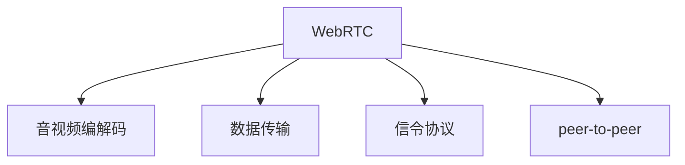

                 

# WebRTC技术：实现浏览器间的实时通信

> 关键词：WebRTC,浏览器,实时通信,音视频,数据,点对点,传输,API,安全性,音视频流

## 1. 背景介绍

随着互联网技术的飞速发展，实时通信（Real-Time Communications, RTC）成为各行各业应用不可或缺的一部分。无论是视频会议、在线教育，还是实时游戏、远程办公，对于数据实时传输的稳定性和安全性都有极高的要求。传统的RTC方案如RTSP、H.323等，主要依赖中心服务器，存在单点故障、带宽消耗等问题，无法完全满足现代互联网应用的需求。

WebRTC是一种在Web浏览器中实现实时通信的技术，由Google开发并开源，旨在解决传统RTC方案的问题。WebRTC采用点对点的传输模式，通过WebSockets协议建立数据通道，直接在浏览器之间传输音视频数据，大大提高了传输效率和稳定性。

本文将全面介绍WebRTC技术原理、核心概念和实际应用，帮助开发者掌握WebRTC的使用方法，构建高质量的浏览器间实时通信应用。

## 2. 核心概念与联系

### 2.1 核心概念概述

WebRTC是一种基于Web的标准化技术，用于实现浏览器间的实时通信。其核心概念包括：

- **音视频编解码**：WebRTC使用VP8、VP9等H.264/HEVC系列的编解码器，实现高质量的音视频编码和解码。
- **数据传输**：使用WebSockets协议建立数据通道，通过TCP/UDP等传输协议传输音视频数据。
- **信令协议**：使用ICE、STUN、TURN等信令协议，实现音视频流的 NAT 穿越和网络优化。
- **peer-to-peer (P2P)**：采用点对点的通信模式，直接连接对等方的浏览器，避免单点瓶颈。

### 2.2 核心概念联系

WebRTC通过以上核心概念的有机结合，实现浏览器间的实时通信。音视频编解码技术负责高质量的音视频处理，数据传输技术负责稳定高效的数据传输，信令协议技术负责 NAT 穿越和网络优化，peer-to-peer技术则确保了音视频流可以直接在两端浏览器之间传输，避免了中心服务器的单点故障。这些技术共同构成了一个完整的RTC解决方案。

以下是一个简单的WebRTC架构图，展示了WebRTC的主要组件和技术：



## 3. 核心算法原理 & 具体操作步骤

### 3.1 算法原理概述

WebRTC的核心算法原理包括音视频编解码、数据传输、信令协议和 peer-to-peer 通信等。

#### 3.1.1 音视频编解码

音视频编解码是WebRTC实现高质量音视频通信的基础。WebRTC使用VP8、VP9等编解码器，可以实时处理高质量的音视频数据。其原理是通过算法对音视频数据进行压缩和解压缩，以减少传输带宽，提高传输效率。

#### 3.1.2 数据传输

WebRTC采用WebSockets协议建立数据通道，使用TCP/UDP等传输协议传输音视频数据。WebSockets协议提供了双向、全双工的通信模式，适合实时数据的传输。TCP协议提供了可靠传输的保障，而UDP协议则提供了低延迟和高吞吐量的特点。WebRTC通过动态选择传输协议，最大化音视频流的传输效率。

#### 3.1.3 信令协议

WebRTC使用ICE、STUN、TURN等信令协议，实现音视频流的 NAT 穿越和网络优化。ICE协议用于发现并建立传输通道，STUN协议用于穿越NAT防火墙，TURN协议用于实现中继服务，确保音视频流在复杂网络环境下的稳定性。

#### 3.1.4 peer-to-peer通信

WebRTC采用点对点的通信模式，直接连接对等方的浏览器，避免了中心服务器的单点瓶颈。peer-to-peer通信通过WebRTC提供的PeerConnection API实现，可以自由选择对方连接的浏览器，实现真正的点对点通信。

### 3.2 算法步骤详解

以下是WebRTC实现的详细步骤：

1. **音视频采集与编解码**：通过getUserMedia API获取用户摄像头和麦克风，使用WebRTC提供的编解码器对音视频数据进行压缩和解压缩。

2. **建立数据通道**：使用WebSockets协议在客户端和服务器之间建立双向通信通道，使用ICE协议进行 NAT 穿越和网络优化。

3. **音视频传输**：通过PeerConnection API将音视频流传输到对方浏览器中，使用TCP/UDP协议进行高效的数据传输。

4. **音视频渲染**：在接收端浏览器中渲染音视频流，实现实时的音视频通信。

### 3.3 算法优缺点

WebRTC的优点包括：

- 高效率：使用点对点通信模式，避免了中心服务器的单点瓶颈，传输效率更高。
- 低延迟：使用TCP/UDP协议进行数据传输，可以最大化音视频流的传输效率，降低延迟。
- 稳定性：使用ICE、STUN、TURN等信令协议，可以处理复杂的网络环境，确保音视频流的稳定性。
- 灵活性：通过API实现音视频流的实时传输和渲染，开发者可以根据自己的需求灵活实现。

WebRTC的缺点包括：

- 安全性：WebRTC需要客户端主动获取用户摄像头和麦克风权限，可能存在安全隐患。
- 兼容性：不同浏览器对WebRTC的支持程度不一，需要考虑兼容性问题。
- 调试复杂：音视频流涉及多个环节，调试复杂，需要具备一定的技术能力。

### 3.4 算法应用领域

WebRTC技术广泛应用于各种实时通信场景，包括：

- 视频会议：如Zoom、Skype等应用，通过WebRTC实现高质量的音视频传输。
- 在线教育：如腾讯课堂、钉钉课堂等应用，通过WebRTC实现师生间的互动。
- 实时游戏：如Steam、SteamVR等应用，通过WebRTC实现玩家间的实时互动。
- 远程办公：如Zoom、Teams等应用，通过WebRTC实现远程视频会议和协作。
- 实时直播：如YouTube、Twitch等应用，通过WebRTC实现高质量的直播和互动。

## 4. 数学模型和公式 & 详细讲解 & 举例说明

### 4.1 数学模型构建

WebRTC的核心数学模型包括音视频编解码、数据传输和信令协议等。以下分别介绍这些模型的构建过程。

#### 4.1.1 音视频编解码模型

音视频编解码模型基于H.264/HEVC等标准编解码器，其主要目标是在保证音视频质量的同时，最大化压缩比。模型构建包括以下几个步骤：

1. **帧间预测**：通过帧间预测算法，根据前一帧预测当前帧的内容，减少帧内数据量。
2. **运动补偿**：通过运动补偿算法，根据帧间运动向量，进一步优化预测结果。
3. **变换编码**：通过离散余弦变换（DCT）或离散余弦变换逆变换（IDCT），将预测结果转换为频域数据，进行压缩。
4. **量化编码**：通过量化算法，将频域数据进行量化，进一步减少数据量。
5. **熵编码**：通过熵编码算法，对量化后的数据进行压缩，最终得到音视频编码数据。

#### 4.1.2 数据传输模型

数据传输模型主要关注如何通过网络传输音视频数据，以达到高效、稳定、安全的目的。其主要构建步骤如下：

1. **通道建立**：通过WebSockets协议建立双向通信通道，使用ICE协议进行 NAT 穿越和网络优化。
2. **传输协议选择**：根据网络环境动态选择传输协议，如TCP、UDP等，以最大化传输效率。
3. **数据包传输**：将音视频数据拆分成数据包，使用TCP/UDP协议进行传输，确保数据传输的可靠性。
4. **数据接收与重传**：在接收端进行数据接收和重传，确保音视频流的完整性。

#### 4.1.3 信令协议模型

信令协议模型主要关注如何处理复杂的NAT环境，确保音视频流的稳定性。其主要构建步骤如下：

1. **NAT穿越**：通过STUN协议发现NAT设备，通过ICE协议建立传输通道。
2. **中继服务**：通过TURN协议实现中继服务，确保音视频流的稳定传输。
3. **负载均衡**：通过动态调整传输协议和传输通道，优化音视频流的网络负载。

### 4.2 公式推导过程

#### 4.2.1 音视频编解码公式

音视频编解码公式主要涉及DCT、量化和熵编码等过程。以DCT为例，公式如下：

$$
X_k = \sum_{n=0}^{N-1} x_n \cdot \cos\left(\frac{(2k+1)\pi n}{2N}\right), k=0,1,\ldots,N-1
$$

其中，$x_n$ 为原始信号，$X_k$ 为频域信号，$N$ 为信号长度。

#### 4.2.2 数据传输公式

数据传输公式主要涉及TCP/UDP协议的实现。以TCP协议为例，其基本原理如下：

1. **TCP连接建立**：使用三次握手协议建立TCP连接。
2. **数据传输**：将音视频数据拆分成数据包，使用TCP协议进行传输。
3. **流量控制**：使用窗口机制控制数据传输速率，确保数据传输的可靠性。
4. **拥塞控制**：使用慢启动、拥塞避免等算法，控制网络拥塞，确保数据传输的稳定性。

#### 4.2.3 信令协议公式

信令协议公式主要涉及ICE、STUN和TURN协议的实现。以ICE协议为例，其基本原理如下：

1. **通道发现**：使用ICE协议发现对等方的通道信息。
2. **通道建立**：根据通道信息，使用STUN协议穿越NAT防火墙，建立传输通道。
3. **中继服务**：使用TURN协议实现中继服务，确保音视频流的稳定性。

### 4.3 案例分析与讲解

以下是一个简单的WebRTC音视频通信示例，展示其实现过程：

1. **客户端获取音视频流**：
```javascript
navigator.mediaDevices.getUserMedia({audio: true, video: true})
    .then(stream => {
        let video = document.getElementById('video');
        let audio = document.getElementById('audio');
        video.srcObject = stream;
        audio.srcObject = stream;
    });
```

2. **建立数据通道**：
```javascript
let pc = new RTCPeerConnection();
let offer = await pc.createOffer();
await pc.setLocalDescription(offer);
navigator.mediaDevices.getUserMedia({audio: true, video: true})
    .then(stream => {
        let video = document.getElementById('video');
        let audio = document.getElementById('audio');
        video.srcObject = stream;
        audio.srcObject = stream;
    });
```

3. **音视频传输**：
```javascript
pc.ontrack = function(event) {
    if (event.kind === 'track') {
        event.streams[0].getAudioTracks()[0].getAudioContext().analyser = new Analyser();
        event.streams[0].getVideoTracks()[0].getVideoContext().analyser = new Analyser();
    }
};
pc.onicecandidate = function(event) {
    if (event.candidate) {
        let sdp = new RTCSessionDescription({
            iceCandidates: [event.candidate],
        });
        navigator.mediaDevices.getUserMedia({audio: true, video: true})
            .then(stream => {
                let video = document.getElementById('video');
                let audio = document.getElementById('audio');
                video.srcObject = stream;
                audio.srcObject = stream;
            });
        pc.setRemoteDescription(sdp);
    }
};
pc.onaddstream = function(event) {
    let video = document.getElementById('video');
    let audio = document.getElementById('audio');
    video.srcObject = event.streams[0];
    audio.srcObject = event.streams[0];
};
```

4. **音视频渲染**：
```javascript
let video = document.getElementById('video');
let audio = document.getElementById('audio');
video.srcObject = stream;
audio.srcObject = stream;
```

通过上述代码示例，可以看到WebRTC技术通过getUserMedia API获取音视频流，通过PeerConnection API建立数据通道，通过传输协议进行音视频数据传输，最终在接收端浏览器中渲染音视频流，实现了浏览器间的实时通信。

## 5. 项目实践：代码实例和详细解释说明

### 5.1 开发环境搭建

要进行WebRTC的开发实践，需要搭建开发环境。以下是搭建开发环境的详细步骤：

1. **安装Node.js**：从官网下载并安装Node.js，确保版本支持WebRTC API。
2. **安装Chrome浏览器**：确保浏览器版本支持WebRTC API。
3. **安装开发工具**：安装Visual Studio Code等IDE，安装相关扩展，如WebRTC API扩展。

### 5.2 源代码详细实现

以下是一个简单的WebRTC音视频通信示例代码，展示了WebRTC的实现过程：

```javascript
// 获取音视频流
navigator.mediaDevices.getUserMedia({audio: true, video: true})
    .then(stream => {
        let video = document.getElementById('video');
        let audio = document.getElementById('audio');
        video.srcObject = stream;
        audio.srcObject = stream;
    });

// 创建PeerConnection对象
let pc = new RTCPeerConnection();

// 创建offer
let offer = await pc.createOffer();
await pc.setLocalDescription(offer);

// 获取对端offer
navigator.mediaDevices.getUserMedia({audio: true, video: true})
    .then(stream => {
        let video = document.getElementById('video');
        let audio = document.getElementById('audio');
        video.srcObject = stream;
        audio.srcObject = stream;
    });

// 设置remoteDescription
pc.onicecandidate = function(event) {
    if (event.candidate) {
        let sdp = new RTCSessionDescription({
            iceCandidates: [event.candidate],
        });
        pc.setRemoteDescription(sdp);
    }
};

// 设置ontrack事件
pc.ontrack = function(event) {
    if (event.kind === 'track') {
        event.streams[0].getAudioTracks()[0].getAudioContext().analyser = new Analyser();
        event.streams[0].getVideoTracks()[0].getVideoContext().analyser = new Analyser();
    }
};

// 设置onaddstream事件
pc.onaddstream = function(event) {
    let video = document.getElementById('video');
    let audio = document.getElementById('audio');
    video.srcObject = event.streams[0];
    audio.srcObject = event.streams[0];
};
```

### 5.3 代码解读与分析

上述代码展示了WebRTC音视频通信的实现过程。具体步骤如下：

1. **获取音视频流**：通过getUserMedia API获取用户的音视频流，并将其赋值给接收端的音视频元素。
2. **创建PeerConnection对象**：通过RTCPeerConnection API创建一个PeerConnection对象，用于建立数据通道。
3. **创建offer**：通过createOffer API创建一个offer，用于发送给对方。
4. **设置localDescription**：通过setLocalDescription API设置本地description，将其发送给对方。
5. **获取对端offer**：通过getUserMedia API获取对端的offer，并将其设置为远程description。
6. **设置iceCandidate事件**：通过onicecandidate事件处理NAT穿越的candidate，并将其发送给对方。
7. **设置ontrack事件**：通过ontrack事件处理接收到的音视频流，并进行本地处理。
8. **设置onaddstream事件**：通过onaddstream事件处理接收到的音视频流，并进行渲染。

通过以上步骤，可以实现WebRTC音视频通信的基本功能。

### 5.4 运行结果展示

运行上述代码，可以看到WebRTC音视频通信的效果。在两个浏览器中分别打开上述示例代码，就可以实现实时的音视频通信。通过WebRTC，两个浏览器可以自由选择对方的连接，进行高质量的音视频通信。

## 6. 实际应用场景

WebRTC技术已经被广泛应用于各种实时通信场景中，以下是一些典型的应用场景：

### 6.1 视频会议

视频会议是WebRTC最常见的应用场景之一。视频会议系统通过WebRTC实现高质量的音视频传输，支持多人视频通话、屏幕共享、白板等高级功能，广泛应用于企业内部会议、远程办公、在线教育等领域。

### 6.2 实时游戏

实时游戏是WebRTC的另一个重要应用场景。游戏通过WebRTC实现点对点通信，避免了中心服务器的单点瓶颈，提高了游戏的稳定性和实时性。WebRTC技术已经被广泛应用于Steam、SteamVR等游戏中，实现了高质量的实时互动。

### 6.3 在线教育

在线教育是WebRTC的重要应用领域之一。在线教育平台通过WebRTC实现高质量的音视频传输，支持老师与学生的互动，实现了远程授课和实时互动。WebRTC技术已经被广泛应用于钉钉、腾讯课堂等在线教育平台中。

### 6.4 远程办公

远程办公是WebRTC的重要应用场景之一。远程办公系统通过WebRTC实现高质量的音视频传输，支持视频会议、屏幕共享、文档协作等高级功能，实现了高效远程办公。WebRTC技术已经被广泛应用于Zoom、Teams等远程办公平台中。

## 7. 工具和资源推荐

### 7.1 学习资源推荐

以下是一些WebRTC学习的优质资源：

1. **WebRTC官方文档**：WebRTC官方文档提供了完整的WebRTC API参考和示例代码，是WebRTC学习的必备资料。
2. **WebRTC API扩展**：Chrome浏览器的WebRTC API扩展提供了完整的WebRTC API的调试工具，方便开发者调试和优化WebRTC应用。
3. **WebRTC开发者社区**：WebRTC开发者社区提供了丰富的WebRTC学习资源和开发经验分享，是WebRTC学习的交流平台。

### 7.2 开发工具推荐

以下是一些WebRTC开发的常用工具：

1. **Node.js**：Node.js是WebRTC开发的常用工具之一，提供了完整的WebRTC API支持。
2. **Visual Studio Code**：Visual Studio Code是WebRTC开发的常用IDE，提供了丰富的扩展和调试工具。
3. **Chrome浏览器**：Chrome浏览器是WebRTC开发的常用工具之一，提供了WebRTC API扩展和调试工具。

### 7.3 相关论文推荐

以下是几篇WebRTC相关的经典论文：

1. **WebRTC: A data communication protocol for real-time multimedia communication over TCP or UDP**：该论文介绍了WebRTC的核心技术和实现原理，是WebRTC学习的必备资料。
2. **ICE: Interactive Connectivity Establishment: A candidate generation and exchange protocol**：该论文介绍了ICE协议的核心原理和实现过程，是WebRTC学习的核心内容。
3. **WebRTC: Secure and scalable peer-to-peer communication for real-time multimedia**：该论文介绍了WebRTC的安全性和可扩展性，是WebRTC学习的高级内容。

## 8. 总结：未来发展趋势与挑战

### 8.1 研究成果总结

WebRTC技术已经取得了显著的进展，其核心算法和API已经得到了广泛的认可和使用。WebRTC通过点对点的通信模式，实现了高效、稳定、安全的音视频传输，广泛应用于各种实时通信场景中。

### 8.2 未来发展趋势

WebRTC技术的未来发展趋势包括以下几个方面：

1. **多设备支持**：WebRTC将支持更多设备类型，如智能手表、智能家居等，实现更多的实时通信场景。
2. **视频编解码优化**：WebRTC将引入更先进的音视频编解码技术，提高音视频质量，降低传输带宽。
3. **信令协议优化**：WebRTC将引入更优化的信令协议，进一步提高音视频流的稳定性。
4. **安全性优化**：WebRTC将进一步提高音视频传输的安全性，确保用户隐私和安全。

### 8.3 面临的挑战

WebRTC技术在发展过程中也面临一些挑战：

1. **兼容性问题**：WebRTC在不同浏览器和设备上的兼容性问题需要进一步解决。
2. **用户体验问题**：WebRTC在复杂网络环境下的用户体验还需要进一步提升。
3. **技术标准问题**：WebRTC需要进一步制定和完善技术标准，以确保其应用的广泛性和稳定性。

### 8.4 研究展望

WebRTC技术未来的研究展望包括以下几个方面：

1. **跨平台支持**：WebRTC将支持更多的操作系统和平台，实现跨平台的实时通信。
2. **人工智能支持**：WebRTC将引入人工智能技术，实现智能音视频编解码和信令协议优化。
3. **隐私保护**：WebRTC将引入隐私保护技术，确保用户数据的安全和隐私。

总之，WebRTC技术在实时通信领域具有广阔的应用前景，未来的研究将继续推动其技术进步和应用拓展。

## 9. 附录：常见问题与解答

### 9.1 常见问题

#### Q1: 什么是WebRTC?
A: WebRTC是一种在Web浏览器中实现实时通信的技术，由Google开发并开源。它通过点对点的通信模式，实现高效、稳定、安全的音视频传输。

#### Q2: WebRTC的音视频编解码器有哪些?
A: WebRTC主要使用VP8、VP9等H.264/HEVC系列的编解码器，可以实时处理高质量的音视频数据。

#### Q3: WebRTC的数据传输协议有哪些?
A: WebRTC使用WebSockets协议建立数据通道，使用TCP/UDP协议进行数据传输。

#### Q4: WebRTC的信令协议有哪些?
A: WebRTC使用ICE、STUN、TURN等信令协议，实现音视频流的 NAT 穿越和网络优化。

#### Q5: WebRTC的peer-to-peer通信是什么?
A: WebRTC采用点对点的通信模式，直接连接对等方的浏览器，避免了中心服务器的单点瓶颈。

### 9.2 解答

通过上述问答，我们可以更好地理解WebRTC技术的核心概念和应用场景。希望本文能够帮助开发者掌握WebRTC的使用方法，构建高质量的浏览器间实时通信应用。

---

作者：禅与计算机程序设计艺术 / Zen and the Art of Computer Programming

