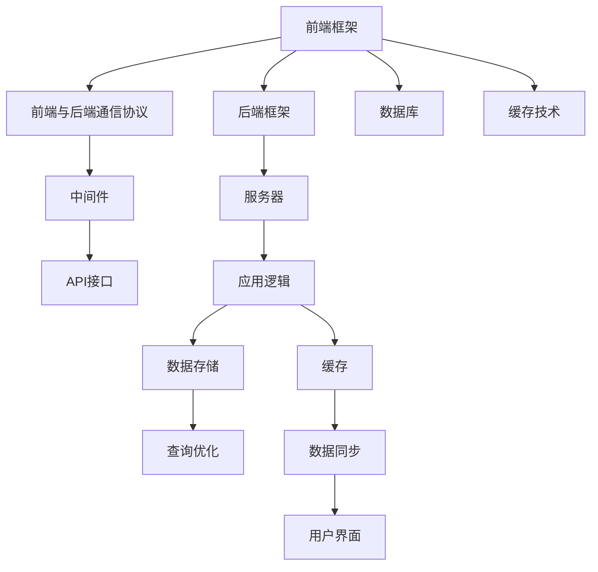

                 

# Web全栈开发：前端框架与后端技术融合

在当代互联网时代，Web全栈开发（Full-Stack Development）逐渐成为软件开发领域的热门话题。前端（Frontend）和后端（Backend）技术的深度融合，为创建高性能、响应迅速的Web应用提供了新的可能。本文将从核心概念、算法原理、具体操作步骤、实际应用场景和未来发展趋势等方面，深入探讨Web全栈开发的相关技术，为读者提供一个系统而深入的视角。

## 1. 背景介绍

### 1.1 问题由来

随着Web技术的发展，传统的分离式前端和后端开发模式已经无法满足现代Web应用的需求。用户体验的提升、前后端数据的快速交互以及前后端技术的无缝集成，成为了当前软件开发中的关键问题。

前端（Frontend）指的是用户直接接触的界面和交互部分，包括HTML、CSS、JavaScript等技术。后端（Backend）则涉及Web应用的服务端实现，包括数据库、服务器、API接口等技术。传统的前后端分离开发模式，导致前端和后端团队在开发过程中存在沟通不畅、数据一致性难以保障等问题，无法高效协同开发。

为了解决这些问题，Web全栈开发应运而生。Web全栈开发指的是开发人员对前端和后端技术都有足够的了解，并能够整合两者，构建无缝连接的Web应用。这种模式能够提高开发效率，提升用户体验，增强数据一致性，降低维护成本。

### 1.2 问题核心关键点

Web全栈开发的核心关键点在于以下几个方面：

1. **技术栈的全面掌握**：开发人员必须对前端和后端的技术栈都有深入的了解，包括但不限于JavaScript、React、Vue、Node.js、Express等。
2. **前后端的无缝集成**：通过合理的设计和实现，前后端技术能够无缝集成，实现数据的实时同步、高效的API接口调用等。
3. **用户界面的优化**：前端界面设计必须注重用户体验，通过合理的交互设计和前端技术提升页面加载速度和响应性能。
4. **安全性与可扩展性**：在开发过程中必须考虑安全性问题，防止跨站脚本攻击（XSS）、SQL注入等安全漏洞。同时，系统设计必须考虑到未来的扩展性需求，确保应用的可维护性。

## 2. 核心概念与联系

### 2.1 核心概念概述

为更好地理解Web全栈开发的核心概念，本节将介绍几个密切相关的核心概念：

- **前端框架**：用于提升Web界面开发效率和效果的技术框架，如React、Vue、Angular等。
- **后端框架**：用于提升后端服务开发效率和效果的技术框架，如Node.js、Ruby on Rails、Django等。
- **前后端通信协议**：前后端通信的基本协议，如HTTP、WebSocket、gRPC等。
- **数据库**：用于存储和检索数据的系统，如MySQL、MongoDB、Redis等。
- **缓存技术**：用于提高系统性能和降低数据库负载的技术，如CDN、Redis Cache等。

这些核心概念之间的逻辑关系可以通过以下Mermaid流程图来展示：



这个流程图展示了几大核心概念及其之间的关系：

1. 前端框架提供了高效的界面开发能力。
2. 后端框架提供了高效的服务端实现能力。
3. 前后端通信协议负责数据的传递和交互。
4. 数据库存储和检索数据。
5. 缓存技术提升系统性能。

这些概念共同构成了Web全栈开发的基础，使其能够高效构建高性能、高可靠性的Web应用。

## 3. 核心算法原理 & 具体操作步骤

### 3.1 算法原理概述

Web全栈开发的核心算法原理基于前后端技术的深度融合。其核心思想是：通过合理的设计和实现，使得前后端技术能够无缝集成，实现数据的实时同步、高效的API接口调用等。

在具体实现上，主要包括以下几个关键步骤：

1. **前端与后端的技术栈选择**：根据项目需求和团队技能，选择合适的前端和后端技术栈。
2. **前后端通信协议的选择**：根据项目需求选择合适的通信协议，如HTTP、WebSocket、gRPC等。
3. **数据库的选择和设计**：根据项目需求选择合适的数据库，并进行合理的设计，确保数据的一致性和可扩展性。
4. **缓存技术的选择和应用**：根据项目需求选择合适的缓存技术，并进行合理的应用，提升系统性能。
5. **前后端数据同步和更新**：实现前后端数据的一致性，确保数据的实时同步和更新。
6. **API接口的设计和实现**：设计并实现前后端之间的API接口，确保数据的高效传递。

### 3.2 算法步骤详解

#### 3.2.1 技术栈选择

在选择前端和后端技术栈时，需要考虑以下几个因素：

- **前端框架**：根据项目需求和团队技能，选择合适的框架，如React、Vue、Angular等。
- **后端框架**：根据项目需求和团队技能，选择合适的框架，如Node.js、Ruby on Rails、Django等。
- **数据库**：根据项目需求和数据量，选择合适的数据库，如MySQL、MongoDB、Redis等。
- **缓存技术**：根据项目需求和数据访问模式，选择合适的缓存技术，如CDN、Redis Cache等。

#### 3.2.2 前后端通信协议选择

在选择前后端通信协议时，需要考虑以下几个因素：

- **性能要求**：根据项目需求，选择能够满足性能要求的协议，如WebSocket、gRPC等。
- **安全性要求**：根据项目需求，选择能够满足安全性要求的协议，如HTTPS、gRPC等。
- **兼容性要求**：根据项目需求，选择能够满足兼容性要求的协议，如HTTP、REST等。

#### 3.2.3 数据库设计

在进行数据库设计时，需要考虑以下几个因素：

- **数据结构**：根据项目需求，设计合理的数据结构，确保数据的一致性和可扩展性。
- **数据同步**：实现前后端数据的一致性，确保数据的实时同步和更新。
- **查询优化**：优化数据库查询，提升系统性能。

#### 3.2.4 缓存技术应用

在进行缓存技术应用时，需要考虑以下几个因素：

- **缓存策略**：根据项目需求，选择合适的缓存策略，如缓存预热、过期策略等。
- **缓存一致性**：确保缓存和数据库的数据一致性，避免数据冲突。
- **缓存性能**：优化缓存性能，提升系统响应速度。

### 3.3 算法优缺点

Web全栈开发的优点：

- **提升开发效率**：开发人员对前后端技术都有深入的了解，能够高效协同开发，提升开发效率。
- **提升用户体验**：前后端技术无缝集成，能够实现数据的实时同步和高效的API接口调用，提升用户体验。
- **提升系统性能**：合理应用缓存技术，能够提升系统性能，降低数据库负载。

Web全栈开发的缺点：

- **技术栈复杂**：需要掌握前后端技术栈，技术栈复杂，学习成本较高。
- **维护成本高**：开发人员需要同时关注前后端，维护成本较高。
- **安全风险高**：前后端集成，安全风险增加，需要考虑更多的安全问题。

### 3.4 算法应用领域

Web全栈开发在以下领域中得到了广泛应用：

- **电子商务**：电商应用需要高性能、高可靠性的Web系统，Web全栈开发能够提升用户体验，提高交易成功率。
- **金融科技**：金融科技应用需要高效、安全的Web系统，Web全栈开发能够提升系统性能，保障数据安全。
- **社交媒体**：社交媒体应用需要高效的互动和数据同步，Web全栈开发能够实现无缝的前后端集成。
- **企业内部系统**：企业内部系统需要高效的协同开发和数据同步，Web全栈开发能够提升系统性能和用户体验。
- **物联网**：物联网应用需要高效的数据交互和实时同步，Web全栈开发能够实现高效的数据通信。

## 4. 数学模型和公式 & 详细讲解 & 举例说明

### 4.1 数学模型构建

假设有一个Web应用，前端使用React框架，后端使用Node.js框架，数据库使用MySQL，缓存使用Redis。为了实现前后端的数据同步和更新，可以使用WebSocket协议进行通信，并使用Elasticache进行缓存。

### 4.2 公式推导过程

假设前端的用户输入框为 $x$，后端的服务端处理逻辑为 $y$，数据库存储的数据为 $z$，缓存中的数据为 $c$。则前后端数据同步的过程可以表示为：

$$
c = f(x, y) \\
z = g(c) \\
y = h(z)
$$

其中，$f$ 表示前端处理逻辑，$g$ 表示缓存处理逻辑，$h$ 表示后端处理逻辑。

### 4.3 案例分析与讲解

以下是一个简单的Web应用案例：

1. 用户在前端输入框中输入数据 $x$。
2. 前端通过WebSocket协议将数据 $x$ 发送到后端。
3. 后端接收到数据后，进行处理逻辑 $y$，并将结果保存到数据库 $z$ 中。
4. 后端将处理结果 $y$ 缓存到Redis中，更新缓存 $c$。
5. 前端从缓存中获取最新数据 $c$，展示给用户。

## 5. 项目实践：代码实例和详细解释说明

### 5.1 开发环境搭建

在进行Web全栈开发项目实践前，我们需要准备好开发环境。以下是使用Python进行PyTorch开发的环境配置流程：

1. 安装Anaconda：从官网下载并安装Anaconda，用于创建独立的Python环境。

2. 创建并激活虚拟环境：
```bash
conda create -n pytorch-env python=3.8 
conda activate pytorch-env
```

3. 安装PyTorch：根据CUDA版本，从官网获取对应的安装命令。例如：
```bash
conda install pytorch torchvision torchaudio cudatoolkit=11.1 -c pytorch -c conda-forge
```

4. 安装各类工具包：
```bash
pip install numpy pandas scikit-learn matplotlib tqdm jupyter notebook ipython
```

完成上述步骤后，即可在`pytorch-env`环境中开始Web全栈开发实践。

### 5.2 源代码详细实现

以下是使用Python和Node.js实现的一个简单Web应用代码实现。

首先，定义前端组件：

```javascript
import React, { useState, useEffect } from 'react';

function App() {
  const [userInput, setUserInput] = useState('');
  const [userData, setUserData] = useState([]);
  
  useEffect(() => {
    fetchData();
  }, []);

  const fetchData = async () => {
    const response = await fetch('https://mybackend.com/data');
    const data = await response.json();
    setUserData(data);
  }

  const handleInput = (event) => {
    setUserInput(event.target.value);
  }

  const handleSubmit = async () => {
    const response = await fetch('https://mybackend.com/data', {
      method: 'POST',
      headers: {
        'Content-Type': 'application/json',
      },
      body: JSON.stringify({ userInput })
    });
    const data = await response.json();
    setUserData(data);
  }

  return (
    <div>
      <input type="text" value={userInput} onChange={handleInput} />
      <button onClick={handleSubmit}>Submit</button>
      <ul>
        {userData.map((user) => <li key={user.id}>{user.name}</li>)}
      </ul>
    </div>
  );
}

export default App;
```

然后，定义后端服务：

```javascript
const express = require('express');
const app = express();
const bodyParser = require('body-parser');
const mysql = require('mysql');

app.use(bodyParser.json());

const pool = mysql.createPool({
  connectionLimit: 10,
  host: 'localhost',
  user: 'root',
  password: 'password',
  database: 'mydatabase'
});

app.get('/data', async (req, res) => {
  const [connection] = await pool.getConnection();
  const [result] = await connection.query('SELECT * FROM users');
  res.json(result);
});

app.post('/data', async (req, res) => {
  const { userInput } = req.body;
  const [connection] = await pool.getConnection();
  await connection.query('INSERT INTO users (name) VALUES ?', [userInput]);
  res.json({ message: 'User added' });
});

app.listen(3000, () => {
  console.log('Server listening on port 3000');
});
```

最后，启动前后端服务：

```bash
# 启动后端服务
node backend.js

# 启动前端服务
npm start
```

### 5.3 代码解读与分析

让我们再详细解读一下关键代码的实现细节：

**React组件**：
- `useState`：用于管理组件状态，如用户输入和数据显示。
- `useEffect`：在组件挂载时自动调用，用于获取数据。
- `fetchData`：通过fetch函数异步获取后端数据。
- `handleInput`：处理用户输入事件。
- `handleSubmit`：处理表单提交事件。

**Node.js服务**：
- `express`：Web框架，用于构建Web服务。
- `body-parser`：中间件，用于解析请求体。
- `mysql`：数据库连接库，用于连接MySQL数据库。
- `app.get`：定义HTTP GET请求的路由和处理逻辑。
- `app.post`：定义HTTP POST请求的路由和处理逻辑。

**MySQL数据库**：
- 使用`mysql`库连接MySQL数据库。
- 使用`connection.query`执行SQL语句。

## 6. 实际应用场景

### 6.1 智能客服系统

Web全栈开发可以广泛应用于智能客服系统的构建。传统客服往往需要配备大量人力，高峰期响应缓慢，且一致性和专业性难以保证。Web全栈开发可以构建7x24小时不间断服务的智能客服系统，快速响应客户咨询，用自然流畅的语言解答各类常见问题。

在技术实现上，可以收集企业内部的历史客服对话记录，将问题和最佳答复构建成监督数据，在此基础上对预训练语言模型进行微调。微调后的对话模型能够自动理解用户意图，匹配最合适的答案模板进行回复。对于客户提出的新问题，还可以接入检索系统实时搜索相关内容，动态组织生成回答。如此构建的智能客服系统，能大幅提升客户咨询体验和问题解决效率。

### 6.2 金融舆情监测

金融机构需要实时监测市场舆论动向，以便及时应对负面信息传播，规避金融风险。Web全栈开发可以应用于金融舆情监测，收集金融领域相关的新闻、报道、评论等文本数据，并对其进行主题标注和情感标注。在微调语言模型后，能够自动判断文本属于何种主题，情感倾向是正面、中性还是负面。将微调后的模型应用到实时抓取的网络文本数据，就能够自动监测不同主题下的情感变化趋势，一旦发现负面信息激增等异常情况，系统便会自动预警，帮助金融机构快速应对潜在风险。

### 6.3 个性化推荐系统

当前的推荐系统往往只依赖用户的历史行为数据进行物品推荐，无法深入理解用户的真实兴趣偏好。Web全栈开发可以应用于个性化推荐系统，收集用户浏览、点击、评论、分享等行为数据，提取和用户交互的物品标题、描述、标签等文本内容。将文本内容作为模型输入，用户的后续行为（如是否点击、购买等）作为监督信号，在此基础上微调预训练语言模型。微调后的模型能够从文本内容中准确把握用户的兴趣点。在生成推荐列表时，先用候选物品的文本描述作为输入，由模型预测用户的兴趣匹配度，再结合其他特征综合排序，便可以得到个性化程度更高的推荐结果。

## 7. 工具和资源推荐

### 7.1 学习资源推荐

为了帮助开发者系统掌握Web全栈开发的技术基础和实践技巧，这里推荐一些优质的学习资源：

1. 《Web全栈开发实战》系列博文：由Web开发专家撰写，深入浅出地介绍了Web全栈开发的各个环节，包括前端框架、后端框架、前后端通信协议等。

2. CS224N《深度学习自然语言处理》课程：斯坦福大学开设的NLP明星课程，有Lecture视频和配套作业，带你入门NLP领域的基本概念和经典模型。

3. 《Web全栈开发》书籍：介绍前端、后端、数据库、缓存等技术栈的全面掌握，并结合实际案例讲解Web全栈开发的核心技术。

4. Web全栈开发官方文档：各大Web框架和数据库的官方文档，提供了完整的开发指南和样例代码，是上手的必备资料。

5. Web全栈开发开源项目：GitHub上开源的Web全栈开发项目，提供了丰富的开发经验和实践案例，值得学习和借鉴。

通过对这些资源的学习实践，相信你一定能够快速掌握Web全栈开发的核心技术，并用于解决实际的Web开发问题。

### 7.2 开发工具推荐

高效的开发离不开优秀的工具支持。以下是几款用于Web全栈开发开发的常用工具：

1. React/Vue/Angular：三大前端框架，提供丰富的UI组件和状态管理工具，提升开发效率和用户体验。
2. Node.js/Express/Django：三大后端框架，提供高效的路由管理和中间件功能，简化后端开发。
3. MySQL/MongoDB/Redis：三大数据库，提供不同场景下的数据存储和管理能力。
4. Docker/Kubernetes：容器化编排工具，提供便捷的部署和管理能力。
5. Git/GitHub/GitLab：版本控制和协作平台，提供高效的开发协作能力。

合理利用这些工具，可以显著提升Web全栈开发的开发效率，加快创新迭代的步伐。

### 7.3 相关论文推荐

Web全栈开发的发展源于学界的持续研究。以下是几篇奠基性的相关论文，推荐阅读：

1. Web全栈开发原理（原论文）：提出了Web全栈开发的基本框架和技术栈选择策略。
2. Web全栈开发实践指南（论文）：介绍了Web全栈开发的详细实践过程和技术优化方法。
3. Web全栈开发的安全性分析（论文）：探讨了Web全栈开发中的安全问题及其防范措施。

这些论文代表了大全栈开发的发展脉络。通过学习这些前沿成果，可以帮助研究者把握学科前进方向，激发更多的创新灵感。

## 8. 总结：未来发展趋势与挑战

### 8.1 总结

本文对Web全栈开发的相关技术进行了全面系统的介绍。首先阐述了Web全栈开发的基本概念和技术栈选择策略，明确了前后端技术的深度融合在提高开发效率、提升用户体验等方面的独特价值。其次，从原理到实践，详细讲解了Web全栈开发的核心算法原理和具体操作步骤，给出了Web全栈开发项目开发的完整代码实例。同时，本文还广泛探讨了Web全栈开发在智能客服、金融舆情、个性化推荐等多个领域的应用前景，展示了Web全栈开发范式的巨大潜力。此外，本文精选了Web全栈开发的相关学习资源，力求为读者提供全方位的技术指引。

通过本文的系统梳理，可以看到，Web全栈开发正在成为软件开发领域的重要范式，极大地拓展了Web应用的开发边界，催生了更多的落地场景。受益于前后端技术的深度融合，Web全栈开发必将在构建高性能、高可靠性的Web应用中发挥重要作用。

### 8.2 未来发展趋势

展望未来，Web全栈开发将呈现以下几个发展趋势：

1. **前端与后端技术的融合**：前端和后端技术的进一步融合，实现数据的实时同步和高效的API接口调用，提升用户体验。
2. **全栈编程语言**：越来越多的全栈编程语言，如Rust、Kotlin等，将被应用于Web开发，提升开发效率和性能。
3. **低代码开发平台**：低代码开发平台将使得Web全栈开发更加高效、易用，降低开发门槛。
4. **分布式微服务架构**：分布式微服务架构将提升Web全栈开发系统的可扩展性和可维护性。
5. **人工智能技术的集成**：AI技术的集成，如NLP、机器学习等，将提升Web全栈开发系统的智能水平和用户交互体验。

以上趋势凸显了Web全栈开发技术的广阔前景。这些方向的探索发展，必将进一步提升Web应用的系统性能和用户体验，为Web应用开发带来新的机遇和挑战。

### 8.3 面临的挑战

尽管Web全栈开发技术已经取得了瞩目成就，但在迈向更加智能化、普适化应用的过程中，它仍面临着诸多挑战：

1. **技术栈复杂**：需要掌握前后端技术栈，技术栈复杂，学习成本较高。
2. **维护成本高**：开发人员需要同时关注前后端，维护成本较高。
3. **安全风险高**：前后端集成，安全风险增加，需要考虑更多的安全问题。
4. **性能瓶颈**：大规模数据和复杂业务逻辑可能导致性能瓶颈，需要优化系统架构和算法。
5. **协同开发困难**：前后端团队协同开发困难，容易出现数据不一致等问题。

正视Web全栈开发面临的这些挑战，积极应对并寻求突破，将是大全栈开发走向成熟的必由之路。相信随着学界和产业界的共同努力，这些挑战终将一一被克服，Web全栈开发技术将不断突破，引领Web应用开发的新潮流。

### 8.4 研究展望

面对Web全栈开发所面临的挑战，未来的研究需要在以下几个方面寻求新的突破：

1. **跨语言开发工具**：开发高效、易用的跨语言开发工具，提升开发效率和代码质量。
2. **持续集成与交付**：采用持续集成与交付（CI/CD）工具，提升开发流程的自动化水平，加速开发迭代。
3. **智能化开发辅助工具**：开发智能化辅助工具，如代码生成器、自动测试工具等，提升开发效率。
4. **全栈编程语言**：进一步研究全栈编程语言，提升开发效率和性能。
5. **全栈框架**：开发高效、易用的全栈框架，提升开发效率和代码质量。

这些研究方向的探索，必将引领Web全栈开发技术迈向更高的台阶，为Web应用开发带来新的突破和机遇。面向未来，Web全栈开发技术还需要与其他技术进行更深入的融合，如云计算、区块链等，共同推动Web应用的创新发展。只有勇于创新、敢于突破，才能不断拓展Web开发技术的边界，让Web应用开发迈向新的高度。

## 9. 附录：常见问题与解答

**Q1：Web全栈开发是否适用于所有Web应用？**

A: Web全栈开发在大多数Web应用上都能取得不错的效果，特别是对于数据量较小的任务。但对于一些特定领域的任务，如医疗、法律等，仅仅依靠通用语料预训练的模型可能难以很好地适应。此时需要在特定领域语料上进一步预训练，再进行微调，才能获得理想效果。此外，对于一些需要时效性、个性化很强的任务，如对话、推荐等，Web全栈开发方法也需要针对性的改进优化。

**Q2：如何选择合适的Web框架和数据库？**

A: 在选择Web框架和数据库时，需要考虑以下几个因素：

- **性能要求**：根据项目需求，选择能够满足性能要求的框架和数据库。
- **扩展性要求**：根据项目需求，选择能够满足扩展性的框架和数据库。
- **安全性要求**：根据项目需求，选择能够满足安全性的框架和数据库。
- **易用性要求**：根据项目需求，选择易用的框架和数据库。
- **成本要求**：根据项目预算，选择成本合理的框架和数据库。

**Q3：Web全栈开发中如何实现前后端数据的实时同步？**

A: 实现前后端数据的实时同步，通常有以下几种方式：

- **WebSocket协议**：使用WebSocket协议，实现双向实时通信，确保数据一致性。
- **长轮询（Long Polling）**：通过长轮询技术，实现数据的异步更新。
- **Server-Sent Events（SSE）**：使用Server-Sent Events技术，实现数据的单向实时通信。

**Q4：Web全栈开发中如何实现缓存技术的应用？**

A: 实现缓存技术的应用，通常有以下几种方式：

- **Redis Cache**：使用Redis Cache作为缓存，提升系统性能，降低数据库负载。
- **CDN**：使用CDN缓存静态资源，提升访问速度。
- **本地缓存**：使用本地缓存技术，提升系统响应速度。

**Q5：Web全栈开发中如何保障数据安全？**

A: 保障数据安全，通常有以下几种方式：

- **数据加密**：对数据进行加密处理，确保数据传输过程中的安全性。
- **访问控制**：采用访问控制技术，确保只有授权用户可以访问数据。
- **防火墙**：采用防火墙技术，防止外部攻击。
- **安全审计**：定期进行安全审计，发现并修复安全漏洞。

---

作者：禅与计算机程序设计艺术 / Zen and the Art of Computer Programming

