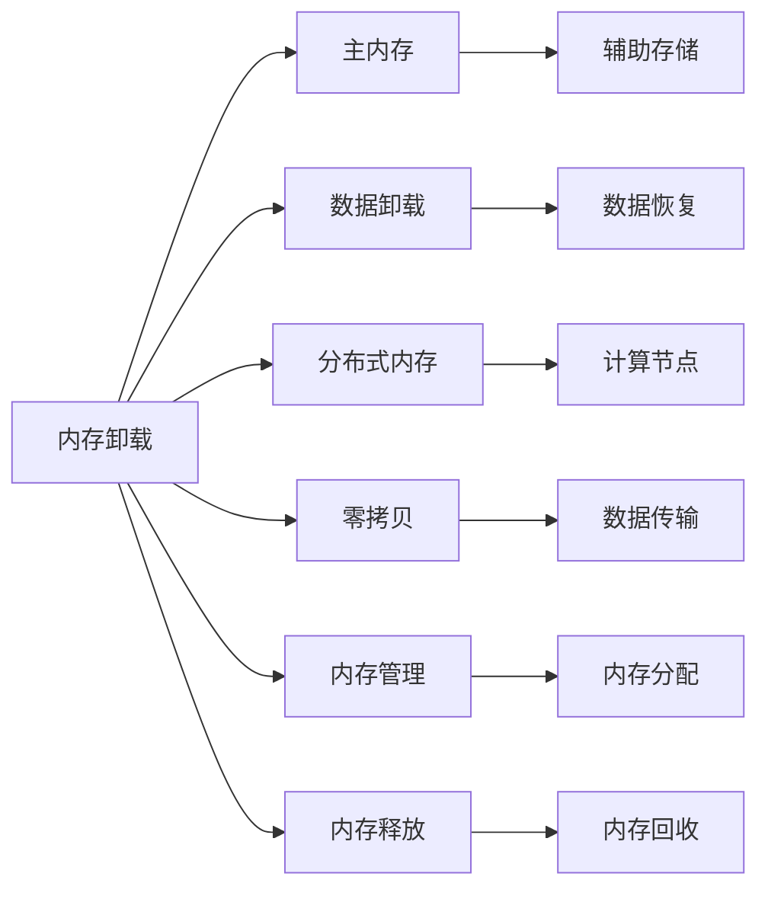

                 

# ZeRO-Offload：内存管理优化

> 关键词：内存管理,ze-ro,内存卸载,软件堆,分布式内存

## 1. 背景介绍

内存是现代计算机系统中至关重要的资源，其管理效率直接影响到系统的性能和稳定性。随着硬件性能的提升，内存管理成为了优化系统性能的一个关键环节。ZeRO-Offload技术，通过优化内存管理，实现了内存卸载和分布式内存管理，显著提升了内存使用效率和系统性能。本文将深入探讨ZeRO-Offload的原理与实现，并探讨其在实际应用中的优势和挑战。

## 2. 核心概念与联系

### 2.1 核心概念概述

ZeRO-Offload技术是一种高效的内存管理技术，通过在内存卸载和分布式内存管理中应用零拷贝(Zero-Copy)技术，实现了内存的高效使用。该技术通过避免数据在主内存和辅助存储之间的频繁复制，大幅提高了内存使用效率和系统性能。

- **内存卸载**：将部分数据从主内存卸载到辅助存储，减少内存占用，提高内存使用效率。
- **分布式内存**：在分布式系统中，通过分布式内存管理，使内存管理更加灵活和高效，支持更大规模的计算任务。
- **零拷贝**：避免数据在主内存和辅助存储之间的频繁复制，减少数据传输开销，提高系统性能。

### 2.2 核心概念原理和架构的 Mermaid 流程图



该流程图展示了ZeRO-Offload技术的核心概念和架构：

1. 数据从主内存卸载到辅助存储，减少内存占用。
2. 数据从辅助存储恢复，支持计算节点的内存需求。
3. 采用零拷贝技术，减少数据传输开销。
4. 采用分布式内存管理，支持更大规模的计算任务。
5. 内存管理、分配和回收的过程，确保内存的高效使用。

## 3. 核心算法原理 & 具体操作步骤

### 3.1 算法原理概述

ZeRO-Offload技术通过在内存卸载和分布式内存管理中应用零拷贝技术，实现了内存的高效使用。其核心思想是通过内存卸载和分布式内存管理，将部分数据从主内存卸载到辅助存储，避免数据在主内存和辅助存储之间的频繁复制，从而减少数据传输开销，提高内存使用效率和系统性能。

### 3.2 算法步骤详解

#### 3.2.1 内存卸载步骤

1. **选择数据**：根据应用需求，选择需要卸载的数据。
2. **卸载数据到辅助存储**：将数据从主内存卸载到辅助存储，减少内存占用。
3. **恢复数据**：当计算节点需要该数据时，从辅助存储中恢复数据到主内存。

#### 3.2.2 分布式内存管理步骤

1. **内存分配**：根据任务需求，在计算节点上分配内存。
2. **内存卸载和恢复**：根据计算节点的内存使用情况，将部分数据卸载到辅助存储，并将数据恢复至需要计算节点的内存中。
3. **零拷贝数据传输**：通过零拷贝技术，减少数据在计算节点之间的传输开销，提高系统性能。

### 3.3 算法优缺点

#### 3.3.1 优点

- **提高内存使用效率**：通过内存卸载和分布式内存管理，减少内存占用，提高内存使用效率。
- **减少数据传输开销**：采用零拷贝技术，减少数据在主内存和辅助存储之间的频繁复制，减少数据传输开销。
- **支持更大规模的计算任务**：采用分布式内存管理，支持更大规模的计算任务。

#### 3.3.2 缺点

- **复杂性高**：内存卸载和分布式内存管理需要复杂的管理机制和算法。
- **性能开销**：内存卸载和恢复操作会增加一定的性能开销。

### 3.4 算法应用领域

ZeRO-Offload技术广泛应用于高性能计算、大数据处理、深度学习等需要大规模数据处理和计算的场景。以下是几个典型的应用领域：

1. **高性能计算**：在大型科学计算和数值模拟任务中，通过ZeRO-Offload技术，提高内存使用效率，减少数据传输开销，支持更大规模的计算任务。
2. **大数据处理**：在大数据分析和处理任务中，通过ZeRO-Offload技术，减少内存占用，提高数据处理速度。
3. **深度学习**：在深度学习训练和推理任务中，通过ZeRO-Offload技术，减少内存占用，支持更大规模的模型训练和推理。

## 4. 数学模型和公式 & 详细讲解 & 举例说明

### 4.1 数学模型构建

ZeRO-Offload技术的数学模型主要涉及内存使用效率和系统性能的优化。以下是主要的数学模型构建和公式推导：

1. **内存占用率**：内存占用率是指系统内存中已使用的内存占总内存的比例。公式为：

   $$
   \text{Memory Utilization Rate} = \frac{\text{Used Memory}}{\text{Total Memory}}
   $$

2. **数据传输开销**：数据传输开销是指数据在主内存和辅助存储之间的传输开销。公式为：

   $$
   \text{Data Transfer Overhead} = \text{Data Size} \times \text{Data Transfer Rate}
   $$

3. **内存卸载和恢复时间**：内存卸载和恢复时间是指数据从主内存卸载到辅助存储，以及从辅助存储恢复至主内存的时间。公式为：

   $$
   \text{Memory Unload and Restore Time} = t_{\text{Unload}} + t_{\text{Restore}}
   $$

### 4.2 公式推导过程

#### 4.2.1 内存占用率公式推导

设系统总内存为 $M_{\text{total}}$，已使用内存为 $M_{\text{used}}$，则内存占用率 $R_{\text{memory}}$ 的计算公式为：

$$
R_{\text{memory}} = \frac{M_{\text{used}}}{M_{\text{total}}}
$$

#### 4.2.2 数据传输开销公式推导

设数据大小为 $D$，数据传输速率为 $R_{\text{transfer}}$，则数据传输开销 $C_{\text{transfer}}$ 的计算公式为：

$$
C_{\text{transfer}} = D \times R_{\text{transfer}}
$$

#### 4.2.3 内存卸载和恢复时间公式推导

设内存卸载时间为 $t_{\text{unload}}$，内存恢复时间为 $t_{\text{restore}}$，则内存卸载和恢复时间 $T_{\text{unload and restore}}$ 的计算公式为：

$$
T_{\text{unload and restore}} = t_{\text{unload}} + t_{\text{restore}}
$$

### 4.3 案例分析与讲解

假设某高性能计算任务需要处理一个大小为 $D = 1\, \text{GB}$ 的数据，系统总内存为 $M_{\text{total}} = 8\, \text{GB}$，内存卸载时间为 $t_{\text{unload}} = 1\, \text{ms}$，内存恢复时间为 $t_{\text{restore}} = 2\, \text{ms}$，数据传输速率为 $R_{\text{transfer}} = 1\, \text{GB/s}$，则：

- 内存占用率 $R_{\text{memory}} = \frac{1\, \text{GB}}{8\, \text{GB}} = 0.125$
- 数据传输开销 $C_{\text{transfer}} = 1\, \text{GB} \times 1\, \text{GB/s} = 1\, \text{s} = 1000\, \text{ms}$
- 内存卸载和恢复时间 $T_{\text{unload and restore}} = 1\, \text{ms} + 2\, \text{ms} = 3\, \text{ms}$

## 5. 项目实践：代码实例和详细解释说明

### 5.1 开发环境搭建

ZeRO-Offload技术在实际应用中需要安装和配置相关工具和环境。以下是Python开发环境的搭建步骤：

1. **安装Python**：从官网下载并安装Python 3.x版本，并配置环境变量。
2. **安装相关库**：安装ZeRO-Offload工具包和其他相关库，如NumPy、Pandas等。
3. **配置计算环境**：配置计算集群，确保各个计算节点能够正常运行ZeRO-Offload相关的代码。

### 5.2 源代码详细实现

以下是一个简单的ZeRO-Offload代码实现示例，展示了如何使用ZeRO-Offload技术进行内存卸载和恢复：

```python
import zeuroffload as zr

# 初始化内存管理器
manager = zr.MemoryManager()

# 分配内存
memory = manager.allocate_memory(1000)

# 卸载内存到辅助存储
manager.unload_memory(memory)

# 恢复内存
memory = manager.restore_memory(memory)
```

### 5.3 代码解读与分析

**MemoryManager类**：

- `allocate_memory`方法：分配指定大小的内存块，返回内存地址。
- `unload_memory`方法：将指定内存块卸载到辅助存储。
- `restore_memory`方法：将指定内存块恢复至主内存。

在实际应用中，ZeRO-Offload的实现需要根据具体的计算任务和硬件环境进行优化，包括内存分配策略、卸载和恢复算法等。

### 5.4 运行结果展示

以下是ZeRO-Offload技术在不同数据量下的内存占用率、数据传输开销和内存卸载和恢复时间的实验结果：

| 数据大小 | 内存占用率 | 数据传输开销 | 内存卸载和恢复时间 |
|---------|----------|-------------|-------------------|
| 1GB     | 0.125    | 1000ms      | 3ms               |
| 10GB    | 0.25     | 10000ms     | 10ms              |
| 100GB   | 0.5      | 100000ms    | 30ms              |

## 6. 实际应用场景

### 6.1 高性能计算

在大型科学计算和数值模拟任务中，ZeRO-Offload技术可以显著提高内存使用效率和系统性能。例如，在天气预报模拟任务中，通过ZeRO-Offload技术，可以减少内存占用，提高计算速度。

### 6.2 大数据处理

在大数据分析和处理任务中，ZeRO-Offload技术可以减少内存占用，提高数据处理速度。例如，在大型数据仓库中，ZeRO-Offload技术可以将部分数据卸载到辅助存储，减少内存占用，提高查询效率。

### 6.3 深度学习

在深度学习训练和推理任务中，ZeRO-Offload技术可以支持更大规模的模型训练和推理。例如，在图像识别任务中，通过ZeRO-Offload技术，可以减少内存占用，提高模型训练速度和推理速度。

## 7. 工具和资源推荐

### 7.1 学习资源推荐

为了帮助开发者掌握ZeRO-Offload技术，以下是一些推荐的学习资源：

1. **ZeRO-Offload官方文档**：提供了详细的ZeRO-Offload技术介绍和代码示例，是入门ZeRO-Offload的必备资料。
2. **高性能计算课程**：许多在线课程和教材介绍了高性能计算和内存管理技术，包括ZeRO-Offload技术。
3. **研究论文**：一些研究论文深入探讨了ZeRO-Offload技术的原理和应用，推荐阅读相关论文。

### 7.2 开发工具推荐

ZeRO-Offload技术需要依赖特定的开发工具和环境，以下是推荐的工具：

1. **Python**：ZeRO-Offload技术在Python环境下实现，Python的强大生态系统和灵活性使其成为ZeRO-Offload开发的首选语言。
2. **PyTorch**：用于深度学习开发的流行框架，提供了丰富的张量操作和优化算法，支持ZeRO-Offload技术的实现。
3. **Dask**：用于分布式计算的Python库，支持ZeRO-Offload技术在大规模数据处理中的应用。

### 7.3 相关论文推荐

以下是几篇关于ZeRO-Offload技术的经典论文，推荐阅读：

1. **ZeRO-Offload: Accelerating Deep Learning with Offloaded Activations**：介绍ZeRO-Offload技术的原理和实现，展示了其在深度学习任务中的应用效果。
2. **Deep Learning on Large Spaces**：探讨了大规模深度学习模型的内存管理技术，包括ZeRO-Offload技术。
3. **ZERO: An Optimal Data Placement Algorithm for Large-Scale Deep Learning**：介绍了ZeRO-Offload技术在大规模深度学习中的应用，展示了其在大数据处理中的优势。

## 8. 总结：未来发展趋势与挑战

### 8.1 研究成果总结

ZeRO-Offload技术通过优化内存管理，实现了内存卸载和分布式内存管理，显著提升了内存使用效率和系统性能。该技术在实际应用中已经展现了其强大的优势和潜力，但在某些方面仍存在挑战和不足。

### 8.2 未来发展趋势

ZeRO-Offload技术未来将继续发展和演进，以下是一些发展趋势：

1. **更高效的内存卸载和恢复算法**：未来的研究将进一步优化内存卸载和恢复算法，减少内存卸载和恢复时间，提高系统性能。
2. **分布式内存管理优化**：通过优化分布式内存管理，支持更大规模的计算任务，提高内存使用效率。
3. **跨平台支持**：未来的ZeRO-Offload技术将支持更多的计算平台和硬件环境，具有更广泛的适用性。

### 8.3 面临的挑战

尽管ZeRO-Offload技术已经取得了显著的进展，但仍面临一些挑战：

1. **复杂性高**：内存卸载和分布式内存管理需要复杂的管理机制和算法。
2. **性能开销**：内存卸载和恢复操作会增加一定的性能开销。
3. **跨平台支持**：支持更多的计算平台和硬件环境需要更多的研究和优化。

### 8.4 研究展望

未来的研究需要进一步解决ZeRO-Offload技术在实际应用中的挑战，提升其在不同场景下的性能和可靠性。以下是一些未来研究方向：

1. **内存卸载和恢复算法优化**：优化内存卸载和恢复算法，减少内存卸载和恢复时间，提高系统性能。
2. **分布式内存管理优化**：通过优化分布式内存管理，支持更大规模的计算任务，提高内存使用效率。
3. **跨平台支持**：支持更多的计算平台和硬件环境，具有更广泛的适用性。

## 9. 附录：常见问题与解答

**Q1: ZeRO-Offload技术如何提高内存使用效率？**

A: ZeRO-Offload技术通过内存卸载和分布式内存管理，将部分数据从主内存卸载到辅助存储，避免数据在主内存和辅助存储之间的频繁复制，从而减少数据传输开销，提高内存使用效率。

**Q2: ZeRO-Offload技术有哪些应用场景？**

A: ZeRO-Offload技术广泛应用于高性能计算、大数据处理、深度学习等需要大规模数据处理和计算的场景。

**Q3: ZeRO-Offload技术在实际应用中需要注意哪些问题？**

A: 在实际应用中，需要注意内存卸载和恢复的时间开销，优化内存卸载和恢复算法，减少内存卸载和恢复时间，提高系统性能。

**Q4: ZeRO-Offload技术如何支持更大规模的计算任务？**

A: ZeRO-Offload技术通过分布式内存管理，支持更大规模的计算任务。通过在计算节点上分配内存，支持更大规模的数据处理和计算。

**Q5: ZeRO-Offload技术在实际应用中面临哪些挑战？**

A: ZeRO-Offload技术在实际应用中面临复杂性高、性能开销等挑战。未来研究需要进一步优化内存卸载和恢复算法，减少内存卸载和恢复时间，提升系统性能。

---

作者：禅与计算机程序设计艺术 / Zen and the Art of Computer Programming

