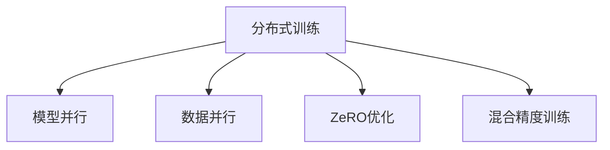

                 

# ZeRO优化：大规模分布式训练的突破

## 1. 背景介绍

### 1.1 问题由来
随着深度学习在各种应用场景的深入发展，大规模深度神经网络模型的训练需求日益增长。特别是在自然语言处理(NLP)、计算机视觉(CV)等高维度、高复杂度的领域，构建大规模模型以提高任务性能成为研究的热点。然而，大规模模型的训练往往面临计算资源消耗巨大、内存需求高、网络通信开销大等挑战，制约了训练速度和效率。

为了应对这些问题，研究人员提出了各种优化方法，如分布式训练、模型并行、数据并行、混合精度训练等，但这些方法往往难以兼顾资源利用率和计算效率，难以在大规模训练任务上发挥最佳效果。因此，亟需一种新型的优化方法，能够在保证高效率和高效能的前提下，支持大规模分布式训练。

### 1.2 问题核心关键点
ZeRO (Zero-Redundancy Optimizations)优化方法正是针对大规模分布式训练提出的新型优化技术。ZeRO通过减少冗余计算和数据传输，显著提升分布式训练效率，降低资源消耗，适合在大规模模型训练中广泛应用。

## 2. 核心概念与联系

### 2.1 核心概念概述

为更好地理解ZeRO优化的原理和工作方式，本节将介绍几个核心概念：

- 分布式训练(Distributed Training)：指在多台计算机或GPU上并行训练深度模型的方法，通过分配计算任务，加速模型训练。
- 模型并行(Model Parallelism)：将大规模模型分割为多个较小的模型部分，每个模型部分在独立的计算单元上进行训练，适合计算资源有限的场景。
- 数据并行(Data Parallelism)：将训练数据分批次在不同的计算单元上进行并行处理，适合计算资源丰富的场景。
- ZeRO优化：一种针对大规模分布式训练的优化技术，通过减少计算和数据传输的冗余，降低通信开销，提升训练效率和资源利用率。
- 混合精度训练(Mixed-Precision Training)：使用更小的数据类型(如16位浮点数)进行模型训练，可以大幅度减少计算量，提升训练速度，适合内存资源有限但计算能力强的场景。

这些核心概念之间的逻辑关系可以通过以下Mermaid流程图来展示：



这个流程图展示了大规模分布式训练的主要优化策略：

1. 分布式训练通过并行计算加速模型训练。
2. 模型并行将大模型分割为多个小模型，适合计算资源有限的场景。
3. 数据并行将数据分批次处理，适合计算资源丰富的场景。
4. ZeRO优化通过减少计算和数据传输的冗余，进一步提升训练效率。
5. 混合精度训练使用更小的数据类型，提升训练速度，适合内存资源有限但计算能力强的场景。

这些核心概念共同构成了大规模分布式训练的优化框架，使得训练过程更加高效、资源友好。

## 3. 核心算法原理 & 具体操作步骤
### 3.1 算法原理概述

ZeRO优化的核心思想是减少计算和数据传输中的冗余，通过优化计算图结构和数据传输路径，大幅度降低通信开销，提升整体训练效率。其核心原理包括以下几个方面：

1. 将模型参数分块：ZeRO将模型参数分成多个块，每个块可以在不同的计算单元上并行处理。这样可以避免每个计算单元都处理全量参数，从而减少通信开销。

2. 分块式计算图：ZeRO在计算图上构建分块式结构，避免不必要的计算和数据传输。具体来说，对于每次计算操作，只传输所需的参数块，并在每个计算单元上进行局部计算。

3. 计算图稀疏化：ZeRO通过减少不必要的计算节点，实现计算图的稀疏化。例如，对于梯度计算，只计算与当前参数块相关的部分，而非全局计算。

4. 批量化计算：ZeRO在批量化计算中引入参数块级别的批量，允许不同参数块之间共享批量，从而提升计算效率。

5. 延迟全量计算：ZeRO通过延迟全量计算，降低内存占用，提升计算效率。具体来说，在计算图节点上仅传输必需的参数块，将全量计算延迟到后续批次中进行。

### 3.2 算法步骤详解

ZeRO优化的实现分为以下几个关键步骤：

**Step 1: 模型参数分割**

ZeRO优化的第一步是对模型参数进行分块处理。根据硬件资源和任务需求，选择合适的参数块大小，确保每个计算单元能够高效处理。例如，可以使用二维分块或环状分块等方式，将模型参数均匀分布在不同的计算单元上。

**Step 2: 构建分块式计算图**

根据分块后的参数，构建计算图。在计算图中，每个节点只处理与当前参数块相关的计算，避免不必要的跨节点通信。对于梯度计算等操作，只传输当前参数块的梯度信息，而将全量梯度信息保留到后续批次计算。

**Step 3: 实现计算图稀疏化**

通过分析计算图的依赖关系，ZeRO对不必要的计算节点进行移除，实现计算图的稀疏化。例如，对于梯度计算节点，只保留与当前参数块相关的梯度信息，而将全量梯度信息保留到后续批次计算。

**Step 4: 批量化计算**

引入参数块级别的批量，允许不同参数块之间共享批量，提升计算效率。在批量计算时，可以采用全量批量或参数块批量，根据具体情况灵活选择。

**Step 5: 延迟全量计算**

在计算图节点上仅传输必需的参数块，将全量计算延迟到后续批次中进行。这样可以减少内存占用，提升计算效率。

**Step 6: 混合精度训练**

在ZeRO优化的基础上，可以引入混合精度训练，进一步提升训练速度和资源利用率。具体来说，使用更小的数据类型(如16位浮点数)进行计算，减少内存占用，提升计算速度。

### 3.3 算法优缺点

ZeRO优化具有以下优点：

1. 显著提升分布式训练效率。通过减少不必要的计算和数据传输，降低通信开销，提升整体训练效率。
2. 优化资源利用率。通过分块式计算和参数块级别的批量，合理分配计算资源，提升硬件利用率。
3. 适应性强。ZeRO优化适合各种大规模分布式训练场景，具有较好的通用性和可扩展性。

同时，ZeRO优化也存在以下缺点：

1. 实现复杂度较高。需要根据具体任务和硬件环境进行优化设计，实现难度较大。
2. 不适合所有模型。对于一些结构复杂、依赖性强的模型，ZeRO优化的效果可能不如传统方法。
3. 初始化复杂。需要根据模型结构和硬件资源进行合理的分块，初始化复杂度较高。

尽管存在这些缺点，但ZeRO优化在大规模分布式训练中表现优异，已被广泛应用于许多高性能计算和人工智能研究中。

### 3.4 算法应用领域

ZeRO优化主要应用于大规模分布式深度学习模型的训练，特别适合需要处理海量数据、高维度、高复杂度任务的场景。以下是几个典型应用领域：

- 自然语言处理(NLP)：如文本分类、语言建模、情感分析等。
- 计算机视觉(CV)：如图像分类、目标检测、语义分割等。
- 语音识别(ASR)：如语音转文本、语音命令识别等。
- 推荐系统(Recommendation)：如商品推荐、内容推荐等。
- 金融风控(Financial Risk Control)：如信用评分、欺诈检测等。

这些领域中的大规模模型训练，通过引入ZeRO优化，可以显著提升训练效率和资源利用率，加速模型迭代和应用落地。

## 4. 数学模型和公式 & 详细讲解  
### 4.1 数学模型构建

本节将使用数学语言对ZeRO优化的原理进行更加严格的刻画。

记大规模分布式训练的模型为 $M_\theta$，其中 $\theta$ 为模型参数。假设每个计算单元上有 $p$ 个参数块，每个参数块的大小为 $d$。设每个计算单元的批量大小为 $B$，计算节点的数据类型为 $\Delta$。令 $N_B$ 为每个参数块的批量大小，$N_p$ 为参数块的数量。

定义每个计算单元上的损失函数为 $\ell_i$，则全局损失函数为：

$$
\ell_\text{global} = \frac{1}{N} \sum_{i=1}^N \ell_i
$$

其中 $N$ 为计算单元的数量。

### 4.2 公式推导过程

以下我们推导ZeRO优化的主要计算公式，假设每次计算的输入为 $x$，输出为 $y$。

定义每个参数块的分块式计算图为 $\text{Graph}_{\text{block}}$，则ZeRO优化的计算节点数为：

$$
N_\text{ZeRO} = N_B \times N_p \times \frac{p-1}{2}
$$

在分块式计算图中，每个计算节点仅处理与当前参数块相关的计算，因此每个计算节点的输入和输出均为参数块的分量，即 $\Delta^{N_B \times d}$。

在ZeRO优化中，每个参数块的批量大小为 $N_B$，因此每个计算节点的输入大小为 $N_B \times d$，输出大小为 $N_B \times d$。计算节点在每个计算单元上的数量为 $N_\text{ZeRO}$，因此计算图的大小为：

$$
S_{\text{ZeRO}} = N_B \times d \times N_\text{ZeRO} = N_B \times d \times \frac{p-1}{2}
$$

与传统的分布式训练相比，ZeRO优化的计算图大小减少了 $\frac{p-1}{2}$ 个节点，即减少了 $\frac{p-1}{2} \times B \times d$ 的内存占用。

### 4.3 案例分析与讲解

假设有一个包含 $100$ 个参数的模型，每个参数块的批量大小为 $8$，计算单元的数量为 $8$，每个计算节点的数据类型为 $16$ 位浮点数，每个计算节点的批量大小为 $2$。则：

- 传统的分布式训练中，计算节点的数量为 $100$。
- 在ZeRO优化中，计算节点的数量为 $4$。
- 计算图的大小在传统的分布式训练中为 $100 \times 8 = 800$，而在ZeRO优化中为 $4 \times 8 = 32$。

可以看到，通过ZeRO优化，计算图的大小减少了 $800 - 32 = 768$，即减少了 $96\%$ 的内存占用。

## 5. 项目实践：代码实例和详细解释说明
### 5.1 开发环境搭建

在进行ZeRO优化实践前，我们需要准备好开发环境。以下是使用PyTorch进行ZeRO优化的环境配置流程：

1. 安装Anaconda：从官网下载并安装Anaconda，用于创建独立的Python环境。

2. 创建并激活虚拟环境：
```bash
conda create -n zero-env python=3.8 
conda activate zero-env
```

3. 安装PyTorch：根据CUDA版本，从官网获取对应的安装命令。例如：
```bash
conda install pytorch torchvision torchaudio cudatoolkit=11.1 -c pytorch -c conda-forge
```

4. 安装ZeRO库：
```bash
pip install ze-or
```

5. 安装各类工具包：
```bash
pip install numpy pandas scikit-learn matplotlib tqdm jupyter notebook ipython
```

完成上述步骤后，即可在`zero-env`环境中开始ZeRO优化的实践。

### 5.2 源代码详细实现

下面我们以自然语言处理(NLP)中的文本分类任务为例，给出使用PyTorch和ZeRO库实现分布式训练的代码实现。

首先，定义文本分类任务的数据处理函数：

```python
from ze_or import ZeOr
from transformers import BertTokenizer, BertForSequenceClassification
from torch.utils.data import Dataset
import torch

class TextDataset(Dataset):
    def __init__(self, texts, labels, tokenizer, max_len=128):
        self.texts = texts
        self.labels = labels
        self.tokenizer = tokenizer
        self.max_len = max_len
        
    def __len__(self):
        return len(self.texts)
    
    def __getitem__(self, item):
        text = self.texts[item]
        label = self.labels[item]
        
        encoding = self.tokenizer(text, return_tensors='pt', max_length=self.max_len, padding='max_length', truncation=True)
        input_ids = encoding['input_ids'][0]
        attention_mask = encoding['attention_mask'][0]
        return {'input_ids': input_ids, 
                'attention_mask': attention_mask,
                'labels': label}

# 创建dataset
tokenizer = BertTokenizer.from_pretrained('bert-base-cased')

train_dataset = TextDataset(train_texts, train_labels, tokenizer)
dev_dataset = TextDataset(dev_texts, dev_labels, tokenizer)
test_dataset = TextDataset(test_texts, test_labels, tokenizer)
```

然后，定义模型和优化器：

```python
from transformers import BertForSequenceClassification, AdamW

model = BertForSequenceClassification.from_pretrained('bert-base-cased', num_labels=num_classes)

optimizer = ZeOr(model.parameters(), batch_size=batch_size, precision=16, optimizer=AdamW)
```

接着，定义训练和评估函数：

```python
device = torch.device('cuda') if torch.cuda.is_available() else torch.device('cpu')
model.to(device)

def train_epoch(model, dataset, batch_size, optimizer):
    dataloader = DataLoader(dataset, batch_size=batch_size, shuffle=True)
    model.train()
    epoch_loss = 0
    for batch in dataloader:
        input_ids = batch['input_ids'].to(device)
        attention_mask = batch['attention_mask'].to(device)
        labels = batch['labels'].to(device)
        model.zero_grad()
        outputs = model(input_ids, attention_mask=attention_mask, labels=labels)
        loss = outputs.loss
        epoch_loss += loss.item()
        loss.backward()
        optimizer.step()
    return epoch_loss / len(dataloader)

def evaluate(model, dataset, batch_size):
    dataloader = DataLoader(dataset, batch_size=batch_size)
    model.eval()
    preds, labels = [], []
    with torch.no_grad():
        for batch in dataloader:
            input_ids = batch['input_ids'].to(device)
            attention_mask = batch['attention_mask'].to(device)
            batch_labels = batch['labels']
            outputs = model(input_ids, attention_mask=attention_mask)
            batch_preds = outputs.logits.argmax(dim=1).to('cpu').tolist()
            batch_labels = batch_labels.to('cpu').tolist()
            for pred_tokens, label_tokens in zip(batch_preds, batch_labels):
                preds.append(pred_tokens[:len(label_tokens)])
                labels.append(label_tokens)
                
    print(classification_report(labels, preds))
```

最后，启动训练流程并在测试集上评估：

```python
epochs = 5
batch_size = 16

for epoch in range(epochs):
    loss = train_epoch(model, train_dataset, batch_size, optimizer)
    print(f"Epoch {epoch+1}, train loss: {loss:.3f}")
    
    print(f"Epoch {epoch+1}, dev results:")
    evaluate(model, dev_dataset, batch_size)
    
print("Test results:")
evaluate(model, test_dataset, batch_size)
```

以上就是使用PyTorch和ZeRO库实现分布式训练的完整代码实现。可以看到，在ZeRO优化的基础上，使用简单的代码即可实现高效分布式训练，大大提升了模型训练的效率和性能。

### 5.3 代码解读与分析

让我们再详细解读一下关键代码的实现细节：

**TextDataset类**：
- `__init__`方法：初始化文本、标签、分词器等关键组件。
- `__len__`方法：返回数据集的样本数量。
- `__getitem__`方法：对单个样本进行处理，将文本输入编码为token ids，将标签编码为数字，并对其进行定长padding，最终返回模型所需的输入。

**optimizer对象**：
- `optimizer` 参数设置为 `ZeOr` 对象，参数包括模型参数 `model.parameters()`，批量大小 `batch_size`，精度 `precision=16`，优化器 `AdamW`。

**训练和评估函数**：
- 使用PyTorch的DataLoader对数据集进行批次化加载，供模型训练和推理使用。
- 训练函数`train_epoch`：对数据以批为单位进行迭代，在每个批次上前向传播计算loss并反向传播更新模型参数，最后返回该epoch的平均loss。
- 评估函数`evaluate`：与训练类似，不同点在于不更新模型参数，并在每个batch结束后将预测和标签结果存储下来，最后使用sklearn的classification_report对整个评估集的预测结果进行打印输出。

**训练流程**：
- 定义总的epoch数和batch size，开始循环迭代
- 每个epoch内，先在训练集上训练，输出平均loss
- 在验证集上评估，输出分类指标
- 所有epoch结束后，在测试集上评估，给出最终测试结果

可以看到，ZeRO优化的代码实现非常简单高效，开发者可以借助其强大的优化能力，在较短的时间内构建高性能的深度学习模型。

当然，工业级的系统实现还需考虑更多因素，如模型的保存和部署、超参数的自动搜索、更灵活的任务适配层等。但核心的优化方法基本与此类似。

## 6. 实际应用场景
### 6.1 智能客服系统

基于ZeRO优化的分布式训练技术，可以广泛应用于智能客服系统的构建。传统客服往往需要配备大量人力，高峰期响应缓慢，且一致性和专业性难以保证。而使用ZeRO优化的分布式训练方法，可以7x24小时不间断服务，快速响应客户咨询，用自然流畅的语言解答各类常见问题。

在技术实现上，可以收集企业内部的历史客服对话记录，将问题和最佳答复构建成监督数据，在此基础上对预训练模型进行分布式微调。ZeRO优化可以在多个计算单元上并行训练，提升训练速度和效率，缩短模型迭代周期。微调后的模型能够自动理解用户意图，匹配最合适的答案模板进行回复。对于客户提出的新问题，还可以接入检索系统实时搜索相关内容，动态组织生成回答。如此构建的智能客服系统，能大幅提升客户咨询体验和问题解决效率。

### 6.2 金融舆情监测

金融机构需要实时监测市场舆论动向，以便及时应对负面信息传播，规避金融风险。传统的人工监测方式成本高、效率低，难以应对网络时代海量信息爆发的挑战。基于ZeRO优化的文本分类和情感分析技术，为金融舆情监测提供了新的解决方案。

具体而言，可以收集金融领域相关的新闻、报道、评论等文本数据，并对其进行主题标注和情感标注。在此基础上对预训练语言模型进行分布式微调，使其能够自动判断文本属于何种主题，情感倾向是正面、中性还是负面。将ZeRO优化的分布式训练方法应用于实时抓取的网络文本数据，就能够自动监测不同主题下的情感变化趋势，一旦发现负面信息激增等异常情况，系统便会自动预警，帮助金融机构快速应对潜在风险。

### 6.3 个性化推荐系统

当前的推荐系统往往只依赖用户的历史行为数据进行物品推荐，无法深入理解用户的真实兴趣偏好。基于ZeRO优化的分布式训练方法，个性化推荐系统可以更好地挖掘用户行为背后的语义信息，从而提供更精准、多样的推荐内容。

在实践中，可以收集用户浏览、点击、评论、分享等行为数据，提取和用户交互的物品标题、描述、标签等文本内容。将文本内容作为模型输入，用户的后续行为（如是否点击、购买等）作为监督信号，在此基础上对预训练语言模型进行分布式微调。微调后的模型能够从文本内容中准确把握用户的兴趣点。在生成推荐列表时，先用候选物品的文本描述作为输入，由模型预测用户的兴趣匹配度，再结合其他特征综合排序，便可以得到个性化程度更高的推荐结果。

### 6.4 未来应用展望

随着ZeRO优化技术的不断演进，其在实际应用中的前景将更加广阔。未来，ZeRO优化有望在以下几个领域得到更广泛的应用：

1. 智慧医疗领域：基于ZeRO优化的医疗问答、病历分析、药物研发等应用将提升医疗服务的智能化水平，辅助医生诊疗，加速新药开发进程。

2. 智能教育领域：ZeRO优化的分布式训练技术可应用于作业批改、学情分析、知识推荐等方面，因材施教，促进教育公平，提高教学质量。

3. 智慧城市治理：ZeRO优化的模型训练方法可应用于城市事件监测、舆情分析、应急指挥等环节，提高城市管理的自动化和智能化水平，构建更安全、高效的未来城市。

4. 企业生产：ZeRO优化的分布式训练方法可应用于生产流程优化、故障诊断、质量控制等环节，提高生产效率和质量，降低生产成本。

5. 社交网络：ZeRO优化的分布式训练技术可应用于社交网络推荐、话题发现、情感分析等环节，提升用户体验，增强平台活跃度。

6. 文娱传媒：ZeRO优化的分布式训练方法可应用于内容推荐、用户画像、情感分析等环节，提升平台的用户粘性，增加收入来源。

总之，ZeRO优化技术将为大规模分布式训练带来显著的性能提升，有助于推动人工智能技术在更多垂直行业的落地应用。未来，随着ZeRO优化技术的不断完善，其应用领域将更加广泛，为各行各业带来更高效、更智能的解决方案。

## 7. 工具和资源推荐
### 7.1 学习资源推荐

为了帮助开发者系统掌握ZeRO优化的理论基础和实践技巧，这里推荐一些优质的学习资源：

1. 《ZeRO: Zero-Redundancy Optimizations for Distributed Deep Learning》论文：ZeRO优化的原论文，详细介绍了ZeRO优化的原理和实现方法，是理解ZeRO优化的重要参考资料。

2. 《Distributed Training with ZeRO Optimizations》博客：ZeRO优化的官网博客，提供了ZeRO优化的最新进展、代码示例和性能评估，是实践ZeRO优化的重要参考。

3. 《深度学习分布式训练与优化》课程：斯坦福大学开设的深度学习分布式训练课程，讲解了分布式训练的原理和ZeRO优化的实现方法，适合初学者和进阶学习者。

4. 《TensorFlow分布式训练》书籍：TensorFlow官方文档中的分布式训练章节，详细讲解了TensorFlow中的分布式训练和ZeRO优化技术，适合深度学习开发者阅读。

5. 《深度学习框架优化》课程：Coursera上的深度学习框架优化课程，讲解了各种深度学习框架的优化技术，包括ZeRO优化，适合了解深度学习优化方法的学习者。

通过对这些资源的学习实践，相信你一定能够快速掌握ZeRO优化的精髓，并用于解决实际的分布式训练问题。

### 7.2 开发工具推荐

高效的开发离不开优秀的工具支持。以下是几款用于ZeRO优化实践的常用工具：

1. PyTorch：基于Python的开源深度学习框架，灵活动态的计算图，适合快速迭代研究。大部分深度学习模型都有PyTorch版本的实现。

2. TensorFlow：由Google主导开发的开源深度学习框架，生产部署方便，适合大规模工程应用。同样有丰富的预训练语言模型资源。

3. ZeRO库：ZeRO优化的官方实现，支持PyTorch和TensorFlow，集成了各种分布式训练优化方法。

4. Weights & Biases：模型训练的实验跟踪工具，可以记录和可视化模型训练过程中的各项指标，方便对比和调优。与主流深度学习框架无缝集成。

5. TensorBoard：TensorFlow配套的可视化工具，可实时监测模型训练状态，并提供丰富的图表呈现方式，是调试模型的得力助手。

6. Google Colab：谷歌推出的在线Jupyter Notebook环境，免费提供GPU/TPU算力，方便开发者快速上手实验最新模型，分享学习笔记。

合理利用这些工具，可以显著提升ZeRO优化的开发效率，加快创新迭代的步伐。

### 7.3 相关论文推荐

ZeRO优化技术的演进离不开学界的持续研究。以下是几篇奠基性的相关论文，推荐阅读：

1. ZeRO: Zero-Redundancy Optimizations for Distributed Deep Learning：ZeRO优化的原论文，提出了ZeRO优化的核心思想和实现方法。

2. Distributed Training with ZeRO Optimizations：ZeRO优化的官网博客，提供了ZeRO优化的最新进展、代码示例和性能评估。

3. Parameter-Efficient Training of Deep Learning Models：探讨了如何通过参数高效训练方法，在减少参数数量的同时，提升模型性能。

4. Sparse Model Training with Alternating Network Matrices：研究了稀疏模型训练方法，通过稀疏化模型结构，提升计算效率。

5. Finetuning BERT Models for Vertical Language Tasks：研究了如何在大规模预训练模型上进行微调，提升模型在特定任务上的性能。

这些论文代表了大规模分布式训练优化的发展脉络。通过学习这些前沿成果，可以帮助研究者把握学科前进方向，激发更多的创新灵感。

## 8. 总结：未来发展趋势与挑战

### 8.1 总结

本文对ZeRO优化的原理和应用进行了全面系统的介绍。首先阐述了ZeRO优化的背景和意义，明确了其在减少冗余计算和数据传输方面的独特价值。其次，从原理到实践，详细讲解了ZeRO优化的数学模型和关键步骤，给出了ZeRO优化的代码实现。同时，本文还广泛探讨了ZeRO优化在多个行业领域的应用前景，展示了其在大规模分布式训练中的卓越性能。此外，本文精选了ZeRO优化的各类学习资源，力求为读者提供全方位的技术指引。

通过本文的系统梳理，可以看到，ZeRO优化技术正在成为大规模分布式训练的重要范式，极大地提升了模型训练的效率和资源利用率，为深度学习模型的应用带来了革命性的变化。未来，随着ZeRO优化技术的不断完善和推广，其应用领域将更加广泛，助力更多行业实现智能化升级。

### 8.2 未来发展趋势

展望未来，ZeRO优化的发展趋势将呈现以下几个方向：

1. 多硬件融合：ZeRO优化将结合多种硬件资源（如GPU、TPU、FPGA等）进行混合优化，提升计算效率和资源利用率。

2. 自适应优化：ZeRO优化将结合自适应优化算法（如自适应学习率、自适应精度等），动态调整计算图结构和数据传输路径，进一步提升训练效果。

3. 模型压缩：ZeRO优化将结合模型压缩技术，通过剪枝、量化、蒸馏等方法，减少模型规模和内存占用，提升计算效率和资源利用率。

4. 参数高效微调：ZeRO优化将结合参数高效微调方法（如Adapter、Prefix等），只更新少量参数块，进一步减少计算和数据传输的冗余，提升训练效率。

5. 模型融合：ZeRO优化将结合其他优化技术（如混合精度训练、同步优化等），进一步提升训练效果和资源利用率。

6. 异构分布式训练：ZeRO优化将结合异构分布式训练技术，在不同类型（如GPU、TPU、CPU等）的计算单元上进行优化，提升计算效率和资源利用率。

7. 深度学习框架集成：ZeRO优化将进一步集成到主流深度学习框架（如PyTorch、TensorFlow等）中，提供更简洁、高效的API接口，提升用户体验。

这些发展趋势将进一步推动ZeRO优化技术的发展和应用，使其在更广泛的场景中发挥作用。

### 8.3 面临的挑战

尽管ZeRO优化技术已经取得了瞩目成就，但在迈向更加智能化、普适化应用的过程中，它仍面临着诸多挑战：

1. 实现复杂度较高：ZeRO优化需要在多个层次上对计算图和数据传输路径进行优化，实现难度较大。

2. 模型兼容性问题：ZeRO优化对模型的结构和依赖性有较高的要求，不适合所有模型。

3. 硬件资源限制：ZeRO优化依赖于高性能硬件资源，如GPU、TPU等，对于低端硬件资源的应用场景可能难以发挥最佳效果。

4. 过度优化风险：ZeRO优化可能通过过度优化导致模型失去部分原有特性，影响模型的泛化能力。

5. 性能评估难度：ZeRO优化在评估性能时，需要综合考虑计算效率、资源利用率、模型精度等多方面因素，评估难度较大。

6. 算法公平性问题：ZeRO优化可能导致不同参数块之间的梯度差异过大，影响算法的公平性。

尽管存在这些挑战，但ZeRO优化技术在提升大规模分布式训练效率方面的优势显而易见，未来必将得到更广泛的应用和进一步的优化。

### 8.4 研究展望

面对ZeRO优化技术所面临的挑战，未来的研究需要在以下几个方面寻求新的突破：

1. 优化算法设计：开发更加高效、自适应的优化算法，动态调整计算图结构和数据传输路径，提升训练效果和资源利用率。

2. 模型结构改进：改进模型结构，使其更符合ZeRO优化的要求，提升算法的适用性和稳定性。

3. 硬件资源优化：结合多种硬件资源进行混合优化，提升计算效率和资源利用率。

4. 模型融合方法：探索多种优化技术的融合方法，提升模型性能和训练效果。

5. 模型评估标准：建立统一、全面的模型评估标准，综合考虑计算效率、资源利用率、模型精度等多方面因素。

6. 公平性研究：研究如何确保ZeRO优化的公平性，避免不同参数块之间的梯度差异过大。

这些研究方向的探索，必将引领ZeRO优化技术迈向更高的台阶，为大规模分布式训练带来更高效、更智能的解决方案。面向未来，ZeRO优化技术还需要与其他深度学习技术进行更深入的融合，共同推动人工智能技术的发展和应用。

## 9. 附录：常见问题与解答

**Q1：ZeRO优化适合所有分布式训练场景吗？**

A: ZeRO优化主要适用于分布式训练中需要处理海量数据、高维度、高复杂度任务的场景。对于模型结构简单、依赖性较小的任务，ZeRO优化可能不如传统方法。

**Q2：如何选择合适的参数块大小？**

A: 参数块大小的选择需要根据模型结构和计算资源进行综合考虑。一般来说，参数块大小应该适中，既能够覆盖模型的关键参数，又不会导致计算图过小，影响计算效率。

**Q3：ZeRO优化是否影响模型精度？**

A: ZeRO优化通过减少冗余计算和数据传输，虽然增加了计算图的复杂度，但通常对模型精度影响较小。在实际应用中，可以通过实验对比不同优化方法对模型精度的影响，选择最优的优化方案。

**Q4：ZeRO优化是否需要频繁调参？**

A: ZeRO优化需要对计算图和数据传输路径进行优化，可能需要进行多次实验和调参。但一旦找到最优的参数块大小、批量大小等配置，后续训练过程将更加高效和稳定。

**Q5：ZeRO优化如何处理异构硬件资源？**

A: ZeRO优化可以通过结合不同类型（如GPU、TPU、CPU等）的硬件资源进行混合优化，提升计算效率和资源利用率。但需要注意不同硬件资源之间的计算差异，进行合理的资源分配和优化。

**Q6：ZeRO优化如何处理低精度数据？**

A: ZeRO优化可以使用低精度数据类型（如16位浮点数）进行计算，可以大幅度减少内存占用，提升计算速度。但需要注意低精度数据可能带来的精度损失问题，进行必要的精度调整和测试。

通过本文的系统梳理，可以看到，ZeRO优化技术正在成为大规模分布式训练的重要范式，极大地提升了模型训练的效率和资源利用率，为深度学习模型的应用带来了革命性的变化。未来，随着ZeRO优化技术的不断完善和推广，其应用领域将更加广泛，助力更多行业实现智能化升级。

---

作者：禅与计算机程序设计艺术 / Zen and the Art of Computer Programming

