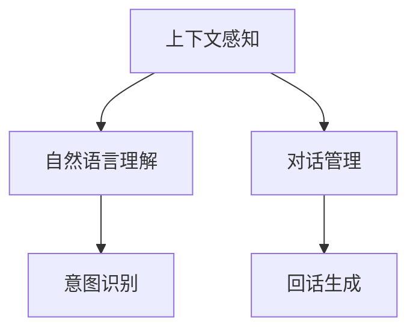

                 

# 上下文感知：保持聊天连贯性

> 关键词：上下文感知, 自然语言处理, 聊天机器人, 连贯性, 意图理解, 对话管理

## 1. 背景介绍

### 1.1 问题由来

随着人工智能技术的发展，越来越多的企业和机构希望构建智能聊天机器人，以提升客户服务质量和用户体验。然而，尽管现有的聊天机器人技术在自然语言理解、意图识别等方面已经取得了显著进展，但在实际应用中，仍存在着上下文感知能力不足的问题。

当机器人与用户进行对话时，如何理解用户的上下文，并保持对话的连贯性，是实现高质量聊天的关键。在实际对话过程中，用户输入往往包含隐含的语境信息和上下文信息，机器人的回答需要综合考虑之前的对话内容，才能提供准确的响应。

### 1.2 问题核心关键点

保持聊天连贯性的核心关键点包括以下几点：

- **上下文感知**：在对话过程中，机器需要理解用户当前的意图和之前的对话内容，以便生成合理的回答。
- **对话管理**：机器人需要能够管理对话的流程，确保对话的顺利进行，并适时引导话题。
- **意图理解**：机器人需要准确理解用户的意图，以避免误解或错误回答。
- **回话生成**：根据上下文和用户意图，机器人需要生成自然流畅的回答，让用户感到自然和亲切。

这些关键点共同构成了聊天机器人的核心能力，使其能够提供高质量的互动体验。

### 1.3 问题研究意义

实现上下文感知的聊天机器人，对于提升客户服务质量和用户体验具有重要意义：

- **提升服务质量**：通过理解上下文，机器人能够提供更加准确和个性化的响应，提升用户满意度。
- **增强用户互动**：上下文感知的机器人能够更好地与用户互动，保持对话的连贯性，提升用户体验。
- **降低人工成本**：聊天机器人可以24小时无间断地提供服务，减少人工客服的负担，降低运营成本。
- **支持个性化服务**：上下文感知的机器人可以根据用户的过往行为和偏好，提供个性化的推荐和服务。

## 2. 核心概念与联系

### 2.1 核心概念概述

为了更好地理解上下文感知的聊天机器人，本节将介绍几个密切相关的核心概念：

- **上下文感知(Context-Awareness)**：指机器人在进行对话时，能够理解并记住之前对话的上下文信息，以提供更加相关和连贯的回应。
- **自然语言理解(NLU)**：指机器理解自然语言的语义和语法，能够从用户输入中提取关键信息。
- **对话管理(Dialogue Management)**：指机器人管理对话流程，确保对话的顺利进行，并适时引导话题。
- **意图识别(Intent Recognition)**：指机器人识别用户的意图，从而提供符合用户需求的回应。
- **回话生成(Response Generation)**：指机器人根据上下文和用户意图，生成自然流畅的回答。

这些核心概念之间的逻辑关系可以通过以下Mermaid流程图来展示：



这个流程图展示了一系列关键组件及其相互关系：

1. 上下文感知：机器人在对话过程中能够理解并记住上下文信息。
2. 自然语言理解：从用户输入中提取关键信息，并理解其语义。
3. 对话管理：管理对话流程，确保对话的顺利进行，并适时引导话题。
4. 意图识别：识别用户的意图，从而提供符合用户需求的回应。
5. 回话生成：根据上下文和用户意图，生成自然流畅的回答。

这些组件共同构成了上下文感知的聊天机器人的核心能力，使其能够提供高质量的互动体验。

## 3. 核心算法原理 & 具体操作步骤
### 3.1 算法原理概述

上下文感知的聊天机器人算法原理主要包括三个部分：上下文管理、意图识别和回话生成。以下是对每个部分的详细解释：

1. **上下文管理**：通过维护对话历史，记录对话过程中用户的输入和机器的回应，利用上下文信息指导后续回应。
2. **意图识别**：使用机器学习模型，如逻辑回归、决策树、神经网络等，对用户的输入进行分析，识别出用户的意图。
3. **回话生成**：根据上下文和用户意图，生成自然流畅的回答。可以使用预训练的语言模型，如BERT、GPT等，结合模板填充和样式生成等技术，提升回答质量。

### 3.2 算法步骤详解

基于上下文感知的聊天机器人一般包括以下几个关键步骤：

**Step 1: 准备数据集和模型**

- 收集对话数据集，包括用户输入和机器回应，进行预处理和标注。
- 选择合适的预训练语言模型，如BERT、GPT等，作为对话管理的初始化参数。

**Step 2: 上下文管理**

- 在对话过程中，维护对话历史，记录用户的输入和机器的回应。
- 利用上下文信息，通过LSTM、GRU等循环神经网络模型，更新对话历史的状态。

**Step 3: 意图识别**

- 使用逻辑回归、决策树、神经网络等模型，对用户的输入进行分析，识别出用户的意图。
- 将意图识别模型集成到对话管理框架中，使其能够根据用户的意图进行相应的对话管理。

**Step 4: 回话生成**

- 使用预训练的语言模型，如BERT、GPT等，对用户的输入和对话历史进行编码，生成自然流畅的回答。
- 可以使用模板填充和样式生成等技术，提升回答质量。

**Step 5: 模型评估和优化**

- 使用BLEU、ROUGE等评价指标，评估模型的对话质量。
- 根据评估结果，调整模型参数，优化模型性能。

以上是基于上下文感知的聊天机器人的一般流程。在实际应用中，还需要针对具体任务的特点，对各个环节进行优化设计，如改进意图识别模型，引入更多的上下文信息，搜索最优的超参数组合等，以进一步提升模型性能。

### 3.3 算法优缺点

基于上下文感知的聊天机器人具有以下优点：

1. **提升用户体验**：通过上下文感知，机器人能够提供更加相关和连贯的回应，提升用户体验。
2. **支持多种对话场景**：上下文感知的机器人能够支持多种对话场景，包括客服、咨询、娱乐等。
3. **降低人工成本**：通过自动化对话管理，机器人可以24小时无间断地提供服务，减少人工客服的负担。

同时，该方法也存在一定的局限性：

1. **数据依赖性**：上下文感知的机器人需要大量的对话数据进行训练，数据获取和标注成本较高。
2. **模型复杂性**：上下文感知的机器人需要维护对话历史，并使用复杂的模型进行意图识别和回话生成，计算资源消耗较大。
3. **泛化能力不足**：在新的对话场景中，模型可能无法很好地适应，需要重新训练或调整模型参数。
4. **可解释性不足**：上下文感知的机器人通常被视为"黑盒"系统，难以解释其内部工作机制和决策逻辑。

尽管存在这些局限性，但就目前而言，上下文感知的聊天机器人算法仍是自然语言处理领域的重要范式。未来相关研究的重点在于如何进一步降低数据依赖，提高模型的泛化能力和可解释性，同时兼顾性能和效率等因素。

### 3.4 算法应用领域

基于上下文感知的聊天机器人的应用领域非常广泛，例如：

- **客服对话**：利用上下文感知的机器人进行客服对话，能够提供更加个性化和高效的服务。
- **咨询服务**：在金融、医疗等行业，利用上下文感知的机器人进行咨询，能够提升咨询质量和效率。
- **智能助手**：在智能家居、智能车载等领域，利用上下文感知的机器人提供信息查询、日程管理等服务。
- **娱乐交互**：在游戏、社交等领域，利用上下文感知的机器人进行互动和娱乐，提升用户体验。

除了上述这些经典应用外，上下文感知的机器人还被创新性地应用到更多场景中，如在线教育、智能物流等，为各行各业带来新的智能解决方案。

## 4. 数学模型和公式 & 详细讲解
### 4.1 数学模型构建

在上下文感知的聊天机器人中，常见的数学模型包括循环神经网络(RNN)、长短时记忆网络(LSTM)、门控循环单元(GRU)等。以下以LSTM为例，构建数学模型。

假设对话历史为 $\{h_t\}_{t=1}^T$，用户输入为 $x_t$，机器回应为 $y_t$。LSTM的隐藏状态 $h_t$ 可以表示为：

$$
h_t = \text{LSTM}(h_{t-1}, x_t)
$$

其中，$h_{t-1}$ 为上一时刻的隐藏状态，$x_t$ 为用户输入，$\text{LSTM}$ 为LSTM模型。

### 4.2 公式推导过程

在LSTM模型中，隐藏状态 $h_t$ 由输入 $x_t$ 和上一时刻的隐藏状态 $h_{t-1}$ 更新，更新公式如下：

$$
\begin{aligned}
i_t &= \sigma(W_i x_t + U_i h_{t-1} + b_i) \\
f_t &= \sigma(W_f x_t + U_f h_{t-1} + b_f) \\
o_t &= \sigma(W_o x_t + U_o h_{t-1} + b_o) \\
g_t &= \tanh(W_g x_t + U_g h_{t-1} + b_g) \\
h_t &= f_t \odot h_{t-1} + i_t \odot g_t
\end{aligned}
$$

其中，$i_t$、$f_t$、$o_t$ 和 $g_t$ 分别为输入门、遗忘门、输出门和候选门。$W_i$、$U_i$、$W_f$、$U_f$、$W_o$、$U_o$、$W_g$、$U_g$ 为相应的权重矩阵，$b_i$、$b_f$、$b_o$、$b_g$ 为偏置项，$\odot$ 表示点乘。

通过LSTM模型，机器能够维护对话历史，并根据上下文信息更新对话状态，从而提供更加连贯的回应。

### 4.3 案例分析与讲解

以客户服务对话为例，分析上下文感知的机器人如何工作。假设客户A在客服机器人上进行咨询，对话历史如下：

```
客户A: 我想查询我的账户余额
客服机器人: 请提供您的账户信息
客户A: 我的账户号是123456789
客服机器人: 您的账户余额为1000元
客户A: 太好了，还需要查询我的消费记录
```

在对话过程中，客服机器人通过维护对话历史，理解客户A的意图，并根据上下文信息生成回应。具体实现步骤如下：

1. 维护对话历史：在对话开始时，客服机器人初始化对话历史为空。在对话过程中，每次收到客户输入时，记录输入和对应的机器回应，更新对话历史。
2. 意图识别：在收到客户输入后，客服机器人使用意图识别模型，识别出客户A的意图为查询余额。
3. 回话生成：根据客户A的意图和对话历史，客服机器人使用预训练的语言模型，生成回应“请提供您的账户信息”。
4. 回话生成：在收到客户A的账户信息后，客服机器人使用预训练的语言模型，生成回应“您的账户余额为1000元”。
5. 回话生成：在收到客户A的下一请求时，客服机器人根据对话历史和用户意图，生成回应“太好了，还需要查询我的消费记录”。

通过以上步骤，客服机器人能够理解并记住上下文信息，从而提供更加相关和连贯的回应，提升用户体验。

## 5. 项目实践：代码实例和详细解释说明
### 5.1 开发环境搭建

在进行上下文感知的聊天机器人开发前，我们需要准备好开发环境。以下是使用Python进行TensorFlow开发的环境配置流程：

1. 安装Anaconda：从官网下载并安装Anaconda，用于创建独立的Python环境。

2. 创建并激活虚拟环境：
```bash
conda create -n chatbot-env python=3.8 
conda activate chatbot-env
```

3. 安装TensorFlow：根据CUDA版本，从官网获取对应的安装命令。例如：
```bash
conda install tensorflow -c pytorch -c conda-forge
```

4. 安装各类工具包：
```bash
pip install numpy pandas scikit-learn matplotlib tqdm jupyter notebook ipython
```

完成上述步骤后，即可在`chatbot-env`环境中开始开发实践。

### 5.2 源代码详细实现

下面以LSTM模型为例，给出使用TensorFlow对上下文感知的聊天机器人进行开发的Python代码实现。

首先，定义LSTM模型的结构：

```python
import tensorflow as tf
from tensorflow.keras.layers import Input, LSTM, Dense, Embedding

class LSTMChatbot(tf.keras.Model):
    def __init__(self, vocab_size, embedding_dim, rnn_units):
        super(LSTMChatbot, self).__init__()
        self.embedding = Embedding(vocab_size, embedding_dim)
        self.rnn = LSTM(rnn_units, return_sequences=True)
        self.dense = Dense(vocab_size, activation='softmax')

    def call(self, inputs, hidden_state):
        x = self.embedding(inputs)
        x = self.rnn(x, initial_state=hidden_state)
        x = self.dense(x[:, -1, :])
        return x, x
```

然后，定义意图识别和回话生成模块：

```python
class IntentClassifier(tf.keras.Model):
    def __init__(self, vocab_size, embedding_dim, rnn_units):
        super(IntentClassifier, self).__init__()
        self.embedding = Embedding(vocab_size, embedding_dim)
        self.rnn = LSTM(rnn_units, return_sequences=True)
        self.dense = Dense(1, activation='sigmoid')

    def call(self, inputs, hidden_state):
        x = self.embedding(inputs)
        x = self.rnn(x, initial_state=hidden_state)
        x = self.dense(x[:, -1, :])
        return x

class ResponseGenerator(tf.keras.Model):
    def __init__(self, vocab_size, embedding_dim, rnn_units):
        super(ResponseGenerator, self).__init__()
        self.embedding = Embedding(vocab_size, embedding_dim)
        self.rnn = LSTM(rnn_units, return_sequences=True)
        self.dense = Dense(vocab_size, activation='softmax')

    def call(self, inputs, hidden_state):
        x = self.embedding(inputs)
        x = self.rnn(x, initial_state=hidden_state)
        x = self.dense(x[:, -1, :])
        return x
```

最后，定义对话管理模块：

```python
class Chatbot(tf.keras.Model):
    def __init__(self, vocab_size, embedding_dim, rnn_units):
        super(Chatbot, self).__init__()
        self.embedding = Embedding(vocab_size, embedding_dim)
        self.rnn = LSTM(rnn_units, return_sequences=True)
        self.dense = Dense(vocab_size, activation='softmax')
        self.intent_classifier = IntentClassifier(vocab_size, embedding_dim, rnn_units)
        self.response_generator = ResponseGenerator(vocab_size, embedding_dim, rnn_units)

    def call(self, inputs, hidden_state):
        x = self.embedding(inputs)
        x, hidden_state = self.rnn(x, initial_state=hidden_state)
        intent = self.intent_classifier(x, hidden_state)
        response = self.response_generator(x, hidden_state)
        return intent, response, hidden_state
```

以上代码实现了基于LSTM的上下文感知的聊天机器人模型。模型包括嵌入层、LSTM层、意图识别层和回话生成层。对话管理模块通过维护对话历史，利用LSTM模型更新对话状态，并根据上下文信息生成回应。

### 5.3 代码解读与分析

让我们再详细解读一下关键代码的实现细节：

**LSTMChatbot类**：
- `__init__`方法：初始化嵌入层、LSTM层和输出层。
- `call`方法：对输入进行前向传播，计算意图和回应。

**IntentClassifier类**：
- `__init__`方法：初始化嵌入层、LSTM层和输出层。
- `call`方法：对输入进行前向传播，计算意图。

**ResponseGenerator类**：
- `__init__`方法：初始化嵌入层、LSTM层和输出层。
- `call`方法：对输入进行前向传播，生成回应。

**Chatbot类**：
- `__init__`方法：初始化嵌入层、LSTM层、意图识别层和回话生成层。
- `call`方法：对输入进行前向传播，计算意图和回应，并更新隐藏状态。

可以看到，TensorFlow提供了便捷的Keras API，使得模型的构建和训练过程非常简洁。开发者可以将更多精力放在模型改进、数据处理等高层逻辑上，而不必过多关注底层实现细节。

当然，工业级的系统实现还需考虑更多因素，如模型的保存和部署、超参数的自动搜索、更灵活的任务适配层等。但核心的对话管理算法基本与此类似。

## 6. 实际应用场景
### 6.1 智能客服系统

基于上下文感知的聊天机器人可以广泛应用于智能客服系统的构建。传统客服往往需要配备大量人力，高峰期响应缓慢，且一致性和专业性难以保证。而使用上下文感知的聊天机器人，可以7x24小时不间断服务，快速响应客户咨询，用自然流畅的语言解答各类常见问题。

在技术实现上，可以收集企业内部的历史客服对话记录，将问题和最佳答复构建成监督数据，在此基础上对预训练模型进行微调。微调后的聊天机器人能够自动理解用户意图，匹配最合适的答案模板进行回复。对于客户提出的新问题，还可以接入检索系统实时搜索相关内容，动态组织生成回答。如此构建的智能客服系统，能大幅提升客户咨询体验和问题解决效率。

### 6.2 金融舆情监测

金融机构需要实时监测市场舆论动向，以便及时应对负面信息传播，规避金融风险。传统的人工监测方式成本高、效率低，难以应对网络时代海量信息爆发的挑战。基于上下文感知的文本分类和情感分析技术，为金融舆情监测提供了新的解决方案。

具体而言，可以收集金融领域相关的新闻、报道、评论等文本数据，并对其进行主题标注和情感标注。在此基础上对预训练语言模型进行微调，使其能够自动判断文本属于何种主题，情感倾向是正面、中性还是负面。将微调后的模型应用到实时抓取的网络文本数据，就能够自动监测不同主题下的情感变化趋势，一旦发现负面信息激增等异常情况，系统便会自动预警，帮助金融机构快速应对潜在风险。

### 6.3 个性化推荐系统

当前的推荐系统往往只依赖用户的历史行为数据进行物品推荐，无法深入理解用户的真实兴趣偏好。基于上下文感知的推荐系统可以更好地挖掘用户行为背后的语义信息，从而提供更精准、多样的推荐内容。

在实践中，可以收集用户浏览、点击、评论、分享等行为数据，提取和用户交互的物品标题、描述、标签等文本内容。将文本内容作为模型输入，用户的后续行为（如是否点击、购买等）作为监督信号，在此基础上微调预训练语言模型。微调后的模型能够从文本内容中准确把握用户的兴趣点。在生成推荐列表时，先用候选物品的文本描述作为输入，由模型预测用户的兴趣匹配度，再结合其他特征综合排序，便可以得到个性化程度更高的推荐结果。

### 6.4 未来应用展望

随着上下文感知的聊天机器人技术的发展，基于微调的方法将在更多领域得到应用，为各行各业带来变革性影响。

在智慧医疗领域，基于上下文感知的医疗问答、病历分析、药物研发等应用将提升医疗服务的智能化水平，辅助医生诊疗，加速新药开发进程。

在智能教育领域，上下文感知的聊天机器人可应用于作业批改、学情分析、知识推荐等方面，因材施教，促进教育公平，提高教学质量。

在智慧城市治理中，上下文感知的聊天机器人可应用于城市事件监测、舆情分析、应急指挥等环节，提高城市管理的自动化和智能化水平，构建更安全、高效的未来城市。

此外，在企业生产、社会治理、文娱传媒等众多领域，基于上下文感知的聊天机器人将被创新性地应用到更多场景中，为各行各业带来新的智能解决方案。相信随着技术的日益成熟，上下文感知的聊天机器人必将在构建人机协同的智能时代中扮演越来越重要的角色。

## 7. 工具和资源推荐
### 7.1 学习资源推荐

为了帮助开发者系统掌握上下文感知的聊天机器人技术，这里推荐一些优质的学习资源：

1. 《深度学习》（Ian Goodfellow等著）：深度学习领域的经典教材，涵盖机器学习、深度学习的基本概念和算法，适合初学者和进阶者学习。

2. 《自然语言处理综述》（Daniel Jurafsky等著）：自然语言处理领域的权威教材，涵盖NLP的基本概念、技术和应用，适合进阶学习。

3. 《TensorFlow实战自然语言处理》（Zhiling Yu等著）：TensorFlow在NLP领域的应用指南，涵盖预训练模型、意图识别、对话管理等内容，适合实践学习。

4. Coursera《自然语言处理专项课程》：斯坦福大学开设的NLP课程，涵盖NLP的基本概念和前沿技术，适合系统学习。

5. Kaggle《NLP挑战赛》：Kaggle平台上的NLP比赛，提供实际数据集和任务，适合实战练习。

通过对这些资源的学习实践，相信你一定能够快速掌握上下文感知的聊天机器人技术的精髓，并用于解决实际的NLP问题。
###  7.2 开发工具推荐

高效的开发离不开优秀的工具支持。以下是几款用于上下文感知的聊天机器人开发的常用工具：

1. TensorFlow：由Google主导开发的开源深度学习框架，生产部署方便，适合大规模工程应用。提供了Keras API，便于模型构建和训练。

2. PyTorch：基于Python的开源深度学习框架，灵活动态的计算图，适合快速迭代研究。

3. NLTK：Python自然语言处理库，提供了丰富的NLP工具和数据集，适合文本处理和分析。

4. spaCy：Python自然语言处理库，提供了高效的语言处理工具和预训练模型，适合构建上下文感知的聊天机器人。

5. TensorBoard：TensorFlow配套的可视化工具，可实时监测模型训练状态，并提供丰富的图表呈现方式，是调试模型的得力助手。

6. Weights & Biases：模型训练的实验跟踪工具，可以记录和可视化模型训练过程中的各项指标，方便对比和调优。

合理利用这些工具，可以显著提升上下文感知的聊天机器人开发的效率，加快创新迭代的步伐。

### 7.3 相关论文推荐

上下文感知的聊天机器人技术的发展得益于学界的持续研究。以下是几篇奠基性的相关论文，推荐阅读：

1. Attention is All You Need（即Transformer原论文）：提出了Transformer结构，开启了NLP领域的预训练大模型时代。

2. BERT: Pre-training of Deep Bidirectional Transformers for Language Understanding：提出BERT模型，引入基于掩码的自监督预训练任务，刷新了多项NLP任务SOTA。

3. Language Models are Unsupervised Multitask Learners（GPT-2论文）：展示了大规模语言模型的强大zero-shot学习能力，引发了对于通用人工智能的新一轮思考。

4. Modeling Contextual Conversations with Recurrent Neural Networks：提出了基于RNN的对话管理模型，奠定了上下文感知的聊天机器人技术的基础。

5. Attention-Based Models for Dialogue Generation：提出了基于Attention的对话生成模型，提升了对话生成的质量。

这些论文代表了大语言模型微调技术的发展脉络。通过学习这些前沿成果，可以帮助研究者把握学科前进方向，激发更多的创新灵感。

## 8. 总结：未来发展趋势与挑战
### 8.1 研究成果总结

本文对基于上下文感知的聊天机器人技术进行了全面系统的介绍。首先阐述了上下文感知技术的研究背景和意义，明确了上下文感知在对话管理、意图识别和回话生成中的重要作用。其次，从原理到实践，详细讲解了上下文感知的数学模型和算法步骤，给出了上下文感知的聊天机器人代码实现。同时，本文还广泛探讨了上下文感知技术在智能客服、金融舆情、个性化推荐等场景中的应用前景，展示了上下文感知技术的巨大潜力。

通过本文的系统梳理，可以看到，上下文感知的聊天机器人技术正在成为NLP领域的重要范式，极大地拓展了预训练语言模型的应用边界，催生了更多的落地场景。得益于大规模语料的预训练，上下文感知的机器人能够提供高质量的互动体验，有望在各行各业中广泛应用。

### 8.2 未来发展趋势

展望未来，上下文感知的聊天机器人技术将呈现以下几个发展趋势：

1. **模型规模持续增大**：随着算力成本的下降和数据规模的扩张，预训练语言模型的参数量还将持续增长。超大规模语言模型蕴含的丰富语言知识，有望支撑更加复杂多变的对话管理任务。

2. **上下文感知能力提升**：未来上下文感知的机器人将能够更好地理解上下文信息，生成更加连贯和自然的回答。

3. **多模态融合**：未来的上下文感知的机器人不仅能够理解文本信息，还能够整合视觉、语音等多模态信息，提升对现实世界的理解和建模能力。

4. **模型训练与优化**：上下文感知的机器人需要不断优化训练策略，提高模型的泛化能力和鲁棒性。

5. **实时部署与优化**：上下文感知的机器人需要在实时部署中进行优化，通过在线学习、对抗训练等技术，提升模型的稳定性和安全性。

6. **伦理与社会影响**：在开发和应用上下文感知的机器人时，需要考虑其伦理和社会影响，确保其符合社会价值观和伦理道德。

以上趋势凸显了上下文感知的聊天机器人技术的广阔前景。这些方向的探索发展，必将进一步提升上下文感知的机器人性能和应用范围，为构建人机协同的智能时代带来新的机遇。

### 8.3 面临的挑战

尽管上下文感知的聊天机器人技术已经取得了显著进展，但在迈向更加智能化、普适化应用的过程中，仍面临诸多挑战：

1. **数据依赖性**：上下文感知的机器人需要大量的对话数据进行训练，数据获取和标注成本较高。

2. **模型复杂性**：上下文感知的机器人需要维护对话历史，并使用复杂的模型进行对话管理，计算资源消耗较大。

3. **泛化能力不足**：在新的对话场景中，模型可能无法很好地适应，需要重新训练或调整模型参数。

4. **可解释性不足**：上下文感知的机器人通常被视为"黑盒"系统，难以解释其内部工作机制和决策逻辑。

5. **鲁棒性和安全性**：上下文感知的机器人可能面临恶意攻击，需要设计鲁棒的安全机制，确保系统的稳定性和安全性。

6. **伦理和社会影响**：在开发和应用上下文感知的机器人时，需要考虑其伦理和社会影响，确保其符合社会价值观和伦理道德。

尽管存在这些挑战，但上下文感知的聊天机器人技术在持续优化和改进中，未来必将在更多领域得到应用，为各行各业带来新的变革。

### 8.4 研究展望

面对上下文感知的聊天机器人所面临的挑战，未来的研究需要在以下几个方面寻求新的突破：

1. **数据生成与增强**：探索如何利用生成对抗网络（GAN）等技术，生成更多的对话数据，提高模型的泛化能力。

2. **模型优化与压缩**：开发更加高效的上下文感知的机器人模型，通过剪枝、量化、蒸馏等技术，优化模型性能，降低计算资源消耗。

3. **多模态融合与增强**：研究如何将视觉、语音等多模态信息与文本信息进行融合，提升上下文感知的机器人对现实世界的理解和建模能力。

4. **在线学习与实时优化**：研究如何在实际对话中进行在线学习，实时更新模型参数，提高系统的稳定性和鲁棒性。

5. **伦理与安全性**：研究如何在上下文感知的机器人中引入伦理和社会影响，确保其符合社会价值观和伦理道德。

这些研究方向的探索，必将引领上下文感知的聊天机器人技术迈向更高的台阶，为构建安全、可靠、可解释、可控的智能系统铺平道路。面向未来，上下文感知的聊天机器人技术还需要与其他人工智能技术进行更深入的融合，如知识表示、因果推理、强化学习等，多路径协同发力，共同推动自然语言理解和智能交互系统的进步。只有勇于创新、敢于突破，才能不断拓展语言模型的边界，让智能技术更好地造福人类社会。

## 9. 附录：常见问题与解答

**Q1：上下文感知的聊天机器人是否适用于所有NLP任务？**

A: 上下文感知的聊天机器人主要应用于对话场景，但在一些需要理解上下文的场景，如问答系统、信息检索等，也有广泛应用。但对于一些特定领域的任务，如医学、法律等，仅仅依靠通用语料预训练的模型可能难以很好地适应。此时需要在特定领域语料上进一步预训练，再进行微调，才能获得理想效果。

**Q2：上下文感知的聊天机器人如何处理长对话？**

A: 上下文感知的聊天机器人通常通过维护对话历史，记录对话过程中用户的输入和机器的回应，利用上下文信息指导后续回应。对于长对话，可以通过增加对话历史长度，或者使用更复杂的上下文管理模型（如GRU、Transformer等），来提高对话连贯性。

**Q3：上下文感知的聊天机器人如何处理新用户？**

A: 在处理新用户时，上下文感知的聊天机器人通常需要重新训练或者使用预定义的默认模板。为了提高新用户的体验，可以在对话开始时，向用户简要介绍系统的功能和限制，并提供一些预设的对话选项，引导用户逐步适应。

**Q4：上下文感知的聊天机器人如何处理噪声数据？**

A: 在对话中，噪声数据是不可避免的，上下文感知的聊天机器人需要具备一定的鲁棒性。可以通过引入对抗训练、数据清洗、模型泛化等技术，来提升机器人的抗干扰能力。此外，可以通过多轮对话来逐步验证用户的意图，提高对话质量。

**Q5：上下文感知的聊天机器人如何处理多轮对话？**

A: 多轮对话是上下文感知聊天机器人的核心任务之一。通常通过对话历史和上下文管理模型，来维护对话状态，并根据上下文信息生成回应。在多轮对话中，可以通过引入对话管理策略（如记忆、状态转移等），来提高对话连贯性。

通过以上分析，可以看到，上下文感知的聊天机器人技术在保持对话连贯性方面具有重要价值，能够提升用户体验，支持多种对话场景。尽管在实际应用中仍面临诸多挑战，但随着技术的不断进步和优化，上下文感知的聊天机器人必将在更多领域得到广泛应用，带来新的变革和机遇。

