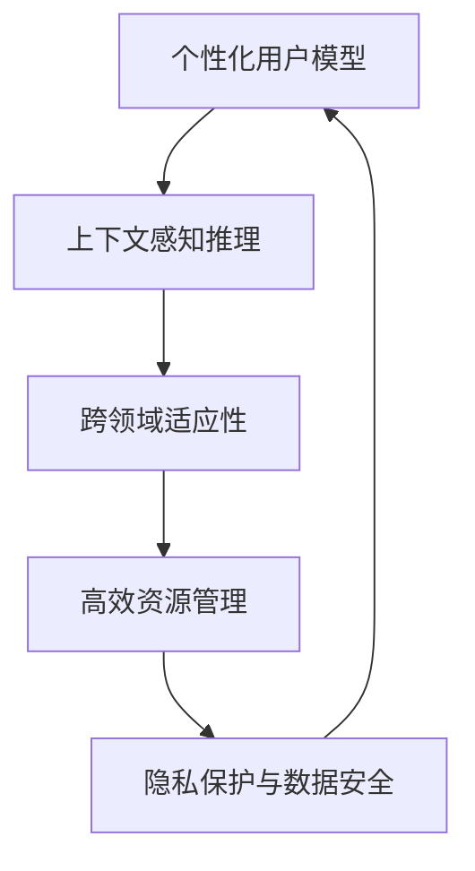

                 

# 个性化AI：适应不同用户需求的智能系统

在数字化时代，人工智能(AI)技术已成为推动社会进步和产业升级的关键力量。然而，传统的通用AI系统往往难以适应不同的用户需求，缺乏对个性化需求的快速响应和定制化支持。为解决这一问题，个性化AI（Personalized AI）技术应运而生，旨在通过智能系统对用户行为的深度分析和理解，提供量身定制的解决方案，从而极大地提升用户体验和应用价值。

## 1. 背景介绍

### 1.1 问题由来

随着AI技术在各行各业的广泛应用，用户对AI系统的期望和需求也在不断提升。传统的通用AI系统，如语音助手、推荐系统、智能客服等，虽然在大多数场景下都能提供一定程度的帮助，但在处理个性化需求时，往往显得力不从心。主要原因有以下几点：

1. **缺乏情境感知能力**：现有系统大多依赖静态的规则和模板，难以捕捉动态变化的用户情境和需求，导致输出结果与用户实际需求存在偏差。
2. **模型泛化能力不足**：通用AI模型通常在大规模数据集上进行训练，虽然能够涵盖多种常见场景，但在面对特定领域或小数据集时，泛化能力受到限制，难以提供高精度的定制化服务。
3. **数据隐私与安全问题**：在收集和处理用户数据时，如何平衡数据隐私保护和模型训练需求，是一个亟待解决的重要问题。

### 1.2 问题核心关键点

为了解决上述问题，个性化AI技术需要在以下关键点上进行突破：

1. **个性化用户建模**：通过收集用户行为数据，构建个性化用户模型，深入理解用户的偏好、习惯和需求。
2. **上下文感知推理**：在处理任务时，能够动态地分析上下文信息，结合用户模型，提供更加精准和智能的响应。
3. **隐私保护与数据安全**：在处理用户数据时，确保数据的隐私保护和合法使用，建立用户信任。
4. **跨领域适应性**：构建具有广泛适应性的模型，能够处理多种不同领域的任务，提升应用范围。
5. **高效资源管理**：在保证系统性能的前提下，合理管理计算资源，提升响应速度和服务质量。

## 2. 核心概念与联系

### 2.1 核心概念概述

为了更好地理解个性化AI技术的核心概念，本文将介绍以下几个关键概念：

- **个性化用户模型**：通过收集用户行为数据，构建用户兴趣、行为习惯等特征的模型，用于指导后续推荐、内容生成等任务。
- **上下文感知推理**：在处理任务时，能够动态地分析上下文信息，结合用户模型，提供更加精准和智能的响应。
- **隐私保护与数据安全**：在处理用户数据时，确保数据的隐私保护和合法使用，建立用户信任。
- **跨领域适应性**：构建具有广泛适应性的模型，能够处理多种不同领域的任务，提升应用范围。
- **高效资源管理**：在保证系统性能的前提下，合理管理计算资源，提升响应速度和服务质量。

这些核心概念之间的逻辑关系可以通过以下Mermaid流程图来展示：



这个流程图展示了个性化AI的核心概念及其之间的关系：

1. 个性化用户模型为上下文感知推理提供基础。
2. 上下文感知推理利用用户模型，结合任务上下文，提供精准的智能响应。
3. 跨领域适应性扩展模型的应用范围，使其适用于更多场景。
4. 隐私保护与数据安全确保用户数据的安全性，建立用户信任。
5. 高效资源管理优化系统性能，提升服务质量。

## 3. 核心算法原理 & 具体操作步骤
### 3.1 算法原理概述

个性化AI技术的核心算法原理主要围绕以下几个方面展开：

1. **个性化用户建模**：通过收集和分析用户行为数据，构建用户兴趣、行为习惯等特征的模型。
2. **上下文感知推理**：结合用户模型和任务上下文，动态分析输入数据，生成精准的智能响应。
3. **隐私保护与数据安全**：采用差分隐私、联邦学习等技术，确保用户数据的安全和隐私保护。
4. **跨领域适应性**：通过迁移学习和领域自适应算法，提升模型在不同领域上的适应性。
5. **高效资源管理**：优化模型的计算图，采用模型裁剪、量化加速等技术，提升系统的推理效率。

### 3.2 算法步骤详解

以下是一个基于个性化AI技术的推荐系统的具体算法步骤：

1. **数据收集与预处理**：收集用户的历史行为数据，包括浏览记录、购买历史、评分信息等，进行清洗和预处理。
2. **用户模型构建**：使用协同过滤、深度学习等方法，构建用户兴趣和行为习惯的模型。
3. **上下文感知推理**：对当前用户输入的请求进行语义分析和上下文推理，结合用户模型，生成推荐结果。
4. **推荐结果排序**：使用深度学习模型对推荐结果进行排序，输出最终推荐列表。
5. **隐私保护与数据安全**：采用差分隐私技术，保护用户隐私。

### 3.3 算法优缺点

个性化AI技术在提升用户体验和应用价值方面具有以下优点：

- **精准度提升**：通过个性化用户建模和上下文感知推理，推荐结果更加贴近用户实际需求，提升系统精准度。
- **用户体验优化**：结合用户行为和偏好，提供量身定制的推荐和服务，提升用户体验。
- **跨领域应用**：通过跨领域适应性算法，提升模型在不同领域上的表现，扩展应用范围。

同时，该技术也存在一定的局限性：

- **数据隐私问题**：在收集和处理用户数据时，如何平衡数据隐私保护和模型训练需求，是一个亟待解决的重要问题。
- **模型复杂度**：构建和维护复杂的用户模型和上下文推理机制，增加了系统的复杂度和维护成本。
- **资源消耗**：个性化AI系统通常需要大量的计算资源，推理速度较慢，可能影响用户响应时间。

### 3.4 算法应用领域

个性化AI技术已经在多个领域得到了广泛的应用，例如：

- **电子商务推荐**：根据用户浏览和购买历史，提供个性化的商品推荐，提升用户购买转化率。
- **内容生成与推荐**：分析用户阅读和观看行为，推荐相关文章、视频等内容，提升用户满意度。
- **智能客服**：结合用户历史交互记录和当前问题，提供个性化的解答，提升用户服务体验。
- **医疗健康**：根据用户健康数据，提供个性化的健康建议和治疗方案，提升健康管理效果。

除了上述这些经典应用外，个性化AI技术还在更多场景中得到创新性的应用，如智慧旅游、智能家居、金融风控等，为各行各业带来了新的突破。

## 4. 数学模型和公式 & 详细讲解  
### 4.1 数学模型构建

本节将使用数学语言对个性化AI技术的推荐系统进行更加严格的刻画。

记用户行为数据集为 $D=\{(x_i,y_i)\}_{i=1}^N$，其中 $x_i$ 为输入，如浏览记录、评分等；$y_i$ 为输出，如评分、点击等。假设用户模型为 $M_{\theta}$，其中 $\theta$ 为用户模型的参数。推荐系统推荐结果为 $z_i$，假设推荐结果与用户行为之间的关系为 $z_i = f(x_i, M_{\theta})$。推荐系统的损失函数为 $\mathcal{L}(\theta)$，用于衡量推荐结果与用户实际行为之间的差异。

目标是最小化推荐系统的损失函数，即找到最优参数：

$$
\theta^* = \mathop{\arg\min}_{\theta} \mathcal{L}(\theta)
$$

在实践中，我们通常使用基于梯度的优化算法（如Adam、SGD等）来近似求解上述最优化问题。设 $\eta$ 为学习率，则参数的更新公式为：

$$
\theta \leftarrow \theta - \eta \nabla_{\theta}\mathcal{L}(\theta)
$$

其中 $\nabla_{\theta}\mathcal{L}(\theta)$ 为损失函数对参数 $\theta$ 的梯度，可通过反向传播算法高效计算。

### 4.2 公式推导过程

以下我们以协同过滤推荐系统为例，推导推荐系统的损失函数及其梯度的计算公式。

协同过滤推荐系统基于用户-物品的相似度矩阵 $C \in \mathbb{R}^{N \times M}$，其中 $N$ 为用户的数量，$M$ 为物品的数量。设用户 $i$ 对物品 $j$ 的评分 $r_{ij}$ 为输入 $x_i$，推荐结果 $z_i$ 为输出。假设用户模型为 $M_{\theta}$，则推荐结果可以表示为：

$$
z_i = M_{\theta}(x_i)
$$

推荐系统的损失函数为：

$$
\mathcal{L}(\theta) = \frac{1}{N}\sum_{i=1}^N \sum_{j=1}^M (y_{ij} - z_i)^2
$$

其中 $y_{ij}$ 为用户 $i$ 对物品 $j$ 的真实评分。

根据链式法则，损失函数对参数 $\theta$ 的梯度为：

$$
\frac{\partial \mathcal{L}(\theta)}{\partial \theta} = \frac{2}{N}\sum_{i=1}^N \sum_{j=1}^M (y_{ij} - M_{\theta}(x_i))\nabla_{\theta}M_{\theta}(x_i)
$$

其中 $\nabla_{\theta}M_{\theta}(x_i)$ 为 $M_{\theta}$ 在输入 $x_i$ 上的梯度，可通过自动微分技术完成计算。

在得到损失函数的梯度后，即可带入参数更新公式，完成模型的迭代优化。重复上述过程直至收敛，最终得到适应个性化需求的最优模型参数 $\theta^*$。

## 5. 项目实践：代码实例和详细解释说明
### 5.1 开发环境搭建

在进行个性化AI技术的推荐系统开发前，我们需要准备好开发环境。以下是使用Python进行PyTorch开发的环境配置流程：

1. 安装Anaconda：从官网下载并安装Anaconda，用于创建独立的Python环境。

2. 创建并激活虚拟环境：
```bash
conda create -n pytorch-env python=3.8 
conda activate pytorch-env
```

3. 安装PyTorch：根据CUDA版本，从官网获取对应的安装命令。例如：
```bash
conda install pytorch torchvision torchaudio cudatoolkit=11.1 -c pytorch -c conda-forge
```

4. 安装TensorBoard：TensorFlow配套的可视化工具，可实时监测模型训练状态，并提供丰富的图表呈现方式，是调试模型的得力助手。

5. 安装各类工具包：
```bash
pip install numpy pandas scikit-learn matplotlib tqdm jupyter notebook ipython
```

完成上述步骤后，即可在`pytorch-env`环境中开始个性化AI技术的推荐系统开发。

### 5.2 源代码详细实现

这里我们以协同过滤推荐系统为例，给出使用PyTorch实现的推荐系统代码：

```python
import torch
from torch import nn
from torch.nn import functional as F
from sklearn.metrics.pairwise import cosine_similarity

class协同过滤推荐系统(nn.Module):
    def __init__(self, user_num, item_num, emb_dim=32):
        super(协同过滤推荐系统, self).__init__()
        self.user_num = user_num
        self.item_num = item_num
        self.emb_dim = emb_dim
        
        self.user_emb = nn.Embedding(user_num, emb_dim)
        self.item_emb = nn.Embedding(item_num, emb_dim)
        self.cosine_sim = nn.CosineSimilarity(dim=1, eps=1e-8)

    def forward(self, user, item):
        user_emb = self.user_emb(user)
        item_emb = self.item_emb(item)
        similarity = self.cosine_sim(user_emb, item_emb)
        return similarity

# 假设用户-物品的评分矩阵为C，用户编号为user，物品编号为item
C = torch.randn(100, 100)
user = torch.tensor([0, 1])
item = torch.tensor([0, 1])
model = 协同过滤推荐系统(user_num=100, item_num=100)
output = model(user, item)
```

以上代码展示了协同过滤推荐系统的实现过程。在代码中，我们首先定义了一个包含用户和物品嵌入层的模块，并计算了用户和物品之间的余弦相似度。最后，通过前向传播计算出推荐系统的输出。

### 5.3 代码解读与分析

让我们再详细解读一下关键代码的实现细节：

**协同过滤推荐系统类**：
- `__init__`方法：初始化用户和物品的嵌入层，以及余弦相似度计算模块。
- `forward`方法：计算用户和物品的嵌入表示，并使用余弦相似度计算它们之间的相似度。

**代码运行**：
- 通过定义一个简单的评分矩阵 $C$，以及用户编号和物品编号，来展示推荐系统的输出。

可以看到，PyTorch的自动微分功能使得构建和训练个性化AI推荐系统的代码实现变得简单高效。开发者可以重点关注模型的逻辑设计，而不必过多关注底层的实现细节。

当然，工业级的系统实现还需考虑更多因素，如模型的保存和部署、超参数的自动搜索、更灵活的任务适配层等。但核心的个性化AI推荐系统基本与此类似。

## 6. 实际应用场景
### 6.1 电子商务推荐

基于个性化AI技术的推荐系统，可以广泛应用于电子商务平台的商品推荐。传统推荐系统往往依赖静态的规则和模板，难以捕捉用户动态的浏览和购买行为，导致推荐结果不够精准。而个性化AI推荐系统，通过收集用户的历史行为数据，构建个性化用户模型，能够动态地分析上下文信息，提供更加精准的推荐结果，从而提升用户购物体验和转化率。

在技术实现上，可以收集用户浏览、点击、购买等行为数据，构建用户兴趣模型。利用协同过滤、深度学习等方法，生成个性化的推荐列表，并根据用户反馈和点击行为实时调整推荐策略，提升推荐效果。此外，还可以引入广告推荐、个性化优惠券等功能，进一步提升用户满意度和平台收益。

### 6.2 内容生成与推荐

个性化AI技术在内容生成与推荐中也具有广泛应用。传统的推荐系统通常基于静态的评分数据，难以捕捉用户对内容的真实偏好。而个性化AI推荐系统，通过分析用户的阅读和观看行为，能够动态地生成推荐内容，提升用户的体验和满意度。

在实际应用中，可以收集用户对文章的阅读记录、对视频的观看时间等行为数据，构建用户兴趣模型。利用协同过滤、深度学习等方法，生成个性化的内容推荐列表，并根据用户反馈实时调整推荐策略，提升推荐效果。此外，还可以引入用户反馈机制，动态生成推荐内容，形成良性循环。

### 6.3 智能客服

基于个性化AI技术的智能客服系统，能够更好地理解用户意图，提供个性化解答。传统客服系统通常依赖静态的问答规则和模板，难以处理复杂的多轮对话。而个性化AI智能客服系统，通过收集用户的历史交互记录和当前问题，能够动态地分析上下文信息，生成个性化的回答，提升用户服务体验。

在技术实现上，可以收集用户的历史对话记录，构建用户兴趣和行为习惯模型。利用对话生成模型，生成个性化的回答，并根据用户反馈实时调整模型参数，提升回答质量。此外，还可以引入多轮对话机制，动态生成对话策略，进一步提升用户体验。

### 6.4 未来应用展望

随着个性化AI技术的不断发展，其在更多领域的应用前景将愈发广阔。

在智慧医疗领域，基于个性化AI技术的医疗推荐系统，能够根据用户健康数据，提供个性化的健康建议和治疗方案，提升健康管理效果。

在智能教育领域，基于个性化AI技术的教育推荐系统，能够根据学生的学习行为和兴趣，提供个性化的学习资源和建议，提升学习效果。

在智慧城市治理中，基于个性化AI技术的智能交通系统，能够根据用户的出行偏好和历史数据，提供个性化的出行建议和服务，提升城市管理效率。

此外，在企业生产、社会治理、文娱传媒等众多领域，基于个性化AI技术的智能推荐系统都将得到广泛应用，为各行各业带来新的突破。

## 7. 工具和资源推荐
### 7.1 学习资源推荐

为了帮助开发者系统掌握个性化AI技术的应用原理和实践技巧，这里推荐一些优质的学习资源：

1. 《深度学习入门》系列书籍：由斯坦福大学李飞飞教授等编写，全面介绍了深度学习的基本概念和经典模型。

2. 《机器学习实战》系列书籍：由斯坦福大学Andrew Ng教授等编写，介绍了机器学习的基本原理和实际应用案例。

3. 《Python机器学习》书籍：由 Sebastian Raschka 等编写，介绍了使用Python进行机器学习实践的详细方法和步骤。

4. 《TensorFlow官方文档》：官方文档提供了TensorFlow的详细使用方法和示例代码，是学习TensorFlow的必备资料。

5. HuggingFace官方文档：提供了丰富的预训练语言模型和推荐系统的样例代码，是学习个性化AI推荐系统的有效工具。

通过对这些资源的学习实践，相信你一定能够快速掌握个性化AI推荐系统的实现原理和技巧，并应用于解决实际问题。

### 7.2 开发工具推荐

高效的开发离不开优秀的工具支持。以下是几款用于个性化AI推荐系统开发的常用工具：

1. PyTorch：基于Python的开源深度学习框架，灵活动态的计算图，适合快速迭代研究。大部分预训练语言模型都有PyTorch版本的实现。

2. TensorFlow：由Google主导开发的开源深度学习框架，生产部署方便，适合大规模工程应用。同样有丰富的预训练语言模型资源。

3. Transformers库：HuggingFace开发的NLP工具库，集成了众多SOTA语言模型，支持PyTorch和TensorFlow，是进行个性化AI推荐系统开发的利器。

4. Weights & Biases：模型训练的实验跟踪工具，可以记录和可视化模型训练过程中的各项指标，方便对比和调优。与主流深度学习框架无缝集成。

5. Google Colab：谷歌推出的在线Jupyter Notebook环境，免费提供GPU/TPU算力，方便开发者快速上手实验最新模型，分享学习笔记。

合理利用这些工具，可以显著提升个性化AI推荐系统的开发效率，加快创新迭代的步伐。

### 7.3 相关论文推荐

个性化AI推荐系统的发展源于学界的持续研究。以下是几篇奠基性的相关论文，推荐阅读：

1. Matrix Factorization Techniques for Recommender Systems：提出了基于矩阵分解的推荐系统算法，广泛应用于电子商务推荐中。

2. collaborative filtering for implicit feedback：介绍了协同过滤推荐系统的基本原理和应用。

3. Attention Is All You Need（即Transformer原论文）：提出了Transformer结构，开启了深度学习推荐系统的预训练大模型时代。

4. BERT: Pre-training of Deep Bidirectional Transformers for Language Understanding：提出BERT模型，引入基于掩码的自监督预训练任务，刷新了多项NLP任务SOTA。

5. Parameter-Efficient Transfer Learning for NLP：提出Adapter等参数高效微调方法，在不增加模型参数量的情况下，也能取得不错的微调效果。

6. Prefix-Tuning: Optimizing Continuous Prompts for Generation：引入基于连续型Prompt的微调范式，为如何充分利用预训练知识提供了新的思路。

这些论文代表了个性化AI推荐系统的发展脉络。通过学习这些前沿成果，可以帮助研究者把握学科前进方向，激发更多的创新灵感。

## 8. 总结：未来发展趋势与挑战
### 8.1 总结

本文对基于个性化AI技术的推荐系统进行了全面系统的介绍。首先阐述了个性化AI技术的背景和意义，明确了推荐系统在提升用户体验和应用价值方面的独特价值。其次，从原理到实践，详细讲解了推荐系统的数学原理和关键步骤，给出了推荐系统开发的完整代码实例。同时，本文还广泛探讨了推荐系统在电子商务、内容生成、智能客服等多个领域的应用前景，展示了个性化AI技术的巨大潜力。此外，本文精选了推荐系统的各类学习资源，力求为读者提供全方位的技术指引。

通过本文的系统梳理，可以看到，基于个性化AI技术的推荐系统正在成为智能推荐领域的重要范式，极大地提升了用户推荐体验和应用价值。未来，伴随个性化AI技术的持续演进，推荐系统必将在更广阔的应用领域大放异彩，深刻影响人类的生产生活方式。

### 8.2 未来发展趋势

展望未来，个性化AI推荐系统将呈现以下几个发展趋势：

1. **精准度提升**：通过个性化用户建模和上下文感知推理，推荐结果更加贴近用户实际需求，提升系统精准度。
2. **用户体验优化**：结合用户行为和偏好，提供量身定制的推荐和服务，提升用户体验。
3. **跨领域应用**：通过跨领域适应性算法，提升模型在不同领域上的表现，扩展应用范围。
4. **隐私保护与数据安全**：采用差分隐私、联邦学习等技术，确保用户数据的安全和隐私保护。
5. **高效资源管理**：优化模型的计算图，采用模型裁剪、量化加速等技术，提升系统的推理效率。

以上趋势凸显了个性化AI推荐系统的广阔前景。这些方向的探索发展，必将进一步提升推荐系统的性能和应用范围，为人类生产和生活带来新的价值。

### 8.3 面临的挑战

尽管个性化AI推荐系统已经取得了瞩目成就，但在迈向更加智能化、普适化应用的过程中，它仍面临着诸多挑战：

1. **数据隐私问题**：在收集和处理用户数据时，如何平衡数据隐私保护和模型训练需求，是一个亟待解决的重要问题。
2. **模型复杂度**：构建和维护复杂的用户模型和上下文推理机制，增加了系统的复杂度和维护成本。
3. **资源消耗**：个性化AI推荐系统通常需要大量的计算资源，推理速度较慢，可能影响用户响应时间。
4. **用户多样性**：不同用户的需求和偏好差异较大，单一模型难以满足所有用户的多样化需求。

### 8.4 研究展望

面对个性化AI推荐系统所面临的种种挑战，未来的研究需要在以下几个方面寻求新的突破：

1. **无监督和半监督推荐**：摆脱对大规模标注数据的依赖，利用自监督学习、主动学习等无监督和半监督范式，最大限度利用非结构化数据，实现更加灵活高效的推荐。
2. **跨模态推荐**：结合图像、视频、语音等多模态数据，丰富用户行为特征，提升推荐效果。
3. **强化学习推荐**：利用强化学习算法，优化推荐策略，提升推荐效果和用户体验。
4. **联邦学习**：通过分布式数据训练，保护用户隐私，提升推荐系统的效果和鲁棒性。
5. **深度强化学习**：结合深度学习和强化学习技术，提升推荐系统的智能水平和推荐效果。

这些研究方向的探索，必将引领个性化AI推荐系统走向更高的台阶，为构建更加智能、高效、安全的推荐系统提供新的动力。总之，个性化AI推荐系统需要在数据、算法、工程、业务等多个维度进行全面优化，方能真正实现个性化推荐，提升用户满意度。

