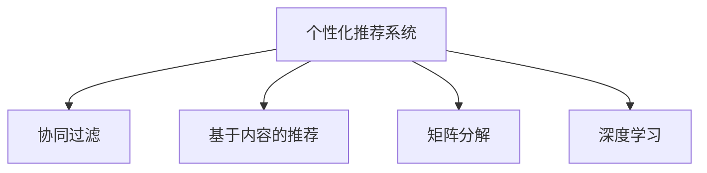

                 

# 个性化体验：适应用户需求

> 关键词：个性化推荐、用户需求分析、机器学习、用户行为预测、数据挖掘、自然语言处理

## 1. 背景介绍

### 1.1 问题由来
随着互联网和智能设备的普及，用户与互联网的互动日益频繁，个性化推荐系统已成为许多应用的核心组成部分。个性化推荐系统旨在通过分析用户行为数据，预测用户未来的兴趣和需求，并据此提供定制化的推荐内容。用户期望从应用中得到独一无二、符合个人兴趣和需求的内容，而非千篇一律的通用推荐。因此，适应用户需求成为了个性化推荐系统设计和优化的核心目标。

### 1.2 问题核心关键点
适应用户需求的核心在于理解用户的行为模式和兴趣偏好，并基于这些信息提供个性化的推荐内容。为达到这一目标，需解决以下几个核心问题：

1. **用户行为数据分析**：如何准确地收集、处理和分析用户的行为数据，提取有用的特征。
2. **用户兴趣模型构建**：如何构建用户兴趣模型，捕捉用户长期和短期的兴趣。
3. **推荐算法设计**：如何设计有效的推荐算法，将用户兴趣模型转化为推荐结果。
4. **推荐效果评估**：如何评估推荐系统的性能，持续优化推荐算法。
5. **跨域数据融合**：如何整合不同来源的数据，提高推荐的准确性和多样性。

本文将从这些问题出发，深入探讨如何通过机器学习技术适应用户需求，并介绍相关算法和实践方法。

## 2. 核心概念与联系

### 2.1 核心概念概述

为更好地理解个性化推荐系统，本节将介绍几个密切相关的核心概念：

- **个性化推荐系统**：根据用户的历史行为数据，推荐个性化内容的应用系统。通过分析用户兴趣和行为，提供符合个人喜好的内容。
- **协同过滤**：一种基于用户-物品关联矩阵的推荐算法，利用用户历史行为构建相似度矩阵，推断其他用户可能喜欢的物品。
- **基于内容的推荐**：根据物品的特征向量，通过计算物品间的相似度，推荐与用户偏好相似的物品。
- **矩阵分解**：通过将用户-物品关联矩阵分解为用户特征矩阵和物品特征矩阵，捕捉用户和物品的隐含特征。
- **深度学习**：一种通过多层神经网络进行特征学习和模式识别的技术，适合处理高维、复杂的数据。

这些核心概念之间的逻辑关系可以通过以下Mermaid流程图来展示：



这个流程图展示了个性化推荐系统的核心概念及其之间的关系：

1. 个性化推荐系统通过协同过滤、基于内容的推荐、矩阵分解和深度学习等多种技术手段，捕捉用户兴趣和物品特征。
2. 协同过滤和基于内容的推荐方法利用用户历史行为和物品特征，构建用户兴趣模型。
3. 矩阵分解和深度学习通过分解关联矩阵和神经网络学习用户和物品的隐含特征，提供更高精度的推荐。

## 3. 核心算法原理 & 具体操作步骤

### 3.1 算法原理概述

个性化推荐系统设计的核心在于构建一个精准、全面的用户兴趣模型，并在此基础上进行推荐。算法原理主要包括以下几个步骤：

1. **数据预处理**：收集用户行为数据，并对数据进行清洗、归一化和特征工程，提取有意义的特征。
2. **用户兴趣模型构建**：利用协同过滤、基于内容的推荐、矩阵分解和深度学习等技术，构建用户兴趣模型。
3. **推荐算法设计**：基于用户兴趣模型，选择合适的推荐算法进行推荐。
4. **推荐效果评估**：使用合适的评估指标（如精确度、召回率、点击率等）对推荐结果进行评估，并根据评估结果优化推荐算法。
5. **跨域数据融合**：整合不同来源的数据，如社交网络信息、图像、文本等，以提高推荐的效果和多样性。

### 3.2 算法步骤详解

以下是详细的操作步骤：

**Step 1: 数据预处理**

- **数据收集**：通过用户行为日志、网页访问记录、社交网络数据等收集用户的行为数据。
- **数据清洗**：过滤掉无效、异常的数据，如不完整的访问记录、时间戳错误等。
- **特征提取**：从行为数据中提取有意义的特征，如浏览时间、点击次数、页面路径等。
- **归一化处理**：对特征进行归一化处理，确保数据在不同特征间具有可比性。

**Step 2: 用户兴趣模型构建**

- **协同过滤**：构建用户-物品关联矩阵，计算用户间的相似度。根据用户历史行为推荐物品。
- **基于内容的推荐**：分析物品的特征，如关键词、分类、属性等，推荐与用户兴趣相似的物品。
- **矩阵分解**：将用户-物品关联矩阵分解为低秩矩阵，学习用户和物品的隐含特征。
- **深度学习**：通过多层神经网络学习用户和物品的特征，捕捉复杂的模式。

**Step 3: 推荐算法设计**

- **基于协同过滤的推荐**：利用用户-物品关联矩阵，通过计算相似度进行推荐。
- **基于内容的推荐**：利用物品特征向量，通过计算相似度进行推荐。
- **基于矩阵分解的推荐**：将用户和物品表示为低秩矩阵，通过矩阵乘法进行推荐。
- **基于深度学习的推荐**：通过多层神经网络进行特征学习和模式识别，提供个性化的推荐。

**Step 4: 推荐效果评估**

- **评估指标**：使用精确度、召回率、F1分数、点击率等评估指标，衡量推荐效果。
- **交叉验证**：通过交叉验证，确保评估结果的可靠性。
- **A/B测试**：进行A/B测试，对比新旧推荐算法的效果。

**Step 5: 跨域数据融合**

- **社交网络数据**：整合社交网络信息，利用用户间的社交关系进行推荐。
- **图像和文本数据**：整合图像和文本数据，利用多媒体信息增强推荐效果。

### 3.3 算法优缺点

个性化推荐系统具有以下优点：

1. **用户满意度提升**：通过提供个性化推荐，提高用户满意度和使用体验。
2. **高推荐效果**：通过多种技术手段，提高推荐的准确性和多样性。
3. **用户黏性增强**：个性化推荐系统通过精准推荐，增强用户对应用的黏性。
4. **数据驱动决策**：通过分析用户行为数据，进行数据驱动的决策。

但同时也存在以下缺点：

1. **数据隐私问题**：收集和分析用户行为数据可能引发隐私问题。
2. **冷启动问题**：新用户没有历史数据，难以进行个性化推荐。
3. **推荐系统偏见**：推荐系统可能存在系统性偏见，导致推荐结果不公。
4. **计算资源消耗大**：推荐算法复杂，需要大量的计算资源和存储空间。
5. **推荐结果多样性不足**：过分依赖相似度计算，可能导致推荐结果过于单一。

## 4. 数学模型和公式 & 详细讲解 & 举例说明

### 4.1 数学模型构建

本节将使用数学语言对个性化推荐系统的算法进行更加严格的刻画。

设用户集合为 $U$，物品集合为 $I$，用户-物品交互矩阵为 $R$。每个元素 $R_{ui}$ 表示用户 $u$ 对物品 $i$ 的评分（例如，1表示喜欢，0表示不喜欢）。假设每个用户 $u$ 有一个兴趣向量 $p_u$，每个物品 $i$ 有一个特征向量 $q_i$。

### 4.2 公式推导过程

基于协同过滤，推荐模型可以表示为：

$$
p_u \approx \sum_{i=1}^{N} R_{ui} q_i
$$

其中，$\approx$ 表示近似。这个公式表示，用户 $u$ 的兴趣向量可以通过计算用户 $u$ 对物品 $i$ 的评分与物品 $i$ 的特征向量的加权和来近似表示。

### 4.3 案例分析与讲解

以Amazon为例，用户在浏览和购买商品的过程中会产生大量的行为数据。基于协同过滤的推荐算法，可以计算每个用户 $u$ 与物品 $i$ 的相似度，从而进行推荐。例如，计算用户 $u_1$ 与物品 $i_1$ 的评分，然后根据物品 $i_1$ 的特征向量 $q_{i_1}$ 计算用户 $u_1$ 的兴趣向量 $p_{u_1}$。

## 5. 项目实践：代码实例和详细解释说明

### 5.1 开发环境搭建

在进行个性化推荐系统开发前，我们需要准备好开发环境。以下是使用Python进行Scikit-learn开发的环境配置流程：

1. 安装Anaconda：从官网下载并安装Anaconda，用于创建独立的Python环境。

2. 创建并激活虚拟环境：
```bash
conda create -n recsys-env python=3.8 
conda activate recsys-env
```

3. 安装Scikit-learn：
```bash
conda install scikit-learn
```

4. 安装其他相关工具包：
```bash
pip install numpy pandas scipy statsmodels
```

完成上述步骤后，即可在`recsys-env`环境中开始项目实践。

### 5.2 源代码详细实现

以下是一个简单的基于协同过滤的推荐系统示例，使用Scikit-learn的Surprise库实现。

首先，导入必要的库和数据集：

```python
from surprise import Dataset, Reader, KNNBasic
from surprise.model_selection import train_test_split
import pandas as pd

# 读取数据集
data = pd.read_csv('data.csv')
reader = Reader(rating_scale=(1, 5))
dataset = Dataset.load_from_df(data[['user_id', 'item_id', 'rating']], reader)
```

然后，将数据集划分为训练集和测试集：

```python
trainset, testset = train_test_split(dataset, test_size=0.2)
```

接着，使用KNNBasic算法进行训练和预测：

```python
algo = KNNBasic(k=20, verbose=True)
algo.fit(trainset)
predictions = algo.test(testset)

# 输出评估指标
print(algo.test(rmse=True, mae=True, mse=True, verbose=True))
```

最后，输出推荐结果：

```python
# 输出推荐结果
top_n = 10
for user_id, items in zip(user_id, predict_top_n(algo, user_id, top_n)):
    print(f"User {user_id} recommends:")
    for item_id, score in zip(items, scores):
        print(f"{item_id}: {score:.2f}")
```

以上就是使用Scikit-learn进行基于协同过滤的推荐系统开发的完整代码实现。可以看到，利用Scikit-learn的封装功能，可以简化推荐算法的实现。

### 5.3 代码解读与分析

让我们再详细解读一下关键代码的实现细节：

**Dataset类**：
- `load_from_df`方法：将数据集从DataFrame对象中加载，并指定评分范围。

**train_test_split函数**：
- 用于将数据集划分为训练集和测试集。

**KNNBasic类**：
- 实现基于协同过滤的推荐算法，其中`k`表示邻居数量。

**train方法**：
- 训练算法，使用训练集进行模型拟合。

**test方法**：
- 评估算法，计算测试集上的评分均方根误差（RMSE）、平均绝对误差（MAE）和均方误差（MSE）。

**predict_top_n方法**：
- 预测用户对物品的评分，并返回前N个推荐物品。

**user_id和item_id列**：
- 用户和物品的ID，用于构建用户-物品关联矩阵。

**rating列**：
- 用户对物品的评分，用于计算用户-物品相似度。

**代码实现**：
- 从数据集中提取用户ID、物品ID和评分，构建用户-物品关联矩阵。
- 使用KNNBasic算法，通过计算用户-物品相似度，推荐用户可能喜欢的物品。
- 输出推荐结果，供用户参考。

## 6. 实际应用场景

### 6.1 电商推荐系统

电商推荐系统是个性化推荐系统的典型应用之一。电商平台上，用户浏览和购买商品的行为数据丰富，可以通过个性化推荐系统，为用户推荐符合其兴趣的商品，提升用户体验和销售额。

具体实现中，可以利用用户的历史购买记录、浏览记录和评分数据，构建用户兴趣模型。基于协同过滤、基于内容的推荐、矩阵分解和深度学习等技术，对用户进行推荐。例如，根据用户浏览的商品和评分数据，推荐与用户兴趣相似的商品。

### 6.2 视频推荐系统

视频推荐系统旨在为用户推荐符合其兴趣的视频内容。通过分析用户观看历史、点击记录和评分数据，构建用户兴趣模型。基于协同过滤、基于内容的推荐、矩阵分解和深度学习等技术，对用户进行推荐。例如，根据用户观看的视频和评分数据，推荐与用户兴趣相似的视频。

视频推荐系统与电商推荐系统类似，但在处理多媒体数据时，需要考虑更多的复杂因素，如视频时长、类别、情感等。

### 6.3 新闻推荐系统

新闻推荐系统通过分析用户阅读历史、点击记录和评分数据，为用户推荐感兴趣的新闻。新闻推荐系统需要处理大量的文本数据，并能够理解用户的阅读偏好。基于协同过滤、基于内容的推荐、矩阵分解和深度学习等技术，对用户进行推荐。例如，根据用户阅读的新闻和评分数据，推荐与用户兴趣相似的新闻。

新闻推荐系统面临的挑战在于如何处理文本数据，并从中提取有意义的特征。可以利用自然语言处理技术，如文本分类、情感分析等，提高推荐的准确性。

## 7. 工具和资源推荐

### 7.1 学习资源推荐

为了帮助开发者系统掌握个性化推荐系统的理论基础和实践技巧，这里推荐一些优质的学习资源：

1. **《推荐系统实战》**：刘强编写，详细介绍了推荐系统的构建和优化方法，适合初学者和实战开发者。
2. **《推荐系统》**：张勇编写，系统讲解了推荐系统的理论基础和实际应用，适合研究者和从业者。
3. **《Surprise: A Python Package for Recommendation Systems》**：Surprise库的官方文档，提供了丰富的推荐算法和实际案例，适合使用Surprise进行推荐系统开发的开发者。
4. **《Python推荐系统》**：一本详细介绍Python推荐系统的书籍，包括协同过滤、基于内容的推荐、深度学习等多种推荐算法。
5. **Coursera推荐系统课程**：由斯坦福大学开设，系统讲解了推荐系统的基本概念和常用算法，适合学习推荐系统的理论基础。

通过对这些资源的学习实践，相信你一定能够快速掌握个性化推荐系统的精髓，并用于解决实际的推荐问题。

### 7.2 开发工具推荐

高效的开发离不开优秀的工具支持。以下是几款用于个性化推荐系统开发的常用工具：

1. **Scikit-learn**：一个基于Python的机器学习库，提供了多种推荐算法和评估方法。
2. **Surprise**：一个Python库，专门用于推荐系统开发，提供了多种协同过滤和深度学习算法。
3. **TensorFlow**：一个开源的机器学习框架，支持深度学习和大规模推荐系统的开发。
4. **PyTorch**：一个深度学习框架，提供了灵活的神经网络构建和训练功能，适合开发深度学习推荐系统。
5. **ElasticSearch**：一个分布式搜索和分析引擎，适合处理大规模的推荐数据。
6. **Jupyter Notebook**：一个交互式编程环境，适合数据处理和模型调优。

合理利用这些工具，可以显著提升个性化推荐系统的开发效率，加快创新迭代的步伐。

### 7.3 相关论文推荐

个性化推荐系统是一个活跃的研究领域，相关论文众多。以下是几篇奠基性的相关论文，推荐阅读：

1. **《 Recommender Systems: Algorithms, Techniques and Applications》**：J. Riedl等编写，全面介绍了推荐系统的算法和应用。
2. **《 Factorization Machines》**：S. Rendle等编写，介绍了因子分解机在推荐系统中的应用。
3. **《 Deep Personalized Ranking with Confidence Weighted RankNet》**：W. S. Deng等编写，提出了一种基于深度学习的推荐算法RankNet，取得了较好的效果。
4. **《 An Introduction to Recommendation Systems》**：A. Konstan等编写，介绍了推荐系统的基本概念和常用算法。
5. **《 Matrix Factorization Techniques for Recommender Systems》**：J. He等编写，介绍了矩阵分解在推荐系统中的应用。

这些论文代表了个性化推荐系统的发展脉络。通过学习这些前沿成果，可以帮助研究者把握学科前进方向，激发更多的创新灵感。

## 8. 总结：未来发展趋势与挑战

### 8.1 总结

本文对个性化推荐系统进行了全面系统的介绍。首先阐述了适应用户需求的背景和意义，明确了个性化推荐系统设计和优化的核心目标。其次，从数据预处理、用户兴趣模型构建、推荐算法设计、推荐效果评估和跨域数据融合等环节，详细讲解了推荐系统的构建过程。最后，通过电商推荐系统、视频推荐系统和新闻推荐系统等实际应用场景，展示了个性化推荐系统的广泛应用。

通过本文的系统梳理，可以看到，个性化推荐系统通过适应用户需求，极大地提升了用户体验和系统效率，成为了推荐系统开发的重要方向。未来，伴随推荐算法和技术的不断进步，个性化推荐系统必将在更多领域得到应用，为人类生活和工作带来更多便利。

### 8.2 未来发展趋势

展望未来，个性化推荐系统将呈现以下几个发展趋势：

1. **深度学习在推荐系统中的应用将更加普及**。深度学习能够处理高维、复杂的数据，适合处理多媒体和自然语言等复杂数据，未来将成为推荐系统的主要算法。
2. **推荐系统将更加注重用户隐私保护**。随着数据隐私问题的日益凸显，推荐系统将采用更多的隐私保护技术，如差分隐私、联邦学习等。
3. **跨领域推荐将成为新的研究热点**。未来的推荐系统将不再局限于单一领域，而是通过跨领域数据融合，提供更加丰富和多样的推荐。
4. **推荐系统将更加注重实时性和个性化**。未来的推荐系统将能够实时捕捉用户行为，提供更加个性化的推荐。
5. **推荐系统的可解释性将得到提升**。推荐系统需要具备更强的可解释性，帮助用户理解推荐结果的来源和依据。

这些趋势表明，个性化推荐系统将在更多领域得到应用，为人类生活和工作带来更多便利。

### 8.3 面临的挑战

尽管个性化推荐系统已经取得了一定的成果，但在迈向更加智能化、普适化应用的过程中，它仍面临着诸多挑战：

1. **数据隐私问题**：收集和分析用户行为数据可能引发隐私问题，需要采用更多的隐私保护技术。
2. **冷启动问题**：新用户没有历史数据，难以进行个性化推荐。
3. **推荐系统偏见**：推荐系统可能存在系统性偏见，导致推荐结果不公。
4. **计算资源消耗大**：推荐算法复杂，需要大量的计算资源和存储空间。
5. **推荐结果多样性不足**：过分依赖相似度计算，可能导致推荐结果过于单一。

## 8.4 研究展望

面对个性化推荐系统所面临的种种挑战，未来的研究需要在以下几个方面寻求新的突破：

1. **探索无监督和半监督推荐方法**。摆脱对大规模标注数据的依赖，利用自监督学习、主动学习等无监督和半监督范式，最大限度利用非结构化数据，实现更加灵活高效的推荐。
2. **研究参数高效和计算高效的推荐范式**。开发更加参数高效的推荐方法，在固定大部分用户和物品特征的情况下，只更新极少量的任务相关参数。同时优化推荐算法的计算图，减少前向传播和反向传播的资源消耗，实现更加轻量级、实时性的部署。
3. **融合因果和对比学习范式**。通过引入因果推断和对比学习思想，增强推荐系统建立稳定因果关系的能力，学习更加普适、鲁棒的用户和物品表示，从而提升推荐系统泛化性和抗干扰能力。
4. **引入更多先验知识**。将符号化的先验知识，如知识图谱、逻辑规则等，与神经网络模型进行巧妙融合，引导推荐系统学习更准确、合理的用户和物品表示。同时加强不同模态数据的整合，实现视觉、语音等多模态信息与文本信息的协同建模。
5. **结合因果分析和博弈论工具**。将因果分析方法引入推荐系统，识别出推荐系统决策的关键特征，增强推荐结果的因果性和逻辑性。借助博弈论工具刻画用户与推荐系统的交互过程，主动探索并规避推荐系统的脆弱点，提高系统稳定性。
6. **纳入伦理道德约束**。在推荐系统训练目标中引入伦理导向的评估指标，过滤和惩罚有偏见、有害的输出倾向。同时加强人工干预和审核，建立推荐系统行为的监管机制，确保推荐系统输出符合人类价值观和伦理道德。

这些研究方向的探索，必将引领推荐系统技术迈向更高的台阶，为构建安全、可靠、可解释、可控的智能系统铺平道路。面向未来，推荐系统需要与其他人工智能技术进行更深入的融合，如知识表示、因果推理、强化学习等，多路径协同发力，共同推动智能推荐系统的发展。只有勇于创新、敢于突破，才能不断拓展推荐系统的边界，让智能技术更好地造福人类社会。

## 9. 附录：常见问题与解答

**Q1：个性化推荐系统如何适应用户需求？**

A: 个性化推荐系统通过收集和分析用户行为数据，构建用户兴趣模型，并在此基础上进行推荐。具体来说，可以从用户的历史行为数据中提取有意义的特征，构建用户兴趣模型，然后选择合适的推荐算法进行推荐。

**Q2：个性化推荐系统面临哪些挑战？**

A: 个性化推荐系统面临的主要挑战包括数据隐私问题、冷启动问题、推荐系统偏见、计算资源消耗大、推荐结果多样性不足等。需要采用隐私保护技术、冷启动方法、公平性算法、资源优化技术和多样性增强方法来应对这些挑战。

**Q3：如何评估个性化推荐系统的性能？**

A: 个性化推荐系统的性能可以通过精确度、召回率、F1分数、点击率等评估指标进行评估。同时，可以进行交叉验证和A/B测试，确保评估结果的可靠性。

**Q4：个性化推荐系统如何解决冷启动问题？**

A: 个性化推荐系统可以通过利用物品特征、用户初始兴趣模型、协同过滤和基于内容的推荐等方法来解决冷启动问题。例如，对于新用户，可以通过分析其浏览记录和点击记录，构建初步的用户兴趣模型，再进行推荐。

**Q5：如何设计高效的个性化推荐系统？**

A: 设计高效的个性化推荐系统需要考虑多方面的因素，包括用户兴趣模型的构建、推荐算法的选取、用户隐私保护、计算资源优化等。可以采用协同过滤、基于内容的推荐、矩阵分解和深度学习等多种技术手段，并综合考虑数据的质量、多样性和时效性，设计出高效的推荐系统。

---

作者：禅与计算机程序设计艺术 / Zen and the Art of Computer Programming

