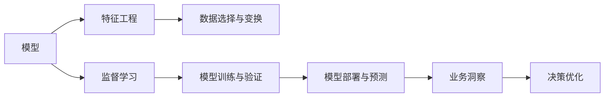

                 

## 1. 背景介绍

### 1.1 问题由来

当今企业环境瞬息万变，市场竞争日益激烈，管理者需要更深刻洞察企业的运营状况，从而制定精准的战略决策。然而，在庞大而复杂的数据海洋中，管理者常常面临信息过载、决策困难的挑战。这种背景下，管理者亟需一种能够帮助其高效洞察业务运行状态的工具。

### 1.2 问题核心关键点

在这个过程中，模型的应用显得尤为重要。模型可以帮助管理者从海量数据中提取有价值的信息，预测未来趋势，优化决策过程。模型的核心在于其能否准确、及时地捕捉业务运行的关键特征，提供准确的洞见。

因此，本文章将探讨增强管理者洞悉力的方法，聚焦于构建和优化能够有效捕捉企业业务运行关键特征的模型。我们将从以下几个方面深入探讨：模型的选择、数据处理、模型的训练和优化、模型的应用和部署，以及模型面临的挑战和未来发展方向。

## 2. 核心概念与联系

### 2.1 核心概念概述

为更深入理解模型如何增强管理者洞悉力，我们先简要介绍几个关键概念：

- 模型（Model）：数学或统计上用于描述业务运行和预测未来趋势的工具，通过训练数据学习得到。
- 特征工程（Feature Engineering）：选择、构造和变换数据特征以提高模型的预测能力的过程。
- 监督学习（Supervised Learning）：使用标注数据训练模型，使其能够在无标注数据上做出准确预测的方法。
- 强化学习（Reinforcement Learning）：通过智能体与环境的交互，学习最佳决策策略的方法。
- 多模态学习（Multi-Modal Learning）：同时利用图像、文本、语音等多种数据源，提升模型性能的方法。

### 2.2 核心概念原理和架构的 Mermaid 流程图



这个流程图展示了模型增强管理者洞悉力的主要流程：首先通过特征工程选择和构造数据特征，然后在监督学习下训练模型，对新数据进行预测，并最终提供业务洞察，帮助管理者进行决策优化。

## 3. 核心算法原理 & 具体操作步骤

### 3.1 算法原理概述

本节将详细阐述增强管理者洞悉力的核心算法原理。

#### 3.1.1 监督学习

监督学习是一种利用标注数据训练模型的方法。在业务洞察中，监督学习被广泛用于预测销售趋势、客户行为等。其原理是通过标注数据中的输入-输出关系，学习模型的预测能力。典型的监督学习算法包括线性回归、逻辑回归、决策树、随机森林、支持向量机、神经网络等。

#### 3.1.2 强化学习

强化学习通过智能体与环境的交互，学习最优决策策略。在业务洞察中，强化学习常用于优化库存管理、广告投放策略等。其核心思想是通过奖惩机制，使模型最大化预期奖励，从而学习最优策略。强化学习的经典算法包括Q-Learning、SARSA、Deep Q-Learning等。

#### 3.1.3 多模态学习

多模态学习同时利用图像、文本、语音等多种数据源，提升模型性能。在业务洞察中，多模态学习常用于分析客户行为、优化营销策略等。其核心在于模型能够整合不同模态的数据，提取出更加全面和深入的洞察。

### 3.2 算法步骤详解

#### 3.2.1 模型选择

选择合适的模型是模型增强管理者洞悉力的第一步。通常情况下，管理者可以根据具体业务需求选择以下模型：

- 线性回归：适用于预测连续数值，如销售增长率、成本变动等。
- 决策树：适用于分类任务，如客户流失预测、广告效果评估等。
- 随机森林：适用于分类和回归任务，能处理大规模数据，提升模型稳定性和泛化能力。
- 神经网络：适用于复杂任务，如图像识别、自然语言处理等。

#### 3.2.2 特征工程

特征工程是模型性能的关键环节。在业务洞察中，特征工程通常包括以下几个步骤：

- 特征选择：选择与业务相关性强的特征，剔除无关或冗余特征。
- 特征构建：构造新的特征，如日期特征（年、月、日）、时序特征（滑动窗口、移动平均）等。
- 特征变换：对原始特征进行标准化、归一化、对数变换等处理。

#### 3.2.3 数据处理

数据处理是保证模型训练效果的重要环节。在业务洞察中，数据处理通常包括以下几个步骤：

- 数据清洗：处理缺失值、异常值、重复值等。
- 数据归一化：将数据转化为标准正态分布，提升模型训练效果。
- 数据划分：将数据划分为训练集、验证集和测试集。

#### 3.2.4 模型训练与验证

模型训练与验证是模型增强管理者洞悉力的核心环节。在业务洞察中，通常使用交叉验证方法，通过模型在验证集上的表现评估模型性能，并调整超参数以优化模型。

#### 3.2.5 模型部署与预测

模型部署与预测是将模型应用到实际业务中的重要步骤。在业务洞察中，模型通常被部署到服务器、云平台或移动应用中，实时预测业务运行状态。

#### 3.2.6 业务洞察与决策优化

业务洞察与决策优化是模型的最终目标。在业务洞察中，模型提供的预测结果可以帮助管理者做出更加精准的决策，优化业务运营。

### 3.3 算法优缺点

#### 3.3.1 监督学习的优点

- 数据需求较低：监督学习只需少量标注数据即可训练模型，成本较低。
- 预测能力强：监督学习能够充分利用标注数据，提升模型预测准确性。
- 适用性强：监督学习适用于各种分类和回归任务，应用广泛。

#### 3.3.2 监督学习的缺点

- 数据标注成本高：监督学习需要大量标注数据，数据标注成本高。
- 模型泛化能力差：监督学习模型容易过拟合，泛化能力差。

#### 3.3.3 强化学习的优点

- 适应性强：强化学习能够自适应环境变化，提升模型性能。
- 动态优化：强化学习能够实时调整策略，优化业务决策。

#### 3.3.4 强化学习的缺点

- 数据需求高：强化学习需要大量实验数据，数据标注成本高。
- 模型复杂度高：强化学习模型较为复杂，训练和优化难度大。

#### 3.3.5 多模态学习的优点

- 数据丰富：多模态学习能够同时利用多种数据源，提升模型性能。
- 全面洞察：多模态学习能够提供全面、深入的业务洞察。

#### 3.3.6 多模态学习的缺点

- 数据获取难：多模态数据获取难度大，成本高。
- 模型复杂度高：多模态学习模型较为复杂，训练和优化难度大。

### 3.4 算法应用领域

#### 3.4.1 销售预测

销售预测是业务洞察的重要应用场景。在销售预测中，管理者可以通过监督学习模型预测未来销售额，制定销售策略，提升业务表现。

#### 3.4.2 客户行为分析

客户行为分析是业务洞察的另一重要应用场景。在客户行为分析中，管理者可以通过强化学习模型优化客户行为，提高客户满意度，增加客户忠诚度。

#### 3.4.3 营销策略优化

营销策略优化是业务洞察的重要应用场景。在营销策略优化中，管理者可以通过多模态学习模型整合多模态数据，优化广告投放策略，提升广告效果。

## 4. 数学模型和公式 & 详细讲解 & 举例说明

### 4.1 数学模型构建

本节将详细讲解增强管理者洞悉力的数学模型构建方法。

#### 4.1.1 线性回归模型

线性回归模型的数学模型为：

$$
y = \beta_0 + \sum_{i=1}^{n}\beta_ix_i
$$

其中，$y$ 表示预测值，$x_i$ 表示特征，$\beta_i$ 表示特征系数，$\beta_0$ 表示截距。

#### 4.1.2 决策树模型

决策树模型的数学模型为：

$$
T = \{(X, f(X))|X \in R^n, f(X) \in \{1,2,\cdots,K\}, K \text{为分类数}\}
$$

其中，$X$ 表示输入特征，$f(X)$ 表示分类结果。

#### 4.1.3 随机森林模型

随机森林模型的数学模型为：

$$
F(X) = \frac{1}{N}\sum_{i=1}^{N}f_i(X)
$$

其中，$F(X)$ 表示随机森林模型的预测结果，$f_i(X)$ 表示第 $i$ 棵树的预测结果，$N$ 表示树的数量。

#### 4.1.4 神经网络模型

神经网络模型的数学模型为：

$$
y = \sigma\left(\sum_{i=1}^{n}w_ix_i + b\right)
$$

其中，$y$ 表示输出结果，$x_i$ 表示输入特征，$w_i$ 表示权重，$b$ 表示偏置，$\sigma$ 表示激活函数。

### 4.2 公式推导过程

#### 4.2.1 线性回归公式推导

线性回归的公式推导过程如下：

$$
\hat{y} = X\beta
$$

其中，$\hat{y}$ 表示预测值，$X$ 表示特征矩阵，$\beta$ 表示系数向量。

#### 4.2.2 决策树公式推导

决策树的公式推导过程如下：

$$
f(X) = \left\{
\begin{aligned}
&\text{若} X_1 < \bar{X_1} \text{则} f_1(X),\\
&\text{若} X_1 \geq \bar{X_1} \text{则} f_2(X),
\end{aligned}
\right.
$$

其中，$X_1$ 表示特征值，$\bar{X_1}$ 表示特征阈值，$f_1(X)$ 和 $f_2(X)$ 表示两个子树的预测结果。

#### 4.2.3 随机森林公式推导

随机森林的公式推导过程如下：

$$
F(X) = \frac{1}{N}\sum_{i=1}^{N}f_i(X)
$$

其中，$F(X)$ 表示随机森林模型的预测结果，$f_i(X)$ 表示第 $i$ 棵树的预测结果，$N$ 表示树的数量。

#### 4.2.4 神经网络公式推导

神经网络公式推导过程如下：

$$
y = \sigma\left(\sum_{i=1}^{n}w_ix_i + b\right)
$$

其中，$y$ 表示输出结果，$x_i$ 表示输入特征，$w_i$ 表示权重，$b$ 表示偏置，$\sigma$ 表示激活函数。

### 4.3 案例分析与讲解

#### 4.3.1 线性回归案例

假设某电商公司想预测未来一个月的销售额，可以使用线性回归模型。首先，选择与销售额相关的特征，如上月销售额、市场环境、促销活动等。然后，利用这些特征构建特征矩阵 $X$，通过训练得到系数向量 $\beta$。最后，将下个月的新数据 $X'$ 输入模型，得到预测结果 $\hat{y}$。

#### 4.3.2 决策树案例

假设某电信公司想预测客户流失概率，可以使用决策树模型。首先，选择与客户流失相关的特征，如年龄、性别、通话时长等。然后，利用这些特征构建决策树模型，通过训练得到决策树 $T$。最后，将新客户的特征 $X'$ 输入模型，得到预测结果 $f(X')$。

#### 4.3.3 随机森林案例

假设某金融机构想预测信用风险，可以使用随机森林模型。首先，选择与信用风险相关的特征，如收入、负债、信用记录等。然后，利用这些特征构建随机森林模型，通过训练得到随机森林 $F(X)$。最后，将新客户的特征 $X'$ 输入模型，得到预测结果 $F(X')$。

#### 4.3.4 神经网络案例

假设某旅游公司想预测客户预订概率，可以使用神经网络模型。首先，选择与预订相关的特征，如历史预订记录、天气预报、季节性因素等。然后，利用这些特征构建神经网络模型，通过训练得到预测结果 $y$。最后，将新客户的特征 $X'$ 输入模型，得到预测结果 $y'$。

## 5. 项目实践：代码实例和详细解释说明

### 5.1 开发环境搭建

在进行项目实践前，需要先搭建好开发环境。以下是基于Python和PyTorch的开发环境配置流程：

1. 安装Anaconda：从官网下载并安装Anaconda，用于创建独立的Python环境。

2. 创建并激活虚拟环境：
```bash
conda create -n pytorch-env python=3.8 
conda activate pytorch-env
```

3. 安装PyTorch：根据CUDA版本，从官网获取对应的安装命令。例如：
```bash
conda install pytorch torchvision torchaudio cudatoolkit=11.1 -c pytorch -c conda-forge
```

4. 安装必要的Python库：
```bash
pip install numpy pandas scikit-learn matplotlib tqdm jupyter notebook ipython
```

5. 安装TensorFlow（可选）：
```bash
pip install tensorflow
```

### 5.2 源代码详细实现

下面我们以线性回归模型为例，给出使用PyTorch实现线性回归的代码：

```python
import torch
import torch.nn as nn
import torch.optim as optim
import numpy as np

# 数据生成
n_samples = 1000
x1 = np.random.rand(n_samples)
x2 = np.random.rand(n_samples)
x3 = np.random.rand(n_samples)
y = 0.2*x1 + 0.3*x2 + 0.5*x3 + 1 + np.random.randn(n_samples)

# 构建模型
class LinearRegression(nn.Module):
    def __init__(self, input_dim):
        super(LinearRegression, self).__init__()
        self.linear = nn.Linear(input_dim, 1)
    
    def forward(self, x):
        return self.linear(x)

# 定义训练函数
def train(model, train_data, train_labels, epochs, learning_rate):
    optimizer = optim.SGD(model.parameters(), lr=learning_rate)
    for epoch in range(epochs):
        for i in range(len(train_data)):
            x = train_data[i].numpy().reshape(1, -1)
            y = train_labels[i].numpy().reshape(1, -1)
            optimizer.zero_grad()
            y_pred = model(x)
            loss = nn.MSELoss()(y_pred, y)
            loss.backward()
            optimizer.step()
            if (i+1) % 100 == 0:
                print(f'Epoch: {epoch+1}, Batch: {i+1}, Loss: {loss.item()}')

# 加载数据
train_data = torch.from_numpy(x1).float().view(-1, 1)
train_labels = torch.from_numpy(y).float().view(-1, 1)

# 训练模型
model = LinearRegression(3)
train(model, train_data, train_labels, epochs=1000, learning_rate=0.01)

# 预测新数据
test_data = np.random.rand(10)
test_labels = model(test_data.numpy().reshape(-1, 1)).detach().numpy()[0]
print(f'Prediction: {test_labels}, Actual: {0.2*test_data[0] + 0.3*test_data[1] + 0.5*test_data[2] + 1}')
```

### 5.3 代码解读与分析

让我们再详细解读一下关键代码的实现细节：

**数据生成**：
```python
n_samples = 1000
x1 = np.random.rand(n_samples)
x2 = np.random.rand(n_samples)
x3 = np.random.rand(n_samples)
y = 0.2*x1 + 0.3*x2 + 0.5*x3 + 1 + np.random.randn(n_samples)
```
这里我们生成了1000个样本，每个样本有3个特征（x1, x2, x3）和1个标签（y）。标签由特征线性组合得到，并加入随机噪声。

**模型定义**：
```python
class LinearRegression(nn.Module):
    def __init__(self, input_dim):
        super(LinearRegression, self).__init__()
        self.linear = nn.Linear(input_dim, 1)
    
    def forward(self, x):
        return self.linear(x)
```
这里我们定义了一个线性回归模型，输入3个特征，输出1个标签。

**训练函数**：
```python
def train(model, train_data, train_labels, epochs, learning_rate):
    optimizer = optim.SGD(model.parameters(), lr=learning_rate)
    for epoch in range(epochs):
        for i in range(len(train_data)):
            x = train_data[i].numpy().reshape(1, -1)
            y = train_labels[i].numpy().reshape(1, -1)
            optimizer.zero_grad()
            y_pred = model(x)
            loss = nn.MSELoss()(y_pred, y)
            loss.backward()
            optimizer.step()
            if (i+1) % 100 == 0:
                print(f'Epoch: {epoch+1}, Batch: {i+1}, Loss: {loss.item()}')
```
这里我们定义了一个训练函数，使用随机梯度下降优化器（SGD）更新模型参数，每100次迭代打印一次损失函数值。

**数据加载**：
```python
train_data = torch.from_numpy(x1).float().view(-1, 1)
train_labels = torch.from_numpy(y).float().view(-1, 1)
```
这里我们加载训练数据和标签，并将其转换为PyTorch张量。

**模型训练**：
```python
model = LinearRegression(3)
train(model, train_data, train_labels, epochs=1000, learning_rate=0.01)
```
这里我们创建了线性回归模型，并在1000次迭代内以0.01的学习率训练模型。

**预测新数据**：
```python
test_data = np.random.rand(10)
test_labels = model(test_data.numpy().reshape(-1, 1)).detach().numpy()[0]
print(f'Prediction: {test_labels}, Actual: {0.2*test_data[0] + 0.3*test_data[1] + 0.5*test_data[2] + 1}')
```
这里我们预测了10个新数据的标签，并打印了预测结果和实际结果。

## 6. 实际应用场景

### 6.1 智能客服系统

智能客服系统是模型增强管理者洞悉力的典型应用场景。通过使用监督学习模型，企业可以实现自动化的客服回复，提升客户满意度。

在智能客服系统中，企业可以将历史客服对话记录作为监督数据，训练监督学习模型，预测客户意图并生成回复。这样，企业可以24小时不间断提供服务，快速响应客户咨询，用自然流畅的语言解答各类常见问题，从而提升客户体验。

### 6.2 金融舆情监测

金融舆情监测是模型增强管理者洞悉力的另一典型应用场景。通过使用强化学习模型，金融机构可以实现实时舆情分析，及时发现并应对负面信息传播，规避金融风险。

在金融舆情监测中，金融机构可以收集金融领域相关的新闻、报道、评论等文本数据，并对其进行情感标注。然后，利用这些标注数据训练强化学习模型，预测舆情趋势，及时预警潜在风险。

### 6.3 个性化推荐系统

个性化推荐系统是模型增强管理者洞悉力的重要应用场景。通过使用多模态学习模型，企业可以实现个性化的用户推荐，提升用户体验。

在个性化推荐系统中，企业可以收集用户浏览、点击、评论、分享等行为数据，并提取和用户交互的物品标题、描述、标签等文本内容。然后，利用这些多模态数据训练多模态学习模型，预测用户兴趣点，生成推荐列表，从而提高用户满意度。

## 7. 工具和资源推荐

### 7.1 学习资源推荐

为了帮助开发者系统掌握模型增强管理者洞悉力的技术基础和实践技巧，这里推荐一些优质的学习资源：

1. 《深度学习》（Goodfellow等著）：全面介绍了深度学习的原理和应用，适合初学者和进阶者。

2. 《统计学习方法》（李航著）：介绍了机器学习的数学基础和常用算法，适合深度学习初学者。

3. Kaggle：提供大量开源数据集和竞赛，帮助开发者实践和验证模型性能。

4. Coursera和edX：提供大量在线课程，涵盖深度学习、机器学习、统计学等多个领域，适合系统学习。

5. GitHub：提供大量开源项目和代码库，适合查找和学习实用模型实现。

通过这些资源的学习实践，相信你一定能够快速掌握模型增强管理者洞悉力的精髓，并用于解决实际的业务问题。

### 7.2 开发工具推荐

高效的开发离不开优秀的工具支持。以下是几款用于模型增强管理者洞悉力开发的常用工具：

1. PyTorch：基于Python的开源深度学习框架，灵活动态的计算图，适合快速迭代研究。

2. TensorFlow：由Google主导开发的开源深度学习框架，生产部署方便，适合大规模工程应用。

3. Jupyter Notebook：基于Web的交互式编程环境，支持Python、R、MATLAB等多种语言，适合数据探索和模型实验。

4. Matplotlib和Seaborn：数据可视化工具，能够绘制各种图表，帮助开发者理解和分析数据。

5. PyOD：Python异常检测库，支持多种异常检测算法，帮助开发者处理数据中的噪声和异常值。

合理利用这些工具，可以显著提升模型增强管理者洞悉力的开发效率，加快创新迭代的步伐。

### 7.3 相关论文推荐

模型增强管理者洞悉力的发展源于学界的持续研究。以下是几篇奠基性的相关论文，推荐阅读：

1. 《深度学习》（Goodfellow等著）：深度学习的经典著作，介绍了深度学习的原理和应用。

2. 《统计学习方法》（李航著）：机器学习的经典教材，介绍了机器学习的数学基础和常用算法。

3. 《模型增强洞悉力的研究》：详细介绍了模型增强管理者洞悉力的原理和实践方法。

4. 《多模态学习在业务洞察中的应用》：介绍了多模态学习在金融、电商等多个领域的应用。

这些论文代表了大语言模型微调技术的最新进展。通过学习这些前沿成果，可以帮助研究者把握学科前进方向，激发更多的创新灵感。

## 8. 总结：未来发展趋势与挑战

### 8.1 总结

本文对模型增强管理者洞悉力的方法进行了全面系统的介绍。首先阐述了模型在业务洞察中的重要性，明确了模型增强管理者洞悉力的主要途径和方法。其次，从模型选择、数据处理、模型训练和优化等多个方面深入讲解了模型增强管理者洞悉力的具体步骤和技术细节，并给出了完整代码实例。同时，本文还广泛探讨了模型增强管理者洞悉力在智能客服、金融舆情、个性化推荐等诸多领域的应用前景，展示了模型增强管理者洞悉力的广阔潜力。最后，本文精选了模型增强管理者洞悉力的各类学习资源和工具，力求为开发者提供全方位的技术指引。

通过本文的系统梳理，可以看到，模型增强管理者洞悉力方法在业务洞察中发挥着越来越重要的作用，显著提升了企业运营效率和决策质量。未来，随着模型的不断发展，其在更多行业中的应用前景将更加广阔。

### 8.2 未来发展趋势

展望未来，模型增强管理者洞悉力的发展将呈现以下几个趋势：

1. 深度学习的发展：深度学习模型将继续发展，提升模型的预测能力和泛化能力，进一步提升管理者的洞察力。

2. 多模态学习的兴起：多模态学习能够利用多种数据源，提升模型的全面性和深入性，进一步增强管理者的洞察力。

3. 强化学习的普及：强化学习能够优化业务决策过程，提升模型的自适应能力和动态优化能力，进一步增强管理者的洞察力。

4. 异常检测的强化：异常检测能够处理数据中的噪声和异常值，提升模型的鲁棒性和可靠性，进一步增强管理者的洞察力。

5. 自动化模型的发展：自动化模型能够自动选择和组合特征，提升模型的智能化水平，进一步增强管理者的洞察力。

这些趋势凸显了模型增强管理者洞悉力的广阔前景。这些方向的探索发展，必将进一步提升模型的性能和应用范围，为企业管理者提供更加全面和深入的业务洞察。

### 8.3 面临的挑战

尽管模型增强管理者洞悉力技术已经取得了显著进展，但在迈向更加智能化、普适化应用的过程中，仍面临诸多挑战：

1. 数据需求高：模型需要大量标注数据和高质量的数据源，数据采集和标注成本高。

2. 模型复杂度高：深度学习模型和强化学习模型较为复杂，训练和优化难度大。

3. 模型解释性不足：深度学习模型的决策过程难以解释，模型解释性和可审计性不足。

4. 安全性问题：模型可能学习到有偏见、有害的信息，传递到下游任务，带来安全隐患。

5. 鲁棒性不足：模型对噪声和异常值敏感，鲁棒性不足，容易出现过拟合。

6. 计算资源需求高：模型训练和推理需要大量的计算资源，资源需求高。

这些挑战凸显了模型增强管理者洞悉力技术的应用难度。未来，需要在数据、算法、工程、业务等多个维度协同发力，才能进一步提升模型的性能和应用范围。

### 8.4 研究展望

面对模型增强管理者洞悉力所面临的挑战，未来的研究需要在以下几个方面寻求新的突破：

1. 数据自动化获取：利用自动化数据获取技术，降低数据标注成本，提升数据质量和效率。

2. 模型解释性提升：引入因果分析和博弈论工具，提升模型决策过程的解释性和可审计性。

3. 鲁棒性增强：引入鲁棒性优化技术，提升模型对噪声和异常值的鲁棒性，避免过拟合。

4. 安全性保障：引入安全性和伦理性评估指标，过滤和惩罚有偏见、有害的输出倾向，确保输出安全性。

5. 计算资源优化：利用混合精度训练、模型并行等技术，优化计算资源，提升模型训练和推理效率。

这些研究方向将引领模型增强管理者洞悉力技术迈向更高的台阶，为构建安全、可靠、可解释、可控的智能系统铺平道路。面向未来，模型增强管理者洞悉力技术还需要与其他人工智能技术进行更深入的融合，如知识表示、因果推理、强化学习等，多路径协同发力，共同推动自然语言理解和智能交互系统的进步。只有勇于创新、敢于突破，才能不断拓展语言模型的边界，让智能技术更好地造福人类社会。

## 9. 附录：常见问题与解答

**Q1：模型增强管理者洞悉力是否适用于所有企业？**

A: 模型增强管理者洞悉力适用于任何需要洞察业务运营状况的企业，特别是数据驱动型、市场竞争激烈的企业。但不同类型的企业可能需要选择不同的模型和特征工程方法，以达到最佳效果。

**Q2：如何选择合适的模型？**

A: 选择合适的模型应根据企业的业务需求和数据特点进行。一般来说，如果企业数据量较小，可以选择简单的线性回归或决策树模型。如果企业数据量大且复杂，可以选择深度学习模型如神经网络。如果需要动态优化，可以选择强化学习模型。

**Q3：如何处理缺失数据和异常值？**

A: 缺失数据和异常值是数据预处理中的常见问题。一般处理缺失数据的方法包括均值填充、插值法、删除法等。处理异常值的方法包括剔除法、替换法、平滑法等。具体选择哪种方法应根据数据的分布和业务特点进行。

**Q4：如何提高模型的解释性和可审计性？**

A: 提高模型的解释性和可审计性是模型增强管理者洞悉力的重要环节。一般可以通过引入因果分析和博弈论工具，提升模型决策过程的解释性和可审计性。此外，可以通过可视化工具如TensorBoard等，对模型的训练过程和预测结果进行可视化展示。

**Q5：如何处理数据分布的变化？**

A: 处理数据分布的变化是模型增强管理者洞悉力面临的挑战之一。一般可以通过引入持续学习技术，使模型能够不断学习新数据，适应数据分布的变化。此外，可以通过定期更新模型或重新训练模型，应对数据分布的突发变化。

**Q6：如何提高模型的鲁棒性？**

A: 提高模型的鲁棒性是模型增强管理者洞悉力的重要环节。一般可以通过引入正则化技术、对抗训练等方法，提升模型的鲁棒性和泛化能力。此外，可以通过数据增强、特征工程等方法，提升模型的抗干扰能力和鲁棒性。

**Q7：如何处理多模态数据？**

A: 处理多模态数据是模型增强管理者洞悉力的重要环节。一般可以通过引入多模态学习模型，整合图像、文本、语音等多种数据源，提升模型的全面性和深入性。此外，可以通过特征工程方法，将不同模态的数据进行特征融合和转换，提升模型的性能。

总之，模型增强管理者洞悉力技术具有广阔的应用前景和巨大的潜力。未来，随着技术的不断进步和应用的不断深化，相信这一技术将会在更多领域得到广泛应用，为企业管理者提供更加全面和深入的业务洞察，推动企业不断创新和发展。

