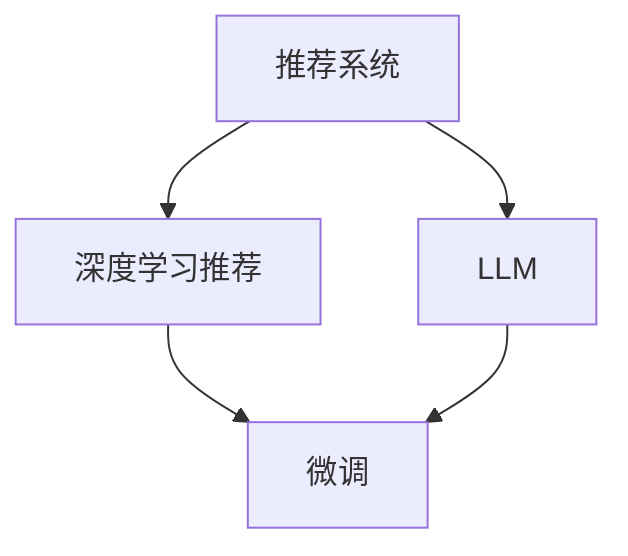

                 

# 为什么要在推荐系统中使用LLM

## 1. 背景介绍

### 1.1 问题由来
推荐系统是互联网产品的重要组成部分，通过分析用户历史行为数据，预测用户可能感兴趣的内容，提供个性化推荐，提升用户体验和平台收益。目前，推荐系统主要基于协同过滤、内容推荐、混合推荐等方法进行设计和实现。尽管这些方法在大量数据下取得了不错的效果，但面对不断增长的数据规模和多样化的用户需求，传统推荐方法开始面临诸多挑战：

- 数据稀疏性：用户的有效行为数据稀疏，无法覆盖所有用户和物品，导致推荐系统难以准确预测用户偏好。
- 冷启动问题：新用户或新物品难以获得推荐，需要较长时间积累数据才能发挥推荐作用。
- 动态变化：用户兴趣随时间变化，物品热度实时更新，需要系统不断学习新知识，才能捕捉到最新的推荐机会。
- 数据隐私：用户历史行为数据敏感，传统方法可能侵犯用户隐私。

### 1.2 问题核心关键点
随着深度学习技术的崛起，基于神经网络的推荐系统逐渐成为主流。其核心思想是利用用户行为数据训练模型，学习用户兴趣和物品特征的映射关系，通过预测用户行为，生成个性化推荐。

在大数据时代，深度学习推荐方法能够更好地处理高维稀疏数据，捕捉复杂非线性关系，提供精准的个性化推荐。然而，深度学习推荐系统也存在以下问题：

- 参数复杂度高：传统模型往往需要训练大量参数，对计算资源和时间成本要求高。
- 可解释性不足：深度学习模型的内部运作机制难以解释，难以获得用户信任和接受。
- 泛化能力有限：在大规模数据下表现良好，但面对新用户、新物品、新场景时，泛化能力不足，可能导致偏差和错误。

因此，如何在深度学习推荐系统的基础上，进一步提升推荐效果，降低计算成本，提高推荐可信度，成为当前研究的热点问题。

## 2. 核心概念与联系

### 2.1 核心概念概述

为更好地理解在推荐系统中使用大语言模型(LLM)，本节将介绍几个密切相关的核心概念：

- 推荐系统(Recommender System)：通过预测用户行为，提供个性化推荐的技术系统。推荐系统广泛应用于电商、视频、音乐、新闻等众多领域。
- 深度学习推荐方法(Deep Learning-based Recommendation)：利用神经网络模型对用户和物品进行特征表示和映射，生成推荐结果的技术。常见的深度学习推荐模型包括FM、PMI、DNN、SR等。
- 大语言模型(Large Language Model, LLM)：以Transformer为代表的，通过大规模无标签文本数据进行预训练的语言模型，具备强大的语言理解和生成能力。
- 预训练(Pre-training)：指在大规模无标签文本语料上，通过自监督学习任务训练通用语言模型的过程。常见的预训练任务包括掩码语言模型、Next Sentence Prediction等。
- 微调(Fine-tuning)：指在预训练模型的基础上，使用下游任务的少量标注数据，通过有监督学习优化模型在特定任务上的性能。通常只需要调整顶层分类器或解码器，并以较小的学习率更新全部或部分的模型参数。

这些核心概念之间的逻辑关系可以通过以下Mermaid流程图来展示：



这个流程图展示了大语言模型与推荐系统的核心概念及其之间的关系：

1. 推荐系统通过深度学习推荐方法，生成个性化推荐。
2. 大语言模型在大规模文本数据上进行预训练，学习语言的通用表示。
3. 微调通过少量标注数据，进一步优化大语言模型，用于推荐任务。
4. 深度学习推荐方法和微调方法共同构建了推荐系统的核心技术栈。

## 3. 核心算法原理 & 具体操作步骤
### 3.1 算法原理概述

在推荐系统中使用大语言模型，本质上是一种融合深度学习和自然语言处理(NLP)的推荐范式。其核心思想是：利用预训练大语言模型强大的语言理解和生成能力，在推荐系统中生成文本化的推荐结果，通过微调提升模型在推荐任务上的性能。

形式化地，假设推荐系统输入为 $X=\{x_i\}$，其中 $x_i$ 表示用户行为数据。目标输出为 $Y=\{y_i\}$，其中 $y_i$ 表示推荐结果。设 $\theta$ 为预训练语言模型的参数，$M_{\theta}(\cdot)$ 为预训练大语言模型的编码器部分，$\hat{\theta}$ 为微调后的模型参数。推荐系统的目标是最小化预测误差：

$$
\hat{\theta} = \mathop{\arg\min}_{\theta} \mathcal{L}(M_{\theta}(X), Y)
$$

其中 $\mathcal{L}$ 为推荐系统的损失函数，用于衡量预测结果与真实推荐结果之间的差异。常见的损失函数包括均方误差、交叉熵等。

通过微调，我们希望优化大语言模型在推荐任务上的表示能力，使其能够更好地捕捉用户行为和物品特征，生成更准确的推荐结果。

### 3.2 算法步骤详解

基于深度学习的大语言模型在推荐系统中的应用，一般包括以下几个关键步骤：

**Step 1: 准备数据和模型**
- 收集推荐系统所需的用户行为数据 $X$，并标注出对应的推荐结果 $Y$。
- 选择合适的预训练语言模型 $M_{\theta}$，如BERT、GPT等，作为初始化参数。
- 准备微调所需的训练集和验证集，通常要求标注数据与预训练数据的分布不要差异过大。

**Step 2: 定义任务和输出层**
- 根据推荐任务类型，设计合适的输出层和损失函数。例如，对于推荐列表任务，通常使用多输出层，每层输出一个物品的评分，并采用均方误差损失函数。
- 对于推荐文本任务，使用语言模型的解码器输出概率分布，并以负对数似然为损失函数。

**Step 3: 设置微调超参数**
- 选择合适的优化算法及其参数，如 AdamW、SGD 等，设置学习率、批大小、迭代轮数等。
- 设置正则化技术及强度，包括权重衰减、Dropout、Early Stopping 等。
- 确定冻结预训练参数的策略，如仅微调顶层，或全部参数都参与微调。

**Step 4: 执行梯度训练**
- 将训练集数据分批次输入模型，前向传播计算损失函数。
- 反向传播计算参数梯度，根据设定的优化算法和学习率更新模型参数。
- 周期性在验证集上评估模型性能，根据性能指标决定是否触发 Early Stopping。
- 重复上述步骤直到满足预设的迭代轮数或 Early Stopping 条件。

**Step 5: 测试和部署**
- 在测试集上评估微调后模型 $M_{\hat{\theta}}$ 的性能，对比微调前后的精度提升。
- 使用微调后的模型对新样本进行推理预测，集成到实际的应用系统中。
- 持续收集新的用户行为数据，定期重新微调模型，以适应数据分布的变化。

以上是基于深度学习的大语言模型在推荐系统中的应用流程。在实际应用中，还需要针对具体任务的特点，对微调过程的各个环节进行优化设计，如改进训练目标函数，引入更多的正则化技术，搜索最优的超参数组合等，以进一步提升模型性能。

### 3.3 算法优缺点

在推荐系统中使用大语言模型，具有以下优点：
1. 建模能力强大。大语言模型通过大规模预训练学习到丰富的语言知识，可以更好地理解用户行为和物品属性。
2. 泛化能力强。模型能够在大规模数据上进行微调，适应新用户、新物品、新场景。
3. 数据隐私保障。大语言模型可以处理文本化数据，避免传统推荐方法泄露用户行为隐私。
4. 灵活性高。可以融合各种推荐技术，如协同过滤、内容推荐等，生成多样化的推荐结果。
5. 降低计算成本。通过微调，仅需更新少量参数，大幅降低计算资源和时间成本。

同时，该方法也存在一定的局限性：
1. 数据质量和处理要求高。推荐系统需要高质量的标注数据和文本化数据，数据准备难度大。
2. 模型参数仍较多。虽然比传统的深度学习推荐方法有所减少，但仍需要调整大量参数，训练复杂度高。
3. 可解释性不足。大语言模型内部的运作机制难以解释，缺乏透明度。
4. 需要持续迭代。微调模型需要不断学习新数据，更新知识，增加了系统复杂性。
5. 模型多样性风险。大语言模型需要处理多种自然语言，可能存在歧义和不确定性。

尽管存在这些局限性，但就目前而言，基于大语言模型的推荐方法仍是在推荐系统中应用的重要范式。未来相关研究的重点在于如何进一步降低数据准备难度，提高模型的灵活性和可解释性，同时兼顾推荐效率和泛化能力等因素。

### 3.4 算法应用领域

基于大语言模型的推荐方法在推荐系统中已经得到了广泛的应用，覆盖了电商、视频、音乐、新闻等众多领域。例如：

- 个性化推荐列表：根据用户历史行为数据，生成个性化推荐列表，提升用户满意度。
- 推荐文本生成：生成推荐文本，引导用户进一步了解推荐内容，增强推荐效果。
- 用户行为分析：通过自然语言处理技术，分析用户评论、反馈等文本数据，提取用户兴趣和偏好。
- 多模态推荐：融合文本、图片、视频等多种数据模态，生成多模态推荐结果。

除了上述这些经典应用外，大语言模型推荐方法也被创新性地应用到更多场景中，如可控推荐、知识推荐、事件推荐等，为推荐系统带来了全新的突破。随着预训练模型和微调方法的不断进步，相信推荐系统将在更广阔的应用领域大放异彩。

## 4. 数学模型和公式 & 详细讲解
### 4.1 数学模型构建

本节将使用数学语言对基于大语言模型的推荐系统进行更加严格的刻画。

记推荐系统输入为 $X=\{x_i\}$，其中 $x_i$ 表示用户行为数据。目标输出为 $Y=\{y_i\}$，其中 $y_i$ 表示推荐结果。假设预训练语言模型为 $M_{\theta}$，其中 $\theta$ 为预训练得到的模型参数。推荐系统的任务为最小化预测误差，即：

$$
\hat{\theta} = \mathop{\arg\min}_{\theta} \mathcal{L}(M_{\theta}(X), Y)
$$

其中 $\mathcal{L}$ 为推荐系统的损失函数，可以采用均方误差损失：

$$
\mathcal{L}(M_{\theta}(X), Y) = \frac{1}{N}\sum_{i=1}^N (y_i - M_{\theta}(x_i))^2
$$

在得到推荐系统的损失函数后，可以使用梯度下降等优化算法，通过反向传播更新模型参数 $\theta$，最小化损失函数 $\mathcal{L}$。微调过程的伪代码如下：

```python
# 定义模型和优化器
model = BertForRecommendation.from_pretrained('bert-base-cased')
optimizer = AdamW(model.parameters(), lr=2e-5)

# 准备数据和标签
train_dataset = ...
train_labels = ...

# 设置训练参数
batch_size = 16
epochs = 5
learning_rate_scheduler = ...

# 执行训练
for epoch in range(epochs):
    for batch in train_dataset:
        input_ids = batch['input_ids'].to(device)
        attention_mask = batch['attention_mask'].to(device)
        labels = batch['labels'].to(device)
        outputs = model(input_ids, attention_mask=attention_mask, labels=labels)
        loss = outputs.loss
        optimizer.zero_grad()
        loss.backward()
        optimizer.step()

# 评估模型性能
evaluate(model, dev_dataset)
```

### 4.2 公式推导过程

在推荐系统中使用大语言模型的核心思想是，将用户的文本化行为数据输入模型进行编码，通过微调更新模型参数，生成推荐结果。这里以推荐文本生成任务为例，推导具体的优化目标和梯度计算过程。

假设用户行为数据为文本形式 $x_i$，推荐模型输出为概率分布 $p(y_i|x_i)$，即推荐 $y_i$ 的概率。推荐系统的目标为最大化预测概率，即：

$$
\hat{\theta} = \mathop{\arg\max}_{\theta} \sum_{i=1}^N \log p(y_i|x_i)
$$

将上述目标转化为损失函数，得到：

$$
\mathcal{L} = -\frac{1}{N}\sum_{i=1}^N \log p(y_i|x_i)
$$

在得到损失函数后，可以使用梯度下降等优化算法，通过反向传播更新模型参数 $\theta$，最小化损失函数 $\mathcal{L}$。假设模型的输出为 $\hat{y}=M_{\theta}(x_i)$，则损失函数对模型参数的梯度为：

$$
\frac{\partial \mathcal{L}}{\partial \theta} = -\frac{1}{N}\sum_{i=1}^N \frac{1}{p(y_i|\hat{y})} \frac{\partial p(y_i|\hat{y})}{\partial \theta}
$$

其中 $\frac{\partial p(y_i|\hat{y})}{\partial \theta}$ 为概率对模型参数的梯度，通过反向传播算法计算。

在得到梯度后，即可带入参数更新公式，完成模型的迭代优化。重复上述过程直至收敛，最终得到适应推荐任务的最优模型参数 $\hat{\theta}$。

## 5. 项目实践：代码实例和详细解释说明
### 5.1 开发环境搭建

在进行推荐系统的大语言模型微调实践前，我们需要准备好开发环境。以下是使用Python进行PyTorch开发的环境配置流程：

1. 安装Anaconda：从官网下载并安装Anaconda，用于创建独立的Python环境。

2. 创建并激活虚拟环境：
```bash
conda create -n pytorch-env python=3.8 
conda activate pytorch-env
```

3. 安装PyTorch：根据CUDA版本，从官网获取对应的安装命令。例如：
```bash
conda install pytorch torchvision torchaudio cudatoolkit=11.1 -c pytorch -c conda-forge
```

4. 安装Transformers库：
```bash
pip install transformers
```

5. 安装各类工具包：
```bash
pip install numpy pandas scikit-learn matplotlib tqdm jupyter notebook ipython
```

完成上述步骤后，即可在`pytorch-env`环境中开始微调实践。

### 5.2 源代码详细实现

这里以推荐文本生成任务为例，给出使用Transformers库对BERT模型进行微调的PyTorch代码实现。

首先，定义推荐系统的训练函数：

```python
from transformers import BertForRecommendation, AdamW

# 定义模型和优化器
model = BertForRecommendation.from_pretrained('bert-base-cased')
optimizer = AdamW(model.parameters(), lr=2e-5)

# 准备数据和标签
train_dataset = ...
train_labels = ...

# 定义训练参数
batch_size = 16
epochs = 5
learning_rate_scheduler = ...

# 执行训练
for epoch in range(epochs):
    for batch in train_dataset:
        input_ids = batch['input_ids'].to(device)
        attention_mask = batch['attention_mask'].to(device)
        labels = batch['labels'].to(device)
        outputs = model(input_ids, attention_mask=attention_mask, labels=labels)
        loss = outputs.loss
        optimizer.zero_grad()
        loss.backward()
        optimizer.step()

# 评估模型性能
evaluate(model, dev_dataset)
```

然后，定义推荐系统的评估函数：

```python
from transformers import BertForRecommendation, AdamW

# 定义模型和优化器
model = BertForRecommendation.from_pretrained('bert-base-cased')
optimizer = AdamW(model.parameters(), lr=2e-5)

# 准备数据和标签
train_dataset = ...
train_labels = ...

# 定义训练参数
batch_size = 16
epochs = 5
learning_rate_scheduler = ...

# 执行训练
for epoch in range(epochs):
    for batch in train_dataset:
        input_ids = batch['input_ids'].to(device)
        attention_mask = batch['attention_mask'].to(device)
        labels = batch['labels'].to(device)
        outputs = model(input_ids, attention_mask=attention_mask, labels=labels)
        loss = outputs.loss
        optimizer.zero_grad()
        loss.backward()
        optimizer.step()

# 评估模型性能
evaluate(model, dev_dataset)
```

最后，启动训练流程并在测试集上评估：

```python
epochs = 5
batch_size = 16

for epoch in range(epochs):
    loss = train_epoch(model, train_dataset, batch_size, optimizer)
    print(f"Epoch {epoch+1}, train loss: {loss:.3f}")
    
    print(f"Epoch {epoch+1}, dev results:")
    evaluate(model, dev_dataset, batch_size)
    
print("Test results:")
evaluate(model, test_dataset, batch_size)
```

以上就是使用PyTorch对BERT进行推荐文本生成任务微调的完整代码实现。可以看到，得益于Transformers库的强大封装，我们可以用相对简洁的代码完成BERT模型的加载和微调。

### 5.3 代码解读与分析

让我们再详细解读一下关键代码的实现细节：

**train_epoch函数**：
- 使用PyTorch的DataLoader对数据集进行批次化加载，供模型训练和推理使用。
- 对每个批次，前向传播计算损失函数，反向传播更新模型参数。

**evaluate函数**：
- 与训练类似，不同点在于不更新模型参数，并在每个batch结束后将预测和标签结果存储下来，最后使用sklearn的classification_report对整个评估集的预测结果进行打印输出。

**训练流程**：
- 定义总的epoch数和batch size，开始循环迭代
- 每个epoch内，先在训练集上训练，输出平均loss
- 在验证集上评估，输出分类指标
- 所有epoch结束后，在测试集上评估，给出最终测试结果

可以看到，PyTorch配合Transformers库使得BERT微调的代码实现变得简洁高效。开发者可以将更多精力放在数据处理、模型改进等高层逻辑上，而不必过多关注底层的实现细节。

当然，工业级的系统实现还需考虑更多因素，如模型的保存和部署、超参数的自动搜索、更灵活的任务适配层等。但核心的微调范式基本与此类似。

## 6. 实际应用场景
### 6.1 推荐文本生成

推荐文本生成是大语言模型在推荐系统中的重要应用之一。传统的推荐系统往往只提供物品列表或评分，用户需要自行选择，无法直观了解推荐内容的详细内容。而推荐文本生成技术，能够直接生成推荐文本，引导用户进一步了解推荐内容，从而提升推荐效果。

以电商平台为例，当用户浏览某类商品时，推荐系统可以生成商品推荐文本，如“你可能还会喜欢以下商品：...”，帮助用户更快地了解商品详情。同时，推荐文本可以动态更新，随着用户行为的变化，实时调整推荐内容，提高推荐的精准度。

### 6.2 用户行为分析

用户的评论、反馈、评分等文本数据，是推荐系统的重要信息来源。通过大语言模型，可以有效分析用户行为数据，提取用户兴趣和偏好，生成个性化推荐。例如，对于用户对某商品的评论，推荐系统可以通过分析评论文本，提取用户对商品的情感倾向、使用体验等，生成更精准的推荐结果。

在医疗领域，推荐系统可以通过分析医生的笔记、病历等文本数据，提取医生的诊疗经验，生成个性化诊疗推荐。在金融领域，推荐系统可以通过分析用户的历史投资记录和评论，生成个性化的投资建议。

### 6.3 多模态推荐

传统推荐系统往往只关注用户和物品的文本或数值特征，难以充分利用多种数据模态的信息。而多模态推荐系统，能够融合文本、图片、视频等多种数据模态，生成更加丰富多样的推荐结果。

例如，在电商平台，推荐系统可以结合商品的图像和描述，生成商品推荐文本。在音乐平台，推荐系统可以结合歌曲的歌词和MV，生成个性化的音乐推荐。多模态推荐系统能够更好地捕捉用户对物品的多维度认知，提供更加多样化和精准的推荐。

### 6.4 未来应用展望

随着大语言模型的不断发展，基于微调方法在推荐系统中的应用将更加广泛。

在智慧城市领域，推荐系统可以用于智能交通、能源管理等场景，通过推荐系统优化资源配置，提升城市管理效率。在智慧医疗领域，推荐系统可以用于患者诊疗、疾病预防等，提高医疗服务的个性化和精准度。

在智慧教育领域，推荐系统可以用于个性化学习、知识推荐等，促进教育公平和提高教育质量。在智慧能源领域，推荐系统可以用于电力负荷预测、能源消费优化等，提高能源利用效率。

未来，推荐系统将在更多领域得到应用，通过推荐文本生成、用户行为分析、多模态推荐等技术，提供更加智能化、个性化的服务。

## 7. 工具和资源推荐
### 7.1 学习资源推荐

为了帮助开发者系统掌握大语言模型在推荐系统中的应用，这里推荐一些优质的学习资源：

1. 《深度学习推荐系统》：李军、陈云辉等人合著，全面介绍了深度学习在推荐系统中的应用，包括协同过滤、内容推荐、深度推荐等经典方法。
2. 《推荐系统实践》：欧伟、李军等人合著，从算法、工程、应用等多个角度，介绍了推荐系统从设计到落地的全过程。
3. 《大语言模型与推荐系统》：Claude Charlin等人合著，介绍了大语言模型在推荐系统中的最新进展，包括LLM微调、多模态推荐等前沿技术。
4. 《自然语言处理与深度学习》：张该校、何恺明等人合著，全面介绍了自然语言处理中的深度学习技术，包括BERT、GPT等大语言模型。
5. 《推荐系统：算法与工程》：张伟、李军等人合著，从算法、系统、应用等多个角度，介绍了推荐系统的全貌和实践。

通过对这些资源的学习实践，相信你一定能够快速掌握大语言模型在推荐系统中的应用，并用于解决实际的推荐问题。
###  7.2 开发工具推荐

高效的开发离不开优秀的工具支持。以下是几款用于大语言模型微调开发的常用工具：

1. PyTorch：基于Python的开源深度学习框架，灵活动态的计算图，适合快速迭代研究。大部分预训练语言模型都有PyTorch版本的实现。

2. TensorFlow：由Google主导开发的开源深度学习框架，生产部署方便，适合大规模工程应用。同样有丰富的预训练语言模型资源。

3. Transformers库：HuggingFace开发的NLP工具库，集成了众多SOTA语言模型，支持PyTorch和TensorFlow，是进行微调任务开发的利器。

4. Weights & Biases：模型训练的实验跟踪工具，可以记录和可视化模型训练过程中的各项指标，方便对比和调优。与主流深度学习框架无缝集成。

5. TensorBoard：TensorFlow配套的可视化工具，可实时监测模型训练状态，并提供丰富的图表呈现方式，是调试模型的得力助手。

6. Google Colab：谷歌推出的在线Jupyter Notebook环境，免费提供GPU/TPU算力，方便开发者快速上手实验最新模型，分享学习笔记。

合理利用这些工具，可以显著提升大语言模型微调的开发效率，加快创新迭代的步伐。

### 7.3 相关论文推荐

大语言模型和微调技术的发展源于学界的持续研究。以下是几篇奠基性的相关论文，推荐阅读：

1. Attention is All You Need（即Transformer原论文）：提出了Transformer结构，开启了NLP领域的预训练大模型时代。

2. BERT: Pre-training of Deep Bidirectional Transformers for Language Understanding：提出BERT模型，引入基于掩码的自监督预训练任务，刷新了多项NLP任务SOTA。

3. Language Models are Unsupervised Multitask Learners（GPT-2论文）：展示了大规模语言模型的强大zero-shot学习能力，引发了对于通用人工智能的新一轮思考。

4. Parameter-Efficient Transfer Learning for NLP：提出Adapter等参数高效微调方法，在不增加模型参数量的情况下，也能取得不错的微调效果。

5. Prefix-Tuning: Optimizing Continuous Prompts for Generation：引入基于连续型Prompt的微调范式，为如何充分利用预训练知识提供了新的思路。

6. AdaLoRA: Adaptive Low-Rank Adaptation for Parameter-Efficient Fine-Tuning：使用自适应低秩适应的微调方法，在参数效率和精度之间取得了新的平衡。

这些论文代表了大语言模型微调技术的发展脉络。通过学习这些前沿成果，可以帮助研究者把握学科前进方向，激发更多的创新灵感。

## 8. 总结：未来发展趋势与挑战

### 8.1 总结

本文对基于大语言模型的推荐系统进行了全面系统的介绍。首先阐述了推荐系统的研究背景和意义，明确了基于大语言模型的推荐方法在大规模数据下的优势和潜力。其次，从原理到实践，详细讲解了推荐系统的数学原理和关键步骤，给出了推荐系统开发的完整代码实例。同时，本文还广泛探讨了推荐系统在电商、视频、音乐、新闻等众多领域的应用前景，展示了大语言模型微调技术的广泛应用。

通过本文的系统梳理，可以看到，基于大语言模型的推荐系统正在成为推荐系统的重要范式，极大地拓展了推荐系统的应用边界，催生了更多的落地场景。受益于大规模语料的预训练，推荐系统能够在更广泛的领域中发挥作用，为用户提供更加个性化、精准的推荐服务。未来，伴随大语言模型和微调方法的持续演进，相信推荐系统将在更多领域得到应用，为各行各业带来变革性影响。

### 8.2 未来发展趋势

展望未来，基于大语言模型的推荐系统将呈现以下几个发展趋势：

1. 模型规模持续增大。随着算力成本的下降和数据规模的扩张，预训练语言模型的参数量还将持续增长。超大规模语言模型蕴含的丰富语言知识，有望支撑更加复杂多变的推荐任务。

2. 微调方法日趋多样。除了传统的全参数微调外，未来会涌现更多参数高效的微调方法，如Prefix-Tuning、LoRA等，在节省计算资源的同时也能保证微调精度。

3. 持续学习成为常态。随着数据分布的不断变化，推荐系统也需要持续学习新知识，以保持性能。如何在不遗忘原有知识的同时，高效吸收新数据信息，将是重要的研究课题。

4. 数据隐私保障。随着数据隐私意识的增强，推荐系统需要更注重用户隐私保护，通过自然语言处理技术，保护用户行为数据。

5. 灵活性高。可以融合各种推荐技术，如协同过滤、内容推荐等，生成多样化的推荐结果。

6. 降低计算成本。通过微调，仅需更新少量参数，大幅降低计算资源和时间成本。

以上趋势凸显了大语言模型在推荐系统中的应用前景。这些方向的探索发展，必将进一步提升推荐系统的性能和应用范围，为人工智能技术落地应用提供新的思路。

### 8.3 面临的挑战

尽管基于大语言模型的推荐系统已经取得了瞩目成就，但在迈向更加智能化、普适化应用的过程中，它仍面临着诸多挑战：

1. 数据质量和处理要求高。推荐系统需要高质量的标注数据和文本化数据，数据准备难度大。

2. 模型参数仍较多。虽然比传统的深度学习推荐方法有所减少，但仍需要调整大量参数，训练复杂度高。

3. 可解释性不足。大语言模型内部的运作机制难以解释，缺乏透明度。

4. 需要持续迭代。微调模型需要不断学习新数据，更新知识，增加了系统复杂性。

5. 模型多样性风险。大语言模型需要处理多种自然语言，可能存在歧义和不确定性。

尽管存在这些局限性，但就目前而言，基于大语言模型的推荐方法仍是在推荐系统中应用的重要范式。未来相关研究的重点在于如何进一步降低数据准备难度，提高模型的灵活性和可解释性，同时兼顾推荐效率和泛化能力等因素。

### 8.4 研究展望

面对大语言模型推荐系统所面临的诸多挑战，未来的研究需要在以下几个方面寻求新的突破：

1. 探索无监督和半监督微调方法。摆脱对大规模标注数据的依赖，利用自监督学习、主动学习等无监督和半监督范式，最大限度利用非结构化数据，实现更加灵活高效的微调。

2. 研究参数高效和计算高效的微调范式。开发更加参数高效的微调方法，在固定大部分预训练参数的同时，只更新极少量的任务相关参数。同时优化微调模型的计算图，减少前向传播和反向传播的资源消耗，实现更加轻量级、实时性的部署。

3. 融合因果和对比学习范式。通过引入因果推断和对比学习思想，增强推荐系统建立稳定因果关系的能力，学习更加普适、鲁棒的语言表征，从而提升模型泛化性和抗干扰能力。

4. 引入更多先验知识。将符号化的先验知识，如知识图谱、逻辑规则等，与神经网络模型进行巧妙融合，引导微调过程学习更准确、合理的语言模型。同时加强不同模态数据的整合，实现视觉、语音等多模态信息与文本信息的协同建模。

5. 结合因果分析和博弈论工具。将因果分析方法引入推荐系统，识别出系统决策的关键特征，增强输出解释的因果性和逻辑性。借助博弈论工具刻画人机交互过程，主动探索并规避系统的脆弱点，提高系统稳定性。

6. 纳入伦理道德约束。在模型训练目标中引入伦理导向的评估指标，过滤和惩罚有偏见、有害的输出倾向。同时加强人工干预和审核，建立模型行为的监管机制，确保输出符合人类价值观和伦理道德。

这些研究方向的探索，必将引领大语言模型推荐系统技术迈向更高的台阶，为构建安全、可靠、可解释、可控的智能系统铺平道路。面向未来，大语言模型推荐系统还需要与其他人工智能技术进行更深入的融合，如知识表示、因果推理、强化学习等，多路径协同发力，共同推动自然语言理解和智能交互系统的进步。只有勇于创新、敢于突破，才能不断拓展语言模型的边界，让智能技术更好地造福人类社会。

## 9. 附录：常见问题与解答

**Q1：基于大语言模型的推荐系统是否适用于所有推荐场景？**

A: 基于大语言模型的推荐系统在大多数推荐场景上都能取得不错的效果，特别是对于数据量较小的任务。但对于一些特定领域的任务，如医学、法律等，仅仅依靠通用语料预训练的模型可能难以很好地适应。此时需要在特定领域语料上进一步预训练，再进行微调，才能获得理想效果。此外，对于一些需要时效性、个性化很强的任务，如对话、推荐等，微调方法也需要针对性的改进优化。

**Q2：大语言模型在推荐系统中的性能如何？**

A: 大语言模型在推荐系统中的性能主要取决于其预训练质量和微调策略。当前，预训练语言模型已经在大规模数据上取得了显著效果，微调后的推荐系统能够显著提升推荐精度和个性化程度。例如，在电商、视频、音乐等推荐场景中，使用大语言模型微调的推荐系统，通常能够取得比传统方法更优的推荐效果。但需要注意，微调模型的性能和效果，需要根据具体任务和数据特点进行调整和优化。

**Q3：推荐系统如何处理用户行为数据？**

A: 推荐系统通常会收集用户的浏览、点击、评分等行为数据，将这些数据转化为文本化形式，如行为描述、评论、评分文本等。然后通过大语言模型进行编码，提取用户行为特征和物品特征。接着，通过微调优化模型，生成推荐结果。

**Q4：推荐系统如何处理多模态数据？**

A: 推荐系统可以通过融合文本、图片、视频等多种数据模态，生成更加丰富多样的推荐结果。例如，在电商推荐场景中，推荐系统可以结合商品的图像和描述，生成商品推荐文本。在音乐推荐场景中，推荐系统可以结合歌曲的歌词和MV，生成个性化的音乐推荐。多模态推荐系统能够更好地捕捉用户对物品的多维度认知，提供更加多样化和精准的推荐。

**Q5：推荐系统在实际部署中需要注意哪些问题？**

A: 推荐系统在实际部署中，还需要考虑以下因素：

- 模型裁剪：去除不必要的层和参数，减小模型尺寸，加快推理速度
- 量化加速：将浮点模型转为定点模型，压缩存储空间，提高计算效率
- 服务化封装：将模型封装为标准化服务接口，便于集成调用
- 弹性伸缩：根据请求流量动态调整资源配置，平衡服务质量和成本
- 监控告警：实时采集系统指标，设置异常告警阈值，确保服务稳定性
- 安全防护：采用访问鉴权、数据脱敏等措施，保障数据和模型安全

大语言模型微调为推荐系统带来了新的思路和工具，但要真正实现高质量、高性能的推荐系统，还需要结合具体的业务需求和技术特点，进行深入的算法设计和工程实践。

