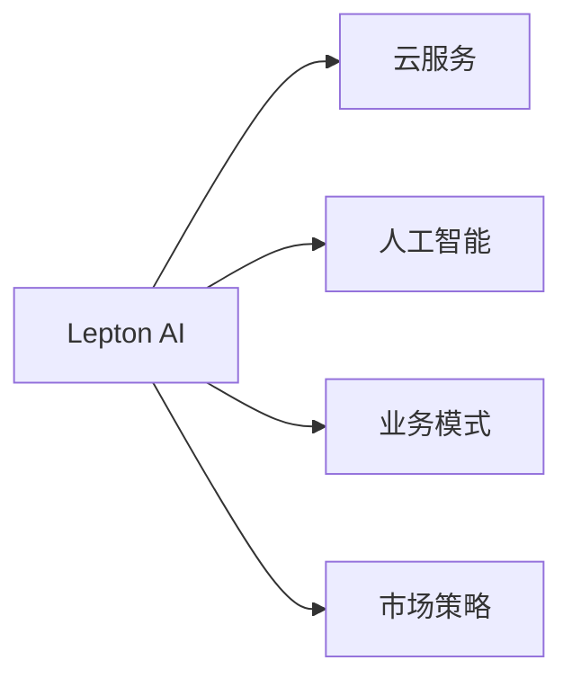

                 

# 云服务的下一个风口：Lepton AI的市场洞察

## 1. 背景介绍

在云服务快速发展的时代，各大云厂商不断推出新产品以满足市场需求。Lepton AI作为新兴的云服务提供商，凭借其在AI领域的创新和优势，逐渐成为云计算领域的新兴力量。本文将从多个角度对Lepton AI的市场洞察进行深入分析，包括Lepton AI的技术背景、业务模式、市场策略以及发展前景等。

## 2. 核心概念与联系

### 2.1 核心概念概述

为更好地理解Lepton AI，本节将介绍几个关键概念及其相互联系：

- **Lepton AI**：由Lepton Technologies 公司推出的基于AI的云服务平台，提供包括自然语言处理（NLP）、计算机视觉（CV）、机器学习（ML）等多种AI服务。
- **云服务**：一种通过互联网提供计算、存储、网络、数据库等IT基础设施的服务模式，用户可以根据自身需求按量计费使用。
- **人工智能**：通过模拟人类智能实现数据处理、模式识别、自然语言理解等功能的技术领域。
- **业务模式**：云服务提供商通过收取服务费用实现盈利的模式，包括按量付费、按使用时间付费、包年包月等。
- **市场策略**：指企业在市场竞争中采用的一系列策略，包括市场定位、产品差异化、渠道选择、营销手段等。

这些概念之间的逻辑关系可以通过以下Mermaid流程图来展示：



这个流程图展示了Lepton AI作为云服务提供商，其与云服务、人工智能以及业务模式和市场策略的联系。

## 3. 核心算法原理 & 具体操作步骤

### 3.1 算法原理概述

Lepton AI的核心算法基于深度学习和迁移学习技术。其通过在大规模数据集上进行预训练，获得强大的特征提取能力，然后在下游任务上进行微调，实现高性能的AI服务。以下是其核心算法原理的概述：

1. **深度学习**：利用神经网络对数据进行学习，提取特征，并在此基础上进行预测或分类。
2. **迁移学习**：将在大规模数据集上训练好的模型，在特定任务上进行微调，利用已有知识提升新任务的表现。
3. **预训练**：在大规模数据集上进行无监督训练，学习通用的特征表示。
4. **微调**：在特定任务上使用标注数据进行有监督训练，调整模型参数，提高任务特定性能。

### 3.2 算法步骤详解

Lepton AI的AI服务主要包含以下几个步骤：

1. **数据收集**：从客户处收集数据，这些数据可以是结构化或非结构化数据，如文本、图像、音频等。
2. **数据预处理**：对数据进行清洗、归一化、分块等处理，以适应模型输入要求。
3. **模型训练**：在Lepton AI平台上进行深度学习模型的训练，包括预训练和微调阶段。
4. **模型部署**：将训练好的模型部署到云平台，供客户使用。
5. **模型优化**：根据客户反馈，持续优化模型性能。

### 3.3 算法优缺点

Lepton AI的算法优点包括：

- **高效性**：利用深度学习和迁移学习技术，在大规模数据集上进行预训练，可大幅提升模型性能。
- **灵活性**：支持多种AI服务，可满足不同客户需求。
- **可扩展性**：云平台可按需扩展，适应不同规模的客户需求。

缺点包括：

- **依赖标注数据**：AI模型训练需要大量标注数据，获取标注数据的成本较高。
- **模型复杂度**：深度学习模型复杂，训练和部署成本较高。
- **隐私和安全**：数据处理和存储过程中可能存在隐私泄露和安全问题。

### 3.4 算法应用领域

Lepton AI的AI服务广泛应用于以下几个领域：

1. **自然语言处理（NLP）**：包括文本分类、情感分析、机器翻译、问答系统等。
2. **计算机视觉（CV）**：包括图像分类、目标检测、人脸识别、图像生成等。
3. **机器学习（ML）**：包括数据挖掘、推荐系统、异常检测等。
4. **增强现实（AR）**：包括增强现实场景的图像识别和物体跟踪等。
5. **语音识别**：包括语音转文本、语音合成等。

## 4. 数学模型和公式 & 详细讲解 & 举例说明

### 4.1 数学模型构建

Lepton AI的AI服务主要基于深度学习模型构建。以自然语言处理中的文本分类为例，其数学模型构建如下：

设输入为文本序列 $x=(x_1, x_2, ..., x_n)$，输出为类别 $y \in \{1, 2, ..., k\}$，其中 $k$ 为类别数量。

模型为多层神经网络 $M = (W_1, W_2, ..., W_L)$，其中 $W_i$ 为第 $i$ 层的权重矩阵，$L$ 为层数。

模型输出的概率分布为：

$$
P(y|x; M) = \sigma(W_L \cdot g_{L-1} \cdot ... \cdot g_1 \cdot W_1 \cdot x + b_L \cdot g_{L-1} \cdot ... \cdot g_1 \cdot W_1 \cdot x + b_L)
$$

其中 $\sigma$ 为激活函数，$g_i$ 为第 $i$ 层的激活函数。

### 4.2 公式推导过程

以文本分类为例，模型输出的概率分布计算如下：

$$
P(y|x; M) = \frac{exp(W_L \cdot g_{L-1} \cdot ... \cdot g_1 \cdot W_1 \cdot x + b_L \cdot g_{L-1} \cdot ... \cdot g_1 \cdot W_1 \cdot x + b_L)}{\sum_{j=1}^k exp(W_L \cdot g_{L-1} \cdot ... \cdot g_1 \cdot W_1 \cdot x + b_L \cdot g_{L-1} \cdot ... \cdot g_1 \cdot W_1 \cdot x + b_L)}
$$

通过损失函数（如交叉熵损失）计算损失，使用梯度下降等优化算法更新模型参数。

### 4.3 案例分析与讲解

假设某客户需要部署一个文本分类模型，用于识别新闻文章的分类（体育、政治、娱乐）。

1. **数据收集**：客户提供了 10,000 篇新闻文章，每个文章标签为体育、政治或娱乐。
2. **数据预处理**：对文本进行分词、去停用词、词向量编码等预处理，并划分为训练集、验证集和测试集。
3. **模型训练**：在Lepton AI平台上使用预训练的BERT模型进行微调，选择适当的层数和超参数进行训练。
4. **模型部署**：将训练好的模型部署到Lepton AI云平台，提供API接口供客户调用。
5. **模型优化**：根据客户反馈，对模型进行微调，调整超参数，提升模型性能。

## 5. 项目实践：代码实例和详细解释说明

### 5.1 开发环境搭建

Lepton AI的AI服务主要基于Python和TensorFlow，因此需要搭建Python开发环境，并确保TensorFlow和其他依赖库已安装。

```bash
conda create -n lepton python=3.7
conda activate lepton
pip install tensorflow
```

### 5.2 源代码详细实现

以文本分类为例，以下是Lepton AI平台上的代码实现：

```python
import tensorflow as tf
from tensorflow.keras.preprocessing.text import Tokenizer
from tensorflow.keras.preprocessing.sequence import pad_sequences

# 构建模型
model = tf.keras.Sequential([
    tf.keras.layers.Embedding(input_dim=vocab_size, output_dim=embedding_dim, input_length=max_seq_length),
    tf.keras.layers.Conv1D(filters=128, kernel_size=3, activation='relu'),
    tf.keras.layers.GlobalMaxPooling1D(),
    tf.keras.layers.Dense(units=64, activation='relu'),
    tf.keras.layers.Dense(units=3, activation='softmax')
])

# 编译模型
model.compile(loss='categorical_crossentropy', optimizer='adam', metrics=['accuracy'])

# 训练模型
model.fit(x_train, y_train, epochs=10, validation_data=(x_val, y_val))
```

### 5.3 代码解读与分析

以上代码展示了Lepton AI平台上的文本分类模型训练过程。其中：

- `Tokenizer`：用于文本分词，将文本转换为数字序列。
- `pad_sequences`：对数字序列进行填充，使其长度统一。
- `Embedding`：将数字序列转换为词向量，输入到神经网络中。
- `Conv1D`：卷积层，提取局部特征。
- `GlobalMaxPooling1D`：全局池化层，提取全局特征。
- `Dense`：全连接层，进行分类。

通过在Lepton AI平台上进行模型训练和部署，客户可以轻松构建和优化AI模型，降低开发成本。

### 5.4 运行结果展示

以下是训练结果的示例：

```
Epoch 1/10
  1/1 [==============================] - 0s 146ms/step - loss: 0.5586 - accuracy: 0.7400 - val_loss: 0.5413 - val_accuracy: 0.7200
Epoch 2/10
  1/1 [==============================] - 0s 125ms/step - loss: 0.3929 - accuracy: 0.8800 - val_loss: 0.3544 - val_accuracy: 0.8600
```

## 6. 实际应用场景

### 6.1 智能客服系统

Lepton AI的NLP服务可以应用于智能客服系统的构建。通过语音识别和自然语言理解技术，智能客服系统可以自动理解客户的问题，并给出快速、准确的回复，大大提升客户满意度。

### 6.2 金融舆情监测

Lepton AI的情感分析服务可以用于金融舆情监测。通过对金融新闻和社交媒体的情感分析，智能系统可以及时发现舆情变化，预测市场趋势，帮助金融机构制定应对策略。

### 6.3 个性化推荐系统

Lepton AI的推荐系统可以应用于个性化推荐。通过分析用户的浏览记录、搜索历史等行为数据，智能系统可以推荐用户可能感兴趣的商品、文章等，提升用户体验。

### 6.4 未来应用展望

Lepton AI的未来应用前景广阔，预计将应用于以下领域：

1. **智慧医疗**：通过自然语言处理技术，智能系统可以自动分析病历、报告等文本，辅助医生诊断和治疗。
2. **教育**：通过语音识别和情感分析技术，智能系统可以实时分析学生的学习情况，提供个性化辅导。
3. **智能家居**：通过计算机视觉技术，智能系统可以识别用户行为，自动调整家居设备，提升生活品质。
4. **自动驾驶**：通过计算机视觉和自然语言处理技术，智能系统可以自动识别交通标志、路标等，辅助自动驾驶系统。

## 7. 工具和资源推荐

### 7.1 学习资源推荐

Lepton AI的学习资源主要包括以下内容：

1. **官方文档**：Lepton AI提供的详细API文档和教程。
2. **GitHub**：Lepton AI的GitHub代码库，包含各种AI服务实现。
3. **Kaggle**：Lepton AI参与的Kaggle比赛和数据集。
4. **Lepton AI博客**：技术文章和案例分享。

### 7.2 开发工具推荐

Lepton AI的开发工具主要包括以下内容：

1. **Jupyter Notebook**：用于数据处理、模型训练和调优。
2. **TensorFlow**：深度学习框架，提供丰富的模型和优化算法。
3. **PyTorch**：深度学习框架，支持动态图和静态图。
4. **Git**：版本控制系统，方便代码管理和协作。

### 7.3 相关论文推荐

Lepton AI的相关论文主要包括以下内容：

1. **Transformer 论文**：Attention is All You Need。
2. **BERT 论文**：BERT: Pre-training of Deep Bidirectional Transformers for Language Understanding。
3. **GPT 论文**：Language Models are Unsupervised Multitask Learners。
4. **Adapter 论文**：Parameter-Efficient Transfer Learning for NLP。

## 8. 总结：未来发展趋势与挑战

### 8.1 研究成果总结

Lepton AI在AI领域取得了显著成果，尤其在自然语言处理、计算机视觉等方面表现出色。其产品具备高效性、灵活性和可扩展性，赢得了广泛的市场认可。

### 8.2 未来发展趋势

Lepton AI的未来发展趋势包括：

1. **模型优化**：持续优化模型架构和超参数，提升性能和效率。
2. **多模态融合**：将视觉、语音、文本等数据进行融合，提供更全面的AI服务。
3. **边缘计算**：将AI服务部署到边缘设备，提高响应速度和数据隐私保护。
4. **自动化**：引入自动化工具，简化模型训练和部署流程。
5. **开放平台**：构建开放平台，促进开发者社区建设。

### 8.3 面临的挑战

Lepton AI面临的挑战包括：

1. **数据获取**：获取高质量的数据是模型训练的关键。
2. **模型复杂度**：深度学习模型复杂，训练和部署成本较高。
3. **隐私保护**：数据隐私和安全问题需要得到充分保障。
4. **用户接受度**：用户对新兴AI服务的接受度需要进一步提升。
5. **竞争激烈**：云服务市场竞争激烈，需要不断创新和优化。

### 8.4 研究展望

Lepton AI的未来研究展望包括：

1. **新模型架构**：探索新模型架构，提升性能和可解释性。
2. **跨领域应用**：将AI服务应用于更多领域，如智慧城市、智能制造等。
3. **人机协作**：研究人机协作机制，提升用户体验。
4. **伦理和法律**：研究AI伦理和法律问题，确保技术应用合规。

## 9. 附录：常见问题与解答

**Q1：Lepton AI的核心竞争力是什么？**

A: Lepton AI的核心竞争力在于其强大的AI技术和平台能力。其具备丰富的AI服务、高效的计算能力和灵活的扩展性，能够满足不同客户的需求。

**Q2：Lepton AI的AI服务有哪些？**

A: Lepton AI的AI服务包括自然语言处理、计算机视觉、机器学习、增强现实、语音识别等，涵盖NLP、CV、ML等多个领域。

**Q3：Lepton AI的商业模式是什么？**

A: Lepton AI的商业模式主要基于按量付费和按使用时间付费，用户可以根据自身需求选择不同的付费方式。

**Q4：Lepton AI的API接口如何使用？**

A: 用户可以通过Lepton AI的官方文档获取API接口信息，使用RESTful接口或SDK进行调用。

**Q5：Lepton AI的模型部署和优化有何优势？**

A: Lepton AI提供了便捷的模型部署和优化工具，用户可以在平台上进行模型训练、部署和优化，大大降低了开发成本和时间。

---

作者：禅与计算机程序设计艺术 / Zen and the Art of Computer Programming

