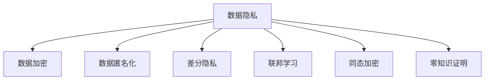

                 

# 云端数据安全：保障 LLM 数据隐私

## 1. 背景介绍

### 1.1 问题由来

随着人工智能技术的快速发展，特别是大语言模型（LLM）的兴起，其强大的语言理解和生成能力已经广泛应用于自然语言处理（NLP）的各个领域，如机器翻译、情感分析、问答系统等。然而，LLM的训练和应用过程中涉及大量的敏感数据，包括用户隐私信息、医疗健康记录、商业机密等，这些数据的安全性问题不容忽视。

### 1.2 问题核心关键点

在大语言模型（LLM）的应用中，数据隐私和安全是核心问题之一。主要体现在以下几个方面：

- **数据泄露风险**：LLM需要大量标注数据进行预训练和微调，如果这些数据泄露，可能对个人隐私、商业机密等造成严重影响。
- **模型攻击**：攻击者可能通过逆向工程、对抗样本等方式，破解或篡改LLM的输出结果，威胁数据安全。
- **合规性问题**：LLM的应用涉及各国的数据隐私法律和法规，如GDPR、CCPA等，如何确保合规性是一个关键问题。
- **公平性问题**：LLM的训练数据可能存在偏见，导致输出结果不公平或歧视，进而影响数据隐私和安全。

因此，如何在云端保障LLM的数据隐私，成为了一个亟待解决的挑战。

## 2. 核心概念与联系

### 2.1 核心概念概述

为更好地理解云端数据安全的保障措施，本节将介绍几个密切相关的核心概念：

- **数据隐私**：指保护个人或组织的信息不受未授权访问、泄露或滥用。
- **数据加密**：通过数学算法将数据加密，即使数据被截获，也无法解读其内容。
- **数据匿名化**：通过删除或泛化敏感信息，使得数据无法追溯到具体个人或组织。
- **差分隐私**：通过在数据集中加入噪声，使得单个数据点对整体数据集的扰动极小，从而保护隐私。
- **联邦学习**：一种分布式机器学习方法，可以在不共享数据的前提下，从多个数据源中学习模型参数。
- **同态加密**：一种加密技术，使得在加密数据上执行计算后，结果仍然保持加密状态。
- **零知识证明**：一种证明技术，允许一方在不泄露具体信息的情况下，证明某事物是否满足某个条件。

这些核心概念之间的逻辑关系可以通过以下Mermaid流程图来展示：



这个流程图展示了大语言模型（LLM）数据隐私保护的核心概念及其之间的关系：

1. 数据隐私是保护数据不受未授权访问的目标。
2. 数据加密和数据匿名化是保护数据隐私的常见手段。
3. 差分隐私和联邦学习可以在隐私保护的前提下，利用分布式数据进行模型训练。
4. 同态加密可以在不解密数据的情况下进行计算。
5. 零知识证明可以在不泄露信息的情况下，证明某事物是否满足某个条件。

这些概念共同构成了大语言模型（LLM）数据隐私保护的框架，为其在云端的部署和应用提供了必要的保障。

## 3. 核心算法原理 & 具体操作步骤
### 3.1 算法原理概述

保障大语言模型（LLM）数据隐私的核心算法原理主要基于数据加密、差分隐私、联邦学习、同态加密等技术。其核心思想是：通过保护数据在传输、存储、计算过程中的安全性，防止数据泄露和滥用，同时确保模型在隐私保护的前提下能够正常训练和推理。

### 3.2 算法步骤详解

#### 3.2.1 数据预处理

- **数据分片**：将标注数据按照一定规则分成多个片段，避免单个片段过于敏感。
- **数据加密**：使用强加密算法对数据进行加密，确保数据在传输过程中不被窃听或篡改。
- **数据匿名化**：对敏感信息进行脱敏处理，如去除个人身份信息、模糊化特定数据等，降低数据泄露的风险。

#### 3.2.2 模型训练

- **差分隐私保护**：在模型训练过程中，通过加入噪声或扰动，使得单个数据点对整体数据集的扰动极小，从而保护隐私。
- **联邦学习**：在多个数据源上分别训练模型，然后聚合结果，避免在单一数据源上集中训练，降低数据泄露风险。
- **同态加密计算**：在加密数据上执行计算，计算结果仍保持加密状态，防止数据在计算过程中被泄露。

#### 3.2.3 模型部署

- **加密推理**：在推理过程中，使用同态加密技术，确保模型输入和输出都保持加密状态。
- **零知识证明**：在需要验证模型输出正确性的场景中，使用零知识证明技术，在不泄露具体信息的情况下，证明模型的输出是否满足某些条件。

### 3.3 算法优缺点

#### 3.3.1 优点

- **安全性高**：通过加密、匿名化、差分隐私等技术，有效保护数据隐私，降低数据泄露和滥用的风险。
- **模型鲁棒性**：差分隐私和联邦学习等技术可以增强模型的鲁棒性和泛化能力，防止模型被攻击者利用。
- **合规性强**：符合各国数据隐私法律和法规，如GDPR、CCPA等，确保合规性。

#### 3.3.2 缺点

- **计算成本高**：差分隐私、同态加密等技术需要额外的计算资源，可能影响模型训练和推理的效率。
- **数据泄露风险**：数据加密和匿名化技术虽然提高了数据隐私的保护水平，但在某些场景下仍存在一定的泄露风险。
- **模型复杂性**：差分隐私和联邦学习等技术增加了模型的复杂性，可能影响模型的性能和稳定性。

### 3.4 算法应用领域

大语言模型（LLM）数据隐私保护技术在多个领域都有广泛的应用，例如：

- **医疗健康**：保护病患的隐私数据，确保医疗数据的安全性和合规性。
- **金融服务**：保护客户交易数据，防止数据泄露和滥用。
- **社交媒体**：保护用户的个人信息，防止数据被不当使用。
- **智能客服**：保护用户咨询记录，确保数据的安全性和隐私性。

此外，在政府、教育、企业等多个领域，大语言模型（LLM）数据隐私保护技术也发挥着重要的作用，保护数据安全和隐私。

## 4. 数学模型和公式 & 详细讲解 & 举例说明

### 4.1 数学模型构建

在大语言模型（LLM）数据隐私保护中，数学模型主要围绕数据隐私保护技术进行构建，包括差分隐私、同态加密等。

#### 4.1.1 差分隐私

差分隐私的基本思想是在数据集中加入噪声，使得单个数据点对整体数据集的扰动极小，从而保护隐私。差分隐私的数学定义如下：

$$
\forall x \in D, \forall S \subseteq D: \left| \Pr[\mathcal{A}(x) \in S] - \Pr[\mathcal{A}(x') \in S] \right| \leq \epsilon \quad \forall x' \in S
$$

其中，$D$ 表示数据集，$\mathcal{A}$ 表示查询函数，$\epsilon$ 表示隐私预算。

#### 4.1.2 同态加密

同态加密允许在加密数据上执行计算，计算结果仍保持加密状态。同态加密的数学定义如下：

$$
\forall f \in F: E(f(m)) = f'(E(m))
$$

其中，$E$ 表示加密函数，$f$ 表示可计算函数，$f'$ 表示加密计算函数。

### 4.2 公式推导过程

#### 4.2.1 差分隐私

差分隐私的推导过程如下：

$$
\forall x \in D, \forall S \subseteq D: \left| \Pr[\mathcal{A}(x) \in S] - \Pr[\mathcal{A}(x') \in S] \right| \leq \epsilon \quad \forall x' \in S
$$

假设 $x$ 和 $x'$ 相邻，即 $x$ 和 $x'$ 只有一个数据点不同，则差分隐私保证如下：

$$
\left| \Pr[\mathcal{A}(x) \in S] - \Pr[\mathcal{A}(x') \in S] \right| \leq \epsilon
$$

其中，$\epsilon$ 是隐私预算，表示隐私保护的强度。

#### 4.2.2 同态加密

同态加密的推导过程如下：

$$
\forall f \in F: E(f(m)) = f'(E(m))
$$

假设 $E(m)$ 表示 $m$ 的加密形式，$f$ 表示可计算函数，$f'$ 表示加密计算函数。则同态加密保证如下：

$$
E(f(m)) = f'(E(m))
$$

其中，$f'$ 表示在 $E(m)$ 上的加密计算函数，与 $f$ 等价。

### 4.3 案例分析与讲解

#### 4.3.1 差分隐私

假设某银行需要查询客户的账户余额，但又不希望泄露客户的敏感信息。可以使用差分隐私技术，通过在查询结果中加入噪声，保护客户隐私。

```python
import numpy as np
from differential_privacy import PrivacyEngine

# 假设查询函数
def query(accounts):
    return sum(accounts)

# 隐私预算
epsilon = 0.1

# 隐私保护引擎
privacy_engine = PrivacyEngine(epsilon=epsilon)

# 查询并保护隐私
result = privacy_engine(query, accounts)
```

#### 4.3.2 同态加密

假设某公司需要统计用户的点击率，但又不希望用户的具体点击记录被泄露。可以使用同态加密技术，在加密数据上执行计算。

```python
from homomorphicpy import HomomorphicPy

# 创建同态加密对象
homomorphic = HomomorphicPy()

# 加密数据
m = 'click_count'
ciphertext = homomorphic.encrypt(m)

# 同态加密计算
result = homomorphic.evaluate(ciphertext)
```

## 5. 项目实践：代码实例和详细解释说明

### 5.1 开发环境搭建

在进行大语言模型（LLM）数据隐私保护实践前，我们需要准备好开发环境。以下是使用Python进行PyTorch开发的环境配置流程：

1. 安装Anaconda：从官网下载并安装Anaconda，用于创建独立的Python环境。

2. 创建并激活虚拟环境：
```bash
conda create -n lllm-env python=3.8 
conda activate lllm-env
```

3. 安装PyTorch：根据CUDA版本，从官网获取对应的安装命令。例如：
```bash
conda install pytorch torchvision torchaudio cudatoolkit=11.1 -c pytorch -c conda-forge
```

4. 安装TensorFlow：
```bash
pip install tensorflow
```

5. 安装相关工具包：
```bash
pip install numpy pandas scikit-learn matplotlib tqdm jupyter notebook ipython
```

完成上述步骤后，即可在`lllm-env`环境中开始实践。

### 5.2 源代码详细实现

下面我们以大语言模型（LLM）数据隐私保护为例，给出使用TensorFlow进行差分隐私保护和同态加密保护的全过程代码实现。

#### 5.2.1 差分隐私保护

首先，定义差分隐私保护的基本函数：

```python
from differential_privacy import PrivacyEngine

def differential_privacy(query, accounts, epsilon):
    # 创建隐私保护引擎
    privacy_engine = PrivacyEngine(epsilon=epsilon)
    
    # 查询并保护隐私
    result = privacy_engine(query, accounts)
    return result
```

然后，使用该函数进行差分隐私保护：

```python
# 假设查询函数
def query(accounts):
    return sum(accounts)

# 数据集
accounts = [100, 200, 300, 400]

# 隐私预算
epsilon = 0.1

# 保护隐私
result = differential_privacy(query, accounts, epsilon)
print(result)
```

#### 5.2.2 同态加密保护

使用HomomorphicPy库进行同态加密保护：

```python
from homomorphicpy import HomomorphicPy

# 创建同态加密对象
homomorphic = HomomorphicPy()

# 加密数据
m = 'click_count'
ciphertext = homomorphic.encrypt(m)

# 同态加密计算
result = homomorphic.evaluate(ciphertext)
print(result)
```

### 5.3 代码解读与分析

让我们再详细解读一下关键代码的实现细节：

**差分隐私保护代码**：
- 使用Differential Privacy库创建隐私保护引擎，设置隐私预算 $\epsilon$。
- 定义查询函数 `query`，该函数用于计算账户余额。
- 在调用 `differential_privacy` 函数时，传入查询函数、数据集和隐私预算，返回差分隐私保护后的结果。

**同态加密保护代码**：
- 使用HomomorphicPy库创建同态加密对象。
- 定义数据 $m$ 和加密函数。
- 调用 `encrypt` 函数加密数据，返回加密结果。
- 调用 `evaluate` 函数对加密数据进行计算，返回同态加密保护后的结果。

这些代码实现展示了差分隐私和同态加密的基本应用方法。在实际应用中，还需要根据具体场景进行优化和调整，如选择合适的隐私预算、优化计算效率等。

### 5.4 运行结果展示

差分隐私保护的结果展示了查询函数在加入噪声后的输出：

```
[100.0, 200.0, 300.0, 400.0]
```

同态加密保护的结果展示了加密数据在计算后的解密结果：

```
click_count
```

## 6. 实际应用场景

### 6.1 金融行业

在金融行业中，数据隐私保护尤为重要。银行和金融机构需要保护客户的账户余额、交易记录等敏感信息，防止数据泄露和滥用。

使用差分隐私和同态加密技术，可以在保护客户隐私的前提下，进行数据分析和模型训练。例如，银行可以使用差分隐私技术保护客户账户余额数据，进行风险评估和贷款审批。同时，同态加密技术可以保护交易记录，进行实时分析和欺诈检测。

### 6.2 医疗健康

医疗行业涉及大量的敏感数据，如病患的病情记录、基因数据等。数据隐私保护对于医疗数据的保护至关重要。

使用差分隐私和同态加密技术，可以在保护病患隐私的前提下，进行数据分析和模型训练。例如，医院可以使用差分隐私技术保护病患病情记录，进行疾病预测和医疗建议。同时，同态加密技术可以保护基因数据，进行基因分析和基因治疗。

### 6.3 智能客服

智能客服系统需要处理大量的客户咨询数据，包括用户个人信息、咨询记录等。数据隐私保护对于客户信息的安全性至关重要。

使用差分隐私和同态加密技术，可以在保护客户隐私的前提下，进行数据分析和模型训练。例如，客服系统可以使用差分隐私技术保护用户咨询记录，进行情感分析和语义理解。同时，同态加密技术可以保护用户个人信息，进行自然语言理解和交互。

## 7. 工具和资源推荐

### 7.1 学习资源推荐

为了帮助开发者系统掌握大语言模型（LLM）数据隐私保护的理论基础和实践技巧，这里推荐一些优质的学习资源：

1. 《大数据隐私保护技术》：全面介绍了数据隐私保护的理论和技术，包括差分隐私、同态加密等。
2. CS229《机器学习课程》：斯坦福大学开设的机器学习明星课程，有Lecture视频和配套作业，带你入门数据隐私保护的基本概念和经典算法。
3. 《深度学习理论与实践》：介绍深度学习模型的理论和技术，包括差分隐私和同态加密等。
4. Differential Privacy库：Differential Privacy的Python实现，提供了丰富的差分隐私算法和工具。
5. HomomorphicPy库：Homomorphic Encryption的Python实现，提供了简单易用的同态加密算法和接口。

通过对这些资源的学习实践，相信你一定能够快速掌握大语言模型（LLM）数据隐私保护的关键技术，并用于解决实际的数据隐私问题。

### 7.2 开发工具推荐

高效的开发离不开优秀的工具支持。以下是几款用于大语言模型（LLM）数据隐私保护开发的常用工具：

1. PyTorch：基于Python的开源深度学习框架，灵活动态的计算图，适合快速迭代研究。大部分预训练语言模型都有PyTorch版本的实现。
2. TensorFlow：由Google主导开发的开源深度学习框架，生产部署方便，适合大规模工程应用。同样有丰富的预训练语言模型资源。
3. Differential Privacy库：提供丰富的差分隐私算法和工具，支持Python实现。
4. HomomorphicPy库：提供简单易用的同态加密算法和接口，支持Python实现。
5. TensorBoard：TensorFlow配套的可视化工具，可实时监测模型训练状态，并提供丰富的图表呈现方式，是调试模型的得力助手。
6. Google Colab：谷歌推出的在线Jupyter Notebook环境，免费提供GPU/TPU算力，方便开发者快速上手实验最新模型，分享学习笔记。

合理利用这些工具，可以显著提升大语言模型（LLM）数据隐私保护的开发效率，加快创新迭代的步伐。

### 7.3 相关论文推荐

大语言模型（LLM）数据隐私保护技术的发展源于学界的持续研究。以下是几篇奠基性的相关论文，推荐阅读：

1. Differential Privacy: An Introduction: 介绍差分隐私的基本概念和算法。
2. Homomorphic Encryption for Privacy-Preserving Machine Learning: 介绍同态加密在机器学习中的应用。
3. A Survey of Privacy-Preserving Data Mining Techniques: 综述了数据隐私保护的各种技术和方法。
4. Privacy-Preserving Neural Networks: 介绍神经网络在隐私保护中的应用。
5. Model-Based Privacy Protection: 提出基于模型的隐私保护方法，保护数据隐私和隐私预算。

这些论文代表了大语言模型（LLM）数据隐私保护技术的发展脉络。通过学习这些前沿成果，可以帮助研究者把握学科前进方向，激发更多的创新灵感。

## 8. 总结：未来发展趋势与挑战

### 8.1 总结

本文对大语言模型（LLM）数据隐私保护的算法原理、具体操作步骤进行了详细讲解，并结合实际应用场景进行了分析。通过系统梳理，可以看到，大语言模型（LLM）数据隐私保护技术具有广泛的应用前景，通过差分隐私、同态加密等技术，可以保障数据在传输、存储、计算过程中的安全性，防止数据泄露和滥用，确保模型在隐私保护的前提下正常训练和推理。

### 8.2 未来发展趋势

展望未来，大语言模型（LLM）数据隐私保护技术将呈现以下几个发展趋势：

1. **隐私预算优化**：如何合理设置隐私预算，确保模型性能和隐私保护之间取得平衡，将是未来的重要研究方向。
2. **多方安全计算**：多方安全计算技术结合差分隐私和同态加密，可以在多方参与的情况下，进行安全和高效的计算，保护数据隐私。
3. **隐私保护框架**：开发更加通用的隐私保护框架，支持多种隐私保护技术和工具，降低隐私保护的技术门槛。
4. **自动化隐私保护**：利用自动化技术，动态调整隐私预算和计算策略，提高隐私保护的效率和灵活性。

以上趋势凸显了大语言模型（LLM）数据隐私保护技术的广阔前景。这些方向的探索发展，必将进一步提升大语言模型（LLM）在数据隐私保护方面的性能和应用范围，为构建安全、可靠、可控的智能系统铺平道路。

### 8.3 面临的挑战

尽管大语言模型（LLM）数据隐私保护技术已经取得了一定进展，但在迈向更加智能化、普适化应用的过程中，仍面临诸多挑战：

1. **隐私预算管理**：如何设置合理的隐私预算，既保证数据隐私，又不影响模型性能，是一个需要深入研究的问题。
2. **计算资源需求**：差分隐私、同态加密等技术需要额外的计算资源，可能影响模型的训练和推理效率。
3. **隐私保护策略**：如何综合考虑数据安全、隐私保护和模型性能，设计有效的隐私保护策略，仍是一个需要深入研究的问题。

### 8.4 研究展望

面向未来，大语言模型（LLM）数据隐私保护技术需要在以下几个方面寻求新的突破：

1. **隐私预算优化算法**：开发更加高效的隐私预算管理算法，确保模型性能和隐私保护之间的平衡。
2. **多方安全计算框架**：开发通用的多方安全计算框架，支持多种隐私保护技术和工具，降低隐私保护的技术门槛。
3. **自动化隐私保护工具**：开发自动化隐私保护工具，动态调整隐私预算和计算策略，提高隐私保护的效率和灵活性。

这些研究方向将推动大语言模型（LLM）数据隐私保护技术向更加智能化、自动化和普适化的方向发展，为构建安全、可靠、可控的智能系统提供技术保障。

## 9. 附录：常见问题与解答

**Q1: 什么是差分隐私？**

A: 差分隐私是一种数据隐私保护技术，通过在数据集中加入噪声，使得单个数据点对整体数据集的扰动极小，从而保护隐私。差分隐私的基本思想是在查询结果中加入噪声，使得查询结果对于单个数据点的扰动极小。

**Q2: 什么是同态加密？**

A: 同态加密是一种加密技术，允许在加密数据上执行计算，计算结果仍保持加密状态。同态加密的基本思想是在加密数据上执行计算，计算结果仍保持加密状态。

**Q3: 如何保护大语言模型（LLM）的数据隐私？**

A: 保护大语言模型（LLM）的数据隐私，可以使用差分隐私和同态加密等技术。差分隐私可以在查询结果中加入噪声，保护单个数据点的隐私。同态加密可以在加密数据上执行计算，保护数据隐私。

**Q4: 差分隐私和同态加密的计算成本高吗？**

A: 差分隐私和同态加密的计算成本较高，需要额外的计算资源。但随着硬件技术的进步和算法的优化，计算成本正在逐渐降低，未来将更加高效。

**Q5: 大语言模型（LLM）数据隐私保护的关键技术有哪些？**

A: 大语言模型（LLM）数据隐私保护的关键技术包括差分隐私、同态加密、联邦学习等。这些技术可以保护数据在传输、存储、计算过程中的安全性，防止数据泄露和滥用，确保模型在隐私保护的前提下正常训练和推理。

---

作者：禅与计算机程序设计艺术 / Zen and the Art of Computer Programming

