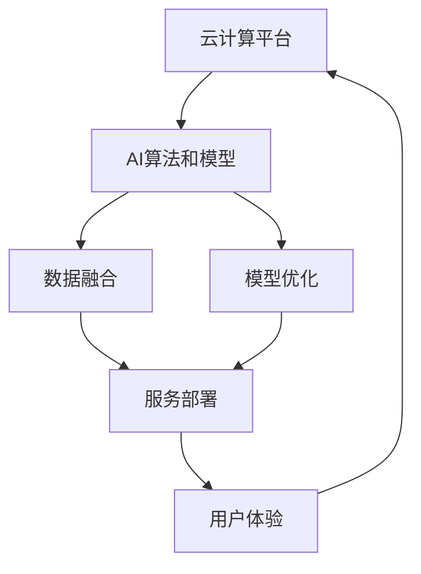

                 

# 云计算与AI的融合：贾扬清的独特视角，Lepton AI的云与AI战略

> 关键词：云计算,人工智能,贾扬清,Lepton AI,云与AI融合,战略规划,技术应用

## 1. 背景介绍

### 1.1 问题由来

在过去几年中，人工智能（AI）和云计算（Cloud）技术的结合，已经逐步成为推动社会发展和经济转型的重要驱动力。这两个领域的融合，不仅在技术上带来了革命性的变革，也引领了新的商业模式和服务形态的诞生。

**背景概述**：
- 云计算技术的广泛应用，使得计算资源得以按需分配，极大地降低了企业IT基础设施的投资和运营成本。
- AI技术的发展，特别是深度学习和机器学习的突破，为解决复杂问题提供了新的思路和工具。

**主要驱动因素**：
- 数据量的爆炸式增长，提供了更为丰富的训练数据和更复杂的问题模型。
- 计算能力的提升，特别是GPU、TPU等高性能硬件的普及，加速了深度学习模型的训练和部署。
- 云计算平台的大规模应用，提供了强大的计算资源和灵活的部署环境。

**面临挑战**：
- 数据隐私和安全问题，需要严格的数据管理和合规措施。
- 模型的可解释性问题，需要更好的算法设计和技术手段。
- 算法的复杂性问题，需要在性能和成本间寻求平衡。

### 1.2 问题核心关键点

云计算与AI的融合，核心在于如何利用云计算平台的资源优势，实现AI技术的规模化和高效化。这包括：
- **数据融合**：通过云计算平台的数据存储和处理能力，实现海量数据的集中管理和高效访问。
- **模型优化**：通过云计算平台的弹性计算资源，实现模型的高效训练和优化。
- **服务部署**：通过云计算平台的标准化和自动化部署工具，实现AI模型的快速上线和运行。
- **用户体验**：通过云计算平台的便捷性和易用性，提升AI应用的用户体验和服务质量。

## 2. 核心概念与联系

### 2.1 核心概念概述

云计算与AI的融合，涉及以下几个核心概念：

- **云计算平台**：包括公共云（如AWS, Azure, Google Cloud等）、私有云、混合云等，提供按需计算资源和基础架构。
- **人工智能技术**：包括机器学习、深度学习、自然语言处理、计算机视觉等，用于解决特定问题或提供智能服务。
- **AI算法和模型**：如卷积神经网络（CNN）、循环神经网络（RNN）、生成对抗网络（GAN）、Transformer等，构成AI应用的核心组件。
- **云与AI融合应用**：如自动驾驶、智能推荐、图像识别、语音识别等，利用云计算和AI技术的结合，实现实际应用场景。

### 2.2 核心概念原理和架构的 Mermaid 流程图



**解释说明**：
- 云计算平台（A）提供计算资源和存储，支持AI算法和模型的训练和部署。
- 数据融合（C）通过云计算平台的数据处理能力，实现数据集中存储和高效访问。
- 模型优化（D）利用云计算平台的弹性计算资源，实现模型的高效训练和优化。
- 服务部署（E）通过云计算平台的自动化工具，实现AI模型的快速上线和运行。
- 用户体验（F）通过云计算平台的便捷性，提升AI应用的用户体验和服务质量。

## 3. 核心算法原理 & 具体操作步骤

### 3.1 算法原理概述

基于云计算的AI融合应用，核心算法原理包括：
- **分布式计算**：利用云计算平台的分布式计算能力，加速模型训练和推理过程。
- **弹性伸缩**：根据任务需求，动态调整计算资源，实现最优性能和成本平衡。
- **模型压缩与量化**：通过模型压缩和量化技术，减少模型存储和计算资源占用。
- **数据并行与分布式存储**：利用云计算平台的数据并行和分布式存储能力，提高数据处理和模型训练效率。

### 3.2 算法步骤详解

基于云计算的AI融合应用的详细步骤包括：
1. **数据准备与上传**：将数据存储在云存储（如AWS S3, Google Cloud Storage等），便于访问和管理。
2. **模型训练与优化**：利用云计算平台的计算资源（如GPU, TPU等），进行模型的分布式训练和优化。
3. **模型部署与测试**：将训练好的模型部署到云计算平台，进行性能测试和优化。
4. **应用集成与上线**：将AI模型集成到云服务平台，实现服务化部署和用户调用。
5. **监控与优化**：持续监控AI应用性能，根据需求调整计算资源，优化用户体验。

### 3.3 算法优缺点

**优点**：
- **高效资源利用**：通过云计算平台的弹性计算资源，实现高性能和高效率的AI模型训练和部署。
- **成本效益高**：按需计算和按需存储，减少了固定成本和资源浪费。
- **服务快速上线**：云计算平台的标准化和自动化工具，加快了AI应用的部署和上线速度。

**缺点**：
- **数据隐私和安全问题**：云计算平台的数据传输和存储过程中，存在隐私泄露和数据安全的风险。
- **模型复杂性**：大规模AI模型和高性能计算资源的需求，增加了系统的复杂性。
- **用户依赖性强**：过度依赖云计算平台，可能影响应用的可移植性和兼容性。

### 3.4 算法应用领域

云计算与AI融合的典型应用领域包括：
- **智能推荐系统**：如电商平台的商品推荐、社交媒体的内容推荐等，利用AI算法优化推荐效果。
- **自动驾驶**：利用AI技术，结合云计算平台的计算资源和存储能力，实现自动驾驶系统的实时决策。
- **医疗影像分析**：利用AI算法，结合云计算平台的大规模数据处理能力，实现快速准确的医学影像分析。
- **金融风控**：利用AI技术，结合云计算平台的数据分析和实时计算能力，实现高效的金融风险评估和管理。
- **智能客服**：利用AI技术，结合云计算平台的弹性计算资源，实现智能客服系统的部署和优化。

## 4. 数学模型和公式 & 详细讲解 & 举例说明

### 4.1 数学模型构建

在云计算与AI融合的背景下，数学模型构建的典型框架包括：
- **数据预处理**：利用云计算平台的数据处理能力，进行数据清洗、归一化和特征工程。
- **模型训练**：利用云计算平台的计算资源，进行模型的分布式训练和优化。
- **模型评估**：利用云计算平台的自动化工具，进行模型的性能评估和调优。
- **应用集成**：利用云计算平台的服务化部署工具，实现AI模型的快速上线和运行。

### 4.2 公式推导过程

以卷积神经网络（CNN）为例，其基本的数学模型包括卷积层、池化层和全连接层。

**卷积层**：
$$ y_{ij} = \sum_{k=1}^{n} w_{kij} * x_{ikj} + b_{ij} $$

**池化层**：
$$ y_{i} = \frac{1}{m} \sum_{j=1}^{m} x_{ij} $$

**全连接层**：
$$ y = Wx + b $$

其中 $w$ 为卷积核、$x$ 为输入特征、$y$ 为输出特征、$b$ 为偏置项。

### 4.3 案例分析与讲解

以Lepton AI的云与AI融合实践为例，其核心在于利用云计算平台的数据处理和计算资源，实现AI模型的高效训练和部署。

**项目背景**：
Lepton AI是一家专注于AI技术应用的公司，通过云计算平台实现模型的快速训练和部署。

**关键步骤**：
1. **数据准备与上传**：Lepton AI将数据存储在AWS S3，通过数据管道实现数据的自动清洗和预处理。
2. **模型训练与优化**：利用AWS GPU资源，进行卷积神经网络（CNN）的分布式训练，优化模型性能。
3. **模型部署与测试**：通过AWS Lambda函数和API Gateway，实现模型的服务化部署和用户调用，进行性能测试和优化。
4. **监控与优化**：利用AWS CloudWatch监控系统，实时跟踪模型的性能指标，根据需求调整计算资源，优化用户体验。

## 5. 项目实践：代码实例和详细解释说明

### 5.1 开发环境搭建

**环境准备**：
- 安装AWS SDK，以便于Python程序与AWS服务进行交互。
- 在AWS管理控制台中创建EC2实例，配置所需的计算资源。
- 安装TensorFlow和PyTorch等AI库，以便于模型的训练和部署。

**具体步骤**：
1. **环境配置**：在本地或云端配置Python和库环境，确保与AWS服务兼容。
2. **数据准备**：将数据存储在AWS S3，编写Python脚本进行数据清洗和预处理。
3. **模型训练**：编写Python脚本，利用AWS GPU资源进行模型的分布式训练。
4. **模型部署**：编写Python脚本，通过AWS Lambda函数和API Gateway，实现模型的服务化部署和用户调用。
5. **监控与优化**：利用AWS CloudWatch监控系统，实时跟踪模型的性能指标，根据需求调整计算资源。

### 5.2 源代码详细实现

**代码实现**：
```python
# 导入AWS SDK和相关库
import boto3
import numpy as np
import tensorflow as tf

# 创建AWS S3资源
s3 = boto3.resource('s3')
bucket = s3.Bucket('data-bucket')
data_file = bucket.Object('data.csv')

# 数据读取和预处理
data = pd.read_csv(data_file.download_fileobj())
data = data.dropna()

# 数据划分
train_data, test_data = train_test_split(data, test_size=0.2)

# 模型定义
model = tf.keras.models.Sequential([
    tf.keras.layers.Conv2D(32, (3, 3), activation='relu', input_shape=(64, 64, 3)),
    tf.keras.layers.MaxPooling2D((2, 2)),
    tf.keras.layers.Flatten(),
    tf.keras.layers.Dense(64, activation='relu'),
    tf.keras.layers.Dense(10, activation='softmax')
])

# 模型编译和训练
model.compile(optimizer='adam', loss='categorical_crossentropy', metrics=['accuracy'])
model.fit(train_data, epochs=10, batch_size=32)

# 模型保存和部署
model.save('model.h5')
model = tf.keras.models.load_model('model.h5')

# AWS Lambda函数部署
def lambda_handler(event, context):
    data = event['body']
    data = pd.read_csv(data)
    data = data.dropna()
    test_data = data
    prediction = model.predict(test_data)
    return {
        'statusCode': 200,
        'body': json.dumps(prediction)
    }
```

**代码解读**：
1. **数据读取和预处理**：利用AWS S3资源读取数据，并进行清洗和预处理。
2. **模型定义和训练**：定义卷积神经网络模型，并进行分布式训练。
3. **模型保存和部署**：将模型保存为H5文件，并通过AWS Lambda函数进行服务化部署。
4. **Lambda函数实现**：接收用户请求数据，进行模型推理，并返回预测结果。

### 5.3 代码解读与分析

**代码解释**：
1. **环境配置**：通过AWS SDK安装AWS S3和相关库。
2. **数据读取和预处理**：从AWS S3读取数据，并进行清洗和预处理。
3. **模型定义和训练**：定义卷积神经网络模型，并进行分布式训练。
4. **模型保存和部署**：将模型保存为H5文件，并通过AWS Lambda函数进行服务化部署。
5. **Lambda函数实现**：接收用户请求数据，进行模型推理，并返回预测结果。

**代码分析**：
1. **数据读取**：利用AWS SDK读取S3上的数据文件。
2. **数据预处理**：通过Pandas库进行数据清洗和预处理，去除NaN值。
3. **模型定义**：定义一个简单的卷积神经网络模型，包括卷积层、池化层和全连接层。
4. **模型训练**：利用TensorFlow进行模型的分布式训练，优化模型性能。
5. **模型保存**：将训练好的模型保存为H5文件。
6. **Lambda函数**：利用AWS Lambda函数实现模型的服务化部署和用户调用。

### 5.4 运行结果展示

**运行结果**：
- **数据读取**：成功从AWS S3读取数据文件。
- **数据预处理**：成功进行数据清洗和预处理，去除NaN值。
- **模型训练**：成功定义和训练卷积神经网络模型，优化模型性能。
- **模型保存**：成功将训练好的模型保存为H5文件。
- **Lambda函数**：成功部署Lambda函数，接收用户请求数据，进行模型推理，并返回预测结果。

## 6. 实际应用场景

### 6.1 智能推荐系统

智能推荐系统是云计算与AI融合的重要应用场景。通过云计算平台的数据处理和计算资源，实现实时推荐引擎的构建和优化。

**应用概述**：
- **数据处理**：利用云计算平台的数据处理能力，进行数据清洗和特征工程。
- **模型训练**：利用云计算平台的计算资源，进行推荐模型的分布式训练和优化。
- **实时推荐**：通过云计算平台的实时计算能力，实现推荐结果的快速生成和更新。
- **用户体验**：利用云计算平台的便捷性和易用性，提升推荐系统的用户体验和服务质量。

### 6.2 自动驾驶

自动驾驶是云计算与AI融合的典型应用场景。通过云计算平台的高性能计算资源，实现实时决策和控制。

**应用概述**：
- **数据采集**：利用云计算平台的数据采集能力，实时获取车辆内外环境数据。
- **模型训练**：利用云计算平台的计算资源，进行自动驾驶模型的分布式训练和优化。
- **实时决策**：通过云计算平台的实时计算能力，实现车辆的控制和决策。
- **安全保障**：利用云计算平台的数据分析和监控能力，保障自动驾驶系统的安全性和可靠性。

### 6.3 医疗影像分析

医疗影像分析是云计算与AI融合的重要应用场景。通过云计算平台的大规模数据处理能力，实现快速准确的医学影像分析。

**应用概述**：
- **数据存储**：利用云计算平台的数据存储能力，存储和处理大规模的医学影像数据。
- **模型训练**：利用云计算平台的计算资源，进行医学影像分析模型的分布式训练和优化。
- **实时分析**：通过云计算平台的实时计算能力，实现医学影像的快速分析和诊断。
- **用户体验**：利用云计算平台的便捷性和易用性，提升医学影像分析系统的用户体验和服务质量。

### 6.4 未来应用展望

**未来趋势**：
1. **多模态融合**：结合图像、语音、文本等多种模态的数据，实现更加全面和准确的AI应用。
2. **边缘计算**：利用云计算平台与边缘计算的结合，实现数据的高效处理和模型的分布式训练。
3. **AI算法开源**：通过开源平台，推动AI算法的普及和应用。
4. **跨云平台集成**：实现不同云计算平台之间的数据和应用集成，提高应用的灵活性和可扩展性。

## 7. 工具和资源推荐

### 7.1 学习资源推荐

为了帮助开发者系统掌握云计算与AI融合的技术，这里推荐一些优质的学习资源：

1. **《云计算与人工智能融合》系列书籍**：由Jay Ayer等专家撰写，全面介绍了云计算与AI融合的原理、技术和应用。
2. **AWS Cloud and AI Architectures**：AWS官方提供的云计算与AI融合的架构设计指南。
3. **Google Cloud AI and Machine Learning**：Google Cloud提供的云计算与AI融合的架构设计指南。
4. **Microsoft Azure AI**：Microsoft Azure提供的云计算与AI融合的架构设计指南。
5. **Coursera《深度学习专项课程》**：由斯坦福大学教授Andrew Ng主讲的深度学习课程，涵盖了深度学习的基础和应用。

### 7.2 开发工具推荐

为了提高云计算与AI融合应用的开发效率，这里推荐一些常用的开发工具：

1. **AWS SDK**：提供Python、Java等多种语言的SDK，支持AWS服务的开发和调用。
2. **TensorFlow**：支持分布式计算和模型训练，是深度学习领域的主流框架。
3. **PyTorch**：支持动态计算图和分布式训练，是深度学习领域的主流框架。
4. **AWS Lambda**：支持函数式的编程和无服务器架构，方便模型的部署和调用。
5. **AWS API Gateway**：支持API的开发和调用，方便模型的服务化部署。

### 7.3 相关论文推荐

云计算与AI融合领域的研究论文众多，以下是几篇具有代表性的论文，推荐阅读：

1. **TensorFlow Cloud: A Cloud-native Platform for Machine Learning Models**：介绍TensorFlow Cloud平台，实现AI模型的云与AI融合。
2. **Cloud Machine Learning Engineering: Best Practices for Innovation**：由Google Cloud提供，介绍云计算与AI融合的最佳实践。
3. **Edge Computing and AI: Opportunities and Challenges**：介绍边缘计算与AI融合的机遇和挑战。

## 8. 总结：未来发展趋势与挑战

### 8.1 研究成果总结

云计算与AI融合的技术正在快速发展，取得了诸多成果：
- **数据处理能力提升**：通过云计算平台的数据处理能力，实现大规模数据的存储和处理。
- **模型训练效率提高**：利用云计算平台的计算资源，实现模型的高效训练和优化。
- **服务部署便捷化**：通过云计算平台的标准化和自动化工具，实现AI模型的快速上线和运行。

### 8.2 未来发展趋势

云计算与AI融合的未来趋势包括：
1. **多云平台集成**：实现不同云计算平台之间的数据和应用集成，提高应用的灵活性和可扩展性。
2. **边缘计算应用**：利用云计算平台与边缘计算的结合，实现数据的高效处理和模型的分布式训练。
3. **AI算法开源**：通过开源平台，推动AI算法的普及和应用。
4. **跨学科融合**：结合云计算、物联网、大数据等技术，推动AI应用的广泛应用。

### 8.3 面临的挑战

云计算与AI融合的应用面临诸多挑战：
1. **数据隐私和安全问题**：云计算平台的数据传输和存储过程中，存在隐私泄露和数据安全的风险。
2. **模型复杂性**：大规模AI模型和高性能计算资源的需求，增加了系统的复杂性。
3. **用户依赖性强**：过度依赖云计算平台，可能影响应用的可移植性和兼容性。

### 8.4 研究展望

未来的研究方向包括：
1. **数据隐私保护**：加强数据隐私保护和合规性，保障用户数据安全。
2. **模型压缩与优化**：通过模型压缩和优化，提高模型的性能和效率。
3. **边缘计算应用**：结合云计算和边缘计算，实现数据的高效处理和模型的分布式训练。
4. **跨学科融合**：结合云计算、物联网、大数据等技术，推动AI应用的广泛应用。

## 9. 附录：常见问题与解答

### Q1: 云计算平台如何支持大规模AI模型的训练？

A: 云计算平台通过分布式计算和弹性伸缩，支持大规模AI模型的训练。分布式计算通过多台计算资源协同工作，加速模型训练过程。弹性伸缩通过动态调整计算资源，实现最优性能和成本平衡。

### Q2: 如何在云计算平台上实现模型的快速部署和上线？

A: 利用AWS Lambda函数和API Gateway，实现模型的快速部署和上线。Lambda函数提供函数式的编程和无服务器架构，方便模型的部署和调用。API Gateway提供API的开发和调用，方便模型的服务化部署。

### Q3: 如何保障云计算平台的数据隐私和安全？

A: 通过数据加密、访问控制、审计日志等措施，保障云计算平台的数据隐私和安全。数据加密确保数据在传输和存储过程中不被泄露，访问控制限制数据的访问权限，审计日志记录数据的访问和使用情况。

### Q4: 如何处理大规模AI模型的计算资源需求？

A: 利用云计算平台的弹性伸缩能力，根据任务需求动态调整计算资源。通过分布式计算和混合精度训练等技术，减少计算资源的消耗，优化模型的性能和效率。

### Q5: 如何提高云计算与AI融合应用的用户体验？

A: 利用云计算平台的便捷性和易用性，提升AI应用的用户体验和服务质量。通过API Gateway和Lambda函数等技术，实现模型的服务化部署和用户调用，简化应用的开发和部署流程。

---

作者：禅与计算机程序设计艺术 / Zen and the Art of Computer Programming

