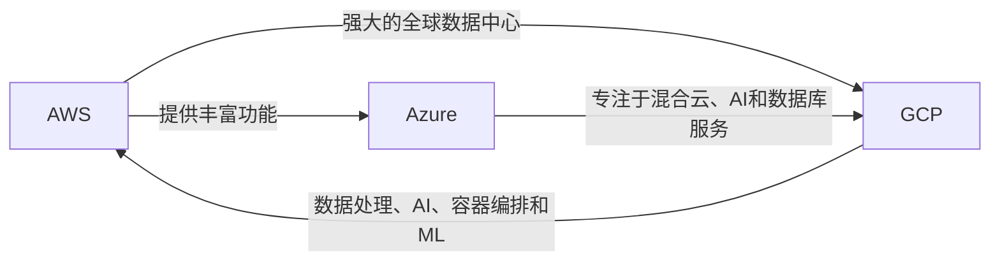

                 

# 云计算架构：AWS、Azure与GCP对比

云计算是当今数字化转型的关键基础设施，各大云提供商AWS、Azure、GCP各具特色，在功能、性能、安全性等方面都有其独特优势。本文将深入探讨这三大云架构之间的异同，帮助用户选择最合适的云服务提供商。

## 1. 背景介绍

云计算已经从初期的探索阶段迈向了成熟应用阶段，各大云提供商相继推出了全面且深入的服务体系，满足了各行各业对于云服务的需求。AWS、Azure与GCP，作为全球云市场的领军者，它们各自在云计算市场具有显著影响力。选择一家合适的云服务提供商，对于企业的数字化转型至关重要。

## 2. 核心概念与联系

### 2.1 核心概念概述

云计算是一种通过互联网提供可扩展的计算资源和服务，按需支付的模式。它允许企业以更低成本、更高效的方式来部署和运行应用程序，而无需购买和维护物理硬件。

AWS、Azure与GCP是全球三大云服务提供商，它们在服务范围、技术栈、市场份额等方面有显著差异。AWS是全球最大的云计算提供商，以其丰富服务、强大功能和广泛的市场影响力占据主导地位。Azure是微软推出的云服务，专注于混合云、人工智能和数据库服务，致力于为企业提供安全、可靠的数据中心和云平台。GCP是由Google提供的云服务，以数据处理、人工智能、容器编排和机器学习等技术见长。

这三家云服务提供商之间存在着广泛的互操作性，允许用户在不同的云平台之间无缝迁移和扩展其应用程序。

### 2.2 核心概念原理和架构的 Mermaid 流程图(Mermaid 流程节点中不要有括号、逗号等特殊字符)



## 3. 核心算法原理 & 具体操作步骤

### 3.1 算法原理概述

云计算架构的核心是服务提供商提供的各种云服务，包括基础设施即服务(IaaS)、平台即服务(PaaS)、软件即服务(SaaS)。这些服务通过RESTful API进行访问，支持弹性扩展和自动故障恢复。

AWS、Azure与GCP在云服务架构上有着显著差异，主要体现在以下几个方面：

- **服务组合**：AWS提供超过200项服务，包括计算、存储、数据库、网络、人工智能、安全等。Azure专注于混合云、人工智能和数据库服务，拥有Azure Virtual Machines、Azure SQL Database等特色服务。GCP以数据处理、人工智能、容器编排和机器学习见长，提供Google Kubernetes Engine、Google Cloud AI等核心服务。
- **全球部署**：AWS在全球范围内拥有多个数据中心，能够提供全球化的服务。Azure和GCP也在全球范围内建立数据中心，但规模和分布不及AWS。
- **功能和特性**：AWS和Azure在功能上较为相似，提供虚拟机、负载均衡、数据库等服务。GCP在人工智能、大数据、容器编排等方面具有独特的优势。
- **生态系统**：AWS拥有庞大的第三方生态系统，提供丰富的云服务集成和解决方案。Azure与微软的其它产品如Windows Server、Visual Studio紧密集成。GCP和Google其它产品如Google Analytics、Google Ads等深度整合。

### 3.2 算法步骤详解

云架构的搭建步骤如下：

1. **选择云提供商**：根据企业的需求和预算，选择适合的云服务提供商。
2. **规划云资源**：根据应用程序的需求，规划虚拟机、存储、网络等资源。
3. **部署应用程序**：使用云提供商提供的资源，部署应用程序并配置安全、网络等参数。
4. **监控和优化**：实时监控云环境，优化性能和资源使用效率。

### 3.3 算法优缺点

**AWS的优缺点**：

- **优点**：丰富的服务组合、强大的全球数据中心、高度可扩展性、成熟的市场生态系统。
- **缺点**：费用较高，管理复杂。

**Azure的优缺点**：

- **优点**：专注于混合云、AI和数据库服务、良好的跨平台支持、与微软产品的紧密集成。
- **缺点**：相比AWS，提供的服务相对较少，全球部署不如AWS。

**GCP的优缺点**：

- **优点**：强大的数据处理和AI能力、领先的大数据和机器学习技术、灵活的定价策略。
- **缺点**：相比AWS和Azure，提供的服务较少，全球部署不及AWS。

### 3.4 算法应用领域

AWS、Azure与GCP广泛应用于各类行业，包括金融、零售、医疗、制造业等。各行业根据自身需求，选择合适的云服务，利用云平台提供的计算、存储、网络、安全等服务，实现业务数字化转型。

## 4. 数学模型和公式 & 详细讲解 & 举例说明

### 4.1 数学模型构建

云计算的数学模型可以表示为：

\[ C = C_0 + \sum_{i=1}^{n} \alpha_iC_i \]

其中，$C$ 为总成本，$C_0$ 为固定成本，$C_i$ 为第$i$项服务的成本，$\alpha_i$ 为第$i$项服务的权重。

### 4.2 公式推导过程

计算成本时，需要将各项服务的成本加权求和，并考虑云资源的灵活配置和需求变化。对于混合云环境，成本模型更为复杂，需要考虑云间迁移和资源优化。

### 4.3 案例分析与讲解

以一个Web应用为例，假设使用AWS的EC2和S3服务，计算公式如下：

\[ C = C_0 + \alpha_{EC2}C_{EC2} + \alpha_{S3}C_{S3} \]

其中，$C_{EC2}$ 和 $C_{S3}$ 分别为EC2和S3服务的成本，$\alpha_{EC2}$ 和 $\alpha_{S3}$ 分别为EC2和S3服务的权重。

假设EC2实例的价格为$0.1$，S3存储的价格为$0.01$，总成本为$100$，则：

\[ C = 100 + 10 \times 0.1 + 10 \times 0.01 = 110 \]

通过优化权重和资源配置，可以进一步降低成本。

## 5. 项目实践：代码实例和详细解释说明

### 5.1 开发环境搭建

搭建云计算开发环境的步骤如下：

1. 安装云提供商提供的SDK和CLI工具。
2. 创建和管理云资源，如虚拟机、存储、网络等。
3. 部署应用程序，并使用云平台提供的API进行管理。
4. 配置安全和监控，确保应用程序的稳定运行。

### 5.2 源代码详细实现

以下是使用AWS SDK在Python中创建和管理EC2实例的代码实现：

```python
import boto3

ec2 = boto3.resource('ec2')

# 创建实例
instances = ec2.create_instances(
    ImageId='ami-0c55b159cbfafe1f0', # 指定AMI
    MinCount=1,
    MaxCount=1,
    InstanceType='t2.micro'
)

# 启动实例
instances[0].start()

# 获取实例状态
instance = ec2.Instance(id=instances[0].id)
print(instance.state['Name'])

# 停止实例
instance.stop()
```

### 5.3 代码解读与分析

上述代码使用AWS SDK创建了一个EC2实例，并对其进行了启动、获取状态和停止等操作。AWS SDK提供了丰富的API，可以方便地管理和操作云资源。

### 5.4 运行结果展示

运行上述代码，可以观察到实例创建、启动、停止的全过程，包括实例状态和操作结果。

## 6. 实际应用场景

### 6.1 智能数据中心管理

智能数据中心管理平台，通过云计算平台提供的API，实时监控和控制数据中心的各种设备，包括服务器、网络设备、存储设备等。通过集中管理，提高数据中心的效率和稳定性。

### 6.2 弹性扩展和负载均衡

云计算平台提供了弹性扩展和负载均衡服务，可以根据业务需求自动调整资源，并实现高可用性。这对于处理突发流量和峰值需求的应用场景非常有用。

### 6.3 自动化运维

云计算平台支持自动化运维工具，如Ansible、Terraform等，可以自动创建、配置和管理云资源，减少人工操作和错误。

### 6.4 未来应用展望

未来的云计算架构将更加智能化、自动化，支持更复杂的应用场景和更多的数据类型。云计算将与边缘计算、物联网、人工智能等技术深度融合，实现更广泛的数字化应用。

## 7. 工具和资源推荐

### 7.1 学习资源推荐

- **AWS官方文档**：提供丰富的学习资源，包括文档、指南、教程等。
- **Azure文档**：与微软其他产品紧密集成，提供详尽的文档和API支持。
- **GCP文档**：专注于数据处理、人工智能和机器学习，提供深度学习框架TensorFlow等。

### 7.2 开发工具推荐

- **AWS CLI**：命令行工具，方便管理云资源。
- **Azure CLI**：命令行工具，提供丰富功能。
- **GCP SDK**：提供Python、Java、Go等多种语言支持。

### 7.3 相关论文推荐

- **云计算环境下的资源调度研究**：探讨如何在云计算环境中优化资源调度。
- **混合云架构设计**：研究如何构建高效的混合云架构，提高资源利用率。
- **云平台的安全性和隐私保护**：探讨云计算平台的安全性和隐私保护措施。

## 8. 总结：未来发展趋势与挑战

### 8.1 研究成果总结

云计算架构已经成为现代企业数字化转型的重要基础设施，AWS、Azure与GCP各具特色，满足了不同行业的云服务需求。

### 8.2 未来发展趋势

- **多云管理**：支持多云管理和跨云迁移，实现更灵活的资源配置。
- **自动化运维**：提供更智能、更自动化的运维工具，减少人工干预。
- **边缘计算**：与边缘计算结合，支持更广泛的物理位置计算需求。
- **安全性和隐私保护**：增强云平台的安全性和隐私保护措施。

### 8.3 面临的挑战

- **成本控制**：如何在确保性能的同时，有效控制云资源使用成本。
- **数据隐私**：如何在数据存储、传输和处理中保护用户隐私。
- **跨平台兼容性**：如何实现跨平台和跨云环境的兼容性和互操作性。
- **自动化运维**：如何自动化运维工具实现更高效的资源配置和调度。

### 8.4 研究展望

云计算架构的未来发展方向包括：

- **智能化决策**：通过机器学习和人工智能技术，优化资源配置和调度。
- **跨云协同**：实现多云协同，提升资源利用率和应用效率。
- **混合云应用**：支持混合云架构，实现更灵活的资源管理和应用部署。
- **自动化运维**：提供更智能、更自动化的运维工具，提升运维效率。

## 9. 附录：常见问题与解答

**Q1：如何选择适合企业的云服务提供商？**

A: 选择云服务提供商应根据企业的业务需求、预算、安全性等综合考虑。一般来说，应选择提供丰富服务、强大功能和可靠性的云服务提供商。

**Q2：如何降低云计算成本？**

A: 降低云计算成本的方法包括：
1. 优化资源配置，避免资源浪费。
2. 使用自动化工具，减少人工操作。
3. 选择合适的云服务套餐，合理控制成本。

**Q3：云计算的安全性如何保障？**

A: 云计算平台提供多层次的安全措施，包括身份认证、数据加密、访问控制等。企业应根据自身需求，选择合适的安全策略，并定期进行安全审计。

**Q4：云计算的适用场景有哪些？**

A: 云计算适用于各类数字化场景，包括企业应用、互联网应用、物联网应用等。企业应根据自身需求，选择合适的云计算解决方案。

**Q5：如何实现跨云迁移？**

A: 实现跨云迁移需要考虑多个云平台之间的互操作性，利用云迁移工具，如AWS Database Migration Service等，可以实现数据和应用的平滑迁移。

---

作者：禅与计算机程序设计艺术 / Zen and the Art of Computer Programming

